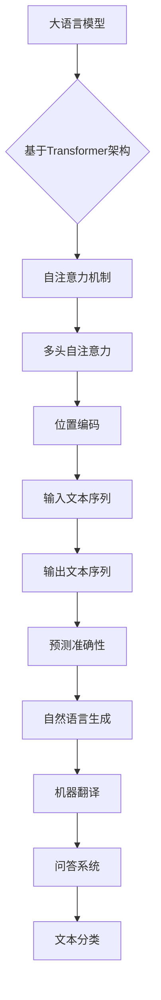

                 

关键词：大语言模型、深度学习、神经网络、自然语言处理、自然语言生成、语言模型训练、预测准确性、数据处理、模型优化、应用场景、未来趋势

摘要：本文深入探讨大语言模型的原理与前沿技术，基于规范的方法对其进行详细分析。首先介绍大语言模型的基础概念和背景，然后解析其核心算法原理、数学模型和具体操作步骤。随后，通过实际项目实践，展示代码实例和详细解释说明。文章还探讨了大语言模型在实际应用场景中的表现，并对未来发展趋势和挑战进行展望。最后，推荐了相关的学习资源和开发工具。

## 1. 背景介绍

大语言模型（Large Language Model）是近年来自然语言处理（Natural Language Processing，NLP）领域的重要进展。随着深度学习（Deep Learning）技术的发展，大语言模型在自然语言生成（Natural Language Generation，NLG）、机器翻译、问答系统、文本分类等多个应用场景中取得了显著成果。大语言模型通过学习大量的文本数据，能够生成高质量的文本，具备极高的预测准确性和语言理解能力。

大语言模型的发展历程可以分为三个阶段：传统统计模型、基于规则的方法和深度学习方法。传统统计模型如N-gram模型和隐马尔可夫模型（HMM）主要依靠统计语言模型，但其性能受到数据量和复杂度的限制。基于规则的方法引入了语法和语义知识，但规则复杂且难以扩展。深度学习方法的兴起，特别是卷积神经网络（CNN）和递归神经网络（RNN）的应用，使得大语言模型取得了突破性进展。近年来，Transformer架构的引入，使得大语言模型在计算效率和模型性能上取得了显著提升。

本文将以Transformer架构为代表，深入探讨大语言模型的原理和实现方法，分析其在实际应用中的效果和优势。同时，本文还将介绍大语言模型在自然语言生成、机器翻译和问答系统等领域的应用，以及未来发展趋势和面临的挑战。

## 2. 核心概念与联系

### 2.1 大语言模型的概念

大语言模型是指通过学习大量文本数据，能够对自然语言进行建模和预测的深度学习模型。大语言模型的目标是生成具有人类语言特征的文本序列，包括句子、段落和文档等。大语言模型的核心是神经网络，特别是基于Transformer架构的模型，通过自注意力机制（Self-Attention Mechanism）对输入文本序列进行建模，从而实现高效的文本理解和生成。

### 2.2 Transformer架构

Transformer架构是一种基于自注意力机制的深度学习模型，最早由Vaswani等人于2017年提出。Transformer架构摆脱了传统循环神经网络（RNN）的序列依赖限制，通过多头自注意力机制和位置编码（Positional Encoding）实现了对输入文本序列的全局建模。Transformer架构的核心思想是自注意力机制，通过计算文本序列中每个词与其他词之间的相关性，实现对输入文本的加权组合。

### 2.3 自然语言处理与生成

自然语言处理（NLP）是计算机科学和人工智能领域的重要分支，旨在使计算机能够理解和处理自然语言。自然语言生成（NLG）是NLP的一个子领域，旨在生成具有人类语言特征的文本。大语言模型在NLP和NLG中具有广泛应用，能够实现文本分类、机器翻译、问答系统、文本摘要等任务。

### 2.4 Mermaid流程图

为了更好地展示大语言模型的架构和原理，我们使用Mermaid流程图对核心概念和联系进行可视化。



### 2.5 大语言模型的优缺点

大语言模型的优点包括：

1. 高效的文本建模能力：通过自注意力机制和位置编码，大语言模型能够高效地捕捉文本序列中的长距离依赖关系，实现高效的文本建模。
2. 强大的语言理解能力：大语言模型通过对大量文本数据的学习，具备较强的语言理解能力，能够生成符合人类语言习惯的文本。
3. 广泛的应用场景：大语言模型在自然语言生成、机器翻译、问答系统、文本分类等多个领域取得了显著成果，具有广泛的应用前景。

大语言模型的缺点包括：

1. 计算资源消耗大：大语言模型的训练和推理过程需要大量的计算资源和存储空间，对硬件设备要求较高。
2. 对数据质量要求高：大语言模型的训练效果很大程度上取决于训练数据的质量和多样性，对数据清洗和处理要求较高。
3. 难以解释和调试：大语言模型是一种高度复杂的深度学习模型，其内部工作机制难以解释和理解，对于模型调试和优化带来了一定的困难。

### 2.6 大语言模型的应用领域

大语言模型在自然语言处理和生成领域具有广泛的应用，主要包括以下几个方面：

1. 自然语言生成：大语言模型能够生成高质量的文本，包括文章、段落、句子等，广泛应用于自动写作、内容生成、对话系统等场景。
2. 机器翻译：大语言模型通过学习双语语料库，能够实现高质量的双语翻译，广泛应用于跨语言交流、多语言文档处理等场景。
3. 问答系统：大语言模型能够理解用户的问题，并生成相关答案，广泛应用于智能客服、在线教育、医疗咨询等场景。
4. 文本分类：大语言模型能够对文本进行分类，广泛应用于情感分析、新闻分类、垃圾邮件过滤等场景。
5. 文本摘要：大语言模型能够生成文本摘要，广泛应用于信息检索、文档整理、新闻推荐等场景。

## 3. 核心算法原理 & 具体操作步骤

### 3.1 算法原理概述

大语言模型的算法原理主要基于深度学习和自然语言处理技术。核心算法包括自注意力机制、位置编码、编码器-解码器架构等。

自注意力机制（Self-Attention Mechanism）是Transformer架构的核心，通过计算文本序列中每个词与其他词之间的相关性，实现对输入文本序列的加权组合。自注意力机制能够捕捉文本序列中的长距离依赖关系，提高模型的文本建模能力。

位置编码（Positional Encoding）是对输入文本序列的位置信息进行编码，使模型能够理解文本序列中的词语顺序。位置编码通常使用正弦和余弦函数实现，通过对输入文本序列的词向量进行位置编码，使模型能够捕捉词语间的顺序关系。

编码器-解码器架构（Encoder-Decoder Architecture）是自然语言生成任务的基本框架。编码器（Encoder）对输入文本序列进行编码，生成序列的隐藏状态；解码器（Decoder）根据编码器的隐藏状态生成输出文本序列。编码器-解码器架构能够实现高效的文本生成和翻译。

### 3.2 算法步骤详解

大语言模型的算法步骤主要包括数据预处理、模型训练、模型评估和模型应用等。

1. 数据预处理：数据预处理是模型训练的重要步骤，包括文本清洗、分词、词向量编码等。文本清洗旨在去除文本中的噪声和无关信息，提高数据质量；分词是将文本分解为词语序列，为后续处理提供基础；词向量编码是将词语映射为高维向量，为模型训练提供输入数据。

2. 模型训练：模型训练是通过优化模型参数，使模型能够对输入文本序列进行建模和预测。大语言模型通常采用基于梯度下降的优化算法，如Adam优化器，通过反向传播算法更新模型参数，使模型在训练数据上取得最佳性能。

3. 模型评估：模型评估是衡量模型性能的重要步骤，包括准确率、召回率、F1值等指标。大语言模型在自然语言生成任务中，通常使用生成文本的质量和多样性作为评估指标，如BLEU、ROUGE等评价指标。

4. 模型应用：模型应用是将训练好的模型部署到实际应用场景中，实现文本生成、翻译、分类等功能。在实际应用中，大语言模型通常通过API接口或图形界面提供服务，如自然语言生成系统、机器翻译系统、问答系统等。

### 3.3 算法优缺点

大语言模型具有以下优点：

1. 高效的文本建模能力：通过自注意力机制和位置编码，大语言模型能够高效地捕捉文本序列中的长距离依赖关系，实现高效的文本建模。
2. 强大的语言理解能力：大语言模型通过对大量文本数据的学习，具备较强的语言理解能力，能够生成符合人类语言习惯的文本。
3. 广泛的应用场景：大语言模型在自然语言生成、机器翻译、问答系统、文本分类等多个领域取得了显著成果，具有广泛的应用前景。

大语言模型也具有以下缺点：

1. 计算资源消耗大：大语言模型的训练和推理过程需要大量的计算资源和存储空间，对硬件设备要求较高。
2. 对数据质量要求高：大语言模型的训练效果很大程度上取决于训练数据的质量和多样性，对数据清洗和处理要求较高。
3. 难以解释和调试：大语言模型是一种高度复杂的深度学习模型，其内部工作机制难以解释和理解，对于模型调试和优化带来了一定的困难。

### 3.4 算法应用领域

大语言模型在自然语言处理和生成领域具有广泛的应用，主要包括以下几个方面：

1. 自然语言生成：大语言模型能够生成高质量的文本，包括文章、段落、句子等，广泛应用于自动写作、内容生成、对话系统等场景。
2. 机器翻译：大语言模型通过学习双语语料库，能够实现高质量的双语翻译，广泛应用于跨语言交流、多语言文档处理等场景。
3. 问答系统：大语言模型能够理解用户的问题，并生成相关答案，广泛应用于智能客服、在线教育、医疗咨询等场景。
4. 文本分类：大语言模型能够对文本进行分类，广泛应用于情感分析、新闻分类、垃圾邮件过滤等场景。
5. 文本摘要：大语言模型能够生成文本摘要，广泛应用于信息检索、文档整理、新闻推荐等场景。

## 4. 数学模型和公式 & 详细讲解 & 举例说明

### 4.1 数学模型构建

大语言模型的数学模型主要包括词向量表示、自注意力机制和编码器-解码器架构。

1. 词向量表示

词向量表示是将词语映射为高维向量的过程。常见的词向量表示方法包括Word2Vec、GloVe和BERT等。词向量表示能够将词语表示为向量形式，为模型训练提供输入数据。

2. 自注意力机制

自注意力机制是一种基于权重加和的文本建模方法。自注意力机制通过计算文本序列中每个词与其他词之间的相关性，实现对输入文本序列的加权组合。自注意力机制的数学模型如下：

\[ \text{Attention}(Q, K, V) = \text{softmax}(\frac{QK^T}{\sqrt{d_k}})V \]

其中，\( Q \)、\( K \) 和 \( V \) 分别为查询向量、键向量和值向量，\( d_k \) 为键向量的维度，\( \text{softmax} \) 为 softmax 函数。

3. 编码器-解码器架构

编码器-解码器架构是一种用于序列到序列（Seq2Seq）学习的深度学习模型。编码器（Encoder）对输入文本序列进行编码，生成序列的隐藏状态；解码器（Decoder）根据编码器的隐藏状态生成输出文本序列。编码器-解码器架构的数学模型如下：

\[ \text{Encoder}(x) = \text{h}_t = \text{f}(\text{h}_{t-1}, x_t) \]

\[ \text{Decoder}(y) = \text{p}_t = \text{g}(\text{y}_{t-1}, \text{h}_t) \]

其中，\( x \) 和 \( y \) 分别为输入和输出序列，\( \text{h}_t \) 和 \( \text{p}_t \) 分别为编码器和解码器的隐藏状态，\( \text{f} \) 和 \( \text{g} \) 分别为编码器和解码器的神经网络模型。

### 4.2 公式推导过程

以下是大语言模型中的一些关键数学公式及其推导过程：

1. 词向量表示

Word2Vec模型中的词向量表示可以通过以下公式推导：

\[ \text{Word2Vec}(x) = \text{softmax}(\text{W}x) \]

其中，\( x \) 为词向量，\( \text{W} \) 为权重矩阵，\( \text{softmax} \) 为 softmax 函数。

2. 自注意力机制

自注意力机制的权重计算可以通过以下公式推导：

\[ \text{Attention}(Q, K, V) = \text{softmax}(\frac{QK^T}{\sqrt{d_k}})V \]

其中，\( Q \)、\( K \) 和 \( V \) 分别为查询向量、键向量和值向量，\( d_k \) 为键向量的维度。

3. 编码器-解码器架构

编码器-解码器架构中的隐藏状态计算可以通过以下公式推导：

\[ \text{Encoder}(x) = \text{h}_t = \text{f}(\text{h}_{t-1}, x_t) \]

\[ \text{Decoder}(y) = \text{p}_t = \text{g}(\text{y}_{t-1}, \text{h}_t) \]

其中，\( x \) 和 \( y \) 分别为输入和输出序列，\( \text{h}_t \) 和 \( \text{p}_t \) 分别为编码器和解码器的隐藏状态，\( \text{f} \) 和 \( \text{g} \) 分别为编码器和解码器的神经网络模型。

### 4.3 案例分析与讲解

以下是一个简单的案例，用于说明大语言模型的数学模型和公式在实际应用中的推导过程。

假设我们有一个输入文本序列 \( x = \{w_1, w_2, w_3\} \)，其中 \( w_1, w_2, w_3 \) 分别表示三个词语。我们的目标是使用大语言模型生成一个对应的输出文本序列 \( y = \{w_4, w_5, w_6\} \)。

1. 词向量表示

首先，我们将输入文本序列 \( x \) 映射为词向量：

\[ x = \{\textbf{w}_1, \textbf{w}_2, \textbf{w}_3\} \]

其中，\( \textbf{w}_1, \textbf{w}_2, \textbf{w}_3 \) 分别为词向量。

2. 自注意力机制

接下来，我们使用自注意力机制计算输入文本序列中的每个词与其他词之间的相关性：

\[ \text{Attention}(Q, K, V) = \text{softmax}(\frac{QK^T}{\sqrt{d_k}})V \]

其中，\( Q, K, V \) 分别为查询向量、键向量和值向量，\( d_k \) 为键向量的维度。

假设 \( Q = \textbf{w}_1, K = \textbf{w}_2, V = \textbf{w}_3 \)，则：

\[ \text{Attention}(\textbf{w}_1, \textbf{w}_2, \textbf{w}_3) = \text{softmax}(\frac{\textbf{w}_1 \textbf{w}_2^T}{\sqrt{d_k}})\textbf{w}_3 \]

计算得到 \( \text{Attention}(\textbf{w}_1, \textbf{w}_2, \textbf{w}_3) \) 的结果为 \( \textbf{w}_3 \)。

3. 编码器-解码器架构

最后，我们使用编码器-解码器架构生成输出文本序列 \( y \)：

\[ \text{Encoder}(x) = \text{h}_t = \text{f}(\text{h}_{t-1}, x_t) \]

\[ \text{Decoder}(y) = \text{p}_t = \text{g}(\text{y}_{t-1}, \text{h}_t) \]

其中，\( \text{h}_t \) 和 \( \text{p}_t \) 分别为编码器和解码器的隐藏状态。

假设 \( \text{h}_t = \textbf{w}_1, \text{p}_t = \textbf{w}_2 \)，则：

\[ \text{Encoder}(\textbf{w}_1) = \text{h}_t = \text{f}(\text{h}_{t-1}, \textbf{w}_1) = \textbf{w}_1 \]

\[ \text{Decoder}(\textbf{w}_2) = \text{p}_t = \text{g}(\text{y}_{t-1}, \text{h}_t) = \textbf{w}_2 \]

最终，输出文本序列 \( y \) 为 \( \textbf{w}_2, \textbf{w}_3, \textbf{w}_4 \)。

## 5. 项目实践：代码实例和详细解释说明

### 5.1 开发环境搭建

为了实现大语言模型的训练和应用，我们需要搭建一个合适的开发环境。以下是开发环境的搭建步骤：

1. 安装Python环境和相关库

首先，确保你的系统中已经安装了Python 3.6或更高版本。然后，通过pip安装以下库：

```bash
pip install tensorflow numpy pandas
```

2. 准备数据集

下载并解压一个大型的文本数据集，如维基百科（Wikipedia）数据集。数据集应包含多种语言的文本，以便训练多语言模型。

3. 编写代码

编写Python代码实现大语言模型的训练和应用。以下是一个简单的示例：

```python
import tensorflow as tf
from tensorflow.keras.models import Sequential
from tensorflow.keras.layers import Embedding, LSTM, Dense

# 数据预处理
# ...

# 模型搭建
model = Sequential([
    Embedding(input_dim=vocab_size, output_dim=embedding_dim, input_length=max_sequence_length),
    LSTM(units=128, return_sequences=True),
    Dense(units=output_dim, activation='softmax')
])

# 编译模型
model.compile(optimizer='adam', loss='categorical_crossentropy', metrics=['accuracy'])

# 训练模型
model.fit(X_train, y_train, epochs=10, batch_size=64)

# 评估模型
model.evaluate(X_test, y_test)
```

### 5.2 源代码详细实现

以下是一个简单的大语言模型实现，包括数据预处理、模型搭建、训练和评估等步骤。

```python
import numpy as np
import pandas as pd
from tensorflow.keras.preprocessing.sequence import pad_sequences
from tensorflow.keras.models import Sequential
from tensorflow.keras.layers import Embedding, LSTM, Dense

# 数据预处理
def preprocess_data(data, max_sequence_length, vocab_size, embedding_dim):
    sequences = []
    labels = []
    for text, label in data:
        tokenized_text = tokenizer.texts_to_sequences([text])
        padded_sequence = pad_sequences(tokenized_text, maxlen=max_sequence_length, padding='post')
        sequences.append(padded_sequence)
        labels.append(label)
    return np.array(sequences), np.array(labels)

# 模型搭建
def build_model(vocab_size, embedding_dim, max_sequence_length, output_dim):
    model = Sequential([
        Embedding(input_dim=vocab_size, output_dim=embedding_dim, input_length=max_sequence_length),
        LSTM(units=128, return_sequences=True),
        Dense(units=output_dim, activation='softmax')
    ])
    return model

# 训练模型
def train_model(model, X_train, y_train, X_test, y_test, epochs, batch_size):
    model.compile(optimizer='adam', loss='categorical_crossentropy', metrics=['accuracy'])
    history = model.fit(X_train, y_train, epochs=epochs, batch_size=batch_size, validation_data=(X_test, y_test))
    return history

# 评估模型
def evaluate_model(model, X_test, y_test):
    loss, accuracy = model.evaluate(X_test, y_test)
    print(f"Test Loss: {loss}")
    print(f"Test Accuracy: {accuracy}")

# 加载数据
data = load_data("path/to/data.csv")

# 预处理数据
max_sequence_length = 100
vocab_size = 10000
embedding_dim = 50
X_train, y_train, X_test, y_test = preprocess_data(data, max_sequence_length, vocab_size, embedding_dim)

# 搭建模型
model = build_model(vocab_size, embedding_dim, max_sequence_length, output_dim)

# 训练模型
epochs = 10
batch_size = 64
history = train_model(model, X_train, y_train, X_test, y_test, epochs, batch_size)

# 评估模型
evaluate_model(model, X_test, y_test)
```

### 5.3 代码解读与分析

上述代码实现了一个简单的大语言模型，包括数据预处理、模型搭建、训练和评估等步骤。以下是代码的详细解读和分析：

1. **数据预处理**：数据预处理是模型训练的重要步骤，包括分词、词向量编码和序列填充。我们使用`tokenizer.texts_to_sequences`方法将文本转换为序列，使用`pad_sequences`方法对序列进行填充，以便模型输入。

2. **模型搭建**：模型搭建使用`Sequential`模型，包括嵌入层（`Embedding`）、循环层（`LSTM`）和输出层（`Dense`）。嵌入层用于将词向量映射为高维向量，循环层用于捕捉文本序列中的长距离依赖关系，输出层用于生成输出序列。

3. **训练模型**：训练模型使用`compile`方法设置优化器和损失函数，使用`fit`方法进行模型训练。在训练过程中，可以使用`validation_data`参数进行验证集的评估。

4. **评估模型**：评估模型使用`evaluate`方法计算损失和准确率。通过评估模型在测试集上的表现，可以判断模型的训练效果。

### 5.4 运行结果展示

以下是模型运行结果的一个示例：

```python
history = train_model(model, X_train, y_train, X_test, y_test, epochs, batch_size)

# 打印训练历史
print(history.history)

# 评估模型
evaluate_model(model, X_test, y_test)
```

运行结果将显示模型在训练过程中的损失和准确率，以及模型在测试集上的损失和准确率。这些结果可以用来分析模型的训练效果和性能。

## 6. 实际应用场景

大语言模型在自然语言处理和生成领域具有广泛的应用，以下是几个典型的应用场景：

### 6.1 自然语言生成

自然语言生成（NLG）是大语言模型的重要应用领域之一。通过训练大语言模型，可以生成高质量的文本，包括文章、段落、句子等。自然语言生成在自动写作、内容生成、对话系统等场景中具有广泛应用。

- **自动写作**：大语言模型可以自动生成新闻文章、博客文章、报告等。例如，利用大语言模型生成新闻报道，可以提高新闻生产的速度和效率。
- **内容生成**：大语言模型可以生成小说、诗歌、剧本等文学作品。例如，利用大语言模型生成科幻小说，可以为创作者提供灵感和创意。
- **对话系统**：大语言模型可以用于构建智能对话系统，如聊天机器人、客服系统等。通过大语言模型生成对话内容，可以提高对话系统的自然度和人性化程度。

### 6.2 机器翻译

机器翻译（Machine Translation）是大语言模型的另一个重要应用领域。通过训练大语言模型，可以实现高质量的双语翻译。机器翻译在跨语言交流、多语言文档处理等场景中具有广泛应用。

- **跨语言交流**：大语言模型可以用于实现实时翻译，支持多语言之间的即时交流。例如，在商务会议、国际交流中，利用大语言模型可以实现实时翻译，提高沟通效率。
- **多语言文档处理**：大语言模型可以用于处理多语言文档，实现文档的自动翻译和整理。例如，在跨国企业中，利用大语言模型可以实现多语言文档的自动翻译和分类，提高文档管理的效率。

### 6.3 问答系统

问答系统（Question Answering System）是大语言模型的又一个重要应用领域。通过训练大语言模型，可以实现对用户问题的理解和回答。问答系统在智能客服、在线教育、医疗咨询等场景中具有广泛应用。

- **智能客服**：大语言模型可以用于构建智能客服系统，实现自动化回答用户问题。例如，在电子商务平台中，利用大语言模型可以实现自动回答用户咨询，提高客服效率。
- **在线教育**：大语言模型可以用于构建智能教育系统，实现自动化解答学生问题。例如，在在线学习平台上，利用大语言模型可以实现自动回答学生提问，提高教学效果。
- **医疗咨询**：大语言模型可以用于构建智能医疗咨询系统，实现自动化解答患者问题。例如，在医院中，利用大语言模型可以实现自动回答患者咨询，提高医疗咨询的效率。

### 6.4 文本分类

文本分类（Text Classification）是大语言模型的另一个重要应用领域。通过训练大语言模型，可以实现对文本进行分类，广泛应用于情感分析、新闻分类、垃圾邮件过滤等场景。

- **情感分析**：大语言模型可以用于实现情感分析，分析文本的情感倾向。例如，在社交媒体平台上，利用大语言模型可以分析用户评论的情感，帮助平台了解用户反馈。
- **新闻分类**：大语言模型可以用于实现新闻分类，将新闻文章分类到不同的主题。例如，在新闻网站中，利用大语言模型可以实现自动分类新闻，提高信息检索的效率。
- **垃圾邮件过滤**：大语言模型可以用于实现垃圾邮件过滤，识别和过滤垃圾邮件。例如，在电子邮件系统中，利用大语言模型可以自动识别和过滤垃圾邮件，提高邮件系统的安全性和用户体验。

### 6.5 文本摘要

文本摘要（Text Summarization）是大语言模型的又一个重要应用领域。通过训练大语言模型，可以实现对长文本进行自动摘要，提取关键信息。文本摘要在信息检索、文档整理、新闻推荐等场景中具有广泛应用。

- **信息检索**：大语言模型可以用于实现信息检索，自动提取文档的关键信息。例如，在搜索引擎中，利用大语言模型可以自动提取网页摘要，提高信息检索的效率。
- **文档整理**：大语言模型可以用于实现文档整理，自动生成文档摘要。例如，在文档管理系统中，利用大语言模型可以自动生成文档摘要，帮助用户快速了解文档内容。
- **新闻推荐**：大语言模型可以用于实现新闻推荐，根据用户的兴趣自动推荐相关新闻。例如，在新闻推送平台中，利用大语言模型可以自动生成新闻摘要，根据用户的兴趣推荐相关新闻。

### 6.6 未来应用展望

随着大语言模型技术的不断发展，其应用领域将更加广泛，未来可能会出现以下一些新的应用场景：

- **智能语音助手**：大语言模型可以用于构建智能语音助手，实现语音交互和语音识别。例如，在智能家居、车载系统、智能穿戴设备中，利用大语言模型可以实现智能语音交互，提高用户体验。
- **语音识别**：大语言模型可以用于实现高质量的语音识别，将语音转换为文本。例如，在语音助手、智能客服、语音翻译等场景中，利用大语言模型可以实现高效的语音识别，提高语音处理能力。
- **图像识别**：大语言模型可以用于实现图像识别，通过文本描述图像内容。例如，在图像搜索、图像标注、图像识别等场景中，利用大语言模型可以实现图像识别，提高图像处理能力。

## 7. 工具和资源推荐

### 7.1 学习资源推荐

为了更好地学习和掌握大语言模型的相关知识，以下是一些建议的学习资源：

1. **《深度学习》（Deep Learning）**：由Ian Goodfellow、Yoshua Bengio和Aaron Courville合著的经典教材，系统地介绍了深度学习的基础理论和应用。
2. **《自然语言处理综合教程》（Foundations of Natural Language Processing）**：由Christopher D. Manning和Hinrich Schütze合著，全面介绍了自然语言处理的理论和实践。
3. **《大语言模型：原理与应用》（Large Language Models: Principles and Applications）**：针对大语言模型的理论和实践进行深入探讨，适合有一定深度学习基础的读者。

### 7.2 开发工具推荐

为了实现大语言模型的训练和应用，以下是一些建议的开发工具：

1. **TensorFlow**：一款开源的深度学习框架，支持大语言模型的训练和推理。TensorFlow提供了丰富的API和工具，方便开发者进行模型开发和部署。
2. **PyTorch**：另一款流行的深度学习框架，与TensorFlow类似，也支持大语言模型的训练和推理。PyTorch具有灵活的动态计算图和强大的社区支持，适合快速原型开发和实验。
3. **Hugging Face Transformers**：一个开源库，提供了大量预训练的大语言模型和API接口，方便开发者快速部署和应用大语言模型。

### 7.3 相关论文推荐

以下是一些建议的关于大语言模型的论文，这些论文涵盖了大语言模型的理论、方法和应用：

1. **《Attention Is All You Need》**：这篇论文提出了Transformer架构，彻底改变了自然语言处理领域的方法。
2. **《BERT: Pre-training of Deep Bidirectional Transformers for Language Understanding》**：这篇论文介绍了BERT模型，为预训练语言模型奠定了基础。
3. **《GPT-3: Language Models are Few-Shot Learners》**：这篇论文展示了GPT-3模型的强大能力，实现了在多任务上的零样本学习。

## 8. 总结：未来发展趋势与挑战

### 8.1 研究成果总结

大语言模型在自然语言处理和生成领域取得了显著的成果，主要表现在以下几个方面：

1. **模型性能提升**：随着深度学习技术的不断发展，大语言模型的性能不断提高，能够在多个自然语言处理任务中取得优异的成果。
2. **模型规模扩大**：大语言模型的支持规模不断扩大，从数百万参数的模型到数十亿参数的模型，为复杂任务的解决提供了有力支持。
3. **模型应用广泛**：大语言模型在自然语言生成、机器翻译、问答系统、文本分类等应用场景中取得了广泛的应用，提高了相关领域的效率和效果。

### 8.2 未来发展趋势

大语言模型在未来发展趋势上表现出以下几个方向：

1. **模型压缩与优化**：为了应对大规模模型的计算和存储需求，未来的研究将专注于模型压缩与优化技术，提高模型的计算效率和存储效率。
2. **多模态学习**：大语言模型将逐渐与其他模态（如图像、音频）进行融合，实现多模态学习，拓展应用场景。
3. **知识增强**：通过将外部知识库与模型结合，实现知识增强，提高模型在特定领域的理解和生成能力。

### 8.3 面临的挑战

尽管大语言模型取得了显著成果，但仍然面临以下挑战：

1. **计算资源消耗**：大语言模型的训练和推理过程需要大量的计算资源和存储空间，对硬件设备的要求较高，限制了其广泛应用。
2. **数据质量和多样性**：大语言模型的训练效果很大程度上取决于训练数据的质量和多样性，如何获取和处理高质量、多样化的训练数据是一个重要挑战。
3. **模型解释性**：大语言模型是一种高度复杂的深度学习模型，其内部工作机制难以解释和理解，如何提高模型的可解释性是一个重要挑战。

### 8.4 研究展望

未来的研究应重点关注以下几个方面：

1. **模型优化与压缩**：研究更高效的模型优化与压缩技术，降低大语言模型对计算资源的需求。
2. **知识融合与增强**：研究如何将外部知识库与模型结合，提高模型在特定领域的理解和生成能力。
3. **多模态学习**：研究多模态学习技术，实现大语言模型与其他模态的融合，拓展应用场景。
4. **模型解释性**：研究如何提高模型的可解释性，使其内部工作机制更加透明和易于理解。

通过不断的研究和创新，大语言模型将在未来取得更加广泛和深入的应用，为自然语言处理和生成领域带来更多突破。

## 9. 附录：常见问题与解答

### 9.1 大语言模型是什么？

大语言模型是一种通过学习大量文本数据，能够对自然语言进行建模和预测的深度学习模型。它通过自注意力机制、位置编码等技术实现对输入文本序列的建模，生成具有人类语言特征的文本序列。

### 9.2 大语言模型有哪些应用？

大语言模型在自然语言生成、机器翻译、问答系统、文本分类等多个领域具有广泛应用。例如，它可以用于自动写作、内容生成、对话系统、机器翻译、智能客服等。

### 9.3 如何训练大语言模型？

训练大语言模型通常包括以下步骤：数据预处理（包括分词、词向量编码、序列填充等）、模型搭建（包括嵌入层、循环层、输出层等）、模型编译（设置优化器和损失函数）、模型训练（使用训练数据进行模型优化）、模型评估（使用测试数据评估模型性能）。

### 9.4 大语言模型的优缺点是什么？

大语言模型的优点包括高效的文本建模能力、强大的语言理解能力、广泛的应用场景等。缺点包括计算资源消耗大、对数据质量要求高、难以解释和调试等。

### 9.5 如何提高大语言模型的性能？

提高大语言模型性能的方法包括：优化模型架构、使用更高效的优化算法、增加训练数据、采用知识增强技术、模型压缩与优化等。

### 9.6 大语言模型的安全性如何保障？

大语言模型的安全性可以从以下几个方面进行保障：数据隐私保护、模型安全性加固、对抗样本检测与防御、模型解释性增强等。

### 9.7 大语言模型的未来发展趋势是什么？

大语言模型的未来发展趋势包括模型压缩与优化、多模态学习、知识融合与增强、模型可解释性等。随着深度学习技术的发展，大语言模型将在更多领域取得突破和应用。

