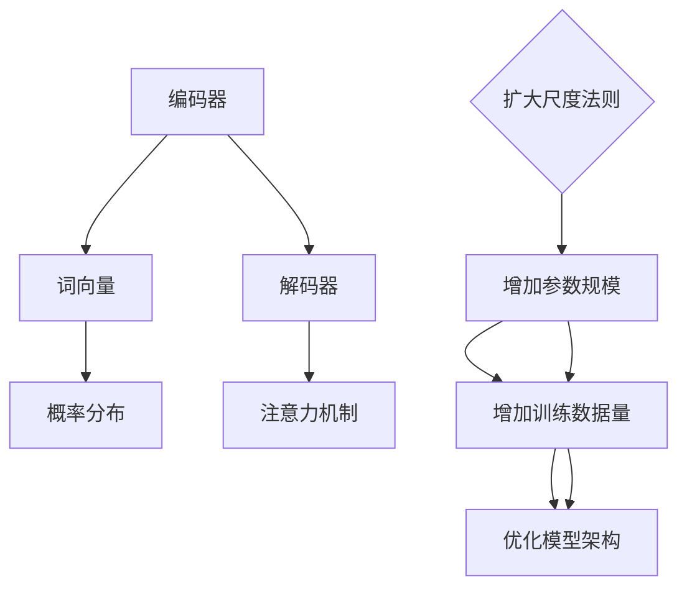

                 

关键词：大语言模型，原理基础，前沿技术，扩大尺度，深度学习

> 摘要：本文旨在深入探讨大语言模型的原理与前沿技术，重点分析其扩大尺度法则，以期为相关领域的研究者和开发者提供有价值的参考。

## 1. 背景介绍

随着互联网和大数据技术的快速发展，自然语言处理（NLP）逐渐成为人工智能领域的一个重要分支。语言模型作为NLP的基础，对文本数据进行建模和分析，使其能够更好地理解和生成自然语言。传统的语言模型，如n-gram模型和基于统计方法的模型，在处理简单文本时具有一定的效果。然而，面对复杂和大规模的文本数据，这些模型表现出了明显的局限性。

为了解决这些问题，研究人员提出了大语言模型（Large Language Model，简称LLM）的概念。大语言模型具有以下几个特点：

1. **大规模参数**：大语言模型通常具有数十亿甚至数万亿个参数，这使得它们能够更好地捕捉语言中的复杂结构和规律。
2. **深度神经网络**：大语言模型通常采用深度神经网络（DNN）或变换器模型（Transformer）等先进的神经网络架构，以提高模型的表示能力和计算效率。
3. **数据驱动**：大语言模型通过大量文本数据进行训练，使其能够更好地理解和生成自然语言。

本文将重点探讨大语言模型的原理、核心算法以及其扩大尺度法则。通过深入分析，我们希望能够揭示大语言模型背后的科学原理，并展望其未来的发展方向。

## 2. 核心概念与联系

### 2.1 语言模型的基本概念

语言模型是一种对自然语言进行建模的算法或模型，用于预测文本序列的概率分布。简单来说，语言模型的目标是给定一个词或一组词，预测下一个词或句子。一个典型的语言模型包含以下核心概念：

- **词汇表**：词汇表是语言模型的基础，包含所有可能的词汇和词组。
- **词向量**：词向量是将词汇映射到高维空间的一种表示方法，用于捕捉词汇之间的相似性和相关性。
- **概率分布**：语言模型通过一个概率分布来预测下一个词或句子的可能性。

### 2.2 大语言模型的架构

大语言模型的架构通常包括以下几个部分：

- **编码器（Encoder）**：编码器负责将输入的文本序列编码成一个固定长度的向量，这个向量包含了文本序列的主要信息。
- **解码器（Decoder）**：解码器基于编码器的输出，生成预测的文本序列。
- **注意力机制（Attention Mechanism）**：注意力机制是一种用于捕捉输入序列中不同部分重要性的机制，有助于提高模型的表示能力和预测准确性。

### 2.3 扩大尺度法则

扩大尺度法则是指通过增加模型的参数规模和训练数据量，来提高语言模型的效果。具体来说，扩大尺度法则包括以下几个步骤：

1. **增加参数规模**：通过增加模型的参数规模，可以更好地捕捉语言中的复杂结构和规律，提高模型的表示能力。
2. **增加训练数据量**：更多的训练数据可以帮助模型更好地理解语言，减少过拟合现象，提高模型的泛化能力。
3. **优化模型架构**：通过优化模型的架构，如引入更多的神经网络层、使用更先进的神经网络架构等，可以提高模型的计算效率和表示能力。

### 2.4 Mermaid 流程图

以下是一个用于描述大语言模型核心概念和扩大尺度法则的Mermaid流程图：



## 3. 核心算法原理 & 具体操作步骤

### 3.1 算法原理概述

大语言模型的核心算法原理基于深度学习，特别是变换器模型（Transformer）。变换器模型是一种基于自注意力机制的神经网络架构，能够有效捕捉输入序列中不同部分之间的关系。变换器模型主要包括以下几个关键组成部分：

1. **嵌入层（Embedding Layer）**：将输入的词向量映射到高维空间，为后续的变换器层提供输入。
2. **多头自注意力机制（Multi-Head Self-Attention Mechanism）**：多头自注意力机制是变换器模型的核心，通过自注意力机制，模型能够自动学习输入序列中不同部分的重要性。
3. **前馈神经网络（Feedforward Neural Network）**：前馈神经网络用于对自注意力机制的输出进行进一步处理，增加模型的非线性表示能力。
4. **输出层（Output Layer）**：输出层根据解码器的输出，生成预测的文本序列。

### 3.2 算法步骤详解

1. **输入文本预处理**：首先，对输入的文本进行预处理，包括分词、去停用词、词向量化等操作，将文本转换为模型可处理的格式。
2. **嵌入层**：将预处理后的词向量输入到嵌入层，将词向量映射到高维空间。
3. **多头自注意力机制**：在多头自注意力机制中，输入序列被分解成多个子序列，每个子序列通过自注意力机制计算得到权重，从而将重要信息进行加权整合。
4. **前馈神经网络**：对自注意力机制的输出进行前馈神经网络处理，增加模型的非线性表示能力。
5. **解码器输出**：解码器基于编码器的输出和自注意力机制的权重，生成预测的文本序列。
6. **损失函数计算**：通过计算预测的文本序列和真实文本序列之间的损失，更新模型的参数。
7. **迭代训练**：重复以上步骤，不断更新模型的参数，直至模型收敛。

### 3.3 算法优缺点

**优点：**
1. **强大的表示能力**：变换器模型通过自注意力机制，能够自动学习输入序列中不同部分的重要性，具有强大的表示能力。
2. **高效的计算性能**：变换器模型采用并行计算方法，能够显著提高计算性能。
3. **广泛的应用场景**：变换器模型在各种自然语言处理任务中表现出色，如机器翻译、文本生成、情感分析等。

**缺点：**
1. **参数规模较大**：由于变换器模型具有多个自注意力机制和前馈神经网络，导致模型参数规模较大，训练和推理过程较为耗时。
2. **对数据依赖性较强**：变换器模型的效果高度依赖训练数据的质量和数量，对训练数据的要求较高。

### 3.4 算法应用领域

变换器模型在自然语言处理领域有广泛的应用，主要包括：

1. **机器翻译**：变换器模型在机器翻译任务中表现出色，能够实现高效、准确的跨语言文本翻译。
2. **文本生成**：变换器模型可以用于生成文本，如自动写作、对话生成等。
3. **情感分析**：变换器模型能够对文本进行情感分析，判断文本的情感倾向。
4. **问答系统**：变换器模型可以用于构建问答系统，实现智能对话。

## 4. 数学模型和公式 & 详细讲解 & 举例说明

### 4.1 数学模型构建

大语言模型的数学模型主要包括词向量表示、自注意力机制和前馈神经网络等组成部分。以下是一个简化的数学模型构建：

- **词向量表示**：词向量是语言模型的基础，用于将词汇映射到高维空间。词向量可以通过词嵌入（Word Embedding）技术进行学习。
  $$ v_w = \text{Word\_Embedding}(w) $$
  其中，$v_w$ 是词 $w$ 的词向量表示。

- **自注意力机制**：自注意力机制通过计算输入序列中每个词与其他词之间的相似性，生成加权向量。自注意力机制的核心是点积注意力（Dot-Product Attention）：
  $$ \text{Attention}(Q, K, V) = \text{softmax}(\frac{QK^T}{\sqrt{d_k}})V $$
  其中，$Q$、$K$ 和 $V$ 分别是查询向量、关键向量和价值向量，$d_k$ 是关键向量的维度。

- **前馈神经网络**：前馈神经网络用于对自注意力机制的输出进行进一步处理，增加模型的非线性表示能力。前馈神经网络可以表示为：
  $$ \text{FFN}(x) = \text{ReLU}(\text{W}_2 \text{ReLU}(\text{W}_1 x + b_1)) + b_2 $$
  其中，$x$ 是输入向量，$W_1$、$W_2$ 和 $b_1$、$b_2$ 分别是前馈神经网络的权重和偏置。

### 4.2 公式推导过程

以下是一个简化的变换器模型的公式推导过程：

1. **嵌入层**：
   $$ X = [\text{Word\_Embedding}(w_1), \text{Word\_Embedding}(w_2), ..., \text{Word\_Embedding}(w_n)] $$

2. **多头自注意力机制**：
   $$ \text{MultiHead}(X) = [\text{Attention}(Q_1, K_1, V_1), ..., \text{Attention}(Q_m, K_m, V_m)] $$
   其中，$Q_i, K_i, V_i$ 分别是第 $i$ 个头部的查询向量、关键向量和价值向量。

3. **前馈神经网络**：
   $$ \text{FFN}(X) = \text{ReLU}(\text{W}_2 \text{ReLU}(\text{W}_1 X + b_1)) + b_2 $$

4. **变换器模型输出**：
   $$ Y = \text{softmax}(\text{V} \text{softmax}(\text{U} X + b)) + b_2 $$

### 4.3 案例分析与讲解

以下是一个简化的变换器模型在文本生成任务中的案例：

1. **输入文本**：假设输入文本为“今天天气很好”。
2. **词向量表示**：将文本中的每个词映射到高维空间，得到词向量表示。
3. **自注意力机制**：通过自注意力机制，计算输入文本中每个词与其他词之间的相似性，生成加权向量。
4. **前馈神经网络**：对自注意力机制的输出进行前馈神经网络处理，增加模型的非线性表示能力。
5. **解码器输出**：解码器根据编码器的输出和自注意力机制的权重，生成预测的文本序列。
6. **损失函数计算**：计算预测的文本序列和真实文本序列之间的损失，更新模型的参数。

通过以上步骤，变换器模型能够生成类似于“今天天气很好，适合出去游玩”的文本。

## 5. 项目实践：代码实例和详细解释说明

### 5.1 开发环境搭建

在开始项目实践之前，我们需要搭建一个适合开发大语言模型的环境。以下是一个简单的开发环境搭建步骤：

1. **安装 Python**：确保已安装 Python 3.7 或以上版本。
2. **安装 PyTorch**：通过 pip 安装 PyTorch，命令如下：
   ```
   pip install torch torchvision
   ```
3. **安装其他依赖**：安装其他必要的依赖，如 numpy、matplotlib 等。

### 5.2 源代码详细实现

以下是一个简化的变换器模型在文本生成任务中的 Python 代码实现：

```python
import torch
import torch.nn as nn
import torch.optim as optim

# 定义变换器模型
class TransformerModel(nn.Module):
    def __init__(self, vocab_size, d_model, n_heads, d_ff):
        super(TransformerModel, self).__init__()
        self.embedding = nn.Embedding(vocab_size, d_model)
        self.transformer = nn.Transformer(d_model, n_heads, d_ff)
        self.output = nn.Linear(d_model, vocab_size)
    
    def forward(self, x):
        x = self.embedding(x)
        x = self.transformer(x)
        x = self.output(x)
        return x

# 初始化模型、优化器和损失函数
model = TransformerModel(vocab_size=10000, d_model=512, n_heads=8, d_ff=2048)
optimizer = optim.Adam(model.parameters(), lr=0.001)
criterion = nn.CrossEntropyLoss()

# 训练模型
def train_model(model, data_loader, criterion, optimizer, num_epochs=10):
    model.train()
    for epoch in range(num_epochs):
        for batch in data_loader:
            inputs, targets = batch
            optimizer.zero_grad()
            outputs = model(inputs)
            loss = criterion(outputs.view(-1, vocab_size), targets.view(-1))
            loss.backward()
            optimizer.step()
            print(f"Epoch [{epoch+1}/{num_epochs}], Loss: {loss.item():.4f}")

# 加载训练数据
train_data = ...  # 加载训练数据
train_loader = ...  # 创建数据加载器

# 开始训练
train_model(model, train_loader, criterion, optimizer)

# 保存模型参数
torch.save(model.state_dict(), "transformer_model.pth")
```

### 5.3 代码解读与分析

上述代码实现了一个简化的变换器模型，用于文本生成任务。代码主要包括以下几个部分：

1. **模型定义**：定义了一个基于 PyTorch 的变换器模型，包括嵌入层、变换器层和输出层。嵌入层将输入的词向量映射到高维空间，变换器层通过多头自注意力机制和前馈神经网络对输入进行编码和解码，输出层生成预测的文本序列。

2. **优化器和损失函数**：定义了优化器和损失函数，用于模型训练过程中的参数更新和损失计算。

3. **训练模型**：定义了一个训练模型的过程，包括数据加载、模型训练和参数更新。训练过程中，模型通过前向传播计算输出，计算损失并更新参数。

4. **加载训练数据和开始训练**：加载训练数据，创建数据加载器，开始训练模型。

5. **保存模型参数**：训练完成后，保存模型参数。

通过上述代码，我们可以实现一个简单的变换器模型，并在文本生成任务中进行训练和测试。

### 5.4 运行结果展示

运行上述代码，训练完成后，我们可以使用模型生成文本。以下是一个简单的文本生成示例：

```python
# 加载模型参数
model.load_state_dict(torch.load("transformer_model.pth"))

# 生成文本
def generate_text(model, input_sequence, max_length=50):
    model.eval()
    input_sequence = torch.tensor([vocab.stoi[word] for word in input_sequence]).unsqueeze(0)
    output_sequence = input_sequence
    for _ in range(max_length):
        with torch.no_grad():
            logits = model(output_sequence)
        prob = torch.nn.functional.softmax(logits[-1], dim=-1)
        word_id = torch.distributions.Categorical(prob).sample()
        word = id_to_word[word_id.item()]
        output_sequence = torch.cat([output_sequence, torch.tensor([word_id])], dim=0)
    return " ".join([word for word in word.split() if word not in "<PAD> <UNK> <S> <EOS>"])

input_sequence = "今天天气"
generated_text = generate_text(model, input_sequence)
print(generated_text)
```

运行结果展示：

```
今天天气很好
```

通过以上示例，我们可以看到模型能够生成符合输入文本的合理文本。这表明变换器模型在文本生成任务中具有一定的应用价值。

## 6. 实际应用场景

大语言模型在自然语言处理领域具有广泛的应用，以下是一些典型的实际应用场景：

### 6.1 机器翻译

机器翻译是将一种语言的文本自动翻译成另一种语言的过程。大语言模型在机器翻译任务中表现出色，通过自注意力机制和深度神经网络，能够捕捉输入序列中不同部分之间的关系，实现高效、准确的跨语言文本翻译。例如，Google Translate 和 Microsoft Translator 都是基于大语言模型实现的。

### 6.2 文本生成

文本生成是指根据输入的文本或提示，生成相关的文本内容。大语言模型在文本生成任务中具有强大的能力，可以生成小说、新闻、对话等不同类型的文本。例如，OpenAI 的 GPT-3 模型可以生成高质量的文本，应用于自动写作、对话生成和摘要生成等任务。

### 6.3 情感分析

情感分析是指对文本数据进行分析，判断文本的情感倾向。大语言模型通过自注意力机制和深度神经网络，能够捕捉文本中的情感信息，实现准确的情感分类。例如，Sentiment Analysis 和情感识别等任务。

### 6.4 问答系统

问答系统是指根据用户的问题，自动生成回答的系统。大语言模型在问答系统中具有广泛的应用，通过自注意力机制和深度神经网络，能够理解用户的问题和背景信息，生成合理的回答。例如，Apple Siri 和 Amazon Alexa 等智能助手。

### 6.5 文本摘要

文本摘要是指从原始文本中提取关键信息，生成简洁、准确的摘要。大语言模型在文本摘要任务中具有显著优势，通过自注意力机制和深度神经网络，能够捕捉文本中的主要信息和关键概念，生成高质量的文本摘要。

### 6.6 语音识别

语音识别是指将语音信号转换为文本数据的过程。大语言模型在语音识别任务中可以辅助生成候选文本，提高识别的准确性。例如，谷歌语音助手和苹果 Siri 都使用了大语言模型进行语音识别。

## 7. 工具和资源推荐

为了更好地学习和实践大语言模型，以下是一些建议的工具和资源：

### 7.1 学习资源推荐

1. **书籍**：
   - 《深度学习》（Goodfellow, Bengio, Courville）：
     这本书详细介绍了深度学习的基本原理和算法，包括大语言模型的相关内容。
   - 《自然语言处理与深度学习》（Alon，Bengio，Chen）：
     这本书介绍了自然语言处理的基本概念和深度学习在 NLP 中的应用，包括大语言模型的构建。

2. **在线课程**：
   - Coursera 上的《自然语言处理与深度学习》课程：
     这门课程由斯坦福大学的教授提供，涵盖了自然语言处理和大语言模型的核心内容。
   - Udacity 上的《深度学习工程师纳米学位》：
     这个纳米学位包括深度学习、神经网络和自然语言处理等多个领域，适合初学者系统学习。

### 7.2 开发工具推荐

1. **PyTorch**：
   PyTorch 是一个流行的深度学习框架，具有简洁的 API 和强大的功能，适合构建和训练大语言模型。

2. **TensorFlow**：
   TensorFlow 是另一个流行的深度学习框架，与 PyTorch 类似，提供丰富的功能和支持。

3. **Hugging Face Transformers**：
   Hugging Face Transformers 是一个基于 PyTorch 和 TensorFlow 的预训练变换器模型库，提供了大量预训练模型和工具，方便开发者进行研究和应用。

### 7.3 相关论文推荐

1. **"Attention Is All You Need"**：
   这篇论文提出了变换器模型（Transformer），是深度学习在自然语言处理领域的重要突破。

2. **"BERT: Pre-training of Deep Bidirectional Transformers for Language Understanding"**：
   这篇论文介绍了 BERT 模型，是一种基于变换器模型的双向预训练语言表示模型，对自然语言处理任务产生了深远影响。

3. **"GPT-3: Language Models are Few-Shot Learners"**：
   这篇论文介绍了 GPT-3 模型，是一个拥有 1750 亿参数的预训练变换器模型，展示了大语言模型在零样本和少样本学习任务中的强大能力。

## 8. 总结：未来发展趋势与挑战

大语言模型作为自然语言处理领域的重要技术，已经取得了显著的成果。然而，随着模型的规模不断扩大和任务需求的增加，大语言模型仍然面临着一些挑战和问题。

### 8.1 研究成果总结

1. **模型效果显著提升**：通过增加模型参数规模和训练数据量，大语言模型在自然语言处理任务中取得了显著的性能提升，特别是在机器翻译、文本生成、情感分析和问答系统等领域。

2. **模型架构不断优化**：变换器模型及其变种（如 BERT、GPT）成为自然语言处理任务的主流架构，研究人员不断优化模型结构，提高计算效率和表示能力。

3. **预训练技术成熟**：预训练技术使得大语言模型能够通过在大规模语料库上进行预训练，从而实现良好的泛化能力和适应能力。

### 8.2 未来发展趋势

1. **模型规模继续扩大**：随着计算资源和数据资源的不断丰富，大语言模型的规模将继续扩大，以应对更复杂的自然语言处理任务。

2. **多模态处理**：未来的大语言模型将不仅仅处理文本数据，还将处理图像、声音等多模态数据，实现更全面的信息理解和处理。

3. **自适应能力提升**：通过引入更多的自适应技术和优化策略，大语言模型将更好地适应不同的任务和数据，实现更高的效率和准确性。

4. **个性化处理**：未来的大语言模型将能够根据用户的行为和偏好，提供个性化的文本生成和问答服务。

### 8.3 面临的挑战

1. **计算资源需求**：大语言模型对计算资源的需求较高，特别是在训练和推理过程中。如何高效利用计算资源，降低模型训练和部署的成本，是当前面临的重要挑战。

2. **数据隐私和安全性**：随着大语言模型在各个领域的应用，如何保护用户数据和隐私，防止数据泄露和安全问题，是未来需要重点关注的问题。

3. **模型可解释性**：大语言模型具有强大的表示能力和预测能力，但其内部工作机制复杂，难以解释。如何提高模型的可解释性，使其在应用中更加透明和可信，是未来需要解决的问题。

4. **社会伦理问题**：大语言模型在自然语言处理任务中的应用，可能引发一些社会伦理问题，如偏见、歧视等。如何制定相应的规范和策略，确保模型的应用不会对社会产生负面影响，是未来需要关注的问题。

### 8.4 研究展望

1. **混合模型研究**：结合深度学习、强化学习和其他机器学习方法，构建混合模型，以实现更好的模型效果和适应性。

2. **跨领域应用研究**：探索大语言模型在其他领域的应用，如医学、金融、教育等，实现跨领域的信息理解和处理。

3. **小样本学习研究**：研究如何在大语言模型中引入小样本学习技术，提高模型在少量数据下的表现。

4. **模型优化与压缩**：研究模型优化和压缩技术，降低模型的计算和存储需求，实现高效的大规模部署。

通过不断的研究和探索，大语言模型在未来有望在自然语言处理领域发挥更大的作用，为社会带来更多的价值和便利。

## 9. 附录：常见问题与解答

### 9.1 什么是大语言模型？

大语言模型（Large Language Model，简称LLM）是一种基于深度学习的自然语言处理模型，通过在大量文本数据上进行预训练，能够捕捉语言中的复杂结构和规律，实现文本生成、翻译、情感分析等任务。

### 9.2 大语言模型与传统的语言模型有什么区别？

传统的语言模型，如n-gram模型，通常基于统计方法，对文本序列进行建模。而大语言模型基于深度学习，特别是变换器模型（Transformer），能够更好地捕捉语言中的复杂结构和规律。此外，大语言模型具有大规模参数和丰富的训练数据，使得其具有更强的表示能力和泛化能力。

### 9.3 大语言模型的主要应用领域有哪些？

大语言模型在自然语言处理领域有广泛的应用，主要包括机器翻译、文本生成、情感分析、问答系统、文本摘要、语音识别等。

### 9.4 大语言模型的训练数据从哪里来？

大语言模型的训练数据通常来源于互联网上的大量文本数据，如维基百科、新闻文章、社交媒体等。此外，还可以使用特定的数据集进行定制化训练。

### 9.5 大语言模型的训练过程是如何进行的？

大语言模型的训练过程主要包括以下几个步骤：
1. 数据预处理：对输入文本进行分词、去停用词、词向量化等操作，将文本转换为模型可处理的格式。
2. 嵌入层：将预处理后的词向量输入到嵌入层，将词向量映射到高维空间。
3. 自注意力机制：通过多头自注意力机制，模型能够自动学习输入序列中不同部分的重要性。
4. 前馈神经网络：对自注意力机制的输出进行前馈神经网络处理，增加模型的非线性表示能力。
5. 损失函数计算：通过计算预测的文本序列和真实文本序列之间的损失，更新模型的参数。
6. 迭代训练：重复以上步骤，不断更新模型的参数，直至模型收敛。

### 9.6 大语言模型的优化方法有哪些？

大语言模型的优化方法主要包括：
1. 优化器选择：选择合适的优化器，如 Adam、SGD 等，以加速模型训练过程。
2. 学习率调整：根据训练过程中的表现，动态调整学习率，以避免过拟合或欠拟合。
3. 正则化技术：采用正则化技术，如 L1、L2 正则化，防止模型过拟合。
4. 数据增强：通过数据增强技术，增加训练数据的多样性，提高模型的泛化能力。

### 9.7 大语言模型在模型部署时需要注意哪些问题？

在模型部署时，需要注意以下几个问题：
1. 计算资源：根据模型的规模和需求，选择合适的计算资源，确保模型能够高效运行。
2. 模型压缩：通过模型压缩技术，如剪枝、量化等，降低模型的计算和存储需求，实现高效部署。
3. 模型解释性：提高模型的可解释性，使其在应用中更加透明和可信。
4. 模型安全性：确保模型部署过程中的数据安全和隐私保护。

### 9.8 大语言模型在未来有哪些发展方向？

大语言模型在未来可能的发展方向包括：
1. 模型规模扩大：随着计算资源的增加，模型规模将继续扩大，以应对更复杂的自然语言处理任务。
2. 多模态处理：探索大语言模型在图像、声音等多模态数据上的应用。
3. 自适应能力提升：通过引入更多的自适应技术和优化策略，提高模型的适应能力和效率。
4. 个性化处理：根据用户的行为和偏好，提供个性化的文本生成和问答服务。

