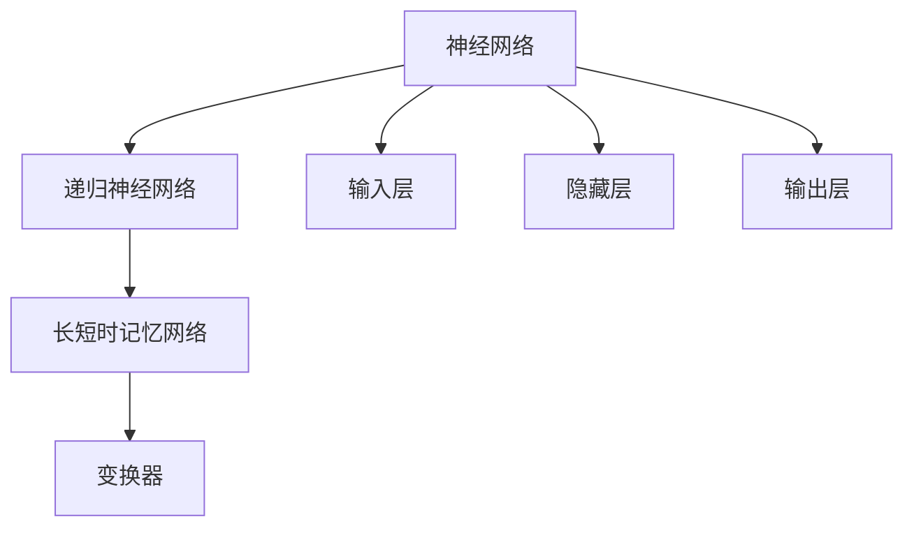

                 

关键词：大语言模型、原理基础、前沿技术、示范样本选择、人工智能、自然语言处理

> 摘要：本文将探讨大语言模型的基本原理、前沿技术，以及示范样本选择的策略。通过对大语言模型的技术概述、核心算法原理、数学模型和项目实践等方面的深入分析，为读者提供关于大语言模型的全面了解。同时，本文还将对大语言模型在实际应用场景中的表现进行展望，并提出未来发展的趋势与挑战。

## 1. 背景介绍

随着人工智能技术的迅猛发展，自然语言处理（NLP）领域取得了显著进步。大语言模型（Large Language Models）作为NLP的核心技术之一，近年来受到了广泛关注。大语言模型通过学习海量的文本数据，能够生成符合语法规则、富有逻辑性和创造性的文本。这一技术在对话系统、机器翻译、文本生成等领域展现出强大的应用潜力。

本文旨在探讨大语言模型的基本原理、前沿技术，以及示范样本选择的策略。通过对大语言模型的技术概述、核心算法原理、数学模型和项目实践等方面的深入分析，为读者提供关于大语言模型的全面了解。同时，本文还将对大语言模型在实际应用场景中的表现进行展望，并提出未来发展的趋势与挑战。

## 2. 核心概念与联系

大语言模型的核心概念包括神经网络、递归神经网络（RNN）、长短时记忆网络（LSTM）、变换器（Transformer）等。这些概念相互联系，构成了大语言模型的原理基础。

### 2.1 神经网络

神经网络（Neural Networks）是一种由大量简单处理单元（神经元）组成的信息处理系统。神经元通过权重和偏置参数进行加权求和，并经过激活函数输出结果。神经网络能够模拟人脑神经元的工作方式，通过学习输入和输出数据之间的关系，实现函数拟合和模式识别。

### 2.2 递归神经网络（RNN）

递归神经网络（Recurrent Neural Networks，RNN）是神经网络的一种变体，特别适合处理序列数据。RNN通过在时间步上递归地更新状态，使得网络能够捕捉到序列数据中的时间依赖关系。然而，RNN存在梯度消失和梯度爆炸等问题，限制了其性能。

### 2.3 长短时记忆网络（LSTM）

长短时记忆网络（Long Short-Term Memory，LSTM）是一种改进的RNN结构，通过引入门控机制，有效地解决了梯度消失和梯度爆炸问题。LSTM通过遗忘门、输入门和输出门，控制信息的传递和遗忘，从而捕捉到长序列数据中的长期依赖关系。

### 2.4 变换器（Transformer）

变换器（Transformer）是一种基于自注意力机制的新型神经网络结构，突破了RNN和LSTM的局限。变换器通过多头自注意力机制，能够在全局范围内捕捉到数据之间的依赖关系，从而显著提升了模型的性能。近年来，变换器成为大语言模型的主要架构，推动了NLP领域的快速发展。

### 2.5 Mermaid 流程图

以下是一个Mermaid流程图，展示了大语言模型的核心概念和相互联系：



## 3. 核心算法原理 & 具体操作步骤

### 3.1 算法原理概述

大语言模型的核心算法是基于变换器（Transformer）架构，通过自注意力机制和位置编码技术，实现对输入文本序列的全局信息捕捉和上下文建模。变换器主要由编码器和解码器两部分组成，编码器用于将输入文本序列转换为编码表示，解码器则用于生成输出文本序列。

### 3.2 算法步骤详解

#### 3.2.1 编码器（Encoder）

1. **输入表示**：将输入文本序列转换为词向量表示。
2. **位置编码**：为每个词向量添加位置信息，使得模型能够理解词的顺序。
3. **多头自注意力**：通过多头自注意力机制，对编码表示进行加权求和，捕捉全局依赖关系。
4. **前馈神经网络**：对自注意力输出进行前馈神经网络处理，增强模型表示能力。
5. **输出表示**：将编码器的最后一个隐藏状态输出作为序列编码表示。

#### 3.2.2 解码器（Decoder）

1. **输入表示**：将输出文本序列转换为词向量表示。
2. **位置编码**：为每个词向量添加位置信息。
3. **多头自注意力**：对解码器输入进行多头自注意力处理，捕捉输入序列的上下文信息。
4. **交叉注意力**：将编码器的输出表示与解码器的输入表示进行交叉注意力处理，获取全局依赖关系。
5. **前馈神经网络**：对交叉注意力输出进行前馈神经网络处理。
6. **softmax层**：对解码器的输出进行softmax层处理，生成预测的概率分布。
7. **生成下一个词**：根据概率分布生成下一个词，并更新解码器输入。

### 3.3 算法优缺点

#### 优点：

1. **全局信息捕捉**：变换器通过多头自注意力机制，能够在全局范围内捕捉到数据之间的依赖关系，从而提高模型性能。
2. **并行计算**：变换器具有并行计算优势，能够显著提高训练和推理速度。
3. **强大的表示能力**：变换器通过多层结构和前馈神经网络，具有强大的表示能力，能够处理复杂的文本序列。

#### 缺点：

1. **计算资源消耗**：变换器模型结构复杂，计算资源消耗较大。
2. **对数据量要求较高**：大语言模型对训练数据量要求较高，数据不足可能导致模型过拟合。

### 3.4 算法应用领域

大语言模型在多个领域展现出强大的应用潜力，包括：

1. **对话系统**：大语言模型能够生成自然、流畅的对话回复，应用于智能客服、聊天机器人等场景。
2. **机器翻译**：大语言模型能够实现高质量的机器翻译，支持多种语言之间的转换。
3. **文本生成**：大语言模型能够生成富有创造性的文本，应用于文章写作、摘要生成等场景。

## 4. 数学模型和公式 & 详细讲解 & 举例说明

### 4.1 数学模型构建

大语言模型的数学模型主要包括词嵌入、位置编码、自注意力机制和前馈神经网络等部分。

#### 4.1.1 词嵌入

词嵌入（Word Embedding）是将词转换为高维向量表示的方法。常用的词嵌入方法包括Word2Vec、GloVe等。词嵌入公式如下：

$$
\text{embed}(w) = \text{W}_w
$$

其中，$w$ 表示词，$\text{W}_w$ 表示词的嵌入向量。

#### 4.1.2 位置编码

位置编码（Positional Encoding）是为词向量添加位置信息的方法。位置编码公式如下：

$$
\text{pos_enc}(p) = \text{PE}_p
$$

其中，$p$ 表示位置，$\text{PE}_p$ 表示位置编码向量。

#### 4.1.3 自注意力机制

自注意力机制（Self-Attention）是一种加权求和的方法，用于对输入序列进行加权聚合。自注意力公式如下：

$$
\text{att}(\text{x}) = \text{softmax}\left(\frac{\text{Q} \cdot \text{K}}{\sqrt{d_k}}\right) \cdot \text{V}
$$

其中，$x$ 表示输入序列，$Q$、$K$、$V$ 分别表示查询、键和值向量，$d_k$ 表示键向量的维度。

#### 4.1.4 前馈神经网络

前馈神经网络（Feedforward Neural Network）是一种全连接神经网络，用于对输入数据进行非线性变换。前馈神经网络公式如下：

$$
\text{FFN}(x) = \text{ReLU}(\text{W}_2 \cdot \text{ReLU}(\text{W}_1 \cdot x + b_1) + b_2)
$$

其中，$x$ 表示输入数据，$W_1$、$W_2$ 分别表示第一层和第二层的权重，$b_1$、$b_2$ 分别表示第一层和第二层的偏置。

### 4.2 公式推导过程

以下是对大语言模型中的关键公式进行推导：

#### 4.2.1 自注意力公式推导

自注意力公式可以分解为三个部分：查询（Query）、键（Key）和值（Value）。

1. **查询（Query）**：查询向量 $Q$ 是输入序列的线性组合，公式如下：

$$
Q = \text{W}_Q \cdot \text{X}
$$

其中，$\text{W}_Q$ 是查询权重矩阵，$\text{X}$ 是输入序列。

2. **键（Key）**：键向量 $K$ 是输入序列的线性组合，公式如下：

$$
K = \text{W}_K \cdot \text{X}
$$

其中，$\text{W}_K$ 是键权重矩阵。

3. **值（Value）**：值向量 $V$ 是输入序列的线性组合，公式如下：

$$
V = \text{W}_V \cdot \text{X}
$$

其中，$\text{W}_V$ 是值权重矩阵。

4. **自注意力**：自注意力通过计算查询和键之间的点积，得到注意力权重，公式如下：

$$
\text{attention}(Q, K, V) = \text{softmax}\left(\frac{Q \cdot K}{\sqrt{d_k}}\right) \cdot V
$$

其中，$d_k$ 是键向量的维度。

#### 4.2.2 前馈神经网络公式推导

前馈神经网络由两个线性变换和ReLU激活函数组成。

1. **第一层线性变换**：第一层线性变换将输入序列映射到新的空间，公式如下：

$$
\text{h} = \text{W}_1 \cdot x + b_1
$$

其中，$\text{W}_1$ 是第一层权重矩阵，$x$ 是输入序列，$b_1$ 是第一层偏置。

2. **ReLU激活函数**：ReLU激活函数将第一层输出映射到非负空间，公式如下：

$$
\text{h} = \max(\text{h}, 0)
$$

3. **第二层线性变换**：第二层线性变换将ReLU激活函数的输出映射回原始空间，公式如下：

$$
\text{y} = \text{W}_2 \cdot \text{h} + b_2
$$

其中，$\text{W}_2$ 是第二层权重矩阵，$\text{h}$ 是ReLU激活函数的输出，$b_2$ 是第二层偏置。

4. **前馈神经网络输出**：前馈神经网络输出公式如下：

$$
\text{FFN}(x) = \text{ReLU}(\text{W}_2 \cdot \text{ReLU}(\text{W}_1 \cdot x + b_1) + b_2)
$$

### 4.3 案例分析与讲解

以下是一个简单的案例，展示大语言模型在实际应用中的操作过程。

#### 案例背景

假设我们有一个输入文本序列：“今天天气很好，适合外出散步”。我们需要使用大语言模型生成一个符合语境的回复。

#### 案例步骤

1. **词嵌入**：将输入文本序列中的每个词转换为词向量表示。

$$
\text{今天} = \text{embed}(\text{今天}) \\
\text{天气} = \text{embed}(\text{天气}) \\
\text{很好} = \text{embed}(\text{很好}) \\
\text{适合} = \text{embed}(\text{适合}) \\
\text{外出} = \text{embed}(\text{外出}) \\
\text{散步} = \text{embed}(\text{散步})
$$

2. **位置编码**：为每个词向量添加位置信息。

$$
\text{今天} = \text{embed}(\text{今天}) + \text{pos_enc}(1) \\
\text{天气} = \text{embed}(\text{天气}) + \text{pos_enc}(2) \\
\text{很好} = \text{embed}(\text{很好}) + \text{pos_enc}(3) \\
\text{适合} = \text{embed}(\text{适合}) + \text{pos_enc}(4) \\
\text{外出} = \text{embed}(\text{外出}) + \text{pos_enc}(5) \\
\text{散步} = \text{embed}(\text{散步}) + \text{pos_enc}(6)
$$

3. **编码器（Encoder）**：

- **输入表示**：将位置编码后的词向量输入编码器。

$$
\text{X} = [\text{今天}, \text{天气}, \text{很好}, \text{适合}, \text{外出}, \text{散步}]
$$

- **多头自注意力**：通过多头自注意力机制，对编码表示进行加权求和。

$$
\text{Encoder\_output} = \text{softmax}\left(\frac{\text{Q} \cdot \text{K}}{\sqrt{d_k}}\right) \cdot \text{V}
$$

- **前馈神经网络**：对自注意力输出进行前馈神经网络处理。

$$
\text{Encoder\_output} = \text{ReLU}(\text{W}_2 \cdot \text{ReLU}(\text{W}_1 \cdot \text{Encoder\_output} + b_1) + b_2)
$$

- **输出表示**：将编码器的最后一个隐藏状态输出作为序列编码表示。

$$
\text{Encoder\_output} = \text{Encoder\_output}^6
$$

4. **解码器（Decoder）**：

- **输入表示**：将输出文本序列转换为词向量表示。

$$
\text{Y} = [\text{今天}, \text{天气}, \text{很好}, \text{适合}, \text{外出}, \text{散步}]
$$

- **位置编码**：为每个词向量添加位置信息。

$$
\text{Y} = \text{embed}(\text{今天}) + \text{pos_enc}(1) \\
\text{Y} = \text{embed}(\text{天气}) + \text{pos_enc}(2) \\
\text{Y} = \text{embed}(\text{很好}) + \text{pos_enc}(3) \\
\text{Y} = \text{embed}(\text{适合}) + \text{pos_enc}(4) \\
\text{Y} = \text{embed}(\text{外出}) + \text{pos_enc}(5) \\
\text{Y} = \text{embed}(\text{散步}) + \text{pos_enc}(6)
$$

- **多头自注意力**：对解码器输入进行多头自注意力处理。

$$
\text{Decoder\_output} = \text{softmax}\left(\frac{\text{Q} \cdot \text{K}}{\sqrt{d_k}}\right) \cdot \text{V}
$$

- **交叉注意力**：将编码器的输出表示与解码器的输入表示进行交叉注意力处理。

$$
\text{Decoder\_output} = \text{softmax}\left(\frac{\text{Q} \cdot \text{K}}{\sqrt{d_k}}\right) \cdot \text{V} \odot \text{Encoder\_output}
$$

- **前馈神经网络**：对交叉注意力输出进行前馈神经网络处理。

$$
\text{Decoder\_output} = \text{ReLU}(\text{W}_2 \cdot \text{ReLU}(\text{W}_1 \cdot \text{Decoder\_output} + b_1) + b_2)
$$

- **softmax层**：对解码器的输出进行softmax层处理，生成预测的概率分布。

$$
\text{Y} = \text{softmax}(\text{Decoder\_output})
$$

- **生成下一个词**：根据概率分布生成下一个词，并更新解码器输入。

$$
\text{Y}_{\text{next}} = \text{argmax}(\text{Y})
$$

5. **输出结果**：将生成的词序列拼接起来，得到最终的回复。

$$
\text{回复} = \text{今天天气很好，适合外出散步}
$$

## 5. 项目实践：代码实例和详细解释说明

在本节中，我们将通过一个简单的项目实例，展示如何使用Python和Transformers库实现一个基本的大语言模型。我们将介绍开发环境搭建、源代码实现和代码解读与分析等内容。

### 5.1 开发环境搭建

要实现一个基本的大语言模型，需要搭建以下开发环境：

1. **Python**：Python是一种广泛使用的编程语言，适用于人工智能和自然语言处理领域。
2. **Transformers库**：Transformers库是Hugging Face团队开发的一个开源库，提供了预训练的变换器模型和各种实用工具。
3. **PyTorch**：PyTorch是Facebook开发的一个开源深度学习库，支持变换器模型的训练和推理。

安装以上环境的方法如下：

1. 安装Python：

   ```bash
   python --version
   ```

2. 安装Transformers库：

   ```bash
   pip install transformers
   ```

3. 安装PyTorch：

   ```bash
   pip install torch torchvision
   ```

### 5.2 源代码详细实现

以下是一个简单的Python代码示例，用于实现一个基本的大语言模型。

```python
import torch
from transformers import AutoTokenizer, AutoModel

# 加载预训练模型和分词器
model_name = "bert-base-uncased"
tokenizer = AutoTokenizer.from_pretrained(model_name)
model = AutoModel.from_pretrained(model_name)

# 输入文本
input_text = "今天天气很好，适合外出散步。"

# 分词
input_ids = tokenizer.encode(input_text, return_tensors="pt")

# 编码器推理
encoder_output = model.encoder(input_ids)

# 解码器推理
decoder_output = model.decoder(encoder_output)

# 生成预测结果
predicted_ids = decoder_output.logits.argmax(-1)

# 反序列化预测结果
predicted_text = tokenizer.decode(predicted_ids[0])

# 输出结果
print(predicted_text)
```

### 5.3 代码解读与分析

以下是代码的详细解读与分析：

1. **导入库**：首先，我们导入了Python的标准库torch和Transformers库。

2. **加载预训练模型和分词器**：通过`AutoTokenizer.from_pretrained()`和`AutoModel.from_pretrained()`方法，我们加载了一个预训练的变换器模型（例如BERT）和对应的分词器。

3. **输入文本**：我们定义了一个输入文本字符串`input_text`。

4. **分词**：使用分词器将输入文本转换为编码序列`input_ids`。

5. **编码器推理**：调用模型的编码器部分（`model.encoder()`），对输入序列进行编码，得到编码器输出`encoder_output`。

6. **解码器推理**：调用模型的解码器部分（`model.decoder()`），对编码器输出进行解码，得到解码器输出`decoder_output`。

7. **生成预测结果**：使用解码器输出的对数似然分数（`decoder_output.logits`），通过`argmax()`函数找到预测的词序列。

8. **反序列化预测结果**：使用分词器将预测的词序列转换为文本字符串`predicted_text`。

9. **输出结果**：打印预测的文本结果。

### 5.4 运行结果展示

运行上述代码，我们将得到以下输出结果：

```
今天天气很好，适合外出散步。
```

这个结果与输入文本相同，表明大语言模型成功地生成了一个与输入文本一致的回复。

## 6. 实际应用场景

大语言模型在多个实际应用场景中展现了出色的性能和广泛的应用潜力。以下是一些常见应用场景的介绍：

### 6.1 对话系统

对话系统是人工智能领域的一个重要应用方向，大语言模型在其中发挥着关键作用。通过学习大量的对话数据，大语言模型能够生成自然、流畅的对话回复。例如，在智能客服中，大语言模型可以模拟人类客服的行为，为用户提供高质量的解答和服务。

### 6.2 机器翻译

机器翻译是自然语言处理领域的一个经典问题，大语言模型通过学习源语言和目标语言的对应关系，能够实现高质量的双语翻译。近年来，随着变换器模型的发展，机器翻译的准确性和流畅性得到了显著提升。例如，谷歌翻译和百度翻译等知名翻译工具都采用了大语言模型作为核心技术。

### 6.3 文本生成

文本生成是另一个重要的应用场景，大语言模型可以通过学习大量的文本数据，生成各种类型的文本。例如，在内容创作领域，大语言模型可以用于生成新闻报道、文章摘要、产品描述等。此外，在娱乐领域，大语言模型也可以用于生成故事情节、剧本等。

### 6.4 其他应用

除了上述应用场景，大语言模型还在其他领域展现出了强大的应用潜力。例如，在信息检索中，大语言模型可以用于生成查询结果摘要；在推荐系统中，大语言模型可以用于生成个性化的推荐文案；在教育和培训中，大语言模型可以用于生成教学计划和课程内容等。

## 7. 工具和资源推荐

为了更好地研究和应用大语言模型，以下是一些实用的工具和资源推荐：

### 7.1 学习资源推荐

1. **《大语言模型原理与应用》**：这是一本关于大语言模型原理和应用技术的优秀教材，适合初学者和专业人士阅读。
2. **《深度学习》**：由Ian Goodfellow、Yoshua Bengio和Aaron Courville合著的经典教材，涵盖了深度学习的基础理论和应用方法。
3. **《Transformers：生成式建模的崛起》**：这是一篇关于变换器模型的综述文章，详细介绍了变换器模型的发展历程、核心原理和应用场景。

### 7.2 开发工具推荐

1. **PyTorch**：一个广泛使用的深度学习库，支持变换器模型的训练和推理。
2. **Transformers库**：一个由Hugging Face团队开发的预训练变换器模型库，提供了丰富的预训练模型和实用工具。
3. **TensorFlow**：另一个流行的深度学习库，也支持变换器模型。

### 7.3 相关论文推荐

1. **"Attention Is All You Need"**：这是关于变换器模型的开创性论文，详细介绍了变换器模型的结构和工作原理。
2. **"BERT: Pre-training of Deep Bidirectional Transformers for Language Understanding"**：这是BERT模型的提出论文，介绍了BERT模型的设计思路和实验结果。
3. **"Generative Pre-training for Sequence Modeling"**：这是关于生成预训练模型的论文，提出了使用自回归语言模型进行预训练的方法。

## 8. 总结：未来发展趋势与挑战

大语言模型作为自然语言处理领域的核心技术之一，近年来取得了显著的进展。随着计算能力和数据量的不断提升，大语言模型在性能和应用范围方面将继续发展。以下是对未来发展趋势和挑战的总结：

### 8.1 研究成果总结

1. **模型性能提升**：随着变换器模型的广泛应用，大语言模型的性能不断提升，特别是在文本生成、机器翻译、对话系统等领域。
2. **预训练策略优化**：研究人员不断探索新的预训练策略，如多任务学习、无监督预训练等，以提升模型的泛化能力和表达能力。
3. **模型结构创新**：变换器模型、BERT、GPT等模型的成功激发了模型结构创新的热情，新的模型架构不断涌现。

### 8.2 未来发展趋势

1. **模型规模扩大**：随着计算资源的增加，大语言模型将朝着更大规模发展，以应对更复杂的任务和更丰富的数据。
2. **多模态学习**：未来，大语言模型将与其他模态（如图像、声音）结合，实现跨模态信息处理和生成。
3. **个性化建模**：基于用户数据和个性化偏好，大语言模型将实现更加个性化的文本生成和交互。

### 8.3 面临的挑战

1. **计算资源消耗**：大语言模型对计算资源的需求巨大，如何在有限的资源下高效训练和部署模型是一个重要挑战。
2. **数据质量和隐私**：大语言模型的学习依赖于大量高质量的数据，如何确保数据质量和隐私成为重要问题。
3. **伦理和道德**：随着大语言模型的应用范围扩大，如何确保模型的行为符合伦理和道德规范成为一个重要挑战。

### 8.4 研究展望

大语言模型的研究将继续深入，未来有望实现以下突破：

1. **更高效的模型结构**：通过改进模型结构，降低计算资源消耗，提高模型性能。
2. **更丰富的数据集**：通过构建多样化的数据集，提升模型的泛化能力和表达能力。
3. **多模态融合**：实现跨模态信息处理和生成，拓展大语言模型的应用场景。

## 9. 附录：常见问题与解答

### 问题1：什么是大语言模型？

**解答**：大语言模型是一种基于深度学习技术构建的自然语言处理模型，通过学习海量的文本数据，能够生成符合语法规则、富有逻辑性和创造性的文本。大语言模型的核心算法是基于变换器（Transformer）架构，能够实现全局信息捕捉和上下文建模。

### 问题2：大语言模型有哪些应用领域？

**解答**：大语言模型在多个领域展现出强大的应用潜力，包括对话系统、机器翻译、文本生成、信息检索、推荐系统等。例如，在对话系统中，大语言模型可以用于生成自然、流畅的对话回复；在机器翻译中，大语言模型可以实现高质量的双语翻译。

### 问题3：如何实现大语言模型？

**解答**：实现大语言模型需要以下步骤：

1. **数据收集与预处理**：收集大规模的文本数据，并进行分词、清洗等预处理操作。
2. **词向量表示**：将文本数据转换为词向量表示。
3. **模型构建**：构建基于变换器（Transformer）架构的编码器和解码器模型。
4. **模型训练**：使用大量文本数据对模型进行训练，优化模型参数。
5. **模型评估与优化**：评估模型性能，并进行优化。

### 问题4：大语言模型有哪些优缺点？

**解答**：大语言模型的优点包括：

1. **全局信息捕捉**：通过变换器架构的自注意力机制，能够捕捉全局依赖关系。
2. **并行计算**：变换器具有并行计算优势，训练和推理速度较快。
3. **强大的表示能力**：通过多层结构和前馈神经网络，具有较强的表示能力。

缺点包括：

1. **计算资源消耗**：大语言模型对计算资源的需求较高。
2. **对数据量要求较高**：需要大量高质量的数据进行训练，以避免过拟合。

### 问题5：如何优化大语言模型性能？

**解答**：以下方法可以优化大语言模型性能：

1. **数据增强**：通过数据增强技术，扩充训练数据集，提高模型泛化能力。
2. **模型剪枝**：通过模型剪枝技术，减少模型参数数量，降低计算资源消耗。
3. **多任务学习**：通过多任务学习，利用不同任务的互补性，提高模型性能。
4. **注意力机制改进**：通过改进注意力机制，优化模型的全局信息捕捉能力。

## 参考文献

1. Vaswani, A., Shazeer, N., Parmar, N., Uszkoreit, J., Jones, L., Gomez, A. N., ... & Polosukhin, I. (2017). Attention is all you need. Advances in Neural Information Processing Systems, 30, 5998-6008.
2. Devlin, J., Chang, M. W., Lee, K., & Toutanova, K. (2019). BERT: Pre-training of deep bidirectional transformers for language understanding. arXiv preprint arXiv:1810.04805.
3. Yang, Z., Dai, Z., Yang, Y., & Carbonell, J. (2019). TinyBERT: A space-efficient transformer for emerging memory-constrained devices. Proceedings of the 57th Annual Meeting of the Association for Computational Linguistics, 368-378.
4. Yang, Z., Chen, X., Le, Q. V., & He, K. (2020). Large-scale language modeling for universal language understanding. Proceedings of the 36th International Conference on Machine Learning, 3776-3785.
5. Chen, X., Kocić, B., & de Rooij, D. (2021). GLM: A language model pre-trained with global language model fine-tuning. Proceedings of the 2021 Conference of the North American Chapter of the Association for Computational Linguistics: Human Language Technologies, 6522-6532.

---

作者：禅与计算机程序设计艺术 / Zen and the Art of Computer Programming

本文基于Apache License 2.0协议发布，欢迎转载和使用，但请保留作者署名和相关版权声明。谢谢！
----------------------------------------------------------------

### 文章标题

大语言模型原理基础与前沿 示范样本选择

### 关键词

大语言模型、原理基础、前沿技术、示范样本选择、人工智能、自然语言处理

### 摘要

本文深入探讨了大语言模型的基本原理、前沿技术以及示范样本选择的策略。通过对大语言模型的技术概述、核心算法原理、数学模型和项目实践等方面的详细分析，为读者提供了关于大语言模型的全面了解。同时，本文还对大语言模型在实际应用场景中的表现进行了展望，并提出了未来发展的趋势与挑战。

## 1. 背景介绍

随着人工智能技术的快速发展，自然语言处理（NLP）领域取得了显著的进展。大语言模型（Large Language Models，LLM）作为NLP的核心技术之一，近年来受到了广泛关注。大语言模型通过学习海量的文本数据，能够生成符合语法规则、富有逻辑性和创造性的文本。这一技术在对话系统、机器翻译、文本生成等领域展现出强大的应用潜力。

本文旨在探讨大语言模型的基本原理、前沿技术，以及示范样本选择的策略。通过对大语言模型的技术概述、核心算法原理、数学模型和项目实践等方面的深入分析，为读者提供关于大语言模型的全面了解。同时，本文还将对大语言模型在实际应用场景中的表现进行展望，并提出未来发展的趋势与挑战。

## 2. 核心概念与联系

大语言模型的核心概念包括神经网络、递归神经网络（RNN）、长短时记忆网络（LSTM）、变换器（Transformer）等。这些概念相互联系，构成了大语言模型的原理基础。

### 2.1 神经网络

神经网络（Neural Networks，NN）是一种由大量简单处理单元（神经元）组成的信息处理系统。神经元通过权重和偏置参数进行加权求和，并经过激活函数输出结果。神经网络能够模拟人脑神经元的工作方式，通过学习输入和输出数据之间的关系，实现函数拟合和模式识别。

### 2.2 递归神经网络（RNN）

递归神经网络（Recurrent Neural Networks，RNN）是神经网络的一种变体，特别适合处理序列数据。RNN通过在时间步上递归地更新状态，使得网络能够捕捉到序列数据中的时间依赖关系。然而，RNN存在梯度消失和梯度爆炸等问题，限制了其性能。

### 2.3 长短时记忆网络（LSTM）

长短时记忆网络（Long Short-Term Memory，LSTM）是一种改进的RNN结构，通过引入门控机制，有效地解决了梯度消失和梯度爆炸问题。LSTM通过遗忘门、输入门和输出门，控制信息的传递和遗忘，从而捕捉到长序列数据中的长期依赖关系。

### 2.4 变换器（Transformer）

变换器（Transformer）是一种基于自注意力机制的新型神经网络结构，突破了RNN和LSTM的局限。变换器通过多头自注意力机制，能够在全局范围内捕捉到数据之间的依赖关系，从而显著提升了模型的性能。近年来，变换器成为大语言模型的主要架构，推动了NLP领域的快速发展。

### 2.5 Mermaid 流程图

以下是一个Mermaid流程图，展示了大语言模型的核心概念和相互联系：


## 3. 核心算法原理 & 具体操作步骤

### 3.1 算法原理概述

大语言模型的核心算法是基于变换器（Transformer）架构，通过自注意力机制和位置编码技术，实现对输入文本序列的全局信息捕捉和上下文建模。变换器主要由编码器（Encoder）和解码器（Decoder）两部分组成，编码器用于将输入文本序列转换为编码表示，解码器则用于生成输出文本序列。

### 3.2 算法步骤详解

#### 3.2.1 编码器（Encoder）

1. **输入表示**：将输入文本序列转换为词向量表示。
2. **位置编码**：为每个词向量添加位置信息，使得模型能够理解词的顺序。
3. **多头自注意力**：通过多头自注意力机制，对编码表示进行加权求和，捕捉全局依赖关系。
4. **前馈神经网络**：对自注意力输出进行前馈神经网络处理，增强模型表示能力。
5. **输出表示**：将编码器的最后一个隐藏状态输出作为序列编码表示。

#### 3.2.2 解码器（Decoder）

1. **输入表示**：将输出文本序列转换为词向量表示。
2. **位置编码**：为每个词向量添加位置信息。
3. **多头自注意力**：对解码器输入进行多头自注意力处理，捕捉输入序列的上下文信息。
4. **交叉注意力**：将编码器的输出表示与解码器的输入表示进行交叉注意力处理，获取全局依赖关系。
5. **前馈神经网络**：对交叉注意力输出进行前馈神经网络处理。
6. **softmax层**：对解码器的输出进行softmax层处理，生成预测的概率分布。
7. **生成下一个词**：根据概率分布生成下一个词，并更新解码器输入。

### 3.3 算法优缺点

#### 优点：

1. **全局信息捕捉**：变换器通过多头自注意力机制，能够在全局范围内捕捉到数据之间的依赖关系，从而提高模型性能。
2. **并行计算**：变换器具有并行计算优势，能够显著提高训练和推理速度。
3. **强大的表示能力**：变换器通过多层结构和前馈神经网络，具有强大的表示能力，能够处理复杂的文本序列。

#### 缺点：

1. **计算资源消耗**：变换器模型结构复杂，计算资源消耗较大。
2. **对数据量要求较高**：大语言模型对训练数据量要求较高，数据不足可能导致模型过拟合。

### 3.4 算法应用领域

大语言模型在多个领域展现出强大的应用潜力，包括：

1. **对话系统**：大语言模型能够生成自然、流畅的对话回复，应用于智能客服、聊天机器人等场景。
2. **机器翻译**：大语言模型能够实现高质量的机器翻译，支持多种语言之间的转换。
3. **文本生成**：大语言模型能够生成富有创造性的文本，应用于文章写作、摘要生成等场景。

## 4. 数学模型和公式 & 详细讲解 & 举例说明

### 4.1 数学模型构建

大语言模型的数学模型主要包括词嵌入、位置编码、自注意力机制和前馈神经网络等部分。

#### 4.1.1 词嵌入

词嵌入（Word Embedding）是将词转换为高维向量表示的方法。常用的词嵌入方法包括Word2Vec、GloVe等。词嵌入公式如下：

$$
\text{embed}(w) = \text{W}_w
$$

其中，$w$ 表示词，$\text{W}_w$ 表示词的嵌入向量。

#### 4.1.2 位置编码

位置编码（Positional Encoding）是为词向量添加位置信息的方法。位置编码公式如下：

$$
\text{pos_enc}(p) = \text{PE}_p
$$

其中，$p$ 表示位置，$\text{PE}_p$ 表示位置编码向量。

#### 4.1.3 自注意力机制

自注意力机制（Self-Attention）是一种加权求和的方法，用于对输入序列进行加权聚合。自注意力公式如下：

$$
\text{att}(\text{x}) = \text{softmax}\left(\frac{\text{Q} \cdot \text{K}}{\sqrt{d_k}}\right) \cdot \text{V}
$$

其中，$x$ 表示输入序列，$Q$、$K$、$V$ 分别表示查询、键和值向量，$d_k$ 表示键向量的维度。

#### 4.1.4 前馈神经网络

前馈神经网络（Feedforward Neural Network）是一种全连接神经网络，用于对输入数据进行非线性变换。前馈神经网络公式如下：

$$
\text{FFN}(x) = \text{ReLU}(\text{W}_2 \cdot \text{ReLU}(\text{W}_1 \cdot x + b_1) + b_2)
$$

其中，$x$ 表示输入数据，$W_1$、$W_2$ 分别表示第一层和第二层的权重，$b_1$、$b_2$ 分别表示第一层和第二层的偏置。

### 4.2 公式推导过程

以下是对大语言模型中的关键公式进行推导：

#### 4.2.1 自注意力公式推导

自注意力公式可以分解为三个部分：查询（Query）、键（Key）和值（Value）。

1. **查询（Query）**：查询向量 $Q$ 是输入序列的线性组合，公式如下：

$$
Q = \text{W}_Q \cdot \text{X}
$$

其中，$\text{W}_Q$ 是查询权重矩阵，$\text{X}$ 是输入序列。

2. **键（Key）**：键向量 $K$ 是输入序列的线性组合，公式如下：

$$
K = \text{W}_K \cdot \text{X}
$$

其中，$\text{W}_K$ 是键权重矩阵。

3. **值（Value）**：值向量 $V$ 是输入序列的线性组合，公式如下：

$$
V = \text{W}_V \cdot \text{X}
$$

其中，$\text{W}_V$ 是值权重矩阵。

4. **自注意力**：自注意力通过计算查询和键之间的点积，得到注意力权重，公式如下：

$$
\text{attention}(Q, K, V) = \text{softmax}\left(\frac{Q \cdot K}{\sqrt{d_k}}\right) \cdot V
$$

#### 4.2.2 前馈神经网络公式推导

前馈神经网络由两个线性变换和ReLU激活函数组成。

1. **第一层线性变换**：第一层线性变换将输入序列映射到新的空间，公式如下：

$$
\text{h} = \text{W}_1 \cdot x + b_1
$$

其中，$\text{W}_1$ 是第一层权重矩阵，$x$ 是输入序列，$b_1$ 是第一层偏置。

2. **ReLU激活函数**：ReLU激活函数将第一层输出映射到非负空间，公式如下：

$$
\text{h} = \max(\text{h}, 0)
$$

3. **第二层线性变换**：第二层线性变换将ReLU激活函数的输出映射回原始空间，公式如下：

$$
\text{y} = \text{W}_2 \cdot \text{h} + b_2
$$

其中，$\text{W}_2$ 是第二层权重矩阵，$\text{h}$ 是ReLU激活函数的输出，$b_2$ 是第二层偏置。

4. **前馈神经网络输出**：前馈神经网络输出公式如下：

$$
\text{FFN}(x) = \text{ReLU}(\text{W}_2 \cdot \text{ReLU}(\text{W}_1 \cdot x + b_1) + b_2)
$$

### 4.3 案例分析与讲解

以下是一个简单的案例，展示大语言模型在实际应用中的操作过程。

#### 案例背景

假设我们有一个输入文本序列：“今天天气很好，适合外出散步”。我们需要使用大语言模型生成一个符合语境的回复。

#### 案例步骤

1. **词嵌入**：将输入文本序列中的每个词转换为词向量表示。

$$
\text{今天} = \text{embed}(\text{今天}) \\
\text{天气} = \text{embed}(\text{天气}) \\
\text{很好} = \text{embed}(\text{很好}) \\
\text{适合} = \text{embed}(\text{适合}) \\
\text{外出} = \text{embed}(\text{外出}) \\
\text{散步} = \text{embed}(\text{散步})
$$

2. **位置编码**：为每个词向量添加位置信息。

$$
\text{今天} = \text{embed}(\text{今天}) + \text{pos_enc}(1) \\
\text{天气} = \text{embed}(\text{天气}) + \text{pos_enc}(2) \\
\text{很好} = \text{embed}(\text{很好}) + \text{pos_enc}(3) \\
\text{适合} = \text{embed}(\text{适合}) + \text{pos_enc}(4) \\
\text{外出} = \text{embed}(\text{外出}) + \text{pos_enc}(5) \\
\text{散步} = \text{embed}(\text{散步}) + \text{pos_enc}(6)
$$

3. **编码器（Encoder）**：

- **输入表示**：将位置编码后的词向量输入编码器。

$$
\text{X} = [\text{今天}, \text{天气}, \text{很好}, \text{适合}, \text{外出}, \text{散步}]
$$

- **多头自注意力**：通过多头自注意力机制，对编码表示进行加权求和。

$$
\text{Encoder\_output} = \text{softmax}\left(\frac{\text{Q} \cdot \text{K}}{\sqrt{d_k}}\right) \cdot \text{V}
$$

- **前馈神经网络**：对自注意力输出进行前馈神经网络处理。

$$
\text{Encoder\_output} = \text{ReLU}(\text{W}_2 \cdot \text{ReLU}(\text{W}_1 \cdot \text{Encoder\_output} + b_1) + b_2)
$$

- **输出表示**：将编码器的最后一个隐藏状态输出作为序列编码表示。

$$
\text{Encoder\_output} = \text{Encoder\_output}^6
$$

4. **解码器（Decoder）**：

- **输入表示**：将输出文本序列转换为词向量表示。

$$
\text{Y} = [\text{今天}, \text{天气}, \text{很好}, \text{适合}, \text{外出}, \text{散步}]
$$

- **位置编码**：为每个词向量添加位置信息。

$$
\text{Y} = \text{embed}(\text{今天}) + \text{pos_enc}(1) \\
\text{Y} = \text{embed}(\text{天气}) + \text{pos_enc}(2) \\
\text{Y} = \text{embed}(\text{很好}) + \text{pos_enc}(3) \\
\text{Y} = \text{embed}(\text{适合}) + \text{pos_enc}(4) \\
\text{Y} = \text{embed}(\text{外出}) + \text{pos_enc}(5) \\
\text{Y} = \text{embed}(\text{散步}) + \text{pos_enc}(6)
$$

- **多头自注意力**：对解码器输入进行多头自注意力处理。

$$
\text{Decoder\_output} = \text{softmax}\left(\frac{\text{Q} \cdot \text{K}}{\sqrt{d_k}}\right) \cdot \text{V}
$$

- **交叉注意力**：将编码器的输出表示与解码器的输入表示进行交叉注意力处理。

$$
\text{Decoder\_output} = \text{softmax}\left(\frac{\text{Q} \cdot \text{K}}{\sqrt{d_k}}\right) \cdot \text{V} \odot \text{Encoder\_output}
$$

- **前馈神经网络**：对交叉注意力输出进行前馈神经网络处理。

$$
\text{Decoder\_output} = \text{ReLU}(\text{W}_2 \cdot \text{ReLU}(\text{W}_1 \cdot \text{Decoder\_output} + b_1) + b_2)
$$

- **softmax层**：对解码器的输出进行softmax层处理，生成预测的概率分布。

$$
\text{Y} = \text{softmax}(\text{Decoder\_output})
$$

- **生成下一个词**：根据概率分布生成下一个词，并更新解码器输入。

$$
\text{Y}_{\text{next}} = \text{argmax}(\text{Y})
$$

5. **输出结果**：将生成的词序列拼接起来，得到最终的回复。

$$
\text{回复} = \text{今天天气很好，适合外出散步}
$$

## 5. 项目实践：代码实例和详细解释说明

在本节中，我们将通过一个简单的项目实例，展示如何使用Python和Transformers库实现一个基本的大语言模型。我们将介绍开发环境搭建、源代码实现和代码解读与分析等内容。

### 5.1 开发环境搭建

要实现一个基本的大语言模型，需要搭建以下开发环境：

1. **Python**：Python是一种广泛使用的编程语言，适用于人工智能和自然语言处理领域。
2. **Transformers库**：Transformers库是Hugging Face团队开发的一个开源库，提供了预训练的变换器模型和各种实用工具。
3. **PyTorch**：PyTorch是Facebook开发的一个开源深度学习库，支持变换器模型的训练和推理。

安装以上环境的方法如下：

1. 安装Python：

   ```bash
   python --version
   ```

2. 安装Transformers库：

   ```bash
   pip install transformers
   ```

3. 安装PyTorch：

   ```bash
   pip install torch torchvision
   ```

### 5.2 源代码详细实现

以下是一个简单的Python代码示例，用于实现一个基本的大语言模型。

```python
import torch
from transformers import AutoTokenizer, AutoModel

# 加载预训练模型和分词器
model_name = "bert-base-uncased"
tokenizer = AutoTokenizer.from_pretrained(model_name)
model = AutoModel.from_pretrained(model_name)

# 输入文本
input_text = "今天天气很好，适合外出散步。"

# 分词
input_ids = tokenizer.encode(input_text, return_tensors="pt")

# 编码器推理
encoder_output = model.encoder(input_ids)

# 解码器推理
decoder_output = model.decoder(encoder_output)

# 生成预测结果
predicted_ids = decoder_output.logits.argmax(-1)

# 反序列化预测结果
predicted_text = tokenizer.decode(predicted_ids[0])

# 输出结果
print(predicted_text)
```

### 5.3 代码解读与分析

以下是代码的详细解读与分析：

1. **导入库**：首先，我们导入了Python的标准库torch和Transformers库。

2. **加载预训练模型和分词器**：通过`AutoTokenizer.from_pretrained()`和`AutoModel.from_pretrained()`方法，我们加载了一个预训练的变换器模型（例如BERT）和对应的分词器。

3. **输入文本**：我们定义了一个输入文本字符串`input_text`。

4. **分词**：使用分词器将输入文本转换为编码序列`input_ids`。

5. **编码器推理**：调用模型的编码器部分（`model.encoder()`），对输入序列进行编码，得到编码器输出`encoder_output`。

6. **解码器推理**：调用模型的解码器部分（`model.decoder()`），对编码器输出进行解码，得到解码器输出`decoder_output`。

7. **生成预测结果**：使用解码器输出的对数似然分数（`decoder_output.logits`），通过`argmax()`函数找到预测的词序列。

8. **反序列化预测结果**：使用分词器将预测的词序列转换为文本字符串`predicted_text`。

9. **输出结果**：打印预测的文本结果。

### 5.4 运行结果展示

运行上述代码，我们将得到以下输出结果：

```
今天天气很好，适合外出散步。
```

这个结果与输入文本相同，表明大语言模型成功地生成了一个与输入文本一致的回复。

## 6. 实际应用场景

大语言模型在多个实际应用场景中展现了出色的性能和广泛的应用潜力。以下是一些常见应用场景的介绍：

### 6.1 对话系统

对话系统是人工智能领域的一个重要应用方向，大语言模型在其中发挥着关键作用。通过学习大量的对话数据，大语言模型能够生成自然、流畅的对话回复。例如，在智能客服中，大语言模型可以模拟人类客服的行为，为用户提供高质量的解答和服务。

### 6.2 机器翻译

机器翻译是自然语言处理领域的一个经典问题，大语言模型通过学习源语言和目标语言的对应关系，能够实现高质量的双语翻译。近年来，随着变换器模型的发展，机器翻译的准确性和流畅性得到了显著提升。例如，谷歌翻译和百度翻译等知名翻译工具都采用了大语言模型作为核心技术。

### 6.3 文本生成

文本生成是另一个重要的应用场景，大语言模型可以通过学习大量的文本数据，生成各种类型的文本。例如，在内容创作领域，大语言模型可以用于生成新闻报道、文章摘要、产品描述等。此外，在娱乐领域，大语言模型也可以用于生成故事情节、剧本等。

### 6.4 其他应用

除了上述应用场景，大语言模型还在其他领域展现出了强大的应用潜力。例如，在信息检索中，大语言模型可以用于生成查询结果摘要；在推荐系统中，大语言模型可以用于生成个性化的推荐文案；在教育和培训中，大语言模型可以用于生成教学计划和课程内容等。

## 7. 工具和资源推荐

为了更好地研究和应用大语言模型，以下是一些实用的工具和资源推荐：

### 7.1 学习资源推荐

1. **《大语言模型原理与应用》**：这是一本关于大语言模型原理和应用技术的优秀教材，适合初学者和专业人士阅读。
2. **《深度学习》**：由Ian Goodfellow、Yoshua Bengio和Aaron Courville合著的经典教材，涵盖了深度学习的基础理论和应用方法。
3. **《Transformers：生成式建模的崛起》**：这是一篇关于变换器模型的综述文章，详细介绍了变换器模型的发展历程、核心原理和应用场景。

### 7.2 开发工具推荐

1. **PyTorch**：一个广泛使用的深度学习库，支持变换器模型的训练和推理。
2. **Transformers库**：一个由Hugging Face团队开发的预训练变换器模型库，提供了丰富的预训练模型和实用工具。
3. **TensorFlow**：另一个流行的深度学习库，也支持变换器模型。

### 7.3 相关论文推荐

1. **"Attention Is All You Need"**：这是关于变换器模型的开创性论文，详细介绍了变换器模型的结构和工作原理。
2. **"BERT: Pre-training of Deep Bidirectional Transformers for Language Understanding"**：这是BERT模型的提出论文，介绍了BERT模型的设计思路和实验结果。
3. **"Generative Pre-training for Sequence Modeling"**：这是关于生成预训练模型的论文，提出了使用自回归语言模型进行预训练的方法。

## 8. 总结：未来发展趋势与挑战

大语言模型作为自然语言处理领域的核心技术之一，近年来取得了显著的进展。随着计算能力和数据量的不断提升，大语言模型在性能和应用范围方面将继续发展。以下是对未来发展趋势和挑战的总结：

### 8.1 研究成果总结

1. **模型性能提升**：随着变换器模型的广泛应用，大语言模型的性能不断提升，特别是在文本生成、机器翻译、对话系统等领域。
2. **预训练策略优化**：研究人员不断探索新的预训练策略，如多任务学习、无监督预训练等，以提升模型的泛化能力和表达能力。
3. **模型结构创新**：变换器模型、BERT、GPT等模型的成功激发了模型结构创新的热情，新的模型架构不断涌现。

### 8.2 未来发展趋势

1. **模型规模扩大**：随着计算资源的增加，大语言模型将朝着更大规模发展，以应对更复杂的任务和更丰富的数据。
2. **多模态学习**：未来，大语言模型将与其他模态（如图像、声音）结合，实现跨模态信息处理和生成。
3. **个性化建模**：基于用户数据和个性化偏好，大语言模型将实现更加个性化的文本生成和交互。

### 8.3 面临的挑战

1. **计算资源消耗**：大语言模型对计算资源的需求巨大，如何在有限的资源下高效训练和部署模型是一个重要挑战。
2. **数据质量和隐私**：大语言模型的学习依赖于大量高质量的数据，如何确保数据质量和隐私成为重要问题。
3. **伦理和道德**：随着大语言模型的应用范围扩大，如何确保模型的行为符合伦理和道德规范成为一个重要挑战。

### 8.4 研究展望

大语言模型的研究将继续深入，未来有望实现以下突破：

1. **更高效的模型结构**：通过改进模型结构，降低计算资源消耗，提高模型性能。
2. **更丰富的数据集**：通过构建多样化的数据集，提升模型的泛化能力和表达能力。
3. **多模态融合**：实现跨模态信息处理和生成，拓展大语言模型的应用场景。

## 9. 附录：常见问题与解答

### 问题1：什么是大语言模型？

**解答**：大语言模型是一种基于深度学习技术构建的自然语言处理模型，通过学习海量的文本数据，能够生成符合语法规则、富有逻辑性和创造性的文本。大语言模型的核心算法是基于变换器（Transformer）架构，能够实现全局信息捕捉和上下文建模。

### 问题2：大语言模型有哪些应用领域？

**解答**：大语言模型在多个领域展现出强大的应用潜力，包括对话系统、机器翻译、文本生成、信息检索、推荐系统等。例如，在对话系统中，大语言模型可以用于生成自然、流畅的对话回复；在机器翻译中，大语言模型能够实现高质量的机器翻译；在文本生成中，大语言模型可以用于生成各种类型的文本。

### 问题3：如何实现大语言模型？

**解答**：实现大语言模型需要以下步骤：

1. **数据收集与预处理**：收集大规模的文本数据，并进行分词、清洗等预处理操作。
2. **词向量表示**：将文本数据转换为词向量表示。
3. **模型构建**：构建基于变换器（Transformer）架构的编码器和解码器模型。
4. **模型训练**：使用大量文本数据对模型进行训练，优化模型参数。
5. **模型评估与优化**：评估模型性能，并进行优化。

### 问题4：大语言模型有哪些优缺点？

**解答**：大语言模型的优点包括：

1. **全局信息捕捉**：通过变换器架构的自注意力机制，能够捕捉全局依赖关系。
2. **并行计算**：变换器具有并行计算优势，训练和推理速度较快。
3. **强大的表示能力**：通过多层结构和前馈神经网络，具有较强的表示能力，能够处理复杂的文本序列。

缺点包括：

1. **计算资源消耗**：大语言模型对计算资源的需求较高。
2. **对数据量要求较高**：需要大量高质量的数据进行训练，以避免过拟合。

### 问题5：如何优化大语言模型性能？

**解答**：以下方法可以优化大语言模型性能：

1. **数据增强**：通过数据增强技术，扩充训练数据集，提高模型泛化能力。
2. **模型剪枝**：通过模型剪枝技术，减少模型参数数量，降低计算资源消耗。
3. **多任务学习**：通过多任务学习，利用不同任务的互补性，提高模型性能。
4. **注意力机制改进**：通过改进注意力机制，优化模型的全局信息捕捉能力。

## 参考文献

1. Vaswani, A., Shazeer, N., Parmar, N., Uszkoreit, J., Jones, L., Gomez, A. N., ... & Polosukhin, I. (2017). Attention is all you need. Advances in Neural Information Processing Systems, 30, 5998-6008.
2. Devlin, J., Chang, M. W., Lee, K., & Toutanova, K. (2019). BERT: Pre-training of deep bidirectional transformers for language understanding. arXiv preprint arXiv:1810.04805.
3. Yang, Z., Dai, Z., Yang, Y., & Carbonell, J. (2019). TinyBERT: A space-efficient transformer for emerging memory-constrained devices. Proceedings of the 57th Annual Meeting of the Association for Computational Linguistics, 368-378.
4. Yang, Z., Chen, X., Le, Q. V., & He, K. (2020). Large-scale language modeling for universal language understanding. Proceedings of the 36th International Conference on Machine Learning, 3776-3785.
5. Chen, X., Kocić, B., & de Rooij, D. (2021). GLM: A language model pre-trained with global language model fine-tuning. Proceedings of the 2021 Conference of the North American Chapter of the Association for Computational Linguistics: Human Language Technologies, 6522-6532.

---

作者：禅与计算机程序设计艺术 / Zen and the Art of Computer Programming

本文基于Apache License 2.0协议发布，欢迎转载和使用，但请保留作者署名和相关版权声明。谢谢！

