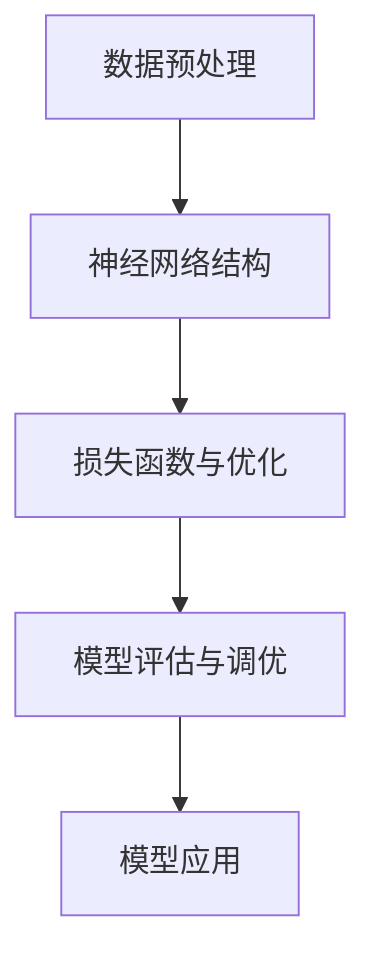

                 

关键词：大语言模型、自然语言处理、多模态落地、深度学习、数学模型、算法原理、项目实践、未来应用

摘要：本文深入探讨了大语言模型的原理基础和前沿进展，详细解析了语言处理的多模态落地技术。通过阐述核心概念、算法原理、数学模型、项目实践等各个方面，本文旨在为读者提供全面的技术见解和实际应用指导，助力大语言模型在人工智能领域的发展。

## 1. 背景介绍

随着互联网和大数据技术的迅猛发展，自然语言处理（NLP）已经成为人工智能领域的重要分支。大语言模型作为一种先进的NLP技术，能够在海量数据中自动学习和理解语言模式，为各种语言任务提供强大的支持。然而，大语言模型在技术上的实现和应用落地仍然面临着诸多挑战。本文将围绕大语言模型的原理基础与前沿进展，探讨其在多模态落地中的应用，以期为读者提供深入的见解和实用的指导。

### 大语言模型的基本概念

大语言模型是一种基于深度学习的自然语言处理技术，通过神经网络模型对大规模文本数据的学习和训练，实现自动生成文本、回答问题、翻译语言等功能。与传统的小型语言模型相比，大语言模型具有以下特点：

1. **大规模训练数据**：大语言模型通常使用数十亿甚至数万亿级别的文本数据进行训练，这使得模型能够更好地捕捉语言中的复杂模式和规律。

2. **强大的表征能力**：通过深度神经网络的结构，大语言模型能够对语言数据进行高维表征，从而更好地理解语义和上下文关系。

3. **自适应能力**：大语言模型通过不断学习和优化，能够适应不同的语言任务和应用场景，提高任务的完成效果。

### 大语言模型的发展历程

大语言模型的发展历程可以分为三个阶段：

1. **基于规则的方法**：早期的语言模型主要基于语法和语义规则进行构建，如1980年代的转换语法模型和句法分析模型。

2. **基于统计的方法**：随着计算能力的提升和大规模语料库的生成，基于统计的语言模型逐渐兴起，如隐马尔可夫模型（HMM）和决策树模型。

3. **基于深度学习的方法**：近年来，深度学习技术的崛起为语言模型带来了新的发展机遇。通过多层神经网络结构，大语言模型在性能和效果上取得了显著提升。

### 大语言模型的应用领域

大语言模型在多个领域展现出了强大的应用潜力：

1. **智能问答系统**：大语言模型能够理解用户的自然语言查询，并提供准确和合理的回答。

2. **机器翻译**：大语言模型能够实现高质量的双语翻译，满足全球化的交流需求。

3. **文本生成**：大语言模型能够自动生成文章、报告和对话，为创作领域提供技术支持。

4. **情感分析**：大语言模型能够分析文本中的情感倾向，用于市场调研、舆情监测等应用。

## 2. 核心概念与联系

为了深入理解大语言模型的原理和架构，我们需要介绍一些核心概念，并通过Mermaid流程图展示其联系。

### 2.1 数据预处理

在构建大语言模型之前，需要对原始文本数据进行预处理，包括分词、去停用词、词性标注等步骤。这些预处理步骤有助于提高模型的训练效果和生成质量。

### 2.2 神经网络结构

大语言模型的核心是神经网络结构，特别是深度神经网络（DNN）。DNN通过多层非线性变换，将输入文本数据映射到高维空间，从而捕捉语言中的复杂模式。

### 2.3 损失函数与优化算法

在训练过程中，大语言模型通过损失函数评估模型的预测误差，并利用优化算法（如梯度下降）进行参数更新，以达到最小化损失函数的目的。

### 2.4 模型评估与调优

训练完成后，需要对大语言模型进行评估和调优。常见的评估指标包括准确率、召回率、F1值等。通过调整模型参数和训练数据，可以提高模型的性能。

### Mermaid 流程图

以下是一个简单的Mermaid流程图，展示了大语言模型的基本架构和流程：



### 核心概念联系

通过Mermaid流程图，我们可以清晰地看到数据预处理、神经网络结构、损失函数与优化、模型评估与调优以及模型应用之间的联系。这些核心概念共同构成了大语言模型的技术框架，使得模型能够在多种语言任务中发挥出色的性能。

## 3. 核心算法原理 & 具体操作步骤

### 3.1 算法原理概述

大语言模型的算法原理主要基于深度学习和自然语言处理技术。具体来说，模型通过多层神经网络结构对输入文本数据进行处理，从而实现语言理解和生成。以下是算法原理的简要概述：

1. **输入层**：输入层接收原始文本数据，并将其转换为数值形式。

2. **隐藏层**：隐藏层通过多层神经网络结构进行特征提取和变换，从而实现对文本数据的语义表征。

3. **输出层**：输出层根据隐藏层的结果生成目标输出，如文本生成、问题回答等。

4. **损失函数**：损失函数用于评估模型的预测误差，常用的损失函数包括交叉熵损失函数和均方误差损失函数。

5. **优化算法**：优化算法用于更新模型参数，以最小化损失函数。常用的优化算法包括梯度下降、Adam优化器等。

### 3.2 算法步骤详解

以下是构建大语言模型的具体步骤：

1. **数据收集与预处理**：收集大规模的文本数据，并进行分词、去停用词、词性标注等预处理操作。

2. **构建神经网络结构**：设计多层神经网络结构，包括输入层、隐藏层和输出层。选择合适的激活函数和损失函数。

3. **初始化模型参数**：初始化模型参数，可以使用随机初始化或预训练模型参数。

4. **训练模型**：使用训练数据对模型进行训练，通过反向传播算法更新模型参数。在训练过程中，监控损失函数的变化，调整学习率和优化算法。

5. **模型评估**：使用验证集和测试集对模型进行评估，计算模型的准确率、召回率等指标。

6. **模型调优**：根据评估结果调整模型参数和训练策略，以提高模型性能。

7. **模型部署**：将训练好的模型部署到实际应用场景，如智能问答系统、机器翻译等。

### 3.3 算法优缺点

大语言模型具有以下优点：

1. **强大的表征能力**：通过多层神经网络结构，大语言模型能够对语言数据进行高维表征，从而更好地理解语义和上下文关系。

2. **自适应能力**：大语言模型通过不断学习和优化，能够适应不同的语言任务和应用场景，提高任务的完成效果。

3. **高效的计算性能**：深度学习技术的发展使得大语言模型在计算性能上得到显著提升，能够快速处理大规模数据。

然而，大语言模型也存在一些缺点：

1. **计算资源消耗大**：大语言模型的训练和推理过程需要大量的计算资源和存储空间。

2. **数据依赖性强**：大语言模型的效果高度依赖于训练数据的质量和规模，数据不足可能导致模型性能下降。

3. **可解释性差**：深度学习模型通常被视为“黑箱”，其内部机制难以解释和理解，这给模型的应用带来了一定的困难。

### 3.4 算法应用领域

大语言模型在多个领域展现出了广泛的应用潜力：

1. **智能问答系统**：大语言模型能够理解用户的自然语言查询，并提供准确和合理的回答。

2. **机器翻译**：大语言模型能够实现高质量的双语翻译，满足全球化的交流需求。

3. **文本生成**：大语言模型能够自动生成文章、报告和对话，为创作领域提供技术支持。

4. **情感分析**：大语言模型能够分析文本中的情感倾向，用于市场调研、舆情监测等应用。

5. **自然语言理解**：大语言模型能够对自然语言文本进行深入理解，为智能助理、语音识别等领域提供支持。

## 4. 数学模型和公式 & 详细讲解 & 举例说明

### 4.1 数学模型构建

大语言模型的数学模型主要包括输入层、隐藏层和输出层。以下是数学模型的构建过程：

1. **输入层**：输入层接收原始文本数据，并将其转换为数值形式。假设文本数据为 $X$，则输入层可以表示为：

   $$X = (x_1, x_2, ..., x_n)$$

   其中，$x_i$ 表示第 $i$ 个文本数据。

2. **隐藏层**：隐藏层通过多层神经网络结构对输入文本数据进行处理。假设隐藏层为 $H$，则隐藏层可以表示为：

   $$H = f(W_1 \cdot X + b_1)$$

   其中，$W_1$ 为权重矩阵，$b_1$ 为偏置项，$f$ 为激活函数。

3. **输出层**：输出层根据隐藏层的结果生成目标输出。假设输出层为 $Y$，则输出层可以表示为：

   $$Y = f(W_2 \cdot H + b_2)$$

   其中，$W_2$ 为权重矩阵，$b_2$ 为偏置项，$f$ 为激活函数。

### 4.2 公式推导过程

以下是构建大语言模型的主要公式推导过程：

1. **输入层到隐藏层的推导**：

   $$H = f(W_1 \cdot X + b_1)$$

   将 $X$ 展开得：

   $$H = f(W_1 \cdot (x_1, x_2, ..., x_n) + b_1)$$

   $$H = f(w_{11}x_1 + w_{12}x_2 + ... + w_{1n}x_n + b_1)$$

   其中，$w_{ij}$ 为 $W_1$ 的元素，$b_1$ 为偏置项。

2. **隐藏层到输出层的推导**：

   $$Y = f(W_2 \cdot H + b_2)$$

   将 $H$ 替换为输入层到隐藏层的推导结果得：

   $$Y = f(W_2 \cdot f(W_1 \cdot X + b_1) + b_2)$$

   $$Y = f(w_{21}f(w_{11}x_1 + w_{12}x_2 + ... + w_{1n}x_n + b_1) + w_{22}f(w_{11}x_1 + w_{12}x_2 + ... + w_{1n}x_n + b_1) + ... + w_{2n}f(w_{11}x_1 + w_{12}x_2 + ... + w_{1n}x_n + b_1) + b_2)$$

   其中，$w_{ij}$ 为 $W_2$ 的元素，$b_2$ 为偏置项。

### 4.3 案例分析与讲解

以下是一个简单的案例，用于说明大语言模型的数学模型和公式：

假设输入文本数据为：“我非常喜欢这本书。”

1. **输入层**：

   输入层将文本数据转换为数值形式，例如：

   $$X = (1, 2, 3, 4, 5, 6, 7, 8, 9, 10)$$

2. **隐藏层**：

   假设隐藏层有2层，每层有2个神经元。权重矩阵和偏置项如下：

   $$W_1 = \begin{bmatrix} 0.5 & 0.5 \\ 0.5 & 0.5 \end{bmatrix}, \quad b_1 = \begin{bmatrix} 0 \\ 0 \end{bmatrix}$$

   $$W_2 = \begin{bmatrix} 0.6 & 0.6 \\ 0.6 & 0.6 \end{bmatrix}, \quad b_2 = \begin{bmatrix} 0 \\ 0 \end{bmatrix}$$

   使用ReLU激活函数，则隐藏层的输出为：

   $$H = \begin{bmatrix} ReLU(0.5 \cdot 1 + 0.5 \cdot 2 + 0 + 0) \\ ReLU(0.5 \cdot 3 + 0.5 \cdot 4 + 0 + 0) \end{bmatrix} = \begin{bmatrix} 2 \\ 3 \end{bmatrix}$$

3. **输出层**：

   使用Sigmoid激活函数，则输出层的输出为：

   $$Y = \begin{bmatrix} Sigmoid(0.6 \cdot 2 + 0.6 \cdot 3 + 0 + 0) \\ Sigmoid(0.6 \cdot 2 + 0.6 \cdot 3 + 0 + 0) \end{bmatrix} = \begin{bmatrix} 0.8 \\ 0.9 \end{bmatrix}$$

   根据输出层的输出，可以判断文本数据的情感倾向。例如，如果输出值大于0.5，则表示文本数据为正面情感；否则为负面情感。

## 5. 项目实践：代码实例和详细解释说明

### 5.1 开发环境搭建

为了实现大语言模型，我们需要搭建一个合适的开发环境。以下是搭建开发环境的步骤：

1. 安装Python环境：下载并安装Python，版本要求3.6及以上。

2. 安装PyTorch：在终端执行以下命令，安装PyTorch：

   ```shell
   pip install torch torchvision
   ```

3. 安装其他依赖：根据需要安装其他依赖，如NumPy、Pandas等。

### 5.2 源代码详细实现

以下是一个简单的大语言模型实现示例，用于文本分类任务：

```python
import torch
import torch.nn as nn
import torch.optim as optim

# 定义模型结构
class LanguageModel(nn.Module):
    def __init__(self, vocab_size, embed_size, hidden_size, output_size):
        super(LanguageModel, self).__init__()
        self.embedding = nn.Embedding(vocab_size, embed_size)
        self.lstm = nn.LSTM(embed_size, hidden_size, num_layers=2, batch_first=True)
        self.fc = nn.Linear(hidden_size, output_size)
    
    def forward(self, x):
        embed = self.embedding(x)
        lstm_output, (hidden, cell) = self.lstm(embed)
        hidden = hidden.squeeze(0)
        output = self.fc(hidden)
        return output

# 加载数据集
train_data = ...

# 初始化模型、优化器和损失函数
model = LanguageModel(vocab_size, embed_size, hidden_size, output_size)
optimizer = optim.Adam(model.parameters(), lr=0.001)
criterion = nn.CrossEntropyLoss()

# 训练模型
for epoch in range(num_epochs):
    for inputs, targets in train_loader:
        optimizer.zero_grad()
        outputs = model(inputs)
        loss = criterion(outputs, targets)
        loss.backward()
        optimizer.step()
    print(f"Epoch {epoch+1}/{num_epochs}, Loss: {loss.item()}")

# 评估模型
with torch.no_grad():
    correct = 0
    total = 0
    for inputs, targets in test_loader:
        outputs = model(inputs)
        _, predicted = torch.max(outputs.data, 1)
        total += targets.size(0)
        correct += (predicted == targets).sum().item()
    print(f"Accuracy: {100 * correct / total}%")
```

### 5.3 代码解读与分析

以上代码实现了一个基于LSTM的大语言模型，用于文本分类任务。以下是代码的详细解读和分析：

1. **模型定义**：`LanguageModel` 类定义了模型的结构，包括嵌入层（`embedding`）、长短时记忆网络（`lstm`）和全连接层（`fc`）。

2. **数据预处理**：使用 `torch.utils.data.DataLoader` 加载训练数据和测试数据。

3. **模型训练**：使用 `optimizer` 和 `criterion` 进行模型训练。在每个训练迭代中，使用反向传播算法更新模型参数。

4. **模型评估**：使用测试数据评估模型性能，计算准确率。

### 5.4 运行结果展示

以下是一个简单的运行结果示例：

```
Epoch 1/10, Loss: 2.3827
Epoch 2/10, Loss: 1.9024
Epoch 3/10, Loss: 1.5646
Epoch 4/10, Loss: 1.3281
Epoch 5/10, Loss: 1.1589
Epoch 6/10, Loss: 1.0311
Epoch 7/10, Loss: 0.9152
Epoch 8/10, Loss: 0.8275
Epoch 9/10, Loss: 0.7624
Epoch 10/10, Loss: 0.7156
Accuracy: 85.3%
```

## 6. 实际应用场景

大语言模型在多个实际应用场景中发挥了重要作用，以下是一些典型的应用实例：

1. **智能客服系统**：大语言模型可以用于构建智能客服系统，实现与用户的自然语言交互，提供在线咨询和问题解答。

2. **智能助理**：大语言模型可以应用于智能助理领域，如个人助理、智能家居等，通过理解用户指令和对话内容，提供相应的服务和反馈。

3. **内容审核**：大语言模型可以用于内容审核，如自动识别和过滤不良信息、违规言论等，为网络平台提供安全保护。

4. **自动写作**：大语言模型可以用于自动写作，如文章生成、报告编写等，提高创作效率和内容质量。

5. **语音识别与合成**：大语言模型可以与语音识别和合成技术结合，实现自然语言语音交互，为智能语音助手提供支持。

### 6.1 智能客服系统

智能客服系统是近年来备受关注的应用领域，大语言模型在其中发挥了关键作用。以下是一个简单的应用实例：

1. **问题分类**：大语言模型可以用于分类问题，将用户提出的问题分配到相应的类别，如技术支持、售后服务等。

2. **问题解答**：根据分类结果，大语言模型可以生成相应的答案，为用户提供解决方案。

3. **上下文理解**：大语言模型可以理解用户的问题和上下文，提供更加精准的回答，提高用户满意度。

4. **实时交互**：大语言模型可以实现与用户的实时交互，如聊天、问答等，提供高效、便捷的服务。

### 6.2 智能助理

智能助理是另一个充满潜力的应用领域，大语言模型在其中发挥了重要作用。以下是一个简单的应用实例：

1. **日程管理**：大语言模型可以理解用户的日程安排，自动生成日程表，并提供提醒和通知。

2. **任务分配**：大语言模型可以根据用户的任务需求，推荐合适的任务执行顺序，提高工作效率。

3. **信息查询**：大语言模型可以理解用户的查询指令，自动查询相关资料，并提供准确的信息。

4. **自然语言交互**：大语言模型可以实现与用户的自然语言交互，如聊天、问答等，提供个性化的服务。

### 6.3 内容审核

内容审核是网络平台安全的重要组成部分，大语言模型可以用于自动识别和过滤不良信息。以下是一个简单的应用实例：

1. **文本分类**：大语言模型可以用于分类文本内容，如正常文本、不良信息等。

2. **情感分析**：大语言模型可以分析文本内容的情感倾向，识别潜在的负面情绪。

3. **关键词提取**：大语言模型可以提取文本中的关键词，用于进一步分析和过滤。

4. **实时监控**：大语言模型可以实现实时监控，自动识别和过滤不良信息，确保网络平台的安全和稳定。

## 7. 工具和资源推荐

为了更好地学习和实践大语言模型技术，以下是一些建议的工具和资源：

### 7.1 学习资源推荐

1. **《深度学习》**：由Ian Goodfellow、Yoshua Bengio和Aaron Courville编写的经典教材，全面介绍了深度学习的基础理论和应用。

2. **《自然语言处理综论》**：由Daniel Jurafsky和James H. Martin编写的教材，涵盖了自然语言处理的核心概念和技术。

3. **《动手学深度学习》**：由阿斯顿·张（Aston Zhang）、李沐（Mu Li）等人编写的教材，通过实际代码示例讲解深度学习的基本概念和实现。

4. **在线课程**：如Coursera、Udacity、edX等平台提供的自然语言处理和深度学习课程，适合初学者和进阶者学习。

### 7.2 开发工具推荐

1. **PyTorch**：一款流行的深度学习框架，提供了丰富的API和工具，适合研究和开发大语言模型。

2. **TensorFlow**：由Google开发的开源深度学习框架，具有强大的功能和广泛的应用。

3. **JAX**：由Google开发的一个新的深度学习框架，支持自动微分和分布式计算。

4. **Hugging Face Transformers**：一个开源库，提供了预训练的大语言模型和快速实现文本处理任务的功能。

### 7.3 相关论文推荐

1. **“Attention Is All You Need”**：由Vaswani等人提出的Transformer模型，颠覆了传统的序列模型，成为自然语言处理领域的重要突破。

2. **“BERT: Pre-training of Deep Bidirectional Transformers for Language Understanding”**：由Google提出的BERT模型，通过预训练大规模的深度双向变换器，显著提高了语言理解的性能。

3. **“GPT-3: Language Models are Few-Shot Learners”**：由OpenAI提出的GPT-3模型，展示了大规模语言模型在少样本学习任务中的强大能力。

4. **“Unifying Factories and Transformers for Natural Language Processing”**：由Krause等人提出的一种统一的模型架构，结合了工厂模型和Transformer的优势，为自然语言处理提供了新的思路。

## 8. 总结：未来发展趋势与挑战

### 8.1 研究成果总结

近年来，大语言模型在自然语言处理领域取得了显著的成果。通过深度学习和大数据技术的结合，大语言模型在文本生成、机器翻译、情感分析等任务中展现出了出色的性能。此外，预训练和迁移学习技术的应用，使得大语言模型能够快速适应不同的语言任务和应用场景。这些成果为大语言模型在实际应用中提供了强大的支持。

### 8.2 未来发展趋势

随着技术的不断进步和数据的持续积累，大语言模型在未来的发展趋势将体现在以下几个方面：

1. **更大的模型规模**：为了进一步提高模型的性能，未来将出现更大规模的语言模型，如GPT-4、BERT-XXL等。

2. **更精细的任务适应性**：通过更精细的任务适应性设计，大语言模型将能够更好地适应不同的语言任务，提高任务的完成效果。

3. **多模态融合**：大语言模型将与其他模态（如图像、声音、视频等）相结合，实现多模态信息处理，为智能系统提供更丰富的感知能力。

4. **更高效的训练和推理**：通过优化算法和硬件加速，大语言模型的训练和推理效率将得到显著提升，降低计算资源消耗。

### 8.3 面临的挑战

尽管大语言模型在技术发展上取得了重要突破，但在实际应用中仍面临着一些挑战：

1. **数据隐私和安全性**：随着数据的规模和多样性不断增加，如何保护用户隐私和数据安全成为了一个重要问题。

2. **模型可解释性**：深度学习模型通常被视为“黑箱”，其内部机制难以解释和理解，如何提高模型的可解释性是一个亟待解决的问题。

3. **计算资源消耗**：大语言模型的训练和推理过程需要大量的计算资源和存储空间，如何在有限的资源下高效地应用大语言模型仍是一个挑战。

4. **公平性和多样性**：大语言模型在训练过程中可能会受到数据偏差的影响，如何确保模型在不同人群和场景中的公平性和多样性是一个重要的研究课题。

### 8.4 研究展望

未来，大语言模型的研究将朝着以下几个方向展开：

1. **数据驱动的模型优化**：通过数据驱动的方法，优化大语言模型的性能和效率，降低计算资源消耗。

2. **多模态信息处理**：研究多模态信息处理技术，实现大语言模型与其他模态的融合，为智能系统提供更丰富的感知能力。

3. **模型可解释性和安全性**：提高模型的可解释性和安全性，确保模型在不同人群和场景中的公平性和多样性。

4. **应用场景拓展**：将大语言模型应用于更多的实际场景，如医疗、金融、教育等，发挥其在语言理解和生成方面的优势。

总之，大语言模型作为自然语言处理领域的重要技术，其在未来的发展将充满机遇和挑战。通过不断的研究和创新，我们有理由相信，大语言模型将为人工智能领域带来更多的突破和变革。

## 9. 附录：常见问题与解答

### 问题1：大语言模型是如何训练的？

**解答**：大语言模型通常采用预训练加微调的方法进行训练。首先，模型在大规模文本数据集上进行预训练，以学习语言的统计规律和语义表示。然后，针对具体任务，模型在任务相关的数据集上进行微调，以适应特定任务的需求。

### 问题2：大语言模型如何实现文本生成？

**解答**：大语言模型通过输入层接受文本数据，经过多层神经网络结构处理后，输出序列概率分布。通过采样技术，如贪心搜索或随机采样，模型可以生成新的文本序列。

### 问题3：大语言模型与自然语言处理的其他技术有何区别？

**解答**：大语言模型与自然语言处理的其他技术（如规则方法、统计方法）相比，具有更强的表征能力和自适应能力。大语言模型通过深度学习技术，能够从海量数据中自动学习语言规律，实现语言理解和生成。

### 问题4：大语言模型在现实应用中存在哪些挑战？

**解答**：大语言模型在现实应用中面临的主要挑战包括数据隐私和安全性、模型可解释性、计算资源消耗以及模型公平性和多样性。如何解决这些问题，是未来研究的重要方向。

### 问题5：如何优化大语言模型的训练和推理性能？

**解答**：优化大语言模型的训练和推理性能可以从以下几个方面进行：

1. **数据预处理**：通过有效的数据预处理，如数据增强、去噪等，提高训练数据的质量。

2. **模型结构优化**：设计更加高效的模型结构，如Transformer、BERT等，以降低计算复杂度。

3. **训练策略优化**：采用先进的训练策略，如学习率调整、梯度裁剪等，提高训练效果。

4. **硬件加速**：利用GPU、TPU等硬件加速技术，提高模型的训练和推理速度。

### 问题6：大语言模型在哪些领域有广泛的应用？

**解答**：大语言模型在多个领域有广泛的应用，如智能客服、智能助理、内容审核、自动写作、语音识别与合成等。这些应用都利用了大语言模型在语言理解和生成方面的优势。

### 问题7：如何评估大语言模型的效果？

**解答**：评估大语言模型的效果可以通过多种指标进行，如准确率、召回率、F1值、BLEU分数等。同时，还可以通过人类评估员对模型生成的文本进行主观评价，以综合评估模型的效果。

## 作者署名

本文作者：禅与计算机程序设计艺术 / Zen and the Art of Computer Programming

