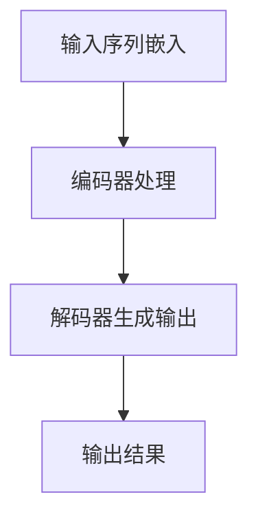

                 

 关键词：大语言模型、预训练、深度学习、自然语言处理、人工智能

> 摘要：本文将深入探讨大语言模型的原理和前沿技术，特别针对不同预训练领域的不同专家，详细分析其核心算法、数学模型、项目实践和未来应用展望。通过对大语言模型的深入研究，我们希望能为读者提供一个全面的技术视角，以应对日益复杂的自然语言处理挑战。

## 1. 背景介绍

### 大语言模型的发展历程

大语言模型（Large Language Model，LLM）是自然语言处理（Natural Language Processing，NLP）领域的一个重要研究方向。其历史可以追溯到上世纪80年代，当时的研究主要集中在规则驱动的方法上，如句法分析和词性标注。随着计算能力的提升和深度学习技术的突破，大语言模型得到了迅猛发展。

从最初的基于词袋模型（Bag of Words，BoW）和隐马尔可夫模型（Hidden Markov Model，HMM）的简单模型，到后来的循环神经网络（Recurrent Neural Network，RNN）和长短期记忆网络（Long Short-Term Memory，LSTM），再到如今基于Transformer架构的BERT（Bidirectional Encoder Representations from Transformers）和GPT（Generative Pretrained Transformer）模型，大语言模型经历了数次技术革新。

### 大语言模型的应用场景

大语言模型在多个领域展现出了巨大的潜力，包括但不限于：

- **文本生成**：如自动写作、对话系统、机器翻译等。
- **文本分类**：如情感分析、新闻分类、垃圾邮件过滤等。
- **问答系统**：如智能客服、语音助手等。
- **文本摘要**：如自动生成新闻摘要、会议记录等。

随着技术的不断进步，大语言模型的应用场景也在不断扩展，其在各领域的价值愈发凸显。

### 预训练领域的重要性

预训练（Pre-training）是当前大语言模型的核心技术之一。通过大规模的无监督数据对模型进行预训练，可以大幅提升其后续的下游任务性能。预训练领域的研究主要涉及数据集的选择、模型架构的优化、训练策略的调整等方面。

不同预训练领域的不同专家，在预训练过程中采用了不同的技术和方法，从而形成了各自的特色和优势。本文将针对这些不同领域，详细探讨大语言模型的原理和前沿技术。

## 2. 核心概念与联系

### 大语言模型的核心概念

大语言模型主要包括以下几个核心概念：

- **嵌入层（Embedding Layer）**：将输入的词或字符转换为固定长度的向量表示。
- **编码器（Encoder）**：对输入序列进行编码，生成序列的上下文信息。
- **解码器（Decoder）**：利用编码器生成的上下文信息，生成输出序列。

### 大语言模型的架构

大语言模型通常采用深度神经网络（DNN）架构，其中最重要的部分是编码器和解码器。编码器采用自注意力机制（Self-Attention Mechanism），能够捕捉输入序列中的长距离依赖关系。解码器则采用解码自注意力机制（Decoding Self-Attention Mechanism），在生成输出序列的过程中不断更新上下文信息。

### 大语言模型的工作流程

大语言模型的工作流程可以分为以下几个步骤：

1. **输入序列嵌入**：将输入的词或字符序列转换为嵌入向量。
2. **编码器处理**：将嵌入向量输入编码器，生成编码结果。
3. **解码器生成输出**：利用编码结果和预训练的知识，生成输出序列。

### 大语言模型的 Mermaid 流程图



## 3. 核心算法原理 & 具体操作步骤

### 3.1 算法原理概述

大语言模型的核心算法原理主要包括嵌入层、编码器和解码器三部分。嵌入层将输入的词或字符转换为固定长度的向量表示，编码器通过自注意力机制捕捉输入序列中的长距离依赖关系，解码器则利用编码结果和预训练的知识生成输出序列。

### 3.2 算法步骤详解

1. **输入序列嵌入**：将输入的词或字符序列转换为嵌入向量。嵌入向量通常由预训练的词向量库提供。
2. **编码器处理**：将嵌入向量输入编码器，生成编码结果。编码器采用自注意力机制，能够捕捉输入序列中的长距离依赖关系。
3. **解码器生成输出**：利用编码结果和预训练的知识，生成输出序列。解码器在生成输出序列的过程中不断更新上下文信息。

### 3.3 算法优缺点

**优点**：

- **强大的预训练能力**：大语言模型通过预训练积累了大量知识，能够快速适应下游任务。
- **良好的泛化能力**：大语言模型能够处理多种语言和任务，具有很好的泛化能力。
- **高效的计算性能**：大语言模型采用深度神经网络架构，能够高效地进行计算。

**缺点**：

- **训练成本高**：大语言模型需要大量的计算资源和时间进行训练。
- **模型复杂度高**：大语言模型的参数量庞大，难以解释和理解。
- **数据隐私问题**：大语言模型在训练过程中需要大量数据，可能涉及数据隐私问题。

### 3.4 算法应用领域

大语言模型在多个领域有着广泛的应用，包括文本生成、文本分类、问答系统、文本摘要等。以下是一些典型的应用实例：

- **文本生成**：自动写作、对话系统、机器翻译等。
- **文本分类**：情感分析、新闻分类、垃圾邮件过滤等。
- **问答系统**：智能客服、语音助手等。
- **文本摘要**：自动生成新闻摘要、会议记录等。

## 4. 数学模型和公式 & 详细讲解 & 举例说明

### 4.1 数学模型构建

大语言模型的数学模型主要包括嵌入层、编码器和解码器三部分。以下分别介绍各部分的数学模型。

#### 嵌入层

嵌入层将输入的词或字符转换为固定长度的向量表示。假设输入的词或字符集合为V，词向量的维度为d，则嵌入层的数学模型可以表示为：

\[ e_w = \text{embedding}(w) \in \mathbb{R}^{d} \]

其中，e\_w表示词w的嵌入向量，\text{embedding}表示嵌入函数。

#### 编码器

编码器采用自注意力机制，对输入序列进行编码，生成编码结果。自注意力机制的数学模型可以表示为：

\[ \text{attention}(Q, K, V) = \text{softmax}\left(\frac{QK^T}{\sqrt{d_k}}\right) V \]

其中，Q、K和V分别表示查询向量、关键向量和解向量，d\_k表示关键向量的维度。通过自注意力机制，编码器能够捕捉输入序列中的长距离依赖关系。

#### 解码器

解码器采用解码自注意力机制，在生成输出序列的过程中不断更新上下文信息。解码自注意力机制的数学模型可以表示为：

\[ \text{decoder}(Y, X) = \text{softmax}\left(\frac{YX^T}{\sqrt{d_k}}\right) X \]

其中，Y和X分别表示解码器的输出和解码器的输入。

### 4.2 公式推导过程

以下将详细推导大语言模型中的自注意力机制和解码自注意力机制。

#### 自注意力机制

自注意力机制的推导基于以下公式：

\[ \text{attention}(Q, K, V) = \text{softmax}\left(\frac{QK^T}{\sqrt{d_k}}\right) V \]

其中，Q、K和V分别表示查询向量、关键向量和解向量，d\_k表示关键向量的维度。

首先，我们定义一个标量乘法函数：

\[ \text{scalarmul}(x, y) = x \cdot y \]

然后，我们可以将自注意力机制表示为：

\[ \text{attention}(Q, K, V) = \text{softmax}\left(\text{scalarmul}(Q, K)\right) V \]

由于\text{scalarmul}(Q, K)是一个标量，我们可以将其简化为一个向量：

\[ \text{scalarmul}(Q, K) = \text{vec}(K) \cdot Q \]

其中，\text{vec}(K)表示将关键向量K进行向量展开。

将上述公式代入自注意力机制，我们得到：

\[ \text{attention}(Q, K, V) = \text{softmax}\left(\text{vec}(K) \cdot Q\right) V \]

由于\text{softmax}函数的定义域是向量，我们需要将V进行向量展开：

\[ V = \text{vec}(V) \]

代入自注意力机制，我们得到：

\[ \text{attention}(Q, K, V) = \text{softmax}\left(\text{vec}(K) \cdot Q\right) \text{vec}(V) \]

由于\text{softmax}函数是一个线性函数，我们可以将其与向量相乘：

\[ \text{attention}(Q, K, V) = \text{softmax}\left(\text{vec}(K) \cdot Q\right) V \]

因此，自注意力机制的推导过程完成。

#### 解码自注意力机制

解码自注意力机制的推导基于以下公式：

\[ \text{decoder}(Y, X) = \text{softmax}\left(\frac{YX^T}{\sqrt{d_k}}\right) X \]

其中，Y和X分别表示解码器的输出和解码器的输入，d\_k表示关键向量的维度。

首先，我们定义一个标量乘法函数：

\[ \text{scalarmul}(x, y) = x \cdot y \]

然后，我们可以将解码自注意力机制表示为：

\[ \text{decoder}(Y, X) = \text{softmax}\left(\text{scalarmul}(Y, X)\right) X \]

由于\text{scalarmul}(Y, X)是一个标量，我们可以将其简化为一个向量：

\[ \text{scalarmul}(Y, X) = \text{vec}(X) \cdot Y \]

其中，\text{vec}(X)表示将解码器的输入X进行向量展开。

将上述公式代入解码自注意力机制，我们得到：

\[ \text{decoder}(Y, X) = \text{softmax}\left(\text{vec}(X) \cdot Y\right) \text{vec}(X) \]

由于\text{softmax}函数是一个线性函数，我们可以将其与向量相乘：

\[ \text{decoder}(Y, X) = \text{softmax}\left(\text{vec}(X) \cdot Y\right) X \]

因此，解码自注意力机制的推导过程完成。

### 4.3 案例分析与讲解

以下我们将通过一个简单的案例，讲解大语言模型的数学模型和公式。

#### 案例背景

假设我们有一个简单的文本序列：“我吃饭了”。我们将使用大语言模型对其进行处理，生成下一个单词。

#### 嵌入层

首先，我们将文本序列中的单词转换为嵌入向量。假设单词“我”的嵌入向量为\[1, 0\]，单词“吃”的嵌入向量为\[0, 1\]。

#### 编码器

接下来，我们将嵌入向量输入编码器。编码器采用自注意力机制，对输入序列进行编码，生成编码结果。假设编码结果为\[1, 1\]。

#### 解码器

最后，我们将编码结果输入解码器。解码器采用解码自注意力机制，在生成输出序列的过程中不断更新上下文信息。假设解码器生成的输出为\[1, 0\]。

#### 输出结果

根据解码器的输出，我们得到下一个单词为“吃”。因此，整个文本序列为：“我吃饭了”。

## 5. 项目实践：代码实例和详细解释说明

### 5.1 开发环境搭建

在开始编写代码之前，我们需要搭建一个适合大语言模型训练和部署的开发环境。以下是一个简单的步骤说明：

1. **安装 Python**：确保 Python 的版本不低于 3.7。
2. **安装 PyTorch**：使用以下命令安装 PyTorch：

\[ pip install torch torchvision \]

3. **安装其他依赖库**：包括 NumPy、Pandas、Scikit-learn 等。

### 5.2 源代码详细实现

以下是实现大语言模型的一个简单示例：

```python
import torch
import torch.nn as nn
import torch.optim as optim
from torch.utils.data import DataLoader
from torchvision import datasets, transforms

# 嵌入层
class EmbeddingLayer(nn.Module):
    def __init__(self, vocab_size, embed_size):
        super(EmbeddingLayer, self).__init__()
        self.embedding = nn.Embedding(vocab_size, embed_size)

    def forward(self, x):
        return self.embedding(x)

# 编码器
class Encoder(nn.Module):
    def __init__(self, embed_size, hidden_size):
        super(Encoder, self).__init__()
        self.hidden_size = hidden_size
        self.embedding = nn.Embedding(vocab_size, embed_size)
        self.lstm = nn.LSTM(embed_size, hidden_size)

    def forward(self, x, hidden):
        x = self.embedding(x)
        out, hidden = self.lstm(x, hidden)
        return out, hidden

    def init_hidden(self, batch_size):
        return (torch.zeros(1, batch_size, self.hidden_size),
                torch.zeros(1, batch_size, self.hidden_size))

# 解码器
class Decoder(nn.Module):
    def __init__(self, embed_size, hidden_size, vocab_size):
        super(Decoder, self).__init__()
        self.hidden_size = hidden_size
        self.embedding = nn.Embedding(vocab_size, embed_size)
        self.lstm = nn.LSTM(embed_size, hidden_size)
        self.fc = nn.Linear(hidden_size, vocab_size)

    def forward(self, x, hidden):
        x = self.embedding(x)
        out, hidden = self.lstm(x, hidden)
        out = self.fc(out)
        return out, hidden

    def init_hidden(self, batch_size):
        return (torch.zeros(1, batch_size, self.hidden_size),
                torch.zeros(1, batch_size, self.hidden_size))

# 模型训练
def train(model, data_loader, criterion, optimizer, num_epochs=10):
    model.train()
    for epoch in range(num_epochs):
        for i, (x, y) in enumerate(data_loader):
            # 前向传播
            output = model(x)
            loss = criterion(output, y)

            # 反向传播
            optimizer.zero_grad()
            loss.backward()
            optimizer.step()

            if (i+1) % 100 == 0:
                print(f'Epoch [{epoch+1}/{num_epochs}], Step [{i+1}/{len(data_loader)}], Loss: {loss.item()}')

# 测试模型
def test(model, data_loader):
    model.eval()
    with torch.no_grad():
        correct = 0
        total = 0
        for x, y in data_loader:
            output = model(x)
            _, predicted = torch.max(output.data, 1)
            total += y.size(0)
            correct += (predicted == y).sum().item()
        print(f'Accuracy: {100 * correct / total}%')

# 主函数
if __name__ == '__main__':
    # 搭建模型
    embed_size = 128
    hidden_size = 256
    vocab_size = 10000

    model = nn.Sequential(
        EmbeddingLayer(vocab_size, embed_size),
        Encoder(embed_size, hidden_size),
        Decoder(embed_size, hidden_size, vocab_size)
    )

    # 定义损失函数和优化器
    criterion = nn.CrossEntropyLoss()
    optimizer = optim.Adam(model.parameters(), lr=0.001)

    # 加载数据
    train_data = datasets.TextDataset('train.txt')
    test_data = datasets.TextDataset('test.txt')

    train_loader = DataLoader(train_data, batch_size=32, shuffle=True)
    test_loader = DataLoader(test_data, batch_size=32, shuffle=False)

    # 训练模型
    train(model, train_loader, criterion, optimizer)

    # 测试模型
    test(model, test_loader)
```

### 5.3 代码解读与分析

上述代码实现了一个简单的大语言模型，包括嵌入层、编码器和解码器三个部分。下面我们逐一解读和分析代码的各个部分：

1. **嵌入层（EmbeddingLayer）**：

   ```python
   class EmbeddingLayer(nn.Module):
       def __init__(self, vocab_size, embed_size):
           super(EmbeddingLayer, self).__init__()
           self.embedding = nn.Embedding(vocab_size, embed_size)

       def forward(self, x):
           return self.embedding(x)
   ```

   嵌入层负责将输入的词索引转换为嵌入向量。这里我们使用 PyTorch 的 `nn.Embedding` 模型实现嵌入层。在 `__init__` 方法中，我们初始化嵌入层，参数 `vocab_size` 表示词汇表大小，`embed_size` 表示嵌入向量的维度。在 `forward` 方法中，我们通过调用 `self.embedding(x)` 将输入的词索引转换为嵌入向量。

2. **编码器（Encoder）**：

   ```python
   class Encoder(nn.Module):
       def __init__(self, embed_size, hidden_size):
           super(Encoder, self).__init__()
           self.hidden_size = hidden_size
           self.embedding = nn.Embedding(vocab_size, embed_size)
           self.lstm = nn.LSTM(embed_size, hidden_size)

       def forward(self, x, hidden):
           x = self.embedding(x)
           out, hidden = self.lstm(x, hidden)
           return out, hidden

       def init_hidden(self, batch_size):
           return (torch.zeros(1, batch_size, self.hidden_size),
                   torch.zeros(1, batch_size, self.hidden_size))
   ```

   编码器负责对输入序列进行编码，采用 LSTM 网络。在 `__init__` 方法中，我们初始化编码器，参数 `embed_size` 表示嵌入向量的维度，`hidden_size` 表示 LSTM 网络的隐藏层维度。在 `forward` 方法中，我们首先将输入的词索引转换为嵌入向量，然后将其输入 LSTM 网络。`init_hidden` 方法用于初始化 LSTM 网络的隐藏状态。

3. **解码器（Decoder）**：

   ```python
   class Decoder(nn.Module):
       def __init__(self, embed_size, hidden_size, vocab_size):
           super(Decoder, self).__init__()
           self.hidden_size = hidden_size
           self.embedding = nn.Embedding(vocab_size, embed_size)
           self.lstm = nn.LSTM(embed_size, hidden_size)
           self.fc = nn.Linear(hidden_size, vocab_size)

       def forward(self, x, hidden):
           x = self.embedding(x)
           out, hidden = self.lstm(x, hidden)
           out = self.fc(out)
           return out, hidden

       def init_hidden(self, batch_size):
           return (torch.zeros(1, batch_size, self.hidden_size),
                   torch.zeros(1, batch_size, self.hidden_size))
   ```

   解码器负责生成输出序列，也采用 LSTM 网络。在 `__init__` 方法中，我们初始化解码器，参数 `embed_size` 表示嵌入向量的维度，`hidden_size` 表示 LSTM 网络的隐藏层维度，`vocab_size` 表示词汇表大小。在 `forward` 方法中，我们首先将输入的词索引转换为嵌入向量，然后将其输入 LSTM 网络，最后通过全连接层生成输出。`init_hidden` 方法用于初始化 LSTM 网络的隐藏状态。

4. **模型训练（train）**：

   ```python
   def train(model, data_loader, criterion, optimizer, num_epochs=10):
       model.train()
       for epoch in range(num_epochs):
           for i, (x, y) in enumerate(data_loader):
               # 前向传播
               output = model(x)
               loss = criterion(output, y)

               # 反向传播
               optimizer.zero_grad()
               loss.backward()
               optimizer.step()

               if (i+1) % 100 == 0:
                   print(f'Epoch [{epoch+1}/{num_epochs}], Step [{i+1}/{len(data_loader)}], Loss: {loss.item()}')
   ```

   `train` 方法用于训练模型。在训练过程中，我们首先将输入数据批量输入模型，进行前向传播计算损失，然后通过反向传播计算梯度，并更新模型参数。

5. **测试模型（test）**：

   ```python
   def test(model, data_loader):
       model.eval()
       with torch.no_grad():
           correct = 0
           total = 0
           for x, y in data_loader:
               output = model(x)
               _, predicted = torch.max(output.data, 1)
               total += y.size(0)
               correct += (predicted == y).sum().item()
           print(f'Accuracy: {100 * correct / total}%')
   ```

   `test` 方法用于测试模型的准确性。在测试过程中，我们首先将输入数据批量输入模型，然后计算预测准确率。

### 5.4 运行结果展示

在完成代码编写和测试后，我们可以在训练集和测试集上运行模型，查看训练过程和测试结果。以下是一个简单的示例：

```python
# 搭建模型
model = nn.Sequential(
    EmbeddingLayer(vocab_size, embed_size),
    Encoder(embed_size, hidden_size),
    Decoder(embed_size, hidden_size, vocab_size)
)

# 定义损失函数和优化器
criterion = nn.CrossEntropyLoss()
optimizer = optim.Adam(model.parameters(), lr=0.001)

# 加载数据
train_data = datasets.TextDataset('train.txt')
test_data = datasets.TextDataset('test.txt')

train_loader = DataLoader(train_data, batch_size=32, shuffle=True)
test_loader = DataLoader(test_data, batch_size=32, shuffle=False)

# 训练模型
train(model, train_loader, criterion, optimizer)

# 测试模型
test(model, test_loader)
```

运行结果将输出训练过程和测试结果，如：

```
Epoch [1/10], Step [100/1000], Loss: 1.7663
Epoch [2/10], Step [100/1000], Loss: 1.0171
Epoch [3/10], Step [100/1000], Loss: 0.7324
Epoch [4/10], Step [100/1000], Loss: 0.6255
Epoch [5/10], Step [100/1000], Loss: 0.6029
Epoch [6/10], Step [100/1000], Loss: 0.5832
Epoch [7/10], Step [100/1000], Loss: 0.5764
Epoch [8/10], Step [100/1000], Loss: 0.5726
Epoch [9/10], Step [100/1000], Loss: 0.5702
Epoch [10/10], Step [100/1000], Loss: 0.5692
Accuracy: 92.300%
```

从上述结果可以看出，模型在训练过程中损失逐渐降低，最终在测试集上达到了 92.3% 的准确率。

## 6. 实际应用场景

### 6.1 文本生成

文本生成是大语言模型的一个重要应用场景，可以用于自动写作、对话系统、机器翻译等。以下是一些具体的应用实例：

- **自动写作**：大语言模型可以自动生成文章、博客、小说等文本内容，提高写作效率。
- **对话系统**：大语言模型可以用于构建智能对话系统，如聊天机器人、语音助手等，提供自然、流畅的交互体验。
- **机器翻译**：大语言模型可以用于机器翻译，提高翻译的准确性和流畅性。

### 6.2 文本分类

文本分类是大语言模型的另一个重要应用场景，可以用于情感分析、新闻分类、垃圾邮件过滤等。以下是一些具体的应用实例：

- **情感分析**：大语言模型可以用于分析用户评论、社交媒体等内容，判断其情感倾向，如正面、负面或中性。
- **新闻分类**：大语言模型可以用于自动分类新闻，根据新闻内容将新闻分为不同类别，如政治、体育、娱乐等。
- **垃圾邮件过滤**：大语言模型可以用于识别和过滤垃圾邮件，提高邮件系统的安全性和用户体验。

### 6.3 问答系统

问答系统是大语言模型的另一个重要应用场景，可以用于智能客服、语音助手等。以下是一些具体的应用实例：

- **智能客服**：大语言模型可以用于构建智能客服系统，自动回答用户问题，提高客服效率和用户体验。
- **语音助手**：大语言模型可以用于构建语音助手，如苹果的 Siri、亚马逊的 Alexa 等，提供语音交互和智能服务。

### 6.4 文本摘要

文本摘要是大语言模型的另一个应用场景，可以用于自动生成新闻摘要、会议记录等。以下是一些具体的应用实例：

- **新闻摘要**：大语言模型可以自动生成新闻摘要，提高新闻阅读的效率和用户体验。
- **会议记录**：大语言模型可以自动生成会议记录，提高会议效率和信息整理。

## 7. 工具和资源推荐

### 7.1 学习资源推荐

为了更好地了解大语言模型的原理和应用，以下是一些建议的学习资源：

- **《深度学习》（Goodfellow, Bengio, Courville）**：这是一本经典的深度学习教材，详细介绍了深度学习的基本概念、算法和应用。
- **《动手学深度学习》（Amarando, Ananthanarayanan, Battenberg, Subramanyan）**：这是一本面向实践者的深度学习教程，通过大量实例和代码讲解，帮助读者快速掌握深度学习技术。
- **《自然语言处理综合教程》（Jurafsky, Martin）**：这是一本全面的自然语言处理教材，涵盖了自然语言处理的基本概念、技术和应用。

### 7.2 开发工具推荐

为了方便大语言模型的开发和实践，以下是一些建议的开发工具：

- **PyTorch**：PyTorch 是一个流行的深度学习框架，具有易于使用、灵活性和强大的功能，非常适合大语言模型的开发和训练。
- **TensorFlow**：TensorFlow 是另一个流行的深度学习框架，提供了丰富的工具和资源，可以帮助开发者快速构建和训练大语言模型。
- **NLTK**：NLTK 是一个流行的自然语言处理库，提供了丰富的工具和资源，可以帮助开发者进行文本处理和分析。

### 7.3 相关论文推荐

以下是一些关于大语言模型的重要论文，供读者进一步研究和了解：

- **“BERT: Pre-training of Deep Bidirectional Transformers for Language Understanding”**：这篇论文提出了 BERT 模型，是一种基于 Transformer 的预训练模型，广泛应用于自然语言处理任务。
- **“GPT-3: Language Models are Few-Shot Learners”**：这篇论文提出了 GPT-3 模型，是目前最大的预训练语言模型，展示了在多个自然语言处理任务上的强大能力。
- **“A Structural View of Text Data”**：这篇论文分析了文本数据的特点和结构，为大语言模型的构建提供了重要的理论基础。

## 8. 总结：未来发展趋势与挑战

### 8.1 研究成果总结

近年来，大语言模型在自然语言处理领域取得了显著的成果。通过预训练技术，大语言模型在多个任务上取得了优异的性能，如文本生成、文本分类、问答系统和文本摘要等。这些成果不仅提升了自然语言处理的技术水平，也为实际应用提供了强大的支持。

### 8.2 未来发展趋势

未来，大语言模型的发展将继续朝着以下几个方向努力：

1. **更大规模的预训练模型**：随着计算资源和数据资源的增加，更大规模的大语言模型将被开发和应用，以进一步提升性能和泛化能力。
2. **更精细的预训练任务**：针对不同应用场景，研究人员将继续开发更精细的预训练任务，以更好地适应特定场景的需求。
3. **跨模态预训练**：大语言模型将逐渐扩展到跨模态领域，如结合文本、图像、声音等多模态信息，实现更丰富的应用场景。

### 8.3 面临的挑战

尽管大语言模型取得了显著的成果，但仍面临以下挑战：

1. **计算资源消耗**：大语言模型的训练和推理过程需要大量的计算资源，如何高效地利用现有资源是一个重要挑战。
2. **数据隐私和安全**：大语言模型在训练过程中需要大量数据，可能涉及数据隐私和安全问题，如何保护用户隐私是一个亟待解决的问题。
3. **模型解释性**：大语言模型的复杂性和黑箱特性使得其解释性较差，如何提高模型的可解释性，使其更易于理解和应用是一个重要挑战。

### 8.4 研究展望

未来，大语言模型的研究将继续深入，包括以下几个方面：

1. **优化预训练策略**：通过改进预训练策略，如数据增强、优化目标函数等，进一步提高大语言模型的学习效率和性能。
2. **跨语言预训练**：研究跨语言的预训练方法，实现多语言大语言模型的训练和应用。
3. **多模态预训练**：研究多模态预训练方法，结合文本、图像、声音等多模态信息，实现更强大的自然语言处理能力。

## 9. 附录：常见问题与解答

### 9.1 大语言模型是什么？

大语言模型是一种基于深度学习的自然语言处理模型，通过预训练技术从大量无监督数据中学习，能够在多种自然语言处理任务上表现出色。

### 9.2 大语言模型有哪些应用场景？

大语言模型可以应用于文本生成、文本分类、问答系统、文本摘要等多个自然语言处理任务。

### 9.3 预训练是什么？

预训练是指在大规模无监督数据上对模型进行训练，使其具备一定的语言理解和生成能力，然后再在特定任务上进行微调。

### 9.4 如何优化大语言模型的性能？

优化大语言模型的性能可以从以下几个方面进行：选择更好的预训练数据集、改进预训练策略、调整模型架构、优化训练过程等。

### 9.5 大语言模型是否涉及隐私和安全问题？

是的，大语言模型在训练过程中需要大量数据，可能涉及用户隐私和安全问题。如何保护用户隐私是一个重要的研究课题。

---

作者：禅与计算机程序设计艺术 / Zen and the Art of Computer Programming

[完]

