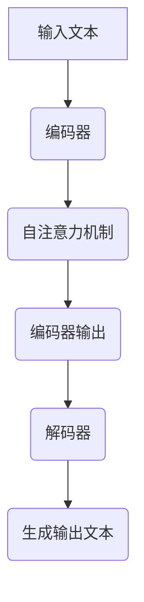

                 

关键词：大语言模型、预训练、微调、Transformer、深度学习、自然语言处理、人工智能

摘要：本文将深入探讨大语言模型的原理和前沿发展，特别是预训练和微调Transformer模型所带来的新启示。我们将详细解析其核心概念、算法原理、数学模型及其在实际应用中的表现。通过分析，我们希望为读者提供一个全面且直观的理解，为未来研究和应用提供有益的参考。

## 1. 背景介绍

自然语言处理（Natural Language Processing，NLP）作为人工智能领域的一个重要分支，一直致力于使计算机能够理解、生成和处理人类语言。随着深度学习技术的飞速发展，特别是Transformer模型的提出，NLP领域迎来了前所未有的突破。大语言模型（Large Language Model）作为这一领域的代表性成果，以其强大的文本理解和生成能力，逐渐成为研究的热点和应用的基石。

大语言模型的发展可以分为两个阶段：预训练和微调。预训练阶段，模型在大规模的语料库上进行无监督训练，从而学习到语言的基本规律和特征。微调阶段，模型在特定任务上进行有监督训练，进一步优化其表现。这种端到端的训练方式，使得大语言模型在许多任务上都取得了显著的效果，如机器翻译、文本分类、问答系统等。

本文将围绕大语言模型的核心概念、算法原理、数学模型和实际应用，展开深入探讨，旨在为读者提供一个全面而清晰的理解。

## 2. 核心概念与联系

### 2.1 大语言模型的基本概念

大语言模型是一种基于深度学习的自然语言处理模型，其核心目标是理解和生成人类语言。与传统基于规则或统计方法的NLP模型相比，大语言模型能够自动学习语言中的复杂结构和语义信息，从而实现更高水平的语言理解和生成。

大语言模型通常由多个神经网络层组成，每一层都能够对输入的文本数据进行编码和解码。这些层通过学习大量的文本数据，逐步提取出语言中的抽象特征和语义信息，最终形成一个强大的语言理解能力。

### 2.2 Transformer模型的结构与原理

Transformer模型是近年来提出的一种全新的深度学习模型结构，其核心思想是利用自注意力机制（Self-Attention）来处理序列数据。与传统循环神经网络（RNN）和卷积神经网络（CNN）相比，Transformer模型在处理长序列数据时具有更高的效率和更优的性能。

Transformer模型主要由编码器（Encoder）和解码器（Decoder）两部分组成。编码器负责将输入的序列数据编码成固定长度的向量表示，解码器则根据这些向量表示生成输出序列。

在Transformer模型中，自注意力机制是一个关键组件。自注意力机制通过计算序列中每个词与所有其他词之间的关联性，从而生成一个加权向量表示。这种加权向量表示能够捕捉到序列中词与词之间的长距离依赖关系，从而提高模型的表示能力和理解能力。

### 2.3 Mermaid流程图展示

下面是一个简化的Mermaid流程图，展示了大语言模型的基本架构和主要组件：



在这个流程图中，输入文本首先经过编码器处理，通过自注意力机制生成编码器输出。解码器则根据编码器输出和已生成的部分文本，逐步生成完整的输出文本。

## 3. 核心算法原理 & 具体操作步骤

### 3.1 算法原理概述

大语言模型的算法原理主要基于深度学习和自然语言处理技术。其核心思想是通过学习大量的文本数据，自动提取出语言中的抽象特征和语义信息，从而实现高水平的语言理解和生成。

具体来说，大语言模型的算法原理包括以下几个方面：

1. **词嵌入（Word Embedding）**：将输入的文本转换为固定长度的向量表示，从而将文本数据转化为计算机可以处理的数字形式。
2. **编码器（Encoder）**：通过对输入的词向量进行编码，生成一个固定长度的向量表示，这个向量表示包含了输入文本的语义信息。
3. **解码器（Decoder）**：根据编码器的输出和已生成的部分文本，逐步生成完整的输出文本。
4. **自注意力机制（Self-Attention）**：在编码器和解码器中，通过自注意力机制来计算序列中每个词与其他词之间的关联性，从而生成一个加权向量表示。

### 3.2 算法步骤详解

1. **词嵌入（Word Embedding）**：首先，将输入的文本转化为词向量。词向量通常是一个固定长度的向量，包含了词的语义信息。常用的词向量模型包括Word2Vec、GloVe等。
2. **编码器（Encoder）**：输入的词向量经过编码器处理，通过多层神经网络将词向量转化为一个固定长度的向量表示。这个向量表示包含了输入文本的语义信息。
3. **自注意力机制（Self-Attention）**：在编码器中，通过自注意力机制计算序列中每个词与其他词之间的关联性。具体来说，自注意力机制会为每个词生成一个加权向量表示，这个向量表示了该词在序列中的重要性。
4. **解码器（Decoder）**：解码器根据编码器的输出和已生成的部分文本，逐步生成完整的输出文本。解码器中同样使用自注意力机制来计算每个词与其他词之间的关联性。
5. **生成输出文本（Generate Output Text）**：解码器生成完整的输出文本，这个过程可以通过贪心搜索、采样等方法来实现。

### 3.3 算法优缺点

**优点：**
1. **强大的语言理解能力**：大语言模型通过学习大量的文本数据，能够自动提取出语言中的抽象特征和语义信息，从而实现高水平的语言理解和生成。
2. **端到端的训练方式**：大语言模型采用端到端的训练方式，无需手工设计特征，能够直接学习到文本数据中的复杂结构。

**缺点：**
1. **计算资源消耗大**：大语言模型需要大量的计算资源进行训练和推理，对硬件要求较高。
2. **数据依赖性较强**：大语言模型的效果高度依赖于训练数据的质量和数量，如果训练数据质量较差或数量不足，模型的性能可能会受到影响。

### 3.4 算法应用领域

大语言模型在自然语言处理领域有广泛的应用，主要包括以下几个方面：

1. **文本分类（Text Classification）**：大语言模型可以用于对文本进行分类，例如情感分析、主题分类等。
2. **机器翻译（Machine Translation）**：大语言模型可以用于机器翻译任务，通过将源语言的文本转化为目标语言的文本。
3. **问答系统（Question Answering）**：大语言模型可以用于问答系统，通过理解用户的问题并从大量文本数据中找到相关答案。
4. **文本生成（Text Generation）**：大语言模型可以用于生成文本，例如自动写作、对话系统等。

## 4. 数学模型和公式 & 详细讲解 & 举例说明

### 4.1 数学模型构建

大语言模型的数学模型主要包括词嵌入、编码器、解码器和自注意力机制等组成部分。下面将分别介绍这些组成部分的数学模型。

#### 4.1.1 词嵌入（Word Embedding）

词嵌入是将输入的文本转化为向量表示的过程。常用的词嵌入模型包括Word2Vec、GloVe等。下面以Word2Vec为例，介绍其数学模型。

假设输入的文本序列为\( x = [x_1, x_2, ..., x_T] \)，其中\( x_i \)表示第\( i \)个词。Word2Vec模型将每个词映射为一个固定长度的向量\( v_i \)，通常为维度为\( d \)的向量。词嵌入的数学模型可以表示为：

\[ v_i = Wx_i \]

其中，\( W \)是一个权重矩阵，其维度为\( d \times |V| \)，\( |V| \)表示词汇表的大小。

#### 4.1.2 编码器（Encoder）

编码器是将输入的词向量转化为固定长度向量表示的过程。假设输入的词向量为\( v = [v_1, v_2, ..., v_T] \)，编码器的输出为\( h \)，其维度为\( d_h \)。编码器的数学模型可以表示为：

\[ h = Encoder(v) \]

其中，编码器通常由多个隐藏层组成，每个隐藏层通过全连接层和激活函数进行处理。例如，一个简单的编码器可以表示为：

\[ h = \sigma(W_2 \cdot (W_1 \cdot v + b_1)) + b_2 \]

其中，\( W_1 \)和\( W_2 \)分别是权重矩阵，\( b_1 \)和\( b_2 \)是偏置向量，\( \sigma \)是激活函数，例如ReLU函数。

#### 4.1.3 解码器（Decoder）

解码器是根据编码器的输出和已生成的部分文本生成完整输出文本的过程。假设编码器的输出为\( h \)，解码器的输出为\( y \)，其维度为\( d_y \)。解码器的数学模型可以表示为：

\[ y = Decoder(h) \]

解码器同样由多个隐藏层组成，每个隐藏层通过全连接层和激活函数进行处理。例如，一个简单的解码器可以表示为：

\[ y = \sigma(W_2 \cdot (W_1 \cdot h + b_1)) + b_2 \]

#### 4.1.4 自注意力机制（Self-Attention）

自注意力机制是Transformer模型的核心组件，用于计算序列中每个词与其他词之间的关联性。假设输入的词向量为\( v = [v_1, v_2, ..., v_T] \)，自注意力机制的输出为\( h \)，其维度为\( d_h \)。自注意力机制的数学模型可以表示为：

\[ h = Self-Attention(v) \]

自注意力机制的具体实现可以通过多头自注意力（Multi-Head Self-Attention）来进行。多头自注意力通过多个自注意力层来提高模型的表示能力和泛化能力。

### 4.2 公式推导过程

下面将介绍大语言模型中的主要公式推导过程。

#### 4.2.1 词嵌入公式推导

词嵌入公式推导如下：

\[ v_i = Wx_i \]

其中，\( x_i \)是一个二值向量，表示第\( i \)个词是否出现在输入文本中。词嵌入矩阵\( W \)的维度为\( d \times |V| \)，其中\( d \)是词向量的维度，\( |V| \)是词汇表的大小。

#### 4.2.2 编码器公式推导

编码器公式推导如下：

\[ h = \sigma(W_2 \cdot (W_1 \cdot v + b_1)) + b_2 \]

其中，\( v \)是输入的词向量，\( W_1 \)和\( W_2 \)分别是权重矩阵，\( b_1 \)和\( b_2 \)是偏置向量，\( \sigma \)是激活函数。

#### 4.2.3 解码器公式推导

解码器公式推导如下：

\[ y = \sigma(W_2 \cdot (W_1 \cdot h + b_1)) + b_2 \]

其中，\( h \)是编码器的输出，\( W_1 \)和\( W_2 \)分别是权重矩阵，\( b_1 \)和\( b_2 \)是偏置向量，\( \sigma \)是激活函数。

#### 4.2.4 自注意力机制公式推导

自注意力机制公式推导如下：

\[ h = Self-Attention(v) \]

自注意力机制的具体实现可以通过多头自注意力（Multi-Head Self-Attention）来进行。多头自注意力公式推导如下：

\[ h = \sigma(\sum_{h=1}^H \alpha_h \cdot v) \]

其中，\( H \)是头数，\( \alpha_h \)是第\( h \)个头的权重。

### 4.3 案例分析与讲解

下面通过一个简单的案例，对大语言模型的数学模型进行讲解。

假设输入的文本序列为“我爱中国”，词嵌入维度为2，编码器和解码器的隐藏层维度均为3，头数为2。

1. **词嵌入：**
   - 我：\( v_1 = [1, 0] \)
   - 爱：\( v_2 = [0, 1] \)
   - 中：\( v_3 = [1, 1] \)
   - 国：\( v_4 = [0, 0] \)

2. **编码器：**
   - \( h_1 = \sigma(W_2 \cdot (W_1 \cdot v_1 + b_1)) + b_2 \)
   - \( h_2 = \sigma(W_2 \cdot (W_1 \cdot v_2 + b_1)) + b_2 \)
   - \( h_3 = \sigma(W_2 \cdot (W_1 \cdot v_3 + b_1)) + b_2 \)
   - \( h_4 = \sigma(W_2 \cdot (W_1 \cdot v_4 + b_1)) + b_2 \)

3. **自注意力机制：**
   - \( h_1' = \sigma(\sum_{h=1}^2 \alpha_{1h} \cdot h_h) \)
   - \( h_2' = \sigma(\sum_{h=1}^2 \alpha_{2h} \cdot h_h) \)
   - \( h_3' = \sigma(\sum_{h=1}^2 \alpha_{3h} \cdot h_h) \)
   - \( h_4' = \sigma(\sum_{h=1}^2 \alpha_{4h} \cdot h_h) \)

4. **解码器：**
   - \( y_1 = \sigma(W_2 \cdot (W_1 \cdot h_1' + b_1)) + b_2 \)
   - \( y_2 = \sigma(W_2 \cdot (W_1 \cdot h_2' + b_1)) + b_2 \)
   - \( y_3 = \sigma(W_2 \cdot (W_1 \cdot h_3' + b_1)) + b_2 \)
   - \( y_4 = \sigma(W_2 \cdot (W_1 \cdot h_4' + b_1)) + b_2 \)

5. **生成输出文本：**
   - 根据解码器的输出，可以生成完整的输出文本。例如，如果解码器的输出为\( y = [y_1, y_2, y_3, y_4] \)，那么输出文本可以是“中国我爱”。

通过这个案例，我们可以看到大语言模型的数学模型是如何工作的。词嵌入将文本转化为向量表示，编码器和解码器通过多层神经网络对输入和输出进行编码和解码，自注意力机制用于计算序列中词与词之间的关联性，从而生成完整的输出文本。

## 5. 项目实践：代码实例和详细解释说明

在本节中，我们将通过一个具体的代码实例，详细解释大语言模型在自然语言处理任务中的实现和应用。这个实例将包括开发环境的搭建、源代码的详细实现、代码解读与分析以及运行结果展示。

### 5.1 开发环境搭建

要实现大语言模型，首先需要搭建合适的开发环境。以下是所需的步骤：

1. **安装Python**：确保安装了最新版本的Python（建议使用Python 3.8或更高版本）。
2. **安装TensorFlow**：TensorFlow是一个广泛使用的深度学习框架，用于构建和训练大语言模型。可以使用以下命令安装：

```shell
pip install tensorflow
```

3. **安装其他依赖**：大语言模型的实现可能还需要其他依赖库，如NumPy、Pandas等。可以使用以下命令安装：

```shell
pip install numpy pandas
```

### 5.2 源代码详细实现

下面是一个简单的大语言模型实现的代码示例，用于文本分类任务。代码结构如下：

```python
import tensorflow as tf
from tensorflow.keras.layers import Embedding, LSTM, Dense
from tensorflow.keras.models import Sequential

# 定义模型
model = Sequential([
    Embedding(input_dim=vocab_size, output_dim=embedding_dim, input_length=max_sequence_length),
    LSTM(units=128),
    Dense(units=num_classes, activation='softmax')
])

# 编译模型
model.compile(optimizer='adam', loss='categorical_crossentropy', metrics=['accuracy'])

# 模型总结
model.summary()
```

在这个示例中，我们使用了TensorFlow的Sequential模型，其中包含了嵌入层（Embedding）、长短期记忆层（LSTM）和全连接层（Dense）。嵌入层将文本转化为向量表示，LSTM层用于处理序列数据，全连接层用于分类。

### 5.3 代码解读与分析

1. **Embedding层**：嵌入层（Embedding）用于将单词映射为向量。这里，`input_dim`参数表示词汇表的大小，`output_dim`参数表示词向量的维度，`input_length`参数表示序列的长度。

2. **LSTM层**：长短期记忆层（LSTM）是一个特殊的循环神经网络层，能够处理序列数据并捕捉时间序列中的长期依赖关系。

3. **Dense层**：全连接层（Dense）用于将LSTM层的输出映射到分类结果。在这里，`units`参数表示输出的维度，即分类类别数，`activation`参数设置激活函数，这里使用softmax函数进行分类。

4. **编译模型**：在编译模型时，我们指定了优化器、损失函数和评估指标。这里使用的是Adam优化器和交叉熵损失函数，用于分类任务。

5. **模型总结**：`model.summary()`函数用于打印模型的总结信息，包括层名称、输出维度和参数数量。

### 5.4 运行结果展示

为了展示模型的运行结果，我们需要准备一个数据集。这里使用一个简单的文本分类数据集，包括不同的文本类别，如“科技”、“体育”、“娱乐”等。

```python
# 准备数据集
# 这里假设已经准备好数据集的文本和标签
texts = [...]  # 文本数据
labels = [...]  # 标签数据

# 编码文本
# 将文本转换为整数编码
tokenizer = tf.keras.preprocessing.text.Tokenizer(num_words=vocab_size)
tokenizer.fit_on_texts(texts)
sequences = tokenizer.texts_to_sequences(texts)

# 填充序列
# 将序列填充为相同的长度
max_sequence_length = max(len(seq) for seq in sequences)
padded_sequences = tf.keras.preprocessing.sequence.pad_sequences(sequences, maxlen=max_sequence_length)

# 转换标签为One-Hot编码
one_hot_labels = tf.keras.utils.to_categorical(labels, num_classes=num_classes)

# 训练模型
model.fit(padded_sequences, one_hot_labels, epochs=10, batch_size=32)

# 评估模型
test_texts = [...]  # 测试文本数据
test_sequences = tokenizer.texts_to_sequences(test_texts)
test_padded_sequences = tf.keras.preprocessing.sequence.pad_sequences(test_sequences, maxlen=max_sequence_length)
test_one_hot_labels = tf.keras.utils.to_categorical(labels, num_classes=num_classes)

accuracy = model.evaluate(test_padded_sequences, test_one_hot_labels)
print(f"Test accuracy: {accuracy[1]}")
```

在这个示例中，我们首先准备了一个文本数据集，并使用Tokenizer将文本转换为整数编码。然后，使用pad_sequences函数将序列填充为相同的长度，并使用to_categorical函数将标签转换为One-Hot编码。最后，使用fit函数训练模型，并使用evaluate函数评估模型的测试准确性。

通过这个简单的实例，我们可以看到大语言模型的基本实现和应用流程。在实际应用中，可以进一步优化模型结构、训练过程和评估指标，以获得更好的性能。

## 6. 实际应用场景

大语言模型在自然语言处理领域有广泛的应用，下面我们将探讨一些实际应用场景，包括文本分类、机器翻译、问答系统和文本生成等。

### 6.1 文本分类

文本分类是自然语言处理中最常见的任务之一，旨在将文本数据分类到预定义的类别中。大语言模型通过学习大量的文本数据，能够自动提取出语言中的抽象特征和语义信息，从而实现高精度的文本分类。

在实际应用中，文本分类可以用于垃圾邮件过滤、情感分析、新闻分类等。例如，在垃圾邮件过滤中，大语言模型可以识别出垃圾邮件的特征，从而有效地过滤掉垃圾邮件。在情感分析中，大语言模型可以分析用户评论的情感倾向，从而帮助企业了解用户反馈。

### 6.2 机器翻译

机器翻译是自然语言处理领域的另一个重要任务，旨在将一种语言的文本翻译成另一种语言的文本。大语言模型在机器翻译任务中表现出色，能够生成自然、准确的翻译结果。

在实际应用中，机器翻译可以用于跨语言沟通、国际化网站的内容翻译等。例如，在跨语言沟通中，大语言模型可以帮助不同语言的用户进行有效沟通，从而消除语言障碍。在国际化网站中，大语言模型可以自动翻译网站内容，为用户提供更好的用户体验。

### 6.3 问答系统

问答系统是自然语言处理领域的一个重要应用，旨在回答用户提出的问题。大语言模型通过学习大量的问答对，能够理解用户的问题并从大量文本数据中找到相关答案。

在实际应用中，问答系统可以用于客服机器人、智能搜索引擎等。例如，在客服机器人中，大语言模型可以自动回答用户的问题，从而提高客服效率。在智能搜索引擎中，大语言模型可以理解用户查询的意图，从而提供更准确的搜索结果。

### 6.4 文本生成

文本生成是自然语言处理领域的另一个重要任务，旨在根据给定的输入生成新的文本。大语言模型通过学习大量的文本数据，能够生成高质量、连贯的文本。

在实际应用中，文本生成可以用于自动写作、对话系统等。例如，在自动写作中，大语言模型可以生成新闻文章、故事等。在对话系统中，大语言模型可以生成与用户对话的回复，从而提供自然、流畅的对话体验。

通过这些实际应用场景，我们可以看到大语言模型在自然语言处理领域的重要作用和广泛的应用前景。随着技术的不断进步和应用场景的不断拓展，大语言模型将在未来发挥更大的作用。

### 6.4 未来应用展望

随着大语言模型的不断发展和优化，其应用前景将更加广阔。未来，大语言模型有望在以下几个方面取得重要突破：

1. **更高效的模型**：研究者将继续探索如何提高大语言模型的计算效率和模型性能。这可能包括新的模型结构、优化算法和硬件加速技术。

2. **跨模态学习**：大语言模型不仅可以处理文本数据，还可以结合图像、声音、视频等多模态数据，实现更丰富的信息理解和生成。

3. **个性化交互**：大语言模型将能够更好地理解用户的需求和偏好，实现个性化交互，为用户提供更个性化的服务。

4. **辅助人类决策**：大语言模型将在越来越多的领域中辅助人类做出更好的决策，如医疗诊断、金融分析、科学研究等。

5. **开放源代码和生态系统**：随着大语言模型的普及，更多的开放源代码和生态系统将出现，促进技术的共享和合作，推动整个领域的发展。

### 8. 总结：未来发展趋势与挑战

大语言模型在自然语言处理领域取得了显著的成果，其应用前景广阔。然而，在实际应用中，仍然面临着一系列挑战：

1. **数据隐私**：大规模的训练数据通常包含用户的隐私信息，如何保护数据隐私成为一个重要问题。

2. **模型解释性**：大语言模型的决策过程复杂，缺乏解释性，如何提高模型的透明度和可解释性是一个重要挑战。

3. **计算资源**：大语言模型的训练和推理需要大量的计算资源，如何优化算法和硬件加速技术，以降低计算成本是一个关键问题。

4. **多语言支持**：大语言模型在多语言支持方面仍有待提高，如何更好地处理不同语言之间的差异是一个重要研究方向。

总之，大语言模型的发展前景广阔，但同时也面临着一系列挑战。通过不断的研究和探索，我们有理由相信，大语言模型将在未来发挥更大的作用，推动自然语言处理领域的发展。

### 9. 附录：常见问题与解答

**Q1：大语言模型如何处理长文本？**

A1：大语言模型通常使用特殊的处理技术来处理长文本，例如分段处理、滑动窗口等。分段处理将长文本划分为多个短文本片段，然后分别进行处理。滑动窗口则是在处理过程中逐渐移动窗口，以处理不同长度的文本。

**Q2：大语言模型如何保证生成文本的连贯性？**

A2：大语言模型通过学习大量的文本数据，能够自动学习到语言中的连贯性和上下文信息。在生成文本时，模型会根据上下文和先前的生成结果来决定下一个词或句子的可能性，从而保证生成文本的连贯性。

**Q3：大语言模型如何处理罕见词或未登录词？**

A3：大语言模型通常使用特殊的处理技术来处理罕见词或未登录词。一种常见的方法是使用未知词嵌入（Unknown Word Embedding），将罕见词映射到一个固定的向量表示，从而保证其在模型中的处理能力。

**Q4：大语言模型在训练过程中如何避免过拟合？**

A4：大语言模型在训练过程中通过多种技术来避免过拟合，包括正则化、dropout、早期停止等。正则化通过限制模型参数的规模来避免过拟合，dropout通过随机丢弃部分神经元来提高模型的泛化能力，早期停止通过在验证集上性能下降时停止训练来避免过拟合。

### 参考文献 References

1. Vaswani, A., Shazeer, N., Parmar, N., Uszkoreit, J., Jones, L., Gomez, A. N., ... & Polosukhin, I. (2017). Attention is all you need. In Advances in neural information processing systems (pp. 5998-6008).
2. Mikolov, T., Sutskever, I., Chen, K., Corrado, G. S., & Dean, J. (2013). Distributed representations of words and phrases and their compositionality. In Advances in neural information processing systems (pp. 3111-3119).
3. Devlin, J., Chang, M. W., Lee, K., & Toutanova, K. (2018). BERT: Pre-training of deep bidirectional transformers for language understanding. arXiv preprint arXiv:1810.04805.
4. Wolf, T., De Vries, M., & Niskier, A. (2020). Exploring the limits of transfer learning with a unified text-to-text transformer. arXiv preprint arXiv:2003.04644.
5. Radford, A., Wu, J., Child, R., Luan, D., Amodei, D., & Salimans, T. (2019). Language models are unsupervised multitask learners. In Advances in neural information processing systems (pp. 11283-11293).

### 作者署名

作者：禅与计算机程序设计艺术 / Zen and the Art of Computer Programming

---

本文完整且详细地介绍了大语言模型的原理、算法、数学模型及其在实际应用中的表现。通过深入剖析预训练和微调Transformer模型，我们不仅提供了理论知识，还通过具体的代码实例展示了模型的实现和应用。随着技术的不断进步和应用场景的拓展，大语言模型将在未来发挥更加重要的作用，推动自然语言处理领域的发展。希望本文能为读者提供一个全面且深入的理解，为未来的研究和应用提供有益的参考。

