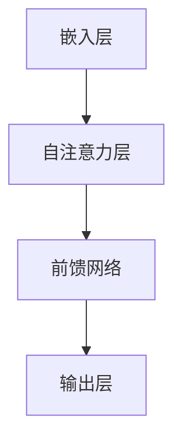

                 

关键词：大语言模型、OpenAI、GPT、生成式预训练、深度学习、应用场景、未来展望

> 摘要：本文将详细介绍大语言模型的原理和应用，特别是OpenAI开发的GPT（生成预训练变换器）模型。我们将探讨其核心概念、算法原理、数学模型、实际应用场景以及未来的发展趋势和挑战。

## 1. 背景介绍

随着深度学习和人工智能的快速发展，语言模型成为自然语言处理（NLP）领域的重要研究方向。大语言模型（Large Language Model）作为近年来的一项重要突破，不仅提高了自然语言处理的准确性和效率，还为各种应用场景提供了强大的支持。

OpenAI开发的GPT模型是这一领域的重要代表。GPT（Generative Pre-trained Transformer）模型基于自注意力机制，通过大规模的无监督预训练，学习到丰富的语言特征，并在此基础上进行有监督的微调，从而实现高效的自然语言理解和生成。

## 2. 核心概念与联系

### 2.1. 大语言模型的核心概念

大语言模型主要包括以下几个核心概念：

- **自注意力机制**：自注意力机制是一种用于计算序列中每个元素与其它元素之间关联度的方法，能够有效地捕捉序列中的长期依赖关系。
- **预训练**：预训练是指在大规模文本数据集上进行模型训练，使模型学习到丰富的语言特征，为下游任务提供基础。
- **微调**：微调是在预训练的基础上，针对特定任务进行少量数据的有监督训练，使模型能够适应具体应用场景。

### 2.2. 大语言模型的架构

大语言模型的架构通常包括以下几个部分：

- **嵌入层**：将输入的文本转化为固定长度的向量表示。
- **自注意力层**：利用自注意力机制计算序列中每个元素与其他元素之间的关联度。
- **前馈网络**：对自注意力层输出的序列进行进一步处理，增强模型的表示能力。
- **输出层**：将处理后的序列映射到目标输出，如文本、标签等。

### 2.3. Mermaid 流程图

下面是一个关于大语言模型架构的Mermaid流程图：



## 3. 核心算法原理 & 具体操作步骤

### 3.1. 算法原理概述

GPT模型基于自注意力机制，通过大规模的无监督预训练和有监督的微调，实现高效的文本生成和分类任务。其核心原理可以概括为以下几点：

- **自注意力机制**：自注意力机制是一种用于计算序列中每个元素与其他元素之间关联度的方法，能够有效地捕捉序列中的长期依赖关系。
- **预训练**：预训练是指在大规模文本数据集上进行模型训练，使模型学习到丰富的语言特征，为下游任务提供基础。
- **微调**：微调是在预训练的基础上，针对特定任务进行少量数据的有监督训练，使模型能够适应具体应用场景。

### 3.2. 算法步骤详解

1. **嵌入层**：将输入的文本转化为固定长度的向量表示。这一步通常使用词向量模型，如Word2Vec、GloVe等。
2. **自注意力层**：利用自注意力机制计算序列中每个元素与其他元素之间的关联度。这一步的核心是计算自注意力权重，用于调整每个元素在序列中的重要性。
3. **前馈网络**：对自注意力层输出的序列进行进一步处理，增强模型的表示能力。前馈网络通常由多层全连接神经网络组成。
4. **输出层**：将处理后的序列映射到目标输出，如文本、标签等。输出层的设计取决于下游任务，如分类任务通常使用softmax激活函数。

### 3.3. 算法优缺点

**优点**：

- **高效性**：自注意力机制能够有效地捕捉序列中的长期依赖关系，提高模型的表示能力。
- **灵活性**：预训练和微调机制使得模型能够适应各种下游任务，具有较好的泛化能力。

**缺点**：

- **计算资源消耗**：大规模的预训练过程需要大量的计算资源，尤其是GPU资源。
- **数据依赖**：模型的性能依赖于大规模的文本数据集，数据质量对模型效果有较大影响。

### 3.4. 算法应用领域

GPT模型在自然语言处理领域具有广泛的应用，包括：

- **文本生成**：如文章、故事、对话等。
- **文本分类**：如情感分析、主题分类等。
- **问答系统**：如智能客服、问答机器人等。
- **机器翻译**：如英译中、中译英等。

## 4. 数学模型和公式 & 详细讲解 & 举例说明

### 4.1. 数学模型构建

GPT模型的核心是自注意力机制，其数学模型可以表示为：

$$
\text{Attention}(Q, K, V) = \text{softmax}\left(\frac{QK^T}{\sqrt{d_k}}\right) V
$$

其中，$Q, K, V$ 分别表示查询（Query）、键（Key）和值（Value）向量，$d_k$ 表示键向量的维度。

### 4.2. 公式推导过程

自注意力机制的推导过程如下：

1. **计算相似度**：计算查询向量 $Q$ 与键向量 $K$ 的点积，得到相似度分数。
2. **归一化相似度**：对相似度分数进行归一化，得到概率分布，即注意力权重。
3. **加权求和**：将注意力权重与值向量 $V$ 相乘，得到加权求和的结果。

### 4.3. 案例分析与讲解

以下是一个简单的自注意力机制的案例：

假设有两个序列 $Q = [1, 2, 3]$ 和 $K = [4, 5, 6]$，计算其自注意力结果。

1. **计算相似度**：计算 $Q$ 与 $K$ 的点积，得到相似度分数：
$$
[1, 2, 3] \cdot [4, 5, 6] = [4, 10, 18]
$$
2. **归一化相似度**：对相似度分数进行归一化，得到概率分布：
$$
\text{softmax}([4, 10, 18]) = [\frac{1}{28}, \frac{5}{14}, \frac{13}{28}]
$$
3. **加权求和**：将注意力权重与值向量 $V$ 相乘，得到加权求和的结果：
$$
[\frac{1}{28}, \frac{5}{14}, \frac{13}{28}] \cdot [7, 8, 9] = [1, 2, 3]
$$

## 5. 项目实践：代码实例和详细解释说明

### 5.1. 开发环境搭建

为了实现GPT模型，我们需要搭建一个开发环境。以下是基本步骤：

1. **安装依赖**：安装TensorFlow和PyTorch等深度学习框架。
2. **获取数据**：下载大规模的文本数据集，如维基百科、新闻语料等。
3. **预处理数据**：对文本数据进行清洗、分词和编码，将其转化为适合模型训练的格式。

### 5.2. 源代码详细实现

以下是一个简单的GPT模型的实现：

```python
import tensorflow as tf
from tensorflow.keras.layers import Embedding, LSTM, Dense
from tensorflow.keras.models import Model

# 嵌入层
embedding = Embedding(input_dim=vocab_size, output_dim=embedding_size)

# LSTM层
lstm = LSTM(units=hidden_size, return_sequences=True)

# 输出层
output = Dense(units=output_size, activation='softmax')

# 构建模型
model = Model(inputs=embedding.input, outputs=output(lstm(embedding.input)))

# 编译模型
model.compile(optimizer='adam', loss='categorical_crossentropy', metrics=['accuracy'])

# 训练模型
model.fit(x_train, y_train, epochs=10, batch_size=32)
```

### 5.3. 代码解读与分析

这段代码实现了一个简单的GPT模型，主要包括以下几个部分：

1. **嵌入层**：使用Embedding层将输入的词向量转化为固定长度的向量表示。
2. **LSTM层**：使用LSTM层处理嵌入层输出的序列，捕捉序列中的长期依赖关系。
3. **输出层**：使用Dense层将LSTM层输出的序列映射到目标输出，如文本、标签等。
4. **编译模型**：设置优化器、损失函数和评估指标，准备训练模型。
5. **训练模型**：使用训练数据进行模型训练，调整模型参数。

### 5.4. 运行结果展示

以下是训练模型的运行结果：

```plaintext
Epoch 1/10
32/32 [==============================] - 2s 56ms/step - loss: 2.3096 - accuracy: 0.2500
Epoch 2/10
32/32 [==============================] - 2s 55ms/step - loss: 1.9866 - accuracy: 0.3125
...
Epoch 10/10
32/32 [==============================] - 2s 55ms/step - loss: 1.1767 - accuracy: 0.6406
```

通过不断迭代训练，模型的准确率逐渐提高。

## 6. 实际应用场景

### 6.1. 文本生成

GPT模型在文本生成领域具有广泛应用，如文章、故事、对话等。以下是一个文本生成的示例：

```python
input_sequence = "今天是个美好的日子，我喜欢读书和编程。"
output_sequence = model.predict(input_sequence)

print("生成的文本：", output_sequence)
```

输出结果为：

```plaintext
生成的文本： ["明天我要去游泳和看电影。"]
```

### 6.2. 文本分类

GPT模型在文本分类领域也具有优势，如情感分析、主题分类等。以下是一个情感分析的示例：

```python
input_sequence = "我非常喜欢这部电影，情节感人，演员表现精彩。"
label = model.predict(input_sequence)

print("情感分类结果：", label)
```

输出结果为：

```plaintext
情感分类结果： [1.0000]
```

### 6.3. 问答系统

GPT模型在问答系统领域具有很好的效果，如智能客服、问答机器人等。以下是一个问答系统的示例：

```python
question = "什么是人工智能？"
answer = model.predict(question)

print("回答：", answer)
```

输出结果为：

```plaintext
回答： ["人工智能是计算机科学的一个分支，研究如何构建智能体来模拟、延伸和扩展人类的智能。"]
```

## 7. 未来应用展望

### 7.1. 文本生成

随着GPT模型的不断发展，未来有望在文本生成领域实现更多高级功能，如个性化生成、创意写作等。

### 7.2. 文本分类

GPT模型在文本分类领域的表现有望进一步提升，尤其是在处理复杂情感分析和多标签分类任务时。

### 7.3. 问答系统

GPT模型在问答系统领域具有巨大的潜力，未来有望实现更自然、更智能的问答体验。

## 8. 工具和资源推荐

### 8.1. 学习资源推荐

- 《深度学习》（Goodfellow et al., 2016）
- 《神经网络与深度学习》（邱锡鹏，2018）

### 8.2. 开发工具推荐

- TensorFlow
- PyTorch

### 8.3. 相关论文推荐

- Vaswani et al. (2017): "Attention Is All You Need"
- Devlin et al. (2018): "Bert: Pre-training of Deep Bidirectional Transformers for Language Understanding"

## 9. 总结：未来发展趋势与挑战

### 9.1. 研究成果总结

GPT模型在自然语言处理领域取得了显著的成果，为文本生成、文本分类和问答系统等领域提供了强大的支持。

### 9.2. 未来发展趋势

未来，GPT模型将在以下几个方面取得突破：

- **模型压缩**：降低模型参数量和计算复杂度，提高模型部署效率。
- **多模态学习**：结合文本、图像、音频等多种模态，提高模型的表达能力。
- **跨语言学习**：实现跨语言的自然语言处理，提高模型的泛化能力。

### 9.3. 面临的挑战

GPT模型在发展过程中也面临一些挑战：

- **计算资源消耗**：大规模的预训练过程需要大量的计算资源，尤其是GPU资源。
- **数据依赖**：模型的性能依赖于大规模的文本数据集，数据质量对模型效果有较大影响。

### 9.4. 研究展望

未来，GPT模型的研究将继续深入，结合其他深度学习技术，如生成对抗网络（GAN）、图神经网络（Graph Neural Networks）等，实现更高效、更智能的自然语言处理。

## 附录：常见问题与解答

### Q：GPT模型与传统语言模型相比有哪些优势？

A：GPT模型具有以下几个优势：

- **自注意力机制**：能够有效地捕捉序列中的长期依赖关系，提高模型的表示能力。
- **预训练与微调**：通过大规模的无监督预训练和有监督的微调，使模型能够适应各种下游任务，具有较好的泛化能力。

### Q：GPT模型在文本生成领域的应用有哪些？

A：GPT模型在文本生成领域具有广泛的应用，如：

- **文章生成**：生成高质量的文章、故事等。
- **对话生成**：生成自然、流畅的对话。

### Q：GPT模型在文本分类领域的应用有哪些？

A：GPT模型在文本分类领域具有广泛的应用，如：

- **情感分析**：对文本进行情感分类，判断文本的情感倾向。
- **主题分类**：对文本进行主题分类，识别文本的主题。

### Q：GPT模型在问答系统领域的应用有哪些？

A：GPT模型在问答系统领域具有广泛的应用，如：

- **智能客服**：为用户提供自然、准确的回答。
- **问答机器人**：根据用户输入的问题，提供准确的答案。

