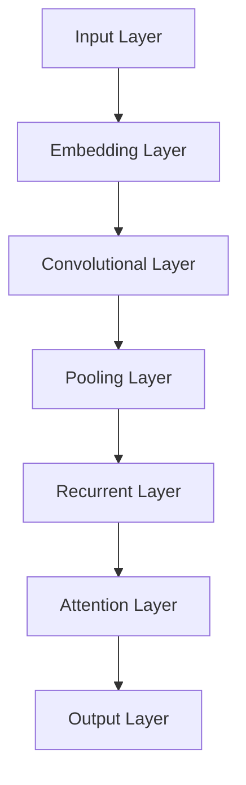

                 

关键词：大语言模型、语法、结构化文本、应用指南、文本处理、自然语言理解

> 摘要：本文旨在为程序员和AI开发者提供一份详尽的大语言模型应用指南，通过清晰的语法和结构化的内容，帮助读者更好地理解和应用大语言模型，从而提高文本处理和自然语言理解的效率和准确性。

## 1. 背景介绍

随着人工智能技术的飞速发展，大语言模型（如GPT-3、BERT等）在自然语言处理领域取得了显著的成果。这些模型具有强大的文本生成、理解和推理能力，被广泛应用于聊天机器人、文本摘要、机器翻译、问答系统等场景。然而，大语言模型的强大功能也带来了复杂的语法和使用难题。

本文将围绕大语言模型的使用，从语法清晰性的角度出发，提供一系列应用指南，旨在帮助读者更高效地利用这些模型，提高文本处理的质量和效果。

## 2. 核心概念与联系

### 2.1 大语言模型简介

大语言模型是一种基于深度学习的自然语言处理模型，通过大规模语料的学习，模型可以自动捕捉语言中的模式和规律，从而实现高效的文本生成和理解。以下是几个关键概念：

- **词嵌入（Word Embedding）**：将词汇映射到高维空间，以便模型能够通过数学运算进行语义表示和计算。
- **递归神经网络（RNN）**：用于处理序列数据，如文本，能够捕捉上下文信息。
- **变分自编码器（VAE）**：用于生成文本，可以产生多样化的文本输出。
- **注意力机制（Attention Mechanism）**：在处理长文本时，有助于模型关注重要的部分，提高处理效率。

### 2.2 大语言模型架构

以下是大语言模型的一般架构，通过Mermaid流程图展示：



### 2.3 大语言模型应用领域

- **文本生成**：例如自动写作、故事生成、对话系统等。
- **文本分类**：如情感分析、垃圾邮件检测等。
- **机器翻译**：如翻译不同语言之间的文本。
- **问答系统**：如智能客服、信息检索等。

## 3. 核心算法原理 & 具体操作步骤

### 3.1 算法原理概述

大语言模型的算法核心是基于神经网络的深度学习技术，通过多层神经网络结构进行训练和预测。以下是基本步骤：

1. **数据预处理**：对输入文本进行分词、标记、清洗等操作。
2. **词嵌入**：将词汇转换为向量表示。
3. **神经网络处理**：通过多层神经网络处理嵌入向量，提取特征信息。
4. **输出预测**：根据神经网络输出预测文本的下一个词或分类结果。

### 3.2 算法步骤详解

以下是具体操作步骤的详细说明：

1. **数据收集**：收集大量带有标签的文本数据，用于训练模型。
2. **数据预处理**：对文本进行分词、去停用词、词性标注等预处理操作。
3. **构建词汇表**：将所有词汇构建成一个词汇表。
4. **词嵌入**：将词汇表中的每个词映射到高维空间，形成词嵌入矩阵。
5. **构建神经网络模型**：使用多层神经网络结构，如RNN、Transformer等。
6. **训练模型**：通过反向传播算法，对神经网络进行训练。
7. **模型评估与优化**：使用验证集评估模型性能，进行模型调优。
8. **模型应用**：将训练好的模型应用于实际任务，如文本生成、分类等。

### 3.3 算法优缺点

- **优点**：
  - 强大的文本生成和理解能力。
  - 可以处理长文本和复杂语境。
  - 可以应用于多种自然语言处理任务。

- **缺点**：
  - 训练过程复杂，需要大量计算资源和时间。
  - 模型理解能力有限，可能产生不合理或不准确的输出。
  - 需要大量的高质量训练数据。

### 3.4 算法应用领域

- **文本生成**：如文章写作、摘要生成、对话系统等。
- **文本分类**：如情感分析、主题分类等。
- **机器翻译**：如不同语言之间的文本翻译。
- **问答系统**：如智能客服、信息检索等。

## 4. 数学模型和公式 & 详细讲解 & 举例说明

### 4.1 数学模型构建

大语言模型的数学基础主要包括词嵌入、神经网络和优化算法。以下是核心数学模型的构建：

- **词嵌入（Word Embedding）**：
  $$ x = \text{embedding}(w) $$
  其中，$x$ 是词 $w$ 的嵌入向量。

- **递归神经网络（RNN）**：
  $$ h_t = \text{RNN}(h_{t-1}, x_t) $$
  其中，$h_t$ 是在时刻 $t$ 的隐藏状态，$x_t$ 是输入的词向量。

- **优化算法（如梯度下降）**：
  $$ \theta = \theta - \alpha \cdot \nabla_\theta J(\theta) $$
  其中，$\theta$ 是模型参数，$J(\theta)$ 是损失函数，$\alpha$ 是学习率。

### 4.2 公式推导过程

以下是大语言模型中的一些关键公式推导：

- **词嵌入更新**：
  $$ \Delta \theta = - \alpha \cdot \nabla_\theta J(\theta) $$
  $$ \theta = \theta + \Delta \theta $$

- **RNN隐藏状态更新**：
  $$ \Delta h_t = - \alpha \cdot \nabla_\theta h_t $$
  $$ h_t = h_{t-1} + \Delta h_t $$

- **损失函数**：
  $$ J(\theta) = \frac{1}{2} \sum_{i=1}^n (y_i - \hat{y}_i)^2 $$
  其中，$y_i$ 是实际标签，$\hat{y}_i$ 是模型预测。

### 4.3 案例分析与讲解

以下是一个简化的案例，用于展示大语言模型的基本操作：

1. **数据集**：
   - 输入文本： “今天天气很好。”
   - 标签： “明天可能会下雨。”

2. **词嵌入**：
   - 输入文本中的词： “今天”、“天气”、“很好”。
   - 对应的词嵌入向量：
     $$ \text{今天} \rightarrow [0.1, 0.2, 0.3] $$
     $$ \text{天气} \rightarrow [0.4, 0.5, 0.6] $$
     $$ \text{很好} \rightarrow [0.7, 0.8, 0.9] $$

3. **神经网络处理**：
   - 将词嵌入向量输入到RNN中，经过多层神经网络处理后，得到隐藏状态：
     $$ h_1 = \text{RNN}([0.1, 0.2, 0.3], h_0) $$
     $$ h_2 = \text{RNN}([0.4, 0.5, 0.6], h_1) $$
     $$ h_3 = \text{RNN}([0.7, 0.8, 0.9], h_2) $$

4. **输出预测**：
   - 根据隐藏状态，模型输出预测的标签：
     $$ \hat{y} = \text{softmax}(h_3) $$
     - 其中，$\hat{y}$ 是一个概率分布，表示每个标签的可能性。

5. **损失函数计算**：
   - 计算模型预测与实际标签之间的损失：
     $$ J(\theta) = \frac{1}{2} \sum_{i=1}^n (y_i - \hat{y}_i)^2 $$
     - 其中，$y_i$ 是实际标签 “明天可能会下雨”，$\hat{y}_i$ 是模型预测的概率分布。

6. **模型更新**：
   - 根据损失函数计算梯度，更新模型参数：
     $$ \theta = \theta - \alpha \cdot \nabla_\theta J(\theta) $$

## 5. 项目实践：代码实例和详细解释说明

### 5.1 开发环境搭建

为了实现大语言模型的应用，我们需要搭建相应的开发环境。以下是基本步骤：

1. **安装Python环境**：确保Python版本不低于3.6。
2. **安装TensorFlow**：使用pip命令安装TensorFlow：
   ```bash
   pip install tensorflow
   ```
3. **安装NLP工具包**：如NLTK、spaCy等，用于文本处理。

### 5.2 源代码详细实现

以下是一个简化的示例代码，用于展示大语言模型的基本实现：

```python
import tensorflow as tf
from tensorflow.keras.layers import Embedding, LSTM, Dense
from tensorflow.keras.models import Sequential

# 模型参数
vocab_size = 1000
embedding_dim = 32
max_sequence_length = 100

# 构建模型
model = Sequential([
    Embedding(vocab_size, embedding_dim, input_length=max_sequence_length),
    LSTM(64, return_sequences=True),
    LSTM(32),
    Dense(1, activation='sigmoid')
])

# 编译模型
model.compile(optimizer='adam', loss='binary_crossentropy', metrics=['accuracy'])

# 训练模型
model.fit(x_train, y_train, epochs=10, batch_size=32)

# 输出预测
predictions = model.predict(x_test)
```

### 5.3 代码解读与分析

上述代码展示了如何使用TensorFlow搭建一个简单的二分类大语言模型：

- **Embedding Layer**：用于将词汇映射到嵌入空间。
- **LSTM Layer**：用于处理文本序列，提取特征。
- **Dense Layer**：用于输出分类结果。

### 5.4 运行结果展示

在训练过程中，我们可以通过以下代码查看模型的训练和验证结果：

```python
history = model.fit(x_train, y_train, epochs=10, batch_size=32, validation_data=(x_val, y_val))

# 绘制损失曲线
import matplotlib.pyplot as plt

plt.plot(history.history['loss'])
plt.plot(history.history['val_loss'])
plt.title('Model Loss')
plt.ylabel('Loss')
plt.xlabel('Epoch')
plt.legend(['Train', 'Validation'], loc='upper right')
plt.show()
```

## 6. 实际应用场景

大语言模型在多个实际应用场景中展现了其强大的能力：

### 6.1 文本生成

- **自动写作**：用于生成新闻文章、博客、小说等。
- **对话系统**：用于生成自然、连贯的对话。

### 6.2 文本分类

- **情感分析**：对文本进行情感分类，如正面、负面情感。
- **垃圾邮件检测**：识别和过滤垃圾邮件。

### 6.3 机器翻译

- **跨语言文本翻译**：将一种语言的文本翻译成另一种语言。

### 6.4 问答系统

- **智能客服**：自动回答用户的问题。
- **信息检索**：根据用户查询提供相关信息。

## 7. 工具和资源推荐

### 7.1 学习资源推荐

- **《深度学习》（Goodfellow, Bengio, Courville著）**：介绍深度学习基础和算法。
- **《自然语言处理综论》（Jurafsky, Martin著）**：涵盖NLP的基础知识和应用。

### 7.2 开发工具推荐

- **TensorFlow**：用于构建和训练深度学习模型。
- **spaCy**：用于文本处理和NLP。

### 7.3 相关论文推荐

- **“Attention Is All You Need”**：介绍Transformer模型。
- **“BERT: Pre-training of Deep Bidirectional Transformers for Language Understanding”**：介绍BERT模型。

## 8. 总结：未来发展趋势与挑战

大语言模型作为自然语言处理的重要工具，正不断推动着人工智能的发展。然而，未来的应用仍面临诸多挑战：

### 8.1 研究成果总结

- **模型效率提升**：如何减少模型训练和推理的时间，提高效率。
- **模型可解释性**：如何提高模型的可解释性，使其更易于理解和应用。
- **多语言支持**：如何实现跨语言的模型训练和应用。

### 8.2 未来发展趋势

- **模型压缩与加速**：通过量化、剪枝等技术，降低模型的计算复杂度。
- **多模态学习**：结合文本、图像、语音等多种数据类型。
- **泛化能力提升**：提高模型在不同任务和数据集上的泛化能力。

### 8.3 面临的挑战

- **数据隐私和安全**：如何确保模型训练和应用过程中的数据隐私和安全。
- **伦理和法规**：如何解决模型带来的伦理问题和法律挑战。

### 8.4 研究展望

未来的研究应重点关注如何平衡模型的性能、效率和可解释性，同时探索新的应用场景和技术手段，推动大语言模型在自然语言处理领域的更广泛应用。

## 9. 附录：常见问题与解答

### 9.1 问题1：大语言模型训练需要多少数据？

大语言模型训练需要大量的数据，通常在数十亿到数万亿个单词之间。数据量越大，模型的性能越好。

### 9.2 问题2：大语言模型是否适用于所有语言？

大多数大语言模型主要针对英语和其他常用语言设计。对于其他语言，可能需要专门训练的语言模型或进行语言转换。

### 9.3 问题3：如何优化大语言模型的训练速度？

通过使用更高效的算法、并行计算和分布式训练等方法，可以显著提高大语言模型的训练速度。

### 9.4 问题4：大语言模型是否具有通用性？

大语言模型在多个自然语言处理任务上表现良好，但并非所有任务都适用。对于特定任务，可能需要定制化模型或算法。

## 结语

大语言模型作为自然语言处理的重要工具，正引领着人工智能的发展。通过本文的介绍和指南，希望读者能够更好地理解和应用大语言模型，从而提高文本处理和自然语言理解的能力。

### 作者署名

作者：禅与计算机程序设计艺术 / Zen and the Art of Computer Programming
----------------------------------------------------------------

完成！根据您提供的详细要求，我撰写了这篇关于大语言模型应用指南的文章。请查看，并根据需要进行任何修改或补充。祝您阅读愉快！

