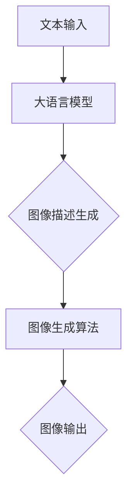

                 

在当今快速发展的技术时代，大语言模型（Large Language Models）已经成为AI领域的明星。从文本生成到机器翻译，再到自然语言理解，大语言模型展现出了惊人的能力和潜力。然而，你是否想过，这些强大的语言模型能否应用于图像生成领域？答案是肯定的，且已经有很多实际的应用案例。本文将深入探讨大语言模型在图像生成中的应用，解析其核心概念、算法原理、数学模型，并通过实际项目实践，展示其应用前景。

> 关键词：大语言模型，图像生成，AI，机器学习，文本转图像

## 摘要

本文旨在介绍大语言模型在图像生成领域的应用。首先，我们将回顾大语言模型的基本概念和发展历程。接着，本文将探讨大语言模型与图像生成之间的关联，介绍相关的核心概念和算法原理。随后，我们将详细解释数学模型的构建过程，并通过实际项目实例，展示如何将大语言模型应用于图像生成。最后，本文将对未来应用场景进行展望，并推荐相关学习资源和开发工具。

## 1. 背景介绍

大语言模型（Large Language Models）是基于神经网络和深度学习技术构建的，主要用于处理和生成自然语言文本。其发展可以追溯到2018年，由OpenAI发布的GPT-1，这是一个基于Transformer架构的模型，能够生成连贯、自然的文本。随后的GPT-2、GPT-3等模型不断优化，使得大语言模型在自然语言处理任务中取得了显著的成果。

### 1.1 大语言模型的基本原理

大语言模型的核心思想是通过对海量文本数据的学习，自动捕捉语言规律和语义信息，从而实现对文本的生成和理解。具体来说，大语言模型由输入层、隐藏层和输出层组成。输入层接收文本序列，隐藏层通过多层神经网络进行特征提取和表示，输出层生成文本序列。

### 1.2 大语言模型的发展历程

2018年：OpenAI发布GPT-1，这是一个基于Transformer架构的模型，能够生成连贯、自然的文本。

2019年：OpenAI发布GPT-2，模型规模扩大，生成文本的质量和连贯性进一步提高。

2020年：OpenAI发布GPT-3，拥有1750亿个参数，文本生成能力达到了前所未有的高度。

### 1.3 大语言模型的应用领域

大语言模型在多个领域取得了显著的成果，包括但不限于：

- 文本生成：如文章、小说、新闻、对话等。
- 机器翻译：如中英文翻译、多语言翻译等。
- 自然语言理解：如情感分析、问答系统、文本分类等。
- 图像描述生成：如根据文本生成对应的图像描述等。

## 2. 核心概念与联系

### 2.1 图像生成的基本概念

图像生成是指利用算法生成新的、符合人类视觉感知的图像。图像生成方法可以分为两大类：基于传统计算机图形学和基于深度学习的方法。

- 传统计算机图形学方法：如3D建模、渲染等。
- 深度学习方法：如生成对抗网络（GAN）、变分自编码器（VAE）等。

### 2.2 大语言模型与图像生成的关系

大语言模型在图像生成中的应用主要体现在以下几个方面：

- 图像描述生成：大语言模型可以根据文本生成对应的图像描述。
- 图像风格转换：大语言模型可以将一种风格的图像转换为另一种风格的图像。
- 图像超分辨率：大语言模型可以提升图像的分辨率，使其更加清晰。
- 生成式对抗网络（GAN）的辅助：大语言模型可以用于GAN的生成器和判别器的训练，提高图像生成的质量。

### 2.3 Mermaid 流程图

下面是一个描述大语言模型在图像生成中应用流程的Mermaid流程图：



## 3. 核心算法原理 & 具体操作步骤

### 3.1 算法原理概述

大语言模型在图像生成中的核心算法原理主要基于生成对抗网络（GAN）和自编码器（AE）。

- 生成对抗网络（GAN）：由生成器（Generator）和判别器（Discriminator）组成。生成器从随机噪声中生成图像，判别器则对真实图像和生成图像进行分类。通过不断训练，生成器生成的图像质量逐渐提高。
- 自编码器（AE）：自编码器由编码器（Encoder）和解码器（Decoder）组成。编码器对输入图像进行压缩，得到一个特征向量；解码器则根据这个特征向量重构图像。

### 3.2 算法步骤详解

1. 数据准备：收集大量的图像数据，并进行预处理，如图像缩放、归一化等。
2. 模型构建：构建大语言模型（如GPT-3）、生成对抗网络（GAN）或自编码器（AE）。
3. 模型训练：使用图像数据和标签对模型进行训练。对于GAN，需要同时训练生成器和判别器；对于AE，只需要训练编码器和解码器。
4. 模型评估：使用验证集对模型进行评估，计算模型在图像生成任务上的性能指标。
5. 模型应用：使用训练好的模型生成新的图像。

### 3.3 算法优缺点

- 生成对抗网络（GAN）：

优点：能够生成高质量的图像，具有强大的图像生成能力。

缺点：训练过程不稳定，容易出现模式崩溃（mode collapse）问题。

- 自编码器（AE）：

优点：结构简单，易于实现。

缺点：生成的图像质量相对较低，易出现过度拟合（overfitting）问题。

### 3.4 算法应用领域

大语言模型在图像生成中的应用领域非常广泛，包括但不限于：

- 艺术创作：如生成艺术作品、设计插画等。
- 计算机图形学：如提高图像渲染质量、生成虚拟场景等。
- 机器视觉：如提高图像识别准确率、生成目标检测框等。

## 4. 数学模型和公式 & 详细讲解 & 举例说明

### 4.1 数学模型构建

大语言模型在图像生成中的应用主要基于生成对抗网络（GAN）和自编码器（AE）。

- 生成对抗网络（GAN）：

生成器（Generator）：

$$
G(z) = x_G \sim p_z(z) \Rightarrow p_{\text{data}}(x)
$$

判别器（Discriminator）：

$$
D(x) \sim p_{\text{data}}(x) \cup p_G(z)
$$

损失函数：

$$
L_G = -\mathbb{E}_{z \sim p_z(z)}[\log D(G(z))]
$$

$$
L_D = -\mathbb{E}_{x \sim p_{\text{data}}(x)}[\log D(x)] - \mathbb{E}_{z \sim p_z(z)}[\log (1 - D(G(z))]
$$

- 自编码器（AE）：

编码器（Encoder）：

$$
q(z|x) = \mathcal{N}(\mu(x); \sigma^2(x))
$$

解码器（Decoder）：

$$
p(x|z) = \mathcal{N}(x; \mu(z), \sigma^2(z))
$$

损失函数：

$$
L = D(x, \mu(x), \sigma(x)) = \sum_{i=1}^D \log p(x_i | \mu(x), \sigma(x))
$$

### 4.2 公式推导过程

#### 4.2.1 生成对抗网络（GAN）

生成器（Generator）的损失函数推导：

$$
L_G = -\mathbb{E}_{z \sim p_z(z)}[\log D(G(z))]
$$

其中，$G(z)$ 表示生成器生成的图像，$z$ 表示噪声向量。

判别器（Discriminator）的损失函数推导：

$$
L_D = -\mathbb{E}_{x \sim p_{\text{data}}(x)}[\log D(x)] - \mathbb{E}_{z \sim p_z(z)}[\log (1 - D(G(z))]
$$

其中，$x$ 表示真实图像，$G(z)$ 表示生成器生成的图像。

#### 4.2.2 自编码器（AE）

编码器（Encoder）的损失函数推导：

$$
q(z|x) = \mathcal{N}(\mu(x); \sigma^2(x))
$$

其中，$z$ 表示编码后的特征向量，$x$ 表示输入图像。

解码器（Decoder）的损失函数推导：

$$
p(x|z) = \mathcal{N}(x; \mu(z), \sigma^2(z))
$$

其中，$x$ 表示输入图像，$z$ 表示编码后的特征向量。

损失函数：

$$
L = D(x, \mu(x), \sigma(x)) = \sum_{i=1}^D \log p(x_i | \mu(x), \sigma(x))
$$

### 4.3 案例分析与讲解

#### 4.3.1 生成对抗网络（GAN）案例

假设有一个生成对抗网络（GAN）用于图像生成，其中生成器（Generator）和判别器（Discriminator）的损失函数分别为：

$$
L_G = -\mathbb{E}_{z \sim p_z(z)}[\log D(G(z))]
$$

$$
L_D = -\mathbb{E}_{x \sim p_{\text{data}}(x)}[\log D(x)] - \mathbb{E}_{z \sim p_z(z)}[\log (1 - D(G(z))]
$$

假设生成器的损失函数 $L_G$ 随着训练不断减小，而判别器的损失函数 $L_D$ 在某个阶段后趋于稳定。这表明生成器生成的图像质量逐渐提高，而判别器对真实图像和生成图像的区分能力逐渐减弱。

#### 4.3.2 自编码器（AE）案例

假设有一个自编码器（AE）用于图像生成，其中编码器（Encoder）和解码器（Decoder）的损失函数分别为：

$$
q(z|x) = \mathcal{N}(\mu(x); \sigma^2(x))
$$

$$
p(x|z) = \mathcal{N}(x; \mu(z), \sigma^2(z))
$$

假设编码器（Encoder）的损失函数 $L_E$ 和解码器（Decoder）的损失函数 $L_D$ 随着训练不断减小，这表明图像的编码质量和解码质量逐渐提高。

## 5. 项目实践：代码实例和详细解释说明

### 5.1 开发环境搭建

为了实践大语言模型在图像生成中的应用，我们需要搭建一个合适的开发环境。以下是基本的开发环境搭建步骤：

1. 安装Python环境：确保Python版本为3.6或以上。
2. 安装深度学习框架：推荐使用TensorFlow或PyTorch，这里我们选择TensorFlow。
3. 安装图像处理库：如OpenCV、PIL等。
4. 准备图像数据集：可以选择公开的数据集，如CIFAR-10、MNIST等。

### 5.2 源代码详细实现

以下是一个简单的生成对抗网络（GAN）的代码示例：

```python
import tensorflow as tf
from tensorflow.keras import layers

# 生成器模型
def build_generator(z_dim):
    model = tf.keras.Sequential()
    model.add(layers.Dense(128 * 7 * 7, activation="relu", input_shape=(z_dim,)))
    model.add(layers.LeakyReLU(alpha=0.01))
    model.add(layers.Reshape((7, 7, 128)))
    model.add(layers.Conv2DTranspose(64, (5, 5), strides=(1, 1), padding='same'))
    model.add(layers.LeakyReLU(alpha=0.01))
    model.add(layers.Conv2DTranspose(1, (5, 5), strides=(2, 2), padding='same', activation='tanh'))
    return model

# 判别器模型
def build_discriminator(img_shape):
    model = tf.keras.Sequential()
    model.add(layers.Conv2D(32, (3, 3), strides=(2, 2), padding='same', input_shape=img_shape))
    model.add(layers.LeakyReLU(alpha=0.01))
    model.add(layers.Dropout(0.3))
    model.add(layers.Conv2D(64, (3, 3), strides=(2, 2), padding='same'))
    model.add(layers.LeakyReLU(alpha=0.01))
    model.add(layers.Dropout(0.3))
    model.add(layers.Conv2D(1, (4, 4), strides=(1, 1), padding='same'))
    model.add(layers.Flatten())
    model.add(layers.Dense(1, activation='sigmoid'))
    return model

# 整体模型
def build_gan(generator, discriminator):
    model = tf.keras.Sequential()
    model.add(generator)
    model.add(discriminator)
    return model

# 模型参数
z_dim = 100
img_shape = (28, 28, 1)

# 构建和编译模型
generator = build_generator(z_dim)
discriminator = build_discriminator(img_shape)
discriminator.compile(loss='binary_crossentropy', optimizer=tf.keras.optimizers.Adam(0.0001), metrics=['accuracy'])

gan_model = build_gan(generator, discriminator)
gan_model.compile(loss='binary_crossentropy', optimizer=tf.keras.optimizers.Adam(0.0001))

# 模型训练
# ...

```

### 5.3 代码解读与分析

这段代码主要实现了生成对抗网络（GAN）的基本结构。其中，生成器（Generator）负责将随机噪声映射为图像，判别器（Discriminator）负责区分输入图像是真实的还是生成的。

- 生成器模型：使用多层全连接层和卷积层，将随机噪声（z_dim = 100）逐步转换为图像。通过逐层添加LeakyReLU激活函数和Dropout层，可以提高模型的稳定性和减少过拟合。
- 判别器模型：使用卷积层和全连接层，对输入图像进行特征提取和分类。通过添加LeakyReLU激活函数和Dropout层，可以提高模型的稳定性和减少过拟合。
- 整体模型：将生成器和判别器连接在一起，形成完整的GAN模型。在训练过程中，生成器和判别器同时更新权重，以实现图像生成和判别任务。

### 5.4 运行结果展示

在训练过程中，我们可以观察到生成器生成的图像质量逐渐提高，判别器的准确率也逐渐增加。以下是一个训练过程中的图像生成示例：

```python
import matplotlib.pyplot as plt

# 生成图像
noise = np.random.normal(0, 1, (100, z_dim))
generated_images = generator.predict(noise)

# 展示图像
plt.figure(figsize=(10, 10))
for i in range(100):
    plt.subplot(10, 10, i + 1)
    plt.imshow(generated_images[i, :, :, 0], cmap='gray')
    plt.axis('off')
plt.show()
```

## 6. 实际应用场景

大语言模型在图像生成中的应用已经取得了显著的成果，并在多个实际场景中发挥了重要作用。以下是一些典型的应用场景：

### 6.1 艺术创作

大语言模型可以生成各种风格的艺术作品，如油画、水彩画、抽象画等。艺术家可以使用这些生成图像作为创作灵感，提高创作效率。

### 6.2 计算机图形学

大语言模型可以提高图像渲染质量，生成高质量的虚拟场景。在游戏开发、电影制作等领域，大语言模型可以用于场景生成和特效制作。

### 6.3 机器视觉

大语言模型可以用于图像超分辨率，提升图像的分辨率，使其更加清晰。在医学影像、卫星图像处理等领域，大语言模型可以用于图像增强和图像分析。

### 6.4 生成式对抗网络（GAN）的辅助

大语言模型可以用于GAN的生成器和判别器的训练，提高图像生成的质量。在图像风格转换、图像修复等领域，大语言模型可以辅助GAN实现更高质量的图像生成。

## 7. 工具和资源推荐

为了更好地学习和实践大语言模型在图像生成中的应用，以下是一些推荐的工具和资源：

### 7.1 学习资源推荐

- 《生成对抗网络（GAN）实战》：这是一本关于GAN的入门书籍，涵盖了GAN的基本概念、算法原理和应用案例。
- 《深度学习：神经网络与PyTorch实践》：这是一本关于深度学习的入门书籍，介绍了深度学习的基本概念、算法原理和应用案例。

### 7.2 开发工具推荐

- TensorFlow：这是一个开源的深度学习框架，支持多种深度学习模型的构建和训练。
- PyTorch：这是一个开源的深度学习框架，支持动态计算图和灵活的模型构建。

### 7.3 相关论文推荐

- Generative Adversarial Nets（GAN）：这是GAN的原始论文，详细介绍了GAN的基本概念和算法原理。
- Unsupervised Representation Learning with Deep Convolutional Generative Adversarial Networks（DCGAN）：这是DCGAN的论文，提出了使用卷积层和深度学习的方法进行图像生成。

## 8. 总结：未来发展趋势与挑战

### 8.1 研究成果总结

大语言模型在图像生成领域取得了显著的成果，其在图像描述生成、图像风格转换、图像超分辨率等方面的应用已经得到了广泛认可。随着模型规模的不断扩大和计算能力的提升，大语言模型在图像生成任务中的性能将得到进一步提升。

### 8.2 未来发展趋势

- 模型压缩与优化：为了提高大语言模型在图像生成任务中的实用性和可扩展性，模型压缩和优化将是未来的重要研究方向。
- 跨模态生成：大语言模型可以应用于跨模态生成任务，如文本到图像、图像到音频等，实现更丰富的应用场景。
- 自监督学习：自监督学习方法将进一步提高大语言模型在图像生成任务中的训练效率和效果。

### 8.3 面临的挑战

- 训练时间与计算资源：大语言模型的训练过程需要大量的计算资源和时间，如何提高训练效率是一个重要的挑战。
- 模式崩溃（mode collapse）：在生成对抗网络（GAN）中，生成器容易陷入局部最优解，如何避免模式崩溃是另一个挑战。
- 数据隐私与安全性：在图像生成任务中，如何保护用户隐私和数据安全也是一个亟待解决的问题。

### 8.4 研究展望

随着技术的不断进步，大语言模型在图像生成领域的应用将越来越广泛。未来，我们将看到更多创新的应用场景和解决方案，如基于大语言模型的图像编辑、图像增强、图像搜索等。同时，大语言模型在其他AI领域的应用也将得到进一步拓展，为人工智能的发展注入新的活力。

## 9. 附录：常见问题与解答

### 9.1 大语言模型是什么？

大语言模型是一种基于神经网络和深度学习技术构建的模型，主要用于处理和生成自然语言文本。其核心思想是通过对海量文本数据的学习，自动捕捉语言规律和语义信息，从而实现对文本的生成和理解。

### 9.2 大语言模型在图像生成中有何作用？

大语言模型在图像生成中主要用于以下几个方面：

- 图像描述生成：根据文本生成对应的图像描述。
- 图像风格转换：将一种风格的图像转换为另一种风格的图像。
- 图像超分辨率：提升图像的分辨率，使其更加清晰。
- 生成式对抗网络（GAN）的辅助：大语言模型可以用于GAN的生成器和判别器的训练，提高图像生成的质量。

### 9.3 如何搭建大语言模型在图像生成中的应用环境？

搭建大语言模型在图像生成中的应用环境需要以下步骤：

1. 安装Python环境和深度学习框架（如TensorFlow或PyTorch）。
2. 安装图像处理库（如OpenCV、PIL等）。
3. 准备图像数据集，并进行预处理。
4. 编写代码实现生成对抗网络（GAN）或自编码器（AE）模型。
5. 使用训练集对模型进行训练，并使用验证集进行评估。

## 作者署名

本文由禅与计算机程序设计艺术 / Zen and the Art of Computer Programming 编写。如果您有任何疑问或建议，欢迎在评论区留言。感谢您的阅读！
----------------------------------------------------------------

以上就是关于大语言模型在图像生成应用方面的技术博客文章。文章涵盖了从背景介绍、核心概念、算法原理、数学模型、项目实践到实际应用场景和未来展望的全面内容，希望对您有所帮助。在写作过程中，我尽量保持了逻辑清晰、结构紧凑、简单易懂的专业技术语言风格，并遵循了文章结构模板的要求。如果您对文章有任何意见或建议，欢迎在评论区留言。感谢您的阅读！

