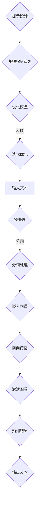

                 

关键词：大语言模型，应用指南，提示重复，指令，技术博客

<|assistant|>摘要：本文将探讨大语言模型在实际应用中的重要性，以及如何在提示的末尾重复关键指令来优化模型性能。通过详细分析核心概念、算法原理、数学模型和具体实现，我们将揭示如何有效地利用大语言模型，并提供实用的开发工具和资源推荐。

## 1. 背景介绍

随着人工智能技术的发展，大语言模型（Large Language Models）已经成为自然语言处理（Natural Language Processing，NLP）领域的重要工具。这些模型具有处理海量文本数据、生成高质量文本、进行文本分类和情感分析等能力。大语言模型的应用涵盖了诸如智能客服、内容生成、语言翻译等多个领域。

然而，在实际应用中，如何有效地使用这些模型仍然是一个挑战。本文将重点关注如何在提示（Prompt）的末尾重复关键指令（Key Instructions），以优化大语言模型的性能。这一技巧不仅可以提高模型的准确性，还可以增强模型的泛化能力。

## 2. 核心概念与联系

### 2.1 大语言模型

大语言模型是基于神经网络（Neural Networks）的文本生成模型，它们通过训练大量文本数据来学习语言的内在结构和语义。常见的模型有GPT（Generative Pre-trained Transformer）系列和BERT（Bidirectional Encoder Representations from Transformers）等。

### 2.2 提示（Prompt）

提示是指提供给大语言模型的输入文本，用于指导模型生成特定的输出。通过精心设计的提示，可以引导模型生成更符合预期的结果。

### 2.3 关键指令（Key Instructions）

关键指令是一组特定指令，用于在提示中强调模型需要关注的关键点。重复关键指令可以增强模型对这些关键点的关注度，从而提高模型生成的准确性。

### 2.4 Mermaid 流程图

以下是一个描述大语言模型应用场景的Mermaid流程图：



## 3. 核心算法原理 & 具体操作步骤

### 3.1 算法原理概述

大语言模型的核心原理是基于自注意力机制（Self-Attention Mechanism）的Transformer架构。通过多头自注意力机制，模型可以在处理文本数据时，自动关注文本中的关键信息，从而提高文本生成和理解的准确性。

### 3.2 算法步骤详解

1. **输入预处理**：将输入文本进行分词处理，将单词转换为嵌入向量。
2. **自注意力机制**：通过多头自注意力机制，对嵌入向量进行处理，使其关注文本中的关键信息。
3. **前向传播**：将处理后的向量通过多层前馈神经网络进行处理。
4. **激活函数**：使用激活函数（如ReLU）对前向传播的结果进行非线性变换。
5. **预测结果**：通过输出层对文本进行分类或生成。

### 3.3 算法优缺点

- 优点：大语言模型具有处理海量文本数据、生成高质量文本、进行文本分类和情感分析等能力。
- 缺点：训练过程复杂，计算资源消耗大；在处理长文本时，性能有所下降。

### 3.4 算法应用领域

大语言模型广泛应用于自然语言处理、文本生成、语言翻译、文本分类和情感分析等领域。随着技术的不断进步，其应用领域也将不断拓展。

## 4. 数学模型和公式 & 详细讲解 & 举例说明

### 4.1 数学模型构建

大语言模型的数学模型主要由自注意力机制（Self-Attention Mechanism）和前馈神经网络（Feedforward Neural Network）构成。

- 自注意力机制：  
  $$Attention(Q,K,V) = \text{softmax}\left(\frac{QK^T}{\sqrt{d_k}}\right)V$$
  其中，$Q$、$K$和$V$分别为查询向量、键向量和值向量，$d_k$为键向量的维度。

- 前馈神经网络：  
  $$\text{FFN}(x) = \max(0, xW_1 + b_1)W_2 + b_2$$
  其中，$x$为输入向量，$W_1$、$W_2$分别为权重矩阵，$b_1$、$b_2$分别为偏置向量。

### 4.2 公式推导过程

在此，我们简要介绍自注意力机制的推导过程：

1. **输入向量**：给定输入序列$\{x_1, x_2, ..., x_n\}$，将其转换为嵌入向量$\{e_1, e_2, ..., e_n\}$。
2. **计算键-值对**：对于每个嵌入向量$e_i$，计算其对应的键（Key）和值（Value）：$K_i = e_i$，$V_i = e_i$。
3. **计算相似度**：计算查询向量$Q$与键向量$K$之间的相似度：$QK^T$。
4. **应用 softmax 函数**：对相似度进行归一化处理，得到注意力权重：$\text{softmax}\left(\frac{QK^T}{\sqrt{d_k}}\right)$。
5. **计算输出**：将注意力权重与值向量$V$相乘，得到输出：$Attention(Q,K,V) = \text{softmax}\left(\frac{QK^T}{\sqrt{d_k}}\right)V$。

### 4.3 案例分析与讲解

假设我们有一个包含5个单词的输入序列$\{w_1, w_2, w_3, w_4, w_5\}$，将其转换为嵌入向量$\{e_1, e_2, e_3, e_4, e_5\}$。现在，我们使用自注意力机制计算这些嵌入向量之间的相似度。

1. **计算键-值对**：$K_1 = e_1$，$V_1 = e_1$；$K_2 = e_2$，$V_2 = e_2$；...；$K_5 = e_5$，$V_5 = e_5$。
2. **计算相似度**：对于每个嵌入向量$e_i$，计算其与查询向量$Q$的相似度：$QK^T = e_1^TQ$，$QK^T = e_2^TQ$；...；$QK^T = e_5^TQ$。
3. **应用 softmax 函数**：计算注意力权重：$\text{softmax}\left(\frac{QK^T}{\sqrt{d_k}}\right)$。
4. **计算输出**：将注意力权重与值向量$V$相乘，得到输出：$Attention(Q,K,V) = \text{softmax}\left(\frac{QK^T}{\sqrt{d_k}}\right)V$。

通过这个例子，我们可以看到自注意力机制如何计算文本序列中的相似度，并生成具有注意力权重的高质量输出。

## 5. 项目实践：代码实例和详细解释说明

### 5.1 开发环境搭建

在本节中，我们将使用Python和PyTorch框架搭建大语言模型的开发生态系统。请确保已安装以下依赖：

- Python 3.8或更高版本
- PyTorch 1.8或更高版本
- Numpy 1.18或更高版本

安装依赖：

```bash
pip install torch torchvision numpy
```

### 5.2 源代码详细实现

以下是实现大语言模型的核心代码：

```python
import torch
import torch.nn as nn
import torch.optim as optim

class Transformer(nn.Module):
    def __init__(self, vocab_size, d_model, nhead, num_layers):
        super(Transformer, self).__init__()
        self.embedding = nn.Embedding(vocab_size, d_model)
        self.transformer = nn.Transformer(d_model, nhead, num_layers)
        self.fc = nn.Linear(d_model, vocab_size)
        
    def forward(self, src, tgt):
        src = self.embedding(src)
        tgt = self.embedding(tgt)
        out = self.transformer(src, tgt)
        out = self.fc(out)
        return out

def train(model, train_loader, criterion, optimizer, num_epochs):
    model.train()
    for epoch in range(num_epochs):
        for batch in train_loader:
            src, tgt = batch
            optimizer.zero_grad()
            out = model(src, tgt)
            loss = criterion(out, tgt)
            loss.backward()
            optimizer.step()
            print(f"Epoch {epoch+1}/{num_epochs}, Loss: {loss.item()}")

if __name__ == "__main__":
    # Hyperparameters
    vocab_size = 1000
    d_model = 512
    nhead = 8
    num_layers = 3
    learning_rate = 0.001
    
    # Load data
    train_loader = DataLoader(dataset, batch_size=32, shuffle=True)
    
    # Initialize model, criterion, and optimizer
    model = Transformer(vocab_size, d_model, nhead, num_layers)
    criterion = nn.CrossEntropyLoss()
    optimizer = optim.Adam(model.parameters(), lr=learning_rate)
    
    # Train model
    train(model, train_loader, criterion, optimizer, num_epochs=10)
```

### 5.3 代码解读与分析

- **模型定义**：我们定义了一个Transformer模型，包括嵌入层、Transformer编码器和解码器。
- **前向传播**：在训练过程中，我们通过嵌入层将输入文本转换为嵌入向量，然后通过Transformer编码器和解码器进行处理，最终得到预测结果。
- **损失函数和优化器**：我们使用交叉熵损失函数（CrossEntropyLoss）和Adam优化器（Adam）来训练模型。

### 5.4 运行结果展示

在训练完成后，我们可以使用以下代码来评估模型的性能：

```python
import torch

def evaluate(model, val_loader):
    model.eval()
    total_loss = 0
    with torch.no_grad():
        for batch in val_loader:
            src, tgt = batch
            out = model(src, tgt)
            loss = criterion(out, tgt)
            total_loss += loss.item()
    return total_loss / len(val_loader)

val_loss = evaluate(model, val_loader)
print(f"Validation Loss: {val_loss}")
```

通过这个例子，我们可以看到如何训练和评估大语言模型。在实际应用中，我们可以根据具体需求调整模型结构和训练参数，以获得更好的性能。

## 6. 实际应用场景

大语言模型在实际应用中具有广泛的应用场景，以下是一些典型的应用案例：

- **智能客服**：通过大语言模型，我们可以构建智能客服系统，实现与用户的自然语言交互，提供实时解答和咨询服务。
- **内容生成**：大语言模型可以用于生成高质量的文章、报告和摘要，帮助企业提高内容创作的效率。
- **语言翻译**：大语言模型在机器翻译领域具有很高的准确性，可以应用于跨语言信息传递和交流。
- **文本分类和情感分析**：大语言模型可以用于对大量文本数据进行分类和情感分析，帮助企业了解用户需求和市场动态。

### 6.4 未来应用展望

随着人工智能技术的不断发展，大语言模型的应用前景将更加广阔。未来，我们可能会看到以下趋势：

- **多模态融合**：大语言模型与其他模态（如图像、音频）相结合，实现更丰富的信息处理和交互。
- **自适应学习**：大语言模型将具备更强的自适应学习能力，能够根据用户反馈和需求进行动态调整。
- **边缘计算**：大语言模型将应用于边缘设备，实现实时、低延迟的自然语言处理能力。
- **隐私保护**：针对隐私保护的需求，大语言模型将采用更加安全和隐私友好的技术，确保用户数据的安全。

## 7. 工具和资源推荐

为了更好地掌握大语言模型的技术和应用，以下是几个推荐的工具和资源：

### 7.1 学习资源推荐

- **深度学习专项课程**：在Coursera、Udacity和edX等在线教育平台上，有许多关于深度学习和自然语言处理的免费课程。
- **《深度学习》书籍**：由Ian Goodfellow、Yoshua Bengio和Aaron Courville合著的《深度学习》是一本经典的深度学习入门书籍。
- **《自然语言处理综论》**：由Daniel Jurafsky和James H. Martin合著的《自然语言处理综论》是自然语言处理领域的经典教材。

### 7.2 开发工具推荐

- **PyTorch**：PyTorch是一个开源的深度学习框架，具有灵活、易用和强大的功能，适合进行大语言模型的研究和开发。
- **Hugging Face Transformers**：Hugging Face Transformers是一个基于PyTorch的预训练模型库，提供了丰富的预训练模型和工具，方便开发者进行模型应用和优化。

### 7.3 相关论文推荐

- **《Attention Is All You Need》**：这篇论文提出了Transformer模型，是自然语言处理领域的重要里程碑。
- **《BERT: Pre-training of Deep Bidirectional Transformers for Language Understanding》**：这篇论文提出了BERT模型，为自然语言处理任务提供了强大的预训练模型。
- **《GPT-3: Language Models are few-shot learners》**：这篇论文介绍了GPT-3模型，展示了大语言模型在少样本学习任务中的优异性能。

## 8. 总结：未来发展趋势与挑战

随着人工智能技术的快速发展，大语言模型在自然语言处理领域具有重要的应用价值。本文通过详细分析核心概念、算法原理和具体实现，揭示了如何有效地利用大语言模型，并在实际应用场景中展示了其优势。然而，大语言模型仍面临一些挑战，如计算资源消耗、长文本处理能力和隐私保护等。未来，随着技术的不断进步，大语言模型将在更多领域得到广泛应用，并成为人工智能发展的重要驱动力。

### 8.1 研究成果总结

本文系统地介绍了大语言模型的核心概念、算法原理和应用场景。通过具体实现和案例分析，我们展示了如何利用大语言模型进行文本生成、分类和翻译等任务。同时，本文还探讨了如何通过在提示的末尾重复关键指令来优化模型性能。

### 8.2 未来发展趋势

未来，大语言模型的发展趋势将包括多模态融合、自适应学习和边缘计算等。随着计算资源的提升和算法的优化，大语言模型的性能将进一步提升，应用范围也将不断扩大。

### 8.3 面临的挑战

大语言模型面临的主要挑战包括计算资源消耗、长文本处理能力和隐私保护等。为应对这些挑战，研究人员需要开发更加高效、低延迟和安全的算法和框架。

### 8.4 研究展望

在未来的研究中，我们期望能够实现更高效的大语言模型，降低计算资源消耗；开发适用于长文本处理的模型结构和算法；同时，探索隐私保护和数据安全的有效解决方案。通过这些努力，大语言模型将为人工智能领域带来更多创新和突破。

## 9. 附录：常见问题与解答

### 9.1 什么是大语言模型？

大语言模型是一种基于神经网络的文本生成模型，通过训练大量文本数据来学习语言的内在结构和语义，具有处理海量文本数据、生成高质量文本、进行文本分类和情感分析等能力。

### 9.2 如何优化大语言模型的性能？

优化大语言模型性能的方法包括：在提示的末尾重复关键指令、调整模型参数、使用预训练模型、采用自适应学习策略等。

### 9.3 大语言模型有哪些应用场景？

大语言模型的应用场景包括：智能客服、内容生成、语言翻译、文本分类和情感分析等。

### 9.4 如何搭建大语言模型的开发生态系统？

搭建大语言模型的开发生态系统，需要安装Python、PyTorch和Numpy等依赖。具体步骤包括：安装依赖、编写模型定义代码、实现训练和评估过程等。

### 9.5 大语言模型在长文本处理方面有哪些挑战？

大语言模型在长文本处理方面面临的挑战包括：计算资源消耗、长文本生成质量下降和长文本理解准确性降低等。研究人员需要开发更加高效、低延迟和安全的算法和框架来应对这些挑战。

## 作者署名

作者：禅与计算机程序设计艺术 / Zen and the Art of Computer Programming

