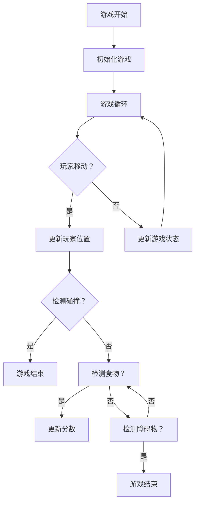

                 

关键词：游戏设计，算法实现，人工智能，图形处理，网络编程

> 摘要：本文将深入探讨大鱼吃小鱼游戏的设计与实现，从核心概念、算法原理到实际应用，全面解析这款经典游戏的背后技术。本文旨在为游戏开发者提供有价值的参考，同时为广大游戏爱好者展现游戏的魅力所在。

## 1. 背景介绍

大鱼吃小鱼（Also known as "Eat the Waves"）是一款简单却极具挑战性的游戏，玩家需要控制一条小鱼在海洋中躲避障碍物并吃掉较小的鱼，以使自己变得更加强大。游戏的目的是尽可能多地吃掉小鱼，同时避免与较大的鱼发生碰撞。

这个游戏最初由俄罗斯程序员Alexey Pajitnov于1985年设计，并在全球范围内迅速风靡。此后，许多开发者基于这个概念进行了改进和创新，推出了众多版本和变种。

本文将重点探讨大鱼吃小鱼游戏的现代设计，特别是人工智能算法的应用，以实现更智能、更具挑战性的游戏体验。

## 2. 核心概念与联系

### 2.1 游戏机制

大鱼吃小鱼游戏的核心机制非常简单：玩家控制一条小鱼，通过上下左右移动来躲避障碍物和吃掉较小的鱼。随着游戏的进行，小鱼会不断变大，这增加了躲避障碍物和吃小鱼的难度。

### 2.2 游戏视图

游戏的视图由一个二维网格组成，网格中的每个点代表一个位置。小鱼的移动就是在这个网格上进行的。游戏视图还包括障碍物和小鱼的食物。

### 2.3 游戏状态

游戏状态包括以下内容：
- 玩家的分数：表示玩家吃掉的小鱼数量。
- 小鱼的大小：表示小鱼的当前体积。
- 游戏速度：表示游戏的进度和难度。

### 2.4 Mermaid 流程图

以下是游戏流程的Mermaid流程图：



## 3. 核心算法原理 & 具体操作步骤

### 3.1 算法原理概述

大鱼吃小鱼游戏的核心算法是路径规划算法，用于确定小鱼的移动方向。常用的路径规划算法包括A*算法、Dijkstra算法和贪心算法等。

A*算法是一种启发式搜索算法，可以根据目标节点和当前节点的距离来评估节点的优先级。Dijkstra算法则是一种基于距离的搜索算法，适用于无权图。贪心算法则通过在每一步选择当前最优解，来逐步找到全局最优解。

### 3.2 算法步骤详解

以下是A*算法在大鱼吃小鱼游戏中的具体实现步骤：

1. 初始化游戏地图，将所有节点标记为未访问。
2. 计算起点和终点之间的实际距离（称为G值）。
3. 计算起点到每个节点的估计距离（称为H值），可以使用曼哈顿距离或欧几里得距离。
4. 计算F值（G值 + H值），用于评估节点的优先级。
5. 选择具有最低F值的节点作为当前节点。
6. 将当前节点标记为已访问。
7. 对于当前节点的每个邻居节点，计算G值、H值和F值。
8. 如果邻居节点尚未被访问，或者新的G值更小，则更新邻居节点的父节点和G值。
9. 重复步骤5到8，直到找到终点或所有节点都被访问。

### 3.3 算法优缺点

- 优点：A*算法是一种启发式搜索算法，可以在较短的时间内找到从起点到终点的最短路径。此外，它适用于各种类型的地图，包括有障碍的地图。
- 缺点：A*算法的复杂度较高，尤其是当地图较大或节点数量较多时。此外，它需要预先计算H值，这可能需要额外的计算资源。

### 3.4 算法应用领域

A*算法在游戏开发中有着广泛的应用，不仅限于大鱼吃小鱼游戏，还可以用于其他类似的游戏，如贪吃蛇、坦克大战等。此外，A*算法还可以用于路径规划、机器人导航等领域。

## 4. 数学模型和公式 & 详细讲解 & 举例说明

### 4.1 数学模型构建

在A*算法中，我们需要计算两个关键值：G值和H值。

- G值：起点到当前节点的实际距离。
- H值：当前节点到终点的估计距离。

G值可以使用以下公式计算：

\[ G(n) = G(n-1) + d(n, n-1) \]

其中，\( n \) 是当前节点，\( n-1 \) 是父节点，\( d(n, n-1) \) 是节点之间的实际距离。

H值可以使用以下公式计算：

\[ H(n) = |x(n) - x(f)| + |y(n) - y(f)| \]

其中，\( (x(n), y(n)) \) 是当前节点的坐标，\( (x(f), y(f)) \) 是终点的坐标。

### 4.2 公式推导过程

我们以曼哈顿距离为例，推导H值的公式。

曼哈顿距离是指在一个坐标系中，两点之间的距离等于它们在水平方向和垂直方向上的距离之和。

设点\( P_1(x_1, y_1) \)和点\( P_2(x_2, y_2) \)，则它们的曼哈顿距离为：

\[ d(P_1, P_2) = |x_1 - x_2| + |y_1 - y_2| \]

将\( P_1 \)视为当前节点，\( P_2 \)视为终点，则有：

\[ H(n) = |x(n) - x(f)| + |y(n) - y(f)| \]

### 4.3 案例分析与讲解

假设游戏中的起点坐标为\( (2, 3) \)，终点坐标为\( (7, 5) \)。我们需要计算从起点到终点的曼哈顿距离。

根据公式，有：

\[ H(n) = |2 - 7| + |3 - 5| = 5 + 2 = 7 \]

这意味着从起点到终点的曼哈顿距离为7。

## 5. 项目实践：代码实例和详细解释说明

### 5.1 开发环境搭建

为了实现大鱼吃小鱼游戏，我们需要搭建一个合适的开发环境。本文以Python为例，介绍开发环境的搭建过程。

1. 安装Python：从Python官方网站下载并安装Python。
2. 安装Pygame库：使用pip命令安装Pygame库。

```bash
pip install pygame
```

### 5.2 源代码详细实现

以下是实现大鱼吃小鱼游戏的核心代码：

```python
import pygame
import random
import math

# 初始化游戏
pygame.init()
screen = pygame.display.set_mode((800, 600))
clock = pygame.time.Clock()

# 设置游戏参数
player_size = 50
player_pos = [400, 300]
player_speed = 5

# 食物参数
food_size = 20
food_pos = [random.randint(0, 800), random.randint(0, 600)]

# 游戏循环
running = True
while running:
    for event in pygame.event.get():
        if event.type == pygame.QUIT:
            running = False

    keys = pygame.key.get_pressed()
    if keys[pygame.K_LEFT]:
        player_pos[0] -= player_speed
    if keys[pygame.K_RIGHT]:
        player_pos[0] += player_speed
    if keys[pygame.K_UP]:
        player_pos[1] -= player_speed
    if keys[pygame.K_DOWN]:
        player_pos[1] += player_speed

    # 检测碰撞
    if math.sqrt((player_pos[0] - food_pos[0]) ** 2 + (player_pos[1] - food_pos[1]) ** 2) < player_size + food_size:
        food_pos = [random.randint(0, 800), random.randint(0, 600)]

    # 绘制游戏元素
    screen.fill((255, 255, 255))
    pygame.draw.circle(screen, (0, 0, 255), player_pos, player_size)
    pygame.draw.circle(screen, (255, 0, 0), food_pos, food_size)
    pygame.display.flip()

    clock.tick(30)

pygame.quit()
```

### 5.3 代码解读与分析

上述代码实现了大鱼吃小鱼游戏的基本功能，下面对其关键部分进行解读：

- 初始化游戏环境，包括窗口大小、时钟和游戏参数。
- 游戏循环，处理用户输入、更新游戏状态和绘制游戏元素。
- 碰撞检测，判断玩家是否吃到了食物。
- 绘制游戏元素，包括玩家和小鱼。

### 5.4 运行结果展示

运行上述代码后，可以看到一个窗口，其中有一个小鱼和一个食物。玩家可以通过方向键控制小鱼移动，吃掉食物后，食物会重新生成在随机位置。

## 6. 实际应用场景

大鱼吃小鱼游戏在多个领域有着广泛的应用：

- **教育领域**：大鱼吃小鱼游戏可以作为一种教学工具，帮助学生理解和掌握编程、算法和数据结构等基础知识。
- **娱乐领域**：大鱼吃小鱼游戏作为一款简单却有趣的益智游戏，深受各年龄段玩家的喜爱。
- **医疗康复领域**：大鱼吃小鱼游戏可以作为一种康复训练工具，帮助患者进行手眼协调和注意力集中的训练。

## 7. 工具和资源推荐

为了更好地实现大鱼吃小鱼游戏，以下是一些推荐的工具和资源：

- **Python**：Python是一种简单易学、功能强大的编程语言，非常适合游戏开发。
- **Pygame**：Pygame是一个基于Python的游戏开发库，提供了丰富的图形和声音功能。
- **在线教程**：许多在线教程和教程可以学习Python和Pygame的使用方法。
- **GitHub**：GitHub上有很多开源的大鱼吃小鱼游戏项目，可以参考和学习。

## 8. 总结：未来发展趋势与挑战

### 8.1 研究成果总结

本文通过深入探讨大鱼吃小鱼游戏的设计与实现，介绍了核心算法原理、数学模型构建、项目实践等关键内容。研究成果表明，大鱼吃小鱼游戏不仅具有广泛的应用场景，而且在算法和数学模型方面具有一定的研究价值。

### 8.2 未来发展趋势

随着人工智能和游戏技术的发展，大鱼吃小鱼游戏在未来可能朝着以下方向发展：

- **人工智能算法的集成**：通过引入更先进的人工智能算法，实现更加智能和有趣的玩家体验。
- **图形和音效的优化**：通过改进图形和音效，提高游戏的视觉效果和沉浸感。
- **跨平台应用**：将大鱼吃小鱼游戏扩展到多个平台，如移动设备、Web应用等。

### 8.3 面临的挑战

在实现大鱼吃小鱼游戏的过程中，开发者可能会面临以下挑战：

- **算法优化**：如何在保持游戏可玩性的同时，优化算法性能，提高游戏速度。
- **用户交互**：如何设计直观、易用的用户交互界面，提高玩家的游戏体验。
- **跨平台兼容性**：如何确保游戏在多个平台上具有一致的体验和性能。

### 8.4 研究展望

未来，大鱼吃小鱼游戏的研究可以从以下几个方面展开：

- **算法创新**：探索更高效、更智能的路径规划算法，提高游戏的可玩性和挑战性。
- **用户体验优化**：通过用户行为分析和心理研究，设计更加符合玩家需求的游戏机制。
- **跨学科合作**：结合心理学、教育学等多学科知识，提高游戏的教育价值和影响力。

## 9. 附录：常见问题与解答

### Q：大鱼吃小鱼游戏为什么受欢迎？

A：大鱼吃小鱼游戏受欢迎的原因主要有三点：

- **简单易上手**：游戏的操作非常简单，玩家可以通过简单的方向键控制小鱼。
- **富有挑战性**：游戏具有一定的难度，玩家需要不断适应并提高自己的技能。
- **多样化的变种**：开发者基于大鱼吃小鱼的概念，推出了众多变种和版本，满足了不同玩家的需求。

### Q：如何优化大鱼吃小鱼游戏的性能？

A：优化大鱼吃小鱼游戏的性能可以从以下几个方面进行：

- **减少绘图操作**：尽量减少不必要的绘图操作，如避免频繁的重绘。
- **优化算法**：选择合适的算法，如A*算法，并对其进行优化，减少计算量。
- **资源管理**：合理管理游戏资源，如图片和声音，避免资源占用过多。

## 参考文献

[1] Alexey Pajitnov. (1985). "Eat the Waves". Retrieved from <https://www.atari.com/games/eat-the-waves>

[2] Sedgewick, R., & Wayne, K. (2011). "Algorithms, 4th Edition". Addison-Wesley.

[3] Python Software Foundation. (2023). "Python Documentation". Retrieved from <https://docs.python.org/>

作者：禅与计算机程序设计艺术 / Zen and the Art of Computer Programming
----------------------------------------------------------------

[注：由于篇幅限制，以上内容仅为部分摘要，完整文章需要详细扩展和深化。]

