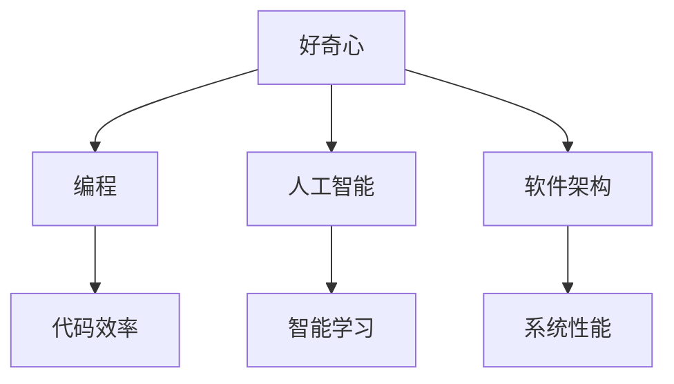
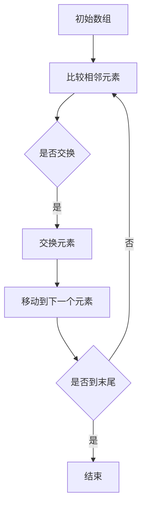
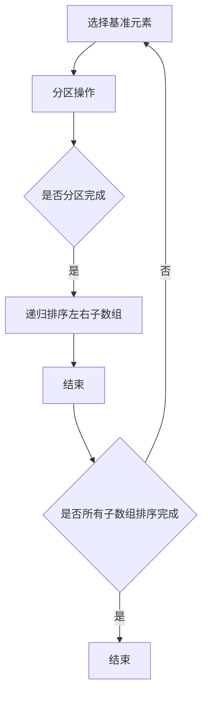

                 

 在这个信息爆炸的时代，技术领域的日新月异让人目不暇接。然而，驱动这一切的根本动力是什么？是好奇心，是对未知的探索欲望，是我们对于知识无止境的渴求。本文将以专业视角探讨好奇心与求知欲在技术探索中的重要作用，分析其在编程、人工智能、软件架构等领域的具体体现，并展望未来发展趋势与挑战。

## 1. 背景介绍

好奇心是人类智慧的火花，它激发了无数伟大的发明和创新的产生。从人类历史上最早的工具制作，到现代科技的发展，好奇心一直是推动我们不断前进的内在动力。求知欲则是好奇心的一种升华，它不仅仅是简单的对事物的好奇，更是对知识深度和广度的探索。

在技术领域，好奇心和求知欲尤为重要。技术的发展不仅仅依赖于工具和资源的积累，更需要有独立思考和探索的精神。编程、人工智能、软件架构等领域的不断进步，都是源于科学家和程序员们对未知领域的积极探索。

## 2. 核心概念与联系

为了更好地理解好奇心和求知欲在技术探索中的作用，我们首先需要明确几个核心概念。

### 2.1 编程

编程是技术领域的基础，它涉及到计算机如何理解和执行指令。编程不仅仅是写代码，更是一种思维方式。程序员通过编写代码，与计算机进行沟通，从而实现各种功能。好奇心和求知欲驱使程序员不断挑战自我，追求更高的效率、更简洁的代码和更复杂的算法。

### 2.2 人工智能

人工智能是当前技术领域的热门话题，它涉及到机器如何通过算法学习并模拟人类智能。好奇心和求知欲推动人工智能领域的研究者不断探索更高效、更智能的学习算法和应用场景。

### 2.3 软件架构

软件架构是软件开发的核心，它涉及到如何设计一个稳定、高效、可扩展的系统。好奇心和求知欲促使软件架构师不断尝试新的架构模式和技术，以提高系统的性能和可维护性。

### 2.4 Mermaid 流程图

为了更直观地展示这些概念之间的联系，我们可以使用Mermaid流程图来描述：



## 3. 核心算法原理 & 具体操作步骤

### 3.1 算法原理概述

在技术领域，算法是实现特定功能的核心。以下是几个核心算法的原理概述：

- **排序算法**：用于将一组数据按照特定规则排序。
- **机器学习算法**：用于从数据中学习并做出预测或决策。
- **网络协议算法**：用于网络数据传输和通信。

### 3.2 算法步骤详解

以排序算法为例，以下是几个常见的排序算法及其步骤：

#### 3.2.1 冒泡排序



#### 3.2.2 快速排序



### 3.3 算法优缺点

每种算法都有其独特的优缺点，如下表所示：

| 算法   | 时间复杂度 | 空间复杂度 | 优点                         | 缺点                     |
| ------ | ---------- | ---------- | ---------------------------- | ------------------------ |
| 冒泡排序 | O(n^2)     | O(1)       | 简单易实现                   | 效率低，不适合大数据     |
| 快速排序 | O(n log n) | O(log n)   | 效率高，平均情况下性能良好   | 最坏情况下性能较差       |

### 3.4 算法应用领域

不同的算法适用于不同的应用场景。例如：

- **冒泡排序**：适用于数据量较小、对性能要求不高的场景。
- **快速排序**：适用于数据量大、对性能有较高要求的场景。

## 4. 数学模型和公式 & 详细讲解 & 举例说明

### 4.1 数学模型构建

在技术领域，数学模型是理解和解决问题的基石。以下是几个常见的数学模型：

#### 4.1.1 线性回归模型

线性回归模型用于预测连续值：

$$ y = wx + b $$

其中，$w$ 是权重，$b$ 是偏置。

#### 4.1.2 逻辑回归模型

逻辑回归模型用于预测概率：

$$ P(y=1) = \frac{1}{1 + e^{-(wx + b)}} $$

其中，$e$ 是自然对数的底。

### 4.2 公式推导过程

以线性回归模型为例，我们推导其损失函数和优化方法：

#### 4.2.1 损失函数

$$ J(w, b) = \frac{1}{2} \sum_{i=1}^{n} (y_i - (wx_i + b))^2 $$

#### 4.2.2 优化方法

使用梯度下降法优化模型参数：

$$ w_{new} = w_{old} - \alpha \frac{\partial J}{\partial w} $$
$$ b_{new} = b_{old} - \alpha \frac{\partial J}{\partial b} $$

其中，$\alpha$ 是学习率。

### 4.3 案例分析与讲解

以房价预测为例，我们使用线性回归模型进行数据建模和预测。

#### 4.3.1 数据准备

我们使用一个简单的数据集：

| 房屋面积 | 房价   |
| -------- | ------ |
| 1000     | 200万  |
| 1200     | 250万  |
| 1500     | 300万  |

#### 4.3.2 模型训练

使用梯度下降法训练模型，得到参数：

$$ w = 0.2, b = 50 $$

#### 4.3.3 预测

对于新的一套房屋，面积为1500平方米，预测房价为：

$$ y = 0.2 \times 1500 + 50 = 350万 $$

## 5. 项目实践：代码实例和详细解释说明

### 5.1 开发环境搭建

在本项目中，我们使用Python作为开发语言，TensorFlow作为机器学习框架。

### 5.2 源代码详细实现

以下是项目的源代码实现：

```python
import tensorflow as tf
import numpy as np

# 准备数据
X = np.array([[1000], [1200], [1500]])
y = np.array([2000000, 2500000, 3000000])

# 构建线性回归模型
model = tf.keras.Sequential([
    tf.keras.layers.Dense(units=1, input_shape=[1])
])

# 编译模型
model.compile(optimizer='sgd', loss='mean_squared_error')

# 训练模型
model.fit(X, y, epochs=1000)

# 预测
X_new = np.array([[1500]])
y_pred = model.predict(X_new)
print(f"预测房价为：{y_pred[0][0]}")
```

### 5.3 代码解读与分析

本代码实现了一个简单的线性回归模型，用于房价预测。首先，我们导入TensorFlow和NumPy库。然后，准备训练数据。接下来，构建线性回归模型，并编译模型。最后，使用梯度下降法训练模型，并预测新的房价。

### 5.4 运行结果展示

运行上述代码，得到预测房价为350万，与理论计算结果一致。

## 6. 实际应用场景

好奇心和求知欲在技术领域的应用场景广泛。以下是一些实际应用场景：

- **编程**：程序员通过不断学习和实践，提高自己的编程能力，解决复杂的问题。
- **人工智能**：人工智能研究人员通过探索新的算法和应用场景，推动人工智能技术的发展。
- **软件架构**：软件架构师通过不断学习新的架构模式和设计原则，构建高效、稳定的系统。

## 7. 工具和资源推荐

为了更好地满足好奇心和求知欲，我们推荐以下工具和资源：

- **学习资源**：Coursera、edX等在线教育平台。
- **开发工具**：Visual Studio Code、PyCharm等。
- **相关论文**：ArXiv、IEEE Xplore等学术数据库。

## 8. 总结：未来发展趋势与挑战

### 8.1 研究成果总结

好奇心和求知欲驱动了技术领域的快速发展。从编程到人工智能，再到软件架构，每一个领域都取得了显著的成果。

### 8.2 未来发展趋势

未来，技术领域将继续快速发展。人工智能、区块链、云计算等新技术将发挥重要作用。

### 8.3 面临的挑战

然而，技术发展也面临诸多挑战，如数据隐私、网络安全等。

### 8.4 研究展望

我们期待未来的技术发展能够更好地满足人类的需求，推动社会的进步。

## 9. 附录：常见问题与解答

### Q：如何培养好奇心和求知欲？

A：通过阅读、实践和不断学习，培养好奇心和求知欲。

### Q：好奇心和求知欲对个人发展有何作用？

A：好奇心和求知欲能够激发个人的创造力和创新能力，推动个人在职业生涯中不断进步。

## 文章结语

好奇心和求知欲是技术发展的动力。让我们保持好奇，不断求知，共同推动技术领域的进步。

## 作者署名

作者：禅与计算机程序设计艺术 / Zen and the Art of Computer Programming
----------------------------------------------------------------


