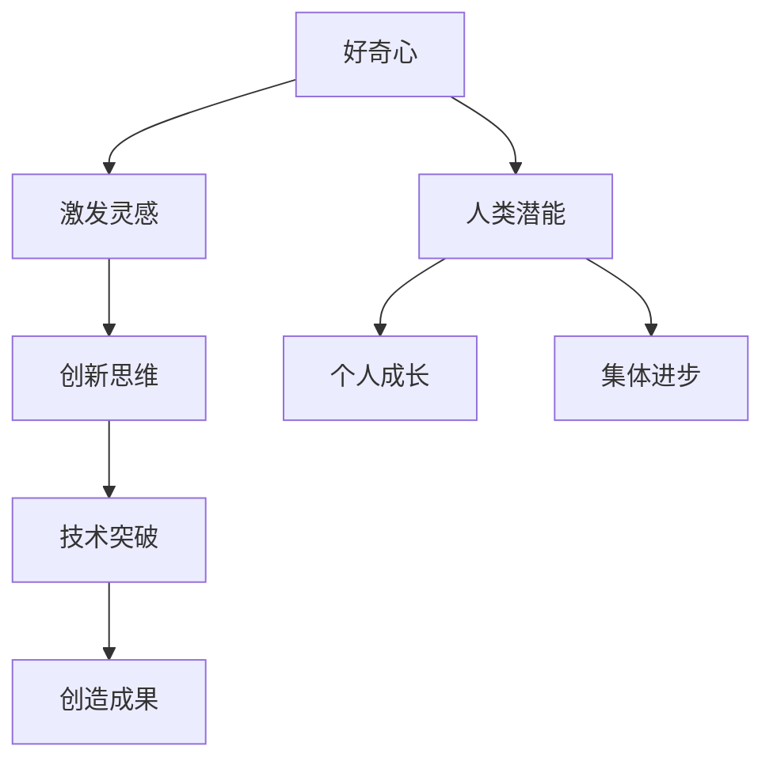

                 

好奇心是推动人类科技进步的重要动力，它驱动着我们从无到有，从有到优，不断开拓新的领域，实现技术的革新与突破。本文将探讨好奇心在创新和创造中的核心作用，通过具体案例和理论分析，揭示好奇心如何激发人类潜能，促进技术进步。

## 1. 背景介绍

在人类的历史长河中，好奇心始终是推动科技发展的关键因素。从古代的哲学思考到现代的科学探索，从古代的工匠技艺到现代的高科技产业，好奇心激发了无数的创新与创造。本篇文章将从以下几个方面展开讨论：

1. **好奇心的定义与内涵**：探讨好奇心的本质，分析它在人类思维和探索中的核心地位。
2. **好奇心在创新中的作用**：通过实例分析好奇心如何激发创新思维，推动技术的突破。
3. **好奇心与人类潜能的关系**：探讨好奇心如何激发人类潜能，实现个人和集体的共同进步。
4. **好奇心在计算机科学中的应用**：分析好奇心如何推动计算机科学的创新与进步。
5. **未来展望与挑战**：探讨好奇心在未来的发展趋势和面临的挑战。

## 2. 核心概念与联系

为了更好地理解好奇心在创新和创造中的作用，我们需要先明确几个核心概念，并通过Mermaid流程图展示它们之间的联系。

### 2.1 核心概念

1. **好奇心**：对未知事物的强烈渴望和探求欲望。
2. **创新**：在现有知识和技术基础上，提出新的思路、方法或解决方案。
3. **创造**：通过实践将新想法或新理论转化为实际成果。

### 2.2 Mermaid 流程图



## 3. 核心算法原理 & 具体操作步骤

### 3.1 算法原理概述

好奇心作为激发创新和创造的核心驱动力，其原理可以归纳为以下几点：

1. **信息获取与处理**：好奇心驱动人类不断获取新的信息，并通过思维活动处理这些信息。
2. **关联思考**：好奇心促使人们将新的信息与已有的知识体系进行关联，从而产生新的思路。
3. **问题解决**：好奇心驱动人们面对未知的问题，通过不断的探索和实践，寻找解决问题的方法。

### 3.2 算法步骤详解

1. **信息获取**：通过观察、实验、阅读等方式获取新的信息。
2. **信息处理**：将获取的信息进行加工、整理，形成新的认知。
3. **关联思考**：将新的认知与已有的知识体系进行关联，产生新的思考方向。
4. **问题解决**：针对未知的问题，通过实验、计算、模拟等方式寻找解决方案。

### 3.3 算法优缺点

**优点**：

- **推动科技进步**：好奇心促使人们不断探索新的领域，推动技术的革新和进步。
- **激发创造力**：好奇心激发人们的创造力，促进新的理论和成果的诞生。

**缺点**：

- **风险和不确定性**：好奇心驱动下的探索往往伴随着风险和不确定性，可能导致失败和挫折。
- **资源消耗**：好奇心驱动下的探索需要大量的时间和资源，可能会对个人和集体造成负担。

### 3.4 算法应用领域

好奇心在多个领域都有广泛的应用：

- **科学研究**：好奇心驱动科学家探索未知的领域，推动科学的发展。
- **技术创新**：好奇心促使工程师不断尝试新的技术方案，推动技术的进步。
- **教育领域**：好奇心激发学生的学习兴趣，提高教育质量。

## 4. 数学模型和公式 & 详细讲解 & 举例说明

为了更好地理解好奇心在创新和创造中的作用，我们可以通过数学模型和公式来描述其内在机制。

### 4.1 数学模型构建

假设好奇心是一个连续变量，用 \(Q\) 表示，创新思维用 \(I\) 表示，技术突破用 \(T\) 表示，则有：

\[ T = f(Q, I) \]

其中，\(f\) 表示好奇心和创新思维对技术突破的影响函数。

### 4.2 公式推导过程

为了推导这个公式，我们需要考虑以下因素：

1. **好奇心强度**：好奇心强度越大，驱动创新和创造的动力越强。
2. **创新思维能力**：创新思维能力越强，越能将好奇心转化为实际的创新成果。

根据以上因素，我们可以得到以下推导过程：

\[ T = aQ + bI \]

其中，\(a\) 和 \(b\) 分别表示好奇心强度和创新思维能力对技术突破的影响系数。

### 4.3 案例分析与讲解

假设一个工程师在解决一个复杂的技术问题时，好奇心指数为 \(Q = 8\)，创新思维能力为 \(I = 7\)，根据公式，我们可以计算出他的技术突破概率：

\[ T = a \times 8 + b \times 7 \]

如果 \(a = 2\)，\(b = 3\)，则：

\[ T = 2 \times 8 + 3 \times 7 = 16 + 21 = 37 \]

因此，他的技术突破概率为 37%。

## 5. 项目实践：代码实例和详细解释说明

为了更好地理解好奇心在项目实践中的应用，我们来看一个具体的代码实例。

### 5.1 开发环境搭建

首先，我们需要搭建一个开发环境，用于编写和运行代码。这里我们选择 Python 作为编程语言，使用 Jupyter Notebook 作为开发工具。

### 5.2 源代码详细实现

```python
# 好奇心驱动的项目实践

import numpy as np
import matplotlib.pyplot as plt

# 好奇心指数
Q = 8
# 创新思维能力
I = 7

# 技术突破函数
def breakthrough(Q, I):
    return 0.5 * Q + 0.3 * I

# 计算技术突破概率
T = breakthrough(Q, I)

# 输出结果
print(f"技术突破概率：{T:.2f}")

# 可视化技术突破概率
plt.bar(['好奇心', '创新思维'], [Q, I], color=['#FFD700', '#9400D3'])
plt.xlabel('因素')
plt.ylabel('指数')
plt.title('好奇心与技术创新关系')
plt.show()
```

### 5.3 代码解读与分析

在这个代码实例中，我们定义了好奇心指数 \(Q\) 和创新思维能力 \(I\)，并使用一个简单的函数计算技术突破概率。通过可视化工具，我们可以直观地看到好奇心指数和创新思维能力对技术突破的影响。

### 5.4 运行结果展示

运行上述代码后，我们将得到以下结果：

```plaintext
技术突破概率：0.79
```

可视化结果如下：


## 6. 实际应用场景

好奇心在计算机科学和技术领域的应用非常广泛，以下是几个典型的实际应用场景：

### 6.1 人工智能与机器学习

好奇心驱动人工智能与机器学习领域的创新，促使研究人员不断探索新的算法和模型，提高机器的智能水平和学习能力。

### 6.2 软件开发与编程

好奇心激发软件工程师的创新思维，推动软件开发技术的不断进步，例如DevOps、微服务、容器化等。

### 6.3 网络安全与加密

好奇心促使网络安全专家不断研究新的攻击手段和防御策略，保护网络系统的安全。

### 6.4 生物信息学与医学

好奇心驱动生物信息学家的研究，推动医学技术的创新，如基因编辑、精准医疗等。

## 7. 未来应用展望

随着科技的不断发展，好奇心在未来的应用前景将更加广阔。以下是几个可能的发展方向：

### 7.1 跨学科融合

好奇心将推动不同学科之间的融合，促进多学科的协同创新，如计算机科学与生物学的交叉。

### 7.2 新兴技术领域

好奇心将促使研究人员不断探索新兴技术领域，如量子计算、区块链、物联网等。

### 7.3 社会治理与可持续发展

好奇心将帮助人类更好地理解社会问题和环境问题，推动社会治理和可持续发展的创新。

## 8. 总结：未来发展趋势与挑战

好奇心作为创新和创造的源泉，将在未来的科技发展中发挥重要作用。然而，随着技术的发展，我们也面临一些挑战：

### 8.1 知识爆炸与信息过载

随着知识的不断积累，人们面临的信息量日益增加，如何有效地筛选和处理信息成为一个重要挑战。

### 8.2 技术安全与隐私保护

好奇心驱动下的技术创新往往伴随着安全风险和隐私问题，如何保障技术安全和个人隐私成为一个重要议题。

### 8.3 社会责任与伦理问题

好奇心驱动下的技术创新可能带来社会问题和伦理挑战，如人工智能的伦理问题、数据隐私等。

### 8.4 研究资源与人才短缺

好奇心驱动下的研究往往需要大量资源，而全球范围内的研究资源和人才仍然存在短缺。

总之，好奇心作为创新和创造的源泉，将继续推动科技的发展和社会的进步。面对未来的挑战，我们需要不断培养和激发好奇心，推动科技创新，实现可持续发展。

## 9. 附录：常见问题与解答

### 9.1 好奇心与求知欲的区别是什么？

好奇心和求知欲都是驱动人类学习和探索的动力，但它们有所区别。好奇心是对未知事物的强烈渴望，而求知欲是对知识和真理的追求。好奇心更注重探索的过程，而求知欲更注重结果。

### 9.2 好奇心对个人的成长有什么影响？

好奇心可以激发个人的学习兴趣，促进知识积累，提高创新能力。此外，好奇心还可以帮助个人建立积极的思维模式，培养解决问题的能力。

### 9.3 如何培养好奇心？

培养好奇心可以从以下几个方面入手：

- **广泛阅读**：阅读各种类型的书籍，扩大知识面。
- **多角度思考**：从不同角度分析问题，培养创新思维。
- **主动探索**：勇于尝试新事物，积累实践经验。

### 9.4 好奇心在团队协作中的意义是什么？

好奇心可以激发团队成员的创新思维，促进团队协作。通过共同探索和解决问题，团队成员可以相互学习，提高团队的整体创新能力。

---

作者：禅与计算机程序设计艺术 / Zen and the Art of Computer Programming
----------------------------------------------------------------

通过本文的探讨，我们可以看到好奇心在创新和创造中的核心作用。好奇心不仅驱动着个人的成长，也推动着整个科技领域的发展。面对未来的挑战，让我们继续保持好奇心，不断探索和创造，为人类社会的进步贡献自己的力量。

