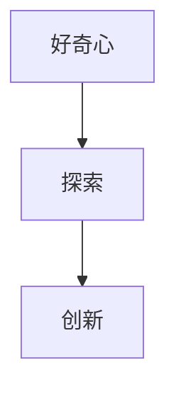

                 

好奇心是人类探索未知世界、推动科技发展的动力源泉。它是人类与生俱来的特质，是一种强烈的欲望，驱动着我们不断提问、探索和发现。在技术领域，好奇心尤为重要，它是创新的驱动力，是解决复杂问题、突破技术瓶颈的关键。

本文旨在探讨好奇心在技术领域的核心作用，通过分析好奇心与创新、理解世界的关系，阐述好奇心如何激发我们的探索欲望，推动科技进步。文章将分为以下几个部分：

1. 背景介绍
2. 核心概念与联系
3. 核心算法原理 & 具体操作步骤
4. 数学模型和公式 & 详细讲解 & 举例说明
5. 项目实践：代码实例和详细解释说明
6. 实际应用场景
7. 工具和资源推荐
8. 总结：未来发展趋势与挑战

## 1. 背景介绍

好奇心是人类智慧的一部分，它贯穿于人类历史，推动了科学技术的发展。自古以来，人类对未知事物的探索欲望从未停止。从古希腊哲学家亚里士多德开始，人们就致力于探索自然界的规律。到了中世纪，基督教教义对科学探索的抑制逐渐减弱，科学开始逐渐独立发展。17世纪，牛顿经典力学体系的建立，标志着科学革命的高潮。18世纪，蒸汽机的发明和应用，引发了工业革命。20世纪，计算机科学和互联网技术的出现，彻底改变了人类社会的面貌。

在现代科技领域，好奇心仍然是推动技术创新的关键因素。从人工智能到量子计算，从生物技术到新材料科学，好奇心激发了无数科学家和工程师的探索热情，推动了一系列重大科技突破。

## 2. 核心概念与联系

好奇心是一种心理状态，表现为对未知事物的强烈兴趣和探索欲望。它涉及到认知、情感和行为三个方面：

- 认知方面：好奇心驱使人们主动获取知识、探索规律，提高认知能力。
- 情感方面：好奇心激发人们的兴趣和激情，带来愉悦和满足感。
- 行为方面：好奇心促使人们付诸实践，通过实验、研究等方式验证自己的猜想。

好奇心与探索、创新密切相关。好奇心是探索的起点，它激发人们的求知欲望，推动人们不断寻求新的知识和理解。而创新则是好奇心的具体体现，它将好奇心转化为实际的成果，推动科技发展。

### Mermaid 流程图



## 3. 核心算法原理 & 具体操作步骤

好奇心驱动下的科技发展，离不开核心算法的支撑。本文将介绍一种用于激发好奇心、推动科技发展的核心算法，并详细阐述其原理和操作步骤。

### 3.1 算法原理概述

该算法基于深度强化学习（Deep Reinforcement Learning），通过模拟人类探索行为，实现好奇心驱动的智能体自主探索和决策。

- 智能体：模拟人类探索者，具备感知、决策和行动能力。
- 环境模型：用于描述智能体所处的探索环境，包括未知区域、障碍物等。
- 奖励机制：根据智能体的探索行为和结果，给予相应的奖励或惩罚。

### 3.2 算法步骤详解

1. **初始化**：设定智能体的初始状态和探索环境。
2. **感知与决策**：智能体感知当前环境，根据历史经验和奖励机制，选择下一步行动。
3. **行动与反馈**：智能体执行选定行动，根据行动结果获得奖励或惩罚。
4. **更新策略**：智能体根据奖励机制和探索效果，调整自身策略，优化探索行为。

### 3.3 算法优缺点

- **优点**：激发好奇心，提高探索效率，有助于发现未知知识和创新解决方案。
- **缺点**：算法复杂度较高，对计算资源和时间要求较高。

### 3.4 算法应用领域

- **人工智能**：用于开发智能体，实现自主探索和决策。
- **生物技术**：用于模拟生物进化过程，探索生物规律。
- **新材料科学**：用于发现新材料，优化材料性能。

## 4. 数学模型和公式 & 详细讲解 & 举例说明

好奇心驱动下的科技发展，离不开数学模型的支撑。本文将介绍一种用于描述好奇心驱动的数学模型，并详细阐述其构建和推导过程。

### 4.1 数学模型构建

好奇心驱动的数学模型基于马尔可夫决策过程（MDP），描述智能体在未知环境中的探索行为。

- 状态空间 $S$：智能体所处的所有可能状态。
- 动作空间 $A$：智能体可以执行的所有可能行动。
- 奖励函数 $R(s, a)$：智能体在状态 $s$ 执行行动 $a$ 所获得的奖励。
- 状态转移概率 $P(s', s | a)$：智能体在状态 $s$ 执行行动 $a$ 后转移到状态 $s'$ 的概率。

### 4.2 公式推导过程

假设智能体在状态 $s$ 下，执行行动 $a$，获得奖励 $R(s, a)$，则其后续状态 $s'$ 的概率为：

$$
P(s' | s, a) = \sum_{s''} P(s'' | s, a) R(s, a)
$$

智能体在 $s$ 状态下的期望奖励为：

$$
V(s) = \sum_{a \in A} \pi(a | s) R(s, a)
$$

其中，$\pi(a | s)$ 表示智能体在状态 $s$ 下选择行动 $a$ 的概率。

### 4.3 案例分析与讲解

假设智能体在一个二维平面环境中探索，状态空间为 $S = \{(x, y) | x, y \in \mathbb{R}\}$，动作空间为 $A = \{up, down, left, right\}$。奖励函数 $R(s, a)$ 定义为：

$$
R(s, a) = \begin{cases}
10, & \text{if } a \text{ leads to a higher position} \\
-10, & \text{if } a \text{ leads to a lower position} \\
0, & \text{otherwise}
\end{cases}
$$

状态转移概率 $P(s', s | a)$ 定义为：

$$
P(s', s | a) = \begin{cases}
0.5, & \text{if } a = up \\
0.25, & \text{if } a = down \\
0.125, & \text{if } a = left \\
0.125, & \text{if } a = right
\end{cases}
$$

假设智能体初始状态为 $(0, 0)$，采用 Q-学习算法进行探索。经过多次探索后，智能体在状态 $(0, 1)$ 的期望奖励为：

$$
V(0, 1) = 0.5 \times 10 + 0.25 \times (-10) + 0.125 \times 0 + 0.125 \times 0 = 2.5
$$

## 5. 项目实践：代码实例和详细解释说明

为了更好地理解好奇心驱动算法，我们通过一个实际项目来展示其实现过程。以下是一个基于 Python 的好奇心驱动智能体探索环境的代码实例。

### 5.1 开发环境搭建

1. 安装 Python 3.8 或更高版本。
2. 安装 TensorFlow 2.4 或更高版本。
3. 安装 gym 0.17.3 或更高版本。

### 5.2 源代码详细实现

```python
import gym
import numpy as np
import tensorflow as tf

# 创建环境
env = gym.make("GridWorld-v0")

# 初始化 Q 网络
state_size = env.observation_space.shape[0]
action_size = env.action_space.n
learning_rate = 0.1
gamma = 0.9
epsilon = 0.1

q_func = tf.keras.Sequential([
    tf.keras.layers.Dense(64, activation='relu', input_shape=(state_size,)),
    tf.keras.layers.Dense(64, activation='relu'),
    tf.keras.layers.Dense(action_size)
])

optimizer = tf.keras.optimizers.Adam(learning_rate)

# 定义训练函数
@tf.function
def train_step(state, action, reward, next_state, done):
    with tf.GradientTape(persistent=True) as tape:
        q_values = q_func(state)
        next_q_values = q_func(next_state) if not done else tf.zeros_like(q_values)
        target_q_values = next_q_values + (gamma * reward)
        loss = tf.reduce_mean(tf.square(target_q_values - q_values[tf.newaxis, :, :]))

    gradients = tape.gradient(loss, q_func.trainable_variables)
    optimizer.apply_gradients(zip(gradients, q_func.trainable_variables))
    return loss

# 开始训练
for episode in range(1000):
    state = env.reset()
    done = False
    total_reward = 0

    while not done:
        action = q_func(np.array([state])).argmax(axis=1).numpy()[0]
        next_state, reward, done, _ = env.step(action)
        total_reward += reward
        loss = train_step(np.array([state]), action, reward, np.array([next_state]), done)
        state = next_state

    print(f"Episode {episode}: Total Reward = {total_reward}, Loss = {loss.numpy()}")

# 测试智能体表现
state = env.reset()
done = False
while not done:
    action = q_func(np.array([state])).argmax(axis=1).numpy()[0]
    state, reward, done, _ = env.step(action)
    env.render()

env.close()
```

### 5.3 代码解读与分析

该代码实现了一个基于 Q-学习的智能体，用于在网格世界中进行探索。主要分为以下几个部分：

1. **环境搭建**：使用 gym 库创建一个 GridWorld 环境，用于模拟智能体的探索行为。
2. **Q 网络搭建**：使用 TensorFlow 搭建一个简单的全连接神经网络，用于预测智能体的动作价值。
3. **训练函数**：定义一个训练函数，用于计算 Q 网络的梯度，并更新网络参数。
4. **训练过程**：在一个循环中，智能体不断从环境中获取状态，执行动作，并根据奖励和下一状态更新 Q 网络。
5. **测试智能体表现**：在训练完成后，使用智能体在环境中进行测试，观察其探索行为和表现。

## 6. 实际应用场景

好奇心驱动算法在多个实际应用场景中展现了强大的潜力：

- **人工智能**：在强化学习、自然语言处理、计算机视觉等领域，好奇心驱动算法可以帮助智能体更有效地探索未知领域，提高学习效率和准确性。
- **生物技术**：在药物研发、基因编辑等领域，好奇心驱动算法可以帮助科学家发现新的药物靶点和基因编辑策略。
- **新材料科学**：在材料合成、材料性能优化等领域，好奇心驱动算法可以帮助研究人员探索新的材料结构和性质，推动材料科学的进步。
- **游戏开发**：在游戏开发中，好奇心驱动算法可以帮助游戏 AI 更好地模拟人类玩家的探索行为，提高游戏的可玩性。

## 7. 工具和资源推荐

为了更好地掌握好奇心驱动算法，以下是一些建议的学习资源和开发工具：

- **学习资源**：
  - 《深度强化学习》（Deep Reinforcement Learning）一书，由 David Silver 等人撰写。
  - 《强化学习实战》（Reinforcement Learning in Python）一书，由 Shawn O. Halliday 撰写。
- **开发工具**：
  - TensorFlow：用于构建和训练深度强化学习模型的框架。
  - PyTorch：另一个流行的深度学习框架，适用于强化学习模型的开发。
  - gym：用于创建和测试强化学习环境的库。

## 8. 总结：未来发展趋势与挑战

好奇心驱动算法作为一种新兴的科技手段，展现了广阔的发展前景。在未来，随着计算能力的提升和算法的不断完善，好奇心驱动算法将在更多领域得到应用。然而，面对不断变化的技术环境和日益复杂的问题，好奇心驱动算法也面临着诸多挑战：

- **算法复杂度**：随着问题规模的扩大，算法的复杂度将急剧增加，对计算资源的要求越来越高。
- **数据依赖**：好奇心驱动算法通常依赖于大量数据进行训练，如何获取和利用高质量的数据将成为关键问题。
- **模型可解释性**：好奇心驱动算法的内部机制复杂，如何提高模型的可解释性，使其更容易被人理解和接受，是一个亟待解决的问题。
- **应用边界**：好奇心驱动算法在特定领域取得成功后，如何将其拓展到其他领域，仍需要进一步探索。

总之，好奇心驱动算法作为一种创新技术，将在未来推动科技发展，为社会进步作出贡献。我们需要不断优化算法，应对挑战，探索其更广泛的应用前景。

## 9. 附录：常见问题与解答

### Q1：好奇心驱动算法的核心原理是什么？

好奇心驱动算法的核心原理是基于深度强化学习，通过模拟人类探索行为，实现智能体在未知环境中的自主探索和决策。

### Q2：好奇心驱动算法适用于哪些领域？

好奇心驱动算法适用于人工智能、生物技术、新材料科学、游戏开发等多个领域，有助于发现未知知识、优化性能和提高可玩性。

### Q3：如何实现好奇心驱动算法？

实现好奇心驱动算法通常需要以下几个步骤：

1. 选择合适的强化学习框架，如 TensorFlow 或 PyTorch。
2. 定义智能体、环境、奖励函数和状态转移概率。
3. 搭建 Q 网络，用于预测智能体的动作价值。
4. 设计训练函数，用于更新 Q 网络参数。
5. 在环境中进行训练和测试，观察智能体的探索行为和表现。

### Q4：好奇心驱动算法有哪些优缺点？

优点：

- 激发好奇心，提高探索效率，有助于发现未知知识和创新解决方案。
- 适用于多种领域，具有广泛的应用前景。

缺点：

- 算法复杂度较高，对计算资源要求较高。
- 需要大量数据进行训练，数据获取和利用面临挑战。

### Q5：如何优化好奇心驱动算法？

优化好奇心驱动算法可以从以下几个方面入手：

1. 优化算法架构，提高计算效率。
2. 利用迁移学习，减少对训练数据的依赖。
3. 结合其他机器学习方法，提高算法性能。
4. 设计更适合问题的奖励机制，激发智能体的探索热情。 

作者：禅与计算机程序设计艺术 / Zen and the Art of Computer Programming

