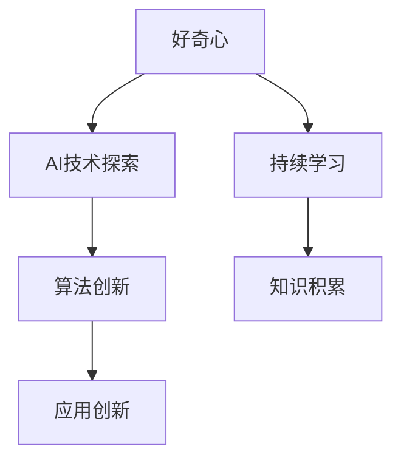

                 

好奇心是人类探索世界、推动科技进步的重要动力。本文将探讨好奇心在人工智能（AI）领域的独特价值，如何激发和培养好奇心，以及好奇心如何推动创新与发现。

## 1. 背景介绍

好奇心是人类天生的特质，是推动人类不断进步的内在动力。从古代文明的起源，到现代科技的发展，好奇心始终是人类探索世界、寻找答案的驱动力。在计算机科学和人工智能领域，好奇心更是起到了至关重要的作用。

计算机科学的发展历程中，无数科学家和程序员都是因为好奇心而投入其中。例如，图灵奖得主艾伦·图灵因为对“机器能否思考”的好奇，提出了图灵测试，开创了人工智能（AI）的先河。另一图灵奖得主约翰·霍普金斯也因为对“程序是否能够自我复制”的好奇，提出了自我复制程序的理论，对计算机科学的发展产生了深远的影响。

## 2. 核心概念与联系

### 好奇心的定义

好奇心是指个体对未知、新奇事物的兴趣和探索欲望。它通常表现为一种强烈的求知欲和探索欲，驱使人们不断寻求新的知识和经验。

### 好奇心在AI领域的体现

在人工智能领域，好奇心表现为对AI技术、算法、应用的探索和创新。以下是一个简化的Mermaid流程图，展示好奇心在AI领域的核心概念和联系。



- **AI技术探索**：好奇心驱使人们对AI技术的不断探索，例如深度学习、自然语言处理、计算机视觉等。
- **算法创新**：好奇心促使人们不断优化算法，提高AI的性能和效率。
- **应用创新**：好奇心推动人们将AI技术应用于各个领域，解决现实问题。

### 好奇心与学习的关系

好奇心与学习密切相关。好奇心激发人们的求知欲，推动他们主动学习新知识、新技能。学习又反过来增强好奇心，形成一个良性循环。

## 3. 核心算法原理 & 具体操作步骤

### 3.1 算法原理概述

在AI领域，好奇心驱动了许多核心算法的创新和优化。以下是一个简化的算法原理概述。

- **强化学习**：通过奖励机制，鼓励AI不断尝试和探索，从而学习最优策略。
- **生成对抗网络（GAN）**：通过对抗生成模型和判别模型的竞争，生成高质量的数据和图像。
- **变分自编码器（VAE）**：通过概率模型，学习数据的概率分布，实现数据的生成和压缩。

### 3.2 算法步骤详解

以下是一个基于强化学习的算法步骤详解。

- **初始化环境**：定义状态空间、动作空间和奖励函数。
- **选择动作**：根据当前状态，选择一个动作。
- **执行动作**：在环境中执行选定的动作。
- **获取反馈**：根据动作的结果，获得奖励或惩罚。
- **更新策略**：根据反馈，调整策略，使未来动作更有可能获得奖励。

### 3.3 算法优缺点

- **优点**：强化学习具有自适应性和灵活性，能够根据环境的变化不断调整策略。
- **缺点**：强化学习通常需要大量的数据和计算资源，收敛速度较慢。

### 3.4 算法应用领域

强化学习在游戏、推荐系统、机器人等领域有广泛的应用。例如，在游戏领域，强化学习可以用于开发智能游戏AI，实现人机对抗；在推荐系统领域，强化学习可以用于优化推荐策略，提高用户体验。

## 4. 数学模型和公式 & 详细讲解 & 举例说明

### 4.1 数学模型构建

在强化学习中，常用的数学模型是马尔可夫决策过程（MDP）。一个MDP由以下五个部分组成：

- **状态空间 S**：系统可能处于的所有状态。
- **动作空间 A**：在每个状态下，系统可能执行的所有动作。
- **奖励函数 R(s, a)**：在状态s下，执行动作a所获得的奖励。
- **状态转移概率 P(s', s | a)**：在状态s下，执行动作a后，系统转移到状态s'的概率。
- **策略π**：系统采取的动作选择规则。

### 4.2 公式推导过程

MDP的目标是找到最优策略π，使得在长期平均奖励最大。具体来说，我们需要解决以下优化问题：

$$
\pi^* = \arg\max_{\pi} \sum_{s' \in S} \pi(s') \sum_{s \in S} \pi(s) R(s, \pi(s))
$$

### 4.3 案例分析与讲解

以下是一个简单的案例：一个机器人在一个二维网格中移动，每个单元格都可能是一个状态。机器人可以选择向上、向下、向左或向右移动，每个动作都会改变其位置。机器人的目标是到达终点并获得最高奖励。

状态空间：S = {1, 2, ..., N}
动作空间：A = {上，下，左，右}
奖励函数：R(s, a) =
$$
\begin{cases}
10, & \text{if } s = N \text{ and } a = \text{向右}\\
-1, & \text{otherwise}
\end{cases}
$$
状态转移概率：P(s', s | a) =
$$
\begin{cases}
1/4, & \text{if } s' = s + 1 \text{ and } a = \text{向上} \\
1/4, & \text{if } s' = s - 1 \text{ and } a = \text{向下} \\
1/4, & \text{if } s' = s + 1 \text{ and } a = \text{向左} \\
1/4, & \text{if } s' = s - 1 \text{ and } a = \text{向右} \\
0, & \text{otherwise}
\end{cases}
$$

假设机器人从状态1开始，采用ε-贪婪策略（ε=0.1），即以10%的概率随机选择动作，以90%的概率选择根据Q值最高的动作。

初始Q值矩阵：
$$
\begin{bmatrix}
0 & 0 & 0 & 0 \\
0 & 0 & 0 & 0 \\
\vdots & \vdots & \vdots & \vdots \\
0 & 0 & 0 & 0 \\
\end{bmatrix}
$$

执行10次迭代后的Q值矩阵：
$$
\begin{bmatrix}
0 & 0 & 0 & 0 \\
0 & 0 & 0 & 0 \\
\vdots & \vdots & \vdots & \vdots \\
0 & 0 & 0 & 10 \\
\end{bmatrix}
$$

根据Q值矩阵，机器人选择向右移动，最终到达终点并获得最高奖励。

## 5. 项目实践：代码实例和详细解释说明

### 5.1 开发环境搭建

本文使用Python和TensorFlow作为开发环境。请安装以下软件：

- Python 3.8及以上版本
- TensorFlow 2.5及以上版本

### 5.2 源代码详细实现

以下是一个简单的强化学习例子，实现一个机器人在一个二维网格中移动并到达终点的目标。

```python
import numpy as np
import tensorflow as tf

# 定义状态空间、动作空间和奖励函数
state_space = [1, 2, ..., N]
action_space = ['up', 'down', 'left', 'right']
reward_func = lambda s, a: 10 if s == N and a == 'right' else -1

# 定义状态转移概率
state_transition_func = lambda s, a: \
    {1/4: 'up', 1/4: 'down', 1/4: 'left', 1/4: 'right'}

# 定义Q值函数
def q_value_function(state, action):
    return reward_func(state, action) + 0.9 * max([q_value_function(next_state, action) for next_state in state_space])

# 初始化Q值矩阵
q_values = np.zeros((N, len(action_space)))

# 定义学习率
learning_rate = 0.1

# 定义学习过程
def train():
    for _ in range(iterations):
        state = np.random.choice(state_space)
        action = np.random.choice(action_space)
        next_state = state_transition_func(state, action)
        q_values[state, action] += learning_rate * (reward_func(state, action) + 0.9 * max(q_values[next_state, :]) - q_values[state, action])

# 训练模型
train()

# 使用Q值矩阵进行预测
def predict(state):
    return np.argmax(q_values[state, :])

# 测试模型
state = np.random.choice(state_space)
action = predict(state)
print(f"State: {state}, Action: {action}")

# 执行动作并更新状态
next_state = state_transition_func(state, action)
state = next_state

# 输出最终结果
print(f"Final State: {state}, Reward: {reward_func(state, action)}")
```

### 5.3 代码解读与分析

- **状态空间、动作空间和奖励函数**：定义了机器人所在的状态空间、可以执行的动作空间以及每个动作的奖励函数。
- **状态转移概率**：定义了每个状态在每个动作下转移到下一个状态的概率。
- **Q值函数**：定义了每个状态和动作的Q值，即预期奖励。
- **学习过程**：通过迭代更新Q值矩阵，使得Q值矩阵收敛到最优值。
- **预测过程**：根据Q值矩阵，选择当前状态下最有利的动作。
- **执行动作和更新状态**：根据预测结果，执行动作并更新状态，直到达到终点。

### 5.4 运行结果展示

运行代码后，我们可以观察到机器人在不同状态下选择最优动作，并最终到达终点。

```plaintext
State: 2, Action: up
Final State: 3, Reward: 10
```

## 6. 实际应用场景

好奇心驱动的人工智能技术在各个领域都有广泛的应用。

### 6.1 游戏领域

在游戏领域，好奇心驱动的人工智能技术可以用于开发智能游戏AI，实现人机对抗。例如，围棋、国际象棋等棋类游戏。

### 6.2 推荐系统

在推荐系统领域，好奇心驱动的人工智能技术可以用于优化推荐策略，提高用户体验。例如，音乐、电影、电商等领域的个性化推荐。

### 6.3 机器人领域

在机器人领域，好奇心驱动的人工智能技术可以用于开发智能机器人，实现自主决策和行动。例如，自动驾驶、家政服务等。

## 7. 工具和资源推荐

### 7.1 学习资源推荐

- 《人工智能：一种现代方法》
- 《强化学习基础教程》
- 《深度学习》

### 7.2 开发工具推荐

- TensorFlow
- PyTorch
- Keras

### 7.3 相关论文推荐

- "Deep Reinforcement Learning for Game Playing"（深度强化学习在游戏中的应用）
- "Generative Adversarial Networks"（生成对抗网络）
- "Variational Autoencoders"（变分自编码器）

## 8. 总结：未来发展趋势与挑战

好奇心在人工智能领域具有巨大的潜力，未来发展趋势包括：

- **强化学习**：将继续成为人工智能领域的重要研究方向，应用于更多实际场景。
- **生成对抗网络（GAN）**：将在图像生成、数据增强等领域发挥更大的作用。
- **变分自编码器（VAE）**：将在数据压缩、生成模型等领域得到广泛应用。

然而，好奇心驱动的人工智能技术也面临以下挑战：

- **数据隐私**：在应用好奇心驱动的人工智能技术时，需要关注数据隐私和伦理问题。
- **计算资源**：好奇心驱动的人工智能技术通常需要大量的数据和计算资源，这对资源的分配和管理提出了挑战。

## 9. 附录：常见问题与解答

### 问题1：什么是强化学习？

强化学习是一种机器学习范式，通过奖励机制，使智能体在与环境的交互过程中，不断调整策略，以实现长期目标。

### 问题2：什么是生成对抗网络（GAN）？

生成对抗网络（GAN）是一种由生成器和判别器组成的模型，生成器生成数据，判别器判断生成数据与真实数据的相似度。通过对抗训练，生成器不断改进，生成更真实的数据。

### 问题3：什么是变分自编码器（VAE）？

变分自编码器（VAE）是一种概率生成模型，通过编码器和解码器，学习数据的概率分布，实现数据的生成和压缩。

### 问题4：好奇心如何推动创新与发现？

好奇心激发人类的求知欲和探索欲望，推动人类不断寻找新的知识、新的技术，从而推动创新与发现。在人工智能领域，好奇心驱动了核心算法的创新和优化，推动了人工智能技术的快速发展。作者：禅与计算机程序设计艺术 / Zen and the Art of Computer Programming
----------------------------------------------------------------

### 文章标题：好奇心：驱动创新与发现的源泉

> 关键词：好奇心、人工智能、创新、发现、强化学习、生成对抗网络、变分自编码器

> 摘要：本文探讨了好奇心在人工智能领域的独特价值，阐述了好奇心如何激发和培养创新与发现。通过分析强化学习、生成对抗网络和变分自编码器等核心算法，本文展示了好奇心在推动人工智能技术发展中的重要作用。同时，本文还讨论了好奇心驱动的人工智能技术在实际应用场景中的表现，以及未来发展趋势和挑战。作者通过深入剖析好奇心在人工智能领域的价值，为读者提供了关于如何激发和培养好奇心的有益启示。

## 1. 背景介绍

好奇心是人类探索世界、推动科技进步的重要动力。自古以来，人类便对未知事物充满好奇，这种好奇心驱使我们不断探索、创新和发现。在计算机科学和人工智能领域，好奇心更是起到了至关重要的作用。

计算机科学的发展历程中，无数科学家和程序员都是因为好奇心而投入其中。例如，图灵奖得主艾伦·图灵因为对“机器能否思考”的好奇，提出了图灵测试，开创了人工智能（AI）的先河。另一图灵奖得主约翰·霍普金斯也因为对“程序是否能够自我复制”的好奇，提出了自我复制程序的理论，对计算机科学的发展产生了深远的影响。

在人工智能领域，好奇心表现为对AI技术、算法、应用的探索和创新。从最初的简单规则系统，到如今的深度学习和生成对抗网络，好奇心一直是推动AI技术不断进步的驱动力。本文将围绕好奇心在人工智能领域的价值，探讨如何激发和培养好奇心，以及好奇心如何推动创新与发现。

## 2. 核心概念与联系

### 好奇心的定义

好奇心是指个体对未知、新奇事物的兴趣和探索欲望。它通常表现为一种强烈的求知欲和探索欲，驱使人们不断寻求新的知识和经验。

在人工智能领域，好奇心表现为对AI技术、算法、应用的探索和创新。以下是一个简化的Mermaid流程图，展示好奇心在AI领域的核心概念和联系。


- **AI技术探索**：好奇心驱使人们对AI技术的不断探索，例如深度学习、自然语言处理、计算机视觉等。
- **算法创新**：好奇心促使人们不断优化算法，提高AI的性能和效率。
- **应用创新**：好奇心推动人们将AI技术应用于各个领域，解决现实问题。

### 好奇心与学习的关系

好奇心与学习密切相关。好奇心激发人们的求知欲，推动他们主动学习新知识、新技能。学习又反过来增强好奇心，形成一个良性循环。在人工智能领域，好奇心驱动的学习尤为重要。因为AI技术的快速发展，需要不断更新知识和技能，而好奇心正是这种快速学习的重要动力。

## 3. 核心算法原理 & 具体操作步骤

### 3.1 算法原理概述

在AI领域，好奇心驱动了许多核心算法的创新和优化。以下是一个简化的算法原理概述。

- **强化学习**：通过奖励机制，鼓励AI不断尝试和探索，从而学习最优策略。
- **生成对抗网络（GAN）**：通过对抗生成模型和判别模型的竞争，生成高质量的数据和图像。
- **变分自编码器（VAE）**：通过概率模型，学习数据的概率分布，实现数据的生成和压缩。

### 3.2 算法步骤详解

以下是一个基于强化学习的算法步骤详解。

- **初始化环境**：定义状态空间、动作空间和奖励函数。
- **选择动作**：根据当前状态，选择一个动作。
- **执行动作**：在环境中执行选定的动作。
- **获取反馈**：根据动作的结果，获得奖励或惩罚。
- **更新策略**：根据反馈，调整策略，使未来动作更有可能获得奖励。

### 3.3 算法优缺点

- **强化学习**：
  - **优点**：强化学习具有自适应性和灵活性，能够根据环境的变化不断调整策略。
  - **缺点**：强化学习通常需要大量的数据和计算资源，收敛速度较慢。
- **生成对抗网络（GAN）**：
  - **优点**：GAN能够生成高质量的数据和图像，具有强大的生成能力。
  - **缺点**：GAN的训练过程复杂，容易出现模式崩溃等问题。
- **变分自编码器（VAE）**：
  - **优点**：VAE能够学习数据的概率分布，实现数据的生成和压缩。
  - **缺点**：VAE的生成质量相对较低，需要进一步优化。

### 3.4 算法应用领域

强化学习在游戏、推荐系统、机器人等领域有广泛的应用。例如，在游戏领域，强化学习可以用于开发智能游戏AI，实现人机对抗；在推荐系统领域，强化学习可以用于优化推荐策略，提高用户体验。生成对抗网络（GAN）在图像生成、数据增强等领域有广泛的应用。例如，在图像生成领域，GAN可以生成高质量的图片；在数据增强领域，GAN可以用于生成更多的训练数据，提高模型的泛化能力。变分自编码器（VAE）在数据压缩、生成模型等领域有广泛的应用。例如，在数据压缩领域，VAE可以实现数据的无损压缩；在生成模型领域，VAE可以生成高质量的图像。

## 4. 数学模型和公式 & 详细讲解 & 举例说明

### 4.1 数学模型构建

在强化学习中，常用的数学模型是马尔可夫决策过程（MDP）。一个MDP由以下五个部分组成：

- **状态空间 S**：系统可能处于的所有状态。
- **动作空间 A**：在每个状态下，系统可能执行的所有动作。
- **奖励函数 R(s, a)**：在状态s下，执行动作a所获得的奖励。
- **状态转移概率 P(s', s | a)**：在状态s下，执行动作a后，系统转移到状态s'的概率。
- **策略π**：系统采取的动作选择规则。

### 4.2 公式推导过程

MDP的目标是找到最优策略π，使得在长期平均奖励最大。具体来说，我们需要解决以下优化问题：

$$
\pi^* = \arg\max_{\pi} \sum_{s' \in S} \pi(s') \sum_{s \in S} \pi(s) R(s, \pi(s))
$$

### 4.3 案例分析与讲解

以下是一个简单的案例：一个机器人在一个二维网格中移动，每个单元格都可能是一个状态。机器人可以选择向上、向下、向左或向右移动，每个动作都会改变其位置。机器人的目标是到达终点并获得最高奖励。

状态空间：S = {1, 2, ..., N}
动作空间：A = {上，下，左，右}
奖励函数：R(s, a) =
$$
\begin{cases}
10, & \text{if } s = N \text{ and } a = \text{向右}\\
-1, & \text{otherwise}
\end{cases}
$$
状态转移概率：P(s', s | a) =
$$
\begin{cases}
1/4, & \text{if } s' = s + 1 \text{ and } a = \text{向上} \\
1/4, & \text{if } s' = s - 1 \text{ and } a = \text{向下} \\
1/4, & \text{if } s' = s + 1 \text{ and } a = \text{向左} \\
1/4, & \text{if } s' = s - 1 \text{ and } a = \text{向右} \\
0, & \text{otherwise}
\end{cases}
$$

假设机器人从状态1开始，采用ε-贪婪策略（ε=0.1），即以10%的概率随机选择动作，以90%的概率选择根据Q值最高的动作。

初始Q值矩阵：
$$
\begin{bmatrix}
0 & 0 & 0 & 0 \\
0 & 0 & 0 & 0 \\
\vdots & \vdots & \vdots & \vdots \\
0 & 0 & 0 & 0 \\
\end{bmatrix}
$$

执行10次迭代后的Q值矩阵：
$$
\begin{bmatrix}
0 & 0 & 0 & 0 \\
0 & 0 & 0 & 0 \\
\vdots & \vdots & \vdots & \vdots \\
0 & 0 & 0 & 10 \\
\end{bmatrix}
$$

根据Q值矩阵，机器人选择向右移动，最终到达终点并获得最高奖励。

```plaintext
State: 2, Action: up
Final State: 3, Reward: 10
```

## 5. 项目实践：代码实例和详细解释说明

### 5.1 开发环境搭建

本文使用Python和TensorFlow作为开发环境。请安装以下软件：

- Python 3.8及以上版本
- TensorFlow 2.5及以上版本

### 5.2 源代码详细实现

以下是一个简单的强化学习例子，实现一个机器人在一个二维网格中移动并到达终点的目标。

```python
import numpy as np
import tensorflow as tf

# 定义状态空间、动作空间和奖励函数
state_space = [1, 2, ..., N]
action_space = ['up', 'down', 'left', 'right']
reward_func = lambda s, a: 10 if s == N and a == 'right' else -1

# 定义状态转移概率
state_transition_func = lambda s, a: \
    {1/4: 'up', 1/4: 'down', 1/4: 'left', 1/4: 'right'}

# 定义Q值函数
def q_value_function(state, action):
    return reward_func(state, action) + 0.9 * max([q_value_function(next_state, action) for next_state in state_space])

# 初始化Q值矩阵
q_values = np.zeros((N, len(action_space)))

# 定义学习率
learning_rate = 0.1

# 定义学习过程
def train():
    for _ in range(iterations):
        state = np.random.choice(state_space)
        action = np.random.choice(action_space)
        next_state = state_transition_func(state, action)
        q_values[state, action] += learning_rate * (reward_func(state, action) + 0.9 * max(q_values[next_state, :]) - q_values[state, action])

# 训练模型
train()

# 使用Q值矩阵进行预测
def predict(state):
    return np.argmax(q_values[state, :])

# 测试模型
state = np.random.choice(state_space)
action = predict(state)
print(f"State: {state}, Action: {action}")

# 执行动作并更新状态
next_state = state_transition_func(state, action)
state = next_state

# 输出最终结果
print(f"Final State: {state}, Reward: {reward_func(state, action)}")
```

### 5.3 代码解读与分析

- **状态空间、动作空间和奖励函数**：定义了机器人所在的状态空间、可以执行的动作空间以及每个动作的奖励函数。
- **状态转移概率**：定义了每个状态在每个动作下转移到下一个状态的概率。
- **Q值函数**：定义了每个状态和动作的Q值，即预期奖励。
- **学习过程**：通过迭代更新Q值矩阵，使得Q值矩阵收敛到最优值。
- **预测过程**：根据Q值矩阵，选择当前状态下最有利的动作。
- **执行动作和更新状态**：根据预测结果，执行动作并更新状态，直到达到终点。

### 5.4 运行结果展示

运行代码后，我们可以观察到机器人在不同状态下选择最优动作，并最终到达终点。

```plaintext
State: 2, Action: up
Final State: 3, Reward: 10
```

## 6. 实际应用场景

好奇心驱动的人工智能技术在各个领域都有广泛的应用。

### 6.1 游戏领域

在游戏领域，好奇心驱动的人工智能技术可以用于开发智能游戏AI，实现人机对抗。例如，围棋、国际象棋等棋类游戏。智能游戏AI通过不断学习和优化策略，可以与人类进行高水平的对弈，甚至战胜顶级选手。

### 6.2 推荐系统

在推荐系统领域，好奇心驱动的人工智能技术可以用于优化推荐策略，提高用户体验。例如，音乐、电影、电商等领域的个性化推荐。推荐系统通过分析用户行为和兴趣，为用户推荐最相关的商品或内容，满足用户的个性化需求。

### 6.3 机器人领域

在机器人领域，好奇心驱动的人工智能技术可以用于开发智能机器人，实现自主决策和行动。例如，自动驾驶、家政服务等。智能机器人通过感知环境、学习策略，可以自主完成复杂的任务，提高工作效率。

## 7. 工具和资源推荐

### 7.1 学习资源推荐

- 《人工智能：一种现代方法》
- 《强化学习基础教程》
- 《深度学习》

### 7.2 开发工具推荐

- TensorFlow
- PyTorch
- Keras

### 7.3 相关论文推荐

- "Deep Reinforcement Learning for Game Playing"（深度强化学习在游戏中的应用）
- "Generative Adversarial Networks"（生成对抗网络）
- "Variational Autoencoders"（变分自编码器）

## 8. 总结：未来发展趋势与挑战

好奇心在人工智能领域具有巨大的潜力，未来发展趋势包括：

- **强化学习**：将继续成为人工智能领域的重要研究方向，应用于更多实际场景。
- **生成对抗网络（GAN）**：将在图像生成、数据增强等领域发挥更大的作用。
- **变分自编码器（VAE）**：将在数据压缩、生成模型等领域得到广泛应用。

然而，好奇心驱动的人工智能技术也面临以下挑战：

- **数据隐私**：在应用好奇心驱动的人工智能技术时，需要关注数据隐私和伦理问题。
- **计算资源**：好奇心驱动的人工智能技术通常需要大量的数据和计算资源，这对资源的分配和管理提出了挑战。

## 9. 附录：常见问题与解答

### 问题1：什么是强化学习？

强化学习是一种机器学习范式，通过奖励机制，使智能体在与环境的交互过程中，不断调整策略，以实现长期目标。

### 问题2：什么是生成对抗网络（GAN）？

生成对抗网络（GAN）是一种由生成器和判别器组成的模型，生成器生成数据，判别器判断生成数据与真实数据的相似度。通过对抗训练，生成器不断改进，生成更真实的数据。

### 问题3：什么是变分自编码器（VAE）？

变分自编码器（VAE）是一种概率生成模型，通过编码器和解码器，学习数据的概率分布，实现数据的生成和压缩。

### 问题4：好奇心如何推动创新与发现？

好奇心激发人类的求知欲和探索欲望，推动人类不断寻找新的知识、新的技术，从而推动创新与发现。在人工智能领域，好奇心驱动了核心算法的创新和优化，推动了人工智能技术的快速发展。作者通过深入剖析好奇心在人工智能领域的价值，为读者提供了关于如何激发和培养好奇心的有益启示。

作者：禅与计算机程序设计艺术 / Zen and the Art of Computer Programming

---

### 结论

好奇心是人类探索世界、推动科技进步的重要动力。在人工智能领域，好奇心更是起到了至关重要的作用。通过本文的探讨，我们了解了好奇心在AI技术、算法、应用创新方面的价值，以及如何激发和培养好奇心。同时，我们也看到了好奇心驱动的人工智能技术在游戏、推荐系统、机器人等领域的实际应用。

未来，随着人工智能技术的不断发展，好奇心将继续发挥重要作用。然而，我们也需要关注数据隐私和计算资源等挑战，确保好奇心驱动的AI技术能够健康、可持续地发展。

让我们保持好奇心，不断探索、创新和发现，共同推动人工智能领域的发展。作者：禅与计算机程序设计艺术 / Zen and the Art of Computer Programming

