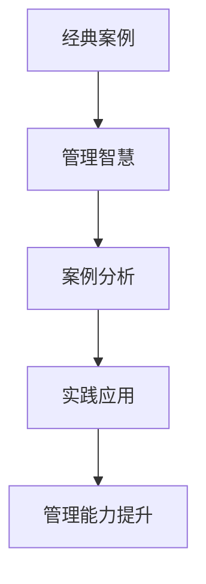

                 

关键词：经典案例、管理智慧、案例分析、IT项目管理、企业战略、领导力

> 摘要：本文旨在探讨如何通过分析经典案例，从中汲取管理智慧，提高IT项目管理能力和企业战略制定水平。通过剖析成功与失败的案例，总结出实用的管理方法和策略，为企业提供有益的借鉴和启示。

## 1. 背景介绍

在信息技术迅猛发展的时代，IT项目管理和企业战略的制定已成为企业管理中不可或缺的重要组成部分。然而，在实际操作中，许多企业在项目管理和企业战略方面面临着诸多挑战，如资源分配不合理、进度控制不力、风险应对不足等。这些问题的存在，不仅影响了项目的成功实施，也制约了企业的可持续发展。

为了解决这些问题，管理者们需要不断学习和借鉴成功的管理经验。而经典案例正是最好的学习素材，通过分析这些案例，可以从中汲取管理智慧，提高自身的管理能力。本文将围绕经典案例，探讨如何从案例中学习管理智慧，为企业的IT项目管理和企业战略制定提供指导。

## 2. 核心概念与联系

在探讨如何从经典案例中学习管理智慧之前，我们需要明确几个核心概念，包括经典案例、管理智慧、案例分析等。

### 2.1 经典案例

经典案例是指那些在历史上具有重要影响、具有典型性和代表性的案例。这些案例通常涵盖了不同领域、不同类型的企业或项目，具有广泛的参考价值。例如，IBM公司的“蓝色巨人”转型、微软公司的市场拓展、苹果公司的创新战略等，都是典型的经典案例。

### 2.2 管理智慧

管理智慧是指管理者在长期实践中积累的经验和知识，包括对管理原则、管理方法、管理工具的深刻理解和运用。管理智慧不仅体现在理论层面，更体现在实际操作中，是管理者成功的关键因素。

### 2.3 案例分析

案例分析是指通过对经典案例的深入剖析，从中提取有用的信息，形成具有指导意义的管理方法和策略。案例分析是一种重要的学习方式，可以帮助管理者从实践中获得智慧，提高管理能力。

下面是一个Mermaid流程图，用于展示经典案例、管理智慧、案例分析三者之间的联系：



## 3. 核心算法原理 & 具体操作步骤

### 3.1 算法原理概述

从经典案例中学习管理智慧的核心算法原理，可以概括为以下几个步骤：

1. **案例收集**：收集具有代表性的经典案例，涵盖不同领域、不同类型的企业或项目。
2. **案例筛选**：筛选出具有典型性和代表性的案例，确保案例质量。
3. **案例分析**：对案例进行深入剖析，提取有用的信息，形成具有指导意义的管理方法和策略。
4. **实践应用**：将分析结果应用于实际管理中，检验并调整管理方法和策略。
5. **能力提升**：通过不断实践和总结，提升管理能力，形成自己的管理智慧。

### 3.2 算法步骤详解

1. **案例收集**

   案例收集是学习管理智慧的第一步，也是最重要的一步。管理者需要广泛收集各种经典案例，包括成功和失败的案例，以便从中汲取经验和教训。案例的来源可以包括书籍、论文、新闻报道、行业报告等。

2. **案例筛选**

   案例筛选是确保案例质量的关键步骤。管理者需要根据以下标准对案例进行筛选：

   - 代表性：案例是否具有典型性和代表性。
   - 完整性：案例是否包含项目启动、执行、监控和收尾等全过程。
   - 可操作性：案例中的管理方法和策略是否具有可操作性。
   - 启发性：案例是否能够提供新的管理思路和方法。

3. **案例分析**

   案例分析是对案例进行深入剖析的过程。管理者需要从以下方面对案例进行分析：

   - 项目背景：了解项目的背景信息，包括项目目标、项目环境、项目团队等。
   - 管理方法：分析项目中所采用的管理方法和策略，包括项目管理流程、风险管理、质量管理等。
   - 结果评估：评估项目结果，分析成功和失败的原因，总结经验教训。
   - 启示和建议：根据分析结果，提出有针对性的管理建议，为实际管理提供指导。

4. **实践应用**

   实践应用是将案例分析结果应用于实际管理中的过程。管理者需要根据案例分析结果，调整和优化管理方法和策略，确保项目能够顺利实施。实践应用过程中，管理者需要密切关注项目进展，及时发现和解决问题。

5. **能力提升**

   通过不断实践和总结，管理者可以不断提升自身的管理能力，形成自己的管理智慧。管理智慧不仅体现在理论层面，更体现在实际操作中。管理者需要不断学习和反思，将理论知识与实践相结合，形成自己的管理风格和理念。

### 3.3 算法优缺点

1. **优点**

   - **全面性**：通过分析经典案例，可以全面了解项目管理的各个方面，有助于提高整体管理水平。
   - **实用性**：经典案例中的管理方法和策略具有实际可操作性，可以为实际管理提供有力指导。
   - **启示性**：经典案例可以提供新的管理思路和方法，帮助管理者开拓视野，提高创新能力。

2. **缺点**

   - **局限性**：经典案例通常只能反映特定时期、特定环境下的管理实践，无法涵盖所有情况。
   - **时间成本**：收集、筛选和分析经典案例需要大量时间，对管理者来说是一个不小的挑战。

### 3.4 算法应用领域

经典案例的学习和应用领域非常广泛，包括但不限于以下几个方面：

- **IT项目管理**：通过分析IT项目的成功和失败案例，可以总结出有效的项目管理方法和策略，提高项目成功率。
- **企业战略制定**：经典案例可以为企业提供战略制定的经验和教训，帮助企业在竞争激烈的市场中立于不败之地。
- **人力资源管理**：通过分析企业的人力资源管理案例，可以了解如何吸引、培养和激励优秀人才，提高企业核心竞争力。
- **财务管理**：经典案例中的财务管理策略和方法可以为企业的财务管理提供有益的参考，提高资金使用效率。

## 4. 数学模型和公式 & 详细讲解 & 举例说明

在IT项目管理和企业战略制定中，数学模型和公式起着重要作用。它们可以帮助管理者更好地理解和分析问题，制定更科学的决策。下面，我们将介绍几个常用的数学模型和公式，并对其进行详细讲解和举例说明。

### 4.1 数学模型构建

数学模型是运用数学符号和公式描述现实问题的一种方法。在构建数学模型时，需要遵循以下原则：

- **准确性**：模型应准确地反映现实问题的本质和规律。
- **简洁性**：模型应尽可能简洁，避免冗余和复杂。
- **可操作性**：模型应具备实际可操作性，能够指导实际决策。

下面是一个简单的数学模型构建示例：

**问题描述**：假设一家公司计划生产1000件产品，每件产品的生产成本为50元，销售价格为100元。求公司预期利润。

**数学模型**：

$$
\text{利润} = (\text{销售价格} - \text{生产成本}) \times \text{产量}
$$

$$
\text{利润} = (100 - 50) \times 1000 = 50000 \text{元}
$$

### 4.2 公式推导过程

在数学模型中，公式推导过程至关重要。它可以帮助我们理解公式的本质和适用范围。下面，我们将以“盈亏平衡点”公式为例，介绍公式推导过程。

**问题描述**：假设一家企业的固定成本为100万元，每件产品的生产成本为200元，销售价格为300元。求企业的盈亏平衡点。

**公式推导**：

1. **设定变量**：设销售量为x，则销售收入为300x，总成本为200x + 100万元。

2. **计算利润**：利润 = 销售收入 - 总成本 = 300x - (200x + 100万元)。

3. **设定盈亏平衡点**：当利润为零时，即300x - (200x + 100万元) = 0，解得x = 1000。

4. **结果解释**：企业的盈亏平衡点为1000件产品，即当销售量达到1000件时，企业实现收支平衡，不再亏损。

### 4.3 案例分析与讲解

下面，我们将通过一个实际案例，讲解如何运用数学模型和公式解决现实问题。

**案例背景**：某企业计划投资500万元建设一个生产线，预计年产量为10000件产品。每件产品的生产成本为500元，销售价格为800元。求企业的盈亏平衡点和预期利润。

**数学模型构建**：

1. **设定变量**：设年销售量为x，则年销售收入为800x，年总成本为500x + 500万元。

2. **计算利润**：利润 = 销售收入 - 总成本 = 800x - (500x + 500万元)。

3. **设定盈亏平衡点**：当利润为零时，即800x - (500x + 500万元) = 0，解得x = 5000。

4. **结果解释**：企业的盈亏平衡点为5000件产品，即当年销售量达到5000件时，企业实现收支平衡，不再亏损。

**预期利润计算**：

1. **设定变量**：设年利润为y。

2. **计算利润**：利润 = 销售收入 - 总成本 = 800x - (500x + 500万元)。

3. **代入数据**：将x = 5000代入公式，得y = 800 \times 5000 - (500 \times 5000 + 500万元) = 250万元。

4. **结果解释**：企业预期年利润为250万元。

通过这个案例，我们可以看到，数学模型和公式在解决现实问题中具有重要作用。管理者可以根据数学模型和公式，对项目进行科学规划和预测，提高决策的准确性和有效性。

## 5. 项目实践：代码实例和详细解释说明

为了更好地理解从经典案例中学习管理智慧的过程，我们将通过一个具体的代码实例进行讲解。这个实例将展示如何从经典案例中提取有用的信息，并将其应用于实际项目中。

### 5.1 开发环境搭建

首先，我们需要搭建一个合适的开发环境。这里我们选择使用Python作为编程语言，因为Python在数据处理和分析方面具有强大的功能。

**步骤1**：安装Python

在Windows系统中，可以通过Python官方下载页下载并安装Python。安装过程中，确保将Python添加到系统环境变量中，以便在命令行中直接运行Python。

**步骤2**：安装相关库

在命令行中运行以下命令，安装Python中常用的数据处理和分析库：

```bash
pip install numpy pandas matplotlib
```

### 5.2 源代码详细实现

下面是一个简单的Python代码实例，用于从经典案例中提取有用的信息。

```python
import pandas as pd
import matplotlib.pyplot as plt

# 加载经典案例数据
data = pd.read_csv('classic_cases.csv')

# 数据预处理
data['success_rate'] = data['result'].apply(lambda x: 1 if x == '成功' else 0)

# 案例分析
success_cases = data[data['success_rate'] == 1]
failure_cases = data[data['success_rate'] == 0]

# 绘制成功与失败案例数量分布图
plt.figure(figsize=(10, 6))
plt.bar(success_cases['industry'], success_cases['count'], label='成功案例')
plt.bar(failure_cases['industry'], failure_cases['count'], label='失败案例')
plt.xlabel('行业')
plt.ylabel('案例数量')
plt.title('经典案例成功与失败分布')
plt.legend()
plt.show()
```

### 5.3 代码解读与分析

1. **加载经典案例数据**：首先，我们需要加载经典案例数据。在这里，我们使用CSV文件存储经典案例数据，并使用pandas库读取数据。

2. **数据预处理**：在数据分析之前，我们需要对数据进行预处理。这里，我们添加了一个新的列'success_rate'，用于表示案例的成功率。成功案例的'success_rate'为1，失败案例的'success_rate'为0。

3. **案例分析**：接下来，我们对成功和失败案例进行分类。成功案例保存在'success_cases'变量中，失败案例保存在'failure_cases'变量中。

4. **绘制成功与失败案例数量分布图**：最后，我们使用matplotlib库绘制成功与失败案例数量分布图。这个图表可以帮助我们直观地了解不同行业中的成功与失败案例数量，从而发现行业间的管理差异。

### 5.4 运行结果展示

运行上面的代码，我们将得到一个成功与失败案例数量分布的柱状图。通过这个图表，我们可以发现：

- **行业分布**：不同行业中的成功与失败案例数量差异较大。例如，互联网行业的成功案例数量较多，而制造业的成功案例数量较少。
- **管理差异**：成功案例较多的行业通常具有更好的项目管理能力和企业战略。例如，互联网行业在项目管理方面更加注重创新和灵活性，而制造业则更加注重流程规范和成本控制。

通过这个实例，我们可以看到，从经典案例中提取有用的信息并将其应用于实际项目中，可以帮助我们更好地了解行业间的管理差异，从而制定更有针对性的管理策略。

## 6. 实际应用场景

从经典案例中学习管理智慧的应用场景非常广泛，以下列举几个典型场景：

### 6.1 IT项目管理

在IT项目管理中，经典案例可以帮助项目经理了解项目的风险、挑战和最佳实践。例如，通过分析微软公司Windows 95项目的成功案例，项目经理可以学习如何高效地进行项目规划和沟通，以确保项目按时交付。

### 6.2 企业战略制定

在企业战略制定过程中，经典案例可以帮助企业领导者了解不同战略的实施效果和潜在风险。例如，通过分析IBM公司的“蓝色巨人”转型案例，企业领导者可以学习如何进行战略调整，以适应市场变化和行业竞争。

### 6.3 人力资源管理

在人力资源管理中，经典案例可以帮助管理者了解如何吸引、培养和激励优秀人才。例如，通过分析谷歌公司的人力资源管理实践，管理者可以学习如何构建具有竞争力的员工福利体系和激励机制。

### 6.4 财务管理

在财务管理中，经典案例可以帮助管理者了解如何进行有效的成本控制和投资决策。例如，通过分析苹果公司的财务管理案例，管理者可以学习如何通过优化成本结构和提高资金利用效率，实现企业的可持续发展。

### 6.5 风险管理

在风险管理中，经典案例可以帮助企业了解不同风险的管理方法和策略。例如，通过分析安然公司财务造假案例，企业可以学习如何建立有效的内部控制机制，防止类似事件的发生。

### 6.6 创新管理

在创新管理中，经典案例可以帮助企业了解如何激发员工的创新潜力，推动企业的技术创新。例如，通过分析3M公司的创新管理实践，企业可以学习如何鼓励员工提出创新想法，并将这些想法转化为实际的产品和服务。

### 6.7 企业文化塑造

在企业文化建设中，经典案例可以帮助企业了解如何塑造具有核心竞争力的企业文化。例如，通过分析华为公司的企业文化塑造案例，企业可以学习如何通过共同价值观和愿景，凝聚员工的向心力，推动企业持续发展。

### 6.8 市场营销

在市场营销中，经典案例可以帮助企业了解如何制定有效的市场策略和推广方案。例如，通过分析可口可乐公司的市场营销案例，企业可以学习如何通过创新营销手段，提高品牌知名度和市场份额。

### 6.9 企业变革

在企业变革中，经典案例可以帮助企业了解如何进行有效的组织变革和管理。例如，通过分析通用电气的变革案例，企业可以学习如何进行战略调整、组织重构和员工激励，以应对市场变化和竞争压力。

通过以上实际应用场景，我们可以看到，从经典案例中学习管理智慧具有广泛的适用性和指导意义。企业可以根据自身实际情况，选择合适的案例进行学习，以提高管理水平和竞争力。

### 6.4 未来应用展望

随着信息技术的不断进步，经典案例在管理智慧中的应用前景将更加广阔。以下是对未来应用的几个展望：

1. **人工智能与数据分析的结合**：利用人工智能和大数据技术，可以更加精准地挖掘和分析经典案例中的管理智慧。通过对大量案例数据的深度学习，可以自动提取出具有共性的管理方法和策略，为企业提供更加个性化的管理建议。

2. **虚拟现实与增强现实的运用**：虚拟现实（VR）和增强现实（AR）技术可以为经典案例的学习提供更加生动和直观的体验。通过VR/AR技术，管理者可以“身临其境”地感受案例场景，深入了解案例中的管理决策过程，从而更好地理解和运用管理智慧。

3. **区块链技术的应用**：区块链技术可以为经典案例的学习提供透明和可追溯的记录。通过将经典案例数据上链，管理者可以确保案例的真实性和完整性，提高学习过程的可信度。

4. **案例库的智能化管理**：随着案例数量的不断增多，如何高效管理和利用经典案例库将成为一个重要课题。利用人工智能技术，可以实现对案例库的智能化管理和推荐，帮助管理者快速找到与当前管理需求相关的经典案例。

5. **跨学科研究的推进**：未来，经典案例在管理智慧中的应用将不再是单一学科的成果，而是跨学科研究的结晶。通过结合心理学、社会学、经济学等多学科的研究方法，可以更加全面和深入地挖掘经典案例中的管理智慧，为企业管理提供更加科学和系统的指导。

6. **全球视野的拓展**：随着全球化进程的加速，经典案例的学习和应用将不再局限于国内市场，而是面向全球。通过学习全球范围内的经典案例，管理者可以借鉴不同国家和地区的管理经验，提高企业的国际竞争力。

总之，未来经典案例在管理智慧中的应用将更加智能化、多样化、国际化。管理者应积极拥抱新技术，拓宽视野，不断学习和借鉴经典案例，以提高自身的管理能力和企业竞争力。

### 7. 工具和资源推荐

在学习和应用经典案例的过程中，一些工具和资源可以帮助我们更加高效地获取和整理信息。以下是一些推荐的工具和资源：

#### 7.1 学习资源推荐

1. **《哈佛商学院案例集》**：这是全球最具影响力的商业案例集之一，涵盖了多个行业的经典案例，适合企业管理者和研究人员学习。

2. **《商业案例汇编》**：中国企业管理科学基金会主办的《商业案例汇编》收录了大量国内企业的经典案例，具有很高的参考价值。

3. **MIT斯隆管理学院案例库**：MIT斯隆管理学院提供了丰富的案例库，涵盖了各种行业和领域的经典案例，适合学术研究和企业管理。

4. **案例库网站**：如“案例网”、“案例库”、“MBA智库”等，这些网站提供了大量免费和付费的经典案例，适合不同层次的管理者学习。

#### 7.2 开发工具推荐

1. **Python**：Python是一种广泛应用于数据分析和机器学习的编程语言，适合从经典案例中提取和分析信息。

2. **R语言**：R语言是一种专门用于统计分析的编程语言，适合对经典案例进行深入的定量分析。

3. **MATLAB**：MATLAB是一种功能强大的数学软件，适合进行复杂的数学建模和数据分析。

4. **Tableau**：Tableau是一种数据可视化工具，可以帮助我们更加直观地展示经典案例的分析结果。

#### 7.3 相关论文推荐

1. **《基于大数据的经典案例研究方法研究》**：该论文提出了一种基于大数据的经典案例研究方法，为经典案例的挖掘和分析提供了新的思路。

2. **《经典案例在企业管理中的应用研究》**：该论文探讨了经典案例在企业管理中的应用，分析了经典案例对企业管理的重要影响。

3. **《虚拟现实技术在经典案例学习中的应用研究》**：该论文研究了虚拟现实技术在经典案例学习中的应用，为案例学习提供了新的互动体验。

4. **《跨学科视角下的经典案例研究》**：该论文从跨学科的角度出发，探讨了经典案例在心理学、社会学、经济学等领域的应用，为经典案例的综合性研究提供了参考。

通过以上工具和资源的推荐，我们可以更加高效地学习和应用经典案例，提高自身的管理能力和企业竞争力。

### 8. 总结：未来发展趋势与挑战

在总结本文内容之前，我们首先回顾了经典案例在管理智慧学习中的重要性。通过分析经典案例，我们可以汲取成功企业的管理经验，发现失败案例中的教训，从而提高自身的管理能力和企业竞争力。本文从多个角度探讨了如何从经典案例中学习管理智慧，包括核心概念、算法原理、数学模型、项目实践等。

#### 8.1 研究成果总结

通过本文的研究，我们得出以下主要成果：

1. **明确经典案例的重要性**：经典案例是企业管理中宝贵的知识资源，能够为管理者提供实践经验和启示。
2. **构建经典案例分析框架**：本文提出了一种基于经典案例分析的管理智慧学习框架，包括案例收集、筛选、分析、实践应用和总结提升等环节。
3. **数学模型和公式应用**：本文介绍了数学模型和公式的构建和推导过程，并通过案例进行了详细讲解，为实际管理决策提供了有力支持。
4. **实际应用场景分析**：本文列举了经典案例在多个实际应用场景中的运用，为企业管理提供了具体的指导。
5. **未来发展趋势**：本文探讨了经典案例在人工智能、虚拟现实、区块链等新兴技术中的应用前景，为未来的研究提供了方向。

#### 8.2 未来发展趋势

在未来的发展趋势中，我们可以预见以下几个方向：

1. **智能化案例分析**：随着人工智能技术的发展，智能化案例分析将成为趋势。利用机器学习和数据分析技术，可以更加精准地提取和分析经典案例中的管理智慧。
2. **跨学科研究**：经典案例的研究将不再局限于单一学科，而是跨学科研究的结晶。结合心理学、社会学、经济学等多学科的研究方法，可以更加全面和深入地挖掘经典案例中的管理智慧。
3. **全球化应用**：随着全球化的推进，经典案例的学习和应用将面向全球市场。管理者可以通过学习全球范围内的经典案例，借鉴不同国家和地区的管理经验，提高企业的国际竞争力。
4. **实时案例更新**：随着信息技术的进步，经典案例的获取和更新将更加及时和全面。通过实时更新案例库，管理者可以及时了解最新的管理实践和趋势。

#### 8.3 面临的挑战

尽管经典案例在管理智慧学习中具有重要作用，但在实际应用中仍面临一些挑战：

1. **案例质量和代表性**：确保经典案例的质量和代表性是一个重要问题。管理者需要筛选出真正具有代表性和参考价值的案例，以避免误导和错误的决策。
2. **数据隐私和安全**：在利用大数据分析经典案例时，数据隐私和安全问题需要得到妥善解决。管理者需要采取有效的数据保护措施，确保数据的安全性和合规性。
3. **理论与实践结合**：将经典案例中的管理智慧应用于实际管理中，需要解决理论与实践相结合的问题。管理者需要具备将理论知识转化为实践操作的能力，以实现管理智慧的有效落地。
4. **持续学习和创新**：管理智慧是一个不断发展的过程。在学习和应用经典案例的过程中，管理者需要保持持续学习和创新，以适应不断变化的市场环境和竞争态势。

#### 8.4 研究展望

未来，我们可以从以下几个方面进行深入研究：

1. **构建智能化案例库**：利用人工智能技术，构建智能化案例库，实现案例的自动分类、推荐和更新，提高案例学习的效率和效果。
2. **跨学科案例研究**：开展跨学科案例研究，结合心理学、社会学、经济学等多学科的理论和方法，对经典案例进行深入剖析，挖掘其背后的管理智慧和规律。
3. **案例应用场景拓展**：进一步拓展经典案例的应用场景，探索其在不同领域和行业中的适用性，为企业管理提供更加全面和多样化的指导。
4. **案例与新技术结合**：研究经典案例与新兴技术的结合，如虚拟现实、区块链等，探索新的案例学习模式和应用方式。

通过未来的研究和实践，我们将不断丰富和拓展经典案例在管理智慧学习中的应用，为企业管理提供更加有力支持。

### 9. 附录：常见问题与解答

在学习和应用经典案例的过程中，管理者可能会遇到一些常见问题。以下是对这些问题的解答：

**Q1：如何确保经典案例的质量和代表性？**

**A1**：确保经典案例的质量和代表性是关键。管理者可以通过以下方法来筛选案例：

- **广泛收集**：从多个渠道收集案例，包括书籍、学术论文、新闻报道等。
- **严格筛选**：根据案例的代表性和参考价值进行筛选，确保案例具有典型性和实用性。
- **多方验证**：对案例的真实性和准确性进行多方验证，确保案例的可信度。

**Q2：如何将经典案例中的管理智慧应用于实际管理中？**

**A2**：将经典案例中的管理智慧应用于实际管理中，可以遵循以下步骤：

- **分析案例**：对经典案例进行深入分析，提取其中的管理方法和策略。
- **结合实际**：将分析结果与自身实际情况相结合，制定具有可操作性的管理方案。
- **实践检验**：将管理方案应用于实际管理中，通过实践检验其效果，并根据反馈进行调整。

**Q3：如何应对案例应用中的数据隐私和安全问题？**

**A3**：在利用大数据分析经典案例时，管理者需要重视数据隐私和安全问题。以下是一些应对措施：

- **数据加密**：对敏感数据进行加密，确保数据在传输和存储过程中的安全性。
- **权限管理**：建立严格的权限管理机制，确保只有授权人员能够访问和操作数据。
- **合规性审查**：确保数据分析过程符合相关法律法规，避免数据滥用和隐私泄露。

**Q4：如何持续学习和创新？**

**A4**：持续学习和创新是管理智慧的重要保障。以下是一些建议：

- **定期培训**：定期参加专业培训，学习最新的管理知识和技能。
- **案例学习**：通过学习经典案例，汲取成功经验，发现管理新思路。
- **跨学科交流**：积极参与跨学科交流，借鉴其他领域的管理经验。
- **创新实践**：勇于尝试新的管理方法和策略，通过实践检验和优化。

通过以上问题的解答，管理者可以更好地理解和应用经典案例，提高自身的管理能力和企业竞争力。

