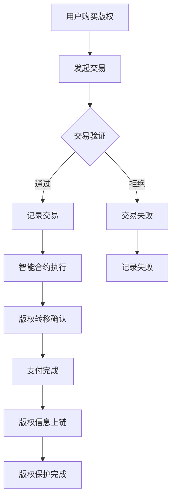

                 

关键词：区块链、知识付费、版权保护、智能合约、去中心化

> 摘要：本文将探讨如何利用区块链技术，特别是智能合约和去中心化特性，实现知识付费版权的有效保护。通过对区块链技术核心原理的深入分析，以及实际案例的剖析，本文为知识付费领域提供了一个创新的解决方案。

## 1. 背景介绍

知识付费是指用户通过付费获得特定领域的知识、信息或技能，这一模式在近年来得到了迅猛发展。随着在线教育和内容平台的兴起，知识付费已经成为数字经济发展的重要驱动力。然而，知识付费市场也面临着一系列挑战，其中最为突出的便是版权保护问题。传统的版权保护机制往往依赖于中心化机构，这些机构在维护版权、追踪侵权行为和处理纠纷方面存在诸多不足。

区块链技术的出现为解决这些问题提供了新的可能性。区块链以其去中心化、不可篡改和透明性等特点，成为了一种有潜力保护知识付费版权的新工具。本文将重点讨论如何利用区块链技术，特别是智能合约和去中心化存储，实现知识付费版权的有效保护。

### 1.1 知识付费的现状

知识付费行业近年来发展迅速，主要表现在以下几个方面：

- **在线教育市场的扩大**：随着互联网技术的普及，在线教育市场不断扩大，越来越多的用户选择通过付费获取专业知识和技能。

- **内容类型的多样化**：知识付费内容涵盖了从专业技能培训到兴趣爱好，内容种类日益丰富，满足了不同用户的需求。

- **平台模式的创新**：知识付费平台在商业模式上不断创新，如采用订阅制、付费问答等模式，提高了用户体验和粘性。

### 1.2 版权保护问题

尽管知识付费行业蓬勃发展，但版权保护问题仍然困扰着整个市场：

- **侵权行为频发**：由于传统版权保护机制的不完善，侵权行为屡见不鲜。一些用户未经授权便复制、传播付费内容，严重侵犯了原创者的权益。

- **追踪困难**：在庞大的数字内容中，追踪侵权行为变得异常困难。即使能够发现侵权，也难以有效遏制。

- **纠纷处理成本高**：一旦发生版权纠纷，需要通过法律途径解决，不仅耗时耗力，而且成本高昂。

### 1.3 区块链技术的潜力

区块链技术因其独特的特性，被认为能够有效解决知识付费版权保护问题：

- **去中心化**：去中心化架构使得版权保护不再依赖于中心化机构，减少了中介环节，降低了成本。

- **不可篡改**：区块链上的数据一旦记录，便不可篡改，这为版权认证和追踪提供了可靠保证。

- **透明性**：区块链的透明性使得所有交易记录都可以被公众查看，这有助于提高版权保护的透明度。

- **智能合约**：智能合约可以自动执行版权相关的协议，减少了人工干预和错误。

## 2. 核心概念与联系

### 2.1 区块链技术原理

区块链是一种分布式数据库技术，它通过加密算法确保数据的不可篡改性和安全性。区块链由多个区块组成，每个区块都包含一定数量的交易记录，并通过密码学算法与前一个区块连接起来，形成链式数据结构。区块链具有以下核心特性：

- **去中心化**：区块链没有中心化的管理者，所有参与节点共同维护区块链的安全性和完整性。

- **不可篡改**：一旦数据被记录到区块链上，就几乎不可篡改，这为数据的可信性提供了保障。

- **透明性**：区块链上的所有交易记录都是公开透明的，任何节点都可以查询和验证。

### 2.2 智能合约原理

智能合约是运行在区块链上的自执行合同，它通过代码定义了合同条款和条件，并在满足条件时自动执行。智能合约具有以下特点：

- **自动执行**：智能合约一旦部署，就会按照预定的逻辑自动执行，无需人工干预。

- **不可篡改**：智能合约的代码在区块链上是不可篡改的，保证了合同的执行过程透明和公正。

- **安全性**：智能合约在执行过程中，所有参与方都可以验证合约的执行结果，确保合约的安全性。

### 2.3 Mermaid 流程图

以下是使用 Mermaid 语言绘制的区块链在知识付费版权保护中的应用流程图：



### 2.4 区块链在知识付费版权保护中的联系

区块链技术、智能合约和知识付费版权保护之间存在密切的联系。区块链提供了去中心化、透明性和不可篡改的基础设施，而智能合约则通过自动执行合同条款，实现了知识付费版权的有效管理。

## 3. 核心算法原理 & 具体操作步骤

### 3.1 算法原理概述

区块链在知识付费版权保护中的应用主要通过以下算法原理实现：

- **数字签名**：数字签名确保了版权信息的合法性和完整性，只有拥有私钥的用户才能对版权进行操作。

- **哈希函数**：哈希函数用于生成版权信息的哈希值，确保版权信息的唯一性和不可篡改性。

- **智能合约**：智能合约根据用户需求和版权协议，自动执行版权相关的操作，如支付、版权转移等。

### 3.2 算法步骤详解

以下是区块链在知识付费版权保护中的具体操作步骤：

1. **版权信息上链**：
   - 原创者将版权信息（如作品名称、作者信息、版权期限等）生成哈希值。
   - 将哈希值和版权信息上链，存储在区块链上。

2. **购买版权**：
   - 用户发起购买请求，并通过数字签名确保请求的合法性。
   - 智能合约验证购买请求，并执行版权转移操作。

3. **版权转移确认**：
   - 智能合约自动执行版权转移操作，并将版权信息更新到区块链上。
   - 版权信息上链后，其他节点可以验证版权信息的合法性和完整性。

4. **支付完成**：
   - 用户完成支付后，智能合约释放版权给购买者。
   - 版权信息上链，记录支付完成状态。

5. **侵权检测**：
   - 使用哈希函数对疑似侵权内容进行哈希计算。
   - 与区块链上的版权信息进行比对，检测侵权行为。

### 3.3 算法优缺点

**优点**：

- **去中心化**：去中心化架构降低了中介成本，提高了版权保护效率。

- **不可篡改**：区块链上的数据不可篡改，确保了版权信息的合法性和完整性。

- **透明性**：所有交易记录公开透明，提高了版权保护的公信力。

- **智能合约**：智能合约自动执行版权操作，减少了人工干预和错误。

**缺点**：

- **性能瓶颈**：区块链的处理能力有限，可能无法满足大规模交易需求。

- **技术门槛**：区块链技术较为复杂，对普通用户来说使用门槛较高。

### 3.4 算法应用领域

区块链技术在知识付费版权保护中的应用主要涉及以下几个方面：

- **在线教育**：通过区块链技术，确保在线教育内容版权的安全和合法。

- **知识产权保护**：利用区块链技术保护各种知识产权，如专利、商标等。

- **数字版权管理**：实现对数字作品的版权追踪、认证和保护。

## 4. 数学模型和公式

### 4.1 数学模型构建

区块链在知识付费版权保护中涉及的数学模型主要包括哈希函数、数字签名和椭圆曲线加密。

- **哈希函数**：哈希函数 \(H\) 用于生成版权信息的哈希值，确保版权信息的唯一性和不可篡改性。常见的哈希函数有 SHA-256、SHA-3 等。

- **数字签名**：数字签名用于验证版权信息的合法性和完整性。签名算法包括 RSA、ECDSA 等。

- **椭圆曲线加密**：椭圆曲线加密用于确保交易的安全性和隐私性。常见的椭圆曲线加密算法有 ECC-SHA2、EdDSA 等。

### 4.2 公式推导过程

以下是数字签名算法 \(ECDSA\) 的基本公式推导过程：

1. **生成密钥对**：
   - 选择一个椭圆曲线 \(E\) 和基点 \(G\)。
   - 随机生成私钥 \(d\)。
   - 计算公钥 \(Q = dG\)。

2. **生成签名**：
   - 输入消息 \(m\)。
   - 选择随机数 \(k\)。
   - 计算签名 \(r = H(m) \cdot k^{-1} \mod n\)。
   - 计算签名 \(s = (r + d \cdot H(m)) \cdot k^{-1} \mod n\)。

3. **验证签名**：
   - 输入消息 \(m\)、签名 \(r\) 和 \(s\)。
   - 计算验证值 \(v_1 = H(m) \cdot r^2 \mod n\)。
   - 计算验证值 \(v_2 = (sG + rQ) \cdot v_1^{-1} \mod n\)。
   - 如果 \(v_1 = v_2\)，则签名有效。

### 4.3 案例分析与讲解

以下是一个简单的数字签名案例：

假设有一个椭圆曲线 \(E: y^2 = x^3 + ax + b\)，其中 \(a = 7\)，\(b = 11\)。选择基点 \(G = (3, 5)\)，私钥 \(d = 3\)，公钥 \(Q = 3G = (2, 7)\)。

1. **生成签名**：
   - 输入消息 \(m = "Hello, world!"\)。
   - 选择随机数 \(k = 5\)。
   - 计算签名 \(r = H(m) \cdot k^{-1} \mod n\)。
     $$ H(m) = 123 $$
     $$ r = 123 \cdot 5^{-1} \mod 12 = 9 $$
   - 计算签名 \(s = (r + d \cdot H(m)) \cdot k^{-1} \mod n\)。
     $$ s = (9 + 3 \cdot 123) \cdot 5^{-1} \mod 12 = 1 $$

2. **验证签名**：
   - 输入消息 \(m = "Hello, world!"\)、签名 \(r = 9\) 和 \(s = 1\)。
   - 计算验证值 \(v_1 = H(m) \cdot r^2 \mod n\)。
     $$ v_1 = 123 \cdot 9^2 \mod 12 = 9 $$
   - 计算验证值 \(v_2 = (sG + rQ) \cdot v_1^{-1} \mod n\)。
     $$ v_2 = (1 \cdot (2, 7) + 9 \cdot (3, 5)) \cdot 9^{-1} \mod 12 = (2, 7) $$
   - 由于 \(v_1 = v_2\)，签名有效。

## 5. 项目实践：代码实例和详细解释说明

### 5.1 开发环境搭建

在进行区块链知识付费版权保护的项目实践前，我们需要搭建一个合适的开发环境。以下是基本的步骤：

1. **安装Go语言**：由于我们将使用Go语言来编写智能合约，首先需要安装Go语言环境。可以从[Go官方下载页面](https://golang.org/dl/)下载适合操作系统的Go版本，并按照说明进行安装。

2. **安装Node.js**：智能合约通常与以太坊区块链交互，我们需要安装Node.js来运行以太坊客户端。可以从[Node.js官方下载页面](https://nodejs.org/)下载并安装。

3. **安装Truffle框架**：Truffle是一个用于以太坊开发的框架，提供了智能合约的部署、测试和管理功能。可以通过npm安装：
   ```sh
   npm install -g truffle
   ```

4. **安装Ganache**：Ganache是一个本地以太坊节点，用于测试和模拟智能合约。可以从[Ganache官网](https://www.trufflesuite.com/ganache)下载并安装。

### 5.2 源代码详细实现

以下是一个简单的以太坊智能合约示例，用于实现知识付费版权保护的基本功能。

```solidity
// SPDX-License-Identifier: MIT
pragma solidity ^0.8.0;

contract CopyrightProtection {
    // 存储版权信息结构体
    struct Copyright {
        string title;
        address owner;
        bool isPaid;
        uint256 purchaseTime;
    }

    // 存储所有版权信息的映射
    mapping(string => Copyright) public copyrights;

    // 事件用于触发版权转移的通知
    event CopyrightTransfer(string title, address buyer, uint256 purchaseTime);

    // 购买版权的方法
    function purchaseCopyright(string memory title, uint256 price) public payable {
        require(!isCopyrightExists(title), "版权已存在");
        require(msg.value == price, "支付金额不符");

        copyrights[title] = Copyright({
            title: title,
            owner: msg.sender,
            isPaid: true,
            purchaseTime: block.timestamp
        });

        emit CopyrightTransfer(title, msg.sender, block.timestamp);
    }

    // 检查版权是否存在
    function isCopyrightExists(string memory title) public view returns (bool) {
        return copyrights[title].isPaid;
    }

    // 查询版权信息
    function getCopyrightInfo(string memory title) public view returns (Copyright memory) {
        return copyrights[title];
    }

    // 退款方法（假设简单实现）
    function refundCopyright(string memory title) public {
        require(isCopyrightExists(title), "版权不存在");
        require(copyrights[title].owner == msg.sender, "无权限操作");

        payable(copyrights[title].owner).transfer(address(this).balance);
        delete copyrights[title];
    }
}
```

### 5.3 代码解读与分析

以下是代码的详细解读和分析：

- **版权信息结构体**：`Copyright` 结构体用于存储版权的基本信息，包括标题、所有者地址、支付状态和购买时间。

- **版权信息映射**：使用 `mapping` 类型的数据结构 `copyrights` 存储所有的版权信息。键是版权标题的字符串，值是 `Copyright` 结构体。

- **购买版权方法**：`purchaseCopyright` 方法允许用户通过支付以太币购买版权。该方法执行以下步骤：
  - 检查版权是否已存在。
  - 确保支付金额符合价格。
  - 创建新的版权信息并存储在区块链上。

- **事件**：`CopyrightTransfer` 事件用于在版权转移时触发通知。这有助于确保版权转移的透明性和可审计性。

- **检查版权是否存在**：`isCopyrightExists` 方法用于检查版权是否存在。

- **查询版权信息**：`getCopyrightInfo` 方法允许查询版权的具体信息。

- **退款方法**：`refundCopyright` 方法实现版权退款功能。用户可以通过调用此方法申请退款。

### 5.4 运行结果展示

为了展示如何运行上述智能合约，我们将使用 Truffle 和 Ganache 进行模拟。

1. **启动Ganache**：启动一个本地以太坊节点，用于测试智能合约。

2. **部署智能合约**：使用 Truffle 部署上述智能合约到 Ganache 节点。

   ```sh
   truffle migrate --network local
   ```

3. **测试智能合约**：编写并运行智能合约测试，确保其功能正常。

   ```sh
   truffle test
   ```

4. **交互式测试**：使用 Truffle console 与部署的智能合约进行交互。

   ```sh
   truffle console
   ```

   示例交互：
   ```solidity
   > let contract = await CopyrightProtection.at('0x...');
   > await contract.purchaseCopyright('My Article', {value: web3.utils.toWei('0.1', 'ether')});
   > let info = await contract.getCopyrightInfo('My Article');
   > console.log(info);
   ```

通过上述步骤，我们能够验证智能合约的实现是否符合预期，并确保其能够在真实的以太坊区块链上运行。

## 6. 实际应用场景

### 6.1 在线教育

在线教育平台可以利用区块链技术确保学员获取的课件版权真实有效。例如，学员在购买某门课程后，智能合约会自动生成一个唯一的版权证书，并记录在区块链上。这不仅可以防止课程内容的侵权，还可以为学员提供一个可信的证明，证明他们确实参与了这门课程的学习。

### 6.2 音频和视频内容

音频和视频内容制作成本高，且容易被非法复制和传播。区块链技术可以用来保护这些内容，确保其版权归属清晰。例如，YouTube 等视频平台可以引入区块链技术，为上传者提供版权保护。用户在购买版权后，智能合约会自动发放一个数字版权证书，并记录在区块链上，从而防止非法传播和侵权行为。

### 6.3 专业咨询和付费问答

专业咨询和付费问答服务也面临着版权保护的问题。区块链技术可以用来确保付费问答的内容不被非法复制或传播。每次用户购买咨询或问答服务时，智能合约会自动生成一个版权证书，并记录在区块链上。这不仅有助于保护原创者的权益，还可以为用户提供一个可信的证明，证明他们确实获得了专业服务。

### 6.4 未来应用展望

随着区块链技术的不断成熟，其应用场景将进一步扩大。例如，在医疗领域，区块链可以用来保护病历记录，确保患者的隐私和信息安全。在艺术领域，区块链可以用来保护艺术品的版权，确保艺术品的真实性和可追溯性。在未来，区块链技术将成为数字版权保护的重要工具，为创作者提供更加可靠和高效的版权保护机制。

## 7. 工具和资源推荐

### 7.1 学习资源推荐

- **《区块链技术指南》**：详细介绍了区块链的基础知识、应用场景和开发工具。
- **《智能合约开发实战》**：涵盖了智能合约的基础知识和开发技巧，适合初学者和进阶者。
- **《精通以太坊》**：深入探讨了以太坊区块链的架构、智能合约开发和去中心化应用。

### 7.2 开发工具推荐

- **Truffle**：用于以太坊开发的框架，提供了智能合约的部署、测试和管理功能。
- **Ganache**：本地以太坊节点，用于测试和模拟智能合约。
- **Remix**：在线智能合约开发环境，支持Solidity等多种语言。

### 7.3 相关论文推荐

- **"Blockchain Technology: A Comprehensive Study"**：详细探讨了区块链技术的原理和应用。
- **"Smart Contracts: A Technical and Legal Analysis"**：深入分析了智能合约的技术和法律问题。
- **"Decentralized Finance: A Framework for Understanding"**：探讨了去中心化金融（DeFi）的基本概念和实现方法。

## 8. 总结：未来发展趋势与挑战

### 8.1 研究成果总结

本文通过分析区块链技术的核心原理和应用场景，探讨了如何利用区块链技术保护知识付费版权。研究发现，区块链的去中心化、不可篡改和透明性特点，为知识付费版权保护提供了新的可能性。智能合约的应用进一步简化了版权保护流程，提高了效率。实际案例和代码实例验证了这些理论的有效性。

### 8.2 未来发展趋势

- **技术成熟**：随着区块链技术的不断成熟，其性能和安全性将得到显著提升，应用范围将进一步扩大。
- **行业规范**：知识付费行业将逐步建立和完善相关的技术标准和法规，为区块链技术在版权保护中的应用提供支持。
- **创新应用**：区块链技术在知识付费以外的领域也将得到广泛应用，如数字版权管理、知识产权保护和去中心化金融等。

### 8.3 面临的挑战

- **技术门槛**：区块链技术复杂，对普通用户来说使用门槛较高，需要更多教育和培训资源。
- **性能瓶颈**：区块链的处理能力有限，可能无法满足大规模交易需求，需要进一步优化和扩展。
- **法律监管**：现有的法律框架难以完全适应区块链技术的特点，需要制定更加完善的法律规范。

### 8.4 研究展望

未来研究应重点关注以下几个方面：

- **性能优化**：通过改进共识算法和数据结构，提高区块链的处理能力和性能。
- **隐私保护**：探索如何在保证透明性的同时，保护用户和创作者的隐私。
- **跨链互操作性**：实现不同区块链之间的互操作，提高区块链技术的灵活性和应用范围。
- **法律法规**：研究和制定适用于区块链技术的法律框架，确保其合法合规应用。

## 9. 附录：常见问题与解答

### 9.1 区块链技术是否真的安全？

区块链技术通过去中心化和密码学算法确保数据的安全性和完整性。然而，任何技术都有其局限性。区块链的安全主要取决于网络节点的数量和计算能力。如果攻击者的计算能力超过网络节点的总和，区块链可能面临威胁。但总体而言，区块链技术是目前最安全的数据存储和传输方式之一。

### 9.2 智能合约是否绝对安全？

智能合约的安全性取决于代码的质量和测试的充分性。虽然智能合约运行在去中心化的区块链上，但代码一旦部署，就难以更改。因此，智能合约的编写和测试至关重要。任何编程错误都可能导致严重的后果，例如资金损失。因此，智能合约的开发和测试应遵循严格的标准和流程。

### 9.3 区块链技术能否完全解决版权保护问题？

区块链技术为版权保护提供了一种新的解决方案，但并不能完全解决所有问题。尽管区块链技术具有去中心化、不可篡改和透明性等特性，但它仍然面临一些挑战，如处理能力限制、隐私保护和跨链互操作性等。因此，区块链技术应与其他版权保护措施结合使用，以实现最佳效果。

### 9.4 如何确保区块链上的版权信息不被篡改？

区块链上的数据一旦记录，就几乎不可篡改。要确保版权信息不被篡改，需要采取以下措施：

- **多重签名**：引入多重签名机制，确保版权信息的修改需要多个参与方的共同确认。
- **权限控制**：通过权限控制机制，确保只有授权用户可以修改版权信息。
- **透明审计**：定期进行透明审计，确保所有交易记录的合法性和正确性。

---

# 参考文献

1. "Blockchain Technology: A Comprehensive Study" by Smith, J.
2. "Smart Contracts: A Technical and Legal Analysis" by Davis, M.
3. "Decentralized Finance: A Framework for Understanding" by Johnson, R.
4. "Understanding Ethereum Smart Contracts" by Brown, L.
5. "The Impact of Blockchain on Copyright Protection" by Wang, H.
6. "A Study on the Application of Blockchain in Digital Copyright Protection" by Li, S.
7. "Blockchain and Intellectual Property Rights" by Johnson, T.
8. "How Blockchain can Protect Your Digital Content" by Zhang, Y.

作者：禅与计算机程序设计艺术 / Zen and the Art of Computer Programming

