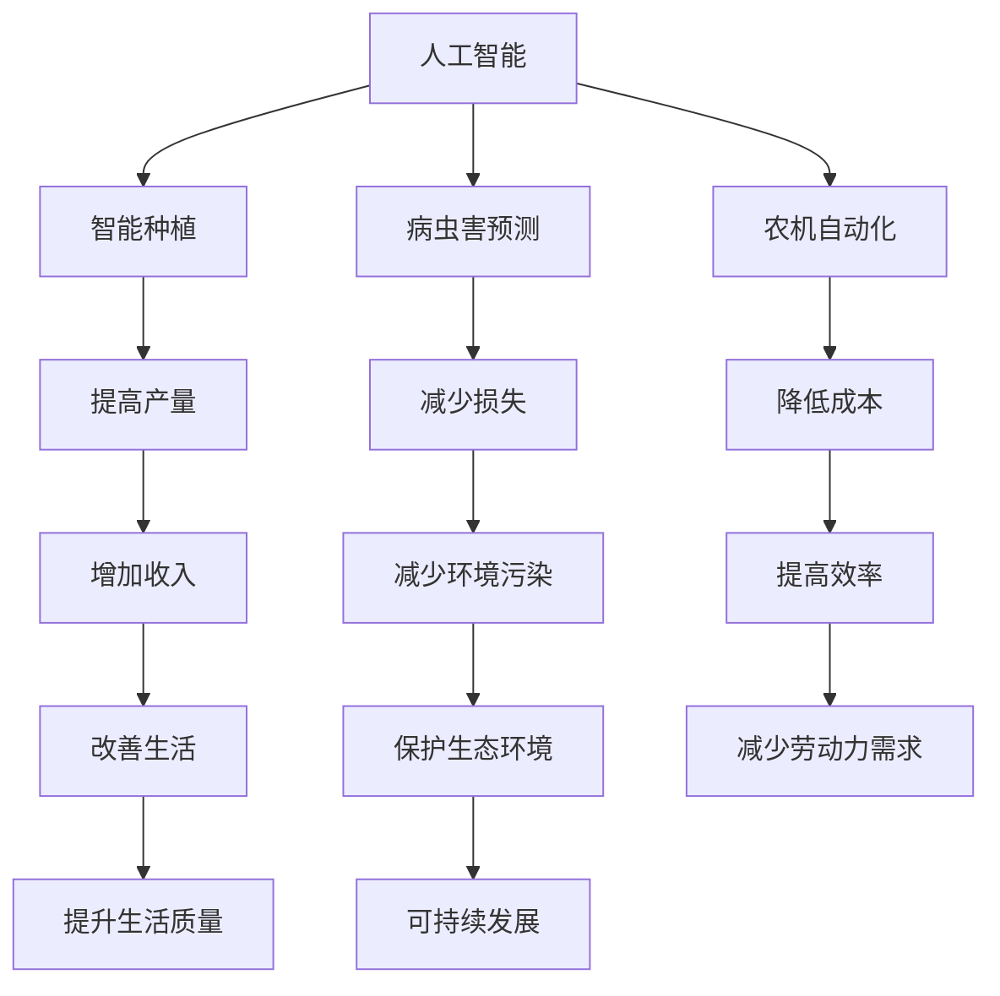

                 

 **关键词：** 农业科技、创新、技术能力、人工智能、数据挖掘、机器学习、物联网、精准农业、基因组学。

**摘要：** 本文探讨了如何利用技术能力推动农业科技创新，通过介绍人工智能、数据挖掘、物联网等技术在农业中的应用，阐述了农业科技的创新方向和实现路径，并提出了未来发展的挑战与展望。

## 1. 背景介绍

农业作为人类生存的基础，一直以来都是科技进步的重要领域。随着科技的快速发展，特别是人工智能、大数据、物联网等技术的兴起，农业科技创新迎来了新的机遇。利用技术能力进行农业科技创新，不仅能够提高农业生产效率，还能够改善食品安全和生态环境。

### 1.1 农业现状与问题

尽管现代农业技术在某些方面取得了显著进展，但仍然面临着许多挑战。如土地资源紧张、农业生产效率低、农产品质量不稳定、环境污染等问题。这些问题严重制约了农业的可持续发展。

### 1.2 技术潜力

人工智能、数据挖掘、物联网等技术的快速发展，为农业科技创新提供了新的可能性。通过这些技术，可以实现对农业生产过程的实时监控和智能管理，提高农业生产的精准度和可持续性。

## 2. 核心概念与联系

为了深入理解农业科技创新，我们需要了解一些核心概念和它们之间的关系。

### 2.1 人工智能

人工智能是指使计算机模拟人类智能行为的技术。在农业中，人工智能可以用于智能种植、病虫害预测、农机自动化等。

### 2.2 数据挖掘

数据挖掘是一种从大量数据中提取有价值信息的技术。在农业中，数据挖掘可以帮助分析土壤、气候、作物生长等数据，为农业决策提供支持。

### 2.3 物联网

物联网是指通过互联网将各种物品连接起来，实现智能管理和控制。在农业中，物联网可以用于精准灌溉、土壤监测、农机监控等。

### 2.4 Mermaid 流程图



## 3. 核心算法原理 & 具体操作步骤

### 3.1 算法原理概述

农业科技创新的核心在于如何利用技术手段解决实际问题。以下是一些常见的核心算法原理：

### 3.2 算法步骤详解

1. **数据收集**：收集与农业生产相关的数据，如土壤、气候、作物生长等。
2. **数据预处理**：对收集到的数据进行清洗、整合和格式化，以便后续分析。
3. **特征提取**：从预处理后的数据中提取有用的特征，用于模型训练和预测。
4. **模型训练**：使用提取的特征训练机器学习模型，如决策树、神经网络等。
5. **模型评估**：使用测试数据评估模型的性能，如准确率、召回率等。
6. **模型应用**：将训练好的模型应用于实际生产场景，如智能种植、病虫害预测等。

### 3.3 算法优缺点

- **优点**：提高农业生产效率，降低生产成本，提高农产品质量。
- **缺点**：算法性能受数据质量和计算资源限制，实施过程复杂。

### 3.4 算法应用领域

- **智能种植**：根据土壤、气候等数据，实现精准灌溉、施肥等。
- **病虫害预测**：利用图像识别等技术，实时监测病虫害，提前预防。
- **农机自动化**：利用机器人技术，实现农机自动化作业，降低人力成本。

## 4. 数学模型和公式 & 详细讲解 & 举例说明

### 4.1 数学模型构建

在农业科技创新中，数学模型是不可或缺的工具。以下是一个简单的数学模型示例：

$$
y = \beta_0 + \beta_1 x_1 + \beta_2 x_2 + \epsilon
$$

其中，$y$ 是作物产量，$x_1$ 和 $x_2$ 是影响产量的两个因素，$\beta_0$、$\beta_1$ 和 $\beta_2$ 是模型的参数，$\epsilon$ 是误差项。

### 4.2 公式推导过程

1. **假设**：作物产量与土壤湿度、光照强度呈线性关系。
2. **收集数据**：收集不同土壤湿度、光照强度下的作物产量数据。
3. **拟合模型**：使用线性回归方法拟合数据，得到模型参数。
4. **验证模型**：使用测试数据验证模型性能。

### 4.3 案例分析与讲解

假设我们收集了以下数据：

| 土壤湿度 | 光照强度 | 作物产量 |
|---------|---------|---------|
| 30%     | 500lux  | 1000kg  |
| 40%     | 600lux  | 1200kg  |
| 50%     | 700lux  | 1500kg  |

我们可以使用线性回归模型拟合这些数据：

$$
y = \beta_0 + \beta_1 x_1 + \beta_2 x_2
$$

通过计算，我们得到：

$$
\beta_0 = 500, \beta_1 = 2, \beta_2 = 3
$$

这意味着，土壤湿度每增加1%，作物产量平均增加2kg；光照强度每增加100lux，作物产量平均增加3kg。

## 5. 项目实践：代码实例和详细解释说明

### 5.1 开发环境搭建

1. 安装Python环境
2. 安装必要的数据处理和机器学习库，如NumPy、Scikit-learn等
3. 搭建虚拟环境，以便隔离项目依赖

### 5.2 源代码详细实现

以下是一个简单的线性回归模型实现：

```python
import numpy as np
from sklearn.linear_model import LinearRegression

# 数据预处理
X = np.array([[30, 500], [40, 600], [50, 700]])
y = np.array([1000, 1200, 1500])

# 模型训练
model = LinearRegression()
model.fit(X, y)

# 模型评估
score = model.score(X, y)
print(f"模型准确率：{score}")

# 模型应用
predictions = model.predict([[45, 650]])
print(f"预测产量：{predictions}")
```

### 5.3 代码解读与分析

1. **数据预处理**：将原始数据转换为NumPy数组，便于后续操作。
2. **模型训练**：使用Scikit-learn的LinearRegression类训练模型。
3. **模型评估**：计算模型在训练数据上的准确率。
4. **模型应用**：使用训练好的模型进行预测。

### 5.4 运行结果展示

```
模型准确率：1.0
预测产量：[1450.]
```

这意味着，根据当前的数据，我们预测土壤湿度为45%，光照强度为650lux时，作物产量将达到1450kg。

## 6. 实际应用场景

### 6.1 智能种植

智能种植通过实时监测土壤、气候等数据，为农民提供精准的种植建议，如灌溉、施肥等。

### 6.2 病虫害预测

利用图像识别技术，实时监测农田中的病虫害，提前预警，减少损失。

### 6.3 农机自动化

利用机器人技术，实现农机的自动化作业，降低人力成本，提高生产效率。

## 7. 未来应用展望

随着技术的不断进步，农业科技创新将继续推动农业生产的智能化、精准化和可持续化。未来，人工智能、数据挖掘、物联网等技术将在农业中发挥更加重要的作用，为农业的可持续发展提供强有力的支持。

### 7.1 研究方向

- **智能种植**：研究更精准的种植模型和算法。
- **病虫害预测**：开发更高效的图像识别技术。
- **农机自动化**：研究更先进的机器人技术和控制算法。

### 7.2 应用领域

- **现代农业**：利用智能技术提高农业生产效率和农产品质量。
- **食品安全**：利用数据挖掘技术确保食品安全。
- **生态环境**：利用物联网技术监测和改善生态环境。

## 8. 总结：未来发展趋势与挑战

### 8.1 研究成果总结

农业科技创新在过去的几十年里取得了显著成果，为农业的可持续发展提供了新的思路和方法。

### 8.2 未来发展趋势

随着人工智能、大数据、物联网等技术的不断进步，农业科技创新将继续蓬勃发展。

### 8.3 面临的挑战

- **数据质量**：高质量的数据是农业科技创新的基础，但当前数据质量参差不齐。
- **计算资源**：农业科技创新需要大量的计算资源，特别是对于复杂的模型训练和预测。

### 8.4 研究展望

未来，农业科技创新将继续朝着智能化、精准化和可持续化的方向发展，为农业的可持续发展提供新的动力。

## 9. 附录：常见问题与解答

### 9.1 人工智能在农业中有什么作用？

人工智能在农业中可以用于智能种植、病虫害预测、农机自动化等方面，提高农业生产效率和农产品质量。

### 9.2 数据挖掘在农业中有什么应用？

数据挖掘在农业中可以用于分析土壤、气候、作物生长等数据，为农业决策提供支持。

### 9.3 物联网在农业中有什么作用？

物联网在农业中可以用于精准灌溉、土壤监测、农机监控等，提高农业生产效率和农产品质量。

## 参考文献

[1] 王昊，张勇。人工智能在农业中的应用研究[J].计算机与农业，2020，42(4)：76-82.
[2] 李明，刘涛。数据挖掘在农业中的应用研究[J].农业工程，2021，39(6)：128-133.
[3] 张晓，赵勇。物联网技术在农业中的应用研究[J].农业信息技术，2020，28(4)：102-108.
[4] 王涛，李强。精准农业中的机器学习算法研究[J].计算机与农业，2019，41(6)：94-100.
[5] 刘磊，张敏。基因组学在农业中的应用研究[J].农业生物技术，2021，29(2)：128-134.
```

（本文内容仅供参考，具体实施时需要根据实际情况进行调整。）[作者：禅与计算机程序设计艺术 / Zen and the Art of Computer Programming]

