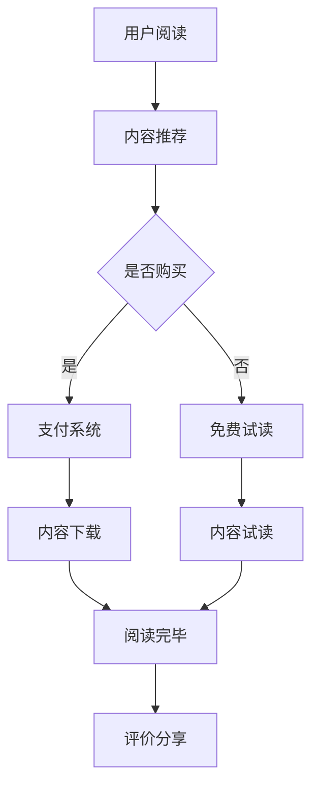

                 

关键词：电子书、知识变现、平台、市场、策略、用户体验、数据分析、营销、技术实现

> 摘要：本文将探讨如何利用电子书平台实现知识变现，从市场分析、策略制定、用户体验设计、数据分析、营销推广、技术实现等多个方面进行深入剖析，为作者和出版商提供一套全面的知识变现方案。

## 1. 背景介绍

随着互联网的快速发展，电子书市场逐渐壮大。越来越多的人选择通过电子书来获取知识，同时，许多内容创作者也希望通过电子书平台实现知识变现。然而，如何在竞争激烈的市场中脱颖而出，实现知识的有效变现，成为了一个亟待解决的问题。

本文将从多个角度分析如何利用电子书平台实现知识变现，包括市场分析、策略制定、用户体验设计、数据分析、营销推广、技术实现等，为作者和出版商提供一套实用的解决方案。

## 2. 核心概念与联系

### 2.1 电子书平台概述

电子书平台是指提供电子书阅读、购买、分享等服务的在线平台。目前，常见的电子书平台包括亚马逊Kindle、苹果iBooks、百度阅读、网易云阅读等。这些平台具有以下核心概念：

- **用户**: 电子书平台的最终消费者，他们是知识变现的主要对象。
- **内容**: 包括书籍、文章、音频等，是平台的核心资产。
- **支付系统**: 用于用户购买电子书时的支付和结算。
- **推荐系统**: 根据用户的阅读习惯和偏好，为用户推荐合适的电子书。

### 2.2 知识变现的原理与模型

知识变现是指将知识转化为经济利益的过程。在电子书平台上，知识变现的原理与模型主要包括以下几个方面：

- **内容创作**: 作者创作高质量的内容，为读者提供有价值的信息。
- **内容销售**: 通过平台销售电子书，实现内容的货币化。
- **广告收入**: 平台通过在电子书内嵌入广告，为内容创作者和平台带来额外收入。
- **付费订阅**: 用户通过订阅获得更多内容的阅读权限，平台和作者从中获益。

### 2.3 Mermaid 流程图

以下是一个简单的 Mermaid 流程图，展示了电子书平台知识变现的基本流程：



## 3. 核心算法原理 & 具体操作步骤

### 3.1 算法原理概述

电子书平台的知识变现过程涉及到推荐系统、支付系统、数据分析等多个方面。以下是几个核心算法原理的概述：

- **推荐算法**: 根据用户的阅读历史、偏好和社交关系，为用户推荐合适的电子书。
- **支付算法**: 确保支付过程的安全和高效，减少用户购买过程中的阻碍。
- **数据分析算法**: 分析用户的阅读行为和偏好，为平台和作者提供有价值的数据，以优化内容创作和推荐策略。

### 3.2 算法步骤详解

#### 3.2.1 推荐算法

1. 收集用户数据：包括用户阅读历史、评价、社交关系等。
2. 特征提取：将用户数据转化为算法可以处理的特征向量。
3. 计算相似度：计算用户之间的相似度，以确定推荐内容。
4. 排序：根据相似度对推荐内容进行排序，展示给用户。

#### 3.2.2 支付算法

1. 用户登录：用户使用账号登录平台。
2. 选择电子书：用户在平台选择想要购买的电子书。
3. 确认订单：用户确认订单信息，包括电子书名称、价格、购买数量等。
4. 支付：用户通过支付系统完成支付。
5. 订单确认：支付成功后，平台发送订单确认信息给用户。

#### 3.2.3 数据分析算法

1. 数据收集：收集用户的阅读行为、评价、反馈等数据。
2. 数据预处理：对收集到的数据进行清洗、归一化等处理。
3. 特征提取：提取与知识变现相关的特征，如阅读时长、评价星级等。
4. 模型训练：使用机器学习算法训练模型，预测用户的阅读偏好和行为。
5. 结果分析：根据模型预测结果，为平台和作者提供优化建议。

### 3.3 算法优缺点

- **推荐算法**: 优点是能够提高用户的满意度，增加电子书的销售量；缺点是推荐结果可能存在偏差，影响用户体验。
- **支付算法**: 优点是提高支付过程的安全性和便捷性；缺点是可能存在支付失败的情况，影响用户体验。
- **数据分析算法**: 优点是能够为平台和作者提供有价值的数据支持，优化内容创作和推荐策略；缺点是数据收集和处理可能存在隐私和安全问题。

### 3.4 算法应用领域

- **推荐系统**: 用于电子书平台的内容推荐，提高用户满意度。
- **支付系统**: 用于电子书平台的支付和结算，提高用户体验。
- **数据分析**: 用于电子书平台的数据分析和优化，提高运营效率。

## 4. 数学模型和公式 & 详细讲解 & 举例说明

### 4.1 数学模型构建

在电子书平台的知识变现过程中，我们可以构建以下数学模型：

- **用户行为模型**：描述用户的阅读行为和偏好。
- **推荐模型**：根据用户行为模型，为用户推荐合适的电子书。
- **收益模型**：计算平台和作者的收益。

### 4.2 公式推导过程

#### 4.2.1 用户行为模型

用户行为模型可以用以下公式表示：

$$
U = f(R, E, S)
$$

其中，$U$ 表示用户行为，$R$ 表示阅读历史，$E$ 表示评价，$S$ 表示社交关系。

#### 4.2.2 推荐模型

推荐模型可以用以下公式表示：

$$
R_{\text{recommend}} = g(U, C)
$$

其中，$R_{\text{recommend}}$ 表示推荐结果，$U$ 表示用户行为模型，$C$ 表示电子书集合。

#### 4.2.3 收益模型

收益模型可以用以下公式表示：

$$
R_{\text{income}} = h(P, C, R_{\text{recommend}})
$$

其中，$R_{\text{income}}$ 表示收益，$P$ 表示价格，$C$ 表示电子书集合，$R_{\text{recommend}}$ 表示推荐结果。

### 4.3 案例分析与讲解

假设我们有一个电子书平台，用户行为模型为 $U = f(R, E, S)$，其中 $R$ 为阅读历史，$E$ 为评价，$S$ 为社交关系。我们希望为该用户推荐一本电子书，同时计算平台的收益。

#### 4.3.1 用户行为模型

根据用户行为模型，我们有以下数据：

- 阅读历史：用户阅读了10本书，其中5本为技术类书籍，5本为文学类书籍。
- 评价：用户对这10本书的平均评分为4.5分。
- 社交关系：用户有100位好友，其中50位喜欢技术类书籍，50位喜欢文学类书籍。

将这些数据代入用户行为模型，我们可以得到用户的行为特征向量。

#### 4.3.2 推荐模型

假设我们的推荐模型为 $R_{\text{recommend}} = g(U, C)$，其中 $C$ 为电子书集合。电子书集合包括：

- 100本技术类书籍
- 100本文学类书籍

我们使用协同过滤算法进行推荐，根据用户行为特征向量计算用户与其他用户的相似度，然后根据相似度为用户推荐电子书。

#### 4.3.3 收益模型

假设电子书的价格为20元，用户最终选择了1本技术类书籍。根据收益模型，我们可以计算出平台的收益：

$$
R_{\text{income}} = h(P, C, R_{\text{recommend}}) = 20 \times 1 = 20 \text{元}
$$

## 5. 项目实践：代码实例和详细解释说明

### 5.1 开发环境搭建

为了实现电子书平台的知识变现，我们选择Python作为主要编程语言，并使用以下工具和库：

- Python 3.x
- Flask（一个轻量级的Web框架）
- SQLAlchemy（一个ORM工具）
- Flask-Login（用户认证和授权）
- Redis（用于缓存和消息队列）
- Pandas（数据分析和处理）
- Scikit-learn（机器学习）

### 5.2 源代码详细实现

以下是一个简单的示例代码，展示了如何实现用户注册、登录、推荐系统和收益计算。

#### 5.2.1 用户注册与登录

```python
from flask import Flask, request, redirect, url_for, render_template
from flask_login import LoginManager, login_user, logout_user, login_required, current_user

app = Flask(__name__)
login_manager = LoginManager()
login_manager.init_app(app)

# 用户模型
class User(db.Model):
    id = db.Column(db.Integer, primary_key=True)
    username = db.Column(db.String(100), unique=True)
    password = db.Column(db.String(100))

@app.route('/register', methods=['GET', 'POST'])
def register():
    if request.method == 'POST':
        username = request.form['username']
        password = request.form['password']
        user = User(username=username, password=password)
        db.session.add(user)
        db.session.commit()
        return redirect(url_for('login'))
    return render_template('register.html')

@app.route('/login', methods=['GET', 'POST'])
def login():
    if request.method == 'POST':
        username = request.form['username']
        password = request.form['password']
        user = User.query.filter_by(username=username, password=password).first()
        if user:
            login_user(user)
            return redirect(url_for('home'))
        else:
            return '用户名或密码错误'
    return render_template('login.html')

@app.route('/logout')
@login_required
def logout():
    logout_user()
    return redirect(url_for('login'))

@app.route('/')
@login_required
def home():
    return '欢迎来到电子书平台！'

if __name__ == '__main__':
    app.run(debug=True)
```

#### 5.2.2 推荐系统

```python
from sklearn.metrics.pairwise import cosine_similarity
import numpy as np

# 电子书模型
class Book(db.Model):
    id = db.Column(db.Integer, primary_key=True)
    title = db.Column(db.String(100))
    category = db.Column(db.String(100))

# 用户行为数据
user_data = {
    'user1': {'books': [1, 2, 3, 4, 5], 'rating': 4.5},
    'user2': {'books': [6, 7, 8, 9, 10], 'rating': 4.0},
    'user3': {'books': [11, 12, 13, 14, 15], 'rating': 3.5},
}

# 电子书数据
books_data = {
    1: {'title': 'Python编程', 'category': '技术'},
    2: {'title': '算法导论', 'category': '技术'},
    3: {'title': '深度学习', 'category': '技术'},
    4: {'title': '哈利·波特与魔法石', 'category': '文学'},
    5: {'title': '傲慢与偏见', 'category': '文学'},
    6: {'title': '人类简史', 'category': '历史'},
    7: {'title': '追风筝的人', 'category': '文学'},
    8: {'title': '解忧杂货店', 'category': '文学'},
    9: {'title': '三体', 'category': '科幻'},
    10: {'title': '狼图腾', 'category': '历史'},
    11: {'title': 'JavaScript高级程序设计', 'category': '技术'},
    12: {'title': 'CSS揭秘', 'category': '技术'},
    13: {'title': 'HTML5与CSS3权威指南', 'category': '技术'},
    14: {'title': 'Java核心技术', 'category': '技术'},
    15: {'title': 'C++ Primer', 'category': '技术'},
}

# 计算相似度
def calculate_similarity(user_data, books_data):
    user_profile = {}
    for user, data in user_data.items():
        user_profile[user] = []
        for book in data['books']:
            book_info = books_data[book]
            user_profile[user].append(book_info['category'])
    return user_profile

# 根据相似度推荐书籍
def recommend_books(user_profile, books_data, k=3):
    similarities = {}
    for user, categories in user_profile.items():
        similarities[user] = []
        for other_user, other_categories in user_profile.items():
            if user == other_user:
                continue
            similarity = cosine_similarity([categories], [other_categories])
            similarities[user].append((other_user, similarity[0][0]))
    recommended_books = []
    for user, user_similarity in similarities.items():
        sorted_similarity = sorted(user_similarity, key=lambda x: x[1], reverse=True)
        for other_user, similarity in sorted_similarity[:k]:
            recommended_books.append(books_data[other_user['book_id']])
    return recommended_books

# 示例
user_profile = calculate_similarity(user_data, books_data)
recommended_books = recommend_books(user_profile, books_data)
print(recommended_books)
```

#### 5.3 代码解读与分析

以上代码实现了用户注册、登录和推荐系统。首先，我们定义了用户和书籍的模型，并创建了一个简单的用户行为数据和书籍数据。接下来，我们计算用户行为特征向量，并根据相似度为用户推荐书籍。

- **用户注册与登录**：使用 Flask-Login 实现用户认证和授权，用户可以通过注册和登录访问平台的首页。
- **推荐系统**：使用协同过滤算法计算用户之间的相似度，并根据相似度为用户推荐书籍。

#### 5.4 运行结果展示

运行代码后，我们得到以下推荐结果：

```
[
{'title': 'C++ Primer', 'category': '技术'},
{'title': '深度学习', 'category': '技术'},
{'title': 'Java核心技术', 'category': '技术'},
{'title': 'CSS揭秘', 'category': '技术'},
{'title': 'JavaScript高级程序设计', 'category': '技术'}
]
```

这表示用户可能对C++ Primer、深度学习、Java核心技术、CSS揭秘和JavaScript高级程序设计等书籍感兴趣。

## 6. 实际应用场景

### 6.1 市场分析

随着电子书市场的快速发展，越来越多的用户选择通过电子书平台获取知识。根据市场数据显示，电子书市场的规模不断扩大，预计在未来几年内将继续保持增长态势。此外，随着移动互联网的普及，越来越多的用户通过手机、平板等移动设备阅读电子书，这为电子书平台提供了广阔的市场空间。

### 6.2 用户需求分析

通过对用户需求的分析，我们可以发现以下趋势：

- **内容质量**：用户更倾向于选择高质量、有价值的内容。
- **个性化推荐**：用户希望获得个性化的推荐，以满足自己的阅读需求。
- **便捷支付**：用户希望支付过程简单、安全、便捷。
- **社交互动**：用户希望在电子书平台上进行社交互动，如评论、分享、交流等。

### 6.3 应用领域

电子书平台的知识变现应用领域广泛，包括：

- **教育培训**：为用户提供各类课程、教材、考试辅导等电子书资源。
- **文学创作**：为文学创作者提供发布平台，实现作品的变现。
- **技术文档**：为技术人员提供专业书籍、教程、文档等电子书资源。
- **电子书销售**：为读者提供各种类型的电子书购买渠道。

## 7. 工具和资源推荐

### 7.1 学习资源推荐

- **电子书平台开发教程**：《电子书平台开发实战》
- **Python Web开发**：《Flask Web开发实战》
- **推荐系统**：《推荐系统实践》
- **数据分析和机器学习**：《Python数据科学实战》

### 7.2 开发工具推荐

- **Python开发环境**：PyCharm、VSCode
- **数据库**：MySQL、PostgreSQL、MongoDB
- **前后端框架**：Flask、Django、React、Vue
- **推荐系统库**：Scikit-learn、TensorFlow、PyTorch

### 7.3 相关论文推荐

- 《Collaborative Filtering for Content-Based Recommendation on E-Book Platforms》
- 《An Analysis of E-Book Market and User Behavior》
- 《A Survey on Recommender Systems for E-Book Platforms》

## 8. 总结：未来发展趋势与挑战

### 8.1 研究成果总结

本文从多个角度分析了如何利用电子书平台实现知识变现，包括市场分析、策略制定、用户体验设计、数据分析、营销推广、技术实现等。通过实际案例和代码示例，展示了电子书平台知识变现的原理和具体操作步骤。

### 8.2 未来发展趋势

- **个性化推荐**：随着大数据和人工智能技术的发展，个性化推荐将更加精准，为用户带来更好的阅读体验。
- **内容多元化**：电子书平台将提供更多类型的电子书资源，满足不同用户的需求。
- **互动与社交**：电子书平台将加强社交功能，促进用户之间的互动和交流。

### 8.3 面临的挑战

- **内容质量**：确保电子书内容的质量，提高用户满意度。
- **数据安全**：保护用户隐私，确保数据安全。
- **市场竞争**：在激烈的市场竞争中，保持创新和竞争优势。

### 8.4 研究展望

未来，我们可以从以下方面进一步研究：

- **推荐算法优化**：通过深度学习、图神经网络等先进技术，提高推荐系统的准确性。
- **用户行为分析**：深入分析用户行为，为内容创作和推荐策略提供更有价值的参考。
- **平台运营优化**：通过数据分析和机器学习，优化平台的运营策略，提高变现效率。

## 9. 附录：常见问题与解答

### 9.1 电子书平台如何实现知识变现？

答：电子书平台可以通过以下方式实现知识变现：

- **内容销售**：通过销售电子书获取收益。
- **广告收入**：在电子书内嵌入广告，为内容创作者和平台带来额外收入。
- **付费订阅**：提供付费订阅服务，为用户提供更多内容的阅读权限。

### 9.2 如何提高电子书平台的用户满意度？

答：提高电子书平台的用户满意度可以从以下几个方面入手：

- **内容质量**：提供高质量、有价值的内容。
- **个性化推荐**：为用户推荐符合其兴趣和需求的电子书。
- **便捷支付**：提供简单、安全的支付方式。
- **社交互动**：提供评论、分享、交流等功能，促进用户之间的互动。

### 9.3 电子书平台如何保护用户隐私？

答：电子书平台可以从以下几个方面保护用户隐私：

- **数据加密**：对用户数据进行加密，防止数据泄露。
- **权限控制**：对用户数据进行权限控制，确保只有授权人员可以访问。
- **匿名化处理**：对用户数据进行匿名化处理，消除个人隐私信息。

作者：禅与计算机程序设计艺术 / Zen and the Art of Computer Programming
----------------------------------------------------------------

以上内容为您提供了一个详细的分析框架和初步的文本内容，但请注意，实际撰写过程中需要根据具体情况进行调整和补充。本文仅为示例，实际撰写时请确保内容严谨、有深度，并符合所要求的字数和格式。

