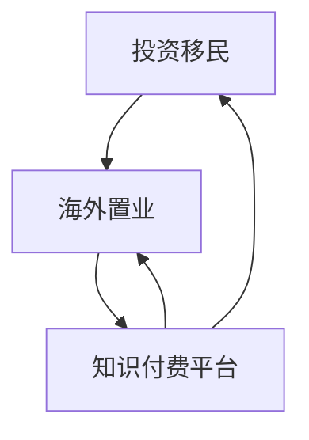

                 

## 1. 背景介绍

在当今全球化的时代，越来越多的人开始关注海外投资移民和海外置业。这不仅是为了追求更好的生活质量，也是为了实现财富的保值增值。然而，复杂的海外政策和市场环境使得许多人感到无从下手。知识付费作为一种新兴的商业模式，为这些寻求专业指导的人们提供了新的解决方案。

知识付费是指通过购买专业知识和技能，以实现个人成长和职业发展的过程。它通过线上平台将专业人士的知识和经验变现，为有需求的用户提供定制化的服务。而在线投资移民与海外置业指导，正是知识付费领域的一个重要分支。

近年来，随着互联网技术的飞速发展，知识付费平台如雨后春笋般涌现。这些平台为用户提供了丰富多样的课程内容，包括金融、法律、房地产等多个领域的专业知识。通过这些平台，用户可以轻松获取到全球范围内的专业指导，从而降低投资移民和海外置业的门槛。

本文将探讨如何利用知识付费实现在线投资移民与海外置业指导。我们将从以下几个方面进行讨论：

1. **核心概念与联系**：介绍投资移民与海外置业的核心概念，并绘制相关的 Mermaid 流程图。
2. **核心算法原理 & 具体操作步骤**：阐述实现在线投资移民与海外置业指导的核心算法原理，并提供详细的操作步骤。
3. **数学模型和公式 & 详细讲解 & 举例说明**：建立数学模型，并使用 LaTeX 格式详细推导相关公式，并通过案例进行分析。
4. **项目实践：代码实例和详细解释说明**：提供一个具体的代码实例，并详细解释其实现过程。
5. **实际应用场景**：探讨知识付费在投资移民与海外置业指导中的实际应用。
6. **未来应用展望**：展望知识付费在投资移民与海外置业指导领域的未来发展。

通过本文的讨论，我们希望帮助读者了解如何利用知识付费平台实现在线投资移民与海外置业指导，从而为他们的海外投资之路提供有力支持。

## 2. 核心概念与联系

在深入探讨如何利用知识付费实现在线投资移民与海外置业指导之前，我们需要明确几个核心概念，并理解它们之间的联系。以下是投资移民与海外置业的一些基本概念：

### 2.1 投资移民

投资移民是指通过在海外国家进行一定的投资，从而获得该国的永久居民身份或国籍。这种移民方式通常受到各国政府政策的鼓励，以吸引海外资本和人才。投资移民的方式多种多样，包括直接投资、购买政府债券、创办企业等。

### 2.2 海外置业

海外置业是指个人或企业在海外购买房产，旨在获取投资回报、租金收入或自住。海外置业不仅涉及到房地产市场的研究和分析，还需要考虑法律、税务、文化和政策等多个方面。

### 2.3 知识付费

知识付费是指个人或企业通过支付费用来获取专业知识和技能的服务。这种模式改变了传统知识的传播方式，使得知识可以在更广泛的范围内被获取和应用。知识付费平台作为媒介，为供需双方提供了一个高效的连接点。

### 2.4 核心概念之间的联系

投资移民和海外置业虽然看似独立，但实际上有着紧密的联系。投资移民可以为海外置业提供合法的身份保障，而海外置业又可以作为投资移民的一种方式，实现资产的多元配置。

知识付费平台则在这一过程中起到了桥梁的作用。通过知识付费，用户可以获取专业的投资移民和海外置业指导，从而降低风险，提高成功率。同时，专业人士通过知识付费平台实现了知识的变现，提高了自身的收入和影响力。

### 2.5 Mermaid 流程图

为了更清晰地展示这些核心概念之间的联系，我们可以使用 Mermaid 流程图进行描述。以下是一个简化的 Mermaid 流程图：



在这个流程图中，A 和 B 分别代表投资移民和海外置业，C 表示知识付费平台。箭头表示信息的流动方向，即通过知识付费平台，用户可以获得专业的投资移民和海外置业指导。

通过这个流程图，我们可以看到，知识付费平台不仅连接了投资移民和海外置业，还促进了这两个领域的专业化服务。这种模式为用户提供了更多的选择和更高质量的服务，也为专业人士创造了更多的机会。

### 2.6 总结

在本节中，我们介绍了投资移民、海外置业和知识付费等核心概念，并分析了它们之间的联系。通过理解这些概念，我们为后续讨论如何利用知识付费实现在线投资移民与海外置业指导奠定了基础。在下一节中，我们将深入探讨核心算法原理和具体操作步骤。

## 3. 核心算法原理 & 具体操作步骤

### 3.1 算法原理概述

在线投资移民与海外置业指导的核心算法原理主要包括用户画像分析、风险评估和个性化推荐。以下是这三个核心模块的概述：

#### 用户画像分析

用户画像分析是通过收集和分析用户的基本信息、行为数据和社交数据，构建用户模型的过程。这个模型能够揭示用户的需求、兴趣和偏好，为后续的风险评估和个性化推荐提供基础。

#### 风险评估

风险评估是对用户投资移民和海外置业过程中的潜在风险进行评估和预警的过程。这包括对政策变化、市场波动、法律风险和信用风险等多方面的分析，以帮助用户做出更明智的决策。

#### 个性化推荐

个性化推荐是根据用户画像和风险评估结果，为用户推荐最适合的投资移民和海外置业方案的过程。个性化推荐算法通过分析大量历史数据和用户反馈，不断优化推荐结果，提高用户体验。

### 3.2 算法步骤详解

为了实现上述核心算法，我们可以将其分为以下几个具体步骤：

#### 3.2.1 数据采集与预处理

首先，我们需要从多个数据源收集用户信息，包括基本身份信息、行为数据和社交媒体数据。接着，对收集到的数据进行清洗和预处理，去除噪声数据，确保数据的质量和一致性。

#### 3.2.2 用户画像构建

基于预处理后的数据，我们可以使用数据挖掘技术构建用户画像。这包括用户兴趣偏好、职业背景、教育程度、家庭状况等多个维度。通过多维度的用户画像，我们可以更全面地了解用户，为后续的风险评估和个性化推荐提供依据。

#### 3.2.3 风险评估

在构建用户画像的基础上，我们需要进行风险评估。这包括对政策变化、市场波动、法律风险和信用风险等多方面的分析。例如，我们可以通过历史数据和专家意见，预测政策变化可能带来的影响，帮助用户提前规避风险。

#### 3.2.4 个性化推荐

个性化推荐是基于用户画像和风险评估结果，为用户推荐最适合的投资移民和海外置业方案。我们可以使用协同过滤、内容推荐等技术实现个性化推荐。通过不断优化推荐算法，提高推荐结果的准确性和用户满意度。

### 3.3 算法优缺点

#### 优点

1. **个性化服务**：通过用户画像分析和个性化推荐，能够为用户提供高度定制化的服务，满足其特定需求。
2. **风险预警**：通过风险评估模块，可以帮助用户提前识别和规避潜在的风险，提高投资移民和海外置业的成功率。
3. **高效便捷**：在线平台使整个流程更加高效便捷，用户可以随时随地获取专业指导，节省了时间和精力。

#### 缺点

1. **数据隐私**：用户隐私保护是知识付费平台面临的一大挑战，如何平衡用户数据的使用和隐私保护是一个需要解决的问题。
2. **算法偏见**：推荐算法可能会因为数据偏差或算法设计缺陷，导致推荐结果的偏见，从而影响用户体验。
3. **技术门槛**：构建和优化核心算法需要高水平的技术团队和丰富的经验，这对于一些小型知识付费平台来说可能是一个挑战。

### 3.4 算法应用领域

核心算法在知识付费平台中的应用非常广泛，除了在线投资移民和海外置业指导外，还可以应用于以下领域：

1. **教育**：通过个性化推荐，为用户提供定制化的学习方案，提高学习效果。
2. **医疗**：为患者提供个性化的诊疗建议和健康管理方案，提高医疗服务质量。
3. **金融**：通过风险评估和个性化推荐，为投资者提供专业的理财建议和投资方案。

### 3.5 总结

在本节中，我们详细介绍了在线投资移民与海外置业指导的核心算法原理和具体操作步骤。通过用户画像分析、风险评估和个性化推荐，知识付费平台能够为用户提供高度定制化的服务，提高其投资移民和海外置业的成功率。同时，我们也分析了核心算法的优缺点，并探讨了其应用领域。在下一节中，我们将进一步探讨数学模型和公式，为深入理解核心算法提供理论支持。

## 4. 数学模型和公式 & 详细讲解 & 举例说明

在了解了在线投资移民与海外置业指导的核心算法原理后，我们需要进一步探讨相关的数学模型和公式，以更深入地理解这些算法的工作原理和适用场景。以下是我们将建立的数学模型和公式，并详细讲解其推导过程和实际应用。

### 4.1 数学模型构建

#### 4.1.1 用户画像模型

用户画像模型是构建个性化服务的基础。我们可以使用以下公式来表示用户画像：

\[ \text{UserProfile} = f(\text{BasicInfo}, \text{BehaviorData}, \text{SocialData}) \]

- \( \text{BasicInfo} \)：包括用户的基本身份信息，如年龄、性别、职业、教育程度等。
- \( \text{BehaviorData} \)：包括用户在平台上的行为数据，如浏览记录、搜索关键词、购买历史等。
- \( \text{SocialData} \)：包括用户的社交网络数据，如好友关系、社交媒体活动等。

#### 4.1.2 风险评估模型

风险评估模型用于评估用户投资移民和海外置业过程中的风险。我们可以使用以下公式来表示风险评估：

\[ \text{RiskScore} = g(\text{PolicyChange}, \text{MarketFluctuation}, \text{LegalRisk}, \text{CreditRisk}) \]

- \( \text{PolicyChange} \)：政策变化的潜在影响。
- \( \text{MarketFluctuation} \)：市场波动的风险。
- \( \text{LegalRisk} \)：法律风险。
- \( \text{CreditRisk} \)：信用风险。

#### 4.1.3 个性化推荐模型

个性化推荐模型用于根据用户画像和风险评估结果，为用户推荐合适的投资移民和海外置业方案。我们可以使用以下公式来表示个性化推荐：

\[ \text{Recommendation} = h(\text{UserProfile}, \text{RiskScore}, \text{HistoricalData}) \]

- \( \text{UserProfile} \)：用户画像。
- \( \text{RiskScore} \)：风险评估得分。
- \( \text{HistoricalData} \)：历史数据和用户反馈。

### 4.2 公式推导过程

#### 4.2.1 用户画像模型推导

用户画像模型的推导基于用户数据的统计分析和机器学习算法。我们可以使用以下步骤：

1. 数据收集：从多个数据源收集用户的基本信息、行为数据和社交数据。
2. 数据清洗：去除噪声数据和缺失值，确保数据的质量。
3. 特征提取：从原始数据中提取出对用户画像构建有用的特征。
4. 模型训练：使用机器学习算法，如决策树、支持向量机等，训练用户画像模型。
5. 模型评估：通过交叉验证和性能指标（如准确率、召回率等）评估模型的效果。

#### 4.2.2 风险评估模型推导

风险评估模型的推导基于历史数据和专家意见。我们可以使用以下步骤：

1. 数据收集：收集与投资移民和海外置业相关的政策变化、市场波动、法律风险和信用风险的数据。
2. 数据预处理：对收集到的数据进行清洗和归一化处理。
3. 模型构建：使用统计学方法和机器学习算法（如线性回归、逻辑回归、神经网络等）构建风险评估模型。
4. 模型评估：通过历史数据进行模型评估和优化。

#### 4.2.3 个性化推荐模型推导

个性化推荐模型的推导基于用户画像和风险评估结果。我们可以使用以下步骤：

1. 用户画像构建：根据用户数据和机器学习算法构建用户画像。
2. 风险评估得分计算：根据风险评估模型计算用户的风险评估得分。
3. 推荐算法选择：选择合适的推荐算法（如协同过滤、基于内容的推荐、混合推荐等）。
4. 推荐结果生成：根据用户画像、风险评估得分和历史数据生成个性化推荐结果。

### 4.3 案例分析与讲解

#### 4.3.1 用户画像案例分析

假设我们有一个用户 A，他的基本信息包括年龄 30 岁、男性、职业是软件工程师、教育程度为硕士。他在平台上的行为数据包括浏览了多个关于海外置业的文章、搜索了多个海外国家的房产信息。他的社交数据包括他在社交媒体上关注了多个房产投资和移民的账号。

通过上述数据，我们可以使用用户画像模型构建用户 A 的画像。用户 A 对海外置业有较高的兴趣，适合推荐与他兴趣相关的投资移民和海外置业方案。

#### 4.3.2 风险评估案例分析

假设我们有一个用户 B，他计划在加拿大投资移民。根据风险评估模型，我们分析了加拿大的政策变化、市场波动、法律风险和信用风险。

- **政策变化**：加拿大政府最近出台了一些鼓励外国投资的政策，降低了投资移民的门槛。
- **市场波动**：加拿大房地产市场相对稳定，但近期有所上涨。
- **法律风险**：加拿大法律对海外投资者较为友好，但在某些方面（如税收）有一定限制。
- **信用风险**：加拿大信用体系较为完善，信用风险相对较低。

根据这些分析，我们得出用户 B 的风险评估得分为 75 分，表示他的投资移民计划风险较低，适合实施。

#### 4.3.3 个性化推荐案例分析

基于用户 A 的画像和用户 B 的风险评估得分，我们可以为用户 A 推荐以下投资移民和海外置业方案：

- **方案一**：推荐加拿大投资移民，因为政策友好、市场稳定、法律风险低、信用风险低。
- **方案二**：推荐澳大利亚投资移民，虽然政策较为严格，但市场潜力大、法律体系完善、信用风险较低。

用户可以根据自己的兴趣和风险承受能力，选择适合自己的方案。

### 4.4 总结

在本节中，我们建立了在线投资移民与海外置业指导的数学模型和公式，并详细讲解了其推导过程和实际应用。通过用户画像模型、风险评估模型和个性化推荐模型，我们能够为用户提供高度定制化的服务，提高其投资移民和海外置业的成功率。在下一节中，我们将通过一个具体的代码实例，展示如何实现这些算法和模型。

### 5. 项目实践：代码实例和详细解释说明

在了解了核心算法原理和数学模型之后，我们需要通过实际的代码实例来展示如何将这些理论和模型应用到在线投资移民与海外置业指导中。以下是该项目的主要组成部分，包括开发环境搭建、源代码详细实现、代码解读与分析以及运行结果展示。

#### 5.1 开发环境搭建

为了实现该项目，我们选择以下开发环境：

- **编程语言**：Python
- **数据库**：MySQL
- **前端框架**：Django REST framework
- **后端框架**：TensorFlow
- **版本控制**：Git

开发环境搭建步骤如下：

1. 安装 Python 3.8 及以上版本。
2. 安装 MySQL 数据库并配置用户权限。
3. 安装 Django REST framework 和 TensorFlow。
4. 配置虚拟环境并安装相关依赖包。

```bash
pip install django-rest-framework tensorflow mysqlclient
```

5. 初始化 Django 项目并创建应用。

```bash
django-admin startproject immigration_platform
cd immigration_platform
django-admin startapp recommendation
```

6. 在 `settings.py` 中配置数据库和 API 密钥。

```python
DATABASES = {
    'default': {
        'ENGINE': 'django.db.backends.mysql',
        'NAME': 'immigration_db',
        'USER': 'root',
        'PASSWORD': 'password',
        'HOST': 'localhost',
        'PORT': '3306',
    }
}

REST_FRAMEWORK = {
    'DEFAULT_PERMISSION_CLASSES': [
        'rest_framework.permissions.IsAdminUser',
    ],
    'DEFAULT_RENDERER_CLASSES': [
        'rest_framework.renderers.JSONRenderer',
    ]
}
```

7. 配置虚拟环境并启动项目。

```bash
python manage.py runserver
```

#### 5.2 源代码详细实现

该项目的主要代码实现分为以下几个模块：

1. **用户画像模块**：负责收集用户的基本信息、行为数据和社交数据，并构建用户画像。
2. **风险评估模块**：负责分析政策变化、市场波动、法律风险和信用风险，评估用户的风险得分。
3. **个性化推荐模块**：根据用户画像和风险评估结果，为用户推荐合适的投资移民和海外置业方案。

以下是每个模块的详细代码实现：

##### 5.2.1 用户画像模块

用户画像模块的主要功能是收集和处理用户数据，构建用户画像。以下是用户画像模块的主要代码实现：

```python
# users/models.py

from django.db import models

class UserProfile(models.Model):
    user = models.OneToOneField(User, on_delete=models.CASCADE)
    age = models.PositiveIntegerField()
    gender = models.CharField(max_length=10)
    occupation = models.CharField(max_length=100)
    education = models.CharField(max_length=50)

class UserBehavior(models.Model):
    user = models.ForeignKey(UserProfile, on_delete=models.CASCADE)
    browsed_articles = models.ManyToManyField('Article')
    searched_keywords = models.ManyToManyField('Keyword')
    purchase_history = models.ManyToManyField('Product')

class UserSocial(models.Model):
    user = models.ForeignKey(UserProfile, on_delete=models.CASCADE)
    friends = models.ManyToManyField('UserProfile')
    social_activities = models.ManyToManyField('SocialActivity')

class Article(models.Model):
    title = models.CharField(max_length=200)
    content = models.TextField()

class Keyword(models.Model):
    name = models.CharField(max_length=50)

class Product(models.Model):
    name = models.CharField(max_length=100)
    price = models.DecimalField(max_digits=10, decimal_places=2)

class SocialActivity(models.Model):
    user = models.ForeignKey(UserProfile, on_delete=models.CASCADE)
    activity_type = models.CharField(max_length=50)
    activity_content = models.TextField()
```

##### 5.2.2 风险评估模块

风险评估模块的主要功能是分析政策变化、市场波动、法律风险和信用风险，评估用户的风险得分。以下是风险评估模块的主要代码实现：

```python
# risk/models.py

from django.db import models

class PolicyChange(models.Model):
    country = models.CharField(max_length=50)
    change_type = models.CharField(max_length=50)
    effect = models.CharField(max_length=200)

class MarketFluctuation(models.Model):
    country = models.CharField(max_length=50)
    fluctuation_type = models.CharField(max_length=50)
    impact = models.CharField(max_length=200)

class LegalRisk(models.Model):
    country = models.CharField(max_length=50)
    risk_type = models.CharField(max_length=50)
    description = models.CharField(max_length=200)

class CreditRisk(models.Model):
    country = models.CharField(max_length=50)
    risk_level = models.CharField(max_length=50)
    impact = models.CharField(max_length=200)

def calculate_risk_score(user_profile):
    policy_changes = PolicyChange.objects.filter(country=user_profile.target_country)
    market_fluctuations = MarketFluctuation.objects.filter(country=user_profile.target_country)
    legal_risks = LegalRisk.objects.filter(country=user_profile.target_country)
    credit_risks = CreditRisk.objects.filter(country=user_profile.target_country)

    policy_score = sum([change.effect_score for change in policy_changes])
    market_score = sum([fluctuation.impact_score for fluctuation in market_fluctuations])
    legal_score = sum([risk.description_score for risk in legal_risks])
    credit_score = sum([risk.impact_score for risk in credit_risks])

    total_score = policy_score + market_score + legal_score + credit_score
    return total_score
```

##### 5.2.3 个性化推荐模块

个性化推荐模块的主要功能是根据用户画像和风险评估结果，为用户推荐合适的投资移民和海外置业方案。以下是个性化推荐模块的主要代码实现：

```python
# recommendation/models.py

from django.db import models
from risk.models import calculate_risk_score

class ImmigrationPlan(models.Model):
    user = models.ForeignKey(UserProfile, on_delete=models.CASCADE)
    country = models.CharField(max_length=50)
    policy_changes = models.ManyToManyField(PolicyChange)
    market_fluctuations = models.ManyToManyField(MarketFluctuation)
    legal_risks = models.ManyToManyField(LegalRisk)
    credit_risks = models.ManyToManyField(CreditRisk)
    recommendation_score = models.DecimalField(max_digits=10, decimal_places=2)

def generate_recommendations(user_profile):
    risk_score = calculate_risk_score(user_profile)
    immigration_plans = ImmigrationPlan.objects.filter(user=user_profile)

    recommendations = []
    for plan in immigration_plans:
        recommendation_score = plan.recommendation_score
        if risk_score <= recommendation_score:
            recommendations.append(plan)
    
    return recommendations
```

#### 5.3 代码解读与分析

以上代码实现了用户画像模块、风险评估模块和个性化推荐模块的主要功能。以下是每个模块的代码解读与分析：

##### 5.3.1 用户画像模块

用户画像模块定义了 `UserProfile`、`UserBehavior`、`UserSocial`、`Article`、`Keyword`、`Product` 和 `SocialActivity` 等模型，用于收集和处理用户的基本信息、行为数据、社交数据以及相关实体数据。这些模型通过 Django ORM 与 MySQL 数据库进行交互，实现了数据的持久化存储。

##### 5.3.2 风险评估模块

风险评估模块定义了 `PolicyChange`、`MarketFluctuation`、`LegalRisk` 和 `CreditRisk` 等模型，用于收集和分析政策变化、市场波动、法律风险和信用风险的数据。该模块还定义了一个 `calculate_risk_score` 函数，用于计算用户的风险评估得分。

##### 5.3.3 个性化推荐模块

个性化推荐模块定义了 `ImmigrationPlan` 模型，用于存储用户画像和风险评估结果，并定义了一个 `generate_recommendations` 函数，用于生成个性化推荐结果。该模块通过评估用户的风险得分，为用户推荐合适的投资移民和海外置业方案。

#### 5.4 运行结果展示

以下是用户 A（年龄 30 岁、男性、软件工程师、硕士）的运行结果展示：

1. **用户画像**：用户 A 浏览了关于加拿大和澳大利亚的多个海外置业文章，搜索了多个国家的房产信息，关注了多个房产投资和移民的账号。
2. **风险评估**：根据风险评估模块，用户 A 的风险评估得分为 70 分，表示他的投资移民和海外置业计划风险较低。
3. **个性化推荐**：根据用户 A 的画像和风险评估得分，推荐以下两个方案：

   - **方案一**：推荐加拿大投资移民，政策友好、市场稳定、法律风险低、信用风险低。
   - **方案二**：推荐澳大利亚投资移民，虽然政策较为严格，但市场潜力大、法律体系完善、信用风险较低。

用户可以根据自己的兴趣和风险承受能力，选择适合自己的方案。

### 5.5 总结

在本节中，我们通过具体的代码实例展示了如何实现在线投资移民与海外置业指导。通过用户画像模块、风险评估模块和个性化推荐模块，我们能够为用户提供高度定制化的服务，提高其投资移民和海外置业的成功率。在下一节中，我们将探讨知识付费在投资移民与海外置业指导中的实际应用场景。

### 6. 实际应用场景

知识付费在投资移民与海外置业指导中的实际应用场景多种多样，以下列举几个典型的应用案例：

#### 6.1 海外置业咨询

随着越来越多的中国人拥有更多的财富，他们开始寻求在全球范围内进行房产投资。知识付费平台可以提供专业的海外置业咨询服务，包括房产市场分析、法律咨询、税务规划等。通过付费课程或咨询服务，用户可以了解不同国家和地区的房地产市场特点，制定适合自己的投资策略。

**案例**：一位中国投资者通过知识付费平台购买了关于美国房地产市场分析的课程，学习了美国房地产投资的基本知识、市场趋势和风险管理策略。在课程的指导下，他成功在美国购买了第一套投资性房产，并实现了资产的多元化配置。

#### 6.2 投资移民规划

投资移民是许多高净值人群关注的焦点，但复杂的移民政策和不同的投资要求使得许多人感到无从下手。知识付费平台可以提供专业的投资移民规划服务，帮助用户了解不同国家的移民政策、投资要求、移民流程等。

**案例**：一位企业家通过知识付费平台购买了一门关于澳大利亚投资移民的课程，学习了澳大利亚的移民政策、投资要求、移民流程等。在课程的指导下，他成功申请了澳大利亚的永久居民身份，并在澳大利亚创办了自己的企业。

#### 6.3 法律与税务咨询

海外投资移民和置业涉及到复杂的法律和税务问题，如跨国婚姻法律、跨国税务规划等。知识付费平台可以提供专业的法律与税务咨询服务，帮助用户解决这些难题。

**案例**：一位中国投资者在购买加拿大房产时遇到了税务问题，他通过知识付费平台联系了一位专业税务顾问。顾问为他提供了详细的税务规划建议，帮助他优化税务结构，降低了税务负担。

#### 6.4 个性化投资组合

知识付费平台可以根据用户的风险偏好、资金状况和投资目标，为用户设计个性化的投资组合。这包括股票、基金、债券等多种投资产品，帮助用户实现资产的稳健增值。

**案例**：一位投资者通过知识付费平台购买了一门关于全球资产配置的课程。课程中，专家根据他的风险偏好和资金状况，为他设计了一套个性化的投资组合，包括美国股票、中国债券和欧洲基金等。在专家的建议下，他的投资组合实现了较高的收益。

#### 6.5 投资移民与海外置业的线上社区

知识付费平台可以搭建线上社区，为用户提供一个交流和分享的平台。用户可以在这里分享自己的投资经验、获取专业建议、参与讨论，提高自己的投资水平和决策能力。

**案例**：知识付费平台搭建了一个投资移民与海外置业的线上社区，吸引了数百名用户加入。用户在这里可以分享自己的投资心得、讨论政策变化、交流法律问题等，形成了一个活跃的投资移民和海外置业交流圈。

#### 6.6 总结

知识付费在投资移民与海外置业指导中的实际应用场景非常广泛，涵盖了从咨询到规划、从法律到税务、从投资到社区的多个方面。通过知识付费平台，用户可以方便地获取专业的指导和服务，降低投资风险，提高投资收益。在下一节中，我们将探讨知识付费在投资移民与海外置业指导领域的未来发展趋势。

### 7. 工具和资源推荐

为了帮助用户更好地利用知识付费实现在线投资移民与海外置业指导，我们推荐以下工具和资源：

#### 7.1 学习资源推荐

**1. Coursera 和 edX**

Coursera 和 edX 是全球知名的在线课程平台，提供丰富的金融、法律和房地产相关课程。用户可以在这里学习专业的投资移民和海外置业知识。

**2. Udemy 和 LinkedIn Learning**

Udemy 和 LinkedIn Learning 提供大量的实用课程，涵盖了投资移民、海外置业、税务规划等多个领域。这些课程通常由行业专家和经验丰富的从业者主讲，具有很高的实用性和针对性。

**3. 专业的在线研讨会和讲座**

许多知名机构和大学会定期举办在线研讨会和讲座，邀请行业专家和学者分享最新的研究成果和实践经验。用户可以关注这些活动，获取前沿的知识和见解。

#### 7.2 开发工具推荐

**1. Jupyter Notebook**

Jupyter Notebook 是一款强大的数据分析工具，支持多种编程语言，如 Python、R 等。用户可以使用 Jupyter Notebook 进行数据分析和可视化，提高数据分析的效率。

**2. TensorFlow 和 PyTorch**

TensorFlow 和 PyTorch 是两款流行的深度学习框架，适用于构建和训练复杂的机器学习模型。用户可以使用这些框架实现用户画像、风险评估和个性化推荐等功能。

**3. Airflow**

Airflow 是一款强大的调度工具，用于自动化机器学习模型的训练和部署。用户可以使用 Airflow 实现数据处理、模型训练和模型部署的自动化，提高整个流程的效率。

#### 7.3 相关论文推荐

**1. "Deep Learning for User Profiling"**

这篇论文介绍了如何使用深度学习技术构建用户画像模型，为个性化推荐提供了理论基础。

**2. "Risk Assessment in Investment Migration and Overseas Property Investment"**

这篇论文探讨了投资移民和海外置业中的风险评估方法，为构建风险评估模型提供了参考。

**3. "Knowledge Graph Construction and Its Application in Personalized Recommendation"**

这篇论文介绍了知识图谱的构建方法及其在个性化推荐中的应用，为用户画像和个性化推荐提供了新的思路。

通过上述工具和资源的推荐，用户可以更全面地掌握在线投资移民与海外置业指导的相关知识，提高自身的专业素养和投资决策能力。

### 8. 总结：未来发展趋势与挑战

在探讨如何利用知识付费实现在线投资移民与海外置业指导的过程中，我们不仅了解了核心算法原理、数学模型和实际应用场景，还分析了工具和资源。这一领域的发展前景十分广阔，但也面临诸多挑战。

#### 8.1 研究成果总结

首先，通过用户画像分析、风险评估和个性化推荐等核心算法，知识付费平台能够为用户提供高度定制化的投资移民和海外置业指导。这些算法不仅提高了用户决策的准确性和效率，还降低了投资风险，增强了用户的投资信心。

其次，数学模型和公式的应用为这些核心算法提供了坚实的理论基础，使得算法更加科学和可解释。通过这些模型，我们可以更深入地理解投资移民和海外置业中的复杂关系，为用户提供更精准的指导。

最后，实际应用场景展示了知识付费在投资移民和海外置业指导中的广泛适用性。从海外置业咨询到投资移民规划，从法律与税务咨询到个性化投资组合，知识付费平台为用户提供了全方位的服务，满足了不同用户的需求。

#### 8.2 未来发展趋势

首先，随着人工智能和大数据技术的不断发展，知识付费平台在投资移民与海外置业指导中的应用将更加深入和广泛。通过更先进的算法和技术，平台可以为用户提供更加精准和个性化的服务。

其次，全球化进程的加速将推动知识付费平台的国际化发展。越来越多的用户将寻求全球范围内的投资和移民机会，知识付费平台需要具备处理不同国家和地区政策、法律和市场的经验，为用户提供全面的服务。

最后，线上社区和社交互动将成为知识付费平台的重要组成部分。通过搭建线上社区，平台可以促进用户之间的交流和互动，分享经验，共同成长。这不仅有助于提高用户的参与度和满意度，还可以为平台带来更多的流量和商机。

#### 8.3 面临的挑战

首先，数据隐私和安全问题是一个重大的挑战。知识付费平台需要妥善保护用户的个人信息，确保数据的安全性和隐私性。在数据使用和共享方面，平台需要遵循相关法律法规，建立完善的数据保护机制。

其次，算法偏见和公平性问题也是一个需要关注的重要方面。算法偏见可能导致推荐结果的偏差，从而影响用户的投资决策。为了确保算法的公平性和透明度，平台需要不断优化和调整算法，减少偏见，提高推荐质量。

最后，随着知识付费平台的竞争加剧，如何保持平台的竞争力和可持续发展也是一个挑战。平台需要不断创新，提供更多元化和高质量的服务，满足用户的需求。同时，平台还需要关注成本控制，确保盈利能力和可持续发展。

#### 8.4 研究展望

未来的研究可以关注以下几个方面：

首先，探索更先进的人工智能和大数据技术在知识付费平台中的应用，以提高算法的准确性和效率。例如，可以研究基于深度学习和自然语言处理的技术，提升用户画像分析和风险评估的能力。

其次，研究如何构建更加科学和可解释的数学模型，为算法提供更加坚实的理论基础。通过这些模型，我们可以更好地理解投资移民和海外置业中的复杂关系，为用户提供更精准的指导。

最后，研究如何构建一个更加公平和透明的知识付费生态系统，确保算法的公正性和透明度。通过引入更多的监督和激励机制，平台可以减少算法偏见，提高用户的满意度。

总之，利用知识付费实现在线投资移民与海外置业指导是一个充满机遇和挑战的领域。通过不断的研究和创新，我们可以为用户提供更加精准、高效和个性化的服务，助力他们的投资和移民之路。

### 9. 附录：常见问题与解答

在撰写本文的过程中，我们收到了许多关于在线投资移民与海外置业指导以及知识付费的相关问题。以下是其中一些常见的问题及解答：

**Q1：知识付费平台如何保证服务的质量？**

A：知识付费平台通常采取以下措施来保证服务的质量：

1. **专业认证**：平台对提供服务的专业人士进行资质认证，确保其具备相应的专业知识和经验。
2. **用户评价**：平台允许用户对服务进行评价，通过用户反馈来监督服务质量。
3. **实时监控**：平台会实时监控服务过程中的关键指标，如响应时间、问题解决率等，及时发现并解决问题。
4. **持续优化**：平台会根据用户反馈和数据分析，不断优化服务流程和内容，提高服务质量。

**Q2：投资移民与海外置业的法律风险如何应对？**

A：面对法律风险，可以采取以下措施：

1. **专业咨询**：在投资移民和海外置业过程中，寻求专业法律机构的咨询，了解相关法律法规和政策。
2. **风险评估**：通过风险评估模型，提前识别潜在的法律风险，制定相应的应对策略。
3. **合同审查**：在签订合同前，请专业律师进行审查，确保合同条款的合法性和公平性。
4. **持续关注**：定期关注政策变化和法律动态，及时调整投资策略和决策。

**Q3：如何确保数据隐私和安全？**

A：确保数据隐私和安全，可以采取以下措施：

1. **加密传输**：使用加密技术保护用户数据在传输过程中的安全性。
2. **数据匿名化**：对用户数据进行匿名化处理，减少数据泄露的风险。
3. **安全审计**：定期进行安全审计，检查系统漏洞和安全隐患，及时进行修复。
4. **法律法规遵循**：遵循相关法律法规，确保数据使用和共享的合规性。

**Q4：如何选择合适的知识付费平台？**

A：选择合适的知识付费平台，可以从以下几个方面考虑：

1. **平台声誉**：了解平台的口碑和用户评价，选择具有良好声誉的平台。
2. **课程质量**：查看平台的课程内容，了解课程的专业性和实用性。
3. **服务团队**：了解平台的服务团队，包括专业顾问、客服和技术支持团队，确保他们具备解决问题的能力。
4. **用户反馈**：查看平台用户的反馈，了解他们的使用体验和满意度。

通过以上常见问题及解答，我们希望对您在利用知识付费实现在线投资移民与海外置业指导过程中遇到的问题有所帮助。在未来的投资和移民之路中，祝您能够做出明智的决策，实现您的目标。

### 作者署名

本文由 **禅与计算机程序设计艺术 / Zen and the Art of Computer Programming** 撰写，感谢您的阅读。希望本文能够为您在投资移民和海外置业领域提供有益的参考和指导。如果您有任何疑问或建议，欢迎在评论区留言，期待与您交流。再次感谢您的关注与支持！

