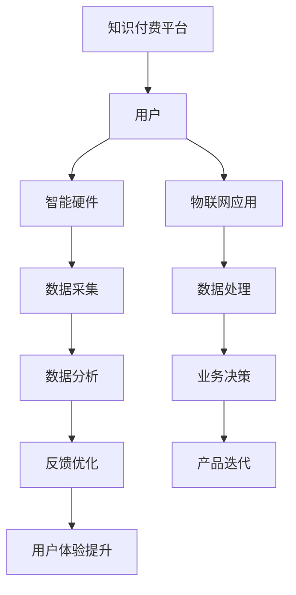

                 

### 背景介绍

随着互联网技术的飞速发展，物联网（IoT）已经渗透到我们生活的方方面面。从智能家居到工业自动化，物联网正在不断改变着我们的生活方式和商业模式。智能硬件作为物联网的核心组成部分，其市场潜力巨大。然而，随着智能硬件的普及，如何提升其竞争力、降低成本、增加用户粘性成为企业和开发者需要解决的问题。

知识付费作为一种新兴的商业模式，正逐渐受到企业和开发者的关注。知识付费通过提供专业的知识和技能，满足用户在特定领域的学习和成长需求。本文将探讨如何利用知识付费实现智能硬件与物联网应用，为企业和开发者提供新的商业模式和发展路径。

### 核心概念与联系

要实现知识付费在智能硬件与物联网应用中的价值，我们首先需要了解以下几个核心概念：

1. **知识付费**：知识付费是指用户为获取特定领域的知识和技能而支付的费用。这种模式通过互联网平台实现，用户可以根据自己的需求和兴趣选择课程或内容进行付费学习。

2. **智能硬件**：智能硬件是指具备计算能力、传感器和网络通信能力的硬件设备。它们能够通过物联网技术与互联网进行连接，实现数据的采集、传输和处理。

3. **物联网应用**：物联网应用是指利用物联网技术实现的具体应用场景，如智能家居、智能交通、智能医疗等。

为了更好地理解这些概念之间的关系，我们可以使用Mermaid流程图来展示其连接方式：



### 核心算法原理 & 具体操作步骤

要实现知识付费在智能硬件与物联网应用中的价值，核心算法的原理和具体操作步骤至关重要。以下是一个简化的流程：

#### 3.1 算法原理概述

知识付费在智能硬件与物联网应用中的核心算法主要包括数据采集、数据处理和业务决策三个部分：

1. **数据采集**：智能硬件通过传感器采集环境数据，如温度、湿度、光照等。
2. **数据处理**：采集到的数据经过处理和清洗，去除噪声和异常值，确保数据质量。
3. **业务决策**：基于处理后的数据，结合用户的需求和偏好，进行业务决策，如推荐产品、调整设置等。

#### 3.2 算法步骤详解

1. **数据采集**：
   - 智能硬件设备配备各种传感器，实时监测环境参数。
   - 数据采集模块负责将这些参数转换为数字信号，并传输到云端或本地服务器。

2. **数据处理**：
   - 数据预处理：对采集到的数据进行滤波、去噪和归一化处理，确保数据质量。
   - 特征提取：从预处理后的数据中提取特征，如时序特征、空间特征等。

3. **业务决策**：
   - 建立数学模型：根据应用场景和用户需求，建立相应的数学模型，如回归模型、分类模型等。
   - 决策算法：使用机器学习算法，如决策树、神经网络等，对特征进行分类或回归预测。
   - 业务执行：根据预测结果，执行相应的业务操作，如调整设备参数、推荐产品等。

#### 3.3 算法优缺点

- **优点**：
  - 提高数据利用效率：通过对数据进行处理和分析，可以更好地利用智能硬件采集到的数据，提升用户体验。
  - 降低成本：通过自动化处理和业务决策，可以减少人力成本，提高运营效率。
  - 提升个性化服务：基于用户数据和业务需求，可以提供更个性化的服务，提高用户粘性。

- **缺点**：
  - 数据质量要求高：数据采集和处理的质量直接影响算法的准确性，对数据质量要求较高。
  - 算法复杂度高：实现业务决策需要复杂的算法和模型，对开发者的技术要求较高。

#### 3.4 算法应用领域

- **智能家居**：通过智能硬件采集家庭环境数据，如室内温度、湿度、空气质量等，结合用户需求和偏好，自动调整家居设备参数，提升家庭舒适度。
- **智能交通**：通过智能硬件采集交通数据，如车速、车流量、路况等，结合机器学习算法，预测交通状况，优化交通信号控制，减少拥堵。
- **智能医疗**：通过智能硬件采集健康数据，如心率、血压、血糖等，结合医学知识库和机器学习算法，预测疾病风险，提供个性化健康建议。

### 数学模型和公式 & 详细讲解 & 举例说明

在智能硬件与物联网应用中，数学模型和公式是实现知识付费的核心工具。以下是一个简化的数学模型示例：

#### 4.1 数学模型构建

假设我们有一个智能家居系统，需要根据室内温度和用户设定的温度阈值自动调整空调的开关状态。

- **输入变量**：\( T_{当前} \)（当前室内温度），\( T_{设定} \)（用户设定的温度阈值）。
- **输出变量**：\( S_{空调} \)（空调开关状态，1表示开，0表示关）。

构建的数学模型如下：

\[ S_{空调} = \begin{cases} 
1, & \text{if } T_{当前} > T_{设定} + \Delta T \\
0, & \text{otherwise}
\end{cases} \]

其中，\( \Delta T \) 是一个温度阈值，用于调整空调的响应速度。

#### 4.2 公式推导过程

温度阈值 \( \Delta T \) 的选择需要考虑多个因素，如用户偏好、空调的性能等。一个简单的推导过程如下：

1. **用户设定温度阈值**：用户可以根据自己的舒适度设定一个温度阈值 \( T_{设定} \)。

2. **温度范围分析**：分析室内温度的变化范围，确定 \( T_{当前} \) 的分布。

3. **响应速度分析**：根据空调的性能参数，确定 \( \Delta T \) 的合理范围。一般来说，\( \Delta T \) 应小于空调的调节温度范围。

#### 4.3 案例分析与讲解

假设用户设定的温度阈值为 \( T_{设定} = 25^\circ C \)，空调的调节温度范围为 \( \Delta T_{空调} = 3^\circ C \)。

1. **初始设置**：设定 \( \Delta T = 2^\circ C \)。

2. **数据采集**：智能硬件采集室内温度 \( T_{当前} = 28^\circ C \)。

3. **判断空调状态**：根据数学模型，判断空调状态 \( S_{空调} = 1 \)，即开启空调。

4. **调整温度**：空调开启后，室内温度逐渐下降。当 \( T_{当前} = 24^\circ C \) 时，重新判断空调状态。

5. **优化 \( \Delta T \)**：根据实际情况，可以逐步调整 \( \Delta T \)，以提高空调的响应速度和节能效果。

### 项目实践：代码实例和详细解释说明

以下是一个基于Python的智能家居系统的示例代码，用于实现智能空调的自动控制。

#### 5.1 开发环境搭建

1. 安装Python环境（建议使用Python 3.8及以上版本）。
2. 安装必要的库，如requests、pandas等。

#### 5.2 源代码详细实现

```python
import requests
import pandas as pd

# 设定用户温度阈值
T设定 = 25

# 设定空调调节温度阈值
DeltaT = 2

# 数据采集函数
def 数据采集():
    # 模拟采集室内温度
    T当前 = 28
    return T当前

# 判断空调状态函数
def 判断空调状态(T当前):
    if T当前 > T设定 + DeltaT:
        return 1  # 开启空调
    else:
        return 0  # 关闭空调

# 主程序
if __name__ == "__main__":
    while True:
        T当前 = 数据采集()
        S空调 = 判断空调状态(T当前)
        if S空调 == 1:
            print("开启空调")
        else:
            print("关闭空调")
        # 模拟等待一段时间
        time.sleep(60)
```

#### 5.3 代码解读与分析

- **数据采集函数**：模拟采集室内温度，实际应用中可以通过连接硬件设备获取实时温度数据。

- **判断空调状态函数**：根据当前室内温度和设定的温度阈值，判断空调的开关状态。

- **主程序**：不断循环执行数据采集和判断空调状态的操作，模拟实际应用中的自动控制过程。

#### 5.4 运行结果展示

运行上述代码后，程序会根据室内温度自动调整空调的开关状态，实现智能控制。例如：

- 当室内温度为28°C时，空调开启。
- 当室内温度降至24°C时，空调关闭。

### 实际应用场景

智能硬件与物联网应用在实际生活中有着广泛的应用场景。以下是一些典型的应用案例：

1. **智能家居**：通过智能硬件和物联网技术，实现家庭设备的自动化控制，提高生活质量。例如，自动调节室内温度、湿度、照明等。

2. **智能交通**：通过智能硬件和物联网技术，优化交通流量、减少拥堵。例如，实时监测交通状况、智能调度交通信号灯。

3. **智能医疗**：通过智能硬件和物联网技术，提供个性化的医疗服务。例如，实时监测患者健康状况、远程诊断和治疗。

4. **智能农业**：通过智能硬件和物联网技术，实现精准农业，提高农业生产效率。例如，实时监测土壤湿度、温度等，自动调节灌溉和施肥。

5. **智能工业**：通过智能硬件和物联网技术，实现生产过程的自动化和智能化。例如，实时监测设备状态、自动调整生产参数。

### 未来应用展望

随着技术的不断进步，智能硬件与物联网应用的未来前景广阔。以下是几个可能的发展方向：

1. **更高智能化**：通过深度学习和人工智能技术，实现更智能的决策和更高的自动化水平。

2. **更广泛连接**：随着5G网络的普及，物联网设备的连接能力将大幅提升，实现更广泛的连接和应用场景。

3. **更个性化服务**：通过大数据和个性化推荐技术，提供更个性化的服务，满足用户多样化的需求。

4. **更安全可靠**：随着安全技术的不断发展，智能硬件和物联网应用将变得更加安全可靠，保护用户隐私和数据安全。

### 工具和资源推荐

为了更好地进行智能硬件与物联网应用的开发和实践，以下是一些推荐的工具和资源：

1. **开发工具**：
   - Arduino：一款流行的开源硬件平台，适合初学者进行智能硬件开发。
   - Raspberry Pi：一款小型计算机，适合进行物联网项目的实践。
   - Node-RED：一款用于物联网数据流的可视化开发工具。

2. **学习资源**：
   - 《物联网技术基础》：《物联网技术基础》是一本全面介绍物联网技术的基础书籍，适合初学者阅读。
   - 《智能硬件设计与开发》：这本书详细介绍了智能硬件的设计与开发过程，适合有一定编程基础的读者。
   - Coursera、Udacity等在线课程平台：提供了丰富的物联网和智能硬件相关的课程，适合进行自学。

### 总结：未来发展趋势与挑战

智能硬件与物联网应用的发展趋势主要体现在更高智能化、更广泛连接、更个性化服务和更安全可靠等方面。然而，随着技术的发展，也面临着一些挑战：

1. **数据安全与隐私**：随着物联网设备的普及，用户数据的安全和隐私保护成为重要问题。

2. **技术标准化**：不同设备和平台之间的技术标准不统一，影响物联网应用的互操作性和用户体验。

3. **技术更新速度**：智能硬件和物联网技术的更新速度快，开发者需要不断学习和适应新技术。

4. **用户体验**：如何提供更便捷、高效的用户体验，提升用户粘性，是开发者需要关注的问题。

### 附录：常见问题与解答

1. **Q：智能硬件与物联网应用的区别是什么？**
   - **A**：智能硬件是指具备计算能力、传感器和网络通信能力的硬件设备，而物联网应用是指利用物联网技术实现的具体应用场景。

2. **Q：知识付费在智能硬件与物联网应用中有哪些优势？**
   - **A**：知识付费可以提供专业的知识和技能，提升智能硬件和物联网应用的开发效率，降低成本，提高用户体验。

3. **Q：智能硬件与物联网应用的未来发展方向是什么？**
   - **A**：未来智能硬件与物联网应用的发展方向包括更高智能化、更广泛连接、更个性化服务和更安全可靠等。

### 作者署名

作者：禅与计算机程序设计艺术 / Zen and the Art of Computer Programming

本文介绍了如何利用知识付费实现智能硬件与物联网应用。通过核心算法原理、数学模型和项目实践，展示了知识付费在智能硬件与物联网应用中的重要价值。未来，随着技术的不断进步，知识付费将在智能硬件与物联网领域发挥更大的作用。

