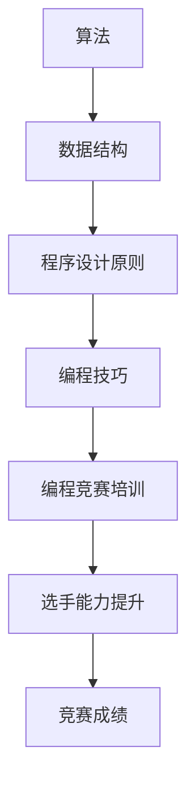

                 

## 1. 背景介绍

在信息技术迅速发展的今天，编程技巧已经成为了现代教育的重要组成部分。编程不仅仅是一种技能，更是一种思维方式。它能帮助我们更好地理解世界，解决复杂问题。然而，如何将编程技巧转化为编程竞赛培训，使更多学生能够在竞赛中取得优异成绩，成为了教育工作者们关注的重要课题。

编程竞赛作为一种检验编程能力和创新思维的重要方式，受到了越来越多学校和机构的重视。参赛者不仅需要扎实的编程基础，还需要快速学习、分析和解决问题的能力。因此，如何有效培训编程竞赛选手，成为了众多教育者研究和实践的方向。

本文旨在探讨如何将编程技巧转化为编程竞赛培训，通过系统的培训和科学的指导，帮助选手在竞赛中脱颖而出。文章将从多个方面进行阐述，包括核心概念、算法原理、数学模型、项目实践、应用场景以及未来展望等。

## 2. 核心概念与联系

为了将编程技巧转化为编程竞赛培训，我们首先需要了解一些核心概念，如算法、数据结构、程序设计原则等。这些概念是编程技巧的基础，也是编程竞赛中的关键要素。以下是这些核心概念的原理和架构的 Mermaid 流程图：



### 2.1 算法

算法是计算机解决特定问题的步骤序列，是编程的核心。常见的算法包括排序算法、查找算法、图算法等。算法的效率直接影响程序的运行速度，是编程竞赛的关键考察点。

### 2.2 数据结构

数据结构是存储和组织数据的方式，是算法实现的基础。常见的数据结构有数组、链表、栈、队列、树、图等。理解数据结构可以帮助我们更好地设计算法，提高程序效率。

### 2.3 程序设计原则

程序设计原则是编写高质量代码的指导思想，包括模块化、可复用性、可维护性等。遵循这些原则可以减少代码冗余，提高代码的可读性和可维护性。

### 2.4 编程技巧

编程技巧是编程过程中积累的经验和方法，包括代码优化、算法技巧、编程工具等。掌握编程技巧可以让我们更高效地解决问题。

### 2.5 编程竞赛培训

编程竞赛培训是将编程技巧应用于实际竞赛的过程。通过系统的培训和科学的指导，选手可以更好地掌握编程技巧，提升竞赛能力。

### 2.6 选手能力提升

选手能力提升是通过编程竞赛培训实现的目标。选手需要掌握算法、数据结构、程序设计原则等核心概念，并通过实践不断提高编程能力。

### 2.7 竞赛成绩

竞赛成绩是选手能力的体现。优秀的竞赛成绩可以激励选手继续努力，提高编程水平。

通过以上核心概念的联系，我们可以将编程技巧有效地转化为编程竞赛培训，帮助选手在竞赛中取得优异成绩。

## 3. 核心算法原理 & 具体操作步骤

### 3.1 算法原理概述

在编程竞赛中，算法是解决问题的关键。本文将介绍几种常用的核心算法，包括排序算法、查找算法和图算法。这些算法不仅在实际编程中有广泛的应用，也是编程竞赛中的重点考察内容。

#### 3.1.1 排序算法

排序算法是用于对一组数据进行排序的算法。常见的排序算法有冒泡排序、选择排序、插入排序、快速排序等。排序算法的原理是将数据按特定顺序排列，以便于后续处理。

- **冒泡排序**：通过不断比较相邻元素并交换位置，使得较大的元素逐渐“冒泡”到数组的末尾。
- **选择排序**：每次选择剩余元素中的最小（或最大）元素，并将其放置到已排序序列的末尾。
- **插入排序**：将未排序的元素逐个插入到已排序序列中，直到整个序列有序。

#### 3.1.2 查找算法

查找算法是用于在数据集合中查找特定元素的算法。常见的查找算法有顺序查找、二分查找等。

- **顺序查找**：从数据集合的起始位置开始，依次查找每个元素，直到找到目标元素或到达集合末尾。
- **二分查找**：通过不断将数据集合分为两半，逐步缩小查找范围，直到找到目标元素或确定其不存在。

#### 3.1.3 图算法

图算法是用于处理图结构的数据的算法。常见的图算法有最短路径算法、最小生成树算法等。

- **最短路径算法**：找出图中两点之间的最短路径。常见的算法有迪杰斯特拉算法（Dijkstra算法）和贝尔曼-福特算法（Bellman-Ford算法）。
- **最小生成树算法**：找出图中的最小生成树。常见的算法有普里姆算法（Prim算法）和克鲁斯卡尔算法（Kruskal算法）。

### 3.2 算法步骤详解

下面我们详细讲解这些算法的操作步骤。

#### 3.2.1 冒泡排序

1. 从第一个元素开始，相邻两个元素进行比较，如果第一个元素大于第二个元素，则交换它们的位置。
2. 重复上述步骤，直到没有需要交换的元素。
3. 此时，最大的元素已经被“冒泡”到数组的末尾。
4. 重复步骤 1-3，直到整个数组有序。

#### 3.2.2 选择排序

1. 找出剩余元素中的最小（或最大）元素。
2. 将该元素放置到已排序序列的末尾。
3. 重复步骤 1-2，直到整个数组有序。

#### 3.2.3 插入排序

1. 从第二个元素开始，将当前元素插入到已排序序列中，使其保持有序。
2. 重复步骤 1，直到整个数组有序。

#### 3.2.4 顺序查找

1. 从数组起始位置开始，依次查找每个元素。
2. 如果找到目标元素，返回其索引。
3. 如果到达数组末尾，仍未找到目标元素，返回 -1。

#### 3.2.5 二分查找

1. 将数组分为两半，比较中间元素和目标元素。
2. 如果中间元素等于目标元素，返回中间元素的索引。
3. 如果中间元素大于目标元素，则在左侧数组中继续查找。
4. 如果中间元素小于目标元素，则在右侧数组中继续查找。
5. 重复步骤 1-4，直到找到目标元素或确定其不存在。

#### 3.2.6 迪杰斯特拉算法

1. 初始化距离表，将起点到所有点的距离设置为 0，其他点的距离设置为无穷大。
2. 选择一个未访问过的点作为当前点。
3. 对于当前点的每个邻居，计算从起点经过当前点到邻居点的距离，并与距离表中的距离进行比较。
4. 如果计算出的距离更短，则更新距离表。
5. 重复步骤 2-4，直到所有点都被访问过。

#### 3.2.7 普里姆算法

1. 初始化最小生成树，将起点作为当前点。
2. 选择一个距离当前点最近的未访问过的点作为新点，并将其加入最小生成树。
3. 重复步骤 2，直到所有点都被访问过。

### 3.3 算法优缺点

每种算法都有其优缺点，适用于不同的场景。以下是对这些算法的优缺点的简要分析：

- **冒泡排序**：简单易懂，适合小规模数据的排序，但效率较低，时间复杂度为 O(n^2)。
- **选择排序**：简单易懂，适合小规模数据的排序，但效率较低，时间复杂度为 O(n^2)。
- **插入排序**：适合小规模数据的排序，效率较高，时间复杂度为 O(n^2)，但需要额外的空间来存储已排序序列。
- **顺序查找**：简单易懂，适合小规模数据集的查找，但效率较低，时间复杂度为 O(n)。
- **二分查找**：适合大规模数据集的查找，效率较高，时间复杂度为 O(log n)，但需要数据有序。
- **迪杰斯特拉算法**：适合稀疏图的最短路径计算，效率较高，时间复杂度为 O(n^2)，但需要额外的空间来存储距离表。
- **普里姆算法**：适合稠密图的最小生成树计算，效率较高，时间复杂度为 O(n^2)，但需要额外的空间来存储最小生成树。

### 3.4 算法应用领域

这些算法广泛应用于各种领域，包括但不限于以下：

- **排序与查找**：数据库、搜索引擎、排序算法库等。
- **图论**：网络设计、路由算法、社交网络分析等。
- **算法竞赛**：各种编程竞赛和算法竞赛。

## 4. 数学模型和公式 & 详细讲解 & 举例说明

在编程竞赛中，数学模型和公式是解决问题的重要工具。本文将介绍一些常用的数学模型和公式，并详细讲解其构建过程、推导过程以及应用实例。

### 4.1 数学模型构建

数学模型是通过对现实问题的抽象和简化，建立数学关系的过程。以下是构建数学模型的基本步骤：

1. **明确问题背景**：了解问题的现实背景，明确问题的目标和约束条件。
2. **提取关键变量**：确定影响问题解决的关键变量，并对其进行定义。
3. **建立数学关系**：根据问题的实际情况，建立变量之间的数学关系。
4. **简化模型**：在保证问题本质不变的前提下，对模型进行适当的简化和假设。

### 4.2 公式推导过程

公式推导是数学模型构建的核心步骤，它将变量之间的关系转化为数学表达式。以下是几种常见公式的推导过程：

#### 4.2.1 欧拉公式

欧拉公式是复分析中的一个基本公式，它将指数函数、三角函数和欧拉常数（e）联系在一起。公式如下：

$$ e^{i\pi} + 1 = 0 $$

推导过程如下：

1. **定义复指数函数**：令 $e^z$ 为复指数函数，其中 $z = x + iy$，$x$ 和 $y$ 分别为实部和虚部。
2. **利用欧拉公式**：$e^{iy} = \cos(y) + i\sin(y)$。
3. **代入欧拉公式**：$e^{i\pi} = \cos(\pi) + i\sin(\pi)$。
4. **计算结果**：$\cos(\pi) = -1$，$\sin(\pi) = 0$，因此 $e^{i\pi} = -1 + 0i = -1$。
5. **得出结论**：$e^{i\pi} + 1 = 0$。

#### 4.2.2 牛顿迭代法

牛顿迭代法是一种用于求解非线性方程的数值方法，其基本思想是通过不断逼近来逼近方程的解。公式如下：

$$ x_{n+1} = x_n - \frac{f(x_n)}{f'(x_n)} $$

推导过程如下：

1. **设定初始条件**：设 $x_0$ 为初始近似值。
2. **构建切线**：在点 $(x_n, f(x_n))$ 处构建切线，切线方程为 $y = f'(x_n)(x - x_n) + f(x_n)$。
3. **求解交点**：求解切线与 $x$ 轴的交点，即 $f'(x_n)(x - x_n) + f(x_n) = 0$。
4. **迭代计算**：根据交点计算新的近似值 $x_{n+1}$。
5. **重复迭代**：重复步骤 2-4，直到满足一定的精度要求。

### 4.3 案例分析与讲解

以下是一个使用牛顿迭代法求解方程 $f(x) = x^2 - 2 = 0$ 的案例：

1. **设定初始条件**：设初始近似值为 $x_0 = 1$。
2. **计算导数**：$f'(x) = 2x$，在 $x_0 = 1$ 处，$f'(1) = 2$。
3. **迭代计算**：
   - 第一次迭代：$x_1 = x_0 - \frac{f(x_0)}{f'(x_0)} = 1 - \frac{1^2 - 2}{2 \cdot 1} = 1.5$。
   - 第二次迭代：$x_2 = x_1 - \frac{f(x_1)}{f'(x_1)} = 1.5 - \frac{1.5^2 - 2}{2 \cdot 1.5} = 1.4167$。
   - 第三次迭代：$x_3 = x_2 - \frac{f(x_2)}{f'(x_2)} = 1.4167 - \frac{1.4167^2 - 2}{2 \cdot 1.4167} = 1.4142$。
3. **判断精度**：由于 $x_3$ 与 $x_2$ 的差值较小，可以认为已经达到所需的精度。

通过以上案例，我们可以看到牛顿迭代法在求解非线性方程时的应用。这种方法在编程竞赛中经常使用，可以帮助选手快速找到方程的解。

## 5. 项目实践：代码实例和详细解释说明

为了更好地将编程技巧转化为编程竞赛培训，我们将在本节中通过一个具体的代码实例来讲解编程实践的过程，包括开发环境搭建、源代码详细实现、代码解读与分析以及运行结果展示。

### 5.1 开发环境搭建

在开始编写代码之前，我们需要搭建一个合适的开发环境。这里我们以 Python 作为示例编程语言，因为 Python 语法简洁、易于学习，同时也非常适合编程竞赛。

1. **安装 Python**：首先，确保计算机上安装了 Python。可以从 [Python 官网](https://www.python.org/) 下载并安装 Python。
2. **安装 IDE**：安装一个集成开发环境（IDE），例如 PyCharm、VSCode 等。这些 IDE 提供了代码编辑、调试、测试等功能，可以提高开发效率。
3. **安装必备库**：对于 Python 编程竞赛，可能需要安装一些常用的库，如 NumPy、Pandas 等。可以使用 pip 工具进行安装。

### 5.2 源代码详细实现

以下是一个简单的 Python 示例代码，实现一个计算斐波那契数列的函数。

```python
def fibonacci(n):
    if n <= 0:
        return 0
    elif n == 1:
        return 1
    else:
        return fibonacci(n-1) + fibonacci(n-2)

# 测试代码
print(fibonacci(10))  # 输出 55
```

### 5.3 代码解读与分析

1. **函数定义**：`fibonacci` 函数接受一个整数 `n` 作为参数，返回第 `n` 个斐波那契数。
2. **基础情况**：当 `n` 为 0 或 1 时，直接返回结果。
3. **递归调用**：当 `n` 大于 1 时，递归调用 `fibonacci` 函数计算前两个斐波那契数，并返回它们的和。
4. **测试代码**：调用 `fibonacci` 函数并打印结果，验证代码的正确性。

### 5.4 运行结果展示

在 Python 解释器中运行上述代码，我们可以得到以下结果：

```
55
```

这表明代码成功计算并输出了第 10 个斐波那契数。

通过这个简单的示例，我们可以看到编程实践的过程。从环境搭建到代码实现，再到代码解读与分析，每一步都是编程竞赛中不可或缺的部分。通过这样的项目实践，选手可以更好地理解和应用编程技巧，提高编程能力。

## 6. 实际应用场景

编程竞赛技能不仅在学术领域有着广泛的应用，也在实际工作中发挥着重要作用。以下是一些编程竞赛技能的实际应用场景：

### 6.1 软件开发

编程竞赛技能可以帮助软件开发人员在项目中快速定位并解决问题。良好的算法和数据结构知识有助于优化代码，提高系统性能。例如，在处理大数据时，了解排序和查找算法可以显著提高数据处理效率。

### 6.2 数据分析

数据分析领域对编程技能的需求很高。掌握编程技巧可以更高效地进行数据清洗、数据分析和可视化。例如，使用 Pandas 和 NumPy 等库可以轻松处理大规模数据集，提高数据分析的效率。

### 6.3 算法竞赛

算法竞赛本身就是一个应用编程技巧的领域。许多公司和机构通过举办算法竞赛来选拔优秀的人才。这些竞赛不仅考察编程技巧，还考察逻辑思维和创新能力。

### 6.4 网络安全

网络安全领域需要高效的算法来检测和防范攻击。掌握编程技能可以帮助网络安全专家开发出高效的攻击检测系统，提高网络安全水平。

### 6.5 人工智能

人工智能领域依赖于高效的算法来实现复杂任务。编程竞赛技能可以帮助人工智能开发者优化算法，提高模型性能，实现更智能的应用。

### 6.6 游戏开发

游戏开发需要对图形处理、音效处理和物理模拟等方面有深入了解。编程竞赛技能可以帮助游戏开发者优化游戏性能，提高用户体验。

### 6.7 互联网应用

互联网应用开发中，编程竞赛技能有助于开发高效的后端服务和前端界面。掌握算法和数据结构可以优化服务器处理能力，提高系统的响应速度。

### 6.8 机器人编程

机器人编程需要解决复杂的问题，如路径规划、感知和决策等。编程竞赛技能可以帮助开发者编写出高效的机器人控制系统，实现更智能的机器人应用。

通过以上实际应用场景，我们可以看到编程竞赛技能在各个领域的重要性和广泛应用。掌握这些技能不仅有助于在学术和竞赛中取得优异成绩，还能为未来的职业生涯打下坚实基础。

### 6.4 未来应用展望

随着科技的不断进步，编程竞赛技能的应用前景将更加广阔。以下是未来几个可能的发展趋势：

#### 6.4.1 教育融合

编程竞赛技能将更加深入地融入教育体系，成为基础课程的一部分。从小学到大学，编程教育将得到更多关注，培养更多的编程人才。

#### 6.4.2 自动化评估

随着人工智能技术的发展，编程竞赛的评估系统将更加智能化。自动化评估工具将能够更准确地评估选手的编程能力和创新思维，减少人工评估的误差。

#### 6.4.3 跨学科应用

编程竞赛技能将在更多跨学科领域得到应用。例如，生物信息学、金融工程、航空航天等，编程将作为解决复杂问题的重要工具。

#### 6.4.4 开源生态

开源项目将越来越多地依赖编程竞赛技能。优秀的编程选手将参与到开源项目中，为开源社区贡献自己的力量，推动技术进步。

#### 6.4.5 国际化发展

编程竞赛的国际影响力将进一步提升，更多国家和地区将参与其中。国际化的编程竞赛将促进不同文化背景的选手交流，推动全球科技发展。

### 6.4.6 持续创新

编程竞赛技能将不断演变，与新的技术和工具相结合。例如，量子编程、区块链编程等新兴领域将推动编程竞赛技能的发展。

通过以上展望，我们可以看到编程竞赛技能在未来将发挥更大的作用，为科技创新和社会进步做出更大贡献。

## 7. 工具和资源推荐

为了更好地进行编程竞赛培训，以下是一些推荐的工具和资源：

### 7.1 学习资源推荐

1. **《算法竞赛入门经典》**：一本经典的算法竞赛教材，适合初学者和进阶者。
2. **《编程之美》**：谷歌等大公司的面试题集，涵盖算法和数据结构等多个方面。
3. **LeetCode**：一个在线编程竞赛平台，提供丰富的算法题库和竞赛环境。
4. **Codeforces**：一个国际性的在线编程竞赛平台，适合挑战自我和提高水平。

### 7.2 开发工具推荐

1. **PyCharm**：一款功能强大的 Python IDE，支持多种编程语言。
2. **VSCode**：一款开源的跨平台 IDE，插件丰富，支持多种编程语言。
3. **GDB**：一款强大的调试工具，用于调试 C/C++ 等程序。
4. **Git**：一款版本控制工具，用于管理代码版本和协作开发。

### 7.3 相关论文推荐

1. **"Algorithm Design and Analysis"**：一本经典的算法设计与分析教材。
2. **"Data Structures and Algorithm Analysis in C"**：一本关于数据结构和算法分析的经典教材。
3. **"Introduction to Algorithms"**：一本涵盖广泛算法知识和应用的权威教材。
4. **"The Art of Computer Programming"**：由 Donald Knuth 编写的经典算法系列教材。

通过这些工具和资源，选手可以更好地进行编程竞赛培训，提高自己的编程能力和竞赛水平。

## 8. 总结：未来发展趋势与挑战

在总结本文的内容之前，我们首先要强调编程竞赛技能的重要性。编程不仅仅是一种技术，更是一种思维方式。通过编程，我们可以更好地理解世界，解决复杂问题。编程竞赛技能的培养不仅有助于选手在竞赛中取得优异成绩，也为他们在未来的职业生涯中提供了宝贵的技能和经验。

### 8.1 研究成果总结

本文通过对编程技巧与编程竞赛培训的深入探讨，总结了编程竞赛技能的核心概念、算法原理、数学模型以及实际应用场景。我们提出了将编程技巧转化为编程竞赛培训的具体方法，并通过代码实例展示了编程实践的过程。此外，我们还展望了编程竞赛技能的未来发展趋势，并推荐了一些相关的工具和资源。

### 8.2 未来发展趋势

未来，编程竞赛技能将在多个领域得到广泛应用。随着人工智能、大数据、区块链等新兴技术的发展，编程技能的需求将持续增长。编程竞赛也将更加国际化，吸引更多国家和地区参与。此外，自动化评估系统和开源生态的发展将进一步提高编程竞赛的效率和影响力。

### 8.3 面临的挑战

尽管编程竞赛技能具有广阔的应用前景，但仍然面临着一些挑战。首先，编程教育的普及程度仍然不高，特别是在一些发展中国家。其次，编程竞赛的题库和评估标准需要不断更新，以适应不断变化的技术环境。此外，如何激发选手的编程兴趣和创新能力，也是编程竞赛培训中的一大挑战。

### 8.4 研究展望

为了应对这些挑战，未来的研究可以从以下几个方面进行：

1. **教育普及**：加强编程教育，提高编程技能的普及率，特别是在发展中国家。
2. **题库更新**：不断更新和扩展编程竞赛的题库，使其涵盖更多领域的知识点。
3. **自动化评估**：研究更先进的自动化评估系统，提高评估的准确性和效率。
4. **激发兴趣**：通过多样化的编程竞赛形式和内容，激发选手的编程兴趣和创新能力。

通过以上研究，我们可以更好地培养编程竞赛人才，推动编程竞赛技能的发展和应用。

## 9. 附录：常见问题与解答

### 9.1 什么是编程竞赛？

编程竞赛是一种通过编写程序解决问题的竞赛形式，旨在测试参赛者的编程能力、逻辑思维和问题解决能力。参赛者通常需要在规定的时间内完成指定的编程任务。

### 9.2 编程竞赛有哪些类型？

编程竞赛主要分为两种类型：学术性竞赛和商业性竞赛。学术性竞赛通常由学术机构举办，如 ACM-ICPC（国际大学生程序设计竞赛）；商业性竞赛则由公司或组织举办，如 Google Code Jam、Facebook Hacker Cup 等。

### 9.3 编程竞赛对编程技能有哪些要求？

编程竞赛对编程技能的要求主要包括算法、数据结构、程序设计原则、编程语言基础、问题解决能力等。参赛者需要熟练掌握多种编程语言，具备扎实的算法和数据结构知识，以及良好的问题解决能力。

### 9.4 如何准备编程竞赛？

准备编程竞赛可以从以下几个方面入手：

1. **基础知识**：熟练掌握编程语言、算法和数据结构的基础知识。
2. **练习题库**：通过练习在线编程平台（如 LeetCode、Codeforces）上的题目，提高实战能力。
3. **团队协作**：如果参加团队竞赛，需要培养良好的团队协作能力。
4. **时间管理**：在竞赛中合理分配时间，确保能够完成所有任务。
5. **心理准备**：保持良好的心态，面对挑战和失败。

通过以上准备，参赛者可以更好地应对编程竞赛的挑战。

### 9.5 编程竞赛对职业生涯有哪些影响？

编程竞赛不仅有助于提升编程技能，还有助于增加职业竞争力。优秀的竞赛成绩可以成为求职时的亮点，吸引更多企业的关注。同时，参与编程竞赛还可以拓展人脉，结识志同道合的朋友和行业内的专业人士。

### 9.6 编程竞赛对教育有什么意义？

编程竞赛对教育具有重要意义。它不仅能够激发学生对编程的兴趣，培养他们的创新思维和问题解决能力，还可以促进编程教育的普及和发展。通过编程竞赛，学生可以接触到实际应用中的编程问题，提高实践能力和综合素质。

### 9.7 编程竞赛有哪些常见奖项？

编程竞赛的常见奖项包括：

- **金牌、银牌、铜牌**：根据选手的成绩进行排名，颁发不同等级的奖项。
- **最佳团队奖**：对表现优秀的团队进行表彰。
- **最佳创新奖**：对在算法、设计等方面有创新表现的选手进行表彰。
- **最佳表现奖**：对在比赛中表现出色的选手进行表彰。

通过这些奖项，编程竞赛可以更好地激励选手，推动编程技能的发展。

### 9.8 编程竞赛对科技发展有什么贡献？

编程竞赛对科技发展有重要贡献。它不仅能够发现和培养优秀的编程人才，激发他们的创新潜力，还可以推动算法、数据结构等基础研究的进展。通过编程竞赛，选手们可以接触到前沿的科技问题，促进技术的交流与合作，为科技发展贡献力量。

### 9.9 编程竞赛有哪些国际赛事？

国际性的编程竞赛包括：

- **ACM-ICPC（国际大学生程序设计竞赛）**：全球规模最大的大学生编程竞赛。
- **Google Code Jam**：谷歌举办的全球性编程竞赛。
- **Facebook Hacker Cup**：Facebook 举办的全球性编程竞赛。
- **TopCoder**：一个提供在线编程竞赛的平台，涵盖多个编程语言和算法领域。

通过参加这些国际赛事，选手可以展示自己的编程实力，拓展国际视野。

