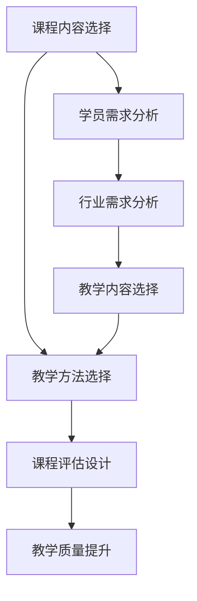
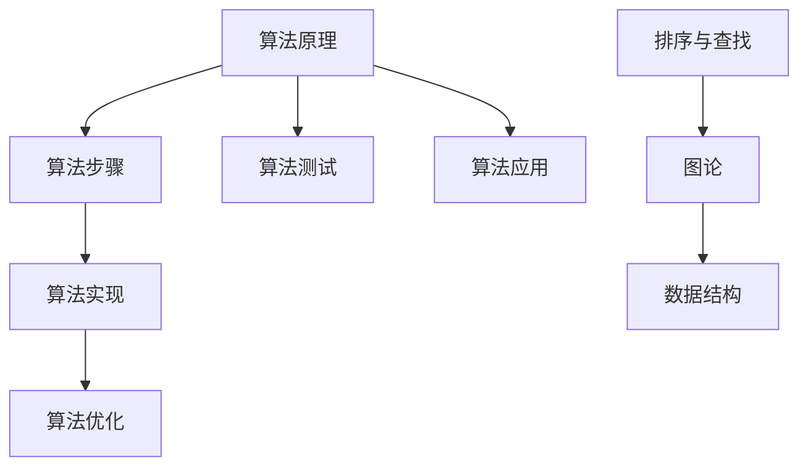
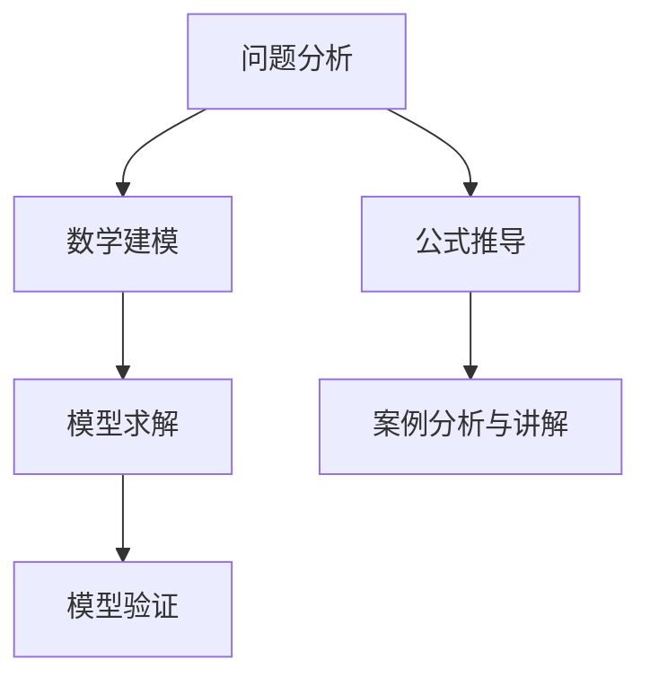
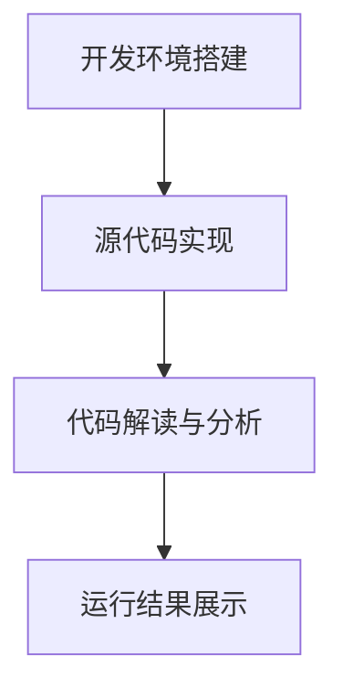

                 

关键词：程序员知识课程、课程设计、教学质量、学习体验、技术传播

> 摘要：本文将探讨如何设计并打造高质量的程序员知识课程，从课程内容选择、教学方法、课程评估等多个方面，提供了一套完整的指导方案。文章旨在为教育工作者和编程课程开发者提供实用的建议，帮助他们在教育过程中提高教学质量，提升学员的学习体验。

## 1. 背景介绍

在信息技术飞速发展的今天，编程技能成为了许多行业的必备技能。随着对程序员需求不断增加，教育机构和企业纷纷开设了各种编程课程。然而，市场上存在的编程课程质量参差不齐，许多课程存在内容老旧、教学方法单一、实践环节不足等问题，导致学员学习效果不佳。

为了提升编程课程的教学质量，打造高质量的程序员知识课程成为了教育工作者和课程开发者面临的重要任务。本文将从课程内容设计、教学方法、课程评估等多个方面，探讨如何打造高质量的程序员知识课程。

### 1.1 编程课程现状分析

目前市场上的编程课程主要存在以下问题：

1. **课程内容过于老旧**：许多课程内容还是基于几年前甚至更早的技术，未能及时更新，导致学员学习到的是已经过时的知识。
2. **教学方法单一**：许多课程仍然采用传统的讲授式教学方法，学员参与度低，学习效果不佳。
3. **实践环节不足**：许多课程缺乏实践环节，学员难以将所学知识应用到实际项目中。
4. **缺乏课程评估**：课程结束后，缺乏有效的评估机制，难以了解学员的学习效果。

### 1.2 打造高质量程序员知识课程的重要性

高质量的课程设计不仅能够提高学员的学习效果，还能提升教育机构的声誉。具体来说，高质量的课程设计具有以下优势：

1. **提升教学质量**：通过科学合理的课程设计，能够使教学内容更加系统、全面，提高教学质量。
2. **提高学员满意度**：高质量的课程能够满足学员的学习需求，提升学员的学习体验，增加满意度。
3. **促进技术传播**：高质量的编程课程能够推动先进技术的传播和应用，为行业发展贡献力量。
4. **提升教育机构竞争力**：高质量的编程课程能够提升教育机构的品牌形象和竞争力。

### 1.3 文章结构

本文将按照以下结构展开：

1. **课程内容设计**：介绍如何选择合适的课程内容，包括技术热点、行业需求等。
2. **教学方法**：探讨多种有效的教学方法，如讲授、讨论、实验等。
3. **课程评估**：介绍如何对课程进行评估，包括学员反馈、考试等。
4. **项目实践**：通过实际项目案例，展示如何将理论知识应用到实际项目中。
5. **工具和资源推荐**：推荐一些实用的开发工具和学习资源。
6. **总结与展望**：总结本文的主要观点，并对未来编程课程的发展进行展望。

## 2. 核心概念与联系

为了打造高质量的程序员知识课程，我们需要首先理解一些核心概念，并探讨它们之间的联系。

### 2.1 课程内容选择

课程内容的选择是课程设计的关键环节。我们需要考虑以下几个因素：

1. **技术热点**：选择当前热门的技术，如人工智能、大数据、区块链等，使学员掌握前沿技术。
2. **行业需求**：根据行业需求选择教学内容，使学员所学技能能够与实际工作相结合。
3. **学员背景**：根据学员的背景和基础，选择适合的教学内容，避免难度过高或过低。

### 2.2 教学方法

教学方法是影响教学效果的重要因素。我们需要根据课程内容和学员特点，选择合适的教学方法。以下是一些常见的教学方法：

1. **讲授法**：通过教师的讲解，使学员掌握基本概念和原理。
2. **讨论法**：通过小组讨论，激发学员的思考，提高学员的参与度。
3. **实验法**：通过实际操作，使学员将理论知识应用到实际项目中。

### 2.3 课程评估

课程评估是检验教学效果的重要手段。我们需要设计合理的评估机制，包括：

1. **考试**：通过考试检验学员对课程内容的掌握程度。
2. **作业**：通过作业评估学员的实际操作能力。
3. **项目**：通过项目评估学员的综合能力。

### 2.4 Mermaid 流程图

以下是一个简单的 Mermaid 流程图，展示了课程内容选择、教学方法、课程评估之间的关系：



## 3. 核心算法原理 & 具体操作步骤

### 3.1 算法原理概述

在编程课程中，算法是一个重要的知识点。算法原理包括以下几个方面：

1. **算法效率**：算法的效率是指算法在执行过程中所需的资源，包括时间复杂度和空间复杂度。
2. **算法逻辑**：算法逻辑是指算法的执行步骤和流程。
3. **算法实现**：算法实现是将算法逻辑用编程语言表达出来的过程。

### 3.2 算法步骤详解

以下是算法步骤的详细说明：

1. **问题分析**：分析问题，确定问题的规模和类型。
2. **算法设计**：根据问题分析，设计一个合适的算法。
3. **算法实现**：将算法逻辑用编程语言实现。
4. **算法优化**：对算法进行优化，提高算法的效率。
5. **算法测试**：测试算法的正确性和效率。

### 3.3 算法优缺点

每种算法都有其优缺点。以下是一个常见算法的优缺点分析：

#### 冒泡排序（Bubble Sort）

**优点**：

1. 简单易懂，易于实现。
2. 能够处理小规模数据。

**缺点**：

1. 时间复杂度较高，不适合处理大规模数据。
2. 空间复杂度较高，需要额外的存储空间。

### 3.4 算法应用领域

算法在各个领域都有广泛的应用，以下是一些典型应用领域：

1. **排序与查找**：排序算法用于对数据进行排序，查找算法用于在数据中查找特定元素。
2. **图论**：图论算法用于解决图相关的问题，如最短路径、最小生成树等。
3. **数据结构**：数据结构算法用于设计高效的数据存储和操作方式。

### 3.5 Mermaid 流程图

以下是一个简单的 Mermaid 流程图，展示了算法原理、算法步骤、算法优缺点的联系：



## 4. 数学模型和公式 & 详细讲解 & 举例说明

### 4.1 数学模型构建

在编程课程中，数学模型是一种重要的工具，用于描述现实世界中的问题。构建数学模型通常包括以下步骤：

1. **问题分析**：分析问题，确定问题的类型和规模。
2. **数学建模**：根据问题分析，选择合适的数学模型。
3. **模型求解**：求解模型，得到问题的解。
4. **模型验证**：验证模型是否能够正确地解决实际问题。

### 4.2 公式推导过程

以下是一个简单的数学公式的推导过程，用于计算圆的面积：

#### 公式：

$$
A = \pi r^2
$$

#### 推导过程：

1. **定义圆**：圆是一个平面上的闭合曲线，其上的所有点到圆心的距离相等。
2. **定义半径**：设圆的半径为 r。
3. **定义面积**：圆的面积 A 是圆内所有点构成的平面区域的大小。
4. **推导公式**：根据圆的几何性质，可以得到圆的面积公式为 A = πr²，其中 π 是圆周率，约等于 3.14159。

### 4.3 案例分析与讲解

以下是一个简单的案例，用于讲解如何使用数学模型和公式解决实际问题：

#### 问题：

计算一个直径为 10cm 的圆的面积。

#### 解题步骤：

1. **分析问题**：问题是一个圆的面积计算，已知直径为 10cm。
2. **构建数学模型**：使用圆的面积公式 A = πr²，其中 r 为半径。
3. **求解模型**：将直径除以 2，得到半径 r = 5cm。代入公式，得到 A = π × 5² = 25π cm²。
4. **计算结果**：使用计算器计算 25π 的值，得到 A ≈ 78.54 cm²。

### 4.4 Mermaid 流程图

以下是一个简单的 Mermaid 流程图，展示了数学模型构建、公式推导过程、案例分析与讲解的步骤：



## 5. 项目实践：代码实例和详细解释说明

### 5.1 开发环境搭建

在进行项目实践之前，我们需要搭建一个合适的开发环境。以下是一个简单的开发环境搭建步骤：

1. **安装操作系统**：安装支持开发的语言和工具的操作系统，如 Ubuntu 或 macOS。
2. **安装编程语言**：安装编程语言，如 Python、Java 或 C++。
3. **安装开发工具**：安装集成开发环境（IDE），如 PyCharm、Eclipse 或 Visual Studio。
4. **安装数据库**：如果项目需要数据库支持，安装相应的数据库，如 MySQL、PostgreSQL 或 MongoDB。

### 5.2 源代码详细实现

以下是一个简单的 Python 代码实例，用于计算两个数的和：

```python
# 定义一个函数，用于计算两个数的和
def add(a, b):
    return a + b

# 调用函数，计算两个数的和
result = add(3, 5)
print("两个数的和为：", result)
```

### 5.3 代码解读与分析

1. **函数定义**：定义了一个名为 `add` 的函数，用于计算两个数的和。函数的参数为两个整数 `a` 和 `b`。
2. **函数调用**：调用 `add` 函数，将两个数 `3` 和 `5` 作为参数传递给函数，并计算和的结果。
3. **输出结果**：使用 `print` 函数输出计算结果。

### 5.4 运行结果展示

运行上述代码，输出结果如下：

```
两个数的和为： 8
```

### 5.5 Mermaid 流程图

以下是一个简单的 Mermaid 流程图，展示了开发环境搭建、源代码详细实现、代码解读与分析、运行结果展示的步骤：



## 6. 实际应用场景

### 6.1 在教育机构的编程课程

在教育机构，编程课程是培养程序员的重要手段。通过设计高质量的编程课程，可以有效地提升学生的编程能力和就业竞争力。

**案例分析**：

某知名高校计算机学院开设了一门名为《数据结构与算法》的课程。课程采用最新的编程语言和技术，通过讲授、讨论、实验等多种教学方法，使学生掌握基本的数据结构与算法原理，并能够将这些知识应用到实际项目中。

**效果评估**：

该课程受到了学生的一致好评，认为课程内容丰富、教学方法灵活、实践环节充分。通过课程学习，学生不仅掌握了基本的数据结构与算法，还具备了项目开发的能力，为后续的专业课程和就业打下了坚实的基础。

### 6.2 在企业的技术培训

在企业，技术培训是提高员工技能和促进企业发展的重要手段。通过设计高质量的编程课程，可以提升员工的专业技能和团队协作能力。

**案例分析**：

某知名互联网公司针对新入职的软件工程师开设了一门名为《高级编程技术》的培训课程。课程内容涵盖了最新的编程语言、框架和技术，通过案例分析和实践操作，使员工能够快速掌握新技术，提升工作效率。

**效果评估**：

该培训课程受到了员工的高度评价，认为课程内容实用、讲师水平高、实践环节充分。通过培训，员工不仅掌握了新的编程技术，还提升了团队协作能力，为公司的技术发展做出了贡献。

### 6.3 在线编程课程的普及

随着互联网技术的发展，在线编程课程逐渐成为编程学习的重要方式。通过设计高质量的在线编程课程，可以打破地域和时间的限制，让更多人有机会学习编程。

**案例分析**：

某知名在线教育平台推出了一门名为《零基础入门 Python》的编程课程。课程采用视频教学、在线练习、社群互动等多种方式，使学员能够随时随地学习编程。

**效果评估**：

该课程受到了广泛好评，认为课程内容简单易懂、教学方式灵活、学习资源丰富。通过课程学习，许多零基础学员成功掌握了 Python 编程，走上了编程学习之路。

## 6.4 未来应用展望

随着人工智能、大数据、物联网等新兴技术的快速发展，编程课程的应用前景将更加广阔。未来，编程课程将在以下几个方面得到进一步发展：

1. **课程内容的更新与优化**：随着技术更新迭代加快，课程内容需要不断更新，以适应行业需求。同时，课程设计也需要更加优化，提高教学效果。
2. **教学方法的创新**：未来，教学方法将更加多样化和灵活，如虚拟现实、增强现实等新兴技术将应用于编程教学，提升学员的学习体验。
3. **个性化学习**：随着人工智能技术的发展，个性化学习将逐渐普及，课程将根据学员的学习进度和需求，提供个性化的学习内容和辅导。
4. **跨学科融合**：编程课程将与数学、物理、生物等学科深度融合，培养具备跨学科能力的复合型人才。
5. **国际化发展**：随着全球化的推进，编程课程将走向国际化，为全球范围内的学员提供优质的教育资源。

## 7. 工具和资源推荐

### 7.1 学习资源推荐

1. **在线编程平台**：如 Codecademy、freeCodeCamp、LeetCode 等，提供丰富的编程练习和学习资源。
2. **技术博客和社区**：如 GitHub、Stack Overflow、CSDN 等，可以获取最新的技术动态和解决方案。
3. **电子书和教材**：如 《Python编程：从入门到实践》、《数据结构与算法分析》等，提供系统、全面的编程知识。

### 7.2 开发工具推荐

1. **集成开发环境（IDE）**：如 PyCharm、Eclipse、Visual Studio 等，提供强大的编程工具和调试功能。
2. **版本控制工具**：如 Git、GitHub、GitLab 等，用于代码管理和协作开发。
3. **数据库工具**：如 MySQL、PostgreSQL、MongoDB 等，提供数据存储和管理功能。

### 7.3 相关论文推荐

1. **《深度学习》**：由 Ian Goodfellow、Yoshua Bengio 和 Aaron Courville 撰写，介绍了深度学习的基本概念和技术。
2. **《大数据技术导论》**：由刘伟、王珊等撰写，介绍了大数据的基本概念、技术和应用。
3. **《区块链：从原理到实践》**：由韩铮、宋维东等撰写，介绍了区块链的基本原理、技术和应用。

## 8. 总结：未来发展趋势与挑战

### 8.1 研究成果总结

本文从课程内容设计、教学方法、课程评估等多个方面，探讨了如何打造高质量的程序员知识课程。通过分析当前编程课程存在的问题，提出了一系列改进措施，为教育工作者和课程开发者提供了实用的建议。

### 8.2 未来发展趋势

未来，编程课程将朝着更加智能化、多样化、个性化的方向发展。随着人工智能、大数据、物联网等新兴技术的普及，编程课程将更加贴近实际应用，培养具备跨学科能力的复合型人才。

### 8.3 面临的挑战

1. **技术更新迭代快**：编程课程需要不断更新，以适应快速变化的技术环境。
2. **教育资源不平衡**：地区和城乡之间的教育资源分配不均，影响了编程教育的普及。
3. **教学方法创新**：传统的教学方法需要不断创新，以适应现代教育的需求。

### 8.4 研究展望

未来，编程教育研究将重点关注以下几个方面：

1. **个性化学习**：研究如何根据学员的学习进度和需求，提供个性化的学习内容和辅导。
2. **跨学科融合**：研究编程课程与其他学科的融合，培养具备跨学科能力的复合型人才。
3. **在线教育平台**：研究如何构建高效的在线教育平台，提供优质的教育资源。

## 9. 附录：常见问题与解答

### 9.1 如何选择合适的编程课程？

**解答**：

1. **明确学习目标**：首先明确自己的学习目标，例如想要掌握某一特定技术或语言。
2. **了解课程内容**：查看课程大纲和授课内容，确保课程内容符合自己的学习需求。
3. **参考学员评价**：查看其他学员对课程的评价，了解课程的质量和教学效果。

### 9.2 如何在学习编程过程中提高效率？

**解答**：

1. **制定学习计划**：制定合理的学习计划，确保每天有固定的学习时间。
2. **多实践**：编程是一门实践性很强的学科，多进行实践操作，加深对知识的理解。
3. **善于总结**：学习过程中，及时总结所学知识，形成自己的知识体系。

### 9.3 如何解决编程学习中的问题？

**解答**：

1. **查阅文档和资料**：遇到问题，先查阅相关文档和资料，了解问题的原因和解决方法。
2. **求助社区和论坛**：如果问题无法解决，可以求助在线社区和论坛，寻求其他开发者的帮助。
3. **请教老师或同学**：如果条件允许，可以请教老师或同学，共同解决问题。

---

**作者署名**：禅与计算机程序设计艺术 / Zen and the Art of Computer Programming

