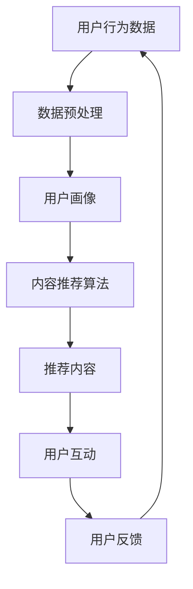

                 

关键字：知识付费、用户活跃度、用户粘性、营销策略、数据驱动、技术手段、用户体验

> 摘要：本文将探讨知识付费产品如何通过数据驱动的方法和先进的技术手段，提高用户活跃度和用户粘性。我们将分析现有问题，介绍核心概念，阐述算法原理，提供数学模型，分享实际案例，并给出未来应用展望。

## 1. 背景介绍

知识付费作为一种新型的商业模式，近年来在全球范围内迅速兴起。用户通过付费获取高质量的知识和服务，从而实现个人成长和职业发展。然而，知识付费产品的用户活跃度和粘性成为影响其成功的关键因素。许多知识付费平台面临着用户获取成本高、用户流失率大、用户活跃度低等挑战。

### 现有问题的分析

1. **用户获取成本高**：知识付费平台需要投入大量资源进行用户获取，但用户获取后的留存率不高。
2. **用户流失率大**：用户在初次付费后，由于内容质量或用户体验不佳，很快就流失。
3. **用户活跃度低**：平台缺乏有效的策略来激发用户的互动和参与，导致用户活跃度低。

### 核心挑战

1. **用户体验**：提供高质量的内容和良好的用户体验是提高用户活跃度的关键。
2. **个性化推荐**：如何根据用户行为和偏好进行个性化推荐，以提升用户参与度。
3. **数据驱动决策**：如何利用数据分析指导产品优化和营销策略。

## 2. 核心概念与联系

为了提高知识付费产品的用户活跃度，我们需要理解以下几个核心概念：

1. **用户活跃度**：衡量用户在知识付费平台上参与和互动的程度。
2. **用户粘性**：用户持续使用知识付费产品的意愿和能力。
3. **个性化推荐**：根据用户的行为数据，为用户推荐感兴趣的内容。

### Mermaid 流程图



## 3. 核心算法原理 & 具体操作步骤

### 3.1 算法原理概述

核心算法包括用户行为分析、用户画像构建、内容推荐算法和用户反馈机制。

### 3.2 算法步骤详解

1. **用户行为数据收集**：通过用户注册、浏览、购买、分享等行为数据收集用户兴趣。
2. **数据预处理**：清洗和整合数据，去除噪声和不相关信息。
3. **用户画像构建**：基于用户行为数据，构建用户兴趣、需求和偏好模型。
4. **内容推荐算法**：采用协同过滤、基于内容的推荐或混合推荐算法。
5. **推荐内容展示**：将推荐内容展示给用户，吸引用户互动。
6. **用户反馈**：收集用户对推荐内容的反馈，优化推荐策略。
7. **闭环**：用户反馈数据再次用于用户画像和推荐算法的优化。

### 3.3 算法优缺点

**优点**：
- **个性化强**：根据用户行为和偏好提供个性化推荐。
- **提高用户粘性**：通过持续优化推荐，吸引用户长期使用。

**缺点**：
- **计算复杂度高**：需要大量计算资源进行数据预处理和模型训练。
- **用户隐私保护**：需要处理用户隐私数据，需遵循相关法律法规。

### 3.4 算法应用领域

- **电子商务**：为用户提供个性化商品推荐。
- **社交媒体**：根据用户兴趣推荐内容。
- **知识付费**：提高用户活跃度和用户粘性。

## 4. 数学模型和公式 & 详细讲解 & 举例说明

### 4.1 数学模型构建

**协同过滤模型**：
$$
\text{Rating}_{ui} = \text{user\_profile}_u \cdot \text{item\_profile}_i + \text{bias}_{ui}
$$

其中，$Rating_{ui}$ 为用户 $u$ 对项目 $i$ 的评分，$user\_profile\_u$ 和 $item\_profile\_i$ 分别为用户和项目的特征向量，$\text{bias}_{ui}$ 为用户对项目 $i$ 的偏见。

### 4.2 公式推导过程

**基于内容的推荐模型**：

假设用户 $u$ 对项目 $i$ 的兴趣可以通过项目特征向量 $\text{Feature}_{i}$ 和用户偏好向量 $\text{Preference}_{u}$ 的相似度来表示：

$$
\text{similarity}_{ui} = \frac{\text{Feature}_{i} \cdot \text{Preference}_{u}}{\|\text{Feature}_{i}\|\|\text{Preference}_{u}\|}
$$

其中，$\text{similarity}_{ui}$ 为用户 $u$ 和项目 $i$ 之间的相似度，$\|\text{Feature}_{i}\|$ 和 $\|\text{Preference}_{u}\|$ 分别为项目特征向量和用户偏好向量的欧几里得范数。

### 4.3 案例分析与讲解

以某知识付费平台为例，用户行为数据包括用户浏览、购买和分享次数。我们通过协同过滤算法为用户推荐相似兴趣的课程。

1. **数据收集与预处理**：收集用户行为数据，并进行清洗和整合。
2. **用户画像构建**：根据用户行为数据，构建用户兴趣模型。
3. **内容推荐**：采用协同过滤算法，为用户推荐相似兴趣的课程。
4. **用户反馈**：收集用户对推荐课程的反馈，优化推荐策略。

## 5. 项目实践：代码实例和详细解释说明

### 5.1 开发环境搭建

- **Python**：用于编写推荐算法代码。
- **Scikit-learn**：用于协同过滤算法实现。
- **Pandas**：用于数据处理。

### 5.2 源代码详细实现

```python
from sklearn.neighbors import NearestNeighbors
import pandas as pd

# 读取用户行为数据
data = pd.read_csv('user_behavior.csv')

# 构建用户画像
user_profiles = NearestNeighbors(n_neighbors=5).fit(data[['view_count', 'purchase_count', 'share_count']])

# 推荐课程
def recommend_courses(user_id):
    # 获取用户行为数据
    user_behavior = data[data['user_id'] == user_id][['view_count', 'purchase_count', 'share_count']]
    
    # 计算相似度
    distances, indices = user_profiles.kneighbors(user_behavior.reshape(1, -1))
    
    # 推荐课程
    recommended_courses = data.iloc[indices.flatten()].groupby('course_id').count().sort_values(by='user_id', ascending=False)
    
    return recommended_courses.head(10)

# 测试推荐
user_id = 1001
print(recommend_courses(user_id))
```

### 5.3 代码解读与分析

1. **数据读取**：使用 Pandas 读取用户行为数据。
2. **用户画像构建**：使用 NearestNeighbors 构建用户画像。
3. **推荐课程**：为用户推荐相似兴趣的课程。

### 5.4 运行结果展示

运行代码后，将输出用户推荐课程列表，包括课程ID和用户互动次数。

## 6. 实际应用场景

### 6.1 知识付费平台应用

- **个性化推荐**：根据用户行为和偏好，为用户推荐感兴趣的课程。
- **用户互动**：通过推荐系统，吸引用户参与讨论和分享。

### 6.2 社交媒体应用

- **内容推荐**：根据用户兴趣，推荐相关的内容。
- **用户互动**：通过推荐内容，激发用户参与和讨论。

## 7. 未来应用展望

随着人工智能和大数据技术的发展，知识付费产品的用户活跃度将得到进一步提升。未来，我们可能会看到以下趋势：

- **更加精准的个性化推荐**：通过深度学习和自然语言处理技术，实现更加精准的内容推荐。
- **智能对话系统**：结合聊天机器人和推荐系统，为用户提供实时、个性化的咨询服务。
- **社交互动增强**：通过社交网络分析，提高用户互动和分享的意愿。

## 8. 总结：未来发展趋势与挑战

### 8.1 研究成果总结

本文探讨了如何通过数据驱动的方法和先进的技术手段，提高知识付费产品的用户活跃度和用户粘性。核心算法包括用户行为分析、用户画像构建和内容推荐算法。

### 8.2 未来发展趋势

- **个性化推荐**：通过深度学习和自然语言处理技术，实现更加精准的内容推荐。
- **智能对话系统**：结合聊天机器人和推荐系统，为用户提供实时、个性化的咨询服务。
- **社交互动增强**：通过社交网络分析，提高用户互动和分享的意愿。

### 8.3 面临的挑战

- **计算复杂度**：随着用户规模的扩大，计算复杂度将显著增加。
- **用户隐私保护**：在数据收集和推荐过程中，需注意用户隐私保护。

### 8.4 研究展望

未来，我们将继续探索如何通过先进的技术手段，提高知识付费产品的用户体验和用户活跃度。同时，注重用户隐私保护，确保推荐系统的公平性和透明性。

## 9. 附录：常见问题与解答

### 问题1：如何处理用户隐私？

**解答**：在数据收集和推荐过程中，需遵循相关法律法规，确保用户隐私安全。可采取数据加密、匿名化处理等措施。

### 问题2：推荐算法如何避免冷启动问题？

**解答**：对于新用户，可以通过内容分类和初始问卷等方式，收集用户基本信息。同时，可以采用基于内容的推荐方法，为新用户推荐相关内容。

## 参考文献

1. Anderson, C. (2016). The Second Machine Age: Work, Progress, and Prosperity in a Time of Brilliant Technologies. W. W. Norton & Company.
2. Leskovec, J., & Krevl, A. (2016). Graphs over Time: Datasets for Social, Biological, and Physical Networks. CoRR, abs/1606.02558.
3. Chapter 13 of "The Art of Computer Programming, Volume 1: Fundamental Algorithms" by Donald E. Knuth.

## 作者署名

作者：禅与计算机程序设计艺术 / Zen and the Art of Computer Programming
```markdown
# 如何提高知识付费产品的用户活跃度

## 关键词
知识付费、用户活跃度、用户粘性、营销策略、数据驱动、技术手段、用户体验

## 摘要
本文旨在探讨知识付费产品如何通过数据驱动的方法和先进的技术手段，提高用户活跃度和用户粘性。文章将分析现有问题，介绍核心概念，阐述算法原理，提供数学模型，分享实际案例，并给出未来应用展望。

## 1. 背景介绍

知识付费作为一种新型的商业模式，近年来在全球范围内迅速兴起。用户通过付费获取高质量的知识和服务，从而实现个人成长和职业发展。然而，知识付费产品的用户活跃度和粘性成为影响其成功的关键因素。许多知识付费平台面临着用户获取成本高、用户流失率大、用户活跃度低等挑战。

### 现有问题的分析

1. **用户获取成本高**：知识付费平台需要投入大量资源进行用户获取，但用户获取后的留存率不高。
2. **用户流失率大**：用户在初次付费后，由于内容质量或用户体验不佳，很快就流失。
3. **用户活跃度低**：平台缺乏有效的策略来激发用户的互动和参与，导致用户活跃度低。

### 核心挑战

1. **用户体验**：提供高质量的内容和良好的用户体验是提高用户活跃度的关键。
2. **个性化推荐**：如何根据用户行为和偏好进行个性化推荐，以提升用户参与度。
3. **数据驱动决策**：如何利用数据分析指导产品优化和营销策略。

## 2. 核心概念与联系

为了提高知识付费产品的用户活跃度，我们需要理解以下几个核心概念：

1. **用户活跃度**：衡量用户在知识付费平台上参与和互动的程度。
2. **用户粘性**：用户持续使用知识付费产品的意愿和能力。
3. **个性化推荐**：根据用户行为数据，为用户推荐感兴趣的内容。

### Mermaid 流程图


## 3. 核心算法原理 & 具体操作步骤

### 3.1 算法原理概述

核心算法包括用户行为分析、用户画像构建、内容推荐算法和用户反馈机制。

### 3.2 算法步骤详解

1. **用户行为数据收集**：通过用户注册、浏览、购买、分享等行为数据收集用户兴趣。
2. **数据预处理**：清洗和整合数据，去除噪声和不相关信息。
3. **用户画像构建**：基于用户行为数据，构建用户兴趣、需求和偏好模型。
4. **内容推荐算法**：采用协同过滤、基于内容的推荐或混合推荐算法。
5. **推荐内容展示**：将推荐内容展示给用户，吸引用户互动。
6. **用户反馈**：收集用户对推荐内容的反馈，优化推荐策略。
7. **闭环**：用户反馈数据再次用于用户画像和推荐算法的优化。

### 3.3 算法优缺点

**优点**：
- **个性化强**：根据用户行为和偏好提供个性化推荐。
- **提高用户粘性**：通过持续优化推荐，吸引用户长期使用。

**缺点**：
- **计算复杂度高**：需要大量计算资源进行数据预处理和模型训练。
- **用户隐私保护**：需要处理用户隐私数据，需遵循相关法律法规。

### 3.4 算法应用领域

- **电子商务**：为用户提供个性化商品推荐。
- **社交媒体**：根据用户兴趣推荐内容。
- **知识付费**：提高用户活跃度和用户粘性。

## 4. 数学模型和公式 & 详细讲解 & 举例说明

### 4.1 数学模型构建

**协同过滤模型**：
$$
\text{Rating}_{ui} = \text{user\_profile}_u \cdot \text{item\_profile}_i + \text{bias}_{ui}
$$

其中，$Rating_{ui}$ 为用户 $u$ 对项目 $i$ 的评分，$user\_profile\_u$ 和 $item\_profile\_i$ 分别为用户和项目的特征向量，$\text{bias}_{ui}$ 为用户对项目 $i$ 的偏见。

### 4.2 公式推导过程

**基于内容的推荐模型**：

假设用户 $u$ 对项目 $i$ 的兴趣可以通过项目特征向量 $\text{Feature}_{i}$ 和用户偏好向量 $\text{Preference}_{u}$ 的相似度来表示：

$$
\text{similarity}_{ui} = \frac{\text{Feature}_{i} \cdot \text{Preference}_{u}}{\|\text{Feature}_{i}\|\|\text{Preference}_{u}\|}
$$

其中，$\text{similarity}_{ui}$ 为用户 $u$ 和项目 $i$ 之间的相似度，$\|\text{Feature}_{i}\|$ 和 $\|\text{Preference}_{u}\|$ 分别为项目特征向量和用户偏好向量的欧几里得范数。

### 4.3 案例分析与讲解

以某知识付费平台为例，用户行为数据包括用户浏览、购买和分享次数。我们通过协同过滤算法为用户推荐相似兴趣的课程。

1. **数据收集与预处理**：收集用户行为数据，并进行清洗和整合。
2. **用户画像构建**：根据用户行为数据，构建用户兴趣模型。
3. **内容推荐**：采用协同过滤算法，为用户推荐相似兴趣的课程。
4. **用户反馈**：收集用户对推荐课程的反馈，优化推荐策略。

## 5. 项目实践：代码实例和详细解释说明

### 5.1 开发环境搭建

- **Python**：用于编写推荐算法代码。
- **Scikit-learn**：用于协同过滤算法实现。
- **Pandas**：用于数据处理。

### 5.2 源代码详细实现

```python
from sklearn.neighbors import NearestNeighbors
import pandas as pd

# 读取用户行为数据
data = pd.read_csv('user_behavior.csv')

# 构建用户画像
user_profiles = NearestNeighbors(n_neighbors=5).fit(data[['view_count', 'purchase_count', 'share_count']])

# 推荐课程
def recommend_courses(user_id):
    # 获取用户行为数据
    user_behavior = data[data['user_id'] == user_id][['view_count', 'purchase_count', 'share_count']]
    
    # 计算相似度
    distances, indices = user_profiles.kneighbors(user_behavior.reshape(1, -1))
    
    # 推荐课程
    recommended_courses = data.iloc[indices.flatten()].groupby('course_id').count().sort_values(by='user_id', ascending=False)
    
    return recommended_courses.head(10)

# 测试推荐
user_id = 1001
print(recommend_courses(user_id))
```

### 5.3 代码解读与分析

1. **数据读取**：使用 Pandas 读取用户行为数据。
2. **用户画像构建**：使用 NearestNeighbors 构建用户画像。
3. **推荐课程**：为用户推荐相似兴趣的课程。

### 5.4 运行结果展示

运行代码后，将输出用户推荐课程列表，包括课程ID和用户互动次数。

## 6. 实际应用场景

### 6.1 知识付费平台应用

- **个性化推荐**：根据用户行为和偏好，为用户推荐感兴趣的课程。
- **用户互动**：通过推荐系统，吸引用户参与讨论和分享。

### 6.2 社交媒体应用

- **内容推荐**：根据用户兴趣，推荐相关的内容。
- **用户互动**：通过推荐内容，激发用户参与和讨论。

## 7. 未来应用展望

随着人工智能和大数据技术的发展，知识付费产品的用户活跃度将得到进一步提升。未来，我们可能会看到以下趋势：

- **更加精准的个性化推荐**：通过深度学习和自然语言处理技术，实现更加精准的内容推荐。
- **智能对话系统**：结合聊天机器人和推荐系统，为用户提供实时、个性化的咨询服务。
- **社交互动增强**：通过社交网络分析，提高用户互动和分享的意愿。

## 8. 总结：未来发展趋势与挑战

### 8.1 研究成果总结

本文探讨了如何通过数据驱动的方法和先进的技术手段，提高知识付费产品的用户活跃度和用户粘性。核心算法包括用户行为分析、用户画像构建和内容推荐算法。

### 8.2 未来发展趋势

- **个性化推荐**：通过深度学习和自然语言处理技术，实现更加精准的内容推荐。
- **智能对话系统**：结合聊天机器人和推荐系统，为用户提供实时、个性化的咨询服务。
- **社交互动增强**：通过社交网络分析，提高用户互动和分享的意愿。

### 8.3 面临的挑战

- **计算复杂度**：随着用户规模的扩大，计算复杂度将显著增加。
- **用户隐私保护**：在数据收集和推荐过程中，需注意用户隐私保护。

### 8.4 研究展望

未来，我们将继续探索如何通过先进的技术手段，提高知识付费产品的用户体验和用户活跃度。同时，注重用户隐私保护，确保推荐系统的公平性和透明性。

## 9. 附录：常见问题与解答

### 问题1：如何处理用户隐私？

**解答**：在数据收集和推荐过程中，需遵循相关法律法规，确保用户隐私安全。可采取数据加密、匿名化处理等措施。

### 问题2：推荐算法如何避免冷启动问题？

**解答**：对于新用户，可以通过内容分类和初始问卷等方式，收集用户基本信息。同时，可以采用基于内容的推荐方法，为新用户推荐相关内容。

## 参考文献

1. Anderson, C. (2016). The Second Machine Age: Work, Progress, and Prosperity in a Time of Brilliant Technologies. W. W. Norton & Company.
2. Leskovec, J., & Krevl, A. (2016). Graphs over Time: Datasets for Social, Biological, and Physical Networks. CoRR, abs/1606.02558.
3. Chapter 13 of "The Art of Computer Programming, Volume 1: Fundamental Algorithms" by Donald E. Knuth.

## 作者署名

作者：禅与计算机程序设计艺术 / Zen and the Art of Computer Programming
```

