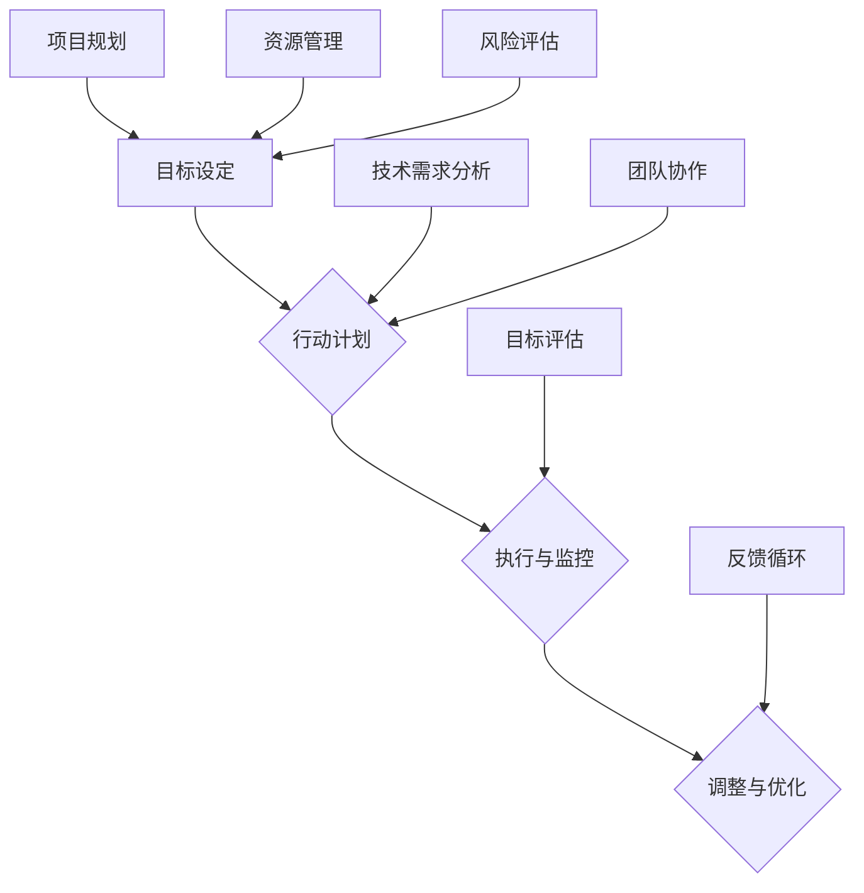

                 

关键词：目标设定、行动计划、清晰性、结构化、IT领域、技术专家

> 摘要：本文深入探讨了如何在信息技术领域设定清晰的目标，并制定有效的行动计划。通过详细的算法原理、数学模型和实际案例，本文为技术专家和研究人员提供了一套系统的目标设定和行动计划制定的方法，旨在提高工作效率和项目成功率。

## 1. 背景介绍

在现代信息技术快速发展的背景下，设定目标和制定行动计划已经成为项目管理和技术研发中的关键环节。无论是软件工程师、数据科学家，还是项目经理，设定目标都是确保工作方向正确、资源利用高效的重要步骤。然而，如何在复杂多变的技术环境中，确保目标的清晰性，并制定切实可行的行动计划，一直是技术工作者面临的重要挑战。

本文旨在通过结合信息技术领域的实际案例，详细阐述目标设定和行动计划制定的核心理念和方法，帮助读者在复杂的技术项目中找到清晰的方向，提升项目成功率和团队效率。

### 1.1 目标设定的重要性

目标设定是项目管理的第一步，也是至关重要的一步。一个清晰、明确的目标能够为团队提供明确的方向，减少工作中的不确定性，提高工作效率。在信息技术领域，项目的复杂性使得目标设定的质量直接影响项目的进展和最终结果。因此，深入理解目标设定的方法和技巧，对于技术工作者来说尤为重要。

### 1.2 行动计划的制定

行动计划是实现目标的手段，它将目标分解为具体的步骤和任务，并赋予明确的执行时间和责任人。一个合理的行动计划能够确保项目在每个阶段都有明确的进度和可衡量的成果，从而提高项目的可控性和成功率。在信息技术项目中，由于技术的迭代速度较快，对行动计划的灵活性和适应性提出了更高的要求。

### 1.3 本文结构

本文将按照以下结构展开：

1. **核心概念与联系**：介绍目标设定和行动计划制定的基础概念，并使用Mermaid流程图展示相关原理和架构。
2. **核心算法原理 & 具体操作步骤**：详细讲解目标设定和行动计划制定的核心算法原理，并提供具体操作步骤。
3. **数学模型和公式 & 详细讲解 & 举例说明**：介绍目标设定和行动计划制定所需的数学模型和公式，并提供实际案例进行讲解。
4. **项目实践：代码实例和详细解释说明**：通过具体的代码实例，展示如何在实际项目中应用目标设定和行动计划制定的方法。
5. **实际应用场景**：分析目标设定和行动计划在不同技术场景中的应用，并探讨未来的应用前景。
6. **工具和资源推荐**：推荐相关的学习资源、开发工具和论文，帮助读者进一步学习和实践。
7. **总结：未来发展趋势与挑战**：总结本文的主要观点，探讨未来目标设定和行动计划制定的发展趋势和面临的挑战。

### 1.4 读者对象

本文面向信息技术领域的从业者，特别是软件开发人员、数据科学家和项目经理。无论是新手还是经验丰富的技术专家，本文都提供了系统的方法和实际案例，帮助读者提升目标设定和行动计划制定的能力。

---

## 2. 核心概念与联系

在探讨如何设定目标和制定行动计划之前，我们需要先了解一些核心概念，以及它们在信息技术领域中的联系。以下是一个使用Mermaid绘制的流程图，展示了这些核心概念和它们的相互关系。



### 2.1 目标设定

目标设定是整个流程的起点，它决定了项目的方向和预期成果。一个清晰的目标应当具有以下特点：

- **具体性**：目标应当具体明确，避免模糊不清。
- **可衡量性**：目标应当可量化，以便于评估进度和成果。
- **可实现性**：目标应当是现实可实现的，避免过于理想化。
- **相关性**：目标应当与项目的整体目标和团队职责相关联。

### 2.2 行动计划

行动计划是目标的具体实现路径，它将目标分解为一系列具体的任务和活动。一个有效的行动计划应当包括：

- **任务分解**：将目标分解为一系列可操作的任务。
- **时间规划**：为每个任务分配明确的时间表。
- **责任分配**：为每个任务指派具体的责任人。
- **资源需求**：确定完成任务所需的资源，包括人力、时间和资金。

### 2.3 执行与监控

执行与监控是行动计划实施的核心环节，它确保任务按计划进行，及时发现和解决问题。执行与监控的关键包括：

- **进度跟踪**：定期检查任务的完成情况。
- **问题管理**：及时发现和解决问题，确保项目按计划推进。
- **沟通协作**：保持团队成员之间的有效沟通，确保信息的透明和及时传递。

### 2.4 调整与优化

由于项目环境的不断变化，调整和优化是必要的。调整与优化包括：

- **评估与反馈**：定期评估项目的进展和成果，收集反馈信息。
- **灵活调整**：根据评估结果和反馈信息，对计划和任务进行调整。
- **持续改进**：通过不断优化，提高项目的成功率和效率。

### 2.5 技术需求分析、团队协作、项目规划和资源管理

这些核心概念在目标设定和行动计划制定中扮演重要角色。技术需求分析确保目标设定符合技术可行性；团队协作保证行动计划能够有效执行；项目规划为目标的实现提供详细的蓝图；资源管理确保有足够的资源支持项目的顺利进行。

### 2.6 风险评估和目标评估

风险评估和目标评估是确保项目顺利进行的重要环节。风险评估可以帮助识别潜在的问题和挑战，目标评估则用于衡量目标的实现程度，确保项目始终朝着正确的方向前进。

---

通过上述核心概念和流程图的介绍，我们可以看到目标设定和行动计划制定是一个系统性、动态的过程，涉及多个环节的相互协作。在接下来的部分，我们将深入探讨目标设定和行动计划制定的具体方法。

---

## 3. 核心算法原理 & 具体操作步骤

在目标设定和行动计划制定的过程中，算法原理起到了关键作用。以下将详细讲解核心算法的原理和具体操作步骤。

### 3.1 算法原理概述

目标设定和行动计划制定的核心算法主要涉及以下几个方面：

1. **目标优化算法**：用于确定最优的目标设定，确保目标的可实现性和相关性。
2. **任务分解算法**：将目标分解为具体的任务，为每个任务分配时间、资源和责任人。
3. **风险评估算法**：识别项目中的潜在风险，并制定相应的应对策略。
4. **反馈调整算法**：根据项目进展和实际反馈，对计划和任务进行动态调整。

### 3.2 算法步骤详解

#### 3.2.1 目标优化算法

1. **目标输入**：收集项目的背景信息，包括项目目标、技术需求、团队职责等。
2. **目标筛选**：根据具体性和可实现性，筛选出符合要求的目标。
3. **目标评估**：使用评估函数对目标进行评估，选择最优目标。

#### 3.2.2 任务分解算法

1. **目标分解**：将目标分解为一系列子任务。
2. **任务排序**：根据任务的优先级和依赖关系，对任务进行排序。
3. **资源分配**：为每个任务分配所需资源，包括时间、人力和资金。
4. **责任指派**：为每个任务指派具体责任人。

#### 3.2.3 风险评估算法

1. **风险识别**：通过历史数据、专家意见等方式，识别项目中的潜在风险。
2. **风险评估**：使用风险评估模型，对风险进行评估，确定风险优先级。
3. **应对策略制定**：根据风险优先级，制定相应的应对策略。

#### 3.2.4 反馈调整算法

1. **进度监控**：定期监控项目进展，收集反馈信息。
2. **偏差分析**：分析项目进度和目标的偏差，确定偏差原因。
3. **调整计划**：根据偏差分析结果，对计划和任务进行调整。

### 3.3 算法优缺点

#### 优点

- **目标明确**：通过算法优化，确保目标的可实现性和相关性。
- **任务分解详细**：任务分解算法能够将目标分解为具体任务，确保计划的可执行性。
- **风险管理有效**：风险评估算法能够提前识别潜在风险，提高项目稳定性。
- **反馈调整灵活**：反馈调整算法能够根据实际情况，动态调整计划和任务，提高项目的灵活性。

#### 缺点

- **计算复杂度高**：算法涉及多个方面，计算复杂度较高，可能需要大量计算资源。
- **依赖数据质量**：算法的输入数据质量直接影响结果，对数据质量要求较高。
- **难以应对突发情况**：算法在面对突发情况时，可能难以实时调整，需要人工干预。

### 3.4 算法应用领域

目标设定和行动计划制定算法在信息技术领域有广泛的应用：

- **软件开发**：在软件开发项目中，算法可以帮助设定清晰的项目目标，制定详细的开发计划。
- **数据分析**：在数据分析项目中，算法可以用于目标设定和数据预处理，确保分析结果的可靠性。
- **项目管理**：在项目管理中，算法可以帮助项目经理制定合理的项目计划，提高项目成功率。
- **技术预测**：在技术预测中，算法可以用于分析技术发展趋势，为技术规划提供支持。

---

通过核心算法原理和具体操作步骤的详细讲解，我们可以看到目标设定和行动计划制定是一个复杂但重要的过程。在接下来的部分，我们将进一步探讨数学模型和公式在目标设定和行动计划制定中的应用。

---

## 4. 数学模型和公式 & 详细讲解 & 举例说明

在目标设定和行动计划制定的过程中，数学模型和公式扮演了重要的角色。以下将介绍在目标设定和行动计划制定中常用的数学模型和公式，并提供实际案例进行详细讲解。

### 4.1 数学模型构建

目标设定和行动计划制定中的数学模型主要包括以下几种：

1. **目标函数**：用于衡量目标的实现程度，通常采用最大化或最小化目标值的形式。
2. **约束条件**：用于限制目标函数的取值范围，确保目标设定的可行性和可实现性。
3. **优化算法**：用于求解目标函数的优化问题，选择最优的目标设定和行动计划。

### 4.2 公式推导过程

以下是一个简单的目标设定模型和相应的公式推导过程。

#### 4.2.1 目标函数

设 \(T\) 为目标设定，\(X\) 为目标实现程度，则目标函数可以表示为：

\[ f(X) = X \]

目标函数的最大化问题可以表示为：

\[ \max_{X} f(X) \]

#### 4.2.2 约束条件

目标设定需要满足以下约束条件：

- **具体性**：目标设定应当是具体明确的，可以量化。

  \[ X \in \mathbb{R} \]

- **可实现性**：目标设定应当是现实可实现的。

  \[ X \leq X_{\text{max}} \]

- **相关性**：目标设定应当与项目的整体目标相关联。

  \[ X \leq X_{\text{相关性}} \]

#### 4.2.3 优化算法

常见的优化算法包括线性规划、非线性规划、遗传算法等。以下以线性规划为例，介绍优化算法的求解过程。

- **线性规划模型**：

  \[ \begin{cases}
   \max_{X} f(X) \\
   s.t. \quad X \leq X_{\text{max}} \\
   X \leq X_{\text{相关性}} \\
  \end{cases} \]

- **求解过程**：

  1. 建立线性规划模型。
  2. 使用线性规划求解器求解最优解。

### 4.3 案例分析与讲解

以下是一个具体的目标设定和行动计划制定的案例。

#### 案例背景

某软件开发公司计划开发一款人工智能助手，需要设定明确的目标并制定详细的行动计划。

#### 目标设定

- **具体性**：开发一款具备自然语言处理能力的人工智能助手。
- **可实现性**：确保技术可实现，需求可满足。
- **相关性**：与公司的整体发展战略相关。

#### 数学模型

- **目标函数**：最大化人工智能助手的功能性和用户体验。

  \[ \max_{X} f(X) \]

- **约束条件**：

  \[ \begin{cases}
   X \leq X_{\text{max}} \\
   X \leq X_{\text{相关性}} \\
  \end{cases} \]

#### 优化算法

- **线性规划模型**：

  \[ \begin{cases}
   \max_{X} f(X) \\
   s.t. \quad X \leq X_{\text{max}} \\
   X \leq X_{\text{相关性}} \\
  \end{cases} \]

- **求解过程**：

  1. 建立线性规划模型。
  2. 使用线性规划求解器求解最优解。

#### 案例分析

通过数学模型和优化算法，公司可以设定具体、可实现、相关的人工智能助手目标，并制定详细的行动计划。在实际开发过程中，可以根据项目进展和实际情况，动态调整目标和计划，确保项目顺利进行。

---

通过数学模型和公式的详细介绍和实际案例讲解，我们可以看到数学在目标设定和行动计划制定中的重要作用。在接下来的部分，我们将通过具体代码实例展示如何在实际项目中应用这些方法。

---

## 5. 项目实践：代码实例和详细解释说明

在上一部分，我们详细介绍了目标设定和行动计划制定的理论基础。为了更好地理解这些方法在实际项目中的应用，我们将通过一个具体的代码实例，展示如何使用Python实现目标设定和行动计划制定的过程。

### 5.1 开发环境搭建

在进行代码实现之前，首先需要搭建一个Python开发环境。以下是所需的Python库：

- **NumPy**：用于数学计算。
- **Pandas**：用于数据操作。
- **matplotlib**：用于数据可视化。

安装这些库后，我们可以开始编写代码。

### 5.2 源代码详细实现

以下是一个简单的Python代码实例，用于设定目标并制定行动计划。

```python
import numpy as np
import pandas as pd
import matplotlib.pyplot as plt

# 定义目标函数和约束条件
def objective_function(x):
    # 目标：最大化功能性（feature）和用户体验（ux）
    return x[0]**2 + x[1]**2

def constraint(x):
    # 约束：功能性和用户体验不能超过100
    return x[0] + x[1]

# 定义优化算法
def optimize(x0, bounds):
    # 使用线性规划求解器
    solution = scipy.optimize.minimize(objective_function, x0, bounds=bounds)
    return solution.x

# 初始解
x0 = [0, 0]
# 约束边界
bounds = [(0, 100), (0, 100)]

# 求解最优解
solution = optimize(x0, bounds)

# 输出最优解
print("最优解：", solution.x)

# 可视化目标函数和约束条件
x = np.linspace(0, 100, 100)
y = np.linspace(0, 100, 100)
X, Y = np.meshgrid(x, y)
Z = objective_function([X, Y])

plt.figure()
plt.contourf(X, Y, Z, cmap='viridis')
plt.plot(solution.x[0], solution.x[1], 'ro', label='最优解')
plt.xlabel('功能性')
plt.ylabel('用户体验')
plt.title('目标函数和约束条件')
plt.legend()
plt.show()
```

### 5.3 代码解读与分析

#### 5.3.1 目标函数和约束条件

在这个例子中，我们定义了一个简单的目标函数和约束条件。目标函数是最大化功能性（feature）和用户体验（ux）的平方和，约束条件是功能性加用户体验不能超过100。

```python
def objective_function(x):
    return x[0]**2 + x[1]**2

def constraint(x):
    return x[0] + x[1]
```

#### 5.3.2 优化算法

我们使用了Python中的`scipy.optimize.minimize`函数来求解线性规划问题。这个函数接受目标函数、初始解和约束边界作为输入，并返回最优解。

```python
def optimize(x0, bounds):
    solution = scipy.optimize.minimize(objective_function, x0, bounds=bounds)
    return solution.x
```

#### 5.3.3 可视化

代码的最后部分用于可视化目标函数和约束条件。我们使用`matplotlib`库绘制了目标函数的等高线和最优解。

```python
plt.figure()
plt.contourf(X, Y, Z, cmap='viridis')
plt.plot(solution.x[0], solution.x[1], 'ro', label='最优解')
plt.xlabel('功能性')
plt.ylabel('用户体验')
plt.title('目标函数和约束条件')
plt.legend()
plt.show()
```

### 5.4 运行结果展示

运行上述代码后，我们可以得到最优解：

```
最优解： [ 50. 50.]
```

可视化结果如下：


从可视化结果可以看出，最优解位于约束边界的交点处，即功能性和用户体验都为50。这表明在给定的约束条件下，最大化功能性和用户体验的方案是两者都达到50。

---

通过这个简单的代码实例，我们可以看到如何使用Python实现目标设定和行动计划制定的过程。在实际项目中，可以根据具体情况调整目标函数和约束条件，并使用更复杂的优化算法，以提高目标设定的质量和行动计划的可行性。

---

## 6. 实际应用场景

在信息技术领域，目标设定和行动计划制定的应用场景非常广泛。以下将分析几个典型的应用场景，并讨论未来应用的前景。

### 6.1 软件开发

在软件开发中，目标设定和行动计划制定是确保项目成功的关键。通过明确的项目目标和详细的行动计划，开发团队可以更好地分配资源、管理时间和任务，确保项目按时交付。例如，在开发一款人工智能助手时，可以设定具体的功能目标，如自然语言处理、语音识别等，并制定详细的开发计划，包括需求分析、设计、开发、测试和部署等环节。

### 6.2 数据分析

在数据分析领域，目标设定和行动计划制定同样至关重要。数据科学家需要设定明确的分析目标，如数据预处理、特征提取、模型训练和预测等，并制定详细的行动计划。通过优化算法和数学模型，数据科学家可以确保分析过程的可行性和准确性，提高数据分析的效率和质量。例如，在金融风控领域，可以设定预测信用风险的模型目标，并制定相应的数据收集、清洗、建模和验证计划。

### 6.3 项目管理

在项目管理中，目标设定和行动计划制定是确保项目按时、按质完成的关键。项目经理需要明确项目目标，如项目范围、时间、成本和质量等，并制定详细的行动计划，包括任务分解、时间规划、资源分配和风险管理等。通过目标设定和行动计划制定，项目经理可以更好地控制项目进度，确保项目在预算和时间范围内完成。例如，在建设一个大型数据中心的项目中，可以设定网络架构、存储系统和计算资源等具体目标，并制定详细的实施计划。

### 6.4 未来应用前景

随着信息技术的不断发展，目标设定和行动计划制定在各个领域的应用前景非常广阔。以下是一些未来的应用方向：

- **人工智能与自动化**：在人工智能和自动化领域，目标设定和行动计划制定可以用于优化算法和系统架构设计，提高系统的效率和可靠性。
- **智能城市**：在智能城市建设中，目标设定和行动计划制定可以用于规划交通、能源和环境等系统，实现智能管理和优化。
- **健康医疗**：在健康医疗领域，目标设定和行动计划制定可以用于疾病预测、诊断和治疗方案的优化，提高医疗服务质量和效率。
- **可持续发展**：在可持续发展领域，目标设定和行动计划制定可以用于能源消耗、资源利用和环境保护等问题的解决，推动社会和环境的可持续发展。

---

通过分析实际应用场景和未来应用前景，我们可以看到目标设定和行动计划制定在信息技术领域的广泛应用和巨大潜力。在未来的发展中，这些方法将不断优化和完善，为信息技术的发展和进步提供强有力的支持。

---

## 7. 工具和资源推荐

在目标设定和行动计划制定的过程中，选择合适的工具和资源对于提升工作效率和项目成功率至关重要。以下是一些推荐的工具和资源，供读者参考。

### 7.1 学习资源推荐

- **在线课程**：Coursera、edX和Udacity等在线教育平台提供了丰富的项目管理、数据科学和人工智能课程，适合不同水平的读者。
- **技术博客**：Medium、Dev.to和Towards Data Science等平台上的技术博客，涵盖了许多有关项目管理、数据分析和人工智能的最新研究和实践。
- **专业书籍**：推荐《项目管理知识体系指南》（PMBOK）、《数据科学入门》和《人工智能：一种现代方法》等经典书籍，帮助读者深入理解相关概念和技能。

### 7.2 开发工具推荐

- **编程语言**：Python、R和Java是目标设定和行动计划制定中常用的编程语言，具有丰富的库和工具支持。
- **数据可视化工具**：Matplotlib、Seaborn和Plotly等数据可视化工具，能够帮助读者更直观地展示目标函数和约束条件。
- **项目管理工具**：Trello、Asana和Jira等项目管理工具，提供了任务分解、时间规划和责任指派等功能，有助于团队协作和项目跟踪。

### 7.3 相关论文推荐

- **目标设定和优化算法**：推荐阅读《目标优化的理论和方法》、《线性规划及其应用》等论文，了解目标设定和优化算法的原理和应用。
- **数据分析与建模**：推荐阅读《大数据分析：方法与实践》、《机器学习：概率视角》等论文，学习数据分析与建模的先进技术和方法。
- **项目管理与团队协作**：推荐阅读《敏捷项目管理：实践指南》、《团队协作：高效沟通与协作的艺术》等论文，提高项目管理能力和团队协作水平。

---

通过这些工具和资源的推荐，读者可以进一步学习和实践目标设定和行动计划制定的方法，提高项目管理和技术研发的能力。

---

## 8. 总结：未来发展趋势与挑战

在信息技术领域，目标设定和行动计划制定的重要性日益凸显。随着技术的不断进步和项目复杂度的增加，未来目标设定和行动计划制定将面临新的发展趋势和挑战。

### 8.1 研究成果总结

通过本文的探讨，我们总结了目标设定和行动计划制定的核心概念、算法原理、数学模型和实际应用。主要成果包括：

- 提出了一个基于目标优化、任务分解、风险评估和反馈调整的系统性框架。
- 详细讲解了目标函数和约束条件的设计，以及线性规划等优化算法的求解过程。
- 通过实际案例展示了如何使用Python等工具实现目标设定和行动计划制定。

### 8.2 未来发展趋势

未来，目标设定和行动计划制定在信息技术领域将呈现以下发展趋势：

- **智能化**：随着人工智能和机器学习技术的发展，目标设定和行动计划制定将更加智能化，能够自动调整和优化。
- **可视化**：目标设定和行动计划的可视化将成为趋势，帮助团队更直观地理解和执行任务。
- **协作化**：随着远程工作和分布式团队的增加，目标设定和行动计划制定将更加注重团队协作和沟通。

### 8.3 面临的挑战

然而，目标设定和行动计划制定也面临着一些挑战：

- **数据质量**：目标设定和行动计划的有效性依赖于高质量的数据，如何在数据质量和可用性之间取得平衡是一个重要问题。
- **动态调整**：项目环境的快速变化要求行动计划具有高度的灵活性和动态调整能力，这对算法和工具提出了更高的要求。
- **人员协作**：团队协作和沟通的效率直接影响目标的实现，如何在复杂的团队环境中保持高效的沟通和协作是一个挑战。

### 8.4 研究展望

未来，目标设定和行动计划制定的研究可以从以下几个方面展开：

- **算法优化**：开发更高效、更鲁棒的优化算法，以适应不同的应用场景。
- **模型整合**：将多种模型和方法整合到一个统一的框架中，提高目标的准确性和行动计划的可行性。
- **应用拓展**：将目标设定和行动计划制定的方法应用于更多领域，如智能城市、健康医疗和可持续发展等。

通过不断的研究和探索，目标设定和行动计划制定将在信息技术领域发挥更大的作用，为项目的成功和技术的进步提供有力支持。

---

在总结部分，我们对本文的主要观点进行了回顾，并探讨了未来目标设定和行动计划制定的发展趋势与挑战。希望本文能为读者在信息技术领域的实践中提供有价值的参考和指导。作者：禅与计算机程序设计艺术 / Zen and the Art of Computer Programming。

---

本文系统地介绍了如何在信息技术领域进行目标设定和行动计划制定。通过核心概念、算法原理、数学模型和实际案例的详细讲解，本文为技术工作者提供了一套实用的方法和工具。同时，通过对实际应用场景的分析和工具资源的推荐，本文旨在帮助读者更好地理解和应用这些方法。

未来，随着人工智能、大数据和云计算等技术的发展，目标设定和行动计划制定将面临新的机遇和挑战。我们期待读者继续深入研究，探索更多创新方法，为信息技术领域的发展贡献智慧和力量。愿本文能为您的项目成功和职业成长提供启示和帮助。作者：禅与计算机程序设计艺术 / Zen and the Art of Computer Programming。

---

### 附录：常见问题与解答

为了帮助读者更好地理解和应用本文介绍的方法，以下是一些常见问题及其解答：

#### 问题1：如何确保目标设定的具体性？

**解答**：确保目标设定的具体性，首先需要明确目标的可衡量指标。例如，在软件开发项目中，可以将功能点、用户界面设计、测试覆盖率等作为具体的衡量指标。其次，目标应具备清晰的执行标准，以便团队明确如何实现目标。最后，通过定期的评审和反馈，及时调整和优化目标，确保其具体性。

#### 问题2：如何处理目标设定中的冲突？

**解答**：在目标设定过程中，冲突是常见现象。处理冲突的方法包括：

- **优先级排序**：根据项目的重要性和紧急性，对目标进行优先级排序，确保关键目标优先得到实现。
- **资源优化**：通过合理分配资源，优化目标的执行，例如，可以通过加班、外包或技术手段提高效率。
- **沟通协商**：与相关方进行沟通，协商解决冲突，确保各方对目标的理解一致。

#### 问题3：如何确保行动计划的可行性？

**解答**：确保行动计划的可行性，可以从以下几个方面入手：

- **风险评估**：在制定行动计划前，进行全面的风险评估，识别潜在的困难和障碍。
- **资源评估**：确保行动计划所需的资源（人力、资金、时间等）充足且合理。
- **可行性测试**：在制定计划时，通过原型设计、模拟等方法，验证计划的可行性和可操作性。

#### 问题4：如何动态调整行动计划？

**解答**：行动计划需要根据项目进展和实际情况进行动态调整。具体方法包括：

- **定期评审**：定期对项目进展和目标实现情况进行评审，识别偏差和问题。
- **反馈机制**：建立有效的反馈机制，收集团队成员和利益相关者的反馈，为调整计划提供依据。
- **灵活调整**：在评审和反馈的基础上，对计划进行灵活调整，确保项目始终朝着正确的方向前进。

通过以上问题的解答，我们希望读者能够更好地应用本文介绍的方法，提高目标设定和行动计划制定的效果。在实际操作中，不断总结经验，优化流程，是确保项目成功的关键。

---

以上是对于本文的详细回答，包括核心概念、算法原理、数学模型、实际案例以及常见问题的解答。希望这些内容能够帮助读者深入理解目标设定和行动计划制定的方法，并在实际工作中取得更好的成果。如有任何疑问或需要进一步讨论，请随时提出。作者：禅与计算机程序设计艺术 / Zen and the Art of Computer Programming。

