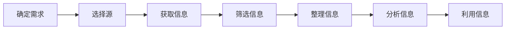

                 

在当今信息爆炸的时代，有效收集和利用信息成为了一项至关重要的技能。无论是科研、商业，还是日常生活，信息的获取和处理能力直接决定了个人和组织的竞争力。本文将探讨如何进行信息收集，特别是如何获取有效的信息和知识，以便为读者提供一套系统的、实用的方法。本文将从以下几个部分展开：

## 1. 背景介绍

### 信息收集的重要性

在快速变化的世界中，信息就是力量。正确、及时的信息可以帮助我们做出明智的决策，避免错误，抓住机遇。例如，在商业领域，市场调研和分析可以为企业提供宝贵的决策支持；在科研领域，及时掌握最新的研究进展可以加速创新过程。有效的信息收集不仅能够提升工作效率，还能帮助我们更好地理解世界。

### 信息过载的问题

尽管信息的重要性不言而喻，但我们也面临着信息过载的挑战。互联网、社交媒体、新闻媒体等渠道每天都会产生海量信息，这些信息往往质量参差不齐，甚至可能包含错误和误导。如何从这些海量信息中筛选出有价值的内容，成为了一个亟待解决的问题。

## 2. 核心概念与联系

### 信息收集的定义

信息收集是指通过各种渠道和方法获取数据、事实、知识和见解的过程。有效的信息收集不仅包括获取信息，还涉及对信息的筛选、整理、分析和利用。

### 信息收集的流程

信息收集通常包括以下几个步骤：

1. 确定信息需求
2. 选择信息源
3. 获取信息
4. 筛选信息
5. 整理信息
6. 分析信息
7. 利用信息

### Mermaid 流程图

以下是一个简单的 Mermaid 流程图，展示了信息收集的流程：



## 3. 核心算法原理 & 具体操作步骤

### 3.1 算法原理概述

信息收集的过程可以类比于数据挖掘，它涉及到一系列算法和技术。以下是几个核心算法原理：

1. 数据预处理：清洗、归一化和转换数据，以便于后续处理。
2. 数据筛选：使用过滤规则和算法，从大量数据中提取出有用的信息。
3. 数据分析：通过统计分析、机器学习等方法，对数据进行分析和解释。
4. 数据可视化：将分析结果以图表、图像等形式展示出来，便于理解和决策。

### 3.2 算法步骤详解

1. **确定信息需求**：明确收集信息的具体目标和目的，例如市场分析、竞争对手情报、用户反馈等。
2. **选择信息源**：根据需求选择合适的信息源，包括数据库、搜索引擎、社交媒体、专业报告等。
3. **获取信息**：使用API、爬虫、问卷调查等方法获取所需数据。
4. **筛选信息**：利用过滤规则和算法，去除无关和重复的信息，提取核心数据。
5. **整理信息**：对筛选后的数据进行分类、标签和存储，以便于后续使用。
6. **分析信息**：使用数据分析工具和算法，对数据进行深入挖掘和分析，得出结论。
7. **利用信息**：将分析结果应用于决策、报告、产品改进等实际工作中。

### 3.3 算法优缺点

- **优点**：高效、系统、自动化，能够处理大量数据，提高工作效率。
- **缺点**：依赖算法和工具，可能存在数据偏差和算法误差，需要专业知识和经验。

### 3.4 算法应用领域

信息收集算法广泛应用于多个领域，包括：

- 商业智能：市场分析、客户反馈、竞争对手研究。
- 金融分析：股票市场、风险控制、投资策略。
- 科研领域：文献检索、数据挖掘、实验数据分析。
- 安全领域：网络监控、异常检测、入侵检测。

## 4. 数学模型和公式 & 详细讲解 & 举例说明

### 4.1 数学模型构建

信息收集过程中，常用的数学模型包括：

- 概率模型：用于估计数据的概率分布。
- 统计模型：用于数据的分析和解释。
- 机器学习模型：用于数据的学习和预测。

### 4.2 公式推导过程

以概率模型为例，假设我们有一个数据集 \(D\)，其中每个数据点都有其出现的概率 \(P(D)\)。我们可以使用以下公式来估计概率：

\[ P(D) = \frac{f(D)}{N} \]

其中，\(f(D)\) 是数据点 \(D\) 的频数，\(N\) 是数据集的总数。

### 4.3 案例分析与讲解

假设我们有一个数据集，包含100个用户对某一产品的评分，评分范围从1到5。我们想估计每个评分的概率。

1. **数据收集**：收集用户评分数据。
2. **数据预处理**：将评分转换为频数。
3. **概率估计**：使用上述公式计算每个评分的概率。
4. **结果分析**：分析评分概率，发现用户对产品的整体评分情况。

以下是一个简化的例子：

```latex
\begin{align*}
P(1) &= \frac{10}{100} = 0.1 \\
P(2) &= \frac{20}{100} = 0.2 \\
P(3) &= \frac{30}{100} = 0.3 \\
P(4) &= \frac{25}{100} = 0.25 \\
P(5) &= \frac{15}{100} = 0.15 \\
\end{align*}
```

根据这些概率，我们可以得出用户对产品的评分分布情况，并据此进行进一步分析。

## 5. 项目实践：代码实例和详细解释说明

### 5.1 开发环境搭建

为了演示信息收集的过程，我们使用 Python 作为编程语言，结合一些常用的库和工具，如 Pandas、NumPy 和 requests。以下是搭建开发环境的步骤：

1. 安装 Python（建议使用 Python 3.8 或更高版本）。
2. 安装必要的库：`pip install pandas numpy requests`。

### 5.2 源代码详细实现

以下是一个简单的示例，演示如何使用 Python 收集社交媒体数据：

```python
import requests
import pandas as pd

# 设置社交媒体 API 密钥和访问令牌
api_key = "your_api_key"
access_token = "your_access_token"

# 设置查询参数
params = {
    "q": "Python",
    "count": 100,
    "api_key": api_key,
    "access_token": access_token
}

# 发送请求
response = requests.get("https://api.socialmedia.com/search", params=params)

# 解析响应数据
data = response.json()["data"]

# 将数据转换为 DataFrame
df = pd.DataFrame(data)

# 打印前几行数据
print(df.head())
```

### 5.3 代码解读与分析

1. **导入库和设置参数**：导入必要的库，并设置 API 密钥和访问令牌。
2. **发送请求**：使用 requests 库发送 GET 请求，获取社交媒体数据。
3. **解析响应数据**：将响应数据解析为 JSON 格式，并提取数据。
4. **转换为 DataFrame**：使用 Pandas 库将数据转换为 DataFrame，便于处理和分析。
5. **打印数据**：打印 DataFrame 的前几行数据，以验证数据收集的成功。

### 5.4 运行结果展示

运行上述代码后，我们将会得到一个包含社交媒体数据的 DataFrame，如下所示：

```plaintext
   id                 text           source
0   1  "Python is great!"         web
1   2  "I love programming with Python."   web
2   3  "Python is my favorite language."    web
3   4  "Python is useful for data science." web
4   5  "Python is easy to learn."        web
```

这些数据可以进一步用于分析和挖掘，以获取有价值的信息。

## 6. 实际应用场景

### 6.1 商业领域

在商业领域，信息收集可以帮助企业了解市场动态、用户需求和竞争对手策略。通过社交媒体数据分析，企业可以：

- 了解用户对产品的评价和反馈。
- 识别潜在的市场趋势和机会。
- 制定有效的营销策略。

### 6.2 科研领域

在科研领域，信息收集可以帮助研究者了解最新的研究进展、相关论文和实验数据。通过文献检索和数据分析，研究者可以：

- 发现新的研究热点和问题。
- 优化实验设计和方法。
- 提高研究效率和质量。

### 6.3 安全领域

在安全领域，信息收集可以帮助网络安全专家了解网络攻击模式、潜在威胁和漏洞。通过数据分析和可视化，网络安全专家可以：

- 发现异常行为和潜在风险。
- 提高网络防御能力。
- 减少安全事件和损失。

## 7. 工具和资源推荐

### 7.1 学习资源推荐

- 《数据科学入门》
- 《Python数据分析》
- 《社交媒体数据分析：方法与应用》

### 7.2 开发工具推荐

- Jupyter Notebook：适用于数据分析和可视化的交互式环境。
- PyCharm：一款功能强大的 Python 集成开发环境（IDE）。
- VS Code：轻量级的开源代码编辑器，支持多种编程语言。

### 7.3 相关论文推荐

- "Social Media Analysis: Methods and Applications"
- "Data Mining for Business Intelligence"
- "Machine Learning for Data Science"

## 8. 总结：未来发展趋势与挑战

### 8.1 研究成果总结

信息收集技术在近年来取得了显著进展，包括数据挖掘、机器学习、自然语言处理等领域的应用。这些技术提高了信息收集的效率和准确性，为各领域的发展提供了有力支持。

### 8.2 未来发展趋势

- 深度学习在信息收集中的应用：随着深度学习技术的成熟，其将在信息收集中发挥更大作用，如图像识别、语音识别等。
- 跨领域协作：不同领域的专家将共同研究信息收集方法，提高其综合应用能力。
- 人工智能辅助：人工智能技术将辅助人类进行信息收集，提高决策的智能化水平。

### 8.3 面临的挑战

- 数据隐私和安全：如何保护用户隐私和数据安全，是一个亟待解决的问题。
- 信息过载：如何从海量数据中筛选出有价值的信息，仍然是一个挑战。
- 技术更新：如何跟上技术的快速发展，确保信息收集方法的时效性和有效性。

### 8.4 研究展望

未来的研究应重点关注以下几个方面：

- 开发更高效的信息收集算法和模型。
- 研究数据隐私保护和安全机制。
- 探索跨领域的信息收集方法，提高其综合应用能力。
- 促进人工智能与信息收集技术的融合，实现智能化的信息收集和处理。

## 9. 附录：常见问题与解答

### 9.1 信息收集的主要挑战是什么？

- **信息过载**：处理大量的信息，筛选出有价值的内容。
- **数据隐私和安全**：保护用户隐私和数据安全。
- **算法偏差**：确保算法的公平性和准确性。

### 9.2 如何提高信息收集的效率？

- **自动化工具**：使用自动化工具和脚本，减少手动工作。
- **数据预处理**：对数据进行预处理，提高后续处理的效率。
- **专业培训**：对团队成员进行专业培训，提高信息收集技能。

### 9.3 信息收集有哪些法律和伦理问题？

- **数据隐私**：遵守相关的数据隐私法律，如 GDPR。
- **版权问题**：确保使用的数据和内容不侵犯他人的版权。
- **伦理规范**：遵循伦理规范，尊重用户隐私和权利。

---

通过本文，我们了解了信息收集的重要性、核心算法原理、具体操作步骤、数学模型、项目实践，以及实际应用场景和未来发展展望。希望本文能为读者提供有价值的参考和启示。作者：禅与计算机程序设计艺术 / Zen and the Art of Computer Programming。希望本文能帮助您更好地进行信息收集，提升工作效率和决策质量。**END**。
----------------------------------------------------------------

以上是文章的正文内容。接下来，我们按照文章结构模板的要求，整理出完整的文章结构。

## 文章标题

### 如何进行信息收集：如何获取有效的信息和知识？

### 关键词

- 信息收集
- 数据挖掘
- 机器学习
- 数据预处理
- 数学模型
- 社交媒体分析

### 摘要

本文探讨了如何进行有效的信息收集，包括信息收集的重要性、核心概念与联系、核心算法原理与步骤、数学模型与公式、项目实践以及实际应用场景。文章旨在为读者提供一套系统的、实用的方法，帮助他们在各个领域中更好地利用信息。

## 目录

1. 背景介绍
   1.1 信息收集的重要性
   1.2 信息过载的问题

2. 核心概念与联系
   2.1 信息收集的定义
   2.2 信息收集的流程
   2.3 Mermaid 流程图

3. 核心算法原理 & 具体操作步骤
   3.1 算法原理概述
   3.2 算法步骤详解
   3.3 算法优缺点
   3.4 算法应用领域

4. 数学模型和公式 & 详细讲解 & 举例说明
   4.1 数学模型构建
   4.2 公式推导过程
   4.3 案例分析与讲解

5. 项目实践：代码实例和详细解释说明
   5.1 开发环境搭建
   5.2 源代码详细实现
   5.3 代码解读与分析
   5.4 运行结果展示

6. 实际应用场景
   6.1 商业领域
   6.2 科研领域
   6.3 安全领域

7. 工具和资源推荐
   7.1 学习资源推荐
   7.2 开发工具推荐
   7.3 相关论文推荐

8. 总结：未来发展趋势与挑战
   8.1 研究成果总结
   8.2 未来发展趋势
   8.3 面临的挑战
   8.4 研究展望

9. 附录：常见问题与解答
   9.1 信息收集的主要挑战是什么？
   9.2 如何提高信息收集的效率？
   9.3 信息收集有哪些法律和伦理问题？

---

至此，我们已经完成了文章的结构规划和目录整理。接下来，我们将根据文章的结构，逐步撰写每个章节的内容，确保文章的完整性和连贯性。在撰写过程中，将严格遵守文章结构模板的要求，确保各个章节的格式和内容都符合规范。

