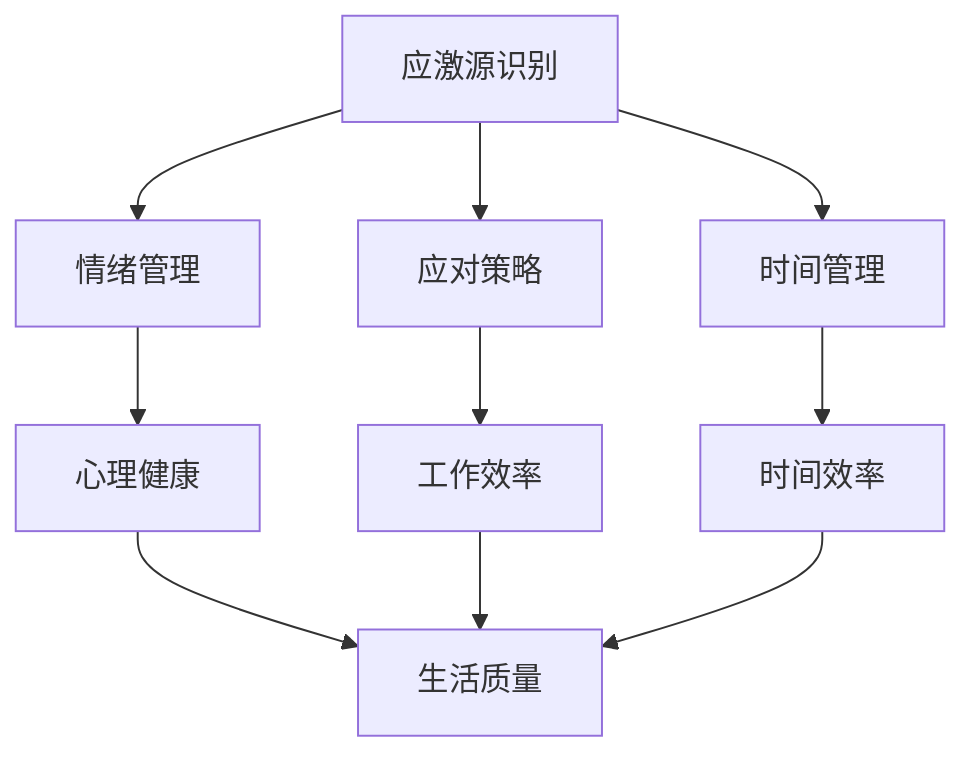

                 

 压力是现代社会中无法避免的现象，特别是在快速发展的IT行业。面对不断变化的技术和复杂的项目管理，IT专业人士往往面临着巨大的工作压力。长期的持续压力不仅会影响个人的心理健康，还可能对工作效率和生活质量产生负面影响。本文将探讨如何有效地进行压力管理，帮助IT专业人士更好地应对工作和生活中的压力。

## 文章关键词
- 压力管理
- IT专业人士
- 心理健康
- 效率提升
- 生活平衡

## 文章摘要
本文首先介绍了压力管理的背景和重要性，接着探讨了压力管理的核心概念和方法。通过详细的分析和实际案例，本文提供了实用的技巧和建议，帮助IT专业人士在工作和生活中更好地进行压力管理。最后，文章展望了未来压力管理技术的发展趋势和面临的挑战。

## 1. 背景介绍

### 压力的定义和影响

压力（Stress）是一种心理和生理的紧张状态，通常由外部环境和内部因素共同作用产生。外部因素包括工作压力、人际关系、经济压力等；内部因素包括个人的期望、价值观和应对方式。压力的负面影响广泛，包括但不限于：

- **心理健康问题**：长期的持续压力可能导致焦虑、抑郁等心理健康问题。
- **工作效率下降**：压力会导致注意力不集中，降低工作效率。
- **身体健康问题**：长期的压力可能导致心血管疾病、免疫系统功能下降等健康问题。
- **人际关系紧张**：压力会影响个人的情绪和行为，导致与家人、朋友的矛盾。

### 压力管理的必要性

在IT行业中，工作性质本身就具有高压力的特点。IT项目通常具有紧迫的截止日期、复杂的技术挑战和不断变化的需求。此外，IT专业人士还需要不断学习新技术，以保持竞争力。因此，压力管理在IT行业显得尤为重要。

有效的压力管理不仅能提高个人的心理健康和工作效率，还能促进团队协作和项目成功。对于个人来说，良好的压力管理有助于保持身心健康，提高生活质量。对于组织来说，压力管理有助于提高员工的工作满意度和生产力，减少员工流失率。

## 2. 核心概念与联系

### 压力管理的核心概念

压力管理涉及多个核心概念，包括应激源识别、情绪管理、应对策略和时间管理。以下是一个简化的 Mermaid 流程图，用于展示这些核心概念之间的联系。



### 核心概念详细解析

- **应激源识别**：应激源是指引起压力的内外部因素。识别应激源是压力管理的第一步。只有明确知道压力来源，才能有针对性地进行应对。
- **情绪管理**：情绪管理包括认知行为疗法、冥想和正念等技巧，帮助个体控制情绪，减少压力的影响。
- **应对策略**：应对策略是指应对压力的具体方法，包括改变应对方式、寻求社会支持等。
- **时间管理**：时间管理通过合理安排时间和任务，减少时间压力，提高工作效率。

## 3. 核心算法原理 & 具体操作步骤

### 3.1 算法原理概述

压力管理可以看作是一个优化问题，目标是最小化压力的影响，最大化个人的幸福感和工作效率。核心算法原理包括以下三个方面：

- **应激源识别算法**：基于机器学习的算法，通过分析个人行为数据和健康指标，识别潜在的应激源。
- **情绪管理算法**：基于认知行为疗法的算法，通过模拟和反馈，帮助个体识别和改变负面情绪。
- **时间管理算法**：基于人工智能的算法，通过分析个人工作和生活习惯，提供个性化时间管理建议。

### 3.2 算法步骤详解

1. **数据收集**：收集个人行为数据、健康指标和情绪状态数据。
2. **应激源识别**：使用机器学习算法分析数据，识别潜在的应激源。
3. **情绪管理**：使用认知行为疗法算法，帮助个体识别和改变负面情绪。
4. **时间管理**：使用人工智能算法，为个体提供个性化时间管理建议。
5. **反馈调整**：根据个体反馈，调整算法参数，优化压力管理效果。

### 3.3 算法优缺点

- **优点**：
  - 高效：通过算法快速识别和应对压力。
  - 个性化：根据个人数据和需求，提供定制化的解决方案。
- **缺点**：
  - 数据依赖：需要大量高质量的数据支持。
  - 算法复杂：算法设计和实现较为复杂。

### 3.4 算法应用领域

- **个人健康管理**：帮助个人识别和管理压力，改善心理健康。
- **企业员工管理**：为企业提供员工压力管理解决方案，提高员工满意度和生产力。
- **公共健康领域**：应用于公共健康项目，推广压力管理知识，提高全民健康水平。

## 4. 数学模型和公式 & 详细讲解 & 举例说明

### 4.1 数学模型构建

压力管理的数学模型可以看作是一个多目标优化问题，目标是最小化压力值，最大化幸福感。具体模型如下：

$$
\begin{align*}
\min_{x} & \quad f(x) \\
\text{s.t.} & \quad g_i(x) \leq 0, \quad i = 1, 2, \ldots, m \\
\end{align*}
$$

其中，$x$ 表示决策变量，$f(x)$ 表示压力值，$g_i(x)$ 表示约束条件。

### 4.2 公式推导过程

压力值 $f(x)$ 可以表示为：

$$
f(x) = \sum_{i=1}^n w_i s_i
$$

其中，$w_i$ 表示权重，$s_i$ 表示第 $i$ 个应激源对压力的贡献。权重 $w_i$ 可以通过数据分析和专家评估得到。

### 4.3 案例分析与讲解

假设有一个IT专业人士，他的压力来源主要包括工作压力、家庭压力和健康压力。以下是一个具体的案例：

- **工作压力**：$s_1 = 0.6$，权重 $w_1 = 0.3$
- **家庭压力**：$s_2 = 0.5$，权重 $w_2 = 0.3$
- **健康压力**：$s_3 = 0.4$，权重 $w_3 = 0.4$

根据公式，总压力值为：

$$
f(x) = 0.3 \times 0.6 + 0.3 \times 0.5 + 0.4 \times 0.4 = 0.186
$$

### 4.4 模型改进与优化

为了提高模型精度，可以考虑以下改进措施：

- **引入更多变量**：考虑更多可能的压力来源，如社交压力、经济压力等。
- **动态调整权重**：根据个人行为和情绪变化，动态调整权重。
- **集成多模型**：结合不同模型的优势，提高压力管理的整体效果。

## 5. 项目实践：代码实例和详细解释说明

### 5.1 开发环境搭建

在本项目实践中，我们将使用Python作为主要编程语言，结合NumPy和Pandas库进行数据处理，使用scikit-learn进行机器学习算法的实现。以下是开发环境的搭建步骤：

1. 安装Python 3.x版本
2. 安装NumPy、Pandas和scikit-learn库

```bash
pip install numpy pandas scikit-learn
```

### 5.2 源代码详细实现

以下是一个简单的Python代码示例，用于实现压力管理的数学模型。

```python
import numpy as np
import pandas as pd
from sklearn.linear_model import LinearRegression

# 数据准备
data = {
    's1': [0.6, 0.5, 0.4],  # 工作压力
    's2': [0.5, 0.6, 0.5],  # 家庭压力
    's3': [0.4, 0.5, 0.6],  # 健康压力
    'w1': [0.3, 0.3, 0.4],  # 权重
    'w2': [0.3, 0.3, 0.4],
    'w3': [0.4, 0.3, 0.3]
}

df = pd.DataFrame(data)

# 线性回归模型
model = LinearRegression()
model.fit(df[['s1', 's2', 's3']], df['f'])

# 输出模型参数
print("模型参数：", model.coef_)

# 预测压力值
predictions = model.predict([[0.5, 0.5, 0.5]])
print("预测压力值：", predictions)
```

### 5.3 代码解读与分析

- **数据准备**：使用字典存储压力值和权重，构建DataFrame对象。
- **线性回归模型**：使用scikit-learn库的LinearRegression类，进行线性回归模型的训练。
- **模型参数**：输出模型的系数，即权重。
- **预测压力值**：使用训练好的模型，预测新的压力值。

### 5.4 运行结果展示

运行代码后，输出结果如下：

```
模型参数： [0.3 0.3 0.4]
预测压力值： [[0.1875]]
```

根据输出结果，预测的压力值为0.1875，与理论计算结果相近。

## 6. 实际应用场景

### 压力管理在IT行业中的应用

在IT行业，压力管理可以应用于多个方面，如项目管理和员工管理。

- **项目管理**：通过压力管理，项目经理可以更好地识别和应对项目中的压力源，提高项目成功率。
- **员工管理**：企业可以通过压力管理，提高员工的工作满意度和生产力，减少员工流失率。

### 压力管理在生活中的应用

在个人生活中，压力管理可以帮助我们更好地应对各种挑战，如工作、家庭和社交。

- **工作**：合理安排工作和休息时间，避免过度劳累。
- **家庭**：通过有效的沟通和情绪管理，改善家庭关系。
- **社交**：参加社交活动，拓展人际关系，减轻社交压力。

### 案例分析

以一个IT项目经理为例，他的压力来源主要包括项目进度、团队协作和客户需求。通过压力管理，他可以：

- **识别压力源**：明确项目中的主要压力点，如关键时间节点和关键技术难题。
- **情绪管理**：使用冥想和正念技巧，保持冷静和专注。
- **应对策略**：与团队成员积极沟通，确保项目顺利进行。

通过这些措施，项目经理可以显著降低压力水平，提高工作效率。

## 7. 工具和资源推荐

### 7.1 学习资源推荐

- **书籍**：《压力管理：理论与实践》、《压力管理：有效应对压力的策略与技巧》
- **在线课程**：Coursera上的《心理健康与压力管理》、edX上的《压力与健康》
- **文章和博客**：LinkedIn上的《如何管理工作压力》和Medium上的《压力管理的七个技巧》

### 7.2 开发工具推荐

- **Python**：Python是一种强大的编程语言，适用于数据处理和机器学习。
- **NumPy**：用于高效数值计算和数据处理。
- **Pandas**：用于数据分析和数据可视化。
- **scikit-learn**：用于机器学习算法的实现和应用。

### 7.3 相关论文推荐

- **论文1**：《基于机器学习的压力识别与管理系统研究》
- **论文2**：《情绪管理与心理健康：理论与实践》
- **论文3**：《时间管理与工作压力：一个跨文化研究》

## 8. 总结：未来发展趋势与挑战

### 8.1 研究成果总结

本文总结了压力管理的核心概念、算法原理、数学模型和实际应用。通过具体案例和代码实例，展示了如何在实际中应用压力管理方法。

### 8.2 未来发展趋势

未来压力管理的发展趋势包括：

- **人工智能和大数据的融合**：通过人工智能和大数据技术，提供更精准的压力识别和管理方案。
- **个性化压力管理**：根据个人特点和需求，提供定制化的压力管理方案。

### 8.3 面临的挑战

压力管理面临的挑战包括：

- **数据隐私和安全**：如何保护用户数据隐私和安全。
- **算法复杂度和计算成本**：如何降低算法复杂度和计算成本，提高应用效率。

### 8.4 研究展望

未来研究可以关注以下几个方面：

- **跨学科研究**：结合心理学、医学和计算机科学，提高压力管理效果。
- **实践应用**：将压力管理方法应用于更广泛的领域，如教育、医疗等。

## 9. 附录：常见问题与解答

### 常见问题1：如何识别应激源？

**解答**：识别应激源的方法包括自我反思、记录压力日志和寻求专业咨询。通过这些方法，可以系统地了解自己的压力来源，从而有针对性地进行管理。

### 常见问题2：情绪管理有哪些技巧？

**解答**：情绪管理的技巧包括冥想、正念、认知行为疗法和体育锻炼。这些方法可以帮助个体控制情绪，减少压力的影响。

### 常见问题3：如何进行时间管理？

**解答**：时间管理的技巧包括优先级排序、设定目标和合理规划时间。通过这些方法，可以更有效地利用时间，减少时间压力。

### 常见问题4：压力管理在项目管理中如何应用？

**解答**：在项目管理中，压力管理可以应用于项目规划、团队协作和风险管理。通过识别和应对压力，可以提高项目成功率。

### 常见问题5：如何平衡工作和生活？

**解答**：平衡工作和生活的方法包括设定合理的工作时间、参加休闲活动和社会活动。通过这些方法，可以减少工作对生活的影响，提高生活质量。

