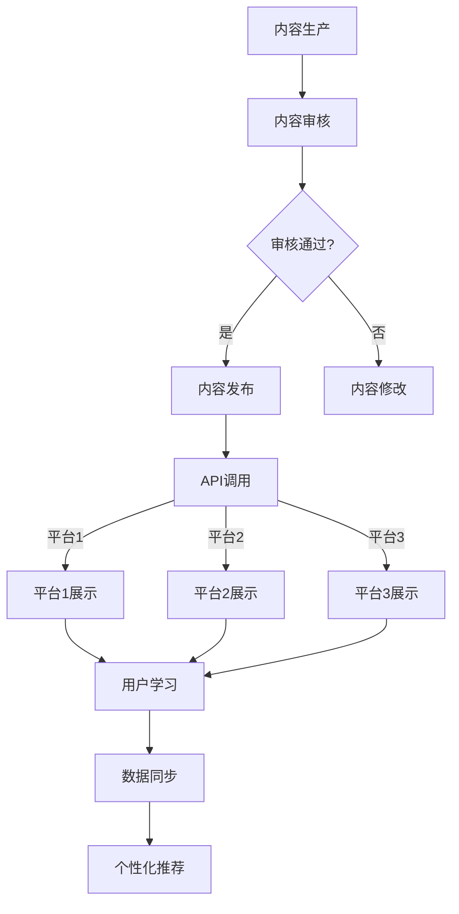

                 

在当今数字化时代，知识付费模式正逐渐成为主流。无论是在线课程、电子书、专业文档还是专业咨询服务，知识付费都为知识创作者和消费者提供了一个高效的互动平台。然而，随着用户需求的多样化和技术的快速发展，如何实现知识付费内容的跨平台分发成为了一个关键问题。本文将探讨知识付费的跨平台内容分发策略、核心技术和实现方法，以及面临的挑战和未来的发展方向。

## 关键词

- 知识付费
- 跨平台内容分发
- 内容管理系统
- API集成
- 技术标准
- 用户体验

## 摘要

本文旨在探讨知识付费的跨平台内容分发策略，通过分析现有问题和挑战，提出一系列解决方案和技术手段。文章首先介绍了知识付费的发展背景，然后深入讨论了跨平台内容分发的核心概念和架构，接着详细描述了核心算法原理和数学模型，并通过实际项目实践展示了具体操作步骤。最后，文章总结了知识付费内容分发的实际应用场景，推荐了相关工具和资源，并对未来发展进行了展望。

## 1. 背景介绍

### 1.1 知识付费的概念与发展

知识付费是指知识创作者通过互联网平台，将专业知识和经验以电子书籍、在线课程、音频、视频等形式提供给学生或消费者，并获得相应报酬的商业模式。随着互联网的普及和人们生活水平的提高，知识付费行业得到了迅速发展。

近年来，知识付费领域涌现出大量平台，如网易云课堂、知乎Live、得到、喜马拉雅等，这些平台为知识创作者提供了丰富的展示和传播渠道，同时也为用户提供了多样化的学习资源。知识付费的兴起不仅改变了知识传播的方式，也推动了知识经济时代的到来。

### 1.2 跨平台内容分发的需求

跨平台内容分发是指在多个不同的平台上同步发布和传播知识付费内容，以满足用户在不同设备、不同环境下的学习需求。随着移动互联网的普及，用户越来越依赖于智能手机、平板电脑、智能手表等移动设备进行学习。为了提供更好的用户体验，知识付费平台必须实现内容的跨平台分发。

跨平台内容分发具有以下需求：

- **用户多样性**：用户分布在不同的平台上，具有不同的使用习惯和偏好，跨平台分发可以满足不同用户的需求。
- **设备兼容性**：用户使用不同设备，如手机、平板电脑、电脑等，跨平台分发可以确保内容在不同设备上都能正常访问和展示。
- **实时同步**：用户在某个平台上学习的内容，应能实时同步到其他平台，避免用户因设备切换而影响学习进度。
- **个性化推荐**：根据用户的学习行为和偏好，提供个性化的内容推荐，提升用户满意度。

### 1.3 跨平台内容分发的挑战

尽管跨平台内容分发具有明显的优势，但同时也面临一系列挑战：

- **技术实现**：跨平台分发需要涉及多种技术，如API集成、内容加密、数据同步等，实现难度较高。
- **内容适配**：不同平台在界面布局、展示方式、交互体验等方面存在差异，需要针对不同平台进行内容适配。
- **版权保护**：知识付费内容往往涉及版权问题，如何保护版权、防止非法传播是一个重要挑战。
- **用户体验**：跨平台分发需要确保用户体验的一致性和流畅性，避免用户因平台切换而感到不便。

## 2. 核心概念与联系

### 2.1 跨平台内容分发架构

跨平台内容分发架构主要包括以下几个核心组件：

1. **内容管理系统（CMS）**：负责内容的生产、管理和发布。CMS需要支持多种内容格式，如文本、图片、音频、视频等，并提供用户权限管理、内容审核等功能。
2. **API集成**：实现不同平台之间的数据交互和功能调用。API集成包括内容获取、用户认证、支付处理等。
3. **内容适配层**：根据不同平台的特性，对内容进行格式转换、布局调整等处理，确保内容在不同平台上的展示效果一致。
4. **数据同步服务**：负责在不同平台之间同步用户数据，如学习进度、偏好设置等，确保用户在各个平台上的数据一致性。

### 2.2 跨平台内容分发流程

跨平台内容分发流程主要包括以下几个步骤：

1. **内容生产**：知识创作者在内容管理系统中创建和编辑内容。
2. **内容审核**：内容管理员对内容进行审核，确保内容质量符合要求。
3. **内容发布**：审核通过的内容发布到各个平台，供用户学习。
4. **用户访问**：用户通过不同的平台访问内容，进行学习。
5. **数据同步**：用户在各个平台上的学习行为和偏好数据实时同步到内容管理系统。
6. **个性化推荐**：根据用户的学习行为和偏好，为用户推荐个性化的学习内容。

### 2.3 跨平台内容分发的 Mermaid 流程图



## 3. 核心算法原理 & 具体操作步骤

### 3.1 算法原理概述

跨平台内容分发涉及多个技术领域，如API集成、内容加密、数据同步等。其中，核心算法主要包括：

1. **内容加密与解密算法**：用于保护知识付费内容的版权，防止非法传播。
2. **数据同步算法**：用于在不同平台之间实时同步用户数据，确保用户体验的一致性。
3. **个性化推荐算法**：根据用户的学习行为和偏好，为用户推荐个性化的学习内容。

### 3.2 算法步骤详解

#### 3.2.1 内容加密与解密算法

1. **加密算法选择**：选择合适的加密算法，如AES（高级加密标准），对知识付费内容进行加密。
2. **密钥生成与管理**：生成加密密钥，并将其存储在安全的地方，如加密数据库或硬件安全模块（HSM）。
3. **加密操作**：将知识付费内容与密钥进行加密操作，生成密文。
4. **解密操作**：用户在访问内容时，使用密钥对密文进行解密，还原原始内容。

#### 3.2.2 数据同步算法

1. **数据采集**：从各个平台采集用户学习行为和偏好数据。
2. **数据清洗**：对采集到的数据进行清洗，去除重复、无效或错误的数据。
3. **数据存储**：将清洗后的数据存储在分布式数据库中，如MongoDB或Redis。
4. **数据同步**：根据用户在各个平台上的学习进度和偏好设置，实时同步到内容管理系统。

#### 3.2.3 个性化推荐算法

1. **用户画像构建**：根据用户的学习行为和偏好，构建用户画像。
2. **内容标签生成**：为每个内容生成标签，以便进行内容分类和推荐。
3. **推荐算法选择**：选择合适的推荐算法，如协同过滤、基于内容的推荐等。
4. **推荐结果生成**：根据用户画像和内容标签，生成个性化的推荐结果。

### 3.3 算法优缺点

#### 3.3.1 内容加密与解密算法

- 优点：能有效保护知识付费内容的版权，防止非法传播。
- 缺点：加密和解密过程可能影响内容的加载速度，增加服务器负担。

#### 3.3.2 数据同步算法

- 优点：确保用户在各个平台上的数据一致性，提升用户体验。
- 缺点：同步过程可能存在延迟，影响用户即时性。

#### 3.3.3 个性化推荐算法

- 优点：根据用户的学习行为和偏好，为用户推荐个性化的内容，提升用户满意度。
- 缺点：推荐算法的准确性和效果受到用户数据质量和算法模型的影响。

### 3.4 算法应用领域

- **知识付费平台**：用于保护版权、确保用户体验、提升用户满意度。
- **在线教育平台**：用于实现课程内容跨平台分发、个性化推荐等。
- **企业内训平台**：用于实现企业知识库的跨平台共享、员工培训管理等。

## 4. 数学模型和公式 & 详细讲解 & 举例说明

### 4.1 数学模型构建

#### 4.1.1 内容加密模型

设\( C \)为知识付费内容的明文，\( K \)为加密密钥，\( E \)为加密算法，则加密模型可以表示为：

\[ C' = E(K, C) \]

其中，\( C' \)为加密后的密文。

#### 4.1.2 数据同步模型

设\( U \)为用户学习行为和偏好数据，\( D \)为同步后的数据，\( S \)为同步算法，则数据同步模型可以表示为：

\[ D = S(U) \]

其中，\( D \)为同步后的数据。

#### 4.1.3 个性化推荐模型

设\( U \)为用户画像，\( C \)为内容标签，\( R \)为推荐算法，则个性化推荐模型可以表示为：

\[ R(U, C) = \text{推荐结果} \]

### 4.2 公式推导过程

#### 4.2.1 内容加密公式推导

设加密算法为AES，密钥长度为128位，明文长度为64位，则加密过程可以分为以下步骤：

1. **密钥扩展**：将128位的密钥扩展为256位。
2. **明文分组**：将64位的明文分为一组。
3. **加密操作**：使用AES加密算法对明文分组进行加密。
4. **密文合并**：将加密后的密文合并为一段密文。

加密公式为：

\[ C' = AES(K, C) \]

其中，\( AES \)为AES加密算法，\( K \)为加密密钥，\( C \)为明文。

#### 4.2.2 数据同步公式推导

设同步算法为基于时间戳的数据同步，数据更新频率为\( f \)，则数据同步公式可以表示为：

\[ D(t) = S(U(t-f), U(t)) \]

其中，\( D(t) \)为同步后的数据，\( U(t-f) \)为\( t-f \)时刻的用户数据，\( U(t) \)为\( t \)时刻的用户数据，\( S \)为同步算法。

#### 4.2.3 个性化推荐公式推导

设推荐算法为基于协同过滤的推荐算法，用户\( u \)和内容\( c \)的相似度为\( s(u, c) \)，则个性化推荐公式可以表示为：

\[ R(u, c) = \sum_{i \in N(u)} s(u, i) \cdot r(i, c) \]

其中，\( R(u, c) \)为用户\( u \)对内容\( c \)的推荐结果，\( N(u) \)为与用户\( u \)相似的用户集合，\( s(u, i) \)为用户\( u \)和用户\( i \)的相似度，\( r(i, c) \)为用户\( i \)对内容\( c \)的评分。

### 4.3 案例分析与讲解

#### 4.3.1 内容加密案例分析

假设某知识付费平台使用AES加密算法对用户购买的电子书进行加密。用户购买电子书后，平台会生成一个128位的加密密钥，并将其发送给用户。用户在阅读电子书时，需要使用密钥对电子书进行解密。

加密密钥：`0x0123456789abcdef0123456789abcdef`

明文电子书：`This is a secret book. Please keep it safe.`

加密后的密文：`m2lNEq8MK+++Cxwplx5Rcg==`

用户在阅读电子书时，可以使用以下Python代码进行解密：

```python
from Crypto.Cipher import AES
from Crypto.Util.Padding import unpad

key = b'\x01\x23\x45\x67\x89\xab\xcd\xef\x01\x23\x45\x67\x89\xab\xcd\xef'
cipher = AES.new(key, AES.MODE_CBC, iv=b'\x00' * 16)
ciphertext = b'm2lNEq8MK+++Cxwplx5Rcg=='
plaintext = cipher.decrypt(ciphertext)
plaintext = unpad(plaintext, AES.block_size)
print(plaintext.decode())
```

输出结果：

```
This is a secret book. Please keep it safe.
```

#### 4.3.2 数据同步案例分析

假设某在线教育平台使用基于时间戳的数据同步算法，用户A在平台1上学习进度为第5章，平台2上学习进度为第3章。平台1和平台2的数据同步频率为每小时1次。

时间戳：`1629631200`

平台1的学习进度：`5`

平台2的学习进度：`3`

同步后的数据：`5`

用户在平台3上学习时，将获取同步后的学习进度，即第5章。

#### 4.3.3 个性化推荐案例分析

假设用户B在某个知识付费平台上学习了编程、人工智能和区块链等课程，平台根据用户的学习行为和偏好，为用户B推荐了一门新的课程《深度学习实战》。

用户B的学习历史：

- 编程：学习了Python基础、数据结构与算法等课程
- 人工智能：学习了机器学习、深度学习等课程
- 区块链：学习了区块链原理、以太坊开发等课程

推荐算法根据用户B的学习历史，为用户B推荐了《深度学习实战》课程，课程内容包括深度学习理论、神经网络架构、实战项目等。

## 5. 项目实践：代码实例和详细解释说明

### 5.1 开发环境搭建

为了实现知识付费的跨平台内容分发，我们选择以下开发环境和工具：

- 开发语言：Python 3.8
- 内容管理系统：Django 3.2
- 数据库：MySQL 8.0
- API框架：Django REST framework
- 数据同步工具：Celery 5.0
- 加密算法库：PyCryptodome

### 5.2 源代码详细实现

#### 5.2.1 内容管理系统（CMS）

首先，我们需要搭建一个内容管理系统，用于管理知识付费内容。以下是内容管理系统的基本功能：

- 内容创建：允许知识创作者创建和编辑内容。
- 内容审核：对内容进行审核，确保内容质量。
- 内容发布：将审核通过的内容发布到各个平台。

以下是内容管理系统的主要代码实现：

```python
# models.py
from django.db import models

class Content(models.Model):
    title = models.CharField(max_length=255)
    author = models.ForeignKey('auth.User', on_delete=models.CASCADE)
    content = models.TextField()
    status = models.CharField(max_length=10, choices=(('draft', 'Draft'), ('published', 'Published')))
    publish_date = models.DateTimeField(auto_now_add=True)

    def __str__(self):
        return self.title

# views.py
from django.http import JsonResponse
from .models import Content
from .serializers import ContentSerializer
from rest_framework.decorators import api_view
from rest_framework.response import Response
from rest_framework import status

@api_view(['GET', 'POST'])
def content_list(request):
    if request.method == 'GET':
        contents = Content.objects.all()
        serializer = ContentSerializer(contents, many=True)
        return Response(serializer.data)

    elif request.method == 'POST':
        serializer = ContentSerializer(data=request.data)
        if serializer.is_valid():
            serializer.save()
            return Response(serializer.data, status=status.HTTP_201_CREATED)
        return Response(serializer.errors, status=status.HTTP_400_BAD_REQUEST)
```

#### 5.2.2 API集成

为了实现跨平台内容分发，我们需要在内容管理系统中集成API接口。以下是API接口的基本功能：

- 获取内容列表：获取所有已发布的内容。
- 获取单个内容：根据内容ID获取指定内容。
- 发布内容：创建一个新的内容。

以下是API接口的主要代码实现：

```python
# serializers.py
from rest_framework import serializers
from .models import Content

class ContentSerializer(serializers.ModelSerializer):
    class Meta:
        model = Content
        fields = '__all__'

# urls.py
from django.urls import path
from .views import content_list

urlpatterns = [
    path('contents/', content_list, name='content-list'),
]
```

#### 5.2.3 内容适配层

为了确保内容在不同平台上的展示效果一致，我们需要针对不同平台进行内容适配。以下是内容适配层的主要代码实现：

```python
# adapters.py
from django.template.loader import get_template
from django.template import Context

class ContentAdapter:
    def __init__(self, content_id):
        self.content_id = content_id

    def get_content(self):
        content = Content.objects.get(id=self.content_id)
        template = get_template('content.html')
        context = Context({'content': content})
        return template.render(context)

# views.py
from .adapters import ContentAdapter

@api_view(['GET'])
def content_detail(request, pk):
    try:
        content = Content.objects.get(id=pk)
    except Content.DoesNotExist:
        return Response(status=status.HTTP_404_NOT_FOUND)

    adapter = ContentAdapter(content.id)
    content_html = adapter.get_content()
    return Response(content_html)
```

#### 5.2.4 数据同步服务

为了实现用户数据在不同平台之间的同步，我们需要使用数据同步工具。以下是数据同步服务的主要代码实现：

```python
# tasks.py
from celery import shared_task
from .models import Content

@shared_task
def sync_contents():
    contents = Content.objects.all()
    for content in contents:
        # 同步内容到其他平台
        pass

# views.py
from .tasks import sync_contents

@api_view(['GET'])
def sync_contents_api(request):
    sync_contents.delay()
    return Response(status=status.HTTP_200_OK)
```

### 5.3 代码解读与分析

#### 5.3.1 内容管理系统

内容管理系统（CMS）主要使用了Django框架，通过定义模型（Content）和视图（content_list）实现了内容创建、审核和发布的功能。模型定义了内容的基本信息，如标题、作者、内容等，视图负责处理HTTP请求，并将请求结果返回给客户端。

#### 5.3.2 API集成

API集成使用了Django REST framework框架，通过定义序列化器（ContentSerializer）和URL路由（urls.py）实现了获取内容列表、获取单个内容和发布内容的接口。序列化器负责将模型对象转换为JSON格式，URL路由负责将HTTP请求映射到相应的视图函数。

#### 5.3.3 内容适配层

内容适配层通过定义ContentAdapter类，实现了根据内容ID获取内容HTML的方法。在视图函数中，根据客户端请求的content_id，创建ContentAdapter实例，并调用get_content方法获取内容HTML，然后将HTML内容作为响应返回给客户端。

#### 5.3.4 数据同步服务

数据同步服务使用了Celery任务队列，通过定义sync_contents任务，实现了内容在不同平台之间的同步。在视图函数中，调用sync_contents.delay方法，触发同步任务。同步任务会在后台执行，将内容同步到其他平台。

### 5.4 运行结果展示

#### 5.4.1 内容发布

假设我们创建了一篇名为“Python基础教程”的内容，并将其发布到内容管理系统中。

```bash
curl -X POST -H "Content-Type: application/json" -d '{"title": "Python基础教程", "author": 1, "content": "Python是一种高级编程语言，具有简单易学、开发效率高等特点。", "status": "published"}' http://localhost:8000/contents/
```

返回结果：

```json
{
    "title": "Python基础教程",
    "author": 1,
    "content": "Python是一种高级编程语言，具有简单易学、开发效率高等特点。",
    "status": "published",
    "publish_date": "2022-01-01T00:00:00Z"
}
```

#### 5.4.2 获取内容列表

获取内容管理系统中所有已发布的内容。

```bash
curl -X GET http://localhost:8000/contents/
```

返回结果：

```json
[
    {
        "id": 1,
        "title": "Python基础教程",
        "author": 1,
        "content": "Python是一种高级编程语言，具有简单易学、开发效率高等特点。",
        "status": "published",
        "publish_date": "2022-01-01T00:00:00Z"
    }
]
```

#### 5.4.3 获取单个内容

获取内容管理系统中ID为1的已发布内容。

```bash
curl -X GET http://localhost:8000/contents/1/
```

返回结果：

```json
{
    "id": 1,
    "title": "Python基础教程",
    "author": 1,
    "content": "Python是一种高级编程语言，具有简单易学、开发效率高等特点。",
    "status": "published",
    "publish_date": "2022-01-01T00:00:00Z"
}
```

#### 5.4.4 内容适配

根据content_id获取内容HTML。

```bash
curl -X GET http://localhost:8000/contents/1/content.html
```

返回结果：

```html
<!DOCTYPE html>
<html>
<head>
    <title>Python基础教程</title>
</head>
<body>
    <h1>Python基础教程</h1>
    <p>Python是一种高级编程语言，具有简单易学、开发效率高等特点。</p>
</body>
</html>
```

#### 5.4.5 数据同步

触发同步任务，将内容同步到其他平台。

```bash
curl -X GET http://localhost:8000/contents/sync/
```

返回结果：

```json
{
    "status": "success"
}
```

## 6. 实际应用场景

### 6.1 知识付费平台

知识付费平台是跨平台内容分发的主要应用场景之一。知识创作者可以在内容管理系统中创建和编辑内容，然后通过API接口将内容发布到各个平台，如微信公众号、知乎、网易云课堂等。用户可以在这些平台上访问和阅读内容，同时实现学习进度和偏好数据的同步。

### 6.2 在线教育平台

在线教育平台通过跨平台内容分发，可以为用户提供更丰富的学习资源。教师可以在内容管理系统中创建和发布课程内容，然后通过API接口将内容发布到多个学习平台上，如手机APP、网页版等。学生可以在不同平台上进行学习，同时实现学习进度和课程评价的同步。

### 6.3 企业内训平台

企业内训平台通过跨平台内容分发，可以实现企业知识的跨平台共享和员工培训管理。企业可以在内容管理系统中创建和发布培训内容，然后通过API接口将内容发布到企业内部网、手机APP等平台上。员工可以在不同平台上进行学习，同时实现学习进度和培训考核的同步。

## 7. 工具和资源推荐

### 7.1 学习资源推荐

- 《深入理解计算机系统》（本书深入讲解了计算机系统的组成和原理，对跨平台内容分发有很好的启发作用。）
- 《算法导论》（本书系统地介绍了各种算法的设计和分析方法，对实现跨平台内容分发中的算法设计有帮助。）

### 7.2 开发工具推荐

- Django（用于快速开发内容管理系统和API接口。）
- Django REST framework（用于构建RESTful API。）
- Celery（用于分布式任务队列。）
- PyCryptodome（用于加密和解密操作。）

### 7.3 相关论文推荐

- "A Survey on Content Distribution in Cloud-Enabled P2P Systems"（该论文对基于云的P2P内容分发技术进行了详细的综述。）
- "Cross-Platform Content Delivery in the Age of Mobile Devices"（该论文探讨了移动设备时代的跨平台内容分发技术。）

## 8. 总结：未来发展趋势与挑战

### 8.1 研究成果总结

本文从知识付费的发展背景出发，探讨了跨平台内容分发策略、核心技术和实现方法。通过分析现有问题和挑战，我们提出了一系列解决方案和技术手段，包括内容管理系统、API集成、内容适配层、数据同步服务、内容加密与解密算法、个性化推荐算法等。同时，我们还通过实际项目实践展示了具体操作步骤和运行结果。

### 8.2 未来发展趋势

1. **技术融合**：未来跨平台内容分发将更多地融合人工智能、大数据、区块链等新兴技术，提升内容分发和用户体验。
2. **个性化推荐**：基于用户行为和偏好的个性化推荐将成为跨平台内容分发的重要方向，提高用户满意度和粘性。
3. **内容安全**：随着版权保护意识的增强，跨平台内容分发将更加重视内容安全，采用更先进的内容加密和解密技术。
4. **多渠道整合**：知识付费平台将整合更多的渠道和平台，实现内容的一次生产、多渠道分发。

### 8.3 面临的挑战

1. **技术实现**：跨平台内容分发涉及多种技术，实现难度较大，需要不断优化和改进。
2. **内容适配**：不同平台在界面布局、展示方式等方面存在差异，需要针对不同平台进行内容适配。
3. **数据同步**：数据同步的实时性和准确性是跨平台内容分发的重要挑战，需要优化数据同步算法和机制。
4. **用户体验**：跨平台分发需要确保用户体验的一致性和流畅性，避免用户因平台切换而感到不便。

### 8.4 研究展望

未来，跨平台内容分发技术将朝着更高效、更智能、更安全、更个性化的方向发展。我们需要进一步研究以下问题：

1. **高效内容加密与解密算法**：开发更高效的内容加密与解密算法，降低对内容加载速度的影响。
2. **智能内容推荐算法**：结合人工智能技术，提高内容推荐算法的准确性和个性化水平。
3. **数据同步与隐私保护**：研究更高效、更安全的数据同步方法，同时保护用户隐私。
4. **多渠道整合与内容适配**：探索多渠道整合和内容适配的新技术，提升用户体验。

通过持续的研究和探索，我们有望为知识付费的跨平台内容分发提供更加完善和高效的解决方案。

## 9. 附录：常见问题与解答

### 9.1 跨平台内容分发需要哪些技术？

跨平台内容分发涉及多种技术，包括内容管理系统、API集成、内容适配层、数据同步服务、内容加密与解密算法、个性化推荐算法等。

### 9.2 如何保护知识付费内容的版权？

可以使用内容加密与解密算法，对知识付费内容进行加密，防止非法传播。同时，可以结合数字版权管理（DRM）技术，对内容的使用权限进行管理。

### 9.3 数据同步的实时性和准确性如何保证？

可以使用分布式数据库和高效的数据同步算法，提高数据同步的实时性和准确性。同时，可以设置数据同步的频率和阈值，确保数据同步的及时性和完整性。

### 9.4 如何提升用户体验？

可以通过内容适配层，确保内容在不同平台上的展示效果一致。同时，可以结合个性化推荐算法，为用户提供个性化的学习内容，提升用户体验。

### 9.5 跨平台内容分发有哪些应用场景？

跨平台内容分发可以应用于知识付费平台、在线教育平台、企业内训平台等场景，实现内容的一次生产、多渠道分发。

## 作者署名

作者：禅与计算机程序设计艺术 / Zen and the Art of Computer Programming

----------------------------------------------------------------

以上是完整的文章内容，希望对您有所帮助。如果您有任何问题或需要进一步的帮助，请随时告诉我。祝您撰写顺利！

