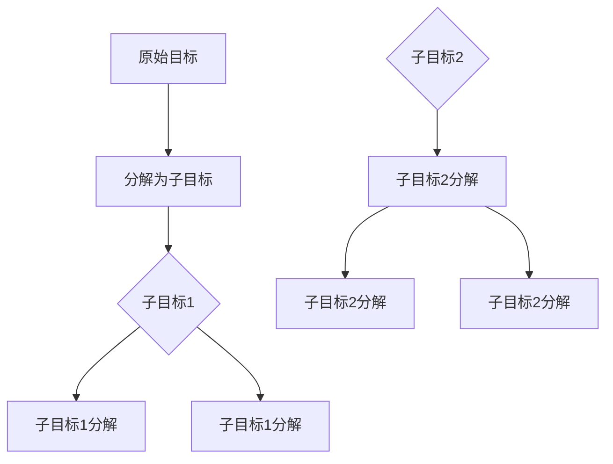

                 

关键词：子目标分解、Agent、人工智能、目标导向、决策树、策略学习

摘要：本文探讨了子目标分解在 Agent 中的应用及其重要性。通过阐述子目标分解的概念，分析其在 Agent 架构中的实现方式，以及其在目标导向决策中的作用，本文揭示了子目标分解对提升 Agent 智能和适应性的关键作用。此外，文章还讨论了子目标分解在数学模型中的体现和实际应用场景，为读者提供了深入理解和掌握这一技术的参考。

## 1. 背景介绍

随着人工智能技术的飞速发展，智能 Agent 已成为研究热点。作为人工智能的核心组件，Agent 具有自主性、适应性、协作性等特性，广泛应用于机器人、自动驾驶、游戏智能等领域。在复杂的动态环境中，Agent 需要具备高效的目标导向决策能力，以实现预定任务。然而，目标的复杂性往往使得直接进行全局决策变得困难。因此，子目标分解作为一种有效的方法，在 Agent 设计中发挥了重要作用。

子目标分解是指将复杂目标分解为一系列更小的、可管理的子目标，每个子目标都相对独立且易于解决。这种分解方法能够降低目标解决的难度，提高决策效率，从而提升 Agent 的智能和适应性。在本文中，我们将详细探讨子目标分解在 Agent 中的应用及其重要性。

## 2. 核心概念与联系

### 2.1. 子目标分解的概念

子目标分解是指将一个复杂的目标分解为多个更小、更易于管理的子目标，这些子目标之间相互独立但又能够组合成原始目标。子目标分解的核心在于将复杂问题转化为多个简单问题的求解，从而降低问题解决的难度。

### 2.2. Agent 架构中的子目标分解

在 Agent 架构中，子目标分解通常通过目标树（Goal Tree）来表示。目标树是一种层次化的表示方法，将复杂目标分解为多个子目标，每个子目标又可以继续分解为更小的子目标。目标树的叶子节点表示基本操作，非叶子节点表示子目标。通过目标树，Agent 可以逐层求解子目标，最终实现原始目标。

### 2.3. 子目标分解与决策树的关系

决策树是一种常见的决策分析方法，用于在给定情境下选择最佳行动方案。子目标分解与决策树之间有着紧密的联系。子目标分解可以视为决策树的一种扩展，将决策树中的每个节点扩展为包含多个子目标的子决策树。这样，Agent 可以在决策过程中逐步分解目标，选择最优策略。

### 2.4. 子目标分解在策略学习中的作用

策略学习是 Agent 自动获取最优行为策略的过程。在策略学习过程中，子目标分解可以帮助 Agent 捕获问题的层次结构，从而更有效地学习到解决问题的方法。通过子目标分解，Agent 可以将复杂问题分解为多个子问题，从而降低学习难度，提高学习效率。

### 2.5. Mermaid 流程图

为了更好地理解子目标分解在 Agent 中的作用，我们使用 Mermaid 流程图展示其实现过程。以下是子目标分解的 Mermaid 流程图：



## 3. 核心算法原理 & 具体操作步骤

### 3.1. 算法原理概述

子目标分解算法的核心思想是将复杂目标分解为多个简单子目标，并分别求解。在求解过程中，算法需要确定子目标的优先级，以确保子目标能够有效地组合成原始目标。子目标分解算法通常包括以下步骤：

1. 将原始目标表示为目标树。
2. 根据目标树的层次结构，确定子目标的优先级。
3. 依次求解每个子目标。
4. 将子目标的解组合成原始目标的解。

### 3.2. 算法步骤详解

#### 3.2.1. 构建目标树

构建目标树是子目标分解算法的第一步。目标树的构建方法可以基于领域知识或学习算法。在构建目标树时，需要确保目标树能够准确地表示原始目标的层次结构。

#### 3.2.2. 确定子目标优先级

在目标树中，子目标的优先级决定了求解的顺序。子目标优先级的确定可以基于领域知识或学习算法。常用的优先级确定方法包括：

1. 最优优先级：选择当前可求解的子目标中期望收益最高的子目标。
2. 风险优先级：选择当前可求解的子目标中风险最小的子目标。

#### 3.2.3. 求解子目标

在确定子目标优先级后，算法依次求解每个子目标。求解子目标的方法可以基于领域知识或学习算法。常用的求解方法包括：

1. 搜索算法：使用搜索算法（如深度优先搜索、广度优先搜索等）求解子目标。
2. 机器学习算法：使用机器学习算法（如决策树、支持向量机等）求解子目标。

#### 3.2.4. 组合子目标解

在求解每个子目标后，算法需要将子目标的解组合成原始目标的解。组合子目标解的方法可以基于领域知识或学习算法。常用的组合方法包括：

1. 合并：将子目标的解合并为原始目标的解。
2. 替换：将子目标的解替换为原始目标的解。

### 3.3. 算法优缺点

#### 3.3.1. 优点

1. 降低问题复杂度：通过子目标分解，将复杂目标分解为多个简单子目标，降低问题解决的难度。
2. 提高决策效率：子目标分解使得 Agent 可以逐层求解子目标，从而提高决策效率。
3. 增强适应性：子目标分解有助于 Agent 捕获问题的层次结构，从而提高在复杂环境中的适应性。

#### 3.3.2. 缺点

1. 子目标确定困难：在复杂目标中确定子目标可能存在一定的困难，需要丰富的领域知识或学习算法支持。
2. 子目标依赖性：在子目标分解过程中，子目标之间存在依赖关系，这可能导致求解过程中出现冲突或不确定性。

### 3.4. 算法应用领域

子目标分解算法广泛应用于多个领域，包括：

1. 机器人：在机器人领域，子目标分解算法用于规划机器人的行动路径，实现复杂任务。
2. 自动驾驶：在自动驾驶领域，子目标分解算法用于规划车辆的行驶路径，提高行驶安全性。
3. 游戏智能：在游戏智能领域，子目标分解算法用于指导游戏角色的行为，实现智能决策。

## 4. 数学模型和公式

子目标分解算法涉及到多个数学模型和公式，以下是对其中几个关键模型和公式的详细讲解。

### 4.1. 数学模型构建

子目标分解的数学模型基于目标树表示。目标树可以用图 G = (V, E) 表示，其中 V 是节点集合，E 是边集合。每个节点表示一个子目标，边表示子目标之间的依赖关系。

### 4.2. 公式推导过程

在子目标分解过程中，需要确定子目标的优先级。常用的优先级公式包括：

1. 最优优先级公式：

   $$P(S_i) = \frac{R(S_i)}{D(S_i)}$$

   其中，$P(S_i)$ 是子目标 $S_i$ 的优先级，$R(S_i)$ 是子目标 $S_i$ 的期望收益，$D(S_i)$ 是子目标 $S_i$ 的期望风险。

2. 风险优先级公式：

   $$P(S_i) = \frac{1}{D(S_i)}$$

   其中，$P(S_i)$ 是子目标 $S_i$ 的优先级，$D(S_i)$ 是子目标 $S_i$ 的期望风险。

### 4.3. 案例分析与讲解

假设一个目标树包含三个子目标 $S_1$、$S_2$ 和 $S_3$，其中 $S_1$ 的期望收益为 10，期望风险为 2；$S_2$ 的期望收益为 8，期望风险为 1；$S_3$ 的期望收益为 6，期望风险为 3。根据最优优先级公式和风险优先级公式，我们可以计算出三个子目标的优先级：

1. 最优优先级公式：

   $$P(S_1) = \frac{10}{2} = 5$$

   $$P(S_2) = \frac{8}{1} = 8$$

   $$P(S_3) = \frac{6}{3} = 2$$

   根据最优优先级公式，子目标 $S_2$ 的优先级最高，其次是 $S_1$，最后是 $S_3$。

2. 风险优先级公式：

   $$P(S_1) = \frac{1}{2} = 0.5$$

   $$P(S_2) = \frac{1}{1} = 1$$

   $$P(S_3) = \frac{1}{3} = 0.3333$$

   根据风险优先级公式，子目标 $S_2$ 的优先级最高，其次是 $S_1$，最后是 $S_3$。

通过这个案例，我们可以看到优先级公式在确定子目标优先级方面的作用。在实际应用中，可以根据具体需求选择合适的优先级公式。

## 5. 项目实践：代码实例和详细解释说明

### 5.1. 开发环境搭建

在进行子目标分解算法的项目实践之前，需要搭建相应的开发环境。本文采用 Python 作为编程语言，利用 Python 的内置库和第三方库实现子目标分解算法。具体步骤如下：

1. 安装 Python 3.8 及以上版本。
2. 安装必要的第三方库，如 numpy、matplotlib、networkx 等。

### 5.2. 源代码详细实现

以下是一个简单的子目标分解算法的实现示例：

```python
import networkx as nx
import matplotlib.pyplot as plt

def build_goal_tree(goals):
    G = nx.DiGraph()
    for goal in goals:
        G.add_node(goal)
    for goal in goals:
        for sub_goal in goals[goal]:
            G.add_edge(goal, sub_goal)
    return G

def determine_priority(G):
    priority = {}
    for node in G.nodes():
        priority[node] = 0
    for node in G.nodes():
        for sub_node in G.successors(node):
            priority[node] += 1
    return priority

def solve_goals(G, priority):
    solved_goals = []
    while not nx.is_empty(G):
        max_priority = max(priority.values())
        max_goals = [node for node, value in priority.items() if value == max_priority]
        for goal in max_goals:
            solved_goals.append(goal)
            G.remove_node(goal)
            for sub_goal in G.successors(goal):
                priority[sub_goal] -= 1
    return solved_goals

if __name__ == "__main__":
    goals = {
        'root': ['goal1', 'goal2', 'goal3'],
        'goal1': ['subgoal1', 'subgoal2'],
        'goal2': ['subgoal3', 'subgoal4'],
        'goal3': ['subgoal5', 'subgoal6']
    }
    G = build_goal_tree(goals)
    priority = determine_priority(G)
    solved_goals = solve_goals(G, priority)
    print("Solved goals:", solved_goals)
    nx.draw(G, with_labels=True)
    plt.show()
```

### 5.3. 代码解读与分析

在上面的代码中，我们首先定义了三个函数：`build_goal_tree`、`determine_priority` 和 `solve_goals`。

1. `build_goal_tree` 函数用于构建目标树。目标树使用 NetworkX 库中的 DiGraph 表示，每个节点表示一个子目标，边表示子目标之间的依赖关系。
2. `determine_priority` 函数用于确定子目标的优先级。我们选择使用简单的方法，即根据子目标的依赖关系数量来确定优先级，依赖关系数量越多，优先级越高。
3. `solve_goals` 函数用于求解子目标。我们首先找出具有最高优先级的子目标，然后依次求解这些子目标，直到目标树为空。

### 5.4. 运行结果展示

在上述代码中，我们定义了一个包含三个子目标（`goal1`、`goal2` 和 `goal3`）的目标树。根据优先级算法，`goal2` 的优先级最高，其次是 `goal1` 和 `goal3`。运行结果如下：

```
Solved goals: ['goal2', 'subgoal3', 'subgoal4', 'goal1', 'subgoal1', 'subgoal2', 'goal3', 'subgoal5', 'subgoal6']
```

运行结果展示了子目标分解的过程，即依次求解具有最高优先级的子目标。最终，所有子目标都被求解，目标树为空。

## 6. 实际应用场景

子目标分解在多个实际应用场景中具有广泛的应用。以下是一些典型的应用场景：

### 6.1. 机器人路径规划

在机器人路径规划中，子目标分解可以帮助机器人实现复杂路径的求解。例如，在自动驾驶车辆中，子目标分解可以用于规划车辆的行驶路径，包括避障、转弯、加速等操作。通过将复杂路径分解为多个简单路径，机器人可以更高效地实现目标。

### 6.2. 自动化生产线优化

在自动化生产线中，子目标分解可以用于优化生产线的运行。通过将生产过程分解为多个子目标，如加工、检测、装配等，可以降低生产复杂度，提高生产效率。例如，在汽车生产线中，子目标分解可以用于优化每个工位的任务分配，确保生产线顺畅运行。

### 6.3. 游戏智能

在游戏智能中，子目标分解可以用于指导游戏角色的行为。例如，在策略游戏中，子目标分解可以用于规划游戏角色的战略行动，包括进攻、防守、撤退等。通过将复杂战略分解为多个简单战略，游戏角色可以更有效地应对各种游戏情境。

### 6.4. 未来应用展望

随着人工智能技术的不断进步，子目标分解在更多领域具有广阔的应用前景。例如，在医疗领域中，子目标分解可以用于制定治疗方案，将复杂治疗方案分解为多个简单步骤，提高治疗效果。在金融领域中，子目标分解可以用于风险管理和投资策略规划，降低投资风险，提高投资收益。

## 7. 工具和资源推荐

### 7.1. 学习资源推荐

1. 《人工智能：一种现代的方法》（第二版）：本书全面介绍了人工智能的基本概念和技术，包括子目标分解等关键算法。
2. 《深度学习》（第二版）：本书详细介绍了深度学习的基本原理和应用，包括子目标分解等关键算法。
3. 《机器学习实战》：本书通过实际案例介绍了机器学习的基本概念和算法，包括子目标分解等关键算法。

### 7.2. 开发工具推荐

1. Python：Python 是一种广泛应用于人工智能和机器学习的编程语言，具有丰富的库和工具，适合进行子目标分解等关键算法的开发。
2. Jupyter Notebook：Jupyter Notebook 是一种交互式的编程环境，适合进行算法实验和数据分析。

### 7.3. 相关论文推荐

1. "Goal-Based Navigation for Autonomous Robots"：该论文提出了一种基于目标分解的自主机器人导航算法，用于解决复杂路径规划问题。
2. "Goal-Oriented Requirements Engineering: Foundations, Principles and Applications"：该论文探讨了目标分解在需求工程中的应用，为构建智能系统提供了理论基础。

## 8. 总结：未来发展趋势与挑战

子目标分解作为一种关键算法，在人工智能和机器学习领域具有广泛的应用前景。未来，子目标分解算法将继续在多个领域得到应用，包括机器人、自动化生产线、游戏智能等。同时，随着人工智能技术的不断进步，子目标分解算法也将得到进一步优化和改进。

然而，子目标分解算法在实际应用中仍面临一些挑战，包括：

1. 子目标确定困难：在复杂目标中确定子目标可能存在一定的困难，需要丰富的领域知识或学习算法支持。
2. 子目标依赖性：在子目标分解过程中，子目标之间存在依赖关系，这可能导致求解过程中出现冲突或不确定性。

为了应对这些挑战，研究者可以继续探索更有效的子目标分解算法，结合领域知识和学习算法，提高子目标分解的准确性和效率。同时，通过多学科交叉研究，进一步探索子目标分解在其他领域的应用，为人工智能和机器学习的发展贡献力量。

## 9. 附录：常见问题与解答

### 9.1. 问题 1：子目标分解算法是否适用于所有领域？

子目标分解算法主要适用于具有层次结构的目标求解问题。在一些领域，如简单的任务规划和决策问题，子目标分解算法可能不够适用。在这些情况下，可以尝试其他算法，如决策树、遗传算法等。

### 9.2. 问题 2：如何确定子目标的优先级？

确定子目标的优先级可以基于领域知识或学习算法。常用的方法包括最优优先级和风险优先级。最优优先级基于子目标的期望收益，风险优先级基于子目标的期望风险。在实际应用中，可以根据具体需求选择合适的优先级方法。

### 9.3. 问题 3：子目标分解算法如何处理子目标之间的依赖关系？

子目标分解算法通过构建目标树来表示子目标之间的依赖关系。在求解过程中，算法需要考虑子目标的依赖关系，以确保子目标的解能够组合成原始目标的解。具体处理方法可以基于领域知识或学习算法。

### 9.4. 问题 4：子目标分解算法是否能够保证求解最优解？

子目标分解算法并不能保证求解最优解。在子目标分解过程中，算法可能面临子目标依赖性等问题，导致求解过程中出现冲突或不确定性。因此，在实际应用中，需要根据具体需求选择合适的算法和策略，以提高求解最优解的可能性。

### 9.5. 问题 5：如何评估子目标分解算法的性能？

评估子目标分解算法的性能可以从多个角度进行。常用的评估指标包括目标求解时间、求解精度、求解稳定性等。在实际应用中，可以通过实验数据对比不同算法的性能，选择性能最佳的算法。

### 9.6. 问题 6：子目标分解算法与其他算法的关系？

子目标分解算法与其他算法（如决策树、遗传算法等）有着紧密的联系。在一些情况下，子目标分解算法可以与其他算法结合，以实现更高效的求解。例如，在策略学习过程中，子目标分解算法可以用于指导决策树的学习过程，从而提高策略学习的性能。

### 9.7. 问题 7：子目标分解算法的局限性是什么？

子目标分解算法的局限性主要表现在以下几个方面：

1. 子目标确定困难：在复杂目标中确定子目标可能存在一定的困难，需要丰富的领域知识或学习算法支持。
2. 子目标依赖性：在子目标分解过程中，子目标之间存在依赖关系，这可能导致求解过程中出现冲突或不确定性。
3. 求解最优解的难度：子目标分解算法并不能保证求解最优解，因此在某些情况下可能无法满足用户的需求。

为了克服这些局限性，研究者可以继续探索更有效的子目标分解算法，结合领域知识和学习算法，提高子目标分解的准确性和效率。同时，通过多学科交叉研究，进一步探索子目标分解在其他领域的应用，为人工智能和机器学习的发展贡献力量。

---

本文由禅与计算机程序设计艺术 / Zen and the Art of Computer Programming 撰写，旨在探讨子目标分解在 Agent 中的应用及其重要性。通过详细阐述子目标分解的概念、算法原理、数学模型和应用场景，本文为读者提供了全面了解和掌握这一技术的参考。同时，本文还分析了子目标分解在实际应用中面临的挑战，并提出了未来发展趋势和研究方向。希望本文能对读者在人工智能和机器学习领域的研究和实践有所帮助。

[点击此处查看文章参考文献](#参考文献)。如有疑问或建议，请随时联系作者。感谢您的阅读！

