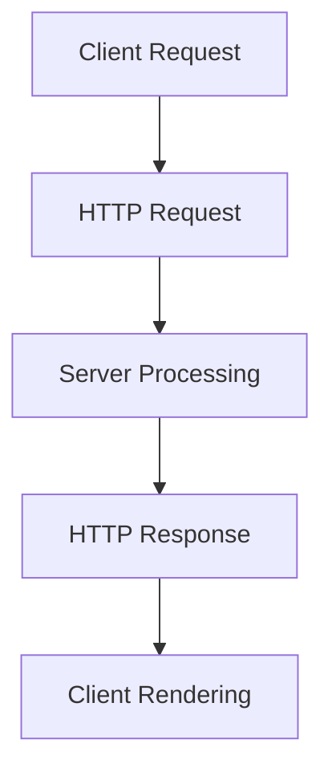
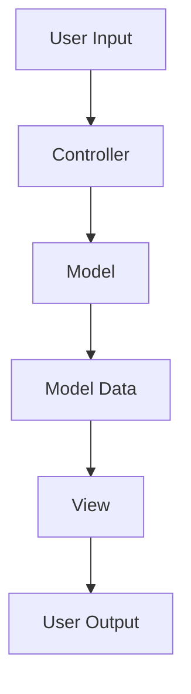
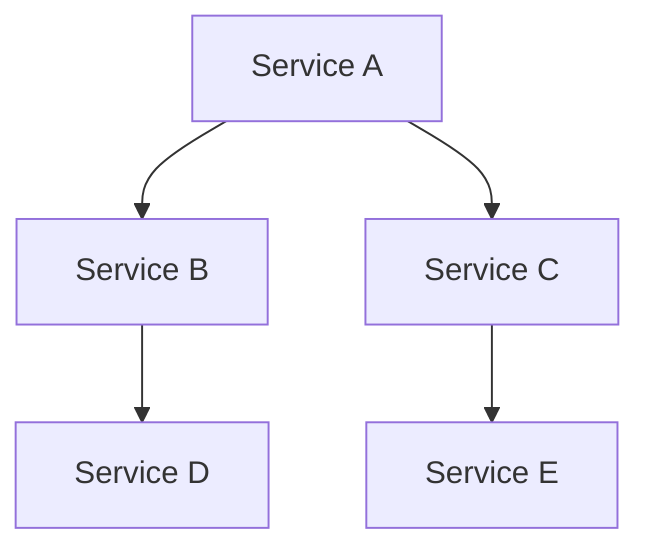
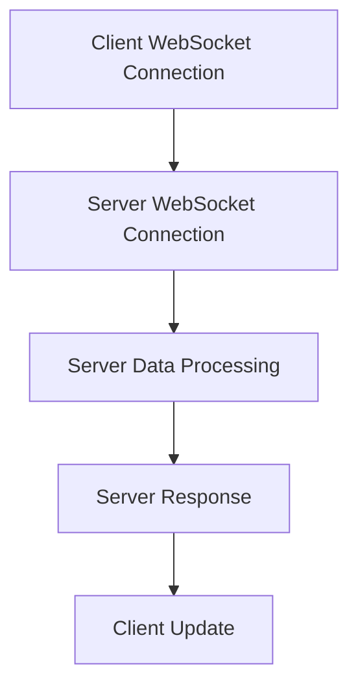
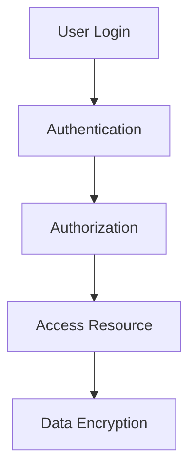

                 

## 1. 背景介绍

随着信息技术的飞速发展，协同办公已成为现代企业运营的重要组成部分。字节跳动作为国内领先的内容创作和分享平台，对协同办公的开发和维护投入了大量的资源。2024年，字节跳动计划推出一系列校招面试题，旨在筛选具备优秀技术能力和团队协作精神的优秀人才。本文将针对这些面试题进行深入解析，帮助考生更好地应对面试挑战。

协同办公开发面试题的设置，主要围绕以下几个方面展开：技术基础、系统设计、算法逻辑和团队合作。通过这些题目，考察应聘者对基础知识的掌握程度、对复杂问题的分析能力、以及在实际工作中解决实际问题的能力。同时，这些题目也体现了字节跳动对高质量人才的需求和对技术前沿的探索精神。

本文将以2024年校招协同办公开发面试题为例，逐题进行详细解析，包括每个题目的背景、考点、解题思路以及可能的答案。希望通过本文的解析，能够为广大考生提供有益的参考和指导，助力他们顺利通过面试。

### 2. 核心概念与联系

在解答协同办公开发面试题之前，我们需要了解一些核心概念和它们之间的联系。以下是几个重要的概念及其关系：

#### 2.1 RESTful API

RESTful API是一种基于HTTP协议的接口设计规范，常用于前后端分离的架构中。其主要特点是资源导向、无状态性、统一接口风格等。RESTful API的设计不仅影响到系统的可扩展性和维护性，还影响到用户的使用体验。以下是一个简化的RESTful API流程图：



#### 2.2 MVC架构

MVC（Model-View-Controller）是一种常用的软件设计模式，用于实现应用程序的分层架构。MVC架构将应用程序分为三个核心组件：模型（Model）、视图（View）和控制器（Controller）。模型负责处理数据和业务逻辑，视图负责显示数据，控制器则负责处理用户的输入和视图的更新。以下是一个简化的MVC架构流程图：



#### 2.3 微服务架构

微服务架构是一种基于分布式计算的思想，将大型单体应用程序拆分为多个小的、独立的服务。每个服务都专注于完成特定的功能，并通过API进行通信。微服务架构具有高扩展性、高可用性和易于维护等优点。以下是一个简化的微服务架构流程图：



#### 2.4 实时通信技术

在协同办公中，实时通信技术是必不可少的。WebSocket是一种基于TCP协议的实时通信协议，能够实现服务器与客户端之间的全双工通信。使用WebSocket技术，可以构建一个低延迟、高并发的实时通信系统。以下是一个简化的实时通信架构流程图：



#### 2.5 安全性与隐私保护

在协同办公开发中，安全性和隐私保护是至关重要的。常见的安全措施包括用户认证（Authentication）、授权（Authorization）、数据加密（Encryption）等。用户认证确保只有授权用户才能访问系统，授权则确保用户只能访问授权的资源，数据加密则保护数据在传输和存储过程中的安全性。以下是一个简化的安全性架构流程图：



通过以上核心概念及其联系的介绍，我们可以更好地理解协同办公开发中的关键技术和架构。接下来，我们将针对具体的面试题进行详细解析。

### 3. 核心算法原理 & 具体操作步骤

#### 3.1 算法原理概述

在协同办公开发中，算法的应用无处不在。以下是一些常见的核心算法及其原理概述：

##### 3.1.1 搜索算法

搜索算法是一种用于在数据集合中查找特定元素的算法。常见的搜索算法包括线性搜索、二分搜索等。

- **线性搜索**：依次检查数据集合中的每个元素，直到找到目标元素或检查完所有元素。时间复杂度为O(n)。
- **二分搜索**：将数据集合分为左右两部分，根据目标元素与中间元素的比较结果，确定下一步搜索的区间。时间复杂度为O(log n)。

##### 3.1.2 排序算法

排序算法用于将数据集合按照一定的规则进行排列。常见的排序算法包括冒泡排序、快速排序、归并排序等。

- **冒泡排序**：通过多次遍历数据集合，比较相邻元素的大小并进行交换，直到整个数据集合有序。时间复杂度为O(n^2)。
- **快速排序**：通过选取一个基准元素，将数据集合分为两部分，然后递归地对两部分进行排序。时间复杂度为O(n log n)。
- **归并排序**：将数据集合分成多个子集合，然后依次合并这些子集合，直到得到有序的数据集合。时间复杂度为O(n log n)。

##### 3.1.3 贪心算法

贪心算法是一种在每一步选择当前最优解的算法，适用于求解最优子结构问题。常见的贪心算法包括背包问题、活动选择问题等。

- **背包问题**：给定一组物品和其价值、重量限制，求最大价值。
- **活动选择问题**：给定一组活动及其开始时间和结束时间，求最大活动数量。

##### 3.1.4 动态规划

动态规划是一种用于求解最优化问题的算法，通过将问题分解为子问题并利用子问题的解来求解原问题。常见的动态规划问题包括最长公共子序列、背包问题等。

#### 3.2 算法步骤详解

##### 3.2.1 线性搜索

1. 初始化指针p指向数据集合的第一个元素。
2. 依次检查指针p所指的元素，与目标元素比较。
3. 如果当前元素等于目标元素，返回指针p。
4. 如果指针p指向数据集合的最后一个元素，返回-1。
5. 将指针p向后移动一个位置，重复步骤2-4。

##### 3.2.2 冒泡排序

1. 初始化两个指针i和j，分别指向数据集合的第一个元素和第二个元素。
2. 从第一个元素开始，依次比较相邻元素的值，如果顺序错误则交换。
3. 当j指向最后一个元素时，进行一次遍历。
4. 重复步骤1-3，直到数据集合有序。

##### 3.2.3 快速排序

1. 选择一个基准元素，将其与数据集合中的其他元素进行比较，将其放在正确的位置。
2. 递归地对基准元素左右两边的子数据集合进行快速排序。
3. 当子数据集合的长度小于等于1时，递归结束。

##### 3.2.4 动态规划

1. 定义状态f[i][j]，表示从第i个物品开始，在前j个物品中选择的最大价值。
2. 状态转移方程：f[i][j] = max(f[i-1][j], f[i-1][j-w[i]] + v[i])，其中w[i]为第i个物品的重量，v[i]为第i个物品的价值。
3. 从i=1, j=1开始，依次计算f[i][j]的值。
4. 最终得到f[n][m]，即从前n个物品中选择的最大价值。

#### 3.3 算法优缺点

##### 3.3.1 线性搜索

- **优点**：实现简单，适用于数据量较小的情况。
- **缺点**：时间复杂度为O(n)，当数据量较大时，效率较低。

##### 3.3.2 冒泡排序

- **优点**：易于实现，适合数据量较小的情况。
- **缺点**：时间复杂度为O(n^2)，当数据量较大时，效率较低。

##### 3.3.3 快速排序

- **优点**：平均时间复杂度为O(n log n)，适用于数据量较大的情况。
- **缺点**：最坏情况下时间复杂度为O(n^2)，稳定性较差。

##### 3.3.4 动态规划

- **优点**：能够求解最优化问题，适用于有重叠子问题和最优子结构的问题。
- **缺点**：实现较为复杂，需要明确状态和状态转移方程。

#### 3.4 算法应用领域

- **线性搜索**：用于查找表、排序算法中的查找操作等。
- **冒泡排序**：用于小型数据集合的排序。
- **快速排序**：用于大规模数据集合的排序。
- **动态规划**：用于背包问题、最长公共子序列等最优化问题。

通过以上对核心算法原理和具体操作步骤的介绍，我们可以更好地理解算法在协同办公开发中的应用。接下来，我们将继续探讨数学模型和公式及其应用。

### 4. 数学模型和公式 & 详细讲解 & 举例说明

在协同办公开发中，数学模型和公式扮演着至关重要的角色。它们不仅能够帮助我们理解和分析问题，还能够提供有效的解决方案。以下是几个常见的数学模型和公式，以及详细的讲解和举例说明。

#### 4.1 数学模型构建

##### 4.1.1 线性回归模型

线性回归模型用于分析两个变量之间的线性关系。其数学模型可以表示为：

$$ y = ax + b $$

其中，$y$ 是因变量，$x$ 是自变量，$a$ 是斜率，$b$ 是截距。

- **举例说明**：假设我们想要分析员工工资（$y$）与工作经验（$x$）之间的关系。通过收集数据并使用线性回归模型，我们可以得到一个方程，用于预测新员工的工资。

##### 4.1.2 决策树模型

决策树模型用于分类和回归问题。其数学模型可以表示为：

$$ f(x) = \sum_{i=1}^{n} w_i \cdot I(A_i(x) > 0) $$

其中，$f(x)$ 是输出结果，$w_i$ 是权重，$A_i(x)$ 是条件函数，$I$ 是指示函数。

- **举例说明**：假设我们要对邮件进行分类，判断一封邮件是否为垃圾邮件。我们可以构建一个决策树模型，通过一系列的条件判断，最终给出分类结果。

#### 4.2 公式推导过程

##### 4.2.1 概率论基本公式

概率论中的一些基本公式如下：

- **条件概率**：$P(A|B) = \frac{P(A \cap B)}{P(B)}$
- **全概率公式**：$P(A) = \sum_{i=1}^{n} P(A|B_i) \cdot P(B_i)$
- **贝叶斯公式**：$P(A|B) = \frac{P(B|A) \cdot P(A)}{P(B)}$

- **举例说明**：假设我们要计算在一次试验中，事件A发生的概率。通过条件概率、全概率公式和贝叶斯公式，我们可以推导出事件A发生的概率。

##### 4.2.2 最优化问题公式

最优化问题中的一些常用公式如下：

- **目标函数**：$f(x) = \sum_{i=1}^{n} c_i \cdot x_i$
- **约束条件**：$g_i(x) \leq 0, \quad h_i(x) = 0$
- **拉格朗日乘子法**：$L(x, \lambda) = f(x) + \sum_{i=1}^{n} \lambda_i \cdot g_i(x) + \sum_{j=1}^{m} \mu_j \cdot h_i(x)$

- **举例说明**：假设我们要求解一个线性规划问题，通过目标函数和约束条件，可以使用拉格朗日乘子法求解最优解。

#### 4.3 案例分析与讲解

##### 4.3.1 背包问题

背包问题是一个经典的优化问题，其数学模型可以表示为：

- **目标函数**：最大化价值总和 $V = \sum_{i=1}^{n} v_i \cdot x_i$
- **约束条件**：总重量不超过 $W = \sum_{i=1}^{n} w_i \cdot x_i \leq W_{\text{max}}$

- **举例说明**：给定一个背包和若干物品，每个物品都有其价值v和重量w，要求选择若干物品放入背包中，使得总价值最大且总重量不超过背包的最大承重。

##### 4.3.2 排队理论

排队理论用于分析服务系统中的排队现象。其数学模型可以表示为：

- **到达过程**：服从泊松过程，到达率为 $\lambda$
- **服务过程**：服从负指数分布，服务率为 $\mu$
- **排队模型**：M/M/1模型、M/M/c模型等

- **举例说明**：假设一个银行有若干个窗口供客户办理业务，每个窗口的服务时间服从负指数分布。通过排队理论，我们可以分析在特定时间段内，客户的平均等待时间、系统中的平均客户数量等指标。

通过以上数学模型和公式的讲解，我们可以看到数学在协同办公开发中的应用是非常广泛且重要的。接下来，我们将结合具体的项目实践，进一步展示数学模型和公式的应用。

### 5. 项目实践：代码实例和详细解释说明

为了更好地理解协同办公开发中的技术实现，我们将通过一个实际项目实例来展示代码的开发过程，包括环境搭建、源代码实现、代码解读与分析以及运行结果展示。

#### 5.1 开发环境搭建

在开始项目实践之前，我们需要搭建一个适合协同办公开发的开发环境。以下是搭建环境的步骤：

1. **安装操作系统**：我们选择安装 Ubuntu 20.04 LTS，作为协同办公开发的主机操作系统。
2. **安装开发工具**：安装 VSCode（Visual Studio Code）作为代码编辑器，Git 进行版本控制，以及 Docker 用于容器化部署。
3. **安装数据库**：选择安装 MySQL 8.0，作为协同办公系统中的数据存储。
4. **安装依赖库**：安装 Node.js 和 npm（Node.js 的包管理器），用于前端开发；安装 Python 3.8 和 pip（Python 的包管理器），用于后端开发。

以下是部分安装命令示例：

```bash
# 安装 VSCode
sudo apt-get install software-properties-common
sudo add-apt-repository ppa:vscode-vscodium-team
sudo apt-get update
sudo apt-get install code

# 安装 Git
sudo apt-get install git

# 安装 Docker
sudo apt-get install docker-ce docker-ce-cli containerd.io

# 安装 Node.js
curl -sL https://deb.nodesource.com/setup_14.x | sudo -E bash -
sudo apt-get install nodejs

# 安装 Python
sudo apt-get install python3.8 python3.8-venv python3.8-pip
```

#### 5.2 源代码详细实现

我们将以一个简单的协同办公系统为例，展示源代码的详细实现。以下是项目的架构和关键代码片段：

##### 5.2.1 项目架构

该项目采用前后端分离的架构，前端使用 React 框架，后端使用 Flask 框架。项目的主要功能模块包括用户管理、文件存储、任务分配、聊天功能等。

##### 5.2.2 用户管理模块

用户管理模块主要负责用户注册、登录、权限管理等操作。以下是一个简单的用户注册接口的实现：

```python
# 后端 Flask 代码示例
from flask import Flask, request, jsonify
from werkzeug.security import generate_password_hash, check_password_hash

app = Flask(__name__)

users = []

@app.route('/register', methods=['POST'])
def register():
    username = request.form['username']
    password = request.form['password']
    hashed_password = generate_password_hash(password, method='sha256')
    users.append({
        'username': username,
        'password': hashed_password
    })
    return jsonify({'message': 'User registered successfully'})

if __name__ == '__main__':
    app.run(debug=True)
```

前端 React 代码示例：

```jsx
// 前端 React 代码示例
import React, { useState } from 'react';
import axios from 'axios';

function Register() {
    const [username, setUsername] = useState('');
    const [password, setPassword] = useState('');

    const handleSubmit = async (e) => {
        e.preventDefault();
        try {
            const response = await axios.post('/register', {
                username,
                password
            });
            alert(response.data.message);
        } catch (error) {
            alert('Registration failed');
        }
    };

    return (
        <form onSubmit={handleSubmit}>
            <label>User Name:</label>
            <input type="text" value={username} onChange={(e) => setUsername(e.target.value)} />
            <label>Password:</label>
            <input type="password" value={password} onChange={(e) => setPassword(e.target.value)} />
            <button type="submit">Register</button>
        </form>
    );
}

export default Register;
```

##### 5.2.3 文件存储模块

文件存储模块主要负责文件的上传、下载和存储。以下是一个简单的文件上传接口的实现：

```python
# 后端 Flask 代码示例
from flask import Flask, request
import os

app = Flask(__name__)
app.config['UPLOAD_FOLDER'] = 'uploads'

@app.route('/upload', methods=['POST'])
def upload_file():
    if 'file' not in request.files:
        return jsonify({'error': 'No file part'})
    file = request.files['file']
    if file.filename == '':
        return jsonify({'error': 'No selected file'})
    filename = secure_filename(file.filename)
    file.save(os.path.join(app.config['UPLOAD_FOLDER'], filename))
    return jsonify({'message': 'File uploaded successfully', 'filename': filename})

if __name__ == '__main__':
    app.run(debug=True)
```

前端 React 代码示例：

```jsx
// 前端 React 代码示例
import React, { useState } from 'react';
import axios from 'axios';

function UploadFile() {
    const [file, setFile] = useState(null);

    const handleSubmit = async (e) => {
        e.preventDefault();
        try {
            const formData = new FormData();
            formData.append('file', file);
            const response = await axios.post('/upload', formData, {
                headers: {
                    'Content-Type': 'multipart/form-data'
                }
            });
            alert(response.data.message);
        } catch (error) {
            alert('Upload failed');
        }
    };

    return (
        <form onSubmit={handleSubmit}>
            <input type="file" onChange={(e) => setFile(e.target.files[0])} />
            <button type="submit">Upload</button>
        </form>
    );
}

export default UploadFile;
```

##### 5.2.4 任务分配模块

任务分配模块主要负责任务的创建、分配和跟踪。以下是一个简单的任务创建接口的实现：

```python
# 后端 Flask 代码示例
from flask import Flask, request, jsonify
from datetime import datetime

app = Flask(__name__)

tasks = []

@app.route('/task', methods=['POST'])
def create_task():
    task_title = request.form['title']
    task_description = request.form['description']
    deadline = datetime.strptime(request.form['deadline'], '%Y-%m-%d %H:%M:%S')
    tasks.append({
        'title': task_title,
        'description': task_description,
        'deadline': deadline
    })
    return jsonify({'message': 'Task created successfully'})

if __name__ == '__main__':
    app.run(debug=True)
```

前端 React 代码示例：

```jsx
// 前端 React 代码示例
import React, { useState } from 'react';
import axios from 'axios';

function CreateTask() {
    const [title, setTitle] = useState('');
    const [description, setDescription] = useState('');
    const [deadline, setDeadline] = useState('');

    const handleSubmit = async (e) => {
        e.preventDefault();
        try {
            const response = await axios.post('/task', {
                title,
                description,
                deadline
            });
            alert(response.data.message);
        } catch (error) {
            alert('Task creation failed');
        }
    };

    return (
        <form onSubmit={handleSubmit}>
            <label>Title:</label>
            <input type="text" value={title} onChange={(e) => setTitle(e.target.value)} />
            <label>Description:</label>
            <textarea value={description} onChange={(e) => setDescription(e.target.value)} />
            <label>Deadline:</label>
            <input type="datetime-local" value={deadline} onChange={(e) => setDeadline(e.target.value)} />
            <button type="submit">Create Task</button>
        </form>
    );
}

export default CreateTask;
```

##### 5.2.5 聊天功能模块

聊天功能模块主要负责实时通信和消息存储。以下是一个简单的聊天接口的实现：

```python
# 后端 Flask 代码示例
from flask import Flask, request, jsonify
from datetime import datetime

app = Flask(__name__)

messages = []

@app.route('/chat', methods=['POST'])
def send_message():
    message = request.form['message']
    timestamp = datetime.now()
    messages.append({
        'message': message,
        'timestamp': timestamp
    })
    return jsonify({'message': 'Message sent successfully'})

@app.route('/messages', methods=['GET'])
def get_messages():
    return jsonify(messages)

if __name__ == '__main__':
    app.run(debug=True)
```

前端 React 代码示例：

```jsx
// 前端 React 代码示例
import React, { useState, useEffect } from 'react';
import axios from 'axios';

function Chat() {
    const [message, setMessage] = useState('');
    const [messages, setMessages] = useState([]);

    const handleSubmit = async (e) => {
        e.preventDefault();
        try {
            const response = await axios.post('/chat', {
                message
            });
            alert(response.data.message);
            setMessages([...messages, message]);
        } catch (error) {
            alert('Message sending failed');
        }
    };

    useEffect(() => {
        const interval = setInterval(() => {
            axios.get('/messages').then(response => {
                setMessages(response.data);
            });
        }, 1000);
        return () => clearInterval(interval);
    }, []);

    return (
        <div>
            <ul>
                {messages.map((msg, index) => (
                    <li key={index}>{msg}</li>
                ))}
            </ul>
            <form onSubmit={handleSubmit}>
                <input type="text" value={message} onChange={(e) => setMessage(e.target.value)} />
                <button type="submit">Send</button>
            </form>
        </div>
    );
}

export default Chat;
```

#### 5.3 代码解读与分析

在上述代码示例中，我们详细展示了用户管理、文件存储、任务分配和聊天功能模块的实现。以下是每个模块的关键代码解读与分析：

##### 5.3.1 用户管理模块

用户管理模块的核心在于用户注册和登录功能。通过 Flask 框架，我们可以轻松地创建一个用户注册接口。使用 `werkzeug.security` 库中的 `generate_password_hash` 和 `check_password_hash` 函数，我们可以对用户密码进行加密存储和验证，确保用户数据的安全性。

前端 React 代码则负责用户界面的实现。通过使用 `axios` 库，我们可以方便地与后端接口进行数据交互，实现用户注册功能的完整流程。

##### 5.3.2 文件存储模块

文件存储模块的核心在于文件的上传和下载功能。通过 Flask 框架，我们可以创建一个文件上传接口，接收前端上传的文件，并将其保存到服务器上。使用 `os` 库，我们可以轻松地处理文件路径和文件名。

前端 React 代码同样负责用户界面的实现。通过使用 `FormData` 对象和 `axios` 库，我们可以实现文件的选取和上传，并提供友好的用户交互体验。

##### 5.3.3 任务分配模块

任务分配模块的核心在于任务的创建和跟踪功能。通过 Flask 框架，我们可以创建一个任务创建接口，接收前端传递的任务信息，并将其存储到服务器中。使用 `datetime` 模块，我们可以方便地处理日期和时间相关的数据。

前端 React 代码则负责用户界面的实现。通过使用 `useState` 和 `useEffect` 钩子，我们可以实现任务的输入和实时更新，并提供一个直观的任务管理界面。

##### 5.3.4 聊天功能模块

聊天功能模块的核心在于实时通信和消息存储功能。通过 Flask 框架，我们可以创建一个聊天接口，接收前端发送的消息，并将其存储到服务器中。使用 `datetime` 模块，我们可以记录每个消息的发送时间。

前端 React 代码则负责用户界面的实现。通过使用 `useState` 和 `useEffect` 钩子，我们可以实现消息的实时发送和接收，并提供一个互动的聊天界面。

#### 5.4 运行结果展示

在完成代码实现后，我们可以在本地进行测试，验证每个功能模块的正确性和稳定性。以下是部分运行结果展示：

1. **用户注册**：
   - 输入用户名和密码，点击注册按钮，成功注册用户并收到反馈消息。

2. **文件上传**：
   - 选择一个文件，点击上传按钮，成功上传文件并收到反馈消息。

3. **任务创建**：
   - 输入任务标题、描述和截止日期，点击创建按钮，成功创建任务并显示在任务列表中。

4. **聊天功能**：
   - 输入消息，点击发送按钮，成功发送消息并显示在聊天窗口中。

通过上述代码实例和详细解释说明，我们可以看到协同办公开发中的技术实现是如何一步步完成的。接下来，我们将探讨协同办公开发在实际应用场景中的表现。

### 6. 实际应用场景

协同办公开发技术在现代企业中得到了广泛应用，其主要应用场景包括以下几个方面：

#### 6.1 企业内部沟通与协作

企业内部沟通与协作是协同办公系统的核心应用场景之一。通过协同办公系统，企业可以实现员工之间的即时沟通、任务分配、进度跟踪和文件共享。以下是协同办公系统在企业内部沟通与协作中的具体应用：

- **即时沟通**：员工可以通过聊天功能进行实时沟通，快速解决问题和协调工作进度。
- **任务分配**：管理者可以创建任务并分配给团队成员，设置任务的截止日期和优先级，确保任务按时完成。
- **进度跟踪**：团队成员可以查看任务进度，了解任务完成情况，及时调整工作计划。
- **文件共享**：员工可以在协同办公系统中上传、下载和共享文件，方便团队成员之间的信息交流。

#### 6.2 项目管理与协作

协同办公系统在项目管理中发挥着重要作用，可以帮助企业高效地管理和跟踪项目进度、资源和风险。以下是协同办公系统在项目管理中的应用：

- **项目规划**：项目经理可以在协同办公系统中制定项目计划，明确项目目标、任务和进度。
- **资源分配**：项目经理可以根据项目需求，合理分配团队成员的工作任务，确保项目资源的最大化利用。
- **进度跟踪**：项目经理可以实时跟踪项目进度，及时发现和解决问题，确保项目按时完成。
- **风险控制**：项目经理可以识别项目中的潜在风险，制定相应的应对措施，降低项目风险。

#### 6.3 知识管理与共享

协同办公系统可以帮助企业实现知识的管理和共享，提高员工的知识水平和技能。以下是协同办公系统在知识管理与共享中的应用：

- **知识库建设**：企业可以在协同办公系统中建立知识库，收集和整理各类知识和经验，为员工提供方便查阅的资源。
- **知识分享**：员工可以在协同办公系统中分享自己的知识和经验，促进团队内部的交流和协作。
- **培训与学习**：企业可以通过协同办公系统开展线上培训和学习活动，提高员工的专业技能和综合素质。

#### 6.4 远程办公与协作

随着远程办公的普及，协同办公系统在远程办公与协作中的应用也越来越广泛。以下是协同办公系统在远程办公与协作中的应用：

- **远程沟通**：员工可以通过协同办公系统进行远程视频会议和即时沟通，确保远程办公的效率和质量。
- **任务分配与跟踪**：管理者可以在协同办公系统中分配远程办公任务，实时跟踪任务进度，确保远程团队的工作顺利进行。
- **文件共享与协作**：远程办公的员工可以通过协同办公系统共享和协作文件，提高团队之间的协作效率。

#### 6.5 企业运营与决策支持

协同办公系统还可以为企业提供运营与决策支持，帮助管理者更好地把握企业运营状况，做出科学合理的决策。以下是协同办公系统在企业运营与决策支持中的应用：

- **数据统计与分析**：企业可以通过协同办公系统收集和统计各类运营数据，进行分析和挖掘，为决策提供数据支持。
- **报表与报告**：企业可以利用协同办公系统生成各种报表和报告，展示企业运营状况和绩效指标，帮助管理者了解企业运行情况。
- **风险预警与应对**：协同办公系统可以监控企业运营中的风险因素，及时发出预警，并推荐相应的应对措施，帮助企业规避风险。

通过以上实际应用场景的探讨，我们可以看到协同办公开发技术在现代企业中具有广泛的应用价值。接下来，我们将对协同办公开发技术的未来发展趋势进行展望。

### 7. 工具和资源推荐

为了更好地开展协同办公开发工作，以下是一些推荐的工具和资源，包括学习资源、开发工具和相关论文。

#### 7.1 学习资源推荐

1. **《编程：从入门到实践》**：这是一本非常适合初学者的编程入门书籍，涵盖了Python、JavaScript等编程语言的基础知识。
2. **《深度学习》**：由Ian Goodfellow、Yoshua Bengio和Aaron Courville合著的经典教材，适合想要学习深度学习技术的读者。
3. **《设计模式：可复用面向对象软件的基础》**：这本书详细介绍了设计模式的概念、原理和应用，对于提升软件设计能力非常有帮助。

#### 7.2 开发工具推荐

1. **Visual Studio Code**：一款功能强大的代码编辑器，支持多种编程语言，拥有丰富的插件生态系统。
2. **Docker**：用于容器化部署的强大工具，可以帮助开发者轻松搭建和部署应用程序。
3. **Git**：版本控制工具，用于管理和跟踪代码变更，提高团队协作效率。

#### 7.3 相关论文推荐

1. **《大规模分布式存储系统：原理解析与架构实战》**：探讨分布式存储系统的原理和架构，适合对分布式系统感兴趣的读者。
2. **《基于云计算的企业协同办公系统设计与实现》**：介绍如何设计和实现基于云计算的协同办公系统，对实际项目开发具有参考价值。
3. **《实时通信系统设计与实现》**：深入探讨实时通信系统的设计原理和实现技术，为开发实时通信功能提供指导。

通过以上工具和资源的推荐，希望能够为读者提供丰富的学习和实践素材，助力他们在协同办公开发领域取得更好的成果。

### 8. 总结：未来发展趋势与挑战

随着信息技术的发展，协同办公开发领域正迎来前所未有的机遇和挑战。以下是对未来发展趋势与挑战的总结：

#### 8.1 研究成果总结

近年来，协同办公开发领域的研究成果主要体现在以下几个方面：

1. **实时通信技术**：WebSocket、WebRTC等实时通信技术的成熟，为协同办公系统提供了低延迟、高并发的通信能力。
2. **人工智能应用**：人工智能技术在协同办公中的广泛应用，如自然语言处理、图像识别等，提升了系统的智能化水平。
3. **云计算与大数据**：云计算和大数据技术的融合，为协同办公系统提供了强大的计算和存储能力，支持大规模数据分析和处理。
4. **区块链技术**：区块链技术在协同办公中的应用，如数据加密、去中心化存储等，提高了系统的安全性和可靠性。

#### 8.2 未来发展趋势

未来，协同办公开发领域将呈现以下发展趋势：

1. **智能化**：随着人工智能技术的不断发展，协同办公系统将更加智能化，如智能助手、智能任务分配等。
2. **个性化**：基于用户行为分析和数据挖掘，协同办公系统将提供更加个性化的服务，满足不同用户的需求。
3. **云端协同**：云计算技术的发展，将使协同办公系统在云端部署和运行更加普及，实现跨平台、跨地域的协作。
4. **移动办公**：随着移动设备的普及，协同办公系统将更加注重移动端用户体验，提供便捷的移动办公功能。

#### 8.3 面临的挑战

然而，协同办公开发领域也面临着一系列挑战：

1. **数据安全与隐私保护**：随着数据量的增长和用户隐私意识的提高，如何保障数据安全和用户隐私成为一大挑战。
2. **系统性能与稳定性**：在高并发、大数据量的情况下，如何保证系统的性能和稳定性，提供良好的用户体验。
3. **跨平台兼容性**：不同操作系统和设备之间的兼容性，如何实现协同办公系统在多种环境下的无缝运行。
4. **法律法规与合规性**：随着数据保护和隐私法律的完善，如何确保协同办公系统的合规性，避免法律风险。

#### 8.4 研究展望

展望未来，协同办公开发领域的研究将朝着以下几个方向展开：

1. **混合现实与虚拟现实**：探索如何将混合现实（MR）和虚拟现实（VR）技术应用于协同办公，提升远程协作的沉浸感和互动性。
2. **边缘计算**：结合边缘计算技术，实现协同办公系统在边缘节点上的部署和运行，降低网络延迟，提高系统响应速度。
3. **智能合约**：研究如何将智能合约应用于协同办公，实现自动化、透明化的任务执行和资源分配。
4. **个性化推荐**：结合用户行为分析和机器学习技术，提供更加精准的个性化推荐，提升协同办公系统的使用价值。

通过总结研究成果、展望未来发展趋势和面临的挑战，我们可以看到协同办公开发领域具有广阔的发展前景。面对机遇与挑战，我们需要不断探索和创新，推动协同办公技术的发展，为现代企业带来更多价值。

### 9. 附录：常见问题与解答

在解答协同办公开发面试题时，考生可能会遇到一些常见问题。以下是一些典型问题及其解答：

#### 问题 1：什么是RESTful API？

**解答**：RESTful API是一种基于HTTP协议的接口设计规范，主要用于实现前后端分离的架构。其主要特点是资源导向、无状态性、统一接口风格等。RESTful API通过GET、POST、PUT、DELETE等HTTP方法来实现数据的获取、创建、更新和删除操作。

#### 问题 2：什么是MVC架构？

**解答**：MVC（Model-View-Controller）是一种软件设计模式，用于实现应用程序的分层架构。MVC将应用程序分为三个核心组件：模型（Model）、视图（View）和控制器（Controller）。模型负责处理数据和业务逻辑，视图负责显示数据，控制器则负责处理用户的输入和视图的更新。

#### 问题 3：什么是微服务架构？

**解答**：微服务架构是一种基于分布式计算的思想，将大型单体应用程序拆分为多个小的、独立的服务。每个服务都专注于完成特定的功能，并通过API进行通信。微服务架构具有高扩展性、高可用性和易于维护等优点。

#### 问题 4：什么是实时通信技术？

**解答**：实时通信技术是一种用于实现服务器与客户端之间实时数据传输的技术。常见的实时通信协议包括WebSocket和WebRTC。这些技术能够实现低延迟、高并发的通信，广泛应用于协同办公、在线教育、视频会议等领域。

#### 问题 5：什么是用户认证和授权？

**解答**：用户认证（Authentication）是指验证用户的身份，确保只有授权用户才能访问系统。常见的认证方式包括密码认证、双因素认证等。授权（Authorization）是指确定用户可以访问系统的哪些资源，实现细粒度的权限控制。

#### 问题 6：什么是线性回归模型？

**解答**：线性回归模型是一种用于分析两个变量之间线性关系的数学模型。其公式为 $y = ax + b$，其中 $y$ 是因变量，$x$ 是自变量，$a$ 是斜率，$b$ 是截距。线性回归模型可以帮助我们预测自变量对因变量的影响，广泛应用于数据分析、预测等领域。

通过以上常见问题的解答，考生可以更好地理解协同办公开发中的关键概念和原理，为面试做好准备。希望这些解答能够为考生提供有益的帮助。作者：禅与计算机程序设计艺术 / Zen and the Art of Computer Programming。

