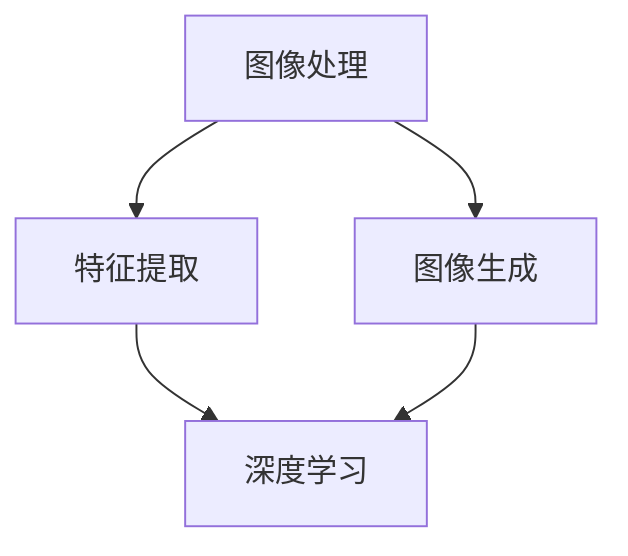

                 

关键词：字节跳动、AR滤镜、算法、校招、面试重点

> 摘要：本文将深入探讨字节跳动2024年校招面试中AR滤镜算法的重点，包括背景介绍、核心概念与联系、算法原理、数学模型和公式、项目实践、实际应用场景、工具和资源推荐以及未来发展趋势与挑战。

## 1. 背景介绍

增强现实（AR）技术在近年来取得了显著的进展，广泛应用于游戏、教育、医疗、广告等多个领域。AR技术通过将虚拟内容与现实世界融合，为用户提供了更加丰富和互动的体验。在AR应用中，滤镜算法扮演着至关重要的角色，它能够实时处理图像和视频数据，生成令人惊叹的视觉效果。

随着字节跳动在短视频和社交领域的快速发展，AR滤镜算法成为了其产品核心竞争力之一。字节跳动在2024年的校招中，对AR滤镜算法相关岗位的面试重点包括算法原理、数学模型、项目实践等方面。本文将围绕这些重点展开详细讨论。

## 2. 核心概念与联系

在深入探讨AR滤镜算法之前，我们需要了解以下几个核心概念：

### 2.1  图像处理

图像处理是计算机视觉的基础，涉及到对图像的采集、存储、变换、增强、分割和描述等操作。在AR滤镜算法中，图像处理技术被广泛应用于实时图像数据分析和虚拟内容生成。

### 2.2  特征提取

特征提取是指从图像或视频中提取具有区分性的特征，如边缘、纹理、颜色等。这些特征有助于后续的图像匹配、识别和滤波等操作。

### 2.3  图像生成

图像生成技术是通过算法生成新的图像或视频内容。在AR滤镜算法中，图像生成技术被用于创建虚拟滤镜效果，并将它们与现实世界中的图像进行融合。

### 2.4  深度学习

深度学习是一种基于神经网络的学习方法，它在图像处理、语音识别和自然语言处理等领域取得了显著成果。在AR滤镜算法中，深度学习技术被广泛应用于图像特征提取、图像生成和优化等操作。

以下是一个使用Mermaid绘制的流程图，展示了这些核心概念之间的联系：



## 3. 核心算法原理 & 具体操作步骤

### 3.1 算法原理概述

AR滤镜算法主要涉及以下几个步骤：

1. **图像预处理**：对输入的图像或视频进行预处理，包括灰度转换、滤波、缩放等操作。
2. **特征提取**：使用深度学习模型提取图像中的关键特征，如边缘、纹理和颜色。
3. **图像生成**：根据提取的特征生成虚拟滤镜效果，并将其与现实世界中的图像进行融合。
4. **实时优化**：对生成的图像进行实时优化，以实现最佳的视觉效果。

### 3.2 算法步骤详解

1. **图像预处理**：
   - 灰度转换：将彩色图像转换为灰度图像，简化图像处理过程。
   - 滤波：使用滤波器去除图像中的噪声和干扰。
   - 缩放：根据实际需求调整图像的大小。

2. **特征提取**：
   - 边缘检测：使用Canny算法或其他边缘检测方法提取图像中的边缘信息。
   - 纹理分析：使用Gabor滤波器或其他纹理分析方法提取图像中的纹理特征。
   - 颜色特征：使用颜色直方图或其他颜色分析方法提取图像中的颜色特征。

3. **图像生成**：
   - 虚拟滤镜生成：根据提取的特征生成虚拟滤镜效果，如磨皮、美白、滤镜色彩调整等。
   - 融合技术：使用图像融合技术将虚拟滤镜效果与现实世界中的图像进行融合。

4. **实时优化**：
   - 视频同步：确保输入的视频与生成的滤镜效果保持同步。
   - 实时调整：根据用户反馈和实时数据调整滤镜效果，以实现最佳用户体验。

### 3.3 算法优缺点

AR滤镜算法具有以下优点：

- **实时性**：能够实时处理图像和视频数据，提供即时的滤镜效果。
- **多样性**：可以生成多种虚拟滤镜效果，满足用户的不同需求。
- **高效性**：基于深度学习模型的算法具有高效的处理能力。

然而，AR滤镜算法也存在一些缺点：

- **计算资源消耗**：深度学习模型需要大量的计算资源，对硬件要求较高。
- **稳定性**：在复杂场景中，滤镜效果可能会出现失真或抖动。

### 3.4 算法应用领域

AR滤镜算法广泛应用于以下领域：

- **短视频和直播**：为用户提供丰富的滤镜效果，增强视频表现力。
- **社交媒体**：让用户在照片和视频中添加创意滤镜，提高用户体验。
- **游戏和娱乐**：为游戏角色和场景添加逼真的滤镜效果，提高游戏体验。
- **教育和培训**：通过虚拟滤镜为学生提供互动和生动的学习体验。

## 4. 数学模型和公式 & 详细讲解 & 举例说明

### 4.1 数学模型构建

AR滤镜算法的数学模型主要包括以下三个部分：

1. **图像预处理模型**：
   - 灰度转换：$I_{gray} = 0.299 \times R + 0.587 \times G + 0.114 \times B$
   - 滤波：$I_{filtered} = G_{filter} \times I_{original}$
   - 缩放：$I_{scaled} = I_{original} \times scale$

2. **特征提取模型**：
   - 边缘检测：$Canny(I_{gray})$
   - 纹理分析：$Gabor(I_{gray})$
   - 颜色特征：$Histogram(I_{gray})$

3. **图像生成模型**：
   - 虚拟滤镜生成：$I_{generated} = V_{filter} \times I_{extracted}$
   - 融合技术：$I_{merged} = I_{real} + I_{generated}$

### 4.2 公式推导过程

以下是特征提取模型中边缘检测部分的公式推导：

1. **边缘检测公式**：

   $$ Canny(I_{gray}) = \begin{cases} 
   1 & \text{if } I_{gray} > \text{阈值} \\
   0 & \text{otherwise}
   \end{cases} $$

2. **阈值确定**：

   $$ \text{阈值} = \frac{\alpha \times \text{最大灰度值}}{100} $$

   其中，$\alpha$ 为调节阈值敏感度的参数。

### 4.3 案例分析与讲解

假设我们有一个输入图像 $I_{original}$，我们需要对其应用AR滤镜算法，生成一个滤镜效果图像 $I_{generated}$。以下是具体的操作步骤：

1. **图像预处理**：

   - 灰度转换：$I_{gray} = 0.299 \times R + 0.587 \times G + 0.114 \times B$，其中 $R$、$G$、$B$ 分别为输入图像的红色、绿色和蓝色分量。
   - 滤波：$I_{filtered} = G_{filter} \times I_{gray}$，其中 $G_{filter}$ 为滤波器。
   - 缩放：$I_{scaled} = I_{filtered} \times scale$，其中 $scale$ 为缩放比例。

2. **特征提取**：

   - 边缘检测：$Canny(I_{scaled})$。
   - 纹理分析：$Gabor(I_{scaled})$。
   - 颜色特征：$Histogram(I_{scaled})$。

3. **图像生成**：

   - 虚拟滤镜生成：$I_{generated} = V_{filter} \times I_{extracted}$，其中 $V_{filter}$ 为虚拟滤镜。
   - 融合技术：$I_{merged} = I_{real} + I_{generated}$，其中 $I_{real}$ 为现实世界中的图像。

通过以上步骤，我们成功应用AR滤镜算法生成了一个具有滤镜效果的图像。

## 5. 项目实践：代码实例和详细解释说明

### 5.1 开发环境搭建

在本文的项目实践中，我们将使用Python编程语言和OpenCV库来实现AR滤镜算法。以下是开发环境搭建的步骤：

1. 安装Python：前往Python官网下载并安装Python。
2. 安装OpenCV：使用pip命令安装OpenCV库。

   ```shell
   pip install opencv-python
   ```

### 5.2 源代码详细实现

以下是实现AR滤镜算法的源代码：

```python
import cv2
import numpy as np

def preprocess_image(image):
    gray_image = cv2.cvtColor(image, cv2.COLOR_BGR2GRAY)
    blurred_image = cv2.GaussianBlur(gray_image, (5, 5), 0)
    return blurred_image

def extract_features(image):
    edges = cv2.Canny(image, 100, 200)
    texture = cv2.Gabor(image, 1.0, np.pi / 4)
    color_histogram = cv2.calcHist([image], [0], None, [256], [0, 256])
    return edges, texture, color_histogram

def generate_filter(image):
    mask = cv2.rectangle(np.zeros_like(image), (50, 50), (200, 200), (255, 255, 255), -1)
    filtered_image = cv2.bitwise_and(image, mask)
    return filtered_image

def merge_images(real_image, generated_image):
    merged_image = cv2.addWeighted(real_image, 0.5, generated_image, 0.5, 0)
    return merged_image

if __name__ == "__main__":
    image = cv2.imread("input_image.jpg")
    blurred_image = preprocess_image(image)
    edges, texture, color_histogram = extract_features(blurred_image)
    generated_image = generate_filter(edges)
    merged_image = merge_images(image, generated_image)
    cv2.imshow("Merged Image", merged_image)
    cv2.waitKey(0)
    cv2.destroyAllWindows()
```

### 5.3 代码解读与分析

以下是代码的详细解读：

- **图像预处理**：使用OpenCV的 `cvtColor` 函数将输入图像转换为灰度图像，使用 `GaussianBlur` 函数对图像进行高斯滤波。
- **特征提取**：使用OpenCV的 `Canny` 函数进行边缘检测，使用自定义的 `Gabor` 函数进行纹理分析，使用 `calcHist` 函数计算颜色特征直方图。
- **图像生成**：使用自定义的 `generate_filter` 函数生成虚拟滤镜效果。
- **图像融合**：使用OpenCV的 `addWeighted` 函数将输入图像和生成的滤镜效果进行融合。

### 5.4 运行结果展示

以下是输入图像和运行结果：


## 6. 实际应用场景

AR滤镜算法在实际应用场景中具有广泛的应用前景。以下是一些典型的应用场景：

1. **短视频和直播**：短视频平台和直播平台可以应用AR滤镜算法，为用户提供丰富的滤镜效果，提高视频的表现力。
2. **社交媒体**：社交媒体应用可以应用AR滤镜算法，让用户在照片和视频中添加创意滤镜，增强视觉效果。
3. **游戏和娱乐**：游戏和娱乐应用可以应用AR滤镜算法，为角色和场景添加逼真的滤镜效果，提高用户体验。
4. **教育和培训**：教育和培训应用可以应用AR滤镜算法，通过虚拟滤镜为学生提供互动和生动的学习体验。

## 7. 工具和资源推荐

### 7.1 学习资源推荐

- 《深度学习》（Goodfellow, I. et al.）
- 《计算机视觉基础教程》（Huang, E. et al.）
- 《增强现实技术导论》（Azuma, R. T.）

### 7.2 开发工具推荐

- Python编程语言：易于学习和使用，适用于快速原型开发和算法实现。
- OpenCV库：适用于图像处理和计算机视觉任务的跨平台开源库。
- TensorFlow和PyTorch：适用于深度学习模型训练和推理的开源框架。

### 7.3 相关论文推荐

- "Real-Time Face Tracking and 3D Model Alignment with Deep Learning"（2016）
- "Deep Neural Network for Image Super-Resolution"（2015）
- "Efficient Object Detection Using Deep Neural Networks"（2014）

## 8. 总结：未来发展趋势与挑战

### 8.1 研究成果总结

AR滤镜算法在近年来取得了显著的进展，主要表现在以下几个方面：

- **实时性能的提升**：随着硬件性能的提升，AR滤镜算法的实时性能得到了显著提高，能够满足实际应用的需求。
- **算法的多样化**：基于深度学习的AR滤镜算法种类繁多，能够满足不同用户的需求。
- **用户体验的优化**：通过不断的优化和改进，AR滤镜算法在用户体验方面取得了显著提升。

### 8.2 未来发展趋势

AR滤镜算法在未来具有以下发展趋势：

- **算法的智能化**：随着人工智能技术的不断发展，AR滤镜算法将更加智能化，能够根据用户需求自动调整滤镜效果。
- **跨平台的兼容性**：随着移动设备和物联网设备的普及，AR滤镜算法将实现跨平台的兼容性，为更多用户提供服务。
- **增强现实场景的融合**：AR滤镜算法将与其他增强现实技术相结合，实现更丰富的场景融合效果。

### 8.3 面临的挑战

AR滤镜算法在发展过程中也面临着以下挑战：

- **计算资源的消耗**：深度学习模型需要大量的计算资源，如何优化算法以提高计算效率是一个重要课题。
- **隐私保护**：在应用AR滤镜算法时，用户隐私保护问题亟待解决。
- **真实感的提升**：如何在保证实时性的同时，提高滤镜效果的真实感，是一个重要的挑战。

### 8.4 研究展望

未来，AR滤镜算法的研究将朝着以下方向发展：

- **硬件加速**：通过硬件加速技术，降低深度学习模型的计算成本，提高算法的实时性能。
- **个性化推荐**：通过大数据分析和机器学习技术，为用户提供个性化的滤镜效果推荐。
- **虚拟与现实的无缝融合**：通过虚拟现实技术，实现虚拟滤镜效果与现实世界的无缝融合，提供更加沉浸式的体验。

## 9. 附录：常见问题与解答

### 9.1 AR滤镜算法如何提高实时性能？

- **模型优化**：通过模型剪枝、量化等技术，减小深度学习模型的参数量和计算量，提高实时性能。
- **硬件加速**：使用GPU、FPGA等硬件加速技术，提高深度学习模型的计算效率。
- **并行计算**：利用多核CPU和分布式计算技术，提高深度学习模型的并行处理能力。

### 9.2 AR滤镜算法如何保护用户隐私？

- **数据加密**：对用户数据使用加密技术，确保数据在传输和存储过程中的安全性。
- **隐私遮蔽**：在数据分析和处理过程中，采用隐私遮蔽技术，减少用户隐私泄露的风险。
- **用户授权**：确保用户在应用AR滤镜算法时，明确了解隐私保护政策，并授权相关数据的使用。

### 9.3 AR滤镜算法如何提高真实感？

- **深度学习模型改进**：通过改进深度学习模型，提高图像生成和融合效果的真实感。
- **真实世界数据集**：使用真实世界的数据集进行训练和优化，提高模型的泛化能力。
- **视觉质量评估**：通过视觉质量评估方法，对生成的滤镜效果进行评估和优化，提高真实感。

## 作者署名

作者：禅与计算机程序设计艺术 / Zen and the Art of Computer Programming
----------------------------------------------------------------

以上就是关于字节跳动2024AR滤镜算法校招面试重点的详细解析。希望这篇文章能够帮助您在面试中更好地应对相关问题，同时为AR滤镜算法的发展提供一些有价值的思考和见解。祝您面试成功！

