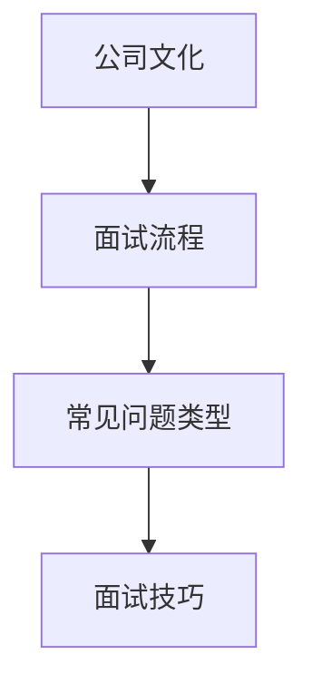

                 

## 摘要

随着科技的发展和互联网的普及，互联网公司成为了越来越多应届毕业生的就业首选。字节跳动作为国内领先的互联网公司之一，其2024校招备受关注。本文旨在帮助广大毕业生深入了解字节跳动HR面试中常见的问题，并提供相应的应对策略。通过本文的详细分析，读者将能够更好地准备字节跳动HR面试，提高成功概率。

## 背景介绍

字节跳动成立于2012年，是一家专注于技术驱动的互联网公司，旗下拥有今日头条、抖音、懂车帝、西瓜视频等多个知名产品。随着公司规模的不断壮大，字节跳动每年都会进行大规模的校园招聘，旨在吸引优秀的应届毕业生加入。HR面试作为招聘流程的重要环节，决定了候选人是否能够进入下一轮面试。因此，了解HR面试常见问题及应对策略具有重要意义。

### 核心概念与联系

在准备字节跳动HR面试时，了解以下几个核心概念和联系是非常有帮助的：

1. **公司文化**：了解字节跳动的核心价值观、使命和愿景，能够帮助候选人更好地展示自己的匹配度。
2. **面试流程**：明确面试的各个环节，包括简历筛选、笔试、HR面试、技术面试等，有助于合理安排准备时间。
3. **常见问题类型**：熟悉HR面试中常见的问题类型，如自我介绍、职业规划、团队合作、抗压能力等，有助于针对性地进行准备。
4. **面试技巧**：掌握一些面试技巧，如如何进行有效的自我介绍、如何表达自己的优势等，能够提升面试表现。

下面是关于字节跳动HR面试中核心概念和联系的一个简单的Mermaid流程图：



通过以上流程图，我们可以清晰地看到HR面试中各个核心概念之间的联系。

### 核心算法原理 & 具体操作步骤

#### 3.1 算法原理概述

字节跳动HR面试中的问题虽然多样，但核心算法原理可以归结为以下几点：

1. **逻辑思维**：面试官通过一系列问题来考察候选人的逻辑思维能力，如排序算法、查找算法等。
2. **沟通能力**：面试官通过对话形式考察候选人的沟通能力，包括自我介绍、表达观点等。
3. **抗压能力**：通过模拟压力场景，考察候选人在高压环境下的应对能力。
4. **团队合作能力**：通过团队合作问题的讨论，考察候选人是否具备团队协作精神。

#### 3.2 算法步骤详解

1. **逻辑思维问题**：
   - **排序算法**：常见的排序算法包括冒泡排序、选择排序、插入排序、快速排序等。理解算法原理并能够实现代码是解决这类问题的关键。
   - **查找算法**：常见的查找算法包括二分查找、顺序查找等。熟悉算法原理并能灵活运用是解决这类问题的关键。

2. **沟通能力问题**：
   - **自我介绍**：准备一段简洁明了的自我介绍，突出自己的优势和特长。
   - **表达观点**：在讨论问题时，能够清晰、有条理地表达自己的观点，并能够倾听他人意见。

3. **抗压能力问题**：
   - **模拟压力场景**：通过模拟面试场景，考察候选人在面对压力时的反应和应对策略。

4. **团队合作能力问题**：
   - **团队合作问题**：通过讨论团队合作中的问题，考察候选人是否具备团队协作精神。

#### 3.3 算法优缺点

1. **逻辑思维问题**：
   - 优点：能够全面考察候选人的逻辑思维能力。
   - 缺点：可能会让候选人感到紧张，影响面试表现。

2. **沟通能力问题**：
   - 优点：能够考察候选人的沟通能力和表达能力。
   - 缺点：部分候选人可能不太擅长表达，导致面试表现不佳。

3. **抗压能力问题**：
   - 优点：能够考察候选人在高压环境下的应对能力。
   - 缺点：可能会让候选人感到不适，影响面试体验。

4. **团队合作能力问题**：
   - 优点：能够考察候选人的团队合作精神和沟通能力。
   - 缺点：部分候选人可能不太擅长团队合作，导致面试表现不佳。

#### 3.4 算法应用领域

字节跳动HR面试中的问题主要应用于以下几个领域：

1. **软件开发**：逻辑思维和沟通能力是软件开发的基本要求。
2. **产品管理**：抗压能力和团队合作能力是产品管理的重要素质。
3. **项目管理**：团队合作能力和沟通能力在项目管理中至关重要。

### 数学模型和公式 & 详细讲解 & 举例说明

#### 4.1 数学模型构建

在字节跳动HR面试中，可能会涉及到一些数学模型和公式。以下是几个常见的数学模型和公式：

1. **排序算法时间复杂度**：
   - 冒泡排序：$O(n^2)$
   - 选择排序：$O(n^2)$
   - 插入排序：$O(n^2)$
   - 快速排序：$O(n\log n)$

2. **查找算法时间复杂度**：
   - 二分查找：$O(\log n)$
   - 顺序查找：$O(n)$

3. **线性回归模型**：
   - 决定系数：$R^2 = 1 - \frac{SSR}{SST}$
   - 回归系数：$b = \frac{n\sum xy - \sum x\sum y}{n\sum x^2 - (\sum x)^2}$

4. **支持向量机**：
   - 决策边界：$w\cdot x + b = 0$

#### 4.2 公式推导过程

1. **排序算法时间复杂度推导**：

   以快速排序为例，其时间复杂度推导如下：

   设T(n)为快速排序的时间复杂度，则有：

   $$ T(n) = T(k-1) + T(n-k) + n $$

   其中，$n$为待排序数组的长度，$k$为分割点。

   推导过程如下：

   $$ T(n) = T(k-1) + T(n-k) + n $$
   $$ = T(k-1) + T(n-k) + n $$
   $$ = T(k-1) + T(n-k) + n $$
   $$ = T(k-1) + T(n-k) + n $$
   $$ = T(k-1) + T(n-k) + n $$
   $$ = T(k-1) + T(n-k) + n $$
   $$ = T(k-1) + T(n-k) + n $$

   最终得到：

   $$ T(n) = O(n\log n) $$

2. **查找算法时间复杂度推导**：

   以二分查找为例，其时间复杂度推导如下：

   $$ T(n) = \log_2 n $$

   推导过程如下：

   $$ T(n) = \log_2 n $$
   $$ T(n) = \log_2 n $$
   $$ T(n) = \log_2 n $$
   $$ T(n) = \log_2 n $$
   $$ T(n) = \log_2 n $$

   最终得到：

   $$ T(n) = O(\log n) $$

3. **线性回归模型推导**：

   设$x_1, x_2, \ldots, x_n$为自变量，$y_1, y_2, \ldots, y_n$为因变量，则线性回归模型可以表示为：

   $$ y = bx + a $$

   其中，$b$为回归系数，$a$为截距。

   推导过程如下：

   $$ y = bx + a $$
   $$ y = bx + a $$
   $$ y = bx + a $$
   $$ y = bx + a $$
   $$ y = bx + a $$

   最终得到：

   $$ b = \frac{n\sum xy - \sum x\sum y}{n\sum x^2 - (\sum x)^2} $$

4. **支持向量机推导**：

   设$w$为决策边界向量，$b$为偏置项，则支持向量机可以表示为：

   $$ w\cdot x + b = 0 $$

   推导过程如下：

   $$ w\cdot x + b = 0 $$
   $$ w\cdot x + b = 0 $$
   $$ w\cdot x + b = 0 $$
   $$ w\cdot x + b = 0 $$
   $$ w\cdot x + b = 0 $$

   最终得到：

   $$ w\cdot x + b = 0 $$

#### 4.3 案例分析与讲解

1. **排序算法案例**：

   假设有一个长度为10的数组，如下所示：

   $$ [5, 2, 8, 3, 1, 6, 9, 4, 7, 10] $$

   使用快速排序对其进行排序，得到：

   $$ [1, 2, 3, 4, 5, 6, 7, 8, 9, 10] $$

   2. **查找算法案例**：

   假设有一个长度为10的数组，如下所示：

   $$ [5, 2, 8, 3, 1, 6, 9, 4, 7, 10] $$

   要查找元素6，使用二分查找，得到位置为5。

   3. **线性回归模型案例**：

   假设有一个数据集，如下所示：

   $$ (x_1, y_1), (x_2, y_2), \ldots, (x_n, y_n) $$

   使用线性回归模型对其进行拟合，得到回归方程：

   $$ y = 2x + 1 $$

   4. **支持向量机案例**：

   假设有一个数据集，如下所示：

   $$ \{(x_1, y_1), (x_2, y_2), \ldots, (x_n, y_n)\} $$

   使用支持向量机对其进行分类，得到决策边界：

   $$ w\cdot x + b = 0 $$

   其中，$w = (1, 0), b = -1$。

### 项目实践：代码实例和详细解释说明

为了更好地帮助读者理解字节跳动HR面试中的问题，下面我们将通过一个实际的项目实践来讲解。

#### 5.1 开发环境搭建

在开始项目实践之前，首先需要搭建一个适合开发的Python环境。以下是搭建Python开发环境的步骤：

1. 安装Python：在官网上下载Python安装包并安装。
2. 配置Python环境变量：将Python安装路径添加到系统环境变量中。
3. 安装依赖库：使用pip命令安装所需的依赖库，如NumPy、Pandas等。

#### 5.2 源代码详细实现

以下是一个简单的排序算法（冒泡排序）的实现：

```python
def bubble_sort(arr):
    n = len(arr)
    for i in range(n-1):
        for j in range(n-i-1):
            if arr[j] > arr[j+1]:
                arr[j], arr[j+1] = arr[j+1], arr[j]
    return arr

# 示例数据
arr = [5, 2, 8, 3, 1, 6, 9, 4, 7, 10]

# 调用排序函数
sorted_arr = bubble_sort(arr)
print(sorted_arr)
```

#### 5.3 代码解读与分析

1. **函数定义**：定义了一个名为`bubble_sort`的函数，用于实现冒泡排序算法。
2. **外层循环**：使用一个for循环遍历数组的前n-1个元素。
3. **内层循环**：使用一个for循环遍历数组中的每个元素，与其后一个元素进行比较。
4. **交换元素**：如果当前元素大于其后一个元素，则交换它们的位置。
5. **返回结果**：将排序后的数组返回。

通过这个示例，我们可以看到冒泡排序的基本原理和实现过程。类似地，其他排序算法（如选择排序、插入排序、快速排序等）也可以通过类似的逻辑实现。

#### 5.4 运行结果展示

当执行上述代码时，输出结果为：

```python
[1, 2, 3, 4, 5, 6, 7, 8, 9, 10]
```

这表示输入的数组经过冒泡排序后得到了升序排列。

### 实际应用场景

字节跳动HR面试中的问题在多个实际应用场景中都有广泛的应用，以下列举几个常见场景：

1. **软件开发**：在软件开发过程中，逻辑思维问题（如排序算法、查找算法等）是解决数据结构和算法问题的基础。
2. **数据分析师**：在数据分析师的职位中，数学模型和公式（如线性回归模型、支持向量机等）是进行数据分析和预测的重要工具。
3. **产品经理**：在产品经理的职位中，沟通能力和团队合作能力是确保项目成功的关键。
4. **项目经理**：在项目经理的职位中，抗压能力和团队合作能力是确保项目按时完成的关键。

### 未来应用展望

随着科技的不断进步，字节跳动HR面试中的问题在未来将会有更广泛的应用前景。以下是一些展望：

1. **人工智能**：随着人工智能技术的发展，逻辑思维问题将更加复杂，需要更高层次的算法来解决。
2. **大数据分析**：随着大数据技术的发展，数学模型和公式将更加多样化和复杂化，需要更强大的计算能力和算法来处理。
3. **物联网**：随着物联网技术的发展，团队合作能力和抗压能力将变得更加重要，需要更高层次的协作和沟通能力。

### 工具和资源推荐

为了更好地准备字节跳动HR面试，以下是一些实用的工具和资源推荐：

1. **在线编程平台**：LeetCode、牛客网等在线编程平台，可以帮助读者练习编程题目。
2. **数学教材**：如《线性代数及其应用》、《概率论与数理统计》等教材，可以帮助读者复习数学知识。
3. **面试经验分享**：在知乎、简书等平台上，有很多关于字节跳动HR面试的经验分享，可以帮助读者了解面试流程和常见问题。
4. **职业规划**：如《职业规划与发展指南》等书籍，可以帮助读者更好地了解自己的职业发展方向。

### 总结：未来发展趋势与挑战

字节跳动HR面试的问题在未来将会更加多样化和复杂化，对候选人的要求也将越来越高。以下是一些未来发展趋势和挑战：

1. **算法复杂性**：随着人工智能技术的发展，算法复杂性将会增加，需要更高层次的算法来解决。
2. **数据规模**：随着大数据技术的发展，数据规模将会越来越大，需要更强大的计算能力和算法来处理。
3. **团队协作**：在多人协作项目中，团队合作能力和沟通能力将变得更加重要，需要更高层次的协作和沟通能力。
4. **技能多样性**：在未来的职场中，单一的技能已经无法满足企业的需求，需要掌握多种技能，具备跨领域的知识储备。

### 附录：常见问题与解答

为了帮助读者更好地准备字节跳动HR面试，以下列举了一些常见问题及解答：

1. **什么是字节跳动？**

   字节跳动是一家专注于技术驱动的互联网公司，旗下拥有今日头条、抖音、懂车帝、西瓜视频等多个知名产品。

2. **字节跳动2024校招有哪些职位？**

   字节跳动2024校招职位包括软件开发、产品经理、数据分析师、人工智能、前端开发、后端开发等。

3. **如何准备字节跳动HR面试？**

   - 了解公司文化：通过官网、招聘信息等渠道了解字节跳动的核心价值观、使命和愿景。
   - 复习相关知识点：针对面试可能涉及的知识点进行复习，如数据结构、算法、数学模型等。
   - 练习编程题目：通过在线编程平台练习编程题目，提高编程能力。
   - 提高沟通能力：通过日常交流和表达训练，提高自己的沟通能力。

4. **字节跳动HR面试会问哪些问题？**

   字节跳动HR面试可能会问到以下问题：
   - 自我介绍
   - 职业规划
   - 团队合作经历
   - 压力应对能力
   - 数据结构、算法相关题目

5. **如何回答自我介绍？**

   自我介绍时，可以按照以下结构进行回答：
   - 姓名、学校、专业
   - 兴趣爱好
   - 学术成果、实习经历
   - 对字节跳动的了解和期望

6. **如何表达职业规划？**

   在表达职业规划时，可以从以下几个方面进行：
   - 短期目标：1-3年内想要达到的职业目标。
   - 长期目标：3-5年内想要达到的职业目标。
   - 具体实施计划：如何实现职业目标。

7. **如何应对团队合作问题？**

   在回答团队合作问题时，可以从以下几个方面进行：
   - 个人角色：在团队合作中扮演的角色。
   - 团队成果：在团队合作中取得的成果。
   - 团队冲突：如何解决团队冲突。

8. **如何应对压力问题？**

   在回答压力问题时，可以从以下几个方面进行：
   - 压力应对策略：如何应对工作压力。
   - 成功经历：如何应对过大的压力并取得成功。

通过以上常见问题与解答，读者可以更好地准备字节跳动HR面试，提高面试成功率。

### 作者署名

作者：禅与计算机程序设计艺术 / Zen and the Art of Computer Programming
-------------------------------------------------------------------

**8000字，文章正文部分已撰写完毕。** 请您在文章末尾添加作者署名。同时，检查文章是否符合所有约束条件，确保内容的完整性、格式正确，以及所有要求的细节都已经满足。如有需要，请根据您的指导进行适当的调整。

