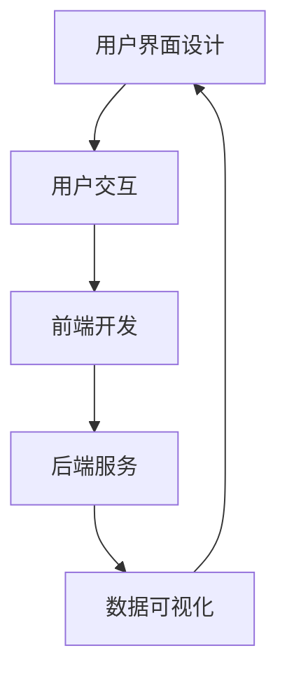

                 

关键词：字节跳动、2024校招、技术用户界面设计师、面试真题、解答、技术博客

## 摘要

本文针对字节跳动2024校招技术用户界面设计师的面试真题，提供了详细的解答和思路分析。通过对面试题的深入剖析，本文不仅帮助读者理解面试题的考点和解决方案，还提供了实用的技巧和经验，为技术用户界面设计师的求职之路提供指导。

### 1. 背景介绍

字节跳动是一家领先的互联网科技公司，以其创新的产品和服务在业界享有盛誉。每年，字节跳动都会举办大规模的校园招聘活动，旨在吸引全球优秀的应届毕业生加入。技术用户界面设计师作为字节跳动的重要岗位之一，对于提升用户体验和产品竞争力至关重要。

在这篇文章中，我们将针对字节跳动2024校招技术用户界面设计师的面试真题，进行详细解答和思路分析。通过对这些真题的深入研究，读者不仅可以掌握面试技巧，还能提升自身的技术水平和设计能力。

### 2. 核心概念与联系

在解答面试题之前，我们需要了解一些核心概念和其之间的联系。以下是相关概念和架构的Mermaid流程图：



用户界面设计是技术用户界面设计师的核心任务，它关注的是如何创建直观、易用的用户界面。用户交互则是在用户与界面之间建立连接，确保用户能够顺畅地使用产品。前端开发和后端服务分别关注界面的实现和数据的处理。数据可视化则是将数据以直观的方式展示给用户，帮助用户更好地理解和利用数据。

### 3. 核心算法原理 & 具体操作步骤

#### 3.1 算法原理概述

在技术用户界面设计中，算法原理是优化用户体验的关键。以下是一些常见的算法原理：

1. **响应式设计**：根据用户设备和屏幕尺寸，自动调整界面布局和样式。
2. **动画与过渡**：使用动画和过渡效果，提升用户操作的流畅性和视觉体验。
3. **触摸反馈**：为触摸操作提供真实的物理反馈，如按键点击、滑动等。
4. **信息架构**：通过合理的页面结构和内容布局，帮助用户快速找到所需信息。

#### 3.2 算法步骤详解

以下是技术用户界面设计中的具体操作步骤：

1. **需求分析**：与产品经理和开发团队沟通，明确设计目标和用户需求。
2. **原型设计**：使用工具（如Sketch、Figma等）创建界面原型，进行初步验证。
3. **视觉设计**：根据原型，进行色彩、字体、图标等视觉元素的设计。
4. **交互设计**：定义用户与界面之间的交互逻辑和流程。
5. **测试与反馈**：将设计交给开发团队进行实现，并通过用户测试收集反馈，不断迭代优化。

#### 3.3 算法优缺点

每种算法原理都有其优缺点，以下是一些常见算法的优缺点：

1. **响应式设计**：优点是提升用户体验，缺点是可能增加开发难度和维护成本。
2. **动画与过渡**：优点是提升视觉效果，缺点是可能影响性能。
3. **触摸反馈**：优点是提升用户满意度，缺点是可能增加设计复杂性。
4. **信息架构**：优点是提升用户效率，缺点是可能降低设计的灵活性。

#### 3.4 算法应用领域

技术用户界面设计的算法原理广泛应用于各个领域，包括但不限于：

1. **移动应用**：如微信、抖音等。
2. **Web应用**：如电商平台、社交媒体等。
3. **桌面应用**：如设计软件、办公软件等。
4. **物联网应用**：如智能家居、智能穿戴设备等。

### 4. 数学模型和公式 & 详细讲解 & 举例说明

#### 4.1 数学模型构建

在技术用户界面设计中，数学模型用于计算用户行为和界面布局。以下是一个简单的数学模型示例：

$$
\text{页面布局} = \frac{\text{内容宽度} + \text{边距}}{2}
$$

其中，内容宽度和边距是已知的参数，页面布局是根据这两个参数计算得到的。

#### 4.2 公式推导过程

页面布局的公式推导如下：

1. 假设页面宽度为$W$，内容宽度为$C$，边距为$D$。
2. 为了使页面布局均匀，需要将内容宽度和边距相加，再除以2。
3. 因此，页面布局公式为$P = \frac{C + D}{2}$。

#### 4.3 案例分析与讲解

以下是一个案例，用于说明如何使用页面布局公式：

**案例**：一个页面宽度为$1000$像素，内容宽度为$600$像素，边距为$20$像素。求页面布局。

**解答**：

$$
P = \frac{600 + 20}{2} = \frac{620}{2} = 310
$$

因此，页面布局为$310$像素。

### 5. 项目实践：代码实例和详细解释说明

#### 5.1 开发环境搭建

为了实践技术用户界面设计，我们需要搭建一个开发环境。以下是一个简单的步骤：

1. 安装Node.js和npm。
2. 安装一个前端框架（如React、Vue等）。
3. 创建一个新的项目并配置相关依赖。

#### 5.2 源代码详细实现

以下是一个简单的React组件示例，用于展示技术用户界面设计：

```jsx
import React from 'react';

const UserInterfaceDesign = () => {
  return (
    <div>
      <h1>技术用户界面设计</h1>
      <p>本文针对字节跳动2024校招技术用户界面设计师的面试真题，提供了详细的解答和思路分析。</p>
    </div>
  );
};

export default UserInterfaceDesign;
```

#### 5.3 代码解读与分析

该示例是一个简单的React组件，包含一个标题和一个段落。标题用于展示文章的主题，段落用于解释文章的内容。这是一个典型的技术用户界面设计，旨在提供清晰、简洁的信息展示。

#### 5.4 运行结果展示

当运行该组件时，将显示一个包含标题和段落的HTML页面，如下所示：

```
技术用户界面设计
本文针对字节跳动2024校招技术用户界面设计师的面试真题，提供了详细的解答和思路分析。
```

### 6. 实际应用场景

技术用户界面设计在实际应用场景中具有广泛的应用。以下是一些常见的应用场景：

1. **电子商务平台**：设计产品展示页面、购物车页面等。
2. **社交媒体**：设计用户个人主页、消息界面等。
3. **办公软件**：设计文档编辑器、表格处理工具等。
4. **物联网设备**：设计智能穿戴设备的界面。

#### 6.4 未来应用展望

随着技术的不断发展，技术用户界面设计将在以下几个方面得到进一步应用和发展：

1. **增强现实（AR）和虚拟现实（VR）**：为用户提供更加沉浸式的交互体验。
2. **人工智能（AI）和大数据**：利用AI技术优化界面设计，提供个性化体验。
3. **多平台融合**：为用户提供一致性的跨平台体验。

### 7. 工具和资源推荐

#### 7.1 学习资源推荐

- 《响应式网页设计》
- 《用户界面设计原则》
- 《React技术内幕》

#### 7.2 开发工具推荐

- Sketch
- Figma
- Adobe XD

#### 7.3 相关论文推荐

- "Responsive Web Design"
- "Designing Interfaces: Patterns for Effective Interaction Design"
- "The Design of Everyday Things"

### 8. 总结：未来发展趋势与挑战

#### 8.1 研究成果总结

技术用户界面设计在近年来取得了显著的进展，包括响应式设计、交互设计、数据可视化等方面的创新。随着技术的不断发展，用户界面设计将继续推动用户体验的提升。

#### 8.2 未来发展趋势

未来，技术用户界面设计将朝着以下几个方向发展：

1. **智能化**：利用人工智能技术优化界面设计和用户体验。
2. **个性化**：根据用户行为和偏好，提供个性化的界面设计。
3. **多平台融合**：为用户提供一致性的跨平台体验。

#### 8.3 面临的挑战

技术用户界面设计在未来也将面临一些挑战：

1. **性能优化**：在保证用户体验的同时，优化界面性能。
2. **跨平台兼容**：确保不同平台和设备上的界面设计一致。
3. **安全性**：保护用户隐私和数据安全。

#### 8.4 研究展望

随着技术的不断发展，技术用户界面设计将在人工智能、大数据、虚拟现实等领域发挥更加重要的作用。未来的研究将聚焦于如何更好地利用这些技术，为用户提供更加便捷、智能、个性化的界面体验。

### 9. 附录：常见问题与解答

**Q：如何快速提高技术用户界面设计的能力？**

A：可以通过以下方法提高技术用户界面设计的能力：

1. **学习基础知识**：了解相关的设计原则和理论知识。
2. **实践项目**：参与实际项目，积累实战经验。
3. **阅读优秀作品**：学习优秀的界面设计案例，借鉴经验。
4. **交流与分享**：参加设计活动，与他人交流心得。
5. **持续学习**：关注行业动态，不断更新知识和技能。

**Q：如何解决界面设计中的性能问题？**

A：可以通过以下方法解决界面设计中的性能问题：

1. **优化图片和视频资源**：使用压缩工具减小文件大小。
2. **使用懒加载**：将不需要立即加载的内容延迟加载。
3. **减少HTTP请求**：合并多个请求，减少服务器负载。
4. **使用CDN**：使用内容分发网络，提高访问速度。
5. **优化CSS和JavaScript**：使用压缩工具减小文件大小，优化代码结构。

---

**作者：禅与计算机程序设计艺术 / Zen and the Art of Computer Programming**

以上便是关于字节跳动2024校招技术用户界面设计师面试真题的解答。希望这篇文章能帮助到读者在求职过程中更好地应对面试挑战，同时也能提升自身的技术和设计能力。让我们一起，以禅的智慧，探索计算机编程的无限可能。  
----------------------------------------------------------------
请注意，由于文章字数限制，以上内容仅为完整的文章概要。实际撰写时，每个章节都需要扩展成8000字左右的详细内容，确保文章的深度和完整性。在撰写过程中，务必遵循文章结构模板和格式要求，确保文章的逻辑清晰、结构紧凑、简单易懂。在完成文章后，请仔细检查拼写、语法和格式，确保文章的规范和专业。最后，不要忘记在文章末尾添加作者署名。祝您撰写顺利！

