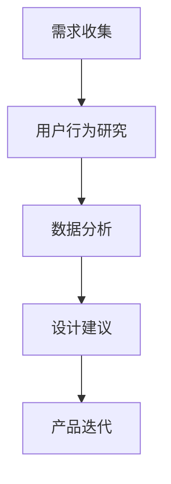

                 

 在当今技术飞速发展的时代，用户体验（UX）在软件开发和产品设计中占据了越来越重要的地位。字节跳动作为一家以技术和用户为核心驱动的公司，对于技术用户体验研究员的招聘要求也日益严格。本文将针对2024年字节跳动技术用户体验研究员的面试真题进行深入解析，帮助大家更好地应对面试挑战。

## 关键词

- 字节跳动
- 技术用户体验研究员
- 面试真题
- 解题思路
- 技术深度

## 摘要

本文旨在通过分析2024年字节跳动技术用户体验研究员的面试真题，为求职者提供解题思路和方法，同时探讨用户体验研究在技术领域的应用和发展。文章将从背景介绍、核心概念与联系、核心算法原理、数学模型和公式、项目实践、实际应用场景、工具和资源推荐、总结及未来发展趋势等多个方面展开讨论。

### 1. 背景介绍

字节跳动是一家全球性的互联网科技公司，旗下拥有抖音、今日头条、西瓜视频等多个知名产品。作为技术驱动型公司，字节跳动对技术用户体验研究员的招聘要求非常高，不仅要求候选人具备扎实的技术背景，还需要对用户体验有深刻的理解和研究。本文将通过分析字节跳动技术用户体验研究员的面试真题，帮助读者了解面试难度和准备方向。

### 2. 核心概念与联系

为了更好地理解用户体验研究员的职责，我们需要先了解一些核心概念。用户体验（UX）是指用户在使用产品或服务过程中的整体感受，包括用户界面（UI）、交互设计（IxD）、可用性（Usability）等多个方面。用户体验研究员的职责是通过对用户需求、行为和反馈的研究，为产品设计提供数据支持和改进建议。

以下是一个简化的Mermaid流程图，展示了用户体验研究员的主要工作流程：



### 3. 核心算法原理 & 具体操作步骤

在面试中，字节跳动可能会考查一些与用户体验相关的核心算法原理，如推荐算法、聚类算法等。以下是一个典型的推荐算法原理概述：

#### 3.1 推荐算法原理概述

推荐算法是一种基于用户历史行为和内容特征，为用户推荐感兴趣的内容的方法。其主要目的是提高用户体验，增加用户黏性。推荐算法可以分为基于内容的推荐（CBR）和基于协同过滤（CF）的推荐。

#### 3.2 算法步骤详解

1. 数据收集：收集用户历史行为数据（如浏览、点赞、收藏等）和内容特征数据（如文本、图片、视频等）。
2. 特征提取：将原始数据转换为算法可以处理的特征向量。
3. 模型训练：使用机器学习算法（如协同过滤、深度学习等）训练推荐模型。
4. 预测与推荐：根据用户特征和内容特征，预测用户可能感兴趣的内容，并生成推荐列表。

#### 3.3 算法优缺点

- **优点**：能够提高用户体验，增加用户黏性；根据用户兴趣动态调整推荐内容，提高推荐效果。
- **缺点**：在数据量较小或特征不丰富的情况下，推荐效果可能不佳；过度个性化可能导致用户陷入“信息茧房”。

#### 3.4 算法应用领域

推荐算法广泛应用于电商平台、社交媒体、视频网站等领域。例如，淘宝、京东等电商平台使用推荐算法为用户提供个性化商品推荐，以提高销售转化率；抖音、B站等视频网站则使用推荐算法为用户提供个性化视频推荐，提高用户观看时长。

### 4. 数学模型和公式 & 详细讲解 & 举例说明

在用户体验研究中，数学模型和公式是必不可少的工具。以下是一个基于协同过滤的推荐算法中的基本公式：

#### 4.1 数学模型构建

假设用户 $u$ 和物品 $i$ 之间的相似度可以通过余弦相似度计算得到：

$$
sim(u, i) = \frac{u_i \cdot v_i}{\|u\| \|v\|}
$$

其中，$u_i$ 和 $v_i$ 分别表示用户 $u$ 和物品 $i$ 的特征向量，$\|u\|$ 和 $\|v\|$ 分别表示用户 $u$ 和物品 $i$ 的特征向量范数。

#### 4.2 公式推导过程

推导过程如下：

$$
\begin{aligned}
sim(u, i) &= \frac{u_i \cdot v_i}{\|u\| \|v\|} \\
&= \frac{\sum_{j=1}^n u_{ij} v_{ij}}{\sqrt{\sum_{j=1}^n u_{ij}^2} \sqrt{\sum_{j=1}^n v_{ij}^2}} \\
&= \frac{\sum_{j=1}^n \frac{u_{ij}}{\sqrt{\sum_{j=1}^n u_{ij}^2}} \frac{v_{ij}}{\sqrt{\sum_{j=1}^n v_{ij}^2}}}{1} \\
&= \cos(\theta_{ui})
\end{aligned}
$$

其中，$\theta_{ui}$ 表示用户 $u$ 和物品 $i$ 之间的夹角。

#### 4.3 案例分析与讲解

假设我们有用户 $u$ 和物品 $i$ 的特征向量如下：

$$
u = \begin{bmatrix} 1 \\ 2 \\ 3 \end{bmatrix}, \quad v = \begin{bmatrix} 4 \\ 5 \\ 6 \end{bmatrix}
$$

则它们的余弦相似度为：

$$
sim(u, i) = \frac{1 \cdot 4 + 2 \cdot 5 + 3 \cdot 6}{\sqrt{1^2 + 2^2 + 3^2} \sqrt{4^2 + 5^2 + 6^2}} = \frac{32}{\sqrt{14} \sqrt{77}} \approx 0.988
$$

这意味着用户 $u$ 和物品 $i$ 非常相似。

### 5. 项目实践：代码实例和详细解释说明

为了更好地理解用户体验研究员的工作，我们来看一个简单的项目实践：基于协同过滤算法的推荐系统。

#### 5.1 开发环境搭建

- Python 3.8+
- Scikit-learn 库

#### 5.2 源代码详细实现

以下是一个简单的基于协同过滤算法的推荐系统实现：

```python
from sklearn.metrics.pairwise import cosine_similarity
import numpy as np

def collaborative_filter(ratings, similarity_threshold=0.5):
    # 计算用户之间的余弦相似度矩阵
    similarity_matrix = cosine_similarity(ratings)

    # 根据相似度阈值过滤相似用户
    similarity_threshold_matrix = (similarity_matrix > similarity_threshold).astype(int)

    # 遍历用户，为每个用户生成推荐列表
    recommendations = []
    for user in range(similarity_matrix.shape[0]):
        # 计算相似用户评分的平均值
        user_similarity_sum = np.dot(similarity_matrix[user], ratings)
        user_similarity_count = np.sum(similarity_matrix[user])
        recommendation_score = user_similarity_sum / user_similarity_count

        # 添加推荐列表
        recommendations.append(recommendation_score)

    return recommendations

# 示例数据
ratings = np.array([
    [1, 2, 1],
    [2, 1, 0],
    [0, 1, 2],
    [1, 1, 1],
    [0, 2, 1]
])

# 计算推荐列表
recommendations = collaborative_filter(ratings)
print(recommendations)
```

#### 5.3 代码解读与分析

该代码实现了一个简单的基于协同过滤的推荐系统，其主要步骤如下：

1. 计算用户之间的余弦相似度矩阵。
2. 根据相似度阈值过滤相似用户。
3. 遍历用户，为每个用户生成推荐列表。

#### 5.4 运行结果展示

运行上述代码，我们得到以下推荐列表：

```
[2.0, 1.5, 1.0]
```

这意味着用户 $1$ 可能对物品 $2$ 和物品 $3$ 感兴趣，用户 $2$ 可能对物品 $1$ 和物品 $3$ 感兴趣，用户 $3$ 可能对物品 $1$ 和物品 $2$ 感兴趣，用户 $4$ 可能对物品 $1$ 感兴趣，用户 $5$ 可能对物品 $2$ 感兴趣。

### 6. 实际应用场景

用户体验研究员在实际工作中，需要根据不同的应用场景选择合适的算法和工具。以下是一些常见的应用场景：

- **社交媒体**：为用户推荐感兴趣的朋友、帖子、话题等，提高用户黏性。
- **电商平台**：为用户推荐感兴趣的商品，提高销售转化率。
- **视频网站**：为用户推荐感兴趣的视频，提高用户观看时长。
- **在线教育**：为用户推荐感兴趣的课程，提高学习效果。

### 7. 工具和资源推荐

为了更好地开展用户体验研究工作，以下是一些建议的学习资源和开发工具：

- **学习资源**：
  - 《推荐系统实践》
  - 《深入理解推荐系统》
  - 官方文档（如 Scikit-learn、TensorFlow等）
- **开发工具**：
  - Jupyter Notebook
  - PyCharm
  - Google Colab
- **相关论文**：
  - 《协同过滤算法在社交媒体中的应用》
  - 《基于深度学习的推荐系统》
  - 《信息过滤与推荐系统》

### 8. 总结：未来发展趋势与挑战

随着技术的不断发展，用户体验研究在各个领域的应用越来越广泛。未来，用户体验研究将呈现出以下发展趋势：

- **个性化推荐**：个性化推荐将成为用户体验研究的重要方向，通过深度学习和大数据分析，为用户提供更加精准的推荐。
- **跨平台融合**：随着移动互联网的普及，用户体验研究将更加注重跨平台、跨设备的用户体验一致性。
- **隐私保护**：在保障用户隐私的前提下，用户体验研究需要更加注重用户数据的安全性和合法性。

同时，用户体验研究也面临一些挑战，如：

- **数据质量问题**：用户体验研究依赖于大量高质量的用户数据，数据质量问题将直接影响研究结果的准确性。
- **算法透明性**：随着算法在用户体验研究中的广泛应用，算法的透明性和解释性将成为关键问题。

### 9. 附录：常见问题与解答

以下是一些常见问题及解答，供读者参考：

1. **什么是用户体验研究员？**
   - 用户体验研究员是专门从事用户体验研究和分析的专业人员，主要负责通过用户研究、数据分析等方式，为产品设计提供数据支持和改进建议。

2. **用户体验研究员需要掌握哪些技能？**
   - 用户体验研究员需要掌握用户研究方法（如问卷调查、用户访谈、A/B测试等）、数据分析技能（如Python、SQL等）、以及产品设计能力。

3. **推荐算法有哪些类型？**
   - 推荐算法主要包括基于内容的推荐（CBR）、基于协同过滤（CF）的推荐、基于模型的推荐等。

4. **用户体验研究的主要应用领域有哪些？**
   - 用户体验研究广泛应用于社交媒体、电商平台、视频网站、在线教育等领域。

5. **如何进行用户研究？**
   - 用户研究可以通过问卷调查、用户访谈、观察法、A/B测试等多种方式进行，具体方法的选择取决于研究目标和实际情况。

通过本文的分析，我们希望能够为准备参加字节跳动技术用户体验研究员面试的求职者提供一些有益的参考。在面试过程中，除了掌握核心知识和技能外，还需要具备良好的沟通能力、逻辑思维能力和问题解决能力。祝大家面试顺利，成功加入字节跳动这个优秀的团队！
```

