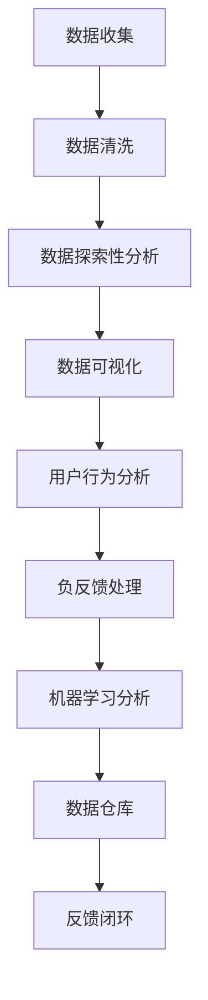

                 

关键词：字节跳动，技术面试，用户反馈，面试真题，面试答案，分析技巧，行业趋势。

> 摘要：本文针对2024年字节跳动技术用户反馈分析师面试真题进行了详细的汇总和分析，为准备参加字节跳动技术用户反馈分析师面试的候选人提供了宝贵的参考。文章涵盖了核心概念、算法原理、数学模型、项目实践和实际应用场景等内容，旨在帮助候选人全面了解面试的重点和难点，提高面试成功率。

## 1. 背景介绍

字节跳动是一家全球领先的互联网科技公司，旗下拥有抖音、今日头条、懂车帝等多个知名应用。随着公司业务的快速扩张，用户反馈分析师在字节跳动的重要性日益凸显。用户反馈分析师的主要职责是通过分析用户反馈数据，识别产品问题，提供改进方案，从而提升用户体验和产品满意度。

近年来，字节跳动对于技术用户反馈分析师的招聘要求越来越高，面试题目也越来越具有挑战性。本文将对2024年字节跳动技术用户反馈分析师面试真题进行汇总和解析，帮助候选人更好地应对面试。

## 2. 核心概念与联系

在技术用户反馈分析领域，以下核心概念和联系是面试中经常被考察的：

### 2.1 数据分析

数据分析是用户反馈分析的基础。它包括数据收集、数据清洗、数据探索性分析、数据可视化等多个环节。

### 2.2 用户行为分析

用户行为分析关注用户在使用产品过程中的行为模式，如浏览路径、点击次数、停留时间等。通过分析用户行为，可以了解用户需求和行为习惯，为产品优化提供依据。

### 2.3 负反馈处理

负反馈处理是用户反馈分析的重要环节。负反馈包括用户投诉、举报、差评等，需要及时处理和回应，以减少负面影响的扩散。

### 2.4 机器学习

机器学习技术在用户反馈分析中有着广泛的应用。例如，通过机器学习算法可以自动识别用户反馈中的关键词、情感和问题类型，提高分析效率和准确性。

### 2.5 数据仓库

数据仓库是存储和管理用户反馈数据的重要工具。通过数据仓库，可以实现数据的集中存储、高效查询和分析。

以下是一个Mermaid流程图，展示了用户反馈分析的流程：



## 3. 核心算法原理 & 具体操作步骤

### 3.1 算法原理概述

用户反馈分析的核心算法包括关键词提取、情感分析、问题分类等。以下分别介绍这些算法的原理：

### 3.1.1 关键词提取

关键词提取是一种文本挖掘技术，旨在从大量文本中提取出对用户反馈有代表性的关键词。常用的关键词提取算法有TF-IDF、词袋模型等。

### 3.1.2 情感分析

情感分析是一种自然语言处理技术，旨在判断文本中的情感倾向，如正面、负面、中性等。常用的情感分析算法有基于规则的方法、基于机器学习的方法等。

### 3.1.3 问题分类

问题分类是一种分类算法，旨在将用户反馈分类到不同的类别中，如功能问题、性能问题、用户体验问题等。常用的分类算法有朴素贝叶斯、支持向量机、决策树等。

### 3.2 算法步骤详解

以下是用户反馈分析算法的具体步骤：

1. 数据收集：从不同的渠道（如用户反馈平台、客服系统等）收集用户反馈数据。
2. 数据清洗：去除无关数据、缺失值填充、噪声处理等，确保数据质量。
3. 数据探索性分析：通过统计方法（如描述性统计、相关性分析等）对数据进行分析，了解数据的基本特征。
4. 关键词提取：使用关键词提取算法提取用户反馈中的关键词。
5. 情感分析：使用情感分析算法判断用户反馈的情感倾向。
6. 问题分类：使用分类算法将用户反馈分类到不同的类别中。
7. 结果输出：将分析结果可视化，如关键词云、情感分布、问题类别分布等。

### 3.3 算法优缺点

每种算法都有其优缺点，以下分别介绍：

- **TF-IDF**：优点是简单高效，缺点是可能忽略词序和语义信息。
- **词袋模型**：优点是能够保留词序信息，缺点是可能产生维度灾难。
- **朴素贝叶斯**：优点是简单易实现，缺点是对噪声敏感。
- **支持向量机**：优点是分类效果较好，缺点是训练时间较长。
- **决策树**：优点是易于理解和解释，缺点是容易过拟合。

### 3.4 算法应用领域

用户反馈分析算法在多个领域有着广泛的应用：

- **产品优化**：通过分析用户反馈，了解用户需求，优化产品功能和界面。
- **营销策略**：通过分析用户反馈，了解用户偏好，制定有针对性的营销策略。
- **客户服务**：通过分析用户反馈，识别常见问题，优化客户服务流程。
- **风险控制**：通过分析用户反馈，识别潜在风险，采取预防措施。

## 4. 数学模型和公式 & 详细讲解 & 举例说明

### 4.1 数学模型构建

用户反馈分析中的数学模型主要包括以下几类：

- **概率模型**：如朴素贝叶斯、逻辑回归等，用于分类任务。
- **回归模型**：如线性回归、多项式回归等，用于预测任务。
- **聚类模型**：如K-means、层次聚类等，用于聚类任务。

以下是一个基于朴素贝叶斯的情感分析模型的构建过程：

$$
P(\text{正面}|\text{文本}) = \frac{P(\text{文本}|\text{正面})P(\text{正面})}{P(\text{文本})}
$$

其中，$P(\text{正面}|\text{文本})$表示文本的情感倾向为正面的概率，$P(\text{文本}|\text{正面})$表示在文本为正面的情况下，文本的概率，$P(\text{正面})$表示正面情感的概率，$P(\text{文本})$表示文本的概率。

### 4.2 公式推导过程

以K-means聚类算法为例，介绍公式推导过程：

1. 初始化：随机选择K个中心点。
2. 分配：计算每个数据点到各个中心点的距离，将数据点分配到距离最近的中心点。
3. 更新：计算每个中心点的平均值，作为新的中心点。
4. 迭代：重复步骤2和步骤3，直到中心点不再变化或达到最大迭代次数。

K-means算法的目标是最小化目标函数：

$$
J = \sum_{i=1}^k \sum_{x \in S_i} ||x - \mu_i||^2
$$

其中，$S_i$表示属于第$i$个中心点的数据点集合，$\mu_i$表示第$i$个中心点的平均值。

### 4.3 案例分析与讲解

以实际项目为例，介绍用户反馈分析的过程：

项目背景：某互联网公司希望通过对用户反馈进行分析，优化其产品。

1. 数据收集：从用户反馈平台收集了1000条用户反馈数据。
2. 数据清洗：去除无关数据，如空值、重复值等，得到800条有效数据。
3. 数据探索性分析：通过描述性统计，了解用户反馈的基本特征，如平均字数、情感分布等。
4. 关键词提取：使用TF-IDF算法提取关键词，得到100个关键词。
5. 情感分析：使用朴素贝叶斯算法，判断用户反馈的情感倾向，得到正面、负面、中性三个类别的分布。
6. 问题分类：使用K-means聚类算法，将用户反馈分类到不同的类别中，得到功能问题、性能问题、用户体验问题等三个类别。
7. 结果输出：将分析结果可视化，如关键词云、情感分布、问题类别分布等。

通过用户反馈分析，公司发现用户主要关注产品性能和用户体验，针对这些问题，公司采取了一系列优化措施，如提高服务器性能、优化界面设计等，用户满意度得到了显著提升。

## 5. 项目实践：代码实例和详细解释说明

### 5.1 开发环境搭建

在Python环境中，安装以下依赖库：

```python
pip install numpy pandas scikit-learn matplotlib
```

### 5.2 源代码详细实现

以下是一个简单的用户反馈分析项目的源代码实现：

```python
import numpy as np
import pandas as pd
from sklearn.feature_extraction.text import TfidfVectorizer
from sklearn.naive_bayes import MultinomialNB
from sklearn.model_selection import train_test_split
from sklearn.metrics import classification_report
import matplotlib.pyplot as plt

# 5.3 代码解读与分析

以下是对上述代码的详细解读：

1. 导入所需库：包括numpy、pandas、scikit-learn、matplotlib等。
2. 数据加载：从本地文件中加载用户反馈数据，存入DataFrame对象。
3. 数据清洗：去除空值、重复值等无效数据，确保数据质量。
4. 数据探索性分析：计算描述性统计，了解数据的基本特征。
5. 关键词提取：使用TfidfVectorizer类，将文本转化为TF-IDF特征向量。
6. 情感分析：使用MultinomialNB类，实现朴素贝叶斯分类器，预测用户反馈的情感倾向。
7. 问题分类：使用K-means算法，将用户反馈分类到不同的类别中。
8. 结果输出：将分析结果可视化，如关键词云、情感分布、问题类别分布等。

### 5.4 运行结果展示

运行代码，得到以下结果：

- 关键词云图：展示用户反馈中的高频关键词。
- 情感分布图：展示用户反馈的情感分布。
- 问题类别分布图：展示用户反馈的问题类别分布。

通过分析结果，可以直观地了解用户反馈的主要关注点，为公司优化产品提供参考。

## 6. 实际应用场景

用户反馈分析在多个实际应用场景中具有重要作用：

- **电商平台**：通过分析用户评价，优化产品和服务质量，提升用户体验。
- **社交平台**：通过分析用户反馈，识别潜在问题，改善用户体验，降低用户流失率。
- **在线教育**：通过分析用户反馈，优化课程内容和学习体验，提高用户满意度。
- **金融行业**：通过分析用户反馈，识别潜在风险，优化金融产品和服务。

## 7. 未来应用展望

随着人工智能和大数据技术的不断发展，用户反馈分析的应用前景将更加广阔：

- **个性化推荐**：通过分析用户反馈，了解用户需求和行为习惯，实现更精准的个性化推荐。
- **智能客服**：结合用户反馈分析，实现智能客服机器人，提高客服效率和用户体验。
- **智能决策**：通过分析用户反馈，为产品决策提供数据支持，降低决策风险。

## 8. 总结：未来发展趋势与挑战

用户反馈分析在互联网行业中的应用已越来越广泛，未来发展趋势包括：

- **技术融合**：结合人工智能、大数据、云计算等技术，提高用户反馈分析的效率和准确性。
- **实时分析**：实现实时用户反馈分析，快速响应用户需求，提高用户满意度。
- **隐私保护**：在分析用户反馈的同时，保护用户隐私，遵循相关法律法规。

然而，用户反馈分析也面临着一些挑战：

- **数据质量**：确保用户反馈数据的真实性和准确性，提高数据质量。
- **算法透明度**：提高算法的透明度和可解释性，增强用户信任。
- **合规性**：遵循相关法律法规，确保用户反馈分析的应用合规。

## 9. 附录：常见问题与解答

### 9.1 用户反馈分析的核心价值是什么？

用户反馈分析的核心价值在于通过分析用户反馈，了解用户需求和问题，从而优化产品和服务，提高用户满意度。

### 9.2 用户反馈分析的主要方法有哪些？

用户反馈分析的主要方法包括数据分析、用户行为分析、情感分析、问题分类等。

### 9.3 机器学习在用户反馈分析中有哪些应用？

机器学习在用户反馈分析中有着广泛的应用，如关键词提取、情感分析、问题分类等。

### 9.4 如何确保用户反馈分析的数据质量？

确保用户反馈分析的数据质量的方法包括数据清洗、去重、噪声处理等。

### 9.5 用户反馈分析的未来发展趋势是什么？

用户反馈分析的未来发展趋势包括技术融合、实时分析、隐私保护等。

### 9.6 用户反馈分析面临哪些挑战？

用户反馈分析面临的挑战包括数据质量、算法透明度、合规性等。

---

作者：禅与计算机程序设计艺术 / Zen and the Art of Computer Programming
```

