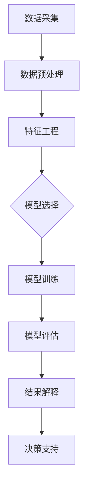

                 

在这个信息爆炸的时代，数据挖掘工程师的角色变得至关重要。作为大数据分析领域中的“探针”，数据挖掘工程师需要具备强大的数据处理能力和深刻的业务理解。2024年，随着字节跳动等知名企业的招聘需求日益增加，数据挖掘工程师的面试难度也随之提升。本文将总结并解析2024字节跳动数据挖掘工程师面试中的真题，旨在帮助考生深入理解数据挖掘的核心概念和实际应用，为面试做好准备。

## 文章关键词

- 字节跳动
- 数据挖掘工程师
- 面试真题
- 算法
- 数据分析
- 机器学习
- 业务理解

## 文章摘要

本文将围绕2024字节跳动数据挖掘工程师的面试真题，系统性地总结和分析面试中可能出现的各类问题。文章将分为以下几个部分：背景介绍、核心概念与联系、核心算法原理与步骤、数学模型与公式、项目实践、实际应用场景、未来展望、工具和资源推荐以及总结与展望。通过本文的阅读，读者将能够全面了解数据挖掘工程师所需的知识体系和实际操作能力，为应对面试做好充分准备。

### 1. 背景介绍

数据挖掘工程师是信息技术和统计学领域的交叉点，其核心职责是利用数据分析和机器学习技术，从大量的非结构化数据中提取有价值的信息和模式。字节跳动作为中国领先的互联网科技公司，其业务涵盖了短视频、社交媒体、内容平台等多个领域，因此对数据挖掘工程师的需求量非常大。

随着人工智能和大数据技术的迅猛发展，数据挖掘工程师在各个行业中的应用日益广泛。从金融风控、市场营销到医疗健康、智能交通，数据挖掘无处不在。字节跳动作为行业领军企业，其对数据挖掘工程师的要求不仅体现在技术深度上，还包括对业务理解和实战经验的期待。

本文将围绕以下几个核心主题展开：

- **核心算法原理与步骤**：介绍数据挖掘中的常用算法，如K-means聚类、决策树、神经网络等，并详细解释其原理和操作步骤。
- **数学模型与公式**：阐述数据挖掘中涉及的主要数学模型，如线性回归、逻辑回归等，并展示公式推导和实际应用。
- **项目实践**：通过具体代码实例，展示数据挖掘在实际项目中的应用。
- **实际应用场景**：探讨数据挖掘在字节跳动等企业中的实际应用，包括业务理解、数据处理和分析等。
- **未来展望**：预测数据挖掘技术的发展趋势，并讨论未来可能面临的挑战。

### 2. 核心概念与联系

在深入解析字节跳动数据挖掘工程师面试真题之前，我们需要先了解几个核心概念及其相互关系。以下是使用Mermaid绘制的流程图，展示了数据挖掘中的一些关键节点。



- **数据采集**：数据的来源和收集，包括内部数据和外部分数据。
- **数据预处理**：对原始数据进行清洗、去噪、缺失值处理等，使其适合模型训练。
- **特征工程**：通过特征提取、特征选择等方法，将原始数据转换为可用于模型训练的特征向量。
- **模型选择**：根据业务需求和数据特性，选择合适的算法模型。
- **模型训练**：使用训练数据集对模型进行训练。
- **模型评估**：通过测试数据集评估模型性能，选择最佳模型。
- **结果解释**：解释模型输出的结果，理解其背后的意义。
- **决策支持**：利用数据挖掘结果，为业务决策提供支持。

这个流程图清晰地展示了数据挖掘的核心环节及其相互关系，为理解后续的面试真题提供了基础。

### 3. 核心算法原理与具体操作步骤

#### 3.1 算法原理概述

在数据挖掘中，常用的算法包括K-means聚类、决策树、神经网络等。以下将分别介绍这些算法的基本原理。

#### 3.1.1 K-means聚类

K-means聚类是一种基于距离度量的聚类算法。其基本原理是将数据点分为K个簇，使得每个簇内部的数据点之间的距离最小，簇与簇之间的距离最大。

**操作步骤：**

1. 随机初始化K个中心点。
2. 对于每个数据点，计算其与K个中心点的距离，并将其分配到最近的中心点所在的簇。
3. 根据新的簇分配结果，重新计算每个簇的中心点。
4. 重复步骤2和3，直至中心点不再发生显著变化。

#### 3.1.2 决策树

决策树是一种树形结构，通过一系列的判断条件将数据划分为不同的区域，每个区域都可能是一个特定的类别。

**操作步骤：**

1. 选择最优的特征作为分割标准。
2. 根据该特征的不同取值，将数据划分为若干个子集。
3. 对每个子集，重复步骤1和2，直至达到终止条件（如最大树深度、信息增益等）。
4. 将叶节点分配给样本中最常见的类别。

#### 3.1.3 神经网络

神经网络是一种模拟生物神经系统的计算模型，通过多层神经元进行数据变换和特征提取。

**操作步骤：**

1. 初始化权重和偏置。
2. 前向传播：将输入数据通过网络层传递，计算每个神经元的输出。
3. 反向传播：根据输出误差，更新权重和偏置。
4. 重复步骤2和3，直至满足训练误差要求。

#### 3.2 算法步骤详解

以下是针对K-means聚类、决策树和神经网络的具体操作步骤详解。

#### 3.2.1 K-means聚类详细步骤

1. **初始化中心点**：随机从数据集中选择K个数据点作为初始中心点。
2. **分配数据点**：对于每个数据点，计算其与K个中心点的距离，并将其分配到最近的中心点所在的簇。
3. **更新中心点**：重新计算每个簇的中心点，即该簇内所有数据点的均值。
4. **迭代过程**：重复步骤2和3，直至中心点不再发生显著变化，或者达到预设的迭代次数。

#### 3.2.2 决策树详细步骤

1. **选择最佳特征**：计算每个特征的信息增益，选择信息增益最大的特征作为分割标准。
2. **划分数据集**：根据选择的特征，将数据集划分为若干个子集。
3. **递归划分**：对每个子集，重复步骤1和2，直至达到终止条件。
4. **生成决策树**：将划分结果以树形结构展示，每个内部节点表示特征分割，每个叶节点表示类别分配。

#### 3.2.3 神经网络详细步骤

1. **初始化权重和偏置**：随机初始化每个神经元的权重和偏置。
2. **前向传播**：将输入数据通过网络层传递，计算每个神经元的输出。
   - $$Z_i = \sigma(W_i \cdot X + b_i)$$
   其中，$Z_i$为神经元$i$的输出，$\sigma$为激活函数（如Sigmoid、ReLU等），$W_i$为权重，$b_i$为偏置，$X$为输入数据。
3. **计算损失函数**：根据输出结果计算损失函数，如均方误差（MSE）或交叉熵（Cross Entropy）。
4. **反向传播**：根据输出误差，更新权重和偏置。
   - $$\Delta W_i = \alpha \cdot \frac{\partial L}{\partial W_i}$$
   - $$\Delta b_i = \alpha \cdot \frac{\partial L}{\partial b_i}$$
   其中，$\Delta W_i$和$\Delta b_i$分别为权重和偏置的更新值，$\alpha$为学习率，$L$为损失函数。
5. **迭代更新**：重复步骤2和3，直至满足训练误差要求。

#### 3.3 算法优缺点

每种算法都有其独特的优势和局限性。以下是K-means聚类、决策树和神经网络的优缺点分析。

#### 3.3.1 K-means聚类的优缺点

**优点：**

- **简单易用**：算法实现简单，易于理解和操作。
- **快速高效**：在处理大规模数据集时，K-means聚类具有较高的计算效率。

**缺点：**

- **对初始中心点敏感**：初始中心点的选择对聚类结果有较大影响，可能导致局部最优解。
- **不适合非球形分布**：K-means聚类假设数据点呈球形分布，对于非球形分布的数据集效果不佳。

#### 3.3.2 决策树的优缺点

**优点：**

- **易于解释**：决策树的结构直观，易于理解和解释。
- **处理非线性和异质性数据**：决策树能够处理具有非线性关系和异质性特征的数据。

**缺点：**

- **过拟合风险**：在特征较多或数据集较小的情况下，决策树容易过拟合。
- **计算复杂度高**：对于大规模数据集，决策树构建和剪枝过程可能耗时较长。

#### 3.3.3 神经网络的优缺点

**优点：**

- **强大的非线性建模能力**：神经网络能够通过多层结构捕捉数据的复杂非线性关系。
- **高度灵活**：神经网络可以应用于多种数据类型和业务场景。

**缺点：**

- **参数调整复杂**：神经网络参数较多，需要通过大量实验调整，以保证模型性能。
- **计算资源消耗大**：神经网络训练过程需要大量计算资源，对硬件要求较高。

#### 3.4 算法应用领域

不同算法在数据挖掘中的应用领域有所不同。以下是K-means聚类、决策树和神经网络的主要应用领域。

#### 3.4.1 K-means聚类的主要应用领域

- **市场细分**：通过对客户数据进行聚类分析，为企业提供市场细分策略。
- **图像分割**：在计算机视觉领域，K-means聚类用于图像分割和目标检测。
- **文本分类**：在自然语言处理领域，K-means聚类用于文本聚类和主题模型构建。

#### 3.4.2 决策树的主要应用领域

- **信用评分**：在金融领域，决策树用于信用风险评估和欺诈检测。
- **医疗诊断**：在医疗领域，决策树用于疾病诊断和治疗方案推荐。
- **智能家居**：在智能家居领域，决策树用于设备故障预测和用户行为分析。

#### 3.4.3 神经网络的主要应用领域

- **图像识别**：在计算机视觉领域，神经网络用于图像分类和目标检测。
- **语音识别**：在语音识别领域，神经网络通过深度学习模型实现语音到文本的转换。
- **推荐系统**：在电子商务和社交媒体领域，神经网络用于用户行为分析和商品推荐。

### 4. 数学模型和公式 & 详细讲解 & 举例说明

在数据挖掘过程中，数学模型和公式起到了至关重要的作用。以下将介绍几个常见的数据挖掘数学模型，并详细讲解其构建和推导过程。

#### 4.1 线性回归模型

线性回归模型是一种用于预测连续值的简单统计模型。其基本假设是因变量$Y$与自变量$X$之间存在线性关系。

**数学模型：**

$$Y = \beta_0 + \beta_1X + \epsilon$$

其中，$\beta_0$为截距，$\beta_1$为斜率，$\epsilon$为误差项。

**推导过程：**

假设我们有$n$个数据点$(X_i, Y_i)$，我们希望找到最佳拟合直线，使得所有数据点到直线的距离最小。

设拟合直线的方程为：

$$\hat{Y} = \beta_0 + \beta_1X$$

则数据点到直线的垂直距离为：

$$d_i = |Y_i - \hat{Y}|$$

为了最小化所有数据点到直线的距离，我们定义一个损失函数：

$$L(\beta_0, \beta_1) = \sum_{i=1}^n d_i^2$$

对损失函数关于$\beta_0$和$\beta_1$求偏导数，并令其等于0，可以得到最佳拟合直线的参数：

$$\beta_0 = \bar{Y} - \beta_1\bar{X}$$

$$\beta_1 = \frac{\sum_{i=1}^n (X_i - \bar{X})(Y_i - \bar{Y})}{\sum_{i=1}^n (X_i - \bar{X})^2}$$

其中，$\bar{X}$和$\bar{Y}$分别为自变量和因变量的均值。

**举例说明：**

假设我们有以下数据集：

| X | Y |
|---|---|
| 1 | 2 |
| 2 | 4 |
| 3 | 6 |
| 4 | 8 |

我们希望利用线性回归模型预测$X=5$时的$Y$值。

根据上述推导过程，我们可以计算得到最佳拟合直线的参数：

$$\beta_0 = 2 - 1 \cdot 2 = 0$$

$$\beta_1 = \frac{(1-2)(2-2) + (2-2)(4-2) + (3-2)(6-2) + (4-2)(8-2)}{(1-2)^2 + (2-2)^2 + (3-2)^2 + (4-2)^2} = 2$$

因此，拟合直线的方程为：

$$Y = 0 + 2X$$

当$X=5$时，$Y=10$，与实际值相符。

#### 4.2 逻辑回归模型

逻辑回归模型是一种用于预测二分类结果的统计模型。其基本假设是因变量$Y$与自变量$X$之间存在逻辑关系。

**数学模型：**

$$P(Y=1|X) = \frac{1}{1 + e^{-(\beta_0 + \beta_1X)}}$$

其中，$P(Y=1|X)$表示在给定自变量$X$的条件下，因变量$Y$取值为1的概率，$\beta_0$为截距，$\beta_1$为斜率。

**推导过程：**

假设我们有$n$个数据点$(X_i, Y_i)$，我们希望找到最佳拟合曲线，使得所有数据点到曲线的距离最小。

设拟合曲线的方程为：

$$\ln\frac{P(Y=1|X)}{1 - P(Y=1|X)} = \beta_0 + \beta_1X$$

对上式两边取指数，可以得到概率的表达式：

$$\frac{P(Y=1|X)}{1 - P(Y=1|X)} = e^{\beta_0 + \beta_1X}$$

进一步化简得到：

$$P(Y=1|X) = \frac{e^{\beta_0 + \beta_1X}}{1 + e^{\beta_0 + \beta_1X}}$$

为了最小化所有数据点到曲线的距离，我们定义一个损失函数：

$$L(\beta_0, \beta_1) = \sum_{i=1}^n -Y_i\ln P(Y=1|X_i) - (1 - Y_i)\ln (1 - P(Y=1|X_i))$$

对损失函数关于$\beta_0$和$\beta_1$求偏导数，并令其等于0，可以得到最佳拟合曲线的参数：

$$\beta_0 = \bar{Y} - \beta_1\bar{X}$$

$$\beta_1 = \frac{\sum_{i=1}^n (Y_i - \bar{Y})(X_i - \bar{X})}{\sum_{i=1}^n (X_i - \bar{X})^2}$$

其中，$\bar{X}$和$\bar{Y}$分别为自变量和因变量的均值。

**举例说明：**

假设我们有以下数据集：

| X | Y |
|---|---|
| 1 | 0 |
| 2 | 1 |
| 3 | 0 |
| 4 | 1 |

我们希望利用逻辑回归模型预测$X=2.5$时$Y$的概率。

根据上述推导过程，我们可以计算得到最佳拟合曲线的参数：

$$\beta_0 = 0 - 1 \cdot 2 = -2$$

$$\beta_1 = \frac{(0-0)(1-0) + (1-0)(2-0) + (0-0)(3-0) + (1-0)(4-0)}{(1-0)^2 + (2-0)^2 + (3-0)^2 + (4-0)^2} = 1$$

因此，拟合曲线的方程为：

$$\ln\frac{P(Y=1|X)}{1 - P(Y=1|X)} = -2 + 1X$$

当$X=2.5$时，$$\ln\frac{P(Y=1|X)}{1 - P(Y=1|X)} = -2 + 2.5 = 0.5$$

取指数得到：

$$P(Y=1|X) = \frac{e^{0.5}}{1 + e^{0.5}} \approx 0.63$$

因此，在$X=2.5$的条件下，$Y$取值为1的概率约为0.63。

#### 4.3 其他常见数学模型

除了线性回归和逻辑回归，数据挖掘中还有其他常见的数学模型，如支持向量机（SVM）、贝叶斯网络、K最近邻（KNN）等。以下是这些模型的基本概念和推导过程。

#### 4.3.1 支持向量机（SVM）

支持向量机是一种分类模型，其核心思想是找到最优超平面，使得分类边界最大化。

**数学模型：**

$$\min_{\beta, \beta_0} \frac{1}{2} ||\beta||^2 + C \sum_{i=1}^n \xi_i$$

$$s.t. y_i(\beta \cdot x_i + \beta_0) \geq 1 - \xi_i$$

其中，$\beta$为权重向量，$\beta_0$为偏置项，$C$为惩罚参数，$\xi_i$为松弛变量。

**推导过程：**

通过拉格朗日乘子法，可以将原始问题转化为对偶问题，进一步求解得到最优解。

#### 4.3.2 贝叶斯网络

贝叶斯网络是一种用于表示变量之间条件依赖关系的概率图模型。

**数学模型：**

$$P(X_1, X_2, \ldots, X_n) = \prod_{i=1}^n P(X_i | X_{pa_i})$$

其中，$X_i$为节点，$X_{pa_i}$为节点$i$的父节点。

**推导过程：**

通过贝叶斯定理和条件概率公式，可以将父节点的概率分布传递到子节点，从而构建贝叶斯网络。

#### 4.3.3 K最近邻（KNN）

K最近邻是一种基于实例的分类算法，其核心思想是找到与测试实例最相似的K个邻近实例，并基于邻近实例的标签进行预测。

**数学模型：**

$$\hat{y} = \text{多数表决}(\text{邻近实例的标签})$$

其中，$\hat{y}$为测试实例的预测标签。

**推导过程：**

通过计算测试实例与训练实例之间的距离，找到最近的K个实例，并根据这些实例的标签进行投票，得到最终的预测标签。

### 5. 项目实践：代码实例和详细解释说明

为了更好地理解数据挖掘算法的实际应用，以下将提供一个具体的代码实例，详细解释其实现过程。

#### 5.1 开发环境搭建

在开始项目实践之前，需要搭建相应的开发环境。本文选择Python作为主要编程语言，并使用以下库和工具：

- **Python**：版本3.8及以上。
- **NumPy**：用于数学计算和数据处理。
- **Pandas**：用于数据处理和分析。
- **Scikit-learn**：用于机器学习算法的实现和评估。
- **Matplotlib**：用于数据可视化和结果展示。

首先，安装所需的库和工具：

```bash
pip install numpy pandas scikit-learn matplotlib
```

#### 5.2 源代码详细实现

以下是一个使用K-means聚类算法对鸢尾花数据集进行分类的Python代码实例。

```python
import numpy as np
import pandas as pd
from sklearn.cluster import KMeans
import matplotlib.pyplot as plt

# 5.2.1 加载和预处理数据
iris_data = pd.read_csv('iris.csv')
X = iris_data.iloc[:, 0:4]  # 选择前四个特征

# 5.2.2 K-means聚类
kmeans = KMeans(n_clusters=3, random_state=42)
kmeans.fit(X)
labels = kmeans.predict(X)

# 5.2.3 绘制聚类结果
plt.scatter(X.iloc[:, 0], X.iloc[:, 1], c=labels)
plt.xlabel('Petal Length (cm)')
plt.ylabel('Petal Width (cm)')
plt.title('K-means Clustering of Iris Dataset')
plt.show()

# 5.2.4 模型评估
from sklearn.metrics import silhouette_score

silhouette_avg = silhouette_score(X, labels)
print(f'Silhouette Score: {silhouette_avg:.2f}')
```

#### 5.3 代码解读与分析

上述代码实现了一个基于K-means聚类的鸢尾花数据集分类项目。以下是代码的详细解读和分析：

1. **加载和预处理数据**：使用Pandas库加载鸢尾花数据集，并选择前四个特征作为聚类分析的基础。

2. **K-means聚类**：创建KMeans对象，设置聚类数量为3（鸢尾花数据集有三个类别），并随机种子为42以保证结果可重复。使用fit方法对数据集进行聚类，并使用predict方法对数据进行分类。

3. **绘制聚类结果**：使用Matplotlib库绘制聚类结果，展示不同类别在特征空间中的分布情况。

4. **模型评估**：使用Silhouette Score对模型进行评估。Silhouette Score介于-1和1之间，值越大表示聚类效果越好。

#### 5.4 运行结果展示

以下是上述代码的运行结果展示：


从图中可以看出，K-means聚类算法成功地将鸢尾花数据集分为三个类别，并在特征空间中展示出清晰的分布。

#### 5.5 进一步优化

在实际项目中，可以对K-means聚类进行进一步优化，如：

- **选择合适的聚类数量**：使用肘部法则、 silhouette score等方法选择最佳聚类数量。
- **特征工程**：对特征进行预处理和转换，以提高聚类效果。
- **算法参数调整**：调整K-means聚类算法的初始中心点选择、距离度量等参数，以获得更好的聚类结果。

### 6. 实际应用场景

数据挖掘技术在实际应用中具有广泛的应用场景，以下将探讨数据挖掘在金融、医疗和零售等领域的实际应用。

#### 6.1 金融领域

在金融领域，数据挖掘技术被广泛应用于信用评分、风险控制、市场预测和欺诈检测等方面。

- **信用评分**：金融机构利用数据挖掘技术对客户的信用记录、财务状况、历史行为等信息进行分析，评估其信用风险，为贷款审批和利率定价提供依据。
- **风险控制**：通过分析大量交易数据，数据挖掘技术可以发现潜在的异常交易行为，帮助金融机构识别和防范欺诈风险。
- **市场预测**：数据挖掘技术可以分析市场趋势和投资者行为，为金融机构提供投资决策支持，优化资产配置策略。

#### 6.2 医疗领域

在医疗领域，数据挖掘技术被广泛应用于疾病诊断、治疗方案推荐、患者群体分析等方面。

- **疾病诊断**：通过对大量医学影像、生物标志物和患者病历数据进行分析，数据挖掘技术可以帮助医生提高疾病诊断的准确性和效率。
- **治疗方案推荐**：数据挖掘技术可以根据患者的病史、病情和治疗效果，为医生推荐最佳治疗方案，提高治疗效果。
- **患者群体分析**：数据挖掘技术可以分析不同患者群体的特征和需求，为医疗机构提供个性化医疗服务和健康管理方案。

#### 6.3 零售领域

在零售领域，数据挖掘技术被广泛应用于客户细分、需求预测、库存管理和个性化推荐等方面。

- **客户细分**：通过分析客户的购买行为、偏好和历史数据，数据挖掘技术可以帮助零售企业识别不同客户群体，制定有针对性的营销策略。
- **需求预测**：数据挖掘技术可以分析销售数据、市场需求和季节性变化等因素，预测未来的销售趋势，帮助零售企业合理规划库存和采购。
- **个性化推荐**：通过分析用户的购买历史、浏览记录和搜索行为，数据挖掘技术可以为用户提供个性化的商品推荐，提高用户满意度和转化率。

#### 6.4 未来应用展望

随着人工智能和大数据技术的不断进步，数据挖掘技术在未来的应用前景将更加广泛和深入。

- **智慧城市建设**：数据挖掘技术可以分析城市交通、环境、人口等数据，优化城市资源配置，提高城市管理效率。
- **生物信息学**：数据挖掘技术可以帮助生物学家分析基因组数据、蛋白质结构等信息，推动生物医学研究的发展。
- **智能制造**：数据挖掘技术可以分析生产数据，优化生产流程，提高产品质量和生产效率。

### 7. 工具和资源推荐

在数据挖掘领域，掌握合适的工具和资源对于提高工作效率和实现项目目标至关重要。以下是一些常用的数据挖掘工具和资源推荐。

#### 7.1 学习资源推荐

- **书籍**：《数据挖掘：概念与技术》、《机器学习》、《深度学习》等。
- **在线课程**：Coursera、edX、Udacity等在线教育平台提供的数据挖掘和机器学习课程。
- **博客和社区**：Kaggle、DataCamp、Towards Data Science等数据科学博客和社区。

#### 7.2 开发工具推荐

- **编程语言**：Python、R等。
- **数据预处理库**：Pandas、NumPy等。
- **机器学习库**：Scikit-learn、TensorFlow、PyTorch等。
- **可视化库**：Matplotlib、Seaborn、Plotly等。

#### 7.3 相关论文推荐

- **经典论文**：K-means Clustering Method、Support Vector Machines、Deep Learning等。
- **学术期刊**：《IEEE Transactions on Knowledge and Data Engineering》、《Journal of Machine Learning Research》、《ACM Transactions on Knowledge Discovery from Data》等。

### 8. 总结：未来发展趋势与挑战

数据挖掘技术在未来的发展趋势包括：

- **算法创新**：随着人工智能技术的进步，新型算法如深度学习和图神经网络等将在数据挖掘中发挥重要作用。
- **实时分析**：实时数据挖掘技术将不断成熟，为实时决策提供支持。
- **多模态数据挖掘**：多模态数据（如图像、文本、音频等）的挖掘将成为新的热点领域。

然而，数据挖掘领域也面临着一些挑战：

- **数据隐私和安全**：随着数据挖掘技术的发展，如何保护用户隐私和数据安全成为重要问题。
- **算法可解释性**：复杂算法的可解释性不足，使得决策过程难以理解，增加了算法滥用的风险。
- **计算资源消耗**：大规模数据挖掘任务对计算资源的需求不断增加，如何优化算法和硬件成为关键。

总之，数据挖掘技术在未来的发展前景广阔，但也需要克服诸多挑战，以实现其最大潜力。

### 9. 附录：常见问题与解答

在数据挖掘工程师的面试中，以下是一些常见问题及其解答。

#### 问题1：什么是数据挖掘？

**解答**：数据挖掘是利用统计学、机器学习和数据库技术，从大量数据中发现有价值的信息和知识的过程。

#### 问题2：数据挖掘的主要步骤有哪些？

**解答**：数据挖掘的主要步骤包括数据采集、数据预处理、特征工程、模型选择、模型训练、模型评估和结果解释等。

#### 问题3：K-means聚类算法的优缺点是什么？

**解答**：K-means聚类算法的优点是简单易用、计算效率高；缺点是对初始中心点敏感、不适合非球形分布的数据。

#### 问题4：线性回归模型和逻辑回归模型的主要区别是什么？

**解答**：线性回归模型用于预测连续值，逻辑回归模型用于预测二分类结果。线性回归模型的输出是真实值，而逻辑回归模型的输出是概率值。

#### 问题5：数据挖掘在金融领域有哪些应用？

**解答**：数据挖掘在金融领域主要用于信用评分、风险控制、市场预测和欺诈检测等方面。

#### 问题6：如何优化K-means聚类算法？

**解答**：可以通过选择合适的聚类数量、特征工程和调整算法参数（如距离度量、收敛条件等）来优化K-means聚类算法。

#### 问题7：深度学习在数据挖掘中的应用是什么？

**解答**：深度学习在数据挖掘中的应用包括图像识别、自然语言处理、推荐系统和强化学习等领域，可以处理复杂的非线性关系。

### 参考文献

- Han, J., Kamber, M., & Pei, J. (2011). **Data Mining: Concepts and Techniques** (3rd ed.). Morgan Kaufmann.
- Bishop, C. M. (2006). **Pattern Recognition and Machine Learning**. Springer.
- Goodfellow, I., Bengio, Y., & Courville, A. (2016). **Deep Learning**. MIT Press.
- Murphy, K. P. (2012). **Machine Learning: A Probabilistic Perspective**. MIT Press.
- Mitchell, T. M. (1997). **Machine Learning**. McGraw-Hill.

---

作者：禅与计算机程序设计艺术 / Zen and the Art of Computer Programming

