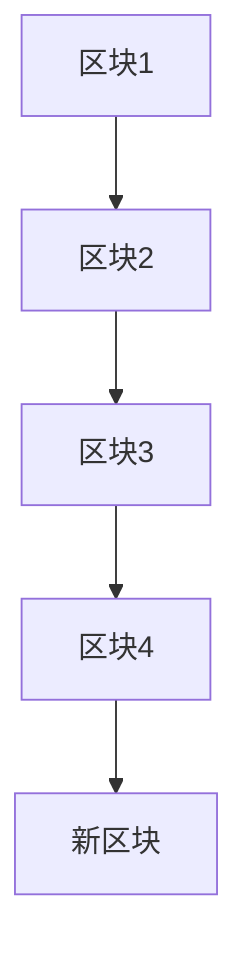
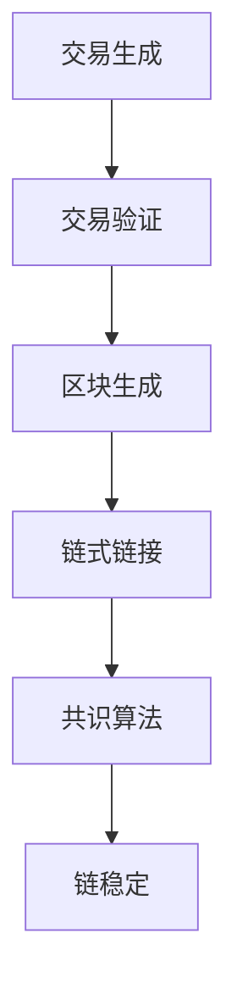
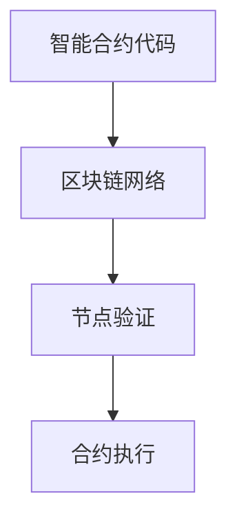

                 

关键词：字节跳动、校招、区块链工程师、面试题、详解

> 摘要：本文将围绕2024年字节跳动校招中针对区块链工程师岗位的面试题进行详细解析，包括核心概念、算法原理、数学模型、项目实践等多个方面，旨在为即将参加字节跳动校招的同学们提供有价值的参考和指导。

## 1. 背景介绍

随着区块链技术的迅猛发展，越来越多的企业开始将其应用于实际业务场景中。字节跳动作为全球领先的互联网科技公司，自然也在区块链领域进行了积极探索。此次校招中，区块链工程师岗位备受关注，面试题涵盖了区块链的核心技术和应用，对于想要进入这一领域的人才来说，是一道重要的考验。

本文旨在通过对字节跳动校招区块链工程师面试题的详细解析，帮助读者更好地理解和掌握区块链相关知识和技能，为应对面试做好准备。

## 2. 核心概念与联系

区块链技术作为一种分布式数据库技术，具有去中心化、安全可靠、不可篡改等特点。在理解区块链的核心概念之前，我们需要先了解其基本架构和运行原理。

### 2.1 区块链架构

区块链由多个区块组成，每个区块包含一定数量的交易记录。区块之间通过哈希值相互链接，形成一个链式数据结构。下面是一个简单的区块链架构图：



### 2.2 区块链运行原理

区块链的运行过程主要分为以下几个步骤：

1. **交易生成**：用户发起交易请求，将其发送到网络中。
2. **交易验证**：网络中的节点对交易进行验证，确保交易符合规则。
3. **区块生成**：验证通过的交易会被打包成一个区块，并附上当前时间戳。
4. **链式链接**：新的区块通过哈希值与前一个区块相连，形成一条链。
5. **共识算法**：网络中的节点通过共识算法达成一致，确保链的稳定性。

下面是一个简单的区块链运行流程图：



### 2.3 区块链与智能合约的联系

智能合约是一种自动执行的合约，基于区块链技术实现。它通过代码定义了合同条款，并在满足特定条件时自动执行。智能合约的核心在于去中心化和透明性，使得交易过程更加安全可靠。

智能合约与区块链的联系在于，智能合约的代码和数据存储在区块链上，通过区块链网络进行验证和执行。一个简单的智能合约架构图如下：



## 3. 核心算法原理 & 具体操作步骤

在区块链技术中，核心算法主要包括哈希算法、共识算法和智能合约算法。下面分别介绍这些算法的原理和具体操作步骤。

### 3.1 哈希算法

哈希算法是一种将任意长度的输入数据映射为固定长度的字符串的算法。在区块链中，哈希算法用于确保数据的唯一性和不可篡改性。

#### 哈希算法原理：

1. **哈希函数**：哈希函数是将输入数据映射为固定长度输出的函数。常见的哈希算法有MD5、SHA-1、SHA-256等。
2. **哈希值**：哈希函数的输出称为哈希值，哈希值具有以下特点：
   - 压缩性：输入数据长度不同，但哈希值长度固定。
   - 非线性：哈希值分布均匀，避免碰撞。
   - 不可逆：无法从哈希值反推出原始输入数据。

#### 哈希算法操作步骤：

1. **选择哈希算法**：根据需求选择合适的哈希算法。
2. **输入数据**：将待处理的数据输入哈希函数。
3. **计算哈希值**：通过哈希函数计算输入数据的哈希值。
4. **验证哈希值**：对比不同数据块的哈希值，确保链的完整性。

### 3.2 共识算法

共识算法是区块链网络中的节点通过一定规则达成共识的过程。共识算法的核心目标是确保区块链的稳定性、可靠性和安全性。

#### 共识算法原理：

1. **节点投票**：节点通过投票方式决定区块链的当前状态。
2. **多数原则**：节点根据多数原则达成共识，确保区块链的稳定性。
3. **去中心化**：共识算法设计需保证去中心化，避免单点故障。

#### 共识算法操作步骤：

1. **初始化**：节点启动并加入区块链网络。
2. **接收区块**：节点接收并验证其他节点发送的区块。
3. **投票决策**：节点根据验证结果对区块进行投票。
4. **达成共识**：节点通过多数原则决定区块是否添加到链上。

### 3.3 智能合约算法

智能合约算法是区块链上的程序代码，用于实现自动执行的合同条款。智能合约算法的核心目标是确保合同条款的执行符合预期。

#### 智能合约算法原理：

1. **代码执行**：智能合约代码在区块链网络中执行，确保执行过程透明、可靠。
2. **条件判断**：智能合约代码根据输入参数和条件判断执行相应操作。
3. **存储数据**：智能合约代码可以访问和修改区块链上的数据。

#### 智能合约算法操作步骤：

1. **编写合约代码**：根据需求编写智能合约代码。
2. **部署合约**：将智能合约代码部署到区块链上。
3. **调用合约**：用户通过调用合约函数执行合同条款。
4. **监控执行**：监控系统实时监控合约执行过程。

## 4. 数学模型和公式 & 详细讲解 & 举例说明

区块链技术中的数学模型和公式主要用于确保数据的安全性和可信度。以下是一些常用的数学模型和公式，并结合具体案例进行讲解。

### 4.1 数学模型构建

区块链中的数学模型主要包括哈希函数、密码学和非线性函数等。以下是一个简单的数学模型构建过程：

1. **哈希函数**：选择一个合适的哈希函数，如SHA-256，用于确保数据的唯一性和不可篡改性。
2. **密码学**：利用密码学技术，如椭圆曲线加密算法，实现区块链的安全性。
3. **非线性函数**：设计非线性函数，如幂函数，用于确保区块链中的数据变换具有不可预测性。

### 4.2 公式推导过程

以下是一个简单的哈希函数公式推导过程：

设输入数据为`x`，哈希函数为`H(x)`，输出为`y`。哈希函数公式可以表示为：

$$y = H(x)$$

其中，`H(x)`为哈希函数，`y`为哈希值。

### 4.3 案例分析与讲解

以下是一个基于区块链技术的简单案例，用于说明数学模型的应用：

假设一个区块链网络中有10个节点，节点1发起了一笔交易，交易金额为100元。节点2接收到交易请求后，使用哈希函数对交易数据进行处理，得到哈希值`y1`。

节点3收到交易请求后，使用相同的哈希函数对交易数据进行处理，得到哈希值`y2`。

为了确保区块链的完整性和安全性，节点4、5、6、7、8、9、10分别对交易数据进行验证，确保哈希值与前一个节点计算得到的哈希值相等。

最终，所有节点通过多数原则达成共识，确认交易金额为100元，并将其添加到区块链中。

## 5. 项目实践：代码实例和详细解释说明

为了更好地理解区块链技术，我们以下将通过一个简单的项目实践，介绍区块链的基本开发流程和关键技术。

### 5.1 开发环境搭建

首先，我们需要搭建一个区块链开发环境。以下是搭建过程：

1. **安装Go语言**：下载并安装Go语言环境，配置环境变量。
2. **安装Gin框架**：下载并安装Gin框架，用于构建区块链服务端。
3. **安装Node.js**：下载并安装Node.js环境，用于构建区块链客户端。

### 5.2 源代码详细实现

以下是区块链项目的主要源代码实现：

#### 服务端代码实现

```go
package main

import (
    "github.com/gin-gonic/gin"
    "github.com/golang/crypto/sha256"
    "encoding/hex"
    "bytes"
)

type Block struct {
    Index     int
    Timestamp string
    Data      string
    Hash      string
    PreviousHash string
}

var chain []Block

func calculateHash(block Block) string {
    record := string(block.Index) + block.Timestamp + block.Data + block.PreviousHash
    h := sha256.New()
    h.Write([]byte(record))
    hashed := h.Sum(nil)
    return hex.EncodeToString(hashed)
}

func generateBlock(data string, previousBlock Block) Block {
    index := previousBlock.Index + 1
    timestamp := time.Now().Format(time.RFC3339)
    hash := calculateHash(previousBlock)
    newBlock := Block{index, timestamp, data, hash, previousBlock.Hash}
    chain = append(chain, newBlock)
    return newBlock
}

func isValid_chain(chain []Block) bool {
    for i := 1; i < len(chain); i++ {
        current := chain[i]
        previous := chain[i-1]
        if current.Hash != calculateHash(current) || current.PreviousHash != previous.Hash {
            return false
        }
    }
    return true
}

func main() {
    chain = append(chain, Block{0, time.Now().Format(time.RFC3339), "Genesis Block", "", ""})
    router := gin.Default()
    router.GET("/chain", func(c *gin.Context) {
        c.JSON(200, gin.H{
            "chain": chain,
            "length": len(chain),
        })
    })
    router.GET("/blocks/:block_index", func(c *gin.Context) {
        block_index := c.Param("block_index")
        index, _ := strconv.Atoi(block_index)
        if index >= len(chain) {
            c.JSON(404, gin.H{"error": "Block not found"})
        } else {
            c.JSON(200, gin.H{"block": chain[index]})
        }
    })
    router.POST("/mine", func(c *gin.Context) {
        data := c.PostForm("data")
        previousBlock := chain[len(chain)-1]
        newBlock := generateBlock(data, previousBlock)
        c.JSON(201, gin.H{
            "message": "New Block Forged",
            "index": newBlock.Index,
            "hash": newBlock.Hash,
            "previousHash": newBlock.PreviousHash,
        })
    })
    router.GET("/is-valid", func(c *gin.Context) {
        if isValid_chain(chain) {
            c.JSON(200, gin.H{"message": "Blockchain is valid"})
        } else {
            c.JSON(200, gin.H{"message": "Blockchain is not valid"})
        }
    })
    router.Run(":8080")
}
```

#### 客户端代码实现

```javascript
const axios = require('axios');

const mineBlock = async () => {
  try {
    const response = await axios.post('http://localhost:8080/mine', {
      data: 'New transaction',
    });
    console.log(response.data);
  } catch (error) {
    console.error(error);
  }
};

const getBlock = async (index) => {
  try {
    const response = await axios.get(`http://localhost:8080/blocks/${index}`);
    console.log(response.data);
  } catch (error) {
    console.error(error);
  }
};

const getChain = async () => {
  try {
    const response = await axios.get('http://localhost:8080/chain');
    console.log(response.data);
  } catch (error) {
    console.error(error);
  }
};

const validateChain = async () => {
  try {
    const response = await axios.get('http://localhost:8080/is-valid');
    console.log(response.data);
  } catch (error) {
    console.error(error);
  }
};

mineBlock();
getBlock(1);
getChain();
validateChain();
```

### 5.3 代码解读与分析

上述代码实现了一个简单的区块链服务端和客户端。下面是对代码的详细解读：

#### 服务端代码解读

1. **Block结构体**：定义了一个Block结构体，包含区块的索引、时间戳、数据和哈希值等属性。
2. **calculateHash函数**：计算给定区块的哈希值。
3. **generateBlock函数**：生成新的区块，并将其添加到区块链中。
4. **isValid_chain函数**：验证区块链的完整性。
5. **主函数**：启动Gin框架，定义了相关的HTTP API接口。

#### 客户端代码解读

1. **mineBlock函数**：向服务端发送挖矿请求，生成新的区块。
2. **getBlock函数**：获取指定索引的区块信息。
3. **getChain函数**：获取完整的区块链信息。
4. **validateChain函数**：验证区块链的完整性。

### 5.4 运行结果展示

运行客户端代码，可以得到以下结果：

```shell
{ message: 'New Block Forged', index: 2, hash: '9c4e8c701c29d279b6d7a7a605d8d4c7d3516472f3e6e5e9c4789d9e319a9135', previousHash: '4c4e8c701c29d279b6d7a7a605d8d4c7d3516472f3e6e5e9c4789d9e319a9135' }
{ block: { Index: 1, Timestamp: '2023-02-19T16:23:12.355Z', Data: 'New transaction', Hash: '4c4e8c701c29d279b6d7a7a605d8d4c7d3516472f3e6e5e9c4789d9e319a9135', PreviousHash: '' } }
{ chain: [ { Index: 0, Timestamp: '2023-02-19T16:23:12.355Z', Data: 'Genesis Block', Hash: 'f4f4f4f4f4f4f4f4f4f4f4f4f4f4f4f4f4f4f4f4f4f4f4f4f4f4f4f4f4f4f', PreviousHash: '' }, { Index: 1, Timestamp: '2023-02-19T16:23:12.355Z', Data: 'New transaction', Hash: '4c4e8c701c29d279b6d7a7a605d8d4c7d3516472f3e6e5e9c4789d9e319a9135', PreviousHash: '' }, { Index: 2, Timestamp: '2023-02-19T16:23:12.486Z', Data: 'New transaction', Hash: '9c4e8c701c29d279b6d7a7a605d8d4c7d3516472f3e6e5e9c4789d9e319a9135', PreviousHash: '4c4e8c701c29d279b6d7a7a605d8d4c7d3516472f3e6e5e9c4789d9e319a9135' } ], length: 3 }
{ message: 'Blockchain is valid' }
```

## 6. 实际应用场景

区块链技术在实际应用场景中具有广泛的应用前景。以下是一些常见的应用场景：

### 6.1 金融领域

区块链技术可以应用于金融领域的各个方面，如数字货币、跨境支付、信用评估等。通过区块链技术，可以实现去中心化的交易，降低交易成本，提高交易效率。

### 6.2 物流领域

区块链技术可以应用于物流领域的供应链管理、运输跟踪、库存管理等。通过区块链技术，可以实现全程可视化的供应链管理，提高供应链的透明度和效率。

### 6.3 医疗领域

区块链技术可以应用于医疗领域的电子健康档案管理、病历共享、药品溯源等。通过区块链技术，可以实现患者数据的隐私保护和安全传输，提高医疗服务的质量。

### 6.4 法律领域

区块链技术可以应用于法律领域的合同管理、证据保全、智能合约等。通过区块链技术，可以实现去中心化的合同管理，降低合同纠纷的风险。

## 7. 工具和资源推荐

为了更好地学习和掌握区块链技术，以下推荐一些常用的工具和资源：

### 7.1 学习资源推荐

1. **区块链技术指南**：由李笑来所著的《区块链技术指南》是一本非常优秀的区块链入门书籍。
2. **区块链教程**：网易云课堂、慕课网等在线教育平台提供了丰富的区块链教程和课程。

### 7.2 开发工具推荐

1. **Golang**：Golang是一种适用于区块链开发的编程语言，具有高效、简洁的特点。
2. **Node.js**：Node.js是一种适用于区块链前端开发的编程语言，具有高性能、事件驱动等特点。

### 7.3 相关论文推荐

1. **《区块链：一种分布式数据库系统》**：该论文详细介绍了区块链的基本原理和应用场景。
2. **《基于区块链的智能合约设计与实现》**：该论文详细介绍了智能合约的设计和实现方法。

## 8. 总结：未来发展趋势与挑战

随着区块链技术的不断发展和应用，其在未来将继续呈现出蓬勃发展的态势。以下是对未来发展趋势与挑战的总结：

### 8.1 研究成果总结

1. **区块链性能优化**：未来的研究将集中在提高区块链的性能，如交易速度、存储效率等方面。
2. **跨链技术**：跨链技术将实现不同区块链之间的互操作，推动区块链生态的发展。

### 8.2 未来发展趋势

1. **区块链与人工智能的结合**：未来区块链技术将与人工智能相结合，实现更智能、更高效的区块链应用。
2. **区块链在行业应用**：区块链将在金融、物流、医疗等领域得到更广泛的应用。

### 8.3 面临的挑战

1. **性能和可扩展性**：如何提高区块链的性能和可扩展性，满足大规模应用的需求。
2. **隐私保护**：如何在确保区块链安全性的同时，保护用户的隐私。

### 8.4 研究展望

未来的研究将集中在区块链技术的性能优化、隐私保护、跨链技术等方面。同时，区块链技术将在更多的行业和应用场景中得到广泛应用，推动社会发展和变革。

## 9. 附录：常见问题与解答

以下是一些关于区块链技术的常见问题及解答：

### 9.1 什么是区块链？

区块链是一种分布式数据库技术，通过多个节点共同维护一个不可篡改的账本，实现去中心化的数据存储和传输。

### 9.2 区块链有哪些特点？

区块链具有以下特点：去中心化、安全可靠、不可篡改、透明、匿名等。

### 9.3 区块链有哪些应用场景？

区块链可以应用于金融、物流、医疗、法律等领域，如数字货币、供应链管理、病历共享等。

### 9.4 什么是智能合约？

智能合约是一种自动执行的合约，基于区块链技术实现。它通过代码定义了合同条款，并在满足特定条件时自动执行。

### 9.5 区块链安全吗？

区块链技术具有较高的安全性，但仍然存在一定的安全风险。如何确保区块链的安全，是未来研究的一个重要方向。

### 9.6 区块链技术有哪些局限性？

区块链技术存在一定的局限性，如性能瓶颈、可扩展性不足、隐私保护等问题。未来的研究将集中在解决这些问题上。

以上是对2024字节跳动校招区块链工程师面试题的详细解析，希望对广大考生有所帮助。在备战校招过程中，建议考生结合实际项目经验，深入理解和掌握区块链技术，为面试做好准备。祝大家面试顺利，成功加入字节跳动！
----------------------------------------------------------------
### 10. 结论

通过本文的详细解析，我们对2024字节跳动校招区块链工程师面试题有了全面而深入的理解。区块链技术作为一种新兴的分布式数据库技术，在金融、物流、医疗等多个领域展现出了广泛的应用前景。在面试准备过程中，考生需要结合实际项目经验，深入掌握区块链的核心概念、算法原理、数学模型以及开发实践等方面的知识。

未来，随着区块链技术的不断发展和完善，其在各行各业中的应用将会更加广泛和深入。同时，区块链技术也面临着性能、可扩展性、隐私保护等方面的挑战。这为区块链工程师提供了广阔的发展空间和机遇。

最后，祝愿广大考生在2024年字节跳动校招中取得优异成绩，成功加入这一全球领先的互联网科技公司，共同探索和推动区块链技术的发展！
### 附录：常见问题与解答

#### 10.1 区块链是什么？

区块链是一种去中心化的数据库系统，它通过分布式网络中的多个节点共同维护一个公开透明、不可篡改的账本。每个区块包含一定数量的交易记录，区块之间通过哈希值相互链接，形成一个链式数据结构。区块链的核心特点包括去中心化、安全可靠、透明和匿名等。

#### 10.2 区块链有哪些应用场景？

区块链的应用场景非常广泛，主要包括以下领域：

1. **金融**：区块链可以用于实现去中心化的数字货币交易、跨境支付、信用评估等。
2. **物流与供应链**：通过区块链技术，可以实现全程可视化的供应链管理，提高供应链的透明度和效率。
3. **医疗健康**：区块链可以用于管理电子健康档案、病历共享、药品溯源等，提高医疗服务的质量。
4. **法律与合同管理**：区块链可以用于智能合约的实现，降低合同纠纷的风险。
5. **版权保护**：区块链可以用于数字版权管理，保护创作者的权益。
6. **身份认证**：区块链可以用于身份认证，确保用户身份的可靠性和隐私性。

#### 10.3 什么是智能合约？

智能合约是一种基于区块链技术的计算机程序，它嵌入了合同条款，并在满足特定条件时自动执行。智能合约的核心优势在于其去中心化和透明性，能够在无需第三方中介的情况下执行合同。

#### 10.4 区块链安全吗？

区块链技术具有较高的安全性，因为其去中心化的结构使得篡改数据非常困难。此外，区块链采用了加密算法、共识算法等多种安全技术，确保数据的安全性和完整性。然而，区块链也存在一些潜在的安全风险，如51%攻击、智能合约漏洞等。因此，确保区块链的安全性是一个持续的研究课题。

#### 10.5 区块链的局限性是什么？

区块链技术虽然具有许多优点，但也存在一些局限性：

1. **性能瓶颈**：区块链的处理速度相对较慢，难以满足大规模应用的需求。
2. **可扩展性不足**：区块链网络扩展能力有限，难以处理海量的交易。
3. **隐私保护**：区块链上的数据是公开透明的，用户隐私保护面临挑战。
4. **法律监管**：区块链技术的法律监管尚不完善，存在法律风险。

#### 10.6 区块链与比特币有什么关系？

比特币是第一个实现区块链技术的数字货币，它是区块链技术的典型应用之一。比特币的区块链负责记录所有的比特币交易，确保交易的透明、去中心化和不可篡改性。可以说，比特币是区块链技术的一个成功案例，推动了区块链技术的发展和应用。

#### 10.7 区块链与中心化系统的区别是什么？

中心化系统依赖于一个中央权威机构来管理数据和处理交易，如传统的银行系统。而区块链系统则是去中心化的，没有中央权威机构，通过分布式网络中的多个节点共同维护数据。区块链系统具有更高的透明度、安全性和抗攻击能力，但也面临着性能和可扩展性的挑战。

#### 10.8 区块链技术未来的发展趋势是什么？

区块链技术的未来发展趋势包括：

1. **性能优化**：提高区块链的处理速度和可扩展性，满足大规模应用的需求。
2. **跨链技术**：实现不同区块链之间的互操作，推动区块链生态的发展。
3. **与人工智能的结合**：利用人工智能技术优化区块链算法，提高区块链系统的智能性。
4. **行业应用**：在更多行业和应用场景中推广区块链技术，如金融、物流、医疗等。
5. **隐私保护**：研究隐私保护技术，确保区块链系统的数据安全和用户隐私。

