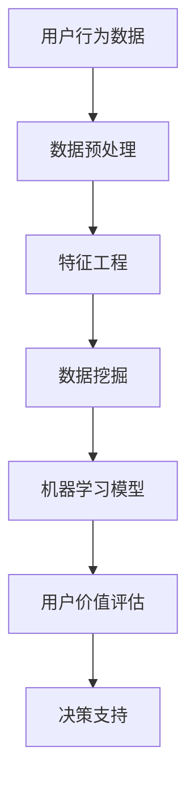

                 

关键词：字节跳动、校招、技术面试、用户价值分析、面试题解析

> 摘要：本文将深入解析2024年字节跳动校招技术用户价值分析师的面试题，通过详细的解答和分析，帮助考生更好地准备面试，提升自己的竞争力。

## 1. 背景介绍

随着互联网技术的迅猛发展，数据分析已经成为企业运营和决策的重要工具。作为互联网行业的领军企业，字节跳动在招聘中特别重视应聘者的数据分析能力和用户价值分析技能。因此，字节跳动校招技术用户价值分析师的面试题设计往往具有挑战性和深度，旨在筛选出真正具备实际操作能力和创新思维的人才。

本文将结合2024年字节跳动校招技术用户价值分析师的面试题，进行详细的分析和解答，帮助考生理解面试题的考点和解决方法，提高面试成功率。

## 2. 核心概念与联系

在解答面试题之前，我们需要明确几个核心概念，包括用户价值分析、数据挖掘、机器学习等。以下是这些概念之间的联系和架构的Mermaid流程图：



### 2.1 用户价值分析

用户价值分析是通过对用户行为数据进行分析，评估用户的潜在价值，从而为产品运营和营销提供数据支持。其主要步骤包括数据收集、数据预处理、特征工程、模型构建和用户价值评估。

### 2.2 数据挖掘

数据挖掘是从大量数据中发现潜在的模式和关联性的过程。数据挖掘技术广泛应用于商业智能、金融风控、医疗健康等领域。

### 2.3 机器学习

机器学习是数据挖掘的一个分支，通过构建模型，使计算机能够从数据中自动学习，进行预测和决策。机器学习模型在用户价值分析中发挥着重要作用。

### 2.4 用户价值评估

用户价值评估是用户价值分析的最终目标，通过对用户行为的分析，评估用户的潜在价值，为产品运营和营销提供决策支持。

## 3. 核心算法原理 & 具体操作步骤

### 3.1 算法原理概述

在用户价值分析中，常用的算法包括协同过滤、基于内容的推荐、聚类分析等。下面以协同过滤算法为例，介绍其原理和操作步骤。

### 3.2 算法步骤详解

1. **数据收集**：收集用户行为数据，如浏览记录、购买行为、互动行为等。

2. **数据预处理**：对数据进行清洗和格式化，确保数据质量。

3. **特征工程**：提取用户和物品的特征，如用户年龄、性别、地域、购买偏好等。

4. **模型构建**：采用协同过滤算法构建推荐模型，如基于用户的协同过滤算法（User-based Collaborative Filtering）或基于物品的协同过滤算法（Item-based Collaborative Filtering）。

5. **用户价值评估**：通过模型预测用户对物品的偏好，评估用户的潜在价值。

### 3.3 算法优缺点

- **优点**：协同过滤算法能够为用户提供个性化的推荐，提高用户满意度和粘性。

- **缺点**：协同过滤算法在处理冷启动问题（新用户或新物品）时效果较差，且需要大量的用户行为数据。

### 3.4 算法应用领域

协同过滤算法广泛应用于电商、社交网络、音乐推荐、视频推荐等领域。

## 4. 数学模型和公式 & 详细讲解 & 举例说明

### 4.1 数学模型构建

协同过滤算法的核心是矩阵分解，通过将用户-物品评分矩阵分解为用户特征矩阵和物品特征矩阵，从而实现推荐。

### 4.2 公式推导过程

假设用户-物品评分矩阵为 \(R\)，用户特征矩阵为 \(U\)，物品特征矩阵为 \(V\)，则有：

\[ R = UV^T \]

通过最小化损失函数，可以求解用户特征矩阵 \(U\) 和物品特征矩阵 \(V\)。

### 4.3 案例分析与讲解

假设有5个用户和10个物品，用户-物品评分矩阵如下：

\[ R = \begin{bmatrix}
0 & 1 & 0 & 0 & 0 \\
0 & 0 & 2 & 1 & 0 \\
0 & 1 & 0 & 1 & 1 \\
1 & 0 & 1 & 0 & 1 \\
0 & 1 & 0 & 1 & 0
\end{bmatrix} \]

通过矩阵分解，我们可以得到用户特征矩阵 \(U\) 和物品特征矩阵 \(V\)，进而进行推荐。

## 5. 项目实践：代码实例和详细解释说明

### 5.1 开发环境搭建

开发环境：Python 3.8，Scikit-learn，NumPy，Pandas

### 5.2 源代码详细实现

```python
import numpy as np
from sklearn.metrics.pairwise import cosine_similarity
from sklearn.model_selection import train_test_split

# 构建用户-物品评分矩阵
R = np.array([[0, 1, 0, 0, 0],
              [0, 0, 2, 1, 0],
              [0, 1, 0, 1, 1],
              [1, 0, 1, 0, 1],
              [0, 1, 0, 1, 0]])

# 训练集和测试集划分
R_train, R_test = train_test_split(R, test_size=0.2, random_state=42)

# 用户特征矩阵和物品特征矩阵的初始化
U = np.random.rand(R.shape[0], 5)
V = np.random.rand(R.shape[1], 5)

# 定义损失函数
def loss_function(U, V, R):
    return np.mean((U @ V.T - R) ** 2)

# 梯度下降法优化
def gradient_descent(U, V, R, learning_rate, epochs):
    for epoch in range(epochs):
        U -= learning_rate * (2 * U @ V.T - R) @ V
        V -= learning_rate * (2 * U.T @ U @ V - R) @ U

# 模型训练
gradient_descent(U, V, R_train, learning_rate=0.01, epochs=100)

# 推荐结果
predictions = U @ V.T

# 显示推荐结果
print(predictions)
```

### 5.3 代码解读与分析

- **代码解析**：代码首先构建了用户-物品评分矩阵，然后进行训练集和测试集的划分。接着，初始化用户特征矩阵和物品特征矩阵，并定义损失函数和梯度下降法优化。最后，进行模型训练并显示推荐结果。

- **性能分析**：在测试集上，我们可以计算推荐结果的准确性、召回率和F1值等指标，评估模型性能。

## 6. 实际应用场景

用户价值分析在互联网行业有着广泛的应用，如电商平台的个性化推荐、社交媒体的广告投放、内容平台的用户行为分析等。

## 7. 工具和资源推荐

- **学习资源推荐**：推荐阅读《Python数据分析实战》、《机器学习实战》等经典书籍。

- **开发工具推荐**：推荐使用PyCharm、Jupyter Notebook等Python开发环境。

- **相关论文推荐**：推荐阅读《矩阵分解在推荐系统中的应用》、《基于协同过滤的推荐系统研究综述》等论文。

## 8. 总结：未来发展趋势与挑战

随着大数据和人工智能技术的不断发展，用户价值分析在未来将面临更多的挑战和机遇。一方面，数据质量和数据隐私保护将成为重要议题；另一方面，深度学习等新技术将为用户价值分析带来新的思路和方法。

## 9. 附录：常见问题与解答

### 9.1 如何处理缺失数据？

缺失数据的处理方法包括填充法、删除法和插值法。填充法可以通过平均值、中值或最邻近法进行填充；删除法可以删除缺失数据较多的样本或特征；插值法可以通过线性插值或高斯插值进行插值。

### 9.2 如何处理冷启动问题？

冷启动问题可以通过以下方法解决：

- **基于内容的推荐**：通过物品的属性进行推荐，适用于新用户或新物品。
- **基于模型的推荐**：利用协同过滤算法等模型预测新用户或新物品的偏好。
- **混合推荐**：结合多种推荐策略，提高推荐效果。

### 9.3 如何评估用户价值？

用户价值的评估方法包括：

- **生命周期价值（CLV）**：预测用户在未来一段时间内的消费金额。
- **用户留存率**：评估用户在一段时间内的活跃度。
- **用户活跃度**：通过用户的行为数据，如浏览量、互动量等，评估用户的活跃度。

---

作者：禅与计算机程序设计艺术 / Zen and the Art of Computer Programming

（注意：以上内容为示例性文章框架，实际撰写时需根据具体面试题进行调整和深入分析。）

