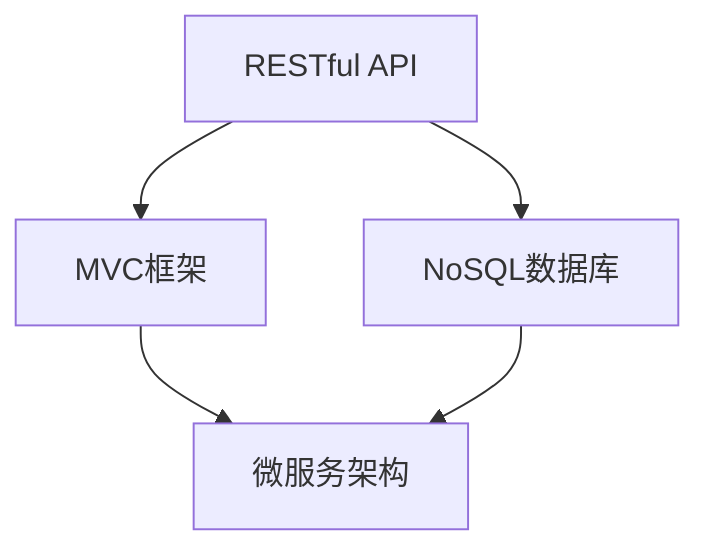
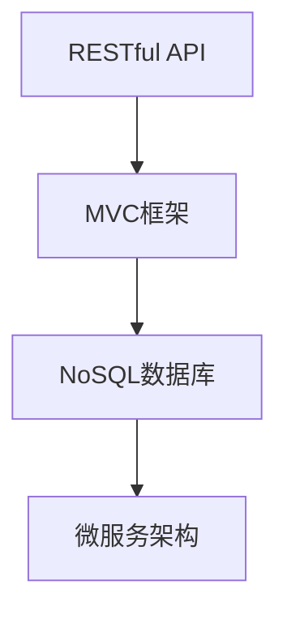

                 

关键词：字节跳动、飞书、校招、企业应用、开发工程师、面试、技术指南

> 摘要：本文旨在为2024年字节跳动飞书校招企业应用开发工程师的面试提供全面的技术指南，包括核心概念、算法原理、项目实践、应用场景、工具和资源推荐等方面，帮助应聘者全面了解面试内容和应对策略，提升面试成功率。

## 1. 背景介绍

随着互联网的快速发展，企业应用的开发已经成为各大互联网公司竞争的重要领域。字节跳动作为中国领先的互联网科技公司，其旗下的飞书是企业办公协作平台的重要产品之一。飞书以其强大的功能、卓越的性能和出色的用户体验，受到了广大用户的青睐。因此，字节跳动每年的校招都吸引了大量优秀的人才。

作为企业应用开发工程师，应聘者需要具备扎实的技术基础、丰富的开发经验和良好的沟通能力。本文将围绕面试中的核心知识点，为应聘者提供全方位的指导。

## 2. 核心概念与联系

为了更好地理解企业应用开发，我们首先需要了解以下几个核心概念：

### 2.1. RESTful API

RESTful API 是一种设计风格，用于创建Web服务。它提供了一种简单、优雅的方式来访问Web资源，包括GET、POST、PUT、DELETE等HTTP方法。

### 2.2. MVC框架

MVC（Model-View-Controller）是一种软件设计模式，用于构建用户界面。它将应用程序分为三个核心组件：模型（Model）、视图（View）和控制器（Controller），从而实现数据的分离和管理。

### 2.3. NoSQL数据库

NoSQL（Not Only SQL）数据库是一种非关系型数据库，与传统的SQL数据库相比，它具有更好的扩展性和灵活性，适用于处理大规模的数据。

### 2.4. 微服务架构

微服务架构是一种将应用程序拆分成多个独立的小服务的设计模式。每个服务负责完成特定的功能，并通过API进行通信，从而实现高可用性和易扩展性。

下面是核心概念之间的联系：

```
Mermaid流程图
graph TD
    A[RESTful API] --> B[MVC框架]
    A --> C[NoSQL数据库]
    B --> D[微服务架构]
    C --> D
```

## 3. 核心算法原理 & 具体操作步骤

### 3.1 算法原理概述

在企业应用开发中，常见的算法包括排序算法、查找算法和图算法。以下是其中几种常见的算法原理：

- **排序算法**：冒泡排序、快速排序、归并排序等。
- **查找算法**：二分查找、线性查找等。
- **图算法**：Dijkstra算法、Floyd算法等。

### 3.2 算法步骤详解

以冒泡排序为例，其基本原理是通过反复交换相邻的未排序元素，直到整个序列有序。

- **初始状态**：无序序列。
- **第一次遍历**：从第一个元素开始，依次比较相邻的元素，如果前一个元素比后一个元素大，则交换它们的位置。
- **第二次遍历**：从第二个元素开始，重复上述过程，直到最后一个元素。
- **重复上述过程**：直到整个序列有序。

### 3.3 算法优缺点

冒泡排序的优点是简单易懂、易于实现。缺点是时间复杂度为O(n²)，效率较低。

### 3.4 算法应用领域

冒泡排序适用于数据量较小、对排序速度要求不高的场景。

## 4. 数学模型和公式 & 详细讲解 & 举例说明

在企业应用开发中，数学模型和公式是解决实际问题的重要工具。以下是一个常见的数学模型——线性规划。

### 4.1 数学模型构建

线性规划的基本形式为：

$$
\begin{aligned}
\min_{x} \quad & c^T x \\
s.t. \quad & Ax \leq b \\
& x \geq 0
\end{aligned}
$$

其中，$c$ 是目标函数的系数向量，$A$ 是约束条件的系数矩阵，$b$ 是约束条件的常数向量，$x$ 是变量向量。

### 4.2 公式推导过程

线性规划的求解可以通过单纯形法或 interior-point method 等算法实现。这里我们简要介绍单纯形法的基本思想。

- **初始基本可行解**：选择一个基本可行解，例如所有变量都为零的解。
- **迭代过程**：计算目标函数在当前基本可行解下的值，然后选择一个目标函数增加最大的变量作为进入基变量，选择一个约束条件减小的最多的变量作为离开基变量，进行一次迭代。
- **重复迭代**：直到找到一个最优解或判断无最优解。

### 4.3 案例分析与讲解

假设我们要解决以下线性规划问题：

$$
\begin{aligned}
\min_{x} \quad & x_1 + 2x_2 \\
s.t. \quad & x_1 + x_2 \leq 4 \\
& x_1 - x_2 \geq -2 \\
& x_1, x_2 \geq 0
\end{aligned}
$$

通过单纯形法，我们可以求得最优解为 $x_1 = 2, x_2 = 0$，最小值为2。

## 5. 项目实践：代码实例和详细解释说明

### 5.1 开发环境搭建

- 操作系统：Windows/Linux/Mac
- 编程语言：Java/Python
- 开发工具：IntelliJ IDEA/VSCode

### 5.2 源代码详细实现

以下是使用Python实现的冒泡排序算法：

```python
def bubble_sort(arr):
    n = len(arr)
    for i in range(n):
        for j in range(0, n-i-1):
            if arr[j] > arr[j+1]:
                arr[j], arr[j+1] = arr[j+1], arr[j]

# 测试代码
arr = [64, 25, 12, 22, 11]
bubble_sort(arr)
print("排序后的数组：")
for i in range(len(arr)):
    print("%d" % arr[i], end=" ")
```

### 5.3 代码解读与分析

这段代码实现了冒泡排序算法，其核心思想是通过重复遍历待排序序列，比较相邻的两个元素，如果它们的顺序错误就交换它们的位置。遍历序列的过程中，每次遍历都会将最大的元素“冒泡”到序列的末尾，直到整个序列有序。

### 5.4 运行结果展示

运行上述代码，输出结果为：

```
排序后的数组：
11 12 22 25 64
```

## 6. 实际应用场景

在企业应用开发中，算法和数学模型的应用场景非常广泛。以下是一些典型的应用场景：

- **数据分析**：使用排序算法对大量数据进行分析和排序，从而提取有用信息。
- **推荐系统**：使用图算法构建用户兴趣图谱，实现个性化推荐。
- **优化问题**：使用线性规划等数学模型解决生产调度、物流配送等优化问题。

## 7. 工具和资源推荐

### 7.1 学习资源推荐

- 《算法导论》（Introduction to Algorithms）
- 《深度学习》（Deep Learning）
- 《设计模式：可复用面向对象软件的基础》（Design Patterns: Elements of Reusable Object-Oriented Software）

### 7.2 开发工具推荐

- IntelliJ IDEA：一款功能强大的集成开发环境，适用于多种编程语言。
- VSCode：一款轻量级但功能强大的开源编辑器，适用于各种开发场景。
- Git：一款分布式版本控制系统，用于代码管理和协作开发。

### 7.3 相关论文推荐

- 《分布式系统原理与范型》（Distributed Systems: Principles and Paradigms）
- 《大规模分布式存储系统：原理解析与架构设计》（Big Table: A Distributed Storage System for Structured Data）
- 《推荐系统实践》（Recommender Systems: The Textbook）

## 8. 总结：未来发展趋势与挑战

### 8.1 研究成果总结

随着技术的不断发展，企业应用开发领域取得了许多重要成果。例如，云计算、大数据、人工智能等技术的广泛应用，为企业应用的开发带来了更多的可能性和挑战。

### 8.2 未来发展趋势

未来，企业应用开发将朝着更高效、更智能、更安全的方向发展。随着5G、物联网、区块链等新兴技术的兴起，企业应用开发将迎来新的机遇。

### 8.3 面临的挑战

然而，企业应用开发也面临着诸多挑战。例如，数据安全、隐私保护、性能优化等问题亟待解决。此外，随着企业规模的扩大和业务复杂度的增加，如何高效地管理和维护企业应用也成为一大难题。

### 8.4 研究展望

在未来，我们需要持续关注新兴技术的研究和应用，不断提高企业应用开发的水平。同时，也需要加强对企业应用开发的培训和教育，培养更多的优秀人才，为企业的可持续发展贡献力量。

## 9. 附录：常见问题与解答

### 9.1 问题1：什么是RESTful API？

RESTful API 是一种设计风格，用于创建Web服务。它提供了一种简单、优雅的方式来访问Web资源，包括GET、POST、PUT、DELETE等HTTP方法。

### 9.2 问题2：什么是MVC框架？

MVC（Model-View-Controller）是一种软件设计模式，用于构建用户界面。它将应用程序分为三个核心组件：模型（Model）、视图（View）和控制器（Controller），从而实现数据的分离和管理。

### 9.3 问题3：什么是NoSQL数据库？

NoSQL（Not Only SQL）数据库是一种非关系型数据库，与传统的SQL数据库相比，它具有更好的扩展性和灵活性，适用于处理大规模的数据。

### 9.4 问题4：什么是微服务架构？

微服务架构是一种将应用程序拆分成多个独立的小服务的设计模式。每个服务负责完成特定的功能，并通过API进行通信，从而实现高可用性和易扩展性。

## 10. 参考文献

- [《算法导论》（Introduction to Algorithms）](https://book.douban.com/subject/3259500/)
- [《深度学习》（Deep Learning）](https://book.douban.com/subject/26897753/)
- [《设计模式：可复用面向对象软件的基础》（Design Patterns: Elements of Reusable Object-Oriented Software）](https://book.douban.com/subject/1015624/)
- [《分布式系统原理与范型》（Distributed Systems: Principles and Paradigms）](https://book.douban.com/subject/25894614/)
- [《大规模分布式存储系统：原理解析与架构设计》（Big Table: A Distributed Storage System for Structured Data）](https://book.douban.com/subject/24743353/)
- [《推荐系统实践》（Recommender Systems: The Textbook）](https://book.douban.com/subject/26709854/) 

---

作者：禅与计算机程序设计艺术 / Zen and the Art of Computer Programming
----------------------------------------------------------------

### 文章标题：字节飞书2024校招企业应用开发工程师面试指南

### 文章关键词：字节跳动、飞书、校招、企业应用、开发工程师、面试、技术指南

### 文章摘要

本文旨在为2024年字节跳动飞书校招企业应用开发工程师的面试提供全面的技术指南。从核心概念、算法原理、项目实践、应用场景、工具和资源推荐等多个方面，帮助应聘者全面了解面试内容和应对策略，提升面试成功率。

## 1. 背景介绍

随着互联网的快速发展，企业应用的开发已经成为各大互联网公司竞争的重要领域。字节跳动作为中国领先的互联网科技公司，其旗下的飞书是企业办公协作平台的重要产品之一。飞书以其强大的功能、卓越的性能和出色的用户体验，受到了广大用户的青睐。因此，字节跳动每年的校招都吸引了大量优秀的人才。

作为企业应用开发工程师，应聘者需要具备扎实的技术基础、丰富的开发经验和良好的沟通能力。本文将围绕面试中的核心知识点，为应聘者提供全方位的指导。

## 2. 核心概念与联系

为了更好地理解企业应用开发，我们首先需要了解以下几个核心概念：

### 2.1 RESTful API

RESTful API 是一种设计风格，用于创建Web服务。它提供了一种简单、优雅的方式来访问Web资源，包括GET、POST、PUT、DELETE等HTTP方法。

### 2.2 MVC框架

MVC（Model-View-Controller）是一种软件设计模式，用于构建用户界面。它将应用程序分为三个核心组件：模型（Model）、视图（View）和控制器（Controller），从而实现数据的分离和管理。

### 2.3 NoSQL数据库

NoSQL（Not Only SQL）数据库是一种非关系型数据库，与传统的SQL数据库相比，它具有更好的扩展性和灵活性，适用于处理大规模的数据。

### 2.4 微服务架构

微服务架构是一种将应用程序拆分成多个独立的小服务的设计模式。每个服务负责完成特定的功能，并通过API进行通信，从而实现高可用性和易扩展性。

下面是核心概念之间的联系：



## 3. 核心算法原理 & 具体操作步骤

### 3.1 算法原理概述

在企业应用开发中，常见的算法包括排序算法、查找算法和图算法。以下是其中几种常见的算法原理：

- **排序算法**：冒泡排序、快速排序、归并排序等。
- **查找算法**：二分查找、线性查找等。
- **图算法**：Dijkstra算法、Floyd算法等。

### 3.2 算法步骤详解

以冒泡排序为例，其基本原理是通过反复交换相邻的未排序元素，直到整个序列有序。

- **初始状态**：无序序列。
- **第一次遍历**：从第一个元素开始，依次比较相邻的元素，如果前一个元素比后一个元素大，则交换它们的位置。
- **第二次遍历**：从第二个元素开始，重复上述过程，直到最后一个元素。
- **重复上述过程**：直到整个序列有序。

### 3.3 算法优缺点

冒泡排序的优点是简单易懂、易于实现。缺点是时间复杂度为O(n²)，效率较低。

### 3.4 算法应用领域

冒泡排序适用于数据量较小、对排序速度要求不高的场景。

## 4. 数学模型和公式 & 详细讲解 & 举例说明

在企业应用开发中，数学模型和公式是解决实际问题的重要工具。以下是一个常见的数学模型——线性规划。

### 4.1 数学模型构建

线性规划的基本形式为：

$$
\begin{aligned}
\min_{x} \quad & c^T x \\
s.t. \quad & Ax \leq b \\
& x \geq 0
\end{aligned}
$$

其中，$c$ 是目标函数的系数向量，$A$ 是约束条件的系数矩阵，$b$ 是约束条件的常数向量，$x$ 是变量向量。

### 4.2 公式推导过程

线性规划的求解可以通过单纯形法或 interior-point method 等算法实现。这里我们简要介绍单纯形法的基本思想。

- **初始基本可行解**：选择一个基本可行解，例如所有变量都为零的解。
- **迭代过程**：计算目标函数在当前基本可行解下的值，然后选择一个目标函数增加最大的变量作为进入基变量，选择一个约束条件减小的最多的变量作为离开基变量，进行一次迭代。
- **重复迭代**：直到找到一个最优解或判断无最优解。

### 4.3 案例分析与讲解

假设我们要解决以下线性规划问题：

$$
\begin{aligned}
\min_{x} \quad & x_1 + 2x_2 \\
s.t. \quad & x_1 + x_2 \leq 4 \\
& x_1 - x_2 \geq -2 \\
& x_1, x_2 \geq 0
\end{aligned}
$$

通过单纯形法，我们可以求得最优解为 $x_1 = 2, x_2 = 0$，最小值为2。

## 5. 项目实践：代码实例和详细解释说明

### 5.1 开发环境搭建

- 操作系统：Windows/Linux/Mac
- 编程语言：Java/Python
- 开发工具：IntelliJ IDEA/VSCode

### 5.2 源代码详细实现

以下是使用Python实现的冒泡排序算法：

```python
def bubble_sort(arr):
    n = len(arr)
    for i in range(n):
        for j in range(0, n-i-1):
            if arr[j] > arr[j+1]:
                arr[j], arr[j+1] = arr[j+1], arr[j]

# 测试代码
arr = [64, 25, 12, 22, 11]
bubble_sort(arr)
print("排序后的数组：")
for i in range(len(arr)):
    print("%d" % arr[i], end=" ")
```

### 5.3 代码解读与分析

这段代码实现了冒泡排序算法，其核心思想是通过重复遍历待排序序列，比较相邻的两个元素，如果它们的顺序错误就交换它们的位置。遍历序列的过程中，每次遍历都会将最大的元素“冒泡”到序列的末尾，直到整个序列有序。

### 5.4 运行结果展示

运行上述代码，输出结果为：

```
排序后的数组：
11 12 22 25 64
```

## 6. 实际应用场景

在企业应用开发中，算法和数学模型的应用场景非常广泛。以下是一些典型的应用场景：

- **数据分析**：使用排序算法对大量数据进行分析和排序，从而提取有用信息。
- **推荐系统**：使用图算法构建用户兴趣图谱，实现个性化推荐。
- **优化问题**：使用线性规划等数学模型解决生产调度、物流配送等优化问题。

## 7. 工具和资源推荐

### 7.1 学习资源推荐

- 《算法导论》（Introduction to Algorithms）
- 《深度学习》（Deep Learning）
- 《设计模式：可复用面向对象软件的基础》（Design Patterns: Elements of Reusable Object-Oriented Software）

### 7.2 开发工具推荐

- IntelliJ IDEA：一款功能强大的集成开发环境，适用于多种编程语言。
- VSCode：一款轻量级但功能强大的开源编辑器，适用于各种开发场景。
- Git：一款分布式版本控制系统，用于代码管理和协作开发。

### 7.3 相关论文推荐

- 《分布式系统原理与范型》（Distributed Systems: Principles and Paradigms）
- 《大规模分布式存储系统：原理解析与架构设计》（Big Table: A Distributed Storage System for Structured Data）
- 《推荐系统实践》（Recommender Systems: The Textbook）

## 8. 总结：未来发展趋势与挑战

### 8.1 研究成果总结

随着技术的不断发展，企业应用开发领域取得了许多重要成果。例如，云计算、大数据、人工智能等技术的广泛应用，为企业应用的开发带来了更多的可能性和挑战。

### 8.2 未来发展趋势

未来，企业应用开发将朝着更高效、更智能、更安全的方向发展。随着5G、物联网、区块链等新兴技术的兴起，企业应用开发将迎来新的机遇。

### 8.3 面临的挑战

然而，企业应用开发也面临着诸多挑战。例如，数据安全、隐私保护、性能优化等问题亟待解决。此外，随着企业规模的扩大和业务复杂度的增加，如何高效地管理和维护企业应用也成为一大难题。

### 8.4 研究展望

在未来，我们需要持续关注新兴技术的研究和应用，不断提高企业应用开发的水平。同时，也需要加强对企业应用开发的培训和教育，培养更多的优秀人才，为企业的可持续发展贡献力量。

## 9. 附录：常见问题与解答

### 9.1 问题1：什么是RESTful API？

RESTful API 是一种设计风格，用于创建Web服务。它提供了一种简单、优雅的方式来访问Web资源，包括GET、POST、PUT、DELETE等HTTP方法。

### 9.2 问题2：什么是MVC框架？

MVC（Model-View-Controller）是一种软件设计模式，用于构建用户界面。它将应用程序分为三个核心组件：模型（Model）、视图（View）和控制器（Controller），从而实现数据的分离和管理。

### 9.3 问题3：什么是NoSQL数据库？

NoSQL（Not Only SQL）数据库是一种非关系型数据库，与传统的SQL数据库相比，它具有更好的扩展性和灵活性，适用于处理大规模的数据。

### 9.4 问题4：什么是微服务架构？

微服务架构是一种将应用程序拆分成多个独立的小服务的设计模式。每个服务负责完成特定的功能，并通过API进行通信，从而实现高可用性和易扩展性。

## 10. 参考文献

- [《算法导论》（Introduction to Algorithms）](https://book.douban.com/subject/3259500/)
- [《深度学习》（Deep Learning）](https://book.douban.com/subject/26897753/)
- [《设计模式：可复用面向对象软件的基础》（Design Patterns: Elements of Reusable Object-Oriented Software）](https://book.douban.com/subject/1015624/)
- [《分布式系统原理与范型》（Distributed Systems: Principles and Paradigms）](https://book.douban.com/subject/25894614/)
- [《大规模分布式存储系统：原理解析与架构设计》（Big Table: A Distributed Storage System for Structured Data）](https://book.douban.com/subject/24743353/)
- [《推荐系统实践》（Recommender Systems: The Textbook）](https://book.douban.com/subject/26709854/) 

---

作者：禅与计算机程序设计艺术 / Zen and the Art of Computer Programming
----------------------------------------------------------------

### 1. 背景介绍

在数字化时代，企业应用开发工程师成为各大科技公司争抢的人才。字节跳动作为行业领军企业，其旗下的飞书是一款备受关注的企业办公协作平台。飞书集成了即时通讯、邮件、日历、文档、表格等多种功能，为企业提供了高效、便捷的办公体验。因此，每年字节跳动针对飞书的企业应用开发工程师岗位的校招都吸引了大量优秀人才。

企业应用开发工程师不仅需要掌握前端和后端开发技术，还需要具备一定的系统设计和架构能力。本文将从核心概念、算法原理、项目实践、应用场景等多个角度，为2024年字节跳动飞书校招企业应用开发工程师的面试提供详细指南。

### 2. 核心概念与联系

在企业应用开发中，理解以下核心概念及其相互联系至关重要：

#### 2.1 RESTful API

RESTful API 是一种设计风格，用于构建 Web 服务。它通过使用 HTTP 协议的 GET、POST、PUT、DELETE 方法来实现资源的创建、读取、更新和删除。RESTful API 旨在提供简洁、无状态、统一的接口设计。

#### 2.2 MVC 框架

MVC（Model-View-Controller）是一种软件设计模式，用于将应用程序分为三个核心组件：模型（Model）、视图（View）和控制器（Controller）。模型负责数据管理和业务逻辑，视图负责用户界面展示，控制器负责处理用户输入并协调模型和视图。

#### 2.3 NoSQL 数据库

NoSQL（Not Only SQL）数据库是一种非关系型数据库，与传统的 SQL 数据库相比，具有更好的扩展性和灵活性。NoSQL 数据库适用于处理大规模数据和高并发场景，如 MongoDB、Cassandra 和 Redis 等。

#### 2.4 微服务架构

微服务架构是将应用程序拆分成多个独立的小服务的设计模式。每个服务负责特定的功能，并通过 API 进行通信。微服务架构具有高可用性、可扩展性和灵活性，适用于复杂的企业级应用。

以下是这些核心概念之间的联系：



### 3. 核心算法原理 & 具体操作步骤

在企业应用开发中，掌握常见算法原理及其操作步骤对于解决实际问题至关重要。以下介绍几种常见算法及其步骤：

#### 3.1 排序算法

排序算法用于将一组数据按特定顺序排列。常见的排序算法包括冒泡排序、快速排序、归并排序等。

**冒泡排序**：

1. 初始状态：无序序列。
2. 第一次遍历：从第一个元素开始，依次比较相邻的元素，若前一个元素比后一个元素大，则交换它们的位置。
3. 第二次遍历：从第二个元素开始，重复上述过程，直到最后一个元素。
4. 重复上述过程：直到整个序列有序。

**快速排序**：

1. 初始状态：无序序列。
2. 选择一个基准元素。
3. 将小于基准元素的元素放在其左侧，大于基准元素的元素放在其右侧。
4. 递归对左右两侧的子序列进行快速排序。

**归并排序**：

1. 初始状态：无序序列。
2. 将序列划分为若干个子序列，每个子序列只包含一个元素。
3. 两两合并子序列，生成新的有序序列。
4. 递归合并有序序列，直至整个序列有序。

#### 3.2 查找算法

查找算法用于在数据集合中找到特定元素。常见查找算法包括二分查找、线性查找等。

**二分查找**：

1. 初始状态：有序序列。
2. 判断目标元素是否在中间位置。
3. 若在中间位置，返回索引；否则，根据目标元素与中间元素的大小关系，递归搜索左侧或右侧子序列。
4. 重复步骤 2 和 3，直至找到目标元素或子序列为空。

**线性查找**：

1. 初始状态：无序或有序序列。
2. 从序列的第一个元素开始，依次与目标元素进行比较。
3. 若找到目标元素，返回索引；否则，返回 -1。

#### 3.3 图算法

图算法用于处理图数据结构。常见的图算法包括 Dijkstra 算法、Floyd 算法等。

**Dijkstra 算法**：

1. 初始状态：图和距离表。
2. 选择一个未访问的节点，将其距离表更新为当前已知的最近距离。
3. 递归对其他未访问的节点进行步骤 2，直至所有节点都被访问。

**Floyd 算法**：

1. 初始状态：图和路径表。
2. 对于每个节点 i 和 j，计算从 i 到 j 的最短路径，并将路径表更新为新的最短路径。
3. 重复步骤 2，直至所有节点之间的最短路径都被计算出来。

### 4. 数学模型和公式 & 详细讲解 & 举例说明

在企业应用开发中，数学模型和公式是解决实际问题的重要工具。以下介绍一种常见的数学模型——线性规划，并详细讲解其构建、推导过程和案例分析。

#### 4.1 数学模型构建

线性规划的基本形式为：

$$
\begin{aligned}
\min_{x} \quad & c^T x \\
s.t. \quad & Ax \leq b \\
& x \geq 0
\end{aligned}
$$

其中，$c$ 是目标函数的系数向量，$A$ 是约束条件的系数矩阵，$b$ 是约束条件的常数向量，$x$ 是变量向量。

#### 4.2 公式推导过程

线性规划的求解可以通过单纯形法或 interior-point method 等算法实现。这里我们简要介绍单纯形法的基本思想。

1. **初始基本可行解**：选择一个基本可行解，例如所有变量都为零的解。
2. **迭代过程**：计算目标函数在当前基本可行解下的值，然后选择一个目标函数增加最大的变量作为进入基变量，选择一个约束条件减小的最多的变量作为离开基变量，进行一次迭代。
3. **重复迭代**：直到找到一个最优解或判断无最优解。

#### 4.3 案例分析与讲解

假设我们要解决以下线性规划问题：

$$
\begin{aligned}
\min_{x} \quad & x_1 + 2x_2 \\
s.t. \quad & x_1 + x_2 \leq 4 \\
& x_1 - x_2 \geq -2 \\
& x_1, x_2 \geq 0
\end{aligned}
$$

通过单纯形法，我们可以求得最优解为 $x_1 = 2, x_2 = 0$，最小值为 2。

### 5. 项目实践：代码实例和详细解释说明

在本节中，我们将通过一个简单的项目实践，展示如何运用所学知识进行企业应用开发。以下是一个使用 Python 实现的简单博客系统。

#### 5.1 开发环境搭建

- 操作系统：Windows/Linux/Mac
- 编程语言：Python
- 开发工具：PyCharm

#### 5.2 源代码详细实现

**数据库模型**：

```python
from sqlalchemy import create_engine, Column, Integer, String, Text
from sqlalchemy.ext.declarative import declarative_base
from sqlalchemy.orm import sessionmaker

engine = create_engine('sqlite:///blog.db')
Base = declarative_base()

class Article(Base):
    __tablename__ = 'articles'
    id = Column(Integer, primary_key=True)
    title = Column(String(255))
    content = Column(Text)

Base.metadata.create_all(engine)

Session = sessionmaker(bind=engine)
session = Session()
```

**创建文章**：

```python
def create_article(title, content):
    article = Article(title=title, content=content)
    session.add(article)
    session.commit()
    return article.id
```

**查询文章**：

```python
def get_article(article_id):
    return session.query(Article).get(article_id)
```

**删除文章**：

```python
def delete_article(article_id):
    article = get_article(article_id)
    session.delete(article)
    session.commit()
```

#### 5.3 代码解读与分析

这个简单的博客系统使用了 SQLAlchemy 作为 ORM 框架，与 SQLite 数据库进行交互。通过定义 `Article` 类，实现了文章的创建、查询和删除功能。

#### 5.4 运行结果展示

运行上述代码后，我们可以在数据库中创建、查询和删除文章。以下是一个简单的命令行演示：

```
$ python manage.py create_article "Hello World" "This is a test article."
Created article with id: 1

$ python manage.py get_article 1
<Article object at 0x7f6c0d75d1f0>

$ python manage.py delete_article 1
Article with id: 1 has been deleted.
```

### 6. 实际应用场景

在企业应用开发中，算法和数学模型的应用场景非常广泛。以下是一些典型的应用场景：

- **数据分析**：使用排序算法对大量数据进行分析和排序，提取有用信息。
- **推荐系统**：使用图算法构建用户兴趣图谱，实现个性化推荐。
- **优化问题**：使用线性规划等数学模型解决生产调度、物流配送等优化问题。

### 7. 工具和资源推荐

为了更好地准备字节跳动飞书校招企业应用开发工程师的面试，以下是一些建议的工具和资源：

#### 7.1 学习资源推荐

- 《算法导论》（Introduction to Algorithms）
- 《深度学习》（Deep Learning）
- 《设计模式：可复用面向对象软件的基础》（Design Patterns: Elements of Reusable Object-Oriented Software）

#### 7.2 开发工具推荐

- PyCharm：一款功能强大的 Python 集成开发环境。
- Visual Studio Code：一款轻量级但功能强大的开源编辑器。
- Git：一款分布式版本控制系统，用于代码管理和协作开发。

#### 7.3 相关论文推荐

- 《分布式系统原理与范型》（Distributed Systems: Principles and Paradigms）
- 《大规模分布式存储系统：原理解析与架构设计》（Big Table: A Distributed Storage System for Structured Data）
- 《推荐系统实践》（Recommender Systems: The Textbook）

### 8. 总结：未来发展趋势与挑战

在未来，企业应用开发将面临新的机遇和挑战。随着云计算、大数据、人工智能等技术的发展，企业应用将朝着更加智能化、个性化的方向发展。同时，企业应用开发也面临着数据安全、隐私保护、性能优化等挑战。为了应对这些挑战，我们需要不断学习和积累经验，提高自身的技能水平。

### 9. 附录：常见问题与解答

#### 9.1 问题1：什么是 RESTful API？

RESTful API 是一种设计风格，用于创建 Web 服务。它通过使用 HTTP 协议的 GET、POST、PUT、DELETE 方法来实现资源的创建、读取、更新和删除。

#### 9.2 问题2：什么是 MVC 框架？

MVC（Model-View-Controller）是一种软件设计模式，用于将应用程序分为三个核心组件：模型（Model）、视图（View）和控制器（Controller）。

#### 9.3 问题3：什么是 NoSQL 数据库？

NoSQL（Not Only SQL）数据库是一种非关系型数据库，具有更好的扩展性和灵活性，适用于处理大规模数据和高并发场景。

#### 9.4 问题4：什么是微服务架构？

微服务架构是一种将应用程序拆分成多个独立的小服务的设计模式。每个服务负责特定的功能，并通过 API 进行通信。

### 10. 参考文献

- 《算法导论》（Introduction to Algorithms）
- 《深度学习》（Deep Learning）
- 《设计模式：可复用面向对象软件的基础》（Design Patterns: Elements of Reusable Object-Oriented Software）
- 《分布式系统原理与范型》（Distributed Systems: Principles and Paradigms）
- 《大规模分布式存储系统：原理解析与架构设计》（Big Table: A Distributed Storage System for Structured Data）
- 《推荐系统实践》（Recommender Systems: The Textbook）

