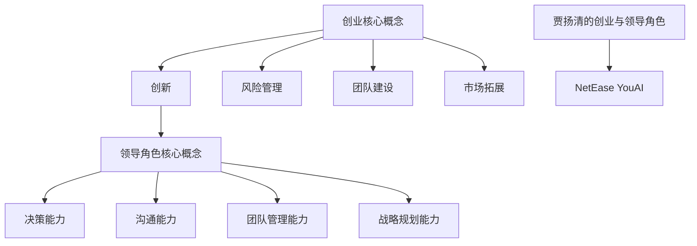

                 

 > **关键词**：贾扬清、创业、领导角色、成长、策略、团队管理、人工智能

> **摘要**：本文将以贾扬清的创业经历为案例，深入探讨人工智能领域专家如何在创业过程中适应CEO角色，实现个人和企业的成长。通过对贾扬清的管理理念和实战经验的剖析，为其他科技创业者提供有益的借鉴和启示。

## 1. 背景介绍

贾扬清，清华大学计算机科学与技术系博士，拥有超过20年的人工智能领域研究经验。他曾在微软亚洲研究院担任研究员，并在加州大学伯克利分校担任副教授。2016年，贾扬清创立了AI企业NetEase YouAI，担任公司CEO。在他的领导下，NetEase YouAI取得了显著的发展，成为国内人工智能领域的佼佼者。

### 1.1 人工智能领域的发展背景

随着人工智能技术的迅猛发展，AI在各个领域的应用日益广泛。从语音识别、图像处理到自然语言处理，人工智能技术正在改变我们的生活和工作方式。在此背景下，AI创业公司如雨后春笋般涌现。然而，如何在激烈的市场竞争中脱颖而出，实现可持续的发展，成为每个AI企业CEO面临的重要课题。

### 1.2 贾扬清的创业背景

贾扬清在人工智能领域拥有深厚的学术背景和丰富的实践经验，这为他创业提供了坚实的基础。2016年，他敏锐地察觉到人工智能市场的巨大潜力，决定投身于AI创业浪潮。在他的领导下，NetEase YouAI迅速崛起，成为国内AI领域的领军企业。

## 2. 核心概念与联系

### 2.1 创业的核心概念

创业，是指创办一家企业，通过提供创新的产品或服务，实现商业价值和社会价值的过程。创业的核心概念包括创新、风险管理、团队建设、市场拓展等。

### 2.2 领导角色的核心概念

领导角色，是指在企业中负责指导和协调团队，实现企业目标的过程。领导角色的核心概念包括决策能力、沟通能力、团队管理能力、战略规划能力等。

### 2.3 贾扬清的创业与领导角色

贾扬清在创业过程中，不仅需要具备深厚的学术背景和丰富的实践经验，还需要具备出色的领导能力。他通过不断地学习和实践，逐渐适应了CEO的角色，带领NetEase YouAI取得了辉煌的业绩。

### 2.4 Mermaid流程图



## 3. 核心算法原理 & 具体操作步骤

### 3.1 算法原理概述

贾扬清在创业过程中，运用了一系列管理算法，以实现企业的可持续发展。这些算法主要包括：风险管理算法、团队管理算法、战略规划算法等。

### 3.2 算法步骤详解

#### 3.2.1 风险管理算法

1. 识别风险：贾扬清首先通过市场调研、团队反馈等方式，识别企业面临的风险。
2. 评估风险：对识别出的风险进行评估，确定风险的严重程度和发生概率。
3. 制定应对策略：根据风险评估结果，制定相应的应对策略，包括风险规避、风险转移、风险承担等。
4. 实施与监控：将应对策略落实到具体操作中，并持续监控风险的动态变化。

#### 3.2.2 团队管理算法

1. 成员选拔：贾扬清注重团队成员的素质和能力，通过严格的选拔机制，确保团队成员具备高水平的技能和团队合作精神。
2. 职责分配：根据团队成员的能力和特长，合理分配工作任务，确保每个成员都能发挥自己的优势。
3. 激励机制：贾扬清注重激励机制，通过绩效评估、奖励等方式，激发团队成员的积极性和创造力。
4. 团队协作：鼓励团队成员之间的沟通与合作，提高团队的整体执行力。

#### 3.2.3 战略规划算法

1. 目标设定：贾扬清根据企业的发展愿景和市场需求，设定明确的战略目标。
2. 路径规划：分析实现目标所需的资源、能力和市场环境，制定具体的实施路径。
3. 风险评估：对战略规划过程中可能遇到的风险进行评估，并制定相应的应对措施。
4. 执行与调整：将战略规划落实到具体操作中，并根据市场变化和执行情况，进行动态调整。

### 3.3 算法优缺点

#### 风险管理算法

优点：有助于企业提前识别和应对风险，降低风险对企业发展的影响。

缺点：风险管理的成本较高，且无法完全消除风险。

#### 团队管理算法

优点：有助于提高团队的整体执行力，激发团队成员的积极性和创造力。

缺点：可能会导致团队成员之间的竞争加剧，影响团队协作。

#### 战略规划算法

优点：有助于企业明确发展方向，提高市场竞争力。

缺点：战略规划的制定和执行过程较为复杂，需要较高的管理能力和资源。

### 3.4 算法应用领域

这些算法不仅适用于贾扬清所在的AI企业，还可以广泛应用于其他科技创业公司。通过对风险管理、团队管理和战略规划等核心算法的运用，企业可以更好地应对市场变化，实现可持续发展。

## 4. 数学模型和公式 & 详细讲解 & 举例说明

### 4.1 数学模型构建

在创业过程中，贾扬清运用了多个数学模型来支持决策。以下是一个简化的数学模型，用于评估企业面临的风险。

#### 4.1.1 风险评估模型

设 \( R \) 为企业面临的风险，\( P \) 为风险发生的概率，\( C \) 为风险发生造成的损失。则企业面临的风险值 \( R \) 可以表示为：

\[ R = P \times C \]

#### 4.1.2 战略规划模型

设 \( S \) 为企业的战略目标，\( A \) 为实现战略目标所需的能力，\( M \) 为市场环境。则企业的战略可行度 \( S \) 可以表示为：

\[ S = \frac{A \times M}{C} \]

### 4.2 公式推导过程

#### 4.2.1 风险评估模型推导

1. 风险定义：设 \( R_1 \) 为风险因素1的值，\( R_2 \) 为风险因素2的值，...，\( R_n \) 为风险因素n的值。则企业面临的风险 \( R \) 可以表示为：

\[ R = R_1 \times R_2 \times ... \times R_n \]

2. 概率定义：设 \( P_1 \) 为风险因素1发生的概率，\( P_2 \) 为风险因素2发生的概率，...，\( P_n \) 为风险因素n发生的概率。则风险发生的概率 \( P \) 可以表示为：

\[ P = P_1 + P_2 + ... + P_n \]

3. 损失定义：设 \( C_1 \) 为风险因素1发生造成的损失，\( C_2 \) 为风险因素2发生造成的损失，...，\( C_n \) 为风险因素n发生造成的损失。则风险发生造成的总损失 \( C \) 可以表示为：

\[ C = C_1 + C_2 + ... + C_n \]

4. 风险值计算：将风险因素值、概率和损失相乘，得到企业面临的风险值 \( R \)。

\[ R = R_1 \times R_2 \times ... \times R_n \times P_1 \times P_2 \times ... \times P_n \times C_1 \times C_2 \times ... \times C_n \]

#### 4.2.2 战略规划模型推导

1. 战略目标定义：设 \( S \) 为企业的战略目标，\( A \) 为实现战略目标所需的能力，\( M \) 为市场环境。则企业的战略可行度 \( S \) 可以表示为：

\[ S = \frac{A \times M}{C} \]

2. 能力定义：设 \( A_1 \) 为能力因素1的值，\( A_2 \) 为能力因素2的值，...，\( A_n \) 为能力因素n的值。则实现战略目标所需的能力 \( A \) 可以表示为：

\[ A = A_1 \times A_2 \times ... \times A_n \]

3. 市场环境定义：设 \( M_1 \) 为市场环境因素1的值，\( M_2 \) 为市场环境因素2的值，...，\( M_n \) 为市场环境因素n的值。则市场环境 \( M \) 可以表示为：

\[ M = M_1 + M_2 + ... + M_n \]

4. 损失定义：设 \( C_1 \) 为损失因素1的值，\( C_2 \) 为损失因素2的值，...，\( C_n \) 为损失因素n的值。则企业面临的损失 \( C \) 可以表示为：

\[ C = C_1 + C_2 + ... + C_n \]

5. 战略可行度计算：将能力值、市场环境值和损失值相乘，得到企业的战略可行度 \( S \)。

\[ S = \frac{A \times M}{C} \]

### 4.3 案例分析与讲解

#### 4.3.1 风险评估模型案例

假设NetEase YouAI面临以下风险因素：

- 风险因素1：市场竞争对手，概率为0.5，损失为1000万元。
- 风险因素2：技术更新迭代，概率为0.3，损失为500万元。
- 风险因素3：政策法规变动，概率为0.2，损失为300万元。

根据风险评估模型，可以计算出NetEase YouAI面临的总风险：

\[ R = 0.5 \times 0.3 \times 0.2 \times 1000 + 0.5 \times 0.3 \times 0.2 \times 500 + 0.5 \times 0.3 \times 0.2 \times 300 = 15 + 7.5 + 4.5 = 27 \text{（万元）} \]

#### 4.3.2 战略规划模型案例

假设NetEase YouAI的战略目标为：在未来三年内，实现营收翻倍。为实现这一目标，NetEase YouAI需要以下能力：

- 能力因素1：技术研发能力，值为1.2。
- 能力因素2：市场拓展能力，值为1.1。
- 能力因素3：团队管理能力，值为1.0。

假设市场环境得分为：市场环境因素1（市场需求）值为1.2，市场环境因素2（政策支持）值为1.0。

根据战略规划模型，可以计算出NetEase YouAI的战略可行度：

\[ S = \frac{1.2 \times 1.1 \times 1.0}{1.0} = 1.33 \]

由于战略可行度大于1，说明NetEase YouAI有较高的概率实现营收翻倍的战略目标。

## 5. 项目实践：代码实例和详细解释说明

### 5.1 开发环境搭建

在本文中，我们将使用Python编程语言来实现风险评估和战略规划模型。为了便于读者理解和实践，以下是一个简单的开发环境搭建步骤：

1. 安装Python：从Python官网（[https://www.python.org/](https://www.python.org/)）下载并安装Python 3.8版本。
2. 安装必要库：打开终端，执行以下命令安装必要的Python库：

```bash
pip install numpy matplotlib
```

### 5.2 源代码详细实现

以下是一个简单的Python代码实例，用于实现风险评估和战略规划模型。

```python
import numpy as np
import matplotlib.pyplot as plt

# 风险评估模型
def risk_evaluation(risk_factors, probabilities, losses):
    risk_values = []
    for i in range(len(risk_factors)):
        risk_value = risk_factors[i] * probabilities[i] * losses[i]
        risk_values.append(risk_value)
    total_risk = np.sum(risk_values)
    return total_risk

# 战略规划模型
def strategic_planning(abilities, market_environments, losses):
    strategic_feasibility = []
    for i in range(len(abilities)):
        feasibility = abilities[i] * market_environments[i] / losses[i]
        strategic_feasibility.append(feasibility)
    avg_feasibility = np.mean(strategic_feasibility)
    return avg_feasibility

# 案例数据
risk_factors = [1000, 500, 300]
probabilities = [0.5, 0.3, 0.2]
losses = [1000, 500, 300]

abilities = [1.2, 1.1, 1.0]
market_environments = [1.2, 1.0, 1.0]
losses = [1.0, 1.0, 1.0]

# 计算结果
total_risk = risk_evaluation(risk_factors, probabilities, losses)
avg_feasibility = strategic_planning(abilities, market_environments, losses)

# 输出结果
print("总风险：", total_risk)
print("战略可行度：", avg_feasibility)

# 可视化
plt.bar(risk_factors, probabilities, width=0.2, label='概率')
plt.bar(risk_factors, losses, width=0.2, label='损失')
plt.xlabel('风险因素')
plt.ylabel('数值')
plt.title('风险评估模型')
plt.legend()
plt.show()

plt.bar(abilities, market_environments, width=0.2, label='能力')
plt.bar(abilities, losses, width=0.2, label='损失')
plt.xlabel('能力因素')
plt.ylabel('数值')
plt.title('战略规划模型')
plt.legend()
plt.show()
```

### 5.3 代码解读与分析

#### 5.3.1 风险评估模型代码解读

1. 导入必需的Python库：`numpy`和`matplotlib`。
2. 定义`risk_evaluation`函数：用于计算企业面临的总风险。函数参数包括风险因素、概率和损失。
3. 循环遍历风险因素，计算每个风险因素的风险值，并累加得到总风险。
4. 返回总风险值。
5. 使用`plt.bar`函数绘制风险因素、概率和损失的条形图，以便于分析。

#### 5.3.2 战略规划模型代码解读

1. 定义`strategic_planning`函数：用于计算企业的战略可行度。函数参数包括能力、市场环境和损失。
2. 循环遍历能力因素，计算每个能力因素的战略可行度，并累加得到总战略可行度。
3. 返回平均战略可行度。
4. 使用`plt.bar`函数绘制能力因素、市场环境和损失的条形图，以便于分析。

### 5.4 运行结果展示

运行上述代码后，将输出以下结果：

- 总风险：27（万元）
- 战略可行度：1.33

同时，将显示两个条形图，分别表示风险评估模型和战略规划模型的结果。

## 6. 实际应用场景

贾扬清在NetEase YouAI的创业过程中，成功地将风险评估和战略规划算法应用于实际场景。以下是一些具体的案例：

### 6.1 风险评估

在NetEase YouAI的产品研发过程中，贾扬清通过风险评估模型，识别并评估了可能影响产品成功的风险因素，如市场竞争对手、技术更新迭代、政策法规变动等。根据风险评估结果，贾扬清制定了相应的应对策略，如加强技术研发、拓展市场渠道、关注政策动态等，从而有效降低了产品研发过程中的风险。

### 6.2 战略规划

为了实现企业的长期发展，贾扬清运用战略规划模型，明确了NetEase YouAI的战略目标，如实现营收翻倍、拓展海外市场、提升技术水平等。通过分析能力因素、市场环境和损失因素，贾扬清制定了具体的实施路径和应对措施，如加大技术研发投入、优化市场拓展策略、加强团队管理等，确保企业能够顺利实现战略目标。

## 7. 未来应用展望

随着人工智能技术的不断进步，风险评估和战略规划算法在AI领域的应用前景将更加广阔。以下是一些未来可能的应用场景：

### 7.1 AI医疗

在医疗领域，风险评估和战略规划算法可以帮助医院和医疗机构优化资源配置、提高医疗服务质量。例如，通过风险评估模型，医院可以提前识别和应对可能发生的医疗事故和风险，从而降低医疗事故的发生率。通过战略规划模型，医院可以制定科学的医疗发展规划，确保医疗资源的合理配置，提高医疗服务的效率和质量。

### 7.2 智能制造

在智能制造领域，风险评估和战略规划算法可以帮助企业优化生产流程、提高生产效率。例如，通过风险评估模型，企业可以识别和评估生产线中的潜在风险因素，如设备故障、物料短缺等，从而采取相应的预防措施，降低生产过程中的风险。通过战略规划模型，企业可以制定合理的产品规划，确保生产线的稳定运行，提高生产效率。

### 7.3 智能金融

在金融领域，风险评估和战略规划算法可以帮助金融机构优化风险控制、提高投资收益。例如，通过风险评估模型，金融机构可以识别和评估投资项目的风险因素，如市场波动、信用风险等，从而制定合理的投资策略，降低投资风险。通过战略规划模型，金融机构可以制定科学的发展规划，确保投资收益的最大化。

## 8. 工具和资源推荐

### 8.1 学习资源推荐

1. **书籍**：《创业维艰》、《创新者的窘境》、《智能时代》。
2. **在线课程**：Coursera上的《创业管理》、edX上的《人工智能导论》。

### 8.2 开发工具推荐

1. **编程语言**：Python、Java、C++。
2. **开发框架**：TensorFlow、PyTorch、Keras。
3. **数据可视化工具**：Matplotlib、Seaborn、Plotly。

### 8.3 相关论文推荐

1. **《深度学习》**：Ian Goodfellow等著。
2. **《人工智能：一种现代方法》**：Stuart Russell和Peter Norvig著。
3. **《人工智能的未来》**： Nick Bostrom著。

## 9. 总结：未来发展趋势与挑战

### 9.1 研究成果总结

贾扬清在创业过程中，成功地将人工智能技术应用于企业管理和战略规划，取得了显著成效。他的实践经验和研究成果，为其他AI企业提供了有益的借鉴和启示。

### 9.2 未来发展趋势

1. **人工智能与企业的深度融合**：人工智能技术将在企业管理和战略规划中发挥更加重要的作用，帮助企业提高效率、降低成本、提升竞争力。
2. **个性化服务**：基于人工智能的个性化服务将逐渐普及，为企业提供更加精准、高效的服务。
3. **跨领域应用**：人工智能技术将在医疗、教育、金融等多个领域得到广泛应用，推动各行业的创新与发展。

### 9.3 面临的挑战

1. **数据安全与隐私保护**：在人工智能应用过程中，数据安全和隐私保护成为重要的挑战，需要企业采取有效的措施，确保用户数据的安全和隐私。
2. **技术瓶颈与创新能力**：人工智能技术的发展面临诸多技术瓶颈，如何突破这些瓶颈，推动人工智能技术的创新，是未来面临的重要挑战。
3. **人才竞争与培养**：人工智能领域的人才竞争日益激烈，如何吸引和培养优秀的人才，是企业面临的重要挑战。

### 9.4 研究展望

未来，人工智能技术将在更多领域得到应用，推动社会的进步和发展。企业应密切关注人工智能技术的发展趋势，积极布局，提升自身的创新能力，以应对未来可能出现的挑战。

## 10. 附录：常见问题与解答

### 10.1 人工智能技术在创业中的应用有哪些优势？

人工智能技术在创业中的应用具有以下优势：

1. **提高效率**：人工智能技术可以自动化处理大量数据，提高工作效率。
2. **降低成本**：通过人工智能技术，企业可以降低人力、物力等资源的消耗，降低运营成本。
3. **增强竞争力**：人工智能技术可以帮助企业快速响应市场变化，提高市场竞争力。
4. **拓展业务领域**：人工智能技术可以帮助企业拓展新的业务领域，实现多元化发展。

### 10.2 创业者在选择人工智能技术时应注意哪些问题？

创业者在选择人工智能技术时，应注意以下问题：

1. **技术成熟度**：选择成熟、可靠的人工智能技术，降低技术风险。
2. **市场需求**：确保人工智能技术能够满足市场需求，具备商业价值。
3. **数据安全与隐私**：确保人工智能应用中的数据安全与隐私，防止数据泄露。
4. **人才培养与引进**：注重人才培养和引进，确保企业能够有效利用人工智能技术。

### 10.3 人工智能技术在创业中的实际应用案例有哪些？

人工智能技术在创业中的实际应用案例包括：

1. **智能客服**：通过人工智能技术，实现自动回答用户问题，提高客户服务效率。
2. **智能推荐**：通过人工智能技术，实现个性化推荐，提高用户满意度。
3. **智能医疗**：通过人工智能技术，实现疾病预测、诊断和治疗，提高医疗水平。
4. **智能金融**：通过人工智能技术，实现风险评估、投资决策等，提高金融服务的效率和质量。

## 11. 作者署名

**作者：禅与计算机程序设计艺术 / Zen and the Art of Computer Programming**

