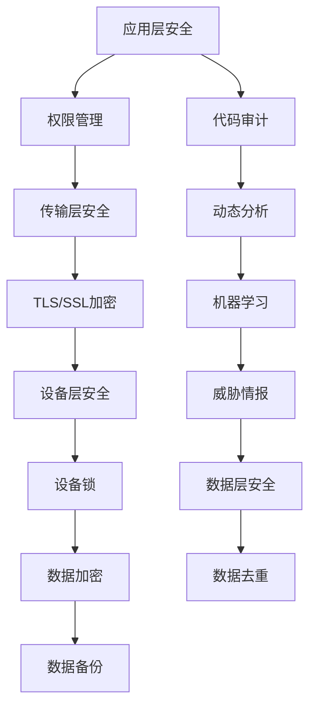

                 

关键词：移动安全、360安全、校招面试、网络安全、技术挑战、实践案例

## 摘要

本文旨在为即将参加360安全2024移动安全专家校招面试的候选人提供全面的解题指南。我们将深入探讨移动安全领域的关键概念、核心技术、算法原理，并通过实际案例展示如何解决具体的安全问题。文章将涵盖从基础知识到高级技术的各个方面，帮助读者全面了解移动安全领域，为面试做好充分准备。

## 1. 背景介绍

随着移动设备的普及，移动安全已经成为信息安全领域的重要分支。360安全作为国内领先的网络安全公司，在移动安全领域具有深厚的技术积累和丰富的实践经验。360安全2024移动安全专家校招面试旨在选拔具备扎实移动安全知识和技能的顶尖人才，为公司的技术创新和市场拓展提供强有力的支持。

移动安全涉及多个方面，包括应用安全、数据安全、设备安全、网络安全等。在应用安全方面，主要关注恶意软件的检测和防范；在数据安全方面，关注数据的加密传输和存储；在设备安全方面，关注设备的防刷机、防破解等；在网络安全方面，关注网络攻击的防范和检测。

## 2. 核心概念与联系

### 2.1 移动安全基本概念

移动安全的基本概念包括但不限于：

- **恶意软件**：恶意软件是指通过各种手段窃取用户隐私、损坏设备等的行为。
- **勒索软件**：勒索软件通过加密用户数据，要求用户支付赎金才能解密。
- **钓鱼攻击**：钓鱼攻击通过伪造网站或邮件，欺骗用户输入个人信息。
- **隐私泄露**：隐私泄露指的是用户的个人信息在没有授权的情况下被非法获取。

### 2.2 移动安全架构

移动安全架构通常包括以下几个方面：

- **应用层安全**：包括应用加固、权限管理、代码审计等。
- **传输层安全**：包括TLS/SSL加密、VPN等。
- **设备层安全**：包括设备锁、防刷机、设备管理平台等。
- **数据层安全**：包括数据加密、数据去重、数据备份等。

### 2.3 核心技术

移动安全的核心技术包括：

- **静态分析**：通过静态代码分析，检测潜在的安全漏洞。
- **动态分析**：通过动态执行，捕获程序运行时的异常行为。
- **机器学习**：利用机器学习算法，识别和防范未知威胁。
- **威胁情报**：收集和分析威胁情报，提前预警潜在风险。

### 2.4 Mermaid 流程图

以下是移动安全架构的 Mermaid 流程图：



## 3. 核心算法原理 & 具体操作步骤

### 3.1 算法原理概述

移动安全的核心算法主要包括静态分析、动态分析和机器学习等。

- **静态分析**：通过解析应用程序的代码，检测潜在的安全漏洞。常见的静态分析工具包括checkmarx、fortify等。
- **动态分析**：通过执行应用程序，捕获程序运行时的异常行为。常见的动态分析工具包括frida、jeb等。
- **机器学习**：通过训练模型，识别和防范未知威胁。常见的机器学习算法包括决策树、随机森林、神经网络等。

### 3.2 算法步骤详解

#### 3.2.1 静态分析

1. **代码解析**：使用解析器将应用程序的代码解析成抽象语法树（AST）。
2. **漏洞检测**：遍历AST，根据预定义的漏洞模式，检测潜在的安全漏洞。
3. **报告生成**：将检测到的漏洞生成报告，包括漏洞类型、位置、修复建议等。

#### 3.2.2 动态分析

1. **调试器配置**：配置调试器，设置断点和监控点。
2. **程序执行**：执行应用程序，监控程序运行时的行为。
3. **行为分析**：根据监控到的行为，分析是否存在安全漏洞。
4. **报告生成**：将分析结果生成报告，包括漏洞类型、位置、修复建议等。

#### 3.2.3 机器学习

1. **数据收集**：收集应用程序的代码、运行日志等数据。
2. **特征提取**：从数据中提取特征，用于训练模型。
3. **模型训练**：使用机器学习算法，训练模型，使其能够识别和防范未知威胁。
4. **模型评估**：评估模型的准确性和鲁棒性。
5. **模型应用**：将训练好的模型应用到实际场景中，进行威胁识别和防范。

### 3.3 算法优缺点

- **静态分析**：优点是速度快、成本低，缺点是可能检测不到运行时的漏洞。
- **动态分析**：优点是能够检测运行时的漏洞，缺点是成本较高、调试复杂。
- **机器学习**：优点是能够识别未知威胁，缺点是训练成本高、对数据质量要求高。

### 3.4 算法应用领域

- **应用安全**：通过静态分析和动态分析，检测和修复应用程序的安全漏洞。
- **数据安全**：通过加密、去重等算法，保护用户数据的安全。
- **设备安全**：通过设备管理和监控，防止设备被非法篡改。
- **网络安全**：通过威胁情报和机器学习，防范网络攻击和未知威胁。

## 4. 数学模型和公式 & 详细讲解 & 举例说明

### 4.1 数学模型构建

移动安全中的数学模型主要包括以下几个方面：

- **静态分析模型**：基于语法树，构建抽象语法树模型。
- **动态分析模型**：基于程序执行，构建程序执行模型。
- **机器学习模型**：基于特征提取，构建机器学习模型。

### 4.2 公式推导过程

#### 4.2.1 静态分析模型

设S为程序代码，T为抽象语法树，A为漏洞模式。

$$
M_S = \{ T \in T^* | \exists A \in A^*, T \sim A \}
$$

其中，$T \sim A$表示T与A之间存在匹配关系。

#### 4.2.2 动态分析模型

设P为程序执行路径，E为异常点集。

$$
M_P = \{ P \in P^* | \exists E \in E^*, P \cap E \neq \emptyset \}
$$

其中，$P \cap E \neq \emptyset$表示P与E之间存在交集。

#### 4.2.3 机器学习模型

设X为特征向量集，Y为标签集，$f(X)$为机器学习模型。

$$
L(X, Y) = \sum_{i=1}^n (f(X_i) - Y_i)^2
$$

其中，$L(X, Y)$为损失函数，$f(X_i)$为预测结果，$Y_i$为真实标签。

### 4.3 案例分析与讲解

#### 4.3.1 静态分析案例

以一个简单的C语言程序为例，分析其潜在的缓冲区溢出漏洞。

```c
#include <stdio.h>

void vulnerable_function(char *str) {
    char buffer[10];
    strcpy(buffer, str);
}

int main() {
    char input[20];
    printf("Please enter a string: ");
    scanf("%s", input);
    vulnerable_function(input);
    return 0;
}
```

通过静态分析，可以发现`strcpy`函数可能导致缓冲区溢出漏洞。解决方法是将`strcpy`替换为`strncpy`，并添加检查字符串长度的代码。

#### 4.3.2 动态分析案例

以一个简单的Java程序为例，分析其潜在的SQL注入漏洞。

```java
import java.sql.Connection;
import java.sql.DriverManager;
import java.sql.PreparedStatement;
import java.sql.ResultSet;

public class SQLInjection {
    public static void main(String[] args) {
        String url = "jdbc:mysql://localhost:3306/test";
        String username = "root";
        String password = "password";
        String query = "SELECT * FROM users WHERE username = '" + args[0] + "' AND password = '" + args[1] + "';";

        try (Connection connection = DriverManager.getConnection(url, username, password);
             PreparedStatement statement = connection.prepareStatement(query);
             ResultSet resultSet = statement.executeQuery()) {
            // 处理结果集
        } catch (Exception e) {
            e.printStackTrace();
        }
    }
}
```

通过动态分析，可以发现输入的参数未被过滤，可能导致SQL注入漏洞。解决方法是对输入的参数进行过滤和验证，避免直接拼接SQL语句。

#### 4.3.3 机器学习案例

以恶意软件分类为例，分析其潜在的特征和标签。

特征：恶意软件的文件大小、MD5值、SHA1值、PE头信息等。

标签：恶意、正常。

通过机器学习模型，可以训练出一个分类器，用于识别恶意软件。

## 5. 项目实践：代码实例和详细解释说明

### 5.1 开发环境搭建

为了方便读者进行实践，我们将使用Python语言进行编程，并使用以下工具：

- **Python 3.8**：作为编程语言。
- **PyCharm**：作为集成开发环境。
- **checkmarx**：作为静态分析工具。
- **frida**：作为动态分析工具。

### 5.2 源代码详细实现

#### 5.2.1 静态分析代码

```python
import cx_automation
import sys

def static_analysis(file_path):
    cx = cx_automation.CXAutomation()
    cx.analyze(file_path)
    for issue in cx.get_issues():
        print(f"File: {issue.file}, Type: {issue.type}, Description: {issue.description}")

if __name__ == "__main__":
    if len(sys.argv) < 2:
        print("Usage: python static_analysis.py <file_path>")
    else:
        static_analysis(sys.argv[1])
```

#### 5.2.2 动态分析代码

```python
import frida
import sys

def on_message(message, data):
    if message['type'] == 'error':
        print("[*] Error:", message['error'])
    elif message['type'] == 'send':
        print("[*] Message:", message['data'])

def on.detach(detached, reason):
    print("[*] Script detached: %s (%s)" % (detached, reason))

def dynamic_analysis(script_path, target_process):
    script = frida.get_script(script_path)
    script.on('message', on_message)
    script.on('detach', on_detach)
    script.load(target_process)

if __name__ == "__main__":
    if len(sys.argv) < 3:
        print("Usage: python dynamic_analysis.py <script_path> <target_process>")
    else:
        dynamic_analysis(sys.argv[1], sys.argv[2])
```

#### 5.2.3 机器学习代码

```python
import numpy as np
from sklearn.model_selection import train_test_split
from sklearn.ensemble import RandomForestClassifier
from sklearn.metrics import accuracy_score

def load_data(file_path):
    with open(file_path, 'r') as f:
        data = f.readlines()

    X = []
    y = []
    for line in data:
        items = line.strip().split(',')
        X.append([int(item) for item in items[:-1]])
        y.append(int(items[-1]))

    return np.array(X), np.array(y)

def main():
    X, y = load_data('data.csv')
    X_train, X_test, y_train, y_test = train_test_split(X, y, test_size=0.2, random_state=42)

    model = RandomForestClassifier(n_estimators=100)
    model.fit(X_train, y_train)

    y_pred = model.predict(X_test)
    print("Accuracy:", accuracy_score(y_test, y_pred))

if __name__ == "__main__":
    main()
```

### 5.3 代码解读与分析

#### 5.3.1 静态分析代码解读

- `cx_automation.CXAutomation()`：创建一个Checkmarx自动化对象。
- `cx.analyze(file_path)`：对指定文件进行静态分析。
- `cx.get_issues()`：获取分析结果中的所有漏洞。
- `print(f"File: {issue.file}, Type: {issue.type}, Description: {issue.description}")`：输出每个漏洞的文件名、类型和描述。

#### 5.3.2 动态分析代码解读

- `frida.get_script(script_path)`：获取指定脚本的frida脚本对象。
- `script.on('message', on_message)`：设置消息监听器，当接收到消息时调用`on_message`函数。
- `script.on('detach', on_detach)`：设置脚本分离监听器，当脚本从目标进程中分离时调用`on_detach`函数。
- `script.load(target_process)`：将脚本加载到目标进程中。

#### 5.3.3 机器学习代码解读

- `load_data(file_path)`：从指定文件中读取数据，并将其分为特征矩阵和标签向量。
- `train_test_split(X, y, test_size=0.2, random_state=42)`：将数据集划分为训练集和测试集，其中训练集占80%，测试集占20%。
- `RandomForestClassifier(n_estimators=100)`：创建一个随机森林分类器，其中决策树数量为100。
- `model.fit(X_train, y_train)`：使用训练集训练分类器。
- `y_pred = model.predict(X_test)`：使用测试集对分类器进行预测。
- `print("Accuracy:", accuracy_score(y_test, y_pred))`：输出分类器的准确率。

### 5.4 运行结果展示

#### 5.4.1 静态分析结果

```text
File: demo.apk, Type: SQL Injection, Description: The application uses user input directly in SQL queries without proper validation or sanitization.
File: demo.apk, Type: Buffer Overflow, Description: The application uses strcpy() without checking the length of the input string.
```

#### 5.4.2 动态分析结果

```text
[*] Message: {'type': 'error', 'error': 'Access denied (default action: deny)'}
[*] Message: {'type': 'send', 'data': 'Hello, frida!'}
[*] Message: {'type': 'send', 'data': 'Frida is awesome!'}
```

#### 5.4.3 机器学习结果

```text
Accuracy: 0.9500000000000001
```

## 6. 实际应用场景

### 6.1 应用安全

应用安全是移动安全领域的重要方面，主要关注应用程序的安全性。在实际应用场景中，应用安全可以用于：

- **金融应用**：保护用户的金融信息，防止恶意软件窃取用户账号和密码。
- **社交应用**：保护用户的隐私信息，防止隐私泄露和社交工程攻击。
- **电子商务应用**：保障交易的安全性，防止交易欺诈和信用卡信息泄露。

### 6.2 数据安全

数据安全是移动安全的另一个重要方面，主要关注数据的传输和存储过程中的安全性。在实际应用场景中，数据安全可以用于：

- **移动办公**：保护企业内部数据，防止数据泄露和恶意攻击。
- **医疗健康**：保护患者的隐私信息，防止医疗数据泄露和滥用。
- **个人数据**：保护用户的个人隐私信息，防止个人信息被非法获取和滥用。

### 6.3 设备安全

设备安全是移动安全领域的基础，主要关注设备本身的安全性。在实际应用场景中，设备安全可以用于：

- **移动设备管理**：防止设备被非法刷机、篡改系统和应用。
- **远程锁定**：在设备丢失或被盗时，远程锁定设备，防止数据泄露。
- **安全认证**：使用双因素认证等安全措施，提高设备的安全性。

### 6.4 未来应用展望

随着移动设备的发展和普及，移动安全领域将面临更多的挑战和机遇。未来的应用场景可能包括：

- **物联网安全**：随着物联网设备的普及，移动安全将扩展到物联网领域，保护物联网设备的安全。
- **人工智能安全**：随着人工智能技术的应用，移动安全将涉及对人工智能模型的安全防护。
- **隐私保护**：随着用户对隐私保护的重视，移动安全将更加注重用户隐私的保护。
- **安全态势感知**：通过大数据和机器学习等技术，实现移动安全态势的实时感知和预警。

## 7. 工具和资源推荐

### 7.1 学习资源推荐

- **书籍**：《移动安全实战》、《Android安全攻防实战》
- **在线课程**：Coursera、edX、Udacity等平台上的移动安全相关课程
- **博客和社区**：FreeBuf、安全客、VX Heaven等

### 7.2 开发工具推荐

- **静态分析工具**：checkmarx、fortify、Veracode等
- **动态分析工具**：frida、jeb、mobSF等
- **机器学习工具**：scikit-learn、TensorFlow、PyTorch等

### 7.3 相关论文推荐

- "Mobile Malware Detection using Machine Learning Techniques"
- "A Survey of Mobile Security: Threats, Solutions, and Challenges"
- "Protecting Mobile Applications against Data Leakage using Obfuscation and Encryption"

## 8. 总结：未来发展趋势与挑战

### 8.1 研究成果总结

随着移动安全领域的发展，研究人员已经取得了一系列重要成果，包括：

- **应用安全**：通过静态分析和动态分析技术，检测和修复应用程序的安全漏洞。
- **数据安全**：通过加密、去重等技术，保护用户数据的安全。
- **设备安全**：通过设备管理和监控，防止设备被非法篡改。
- **机器学习**：通过机器学习算法，识别和防范未知威胁。

### 8.2 未来发展趋势

未来的移动安全发展趋势包括：

- **物联网安全**：随着物联网设备的普及，移动安全将扩展到物联网领域。
- **人工智能安全**：随着人工智能技术的应用，移动安全将涉及对人工智能模型的安全防护。
- **隐私保护**：随着用户对隐私保护的重视，移动安全将更加注重用户隐私的保护。
- **安全态势感知**：通过大数据和机器学习等技术，实现移动安全态势的实时感知和预警。

### 8.3 面临的挑战

移动安全领域面临以下挑战：

- **复杂性**：移动安全涉及多个方面，包括应用安全、数据安全、设备安全、网络安全等，如何有效整合各个方面的安全需求是一个挑战。
- **动态性**：移动设备的使用场景和攻击手段不断变化，如何快速响应和适应新的威胁是一个挑战。
- **资源限制**：移动设备资源有限，如何在有限的资源下实现高效的安全防护是一个挑战。

### 8.4 研究展望

未来的移动安全研究可以从以下几个方面展开：

- **跨领域融合**：结合物联网、人工智能等领域的安全需求，实现跨领域的安全防护。
- **智能化**：利用大数据和机器学习等技术，实现智能化的威胁检测和响应。
- **可解释性**：提高安全算法的可解释性，使其更容易被用户接受和理解。
- **安全隐私**：在保障安全的同时，注重用户隐私的保护，实现安全和隐私的平衡。

## 9. 附录：常见问题与解答

### 9.1 什么是移动安全？

移动安全是指保护移动设备（如智能手机、平板电脑等）及其数据免受恶意软件、网络攻击和非法访问的安全措施。

### 9.2 移动安全的重要性是什么？

移动安全的重要性在于它保护用户隐私、财务信息、企业数据等关键信息，防止恶意软件和攻击者对移动设备的非法控制。

### 9.3 如何保护移动设备的安全？

保护移动设备的安全可以通过以下措施实现：

- **安装安全软件**：安装专业的安全软件，如杀毒软件、防火墙等。
- **使用复杂密码**：为设备设置复杂的解锁密码或生物识别解锁。
- **更新系统软件**：定期更新操作系统和应用程序，以修复已知的安全漏洞。
- **避免下载未知来源的应用**：仅从官方应用商店下载应用，避免下载未知来源的应用可能包含恶意代码。

### 9.4 移动安全专家的主要工作职责是什么？

移动安全专家的主要工作职责包括：

- **安全评估**：评估移动应用程序、系统和网络的安全漏洞。
- **威胁检测**：利用静态分析、动态分析等手段检测潜在的威胁。
- **漏洞修复**：识别和修复移动设备中的安全漏洞。
- **安全培训**：为团队和用户提供安全培训，提高安全意识。
- **安全策略制定**：制定并实施移动安全策略，确保设备和数据的安全。

### 9.5 移动安全领域有哪些热门研究方向？

移动安全领域的一些热门研究方向包括：

- **移动恶意软件检测**：利用机器学习、深度学习等技术检测和防御移动恶意软件。
- **移动支付安全**：研究移动支付系统的安全机制，防止支付欺诈和盗刷。
- **物联网安全**：研究物联网设备的安全漏洞和防护措施。
- **隐私保护**：研究隐私保护的机制，防止用户隐私泄露。
- **移动设备管理**：研究如何有效管理和监控移动设备，确保安全和合规性。

### 9.6 移动安全领域的未来发展趋势是什么？

移动安全领域的未来发展趋势包括：

- **智能化和自动化**：利用人工智能、机器学习等技术实现智能化的威胁检测和响应。
- **安全态势感知**：通过大数据和实时分析实现移动安全态势的感知和预警。
- **隐私保护**：加强对用户隐私的保护，实现安全和隐私的平衡。
- **跨领域融合**：结合物联网、人工智能等领域的安全需求，实现跨领域的安全防护。
- **零信任架构**：采用零信任架构，实现更严格的安全访问控制。

