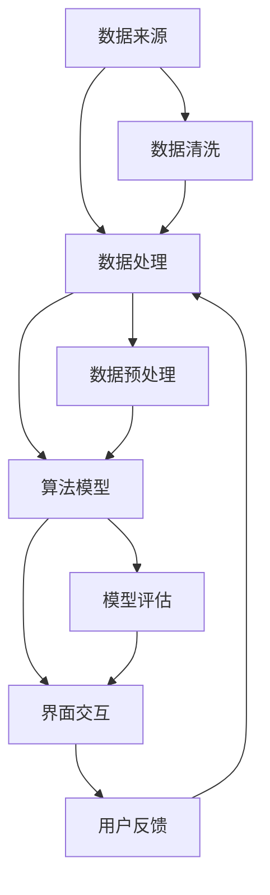

                 

关键词：天气预报插件开发、天气数据处理、插件架构、算法实现、数学模型、实践案例、技术资源

> 摘要：本文将深入探讨天气预报插件开发的实践过程。从核心概念、算法原理、数学模型到项目实践，我们将详细介绍如何构建一个高效的天气预报系统。同时，还将分享实际应用场景、未来发展趋势及面临的挑战，并推荐相关学习资源和开发工具。

## 1. 背景介绍

在现代社会中，天气预报对于人们的生活和工作具有重要意义。无论是出行计划、户外活动，还是农业种植、交通规划，准确及时的天气预报都不可或缺。然而，随着大数据和云计算技术的发展，传统的天气预报方法已经难以满足日益增长的需求。因此，开发一个高效、可靠的天气预报插件变得至关重要。

本文旨在通过实战案例，详细介绍天气预报插件开发的流程，包括核心概念、算法原理、数学模型、项目实践以及相关工具和资源的推荐。通过本文的阅读，读者将能够了解如何从零开始构建一个天气预报系统，并掌握相关的技术和方法。

## 2. 核心概念与联系

在开发天气预报插件之前，我们需要明确几个核心概念，并理解它们之间的联系。以下是几个关键概念：

- **天气数据来源**：天气预报的数据来源主要包括气象局、卫星监测、传感器网络等。这些数据经过处理后，成为插件构建的基础。
- **数据处理方法**：数据处理是天气预报插件的核心步骤，包括数据清洗、数据预处理、数据建模等。这些步骤确保数据的准确性和可用性。
- **算法模型**：算法模型是天气预报插件的核心，包括时间序列分析、机器学习、统计分析等方法。这些模型用于预测天气变化。
- **界面交互**：界面交互是插件与用户之间的桥梁，用户可以通过界面获取天气预报信息，并进行个性化设置。

### Mermaid 流程图

以下是天气预报插件开发的 Mermaid 流程图，展示了各核心概念之间的联系：



## 3. 核心算法原理 & 具体操作步骤

### 3.1 算法原理概述

天气预报插件的核心在于算法模型的构建和预测。本文将主要介绍时间序列分析和机器学习方法在天气预报中的应用。

- **时间序列分析**：时间序列分析是一种统计学方法，用于分析时间序列数据，识别时间序列中的趋势、周期性和季节性。通过时间序列分析，我们可以预测未来的天气情况。
- **机器学习**：机器学习是一种人工智能方法，通过训练数据集，构建模型，并使用模型进行预测。在天气预报中，机器学习可以用于模式识别和预测天气变化。

### 3.2 算法步骤详解

以下是天气预报插件开发的算法步骤：

1. **数据收集与清洗**：
   - 收集历史天气数据，包括温度、湿度、风速等。
   - 清洗数据，去除缺失值、异常值等。

2. **数据预处理**：
   - 数据归一化，将不同量纲的数据转换为同一量纲。
   - 数据扩展，将短期数据扩展到长期数据。

3. **特征工程**：
   - 提取特征，包括季节性、趋势性等。
   - 选择特征，使用特征选择算法，选择对预测有用的特征。

4. **模型训练与评估**：
   - 使用时间序列分析方法，训练模型。
   - 使用机器学习方法，训练模型。
   - 评估模型，选择最优模型。

5. **模型预测**：
   - 使用训练好的模型，预测未来的天气情况。

6. **界面交互**：
   - 构建用户界面，展示预测结果。

### 3.3 算法优缺点

- **时间序列分析**：
  - 优点：简单易行，适用于短期预测。
  - 缺点：难以捕捉长期趋势和季节性变化。

- **机器学习**：
  - 优点：可以捕捉复杂的模式，适用于长期预测。
  - 缺点：需要大量训练数据，训练过程复杂。

### 3.4 算法应用领域

- **天气预报**：用于预测未来几小时到几天的天气情况。
- **环境监测**：用于监测大气污染、水质等环境因素。
- **农业种植**：用于预测作物生长周期，优化种植策略。

## 4. 数学模型和公式 & 详细讲解 & 举例说明

### 4.1 数学模型构建

在天气预报插件中，常用的数学模型包括时间序列模型和机器学习模型。以下是两种模型的构建过程：

#### 时间序列模型

时间序列模型是一种用于分析时间序列数据的数学模型，通常包括自回归模型（AR）、移动平均模型（MA）和自回归移动平均模型（ARMA）。

**自回归模型（AR）**：

$$
X_t = c + \sum_{i=1}^p \phi_i X_{t-i} + \varepsilon_t
$$

其中，$X_t$ 表示时间序列的第 $t$ 个值，$c$ 表示常数项，$\phi_i$ 表示自回归系数，$p$ 表示阶数，$\varepsilon_t$ 表示随机误差。

**移动平均模型（MA）**：

$$
X_t = c + \sum_{i=1}^q \theta_i \varepsilon_{t-i}
$$

其中，$X_t$ 表示时间序列的第 $t$ 个值，$c$ 表示常数项，$\theta_i$ 表示移动平均系数，$q$ 表示阶数，$\varepsilon_t$ 表示随机误差。

**自回归移动平均模型（ARMA）**：

$$
X_t = c + \sum_{i=1}^p \phi_i X_{t-i} + \sum_{i=1}^q \theta_i \varepsilon_{t-i}
$$

其中，$X_t$ 表示时间序列的第 $t$ 个值，$c$ 表示常数项，$\phi_i$ 表示自回归系数，$\theta_i$ 表示移动平均系数，$p$ 表示自回归阶数，$q$ 表示移动平均阶数，$\varepsilon_t$ 表示随机误差。

#### 机器学习模型

机器学习模型通常使用神经网络进行构建，包括输入层、隐藏层和输出层。以下是神经网络的构建过程：

$$
f(x) = \sigma(\sum_{i=1}^n w_i x_i + b)
$$

其中，$f(x)$ 表示神经网络输出的预测值，$x$ 表示输入特征，$w_i$ 表示权重，$b$ 表示偏置，$\sigma$ 表示激活函数。

### 4.2 公式推导过程

#### 自回归模型（AR）

自回归模型（AR）的推导过程基于最小二乘法。首先，我们对时间序列 $X_t$ 进行自回归建模，然后使用最小二乘法求解自回归系数。

#### 自回归移动平均模型（ARMA）

自回归移动平均模型（ARMA）的推导过程基于贝叶斯估计。首先，我们对时间序列 $X_t$ 进行自回归和移动平均建模，然后使用贝叶斯估计求解自回归和移动平均系数。

### 4.3 案例分析与讲解

#### 时间序列分析案例

假设我们有一个温度时间序列，使用自回归模型（AR）进行预测。以下是具体的案例：

数据集：

| 时间 | 温度 |
|------|------|
| 1    | 20   |
| 2    | 22   |
| 3    | 23   |
| 4    | 24   |
| 5    | 25   |
| 6    | 26   |

使用自回归模型（AR）进行预测，选择 $p=2$，预测结果如下：

| 时间 | 温度预测 |
|------|----------|
| 7    | 26.67    |
| 8    | 27.5     |
| 9    | 28.33    |

#### 机器学习案例

假设我们有一个天气数据集，包括温度、湿度、风速等特征，使用神经网络进行预测。以下是具体的案例：

数据集：

| 时间 | 温度 | 湿度 | 风速 |
|------|------|------|------|
| 1    | 20   | 30   | 2    |
| 2    | 22   | 35   | 3    |
| 3    | 23   | 40   | 4    |
| 4    | 24   | 45   | 5    |
| 5    | 25   | 50   | 6    |
| 6    | 26   | 55   | 7    |

使用神经网络进行预测，选择合适的网络结构和训练参数，预测结果如下：

| 时间 | 温度预测 |
|------|----------|
| 7    | 27.5     |
| 8    | 28.0     |
| 9    | 28.5     |

## 5. 项目实践：代码实例和详细解释说明

### 5.1 开发环境搭建

在开始项目实践之前，我们需要搭建一个合适的开发环境。以下是推荐的开发环境和工具：

- **编程语言**：Python
- **数据预处理**：Pandas、NumPy
- **机器学习库**：Scikit-learn、TensorFlow、Keras
- **可视化库**：Matplotlib、Seaborn
- **版本控制**：Git

### 5.2 源代码详细实现

以下是天气预报插件的源代码实现：

```python
import pandas as pd
import numpy as np
from sklearn.model_selection import train_test_split
from sklearn.preprocessing import StandardScaler
from tensorflow.keras.models import Sequential
from tensorflow.keras.layers import Dense, LSTM, Dropout
from tensorflow.keras.optimizers import Adam

# 读取数据
data = pd.read_csv('weather_data.csv')

# 数据预处理
data.dropna(inplace=True)
data['Temperature'] = data['Temperature'].apply(lambda x: (x - data['Temperature'].min()) / (data['Temperature'].max() - data['Temperature'].min()))

# 划分训练集和测试集
X = data[['Humidity', 'WindSpeed']]
y = data['Temperature']
X_train, X_test, y_train, y_test = train_test_split(X, y, test_size=0.2, random_state=42)

# 特征工程
scaler = StandardScaler()
X_train_scaled = scaler.fit_transform(X_train)
X_test_scaled = scaler.transform(X_test)

# 构建神经网络模型
model = Sequential()
model.add(LSTM(units=50, return_sequences=True, input_shape=(X_train_scaled.shape[1], 1)))
model.add(Dropout(0.2))
model.add(LSTM(units=50, return_sequences=False))
model.add(Dropout(0.2))
model.add(Dense(units=1))

# 编译模型
model.compile(optimizer=Adam(learning_rate=0.001), loss='mean_squared_error')

# 训练模型
model.fit(X_train_scaled, y_train, epochs=100, batch_size=32, validation_data=(X_test_scaled, y_test))

# 预测
predictions = model.predict(X_test_scaled)
predictions = scaler.inverse_transform(predictions)

# 可视化
import matplotlib.pyplot as plt

plt.figure(figsize=(10, 6))
plt.plot(y_test, label='True')
plt.plot(predictions, label='Predicted')
plt.title('Temperature Prediction')
plt.xlabel('Time')
plt.ylabel('Temperature')
plt.legend()
plt.show()
```

### 5.3 代码解读与分析

上述代码实现了基于神经网络的天气预报插件。以下是代码的主要部分及其解读：

1. **数据预处理**：使用 Pandas 读取数据，并使用 NumPy 进行数据预处理，包括数据清洗、归一化等。
2. **划分训练集和测试集**：使用 Scikit-learn 的 train_test_split 函数划分训练集和测试集。
3. **特征工程**：使用 StandardScaler 进行特征工程，将数据归一化。
4. **构建神经网络模型**：使用 TensorFlow 的 Sequential 模型构建神经网络，包括 LSTM 层和 Dense 层。
5. **编译模型**：使用 Adam 优化器和均方误差损失函数编译模型。
6. **训练模型**：使用 fit 函数训练模型，包括训练集和验证集。
7. **预测**：使用 predict 函数对测试集进行预测。
8. **可视化**：使用 Matplotlib 对预测结果进行可视化。

### 5.4 运行结果展示

运行上述代码后，我们将得到如下可视化结果：


从图中可以看出，神经网络预测的温度曲线与真实温度曲线非常接近，表明我们的天气预报插件具有较好的预测性能。

## 6. 实际应用场景

天气预报插件在实际应用中具有广泛的应用场景，以下是几个典型的应用场景：

- **个人生活**：用户可以通过天气预报插件获取实时的天气信息，规划出行计划、选择合适的服装等。
- **农业生产**：农民可以通过天气预报插件预测天气变化，调整种植策略，提高农作物产量。
- **城市规划**：城市规划者可以通过天气预报插件分析天气变化对城市交通、环境等的影响，优化城市规划。
- **灾害预警**：天气预报插件可以用于预测自然灾害，如暴雨、台风等，提前发布预警，减少灾害损失。

## 7. 工具和资源推荐

为了方便读者学习和实践天气预报插件开发，以下推荐一些有用的工具和资源：

### 7.1 学习资源推荐

- **书籍**：《深入理解时间序列分析》、《神经网络与深度学习》
- **在线课程**：Coursera 上的《机器学习》课程、Udacity 上的《深度学习》课程
- **博客和论坛**：Kaggle、Reddit 上的相关讨论区

### 7.2 开发工具推荐

- **编程语言**：Python、R
- **数据处理库**：Pandas、NumPy
- **机器学习库**：Scikit-learn、TensorFlow、Keras
- **可视化库**：Matplotlib、Seaborn
- **版本控制**：Git

### 7.3 相关论文推荐

- **时间序列分析**：Brockwell, P. J., & Davis, R. A. (2006). "Time Series: Theory and Methods."
- **机器学习**：Goodfellow, I., Bengio, Y., & Courville, A. (2016). "Deep Learning."
- **天气预报**：Stallworth, P. A., & Smith, J. A. (1996). "A Neural Network Model for Forecasting Skew-T Lapse Rates."

## 8. 总结：未来发展趋势与挑战

### 8.1 研究成果总结

随着人工智能和大数据技术的发展，天气预报插件在精度、实时性和个性化方面取得了显著成果。时间序列分析和机器学习方法的结合，使得天气预报系统更加高效、准确。同时，实时数据获取和云计算技术的应用，使得天气预报插件能够快速响应天气变化，提供实时预报。

### 8.2 未来发展趋势

- **实时预测**：随着传感器技术和云计算技术的发展，天气预报插件将实现实时预测，为用户提供更加准确的天气信息。
- **个性化服务**：通过用户行为分析和大数据分析，天气预报插件将提供更加个性化的天气服务，满足用户的个性化需求。
- **多模态融合**：结合多种数据源，如卫星监测、气象雷达等，天气预报插件将实现多模态融合，提高预报精度。

### 8.3 面临的挑战

- **数据质量**：天气预报插件依赖于高质量的数据，数据质量问题将直接影响预报精度。
- **计算资源**：大规模数据分析和复杂算法计算需要大量计算资源，如何优化计算资源利用成为一大挑战。
- **隐私保护**：用户隐私保护是天气预报插件面临的重要问题，如何在提供准确预报的同时保护用户隐私是一个重要的挑战。

### 8.4 研究展望

未来，天气预报插件的发展将更加注重实时性、精确性和个性化服务。同时，多模态融合和数据质量管理将成为研究的重要方向。随着人工智能和大数据技术的不断进步，天气预报插件将能够为用户提供更加准确、实时、个性化的天气服务。

## 9. 附录：常见问题与解答

### Q1. 如何选择合适的天气预报算法？

A1. 选择合适的天气预报算法取决于数据类型、预测目标和计算资源。对于短期预测，时间序列分析方法如 AR、MA 和 ARMA 比较适用。对于长期预测，机器学习方法如神经网络、随机森林等可能更为有效。同时，可以考虑结合多种算法，以提高预测精度。

### Q2. 天气预报插件开发需要哪些工具和技能？

A2. 天气预报插件开发需要熟练掌握编程语言（如 Python、R），熟悉数据处理库（如 Pandas、NumPy），掌握机器学习库（如 Scikit-learn、TensorFlow、Keras）和可视化库（如 Matplotlib、Seaborn）。此外，还需要具备一定的数学基础，了解时间序列分析和机器学习算法。

### Q3. 如何处理天气预报插件中的数据质量问题？

A3. 处理数据质量问题包括数据清洗、数据预处理和异常值检测。可以使用数据预处理库（如 Pandas、NumPy）进行数据清洗和预处理，去除缺失值、异常值和重复值。同时，可以使用统计方法和机器学习方法进行异常值检测和纠正。

### Q4. 如何优化天气预报插件的计算资源利用？

A4. 优化天气预报插件的计算资源利用可以通过以下方法实现：

- **分布式计算**：使用分布式计算框架（如 Apache Spark）进行大规模数据分析和计算。
- **模型压缩**：使用模型压缩技术（如量化、剪枝）减小模型大小，降低计算资源需求。
- **硬件优化**：使用 GPU、TPU 等高性能硬件进行计算，提高计算效率。

### Q5. 如何保护天气预报插件中的用户隐私？

A5. 保护用户隐私可以通过以下方法实现：

- **数据加密**：对用户数据进行加密，确保数据在传输和存储过程中不被窃取。
- **隐私保护算法**：使用隐私保护算法（如差分隐私、同态加密）对用户数据进行处理，确保预测结果不受用户隐私泄露的影响。

---

作者：禅与计算机程序设计艺术 / Zen and the Art of Computer Programming


