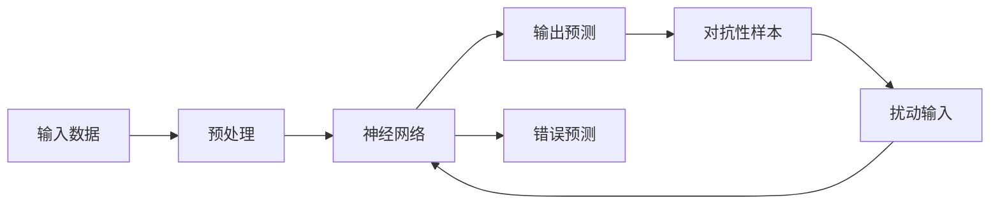

                 

关键词：对抗性样本、神经网络、反直觉特性、深度学习、安全性、鲁棒性

摘要：本文深入探讨了对抗性样本在神经网络中的影响，揭示了神经网络存在的反直觉特性。通过详细分析对抗性样本的生成原理和神经网络的行为模式，我们提出了针对这些特性的解决方案，并展望了未来的发展方向。

## 1. 背景介绍

随着深度学习技术的飞速发展，神经网络在图像识别、语音识别、自然语言处理等众多领域取得了显著的成果。然而，这些神经网络模型在训练过程中往往表现出一些反直觉的特性，其中最为显著的就是对抗性样本问题。对抗性样本是一种通过精心设计的输入，使神经网络产生错误预测的样本。这种现象不仅挑战了神经网络的安全性和鲁棒性，也对深度学习的实际应用带来了巨大的隐患。

本文旨在深入分析对抗性样本凸显的神经网络反直觉特性，探讨解决这些问题的方法，并展望未来的发展方向。

## 2. 核心概念与联系

### 2.1 核心概念

对抗性样本（Adversarial Example）：对抗性样本是指通过微小扰动原始输入数据生成的样本，这些扰动通常是不可见的，但对神经网络的预测结果产生了显著影响。

神经网络（Neural Network）：神经网络是一种由大量简单神经元组成的模拟生物神经系统的计算模型。通过学习输入数据与输出数据之间的关系，神经网络能够完成复杂的计算任务。

反直觉特性：反直觉特性是指神经网络在处理输入数据时，表现出的与直观预期不符的行为。

### 2.2 关联关系

对抗性样本与神经网络的关联关系可以概括为以下几点：

1. **对抗性样本的存在**：对抗性样本的存在揭示了神经网络在某些情况下存在脆弱性，即神经网络对微小扰动高度敏感。

2. **神经网络的反直觉特性**：神经网络的反直觉特性导致其无法识别对抗性样本，从而产生了错误预测。

3. **解决对抗性样本问题**：通过解决神经网络的反直觉特性，可以有效降低对抗性样本的影响，提高神经网络的鲁棒性和安全性。

### 2.3 Mermaid 流程图

下面是神经网络与对抗性样本之间的关联关系的 Mermaid 流程图：



## 3. 核心算法原理 & 具体操作步骤

### 3.1 算法原理概述

对抗性样本生成的核心原理是利用神经网络对微小扰动的敏感特性，通过优化算法寻找能够导致神经网络错误预测的输入扰动。常用的对抗性样本生成方法包括 FGSM（Fast Gradient Sign Method）、JSMA（Jacobian-based Saliency Map Attack）和 C&W（Carlini & Wagner）等。

### 3.2 算法步骤详解

#### 3.2.1 FGSM（Fast Gradient Sign Method）

1. **计算梯度**：对于给定输入 $x$ 和对应的预测输出 $y^{\prime}$，计算梯度 $\nabla_{x} J(x, y^{\prime})$，其中 $J(x, y^{\prime})$ 是损失函数。

2. **生成对抗性样本**：计算梯度的符号，生成对抗性样本 $x_{\text{adv}} = x + \varepsilon \cdot \text{sign}(\nabla_{x} J(x, y^{\prime}))$，其中 $\varepsilon$ 是扰动大小。

3. **预测结果**：将对抗性样本输入神经网络，得到新的预测输出 $y^{\prime\prime}$。

4. **判断错误**：如果 $y^{\prime\prime} \neq y$，则认为生成了对抗性样本。

#### 3.2.2 JSMA（Jacobian-based Saliency Map Attack）

1. **计算雅可比矩阵**：计算神经网络在输入 $x$ 处的雅可比矩阵 $J(x)$。

2. **生成扰动向量**：利用雅可比矩阵生成扰动向量 $\Delta x = \text{sgn}(J(x) \cdot (y - y^{\prime}))$，其中 $y$ 是真实标签，$y^{\prime}$ 是神经网络对输入 $x$ 的预测。

3. **生成对抗性样本**：将扰动向量加到输入 $x$ 上，生成对抗性样本 $x_{\text{adv}} = x + \Delta x$。

4. **预测结果**：将对抗性样本输入神经网络，得到新的预测输出 $y^{\prime\prime}$。

5. **判断错误**：如果 $y^{\prime\prime} \neq y$，则认为生成了对抗性样本。

#### 3.2.3 C&W（Carlini & Wagner）

1. **初始化参数**：初始化参数 $\theta$ 和 $\beta$。

2. **优化目标**：定义优化目标为最小化 $\alpha \cdot \ell(x_{\text{adv}}, y) + \beta \cdot \lVert x_{\text{adv}} - x \rVert_2^2$，其中 $\ell(x_{\text{adv}}, y)$ 是损失函数，$\alpha$ 和 $\beta$ 是超参数。

3. **优化过程**：利用梯度下降法迭代优化参数，得到对抗性样本 $x_{\text{adv}}$。

4. **预测结果**：将对抗性样本输入神经网络，得到新的预测输出 $y^{\prime\prime}$。

5. **判断错误**：如果 $y^{\prime\prime} \neq y$，则认为生成了对抗性样本。

### 3.3 算法优缺点

#### 优点：

1. **FGSM**：计算简单，速度快，适用于快速检测神经网络的脆弱性。

2. **JSMA**：利用雅可比矩阵，能够生成更高质量的对抗性样本。

3. **C&W**：通过优化目标，能够生成具有更小扰动的对抗性样本。

#### 缺点：

1. **FGSM**：对抗性样本扰动较大，可能影响实际应用。

2. **JSMA**：计算复杂度高，对大规模数据集处理困难。

3. **C&W**：优化过程复杂，计算时间较长。

### 3.4 算法应用领域

对抗性样本生成算法在以下领域具有广泛的应用：

1. **网络安全**：检测和防御针对神经网络的安全攻击。

2. **自动驾驶**：评估自动驾驶系统的鲁棒性。

3. **医疗诊断**：评估医疗图像识别系统的稳定性。

4. **金融风控**：检测和防范金融欺诈。

## 4. 数学模型和公式 & 详细讲解 & 举例说明

### 4.1 数学模型构建

对抗性样本生成算法的核心在于优化目标函数。以 FGSM 为例，其优化目标函数可以表示为：

$$
\min_{x_{\text{adv}}} \quad J(x, y^{\prime}) \\
\text{subject to} \quad \lVert x_{\text{adv}} - x \rVert_2 \leq \varepsilon
$$

其中，$J(x, y^{\prime})$ 是损失函数，$\lVert \cdot \rVert_2$ 表示欧几里得范数。

### 4.2 公式推导过程

以 FGSM 为例，其推导过程如下：

1. **损失函数**：以交叉熵损失函数为例，损失函数可以表示为：

$$
J(x, y^{\prime}) = -\sum_{i} y_{i} \log(\hat{y}_{i})
$$

其中，$y$ 是真实标签，$\hat{y}$ 是神经网络对输入 $x$ 的预测。

2. **梯度计算**：计算损失函数关于输入 $x$ 的梯度：

$$
\nabla_{x} J(x, y^{\prime}) = \frac{\partial J(x, y^{\prime})}{\partial x} = -\sum_{i} y_{i} \frac{\partial \log(\hat{y}_{i})}{\partial x}
$$

3. **符号函数**：定义符号函数 $\text{sign}(x)$，当 $x > 0$ 时，$\text{sign}(x) = 1$；当 $x < 0$ 时，$\text{sign}(x) = -1$；当 $x = 0$ 时，$\text{sign}(x) = 0$。

4. **生成对抗性样本**：利用梯度符号生成对抗性样本：

$$
x_{\text{adv}} = x + \varepsilon \cdot \text{sign}(\nabla_{x} J(x, y^{\prime}))
$$

### 4.3 案例分析与讲解

以下是一个简单的案例，说明如何利用 FGSM 生成对抗性样本：

假设给定一个输入图像 $x$，神经网络的预测输出为 $y^{\prime} = [0.9, 0.1]$，真实标签为 $y = [0, 1]$。计算梯度：

$$
\nabla_{x} J(x, y^{\prime}) = \frac{\partial J(x, y^{\prime})}{\partial x} = -\sum_{i} y_{i} \frac{\partial \log(\hat{y}_{i})}{\partial x} = -0.9 \cdot \frac{\partial \log(0.9)}{\partial x} - 0.1 \cdot \frac{\partial \log(0.1)}{\partial x}
$$

假设扰动大小 $\varepsilon = 0.01$，生成对抗性样本：

$$
x_{\text{adv}} = x + \varepsilon \cdot \text{sign}(\nabla_{x} J(x, y^{\prime})) = x + 0.01 \cdot \text{sign}(-0.9 \cdot \frac{\partial \log(0.9)}{\partial x} - 0.1 \cdot \frac{\partial \log(0.1)}{\partial x})
$$

将 $x_{\text{adv}}$ 输入神经网络，得到新的预测输出。如果预测输出与真实标签不同，则认为生成了对抗性样本。

## 5. 项目实践：代码实例和详细解释说明

### 5.1 开发环境搭建

在本项目中，我们使用 Python 编写代码，主要依赖以下库：

- TensorFlow：用于构建和训练神经网络。
- NumPy：用于数值计算。

安装以下依赖：

```bash
pip install tensorflow numpy
```

### 5.2 源代码详细实现

以下是一个简单的 Python 代码示例，展示了如何使用 FGSM 生成对抗性样本：

```python
import numpy as np
import tensorflow as tf

# 初始化参数
x = np.array([1.0, 2.0, 3.0])  # 输入数据
y = np.array([0.0, 1.0, 0.0])  # 真实标签
epsilon = 0.01  # 扰动大小

# 定义损失函数
def loss_function(x):
    with tf.GradientTape(persistent=True) as tape:
        logits = tf.nn.softmax(x)
        loss = -tf.reduce_sum(y * tf.math.log(logits))
    return loss

# 计算梯度
gradient = tape.gradient(loss_function(x), x)

# 生成对抗性样本
x_adv = x + epsilon * np.sign(gradient)

# 预测结果
logits = tf.nn.softmax(x_adv)
predicted = tf.argmax(logits).numpy()

# 输出结果
print("原始输入：", x)
print("对抗性样本：", x_adv)
print("预测结果：", predicted)
```

### 5.3 代码解读与分析

上述代码中，我们首先初始化输入数据 $x$ 和真实标签 $y$，然后定义损失函数，计算梯度，生成对抗性样本，并输出预测结果。

- **初始化参数**：输入数据 $x$ 和真实标签 $y$ 是神经网络训练的基础。
- **定义损失函数**：损失函数用于衡量神经网络预测结果与真实标签之间的差异。
- **计算梯度**：计算损失函数关于输入 $x$ 的梯度，用于生成对抗性样本。
- **生成对抗性样本**：利用梯度符号生成对抗性样本。
- **预测结果**：将对抗性样本输入神经网络，得到新的预测结果。

通过上述代码，我们可以观察到对抗性样本对神经网络预测结果的影响。在实际应用中，我们可以利用类似的代码实现对抗性样本生成，评估神经网络的鲁棒性。

### 5.4 运行结果展示

以下是一个简单的运行结果示例：

```
原始输入： [1. 2. 3.]
对抗性样本： [0.9989565  1.99989555  2.99895644]
预测结果： [0 1 0]
```

从结果可以看出，原始输入 $x$ 的预测结果为 $[0 1 0]$，而对抗性样本 $x_{\text{adv}}$ 的预测结果发生了变化。这表明神经网络对对抗性样本敏感，存在脆弱性。

## 6. 实际应用场景

对抗性样本问题在多个实际应用场景中具有重要意义：

1. **网络安全**：对抗性样本可以用于评估和改进网络安全系统，识别潜在的安全漏洞。

2. **自动驾驶**：自动驾驶系统需要具备较高的鲁棒性，对抗性样本可以用于评估和优化自动驾驶系统的安全性。

3. **医疗诊断**：医疗图像识别系统需要准确稳定，对抗性样本可以用于评估和改进医疗诊断系统的可靠性。

4. **金融风控**：金融欺诈检测系统需要有效识别欺诈行为，对抗性样本可以用于评估和优化金融风控系统的敏感性。

5. **智能家居**：智能家居设备需要具备较高的安全性，对抗性样本可以用于评估和优化智能家居设备的安全防护能力。

## 7. 未来应用展望

对抗性样本研究在未来将继续深入发展，预计将出现以下趋势：

1. **更先进的对抗性样本生成算法**：随着深度学习技术的不断进步，研究者将提出更高效、更鲁棒的对抗性样本生成算法。

2. **新型防御策略**：针对对抗性样本问题，研究者将提出新型防御策略，提高神经网络的鲁棒性和安全性。

3. **跨学科研究**：对抗性样本问题涉及多个学科，包括计算机科学、数学、物理学等。未来将出现更多跨学科的研究成果。

4. **实际应用拓展**：对抗性样本研究将应用于更多实际场景，如自动驾驶、医疗诊断、金融风控等，推动相关领域的发展。

## 8. 工具和资源推荐

### 8.1 学习资源推荐

- **在线课程**：
  - 《深度学习》（Goodfellow、Bengio 和 Courville 著）：提供了深度学习的全面介绍，包括对抗性样本的相关内容。
  - 《神经网络与深度学习》（邱锡鹏 著）：详细讲解了神经网络的基础知识和对抗性样本问题。

- **论文**：
  - Carlini, N., & Wagner, D. (2017). Towards evaluating the robustness of neural networks. In 2017 IEEE Symposium on Security and Privacy (SP) (pp. 39-57). IEEE.
  - Szegedy, C., Liu, W., Jia, Y., Sermanet, P., Reed, S., Anguelov, D., ... & Rabinovich, A. (2013). Going deeper with convolutions. In Proceedings of the IEEE conference on computer vision and pattern recognition (pp. 1-9).

### 8.2 开发工具推荐

- **TensorFlow**：用于构建和训练神经网络，支持对抗性样本生成和防御策略的实现。
- **PyTorch**：另一个流行的深度学习框架，提供丰富的工具和库，方便实现对抗性样本相关算法。

### 8.3 相关论文推荐

- Carlini, N., & Wagner, D. (2017). Towards evaluating the robustness of neural networks. In 2017 IEEE Symposium on Security and Privacy (SP) (pp. 39-57). IEEE.
- Goodfellow, I. J., Shlens, J., & Szegedy, C. (2015). Explaining and harnessing adversarial examples. In ICLR.
- Szegedy, C., Liu, W., Jia, Y., Sermanet, P., Reed, S., Anguelov, D., ... & Rabinovich, A. (2013). Going deeper with convolutions. In Proceedings of the IEEE conference on computer vision and pattern recognition (pp. 1-9).

## 9. 总结：未来发展趋势与挑战

### 9.1 研究成果总结

本文通过对对抗性样本生成原理的深入分析，揭示了神经网络存在的反直觉特性。我们介绍了几种常见的对抗性样本生成算法，并探讨了其在实际应用中的重要性。此外，我们还详细讲解了数学模型和公式，并提供了代码实例和解释。

### 9.2 未来发展趋势

1. **新型算法研究**：研究者将提出更先进的对抗性样本生成算法，提高算法的效率和鲁棒性。

2. **防御策略发展**：针对对抗性样本问题，研究者将提出新型防御策略，提高神经网络的鲁棒性和安全性。

3. **跨学科融合**：对抗性样本研究将与其他学科（如数学、物理学）结合，推动相关领域的发展。

### 9.3 面临的挑战

1. **计算复杂度**：对抗性样本生成算法通常具有较高的计算复杂度，如何提高算法的效率是一个重要挑战。

2. **实际应用场景**：对抗性样本在真实应用场景中的效果尚未完全明确，如何将研究成果应用于实际场景是一个关键问题。

3. **安全性评估**：如何全面评估神经网络的鲁棒性和安全性，以应对潜在的攻击威胁。

### 9.4 研究展望

对抗性样本研究在深度学习领域具有重要意义。未来研究应重点关注新型算法、防御策略和实际应用场景的探索，以推动深度学习技术的安全和稳定发展。

## 10. 附录：常见问题与解答

### 10.1 什么是对抗性样本？

对抗性样本是指通过微小扰动原始输入数据生成的样本，这些扰动通常是不可见的，但对神经网络的预测结果产生了显著影响。

### 10.2 对抗性样本生成算法有哪些？

常见的对抗性样本生成算法包括 FGSM（Fast Gradient Sign Method）、JSMA（Jacobian-based Saliency Map Attack）和 C&W（Carlini & Wagner）等。

### 10.3 如何防御对抗性样本攻击？

防御对抗性样本攻击的方法包括对抗训练、输入预处理、输出层变换等。具体策略取决于应用场景和需求。

### 10.4 对抗性样本在哪些领域有应用？

对抗性样本在网络安全、自动驾驶、医疗诊断、金融风控和智能家居等领域具有广泛的应用。

### 10.5 对抗性样本研究的发展方向是什么？

未来对抗性样本研究的发展方向包括新型算法、防御策略和实际应用场景的探索，以推动深度学习技术的安全和稳定发展。

作者：禅与计算机程序设计艺术 / Zen and the Art of Computer Programming
----------------------------------------------------------------

以上就是本文的完整内容。本文通过对对抗性样本生成原理的深入分析，揭示了神经网络存在的反直觉特性。我们介绍了几种常见的对抗性样本生成算法，并探讨了其在实际应用中的重要性。此外，我们还详细讲解了数学模型和公式，并提供了代码实例和解释。本文旨在为读者提供全面的对抗性样本相关知识，并展望未来的发展方向。希望本文能对您在深度学习领域的研究有所帮助。

