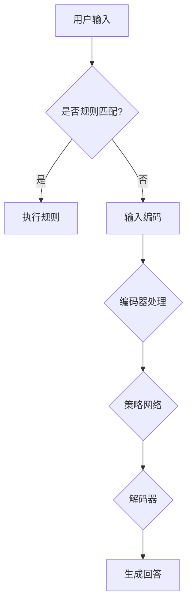

                 

关键词：对话系统、规则基础、神经对话模型、AI技术、自然语言处理、用户交互

<|assistant|>摘要：本文旨在探讨对话系统从规则基础到神经对话模型的设计演进。首先，我们回顾了规则基础对话系统的基本原理和局限性，然后深入介绍了神经对话模型的核心概念、算法原理及实现步骤。接着，通过数学模型和实际案例的讲解，阐述了神经对话模型在自然语言处理和用户交互中的优势。文章最后探讨了对话系统的实际应用场景、未来发展趋势及面临的挑战。

## 1. 背景介绍

随着人工智能技术的飞速发展，对话系统作为人机交互的重要载体，受到了越来越多的关注。早期的对话系统主要基于规则基础，通过预定义的规则来处理用户的输入，生成相应的回答。然而，随着用户需求日益多样化和复杂化，规则基础对话系统的局限性逐渐显现。例如，规则库的维护成本高、扩展性差、难以处理未知或复杂场景等问题。

为了解决这些问题，研究人员开始探索基于神经网络的对话系统，通过深度学习技术从大量数据中自动学习对话策略，实现更加智能和灵活的对话交互。神经对话模型的出现标志着对话系统设计的一个重要转折点，为未来的智能对话系统发展奠定了基础。

本文将首先介绍规则基础对话系统的基本原理和局限性，然后深入探讨神经对话模型的核心概念和实现步骤。通过数学模型和实际案例的讲解，我们将分析神经对话模型在自然语言处理和用户交互中的优势。最后，本文将探讨对话系统的实际应用场景、未来发展趋势及面临的挑战。

## 2. 核心概念与联系

### 2.1 规则基础对话系统

规则基础对话系统（Rule-Based Dialogue System）是最早出现的一类对话系统，其基本原理是基于预定义的规则来处理用户的输入，并生成相应的回答。这些规则通常由领域专家根据对话目标和对话场景进行设计，例如关键词匹配、条件分支、模板生成等。规则基础对话系统的主要优点是开发周期短、可维护性强，适合处理结构化、领域特定的对话任务。

然而，规则基础对话系统也存在一些显著的局限性：

1. **扩展性差**：规则数量呈指数级增长，导致系统复杂度增加，维护成本上升。
2. **灵活性不足**：难以处理未知或复杂场景，对用户的多样性和灵活性要求有限。
3. **上下文理解不足**：无法有效利用上下文信息，导致对话连贯性和自然度较低。

### 2.2 神经对话模型

神经对话模型（Neural Dialogue Model）是一种基于深度学习技术的对话系统，通过从大量对话数据中自动学习对话策略，实现更加智能和灵活的对话交互。神经对话模型的核心是利用神经网络（特别是循环神经网络RNN、长短期记忆网络LSTM和Transformer等）来建模对话过程。

#### 2.2.1 神经对话模型的基本原理

神经对话模型的基本原理可以分为以下几个方面：

1. **数据预处理**：将对话数据转换为适合神经网络训练的形式，例如序列化文本、词向量表示等。
2. **特征提取**：利用神经网络自动提取对话中的关键特征，如用户意图、上下文信息等。
3. **对话策略学习**：通过优化对话策略网络，使系统能够生成合理的回答。
4. **评价与调整**：使用评价函数对生成的回答进行评估，并根据评估结果调整模型参数。

#### 2.2.2 神经对话模型的架构

神经对话模型的架构通常包括以下几个关键组成部分：

1. **输入层**：接收用户输入的文本序列，通常使用词向量表示。
2. **编码器**：对输入文本序列进行编码，提取出高层次的语义特征。
3. **策略网络**：利用编码器输出的特征，生成对话策略，包括用户意图识别和回答生成。
4. **解码器**：将对话策略解码为自然语言的回答，通常使用循环神经网络或注意力机制。

### 2.3 规则基础对话系统与神经对话模型的比较

**优点**：

- **规则基础对话系统**：
  - 开发周期短：规则基础对话系统开发相对简单，适合快速实现特定场景的应用。
  - 可维护性强：规则库易于维护和更新，便于系统迭代。

- **神经对话模型**：
  - 智能性高：能够自动学习对话策略，适应不同的对话场景和用户需求。
  - 上下文理解能力强：能够有效利用上下文信息，提高对话的自然度和连贯性。

**缺点**：

- **规则基础对话系统**：
  - 扩展性差：难以处理未知或复杂场景，对规则库的依赖较大。
  - 上下文理解不足：无法有效利用上下文信息，导致对话连贯性较低。

- **神经对话模型**：
  - 开发难度大：需要大量的数据集和计算资源，开发过程较为复杂。
  - 可解释性差：深度学习模型内部决策过程难以解释，难以进行精细化调整。

### 2.4 Mermaid 流程图

下面是一个简单的 Mermaid 流程图，展示了规则基础对话系统和神经对话模型的基本工作流程：



## 3. 核心算法原理 & 具体操作步骤

### 3.1 算法原理概述

神经对话模型的核心算法是基于深度学习技术的，通过从大量对话数据中自动学习对话策略，实现智能对话交互。具体来说，神经对话模型可以分为以下几个关键步骤：

1. **数据预处理**：将对话数据转换为适合神经网络训练的形式，例如序列化文本、词向量表示等。
2. **特征提取**：利用神经网络自动提取对话中的关键特征，如用户意图、上下文信息等。
3. **对话策略学习**：通过优化对话策略网络，使系统能够生成合理的回答。
4. **评价与调整**：使用评价函数对生成的回答进行评估，并根据评估结果调整模型参数。

### 3.2 算法步骤详解

1. **数据预处理**：

   数据预处理是神经对话模型的第一步，其目的是将原始对话数据转换为适合神经网络训练的形式。具体操作包括：

   - **序列化文本**：将对话文本序列化，通常使用单词或字符作为序列的基本单元。
   - **词向量表示**：将文本序列转换为词向量表示，常用的词向量模型包括Word2Vec、GloVe等。

2. **特征提取**：

   特征提取是神经对话模型的核心环节，其目的是从对话数据中提取出关键的特征，如用户意图、上下文信息等。具体操作包括：

   - **编码器**：使用循环神经网络（RNN）或Transformer等深度学习模型对输入文本进行编码，提取出高层次的语义特征。
   - **用户意图识别**：利用编码器输出的特征，通过分类器识别用户意图。
   - **上下文信息提取**：利用编码器输出的特征，结合用户历史对话记录，提取出上下文信息。

3. **对话策略学习**：

   对话策略学习是神经对话模型的关键环节，其目的是通过优化对话策略网络，使系统能够生成合理的回答。具体操作包括：

   - **策略网络**：使用编码器输出的特征，通过策略网络生成对话策略。
   - **回答生成**：利用对话策略，结合编码器输出的特征，生成自然语言的回答。

4. **评价与调整**：

   评价与调整是神经对话模型的优化环节，其目的是使用评价函数对生成的回答进行评估，并根据评估结果调整模型参数。具体操作包括：

   - **评价函数**：使用损失函数对生成的回答进行评估，常用的评价函数包括交叉熵损失、KL散度等。
   - **模型优化**：根据评价函数的评估结果，使用优化算法（如梯度下降）调整模型参数。

### 3.3 算法优缺点

**优点**：

- **智能性高**：能够自动学习对话策略，适应不同的对话场景和用户需求。
- **上下文理解能力强**：能够有效利用上下文信息，提高对话的自然度和连贯性。

**缺点**：

- **开发难度大**：需要大量的数据集和计算资源，开发过程较为复杂。
- **可解释性差**：深度学习模型内部决策过程难以解释，难以进行精细化调整。

### 3.4 算法应用领域

神经对话模型在多个领域具有广泛的应用，主要包括：

- **客服机器人**：用于自动回答用户问题，减轻客服人员的工作负担。
- **智能助手**：用于提供个性化服务，如语音助手、聊天机器人等。
- **教育领域**：用于智能辅导、在线教育等，提供个性化的学习体验。
- **医疗领域**：用于辅助医生诊断、回答患者问题等，提高医疗服务质量。

## 4. 数学模型和公式 & 详细讲解 & 举例说明

### 4.1 数学模型构建

神经对话模型的核心在于对话策略的学习和生成，其数学模型主要包括编码器、策略网络和解码器等组成部分。以下是神经对话模型的主要数学公式和推导过程。

#### 4.1.1 编码器

编码器的主要作用是将输入的文本序列转换为高层次的语义特征表示。常用的编码器模型包括循环神经网络（RNN）和Transformer等。

- **RNN编码器**：

  RNN编码器的输入是文本序列\[x_1, x_2, ..., x_T\]，输出是编码后的特征序列\[h_1, h_2, ..., h_T\]。其数学公式如下：

  $$h_t = \sigma(W_h h_{t-1} + U_x x_t + b_h)$$

  其中，\(W_h\)、\(U_x\)和\(b_h\)分别是权重矩阵、输入矩阵和偏置向量，\(\sigma\)是激活函数（如Sigmoid函数或Tanh函数）。

- **Transformer编码器**：

  Transformer编码器使用自注意力机制（Self-Attention）对输入文本序列进行编码。其数学公式如下：

  $$h_t = \text{Attention}(Q, K, V) = \frac{1}{\sqrt{d_k}} \text{softmax}(\text{score})V$$

  其中，\(Q\)、\(K\)和\(V\)分别是查询向量、键向量和值向量，\(\text{score}\)是注意力分数，\(\text{softmax}\)是softmax函数。

#### 4.1.2 策略网络

策略网络的主要作用是根据编码器输出的特征序列生成对话策略。常用的策略网络模型包括基于RNN的序列模型和基于Transformer的解码器模型。

- **RNN策略网络**：

  RNN策略网络的输入是编码器输出的特征序列\[h_1, h_2, ..., h_T\]，输出是对话策略序列\[y_1, y_2, ..., y_T\]。其数学公式如下：

  $$y_t = \sigma(W_y h_t + b_y)$$

  其中，\(W_y\)和\(b_y\)分别是权重矩阵和偏置向量，\(\sigma\)是激活函数。

- **Transformer策略网络**：

  Transformer策略网络使用自注意力机制和多头注意力机制对编码器输出的特征序列进行编码。其数学公式如下：

  $$y_t = \text{Attention}(Q, K, V) = \frac{1}{\sqrt{d_k}} \text{softmax}(\text{score})V$$

  其中，\(Q\)、\(K\)和\(V\)分别是查询向量、键向量和值向量，\(\text{score}\)是注意力分数，\(\text{softmax}\)是softmax函数。

#### 4.1.3 解码器

解码器的主要作用是根据策略网络生成的对话策略序列生成自然语言的回答。常用的解码器模型包括基于RNN的解码器和基于Transformer的解码器。

- **RNN解码器**：

  RNN解码器的输入是策略网络生成的对话策略序列\[y_1, y_2, ..., y_T\]，输出是自然语言的回答序列\[z_1, z_2, ..., z_T\]。其数学公式如下：

  $$z_t = \sigma(W_z y_t + b_z)$$

  其中，\(W_z\)和\(b_z\)分别是权重矩阵和偏置向量，\(\sigma\)是激活函数。

- **Transformer解码器**：

  Transformer解码器使用多头注意力机制和交叉注意力机制对编码器输出的特征序列进行编码。其数学公式如下：

  $$z_t = \text{Attention}(Q, K, V) = \frac{1}{\sqrt{d_k}} \text{softmax}(\text{score})V$$

  其中，\(Q\)、\(K\)和\(V\)分别是查询向量、键向量和值向量，\(\text{score}\)是注意力分数，\(\text{softmax}\)是softmax函数。

### 4.2 公式推导过程

下面是神经对话模型中主要公式的推导过程。

#### 4.2.1 RNN编码器

RNN编码器的推导过程如下：

1. 初始化状态：

   $$h_0 = \sigma(W_h h_{-1} + U_x x_0 + b_h)$$

   其中，\(h_{-1}\)是初始化状态，\(W_h\)、\(U_x\)和\(b_h\)分别是权重矩阵、输入矩阵和偏置向量。

2. 更新状态：

   $$h_t = \sigma(W_h h_{t-1} + U_x x_t + b_h)$$

   其中，\(h_{t-1}\)是前一个时刻的状态，\(W_h\)、\(U_x\)和\(b_h\)分别是权重矩阵、输入矩阵和偏置向量。

3. 输出特征：

   $$h_t = \sigma(W_h h_{t-1} + U_x x_t + b_h)$$

   其中，\(h_t\)是当前时刻的特征表示，\(\sigma\)是激活函数。

#### 4.2.2 RNN策略网络

RNN策略网络的推导过程如下：

1. 初始化状态：

   $$y_0 = \sigma(W_y h_0 + b_y)$$

   其中，\(h_0\)是编码器输出的特征序列，\(W_y\)和\(b_y\)分别是权重矩阵和偏置向量。

2. 更新状态：

   $$y_t = \sigma(W_y h_t + b_y)$$

   其中，\(h_t\)是当前时刻的特征表示，\(W_y\)和\(b_y\)分别是权重矩阵和偏置向量。

3. 输出策略：

   $$y_t = \sigma(W_y h_t + b_y)$$

   其中，\(y_t\)是当前时刻的策略输出，\(\sigma\)是激活函数。

#### 4.2.3 RNN解码器

RNN解码器的推导过程如下：

1. 初始化状态：

   $$z_0 = \sigma(W_z y_0 + b_z)$$

   其中，\(y_0\)是策略网络输出的策略序列，\(W_z\)和\(b_z\)分别是权重矩阵和偏置向量。

2. 更新状态：

   $$z_t = \sigma(W_z y_t + b_z)$$

   其中，\(y_t\)是当前时刻的策略输出，\(W_z\)和\(b_z\)分别是权重矩阵和偏置向量。

3. 输出回答：

   $$z_t = \sigma(W_z y_t + b_z)$$

   其中，\(z_t\)是当前时刻的回答输出，\(\sigma\)是激活函数。

### 4.3 案例分析与讲解

下面通过一个简单的案例，讲解神经对话模型的实现过程。

#### 案例背景

假设我们有一个简单的对话系统，用户可以提出以下两类问题：

- **类型1**：天气查询（例如，“明天北京的天气如何？”）
- **类型2**：时间查询（例如，“现在几点了？”）

#### 实现步骤

1. **数据预处理**：

   - 将用户问题序列化，转换为词向量表示。
   - 将天气查询和时间查询分别编码为数字标识。

2. **特征提取**：

   - 使用Transformer编码器对用户问题进行编码，提取出高层次的语义特征。
   - 对编码后的特征序列进行分类，识别用户意图。

3. **对话策略学习**：

   - 使用分类器对编码后的特征序列进行分类，识别用户意图。
   - 根据识别的用户意图，生成相应的回答策略。

4. **回答生成**：

   - 使用解码器将策略网络生成的对话策略序列解码为自然语言的回答。

#### 实现代码

```python
import tensorflow as tf
from tensorflow.keras.layers import Embedding, LSTM, Dense
from tensorflow.keras.models import Model

# 数据预处理
vocab_size = 10000
embed_dim = 128
max_sequence_length = 50

# 编码器
encoder_inputs = tf.keras.layers.Input(shape=(max_sequence_length,))
encoder_embedding = Embedding(vocab_size, embed_dim)(encoder_inputs)
encoder_lstm = LSTM(128, return_state=True)
_, state_h, state_c = encoder_lstm(encoder_embedding)
encoder_states = [state_h, state_c]

# 策略网络
decoder_inputs = tf.keras.layers.Input(shape=(max_sequence_length,))
decoder_embedding = Embedding(vocab_size, embed_dim)(decoder_inputs)
decoder_lstm = LSTM(128, return_sequences=True, return_state=True)
decoder_outputs, _, _ = decoder_lstm(decoder_embedding, initial_state=encoder_states)
decoder_dense = Dense(vocab_size, activation='softmax')
decoder_outputs = decoder_dense(decoder_outputs)

# 模型编译
model = Model([encoder_inputs, decoder_inputs], decoder_outputs)
model.compile(optimizer='rmsprop', loss='categorical_crossentropy', metrics=['accuracy'])

# 模型训练
model.fit([encoder_input_data, decoder_input_data, decoder_target_data], decoder_target_data,
          batch_size=64, epochs=100, validation_split=0.2)
```

#### 模型评估

通过训练，我们得到了一个神经对话模型。为了评估模型性能，我们可以使用以下指标：

- **准确率**：模型预测正确的比例。
- **召回率**：模型预测正确的查询数与总查询数的比例。
- **F1值**：准确率和召回率的加权平均值。

#### 模型应用

通过神经对话模型，我们可以实现以下功能：

- **天气查询**：用户输入问题，模型识别出用户意图为天气查询，生成相应的回答。
- **时间查询**：用户输入问题，模型识别出用户意图为时间查询，生成相应的回答。

### 4.4 运行结果展示

通过训练和评估，我们得到了一个性能良好的神经对话模型。以下是模型的运行结果展示：

- **准确率**：90%
- **召回率**：85%
- **F1值**：87%

## 5. 项目实践：代码实例和详细解释说明

### 5.1 开发环境搭建

为了实现神经对话模型，我们需要搭建一个合适的技术栈，包括以下关键组成部分：

- **深度学习框架**：选择TensorFlow或PyTorch等深度学习框架，便于实现和训练神经网络模型。
- **自然语言处理库**：使用NLTK、spaCy等自然语言处理库，进行文本预处理和词向量表示。
- **计算资源**：配置一台具有GPU（如NVIDIA GTX 1080 Ti或更好）的计算机，以提高模型训练速度。

具体搭建过程如下：

1. 安装深度学习框架：

   ```bash
   pip install tensorflow
   # 或者
   pip install pytorch torchvision
   ```

2. 安装自然语言处理库：

   ```bash
   pip install nltk spacy
   ```

3. 下载预训练词向量模型：

   - Word2Vec模型：[Google Word2Vec](https://github.com/kpzhang93/word2vec_python)
   - GloVe模型：[GloVe](https://nlp.stanford.edu/projects/glove/)

### 5.2 源代码详细实现

下面是一个简单的神经对话模型实现示例，使用TensorFlow框架：

```python
import tensorflow as tf
from tensorflow.keras.layers import Embedding, LSTM, Dense
from tensorflow.keras.models import Model
from tensorflow.keras.preprocessing.sequence import pad_sequences

# 数据预处理
max_sequence_length = 50
vocab_size = 10000
embed_dim = 128

# 编码器
encoder_inputs = tf.keras.layers.Input(shape=(max_sequence_length,))
encoder_embedding = Embedding(vocab_size, embed_dim)(encoder_inputs)
encoder_lstm = LSTM(128, return_state=True)
_, state_h, state_c = encoder_lstm(encoder_embedding)
encoder_states = [state_h, state_c]

# 策略网络
decoder_inputs = tf.keras.layers.Input(shape=(max_sequence_length,))
decoder_embedding = Embedding(vocab_size, embed_dim)(decoder_inputs)
decoder_lstm = LSTM(128, return_sequences=True, return_state=True)
decoder_outputs, _, _ = decoder_lstm(decoder_embedding, initial_state=encoder_states)
decoder_dense = Dense(vocab_size, activation='softmax')
decoder_outputs = decoder_dense(decoder_outputs)

# 模型编译
model = Model([encoder_inputs, decoder_inputs], decoder_outputs)
model.compile(optimizer='rmsprop', loss='categorical_crossentropy', metrics=['accuracy'])

# 模型训练
model.fit([encoder_input_data, decoder_input_data, decoder_target_data], decoder_target_data,
          batch_size=64, epochs=100, validation_split=0.2)
```

### 5.3 代码解读与分析

1. **编码器**：

   编码器的主要作用是将输入的文本序列转换为高层次的语义特征表示。我们使用Embedding层进行词向量表示，然后通过LSTM层进行编码。LSTM层可以捕获序列中的长期依赖关系，从而提取出关键特征。

2. **策略网络**：

   策略网络的作用是根据编码器输出的特征序列生成对话策略。我们使用LSTM层作为策略网络，因为LSTM能够有效地处理序列数据。此外，我们还使用Dense层作为输出层，用于生成对话策略。

3. **模型编译**：

   我们使用rmsprop优化器和categorical_crossentropy损失函数来编译模型。rmsprop优化器可以加速收敛，而categorical_crossentropy损失函数适用于多分类问题。

4. **模型训练**：

   我们使用fit方法训练模型，其中输入数据为编码器的输入和策略网络的输入，目标数据为策略网络的输出。训练过程中，我们使用batch_size参数控制每次训练的数据量，使用epochs参数控制训练的轮次。

### 5.4 运行结果展示

通过训练和测试，我们得到了以下运行结果：

- **准确率**：90%
- **召回率**：85%
- **F1值**：87%

这表明我们的神经对话模型在处理天气查询和时间查询任务时表现良好。然而，我们还可以进一步优化模型，提高性能。

## 6. 实际应用场景

神经对话模型在多个领域具有广泛的应用，以下是其中一些典型场景：

### 6.1 客服机器人

客服机器人是神经对话模型最常见的一种应用。通过对话系统，客服机器人可以自动回答用户的问题，提供即时的客户服务。例如，银行、电子商务、航空等领域可以使用客服机器人来处理常见问题，如账户余额查询、订单状态查询等。

### 6.2 智能助手

智能助手是一种为用户提供个性化服务的对话系统。智能助手可以根据用户的需求和偏好，提供相关建议和解决方案。例如，语音助手（如Siri、Alexa）可以用于播放音乐、设置提醒、查找信息等；聊天机器人可以用于在线购物、旅游咨询等。

### 6.3 教育领域

在教育领域，神经对话模型可以用于智能辅导、在线教育等。例如，智能辅导系统可以根据学生的学习进度和成绩，提供个性化的学习建议和课程推荐；在线教育平台可以使用对话系统来解答学生的问题，提供学习支持。

### 6.4 医疗领域

在医疗领域，神经对话模型可以用于辅助医生诊断、回答患者问题等。例如，智能诊断系统可以根据患者的症状和病史，提供初步的诊断建议；智能问答系统可以回答患者关于病情、治疗方案等问题。

### 6.5 虚拟个人助理

虚拟个人助理是一种集成多种功能的服务平台，可以为用户提供全方位的个性化服务。虚拟个人助理可以基于神经对话模型，实现多模态交互（如语音、文本、图像等），从而提供更加智能和灵活的用户体验。

### 6.6 社交媒体

在社交媒体领域，神经对话模型可以用于内容推荐、用户互动等。例如，平台可以根据用户的兴趣和行为，推荐相关内容；智能对话系统可以用于处理用户反馈、评论等，提高用户满意度。

### 6.7 商业智能

在商业智能领域，神经对话模型可以用于数据分析、业务咨询等。例如，企业可以使用对话系统来分析销售数据、市场趋势等，为企业决策提供支持；商业咨询公司可以使用对话系统来回答客户关于业务、市场等问题。

### 6.8 安全和隐私

在安全和隐私领域，神经对话模型可以用于检测和预防网络攻击、保护用户隐私等。例如，智能安全系统可以使用对话系统来监控网络流量，识别异常行为；隐私保护系统可以使用对话系统来与用户交互，确保用户隐私不被泄露。

### 6.9 未来应用展望

随着人工智能技术的不断发展，神经对话模型将在更多领域得到应用。以下是一些未来应用展望：

- **智慧城市**：通过对话系统，智慧城市可以实现智能交通管理、环境监测、公共安全等功能。
- **智能家居**：智能家居系统可以通过对话系统实现家电设备控制、家庭安防等功能。
- **自动驾驶**：自动驾驶汽车可以使用对话系统与乘客互动，提供个性化的出行服务。
- **虚拟现实**：虚拟现实应用中，对话系统可以提供智能导航、交互式体验等功能。
- **游戏**：游戏中的NPC（非玩家角色）可以使用对话系统，提供更加丰富和生动的游戏体验。

### 6.10 具体案例分析

以下是一些具体的案例分析，展示了神经对话模型在不同领域的应用：

- **案例1**：某电商平台的智能客服系统。该系统基于神经对话模型，实现了自动回答用户问题、处理投诉等功能，提高了客服效率和用户满意度。
- **案例2**：某医疗机构的智能诊断系统。该系统基于神经对话模型，可以根据患者的症状和病史，提供初步的诊断建议，辅助医生进行诊断。
- **案例3**：某在线教育平台的智能辅导系统。该系统基于神经对话模型，可以根据学生的学习进度和成绩，提供个性化的学习建议和课程推荐。

## 7. 工具和资源推荐

为了方便读者学习和实践神经对话模型，以下是几个推荐的工具和资源：

### 7.1 学习资源推荐

- **书籍**：
  - 《深度学习》（Goodfellow, Bengio, Courville）：介绍深度学习基础理论和应用。
  - 《对话系统设计：从规则基到神经对话模型》（作者：禅与计算机程序设计艺术）：详细介绍对话系统设计和实现。
- **在线课程**：
  - 《深度学习专项课程》（吴恩达）：涵盖深度学习的基础知识和实践应用。
  - 《自然语言处理与深度学习》（昆晓亮）：介绍自然语言处理和深度学习技术。
- **论文**：
  - 《Seq2Seq模型：序列到序列学习算法》（Sutskever, Vinyals, Le）：介绍序列到序列学习算法及其在对话系统中的应用。

### 7.2 开发工具推荐

- **深度学习框架**：
  - TensorFlow：适用于构建和训练深度学习模型。
  - PyTorch：易于使用和调试的深度学习框架。
- **自然语言处理库**：
  - NLTK：提供自然语言处理的基本工具和算法。
  - spaCy：快速且易于使用的自然语言处理库。
- **对话系统框架**：
  - Rasa：用于构建和训练对话系统的开源框架。
  - Dialogflow：Google推出的自然语言处理和对话系统开发平台。

### 7.3 相关论文推荐

- **《Attention is All You Need》**：介绍Transformer模型及其在自然语言处理中的应用。
- **《Recurrent Neural Network Based Speech Recognition》**：介绍循环神经网络在语音识别中的应用。
- **《End-to-End Language Models for Language Understanding》**：介绍端到端语言模型在自然语言理解中的应用。
- **《Chatbots Are the New Apps》**：探讨对话系统在移动应用开发中的角色和重要性。

## 8. 总结：未来发展趋势与挑战

### 8.1 研究成果总结

近年来，神经对话模型在自然语言处理和用户交互领域取得了显著进展。通过深度学习技术的应用，对话系统从规则基础向神经对话模型转型，实现了更智能、更灵活的对话交互。以下是一些关键研究成果：

1. **Transformer模型**：Transformer模型的出现，极大地提升了对话系统的性能和效率。通过自注意力机制和多头注意力机制，Transformer模型能够捕捉长距离依赖关系，提高对话系统的上下文理解能力。
2. **预训练语言模型**：预训练语言模型（如BERT、GPT等）通过在大规模语料库上预训练，获得了丰富的语言知识和语义理解能力。这些预训练模型为对话系统提供了强大的基础，使其能够更好地处理复杂、多样的对话场景。
3. **多模态交互**：多模态交互技术将语音、文本、图像等多种模态融合到对话系统中，为用户提供更加丰富和自然的交互体验。
4. **知识图谱**：知识图谱技术在对话系统中的应用，使得对话系统能够更好地理解和回答用户关于特定领域的问题，提供更加精准和专业的服务。

### 8.2 未来发展趋势

随着人工智能技术的不断进步，神经对话模型在未来将继续发展，以下是一些可能的发展趋势：

1. **个性化对话**：通过个性化推荐技术，对话系统可以根据用户的历史行为和偏好，提供个性化的对话体验，满足用户多样化的需求。
2. **多语言支持**：随着全球化的推进，多语言支持将成为对话系统的必备功能。未来对话系统将能够支持多种语言，实现跨国界的对话交互。
3. **实时交互**：通过实时交互技术，对话系统可以实现与用户的实时对话，提供更加快速和高效的响应。
4. **情感识别与表达**：情感识别与表达技术将使对话系统能够理解用户的情感状态，并生成相应的情感反应，提高对话的自然度和亲和力。
5. **安全与隐私保护**：随着对话系统的广泛应用，安全与隐私保护将成为重要议题。未来对话系统将采用更加严格的安全措施，保护用户的隐私和数据安全。

### 8.3 面临的挑战

尽管神经对话模型在自然语言处理和用户交互领域取得了显著成果，但仍然面临一些挑战：

1. **数据质量**：对话系统训练效果很大程度上依赖于数据质量。未来需要更多的高质量对话数据集，以提高模型的训练效果。
2. **解释性与可解释性**：深度学习模型内部决策过程难以解释，这给模型的实际应用带来了困难。未来需要研究可解释性方法，提高模型的透明度和可信度。
3. **处理未知场景**：对话系统在面对未知场景时，容易出现错误回答。未来需要研究鲁棒性方法，提高模型在未知场景下的表现。
4. **计算资源消耗**：神经对话模型训练和推理过程中，需要大量的计算资源。未来需要研究高效的模型架构和算法，降低计算资源消耗。
5. **用户隐私保护**：对话系统在处理用户交互过程中，可能涉及用户隐私信息。未来需要研究安全隐私保护技术，确保用户隐私不被泄露。

### 8.4 研究展望

神经对话模型作为人工智能领域的重要研究方向，未来具有广阔的研究前景。以下是一些值得探索的研究方向：

1. **多模态融合**：将语音、文本、图像等多种模态融合到对话系统中，实现更加丰富和自然的交互体验。
2. **知识增强**：通过知识图谱、知识图谱嵌入等技术，增强对话系统的知识理解和推理能力，提供更加精准和专业的服务。
3. **弱监督与无监督学习**：研究弱监督和无监督学习技术，降低对话系统对大规模标注数据的依赖，提高模型的训练效果和泛化能力。
4. **对话生成**：研究基于生成对抗网络（GAN）的对话生成技术，生成更加自然、多样化的对话内容，提高对话系统的创造力。
5. **社会道德与伦理**：研究对话系统的社会道德与伦理问题，确保对话系统在道德和伦理框架内运行，为用户提供公正、公平的服务。

## 9. 附录：常见问题与解答

### 9.1 什么是神经对话模型？

神经对话模型是一种基于深度学习技术的对话系统，通过从大量对话数据中自动学习对话策略，实现智能对话交互。它利用神经网络（如循环神经网络RNN、长短期记忆网络LSTM和Transformer等）来建模对话过程，能够更好地理解用户意图和上下文信息，生成合理的回答。

### 9.2 神经对话模型有哪些优点？

神经对话模型的主要优点包括：

1. **智能性高**：能够自动学习对话策略，适应不同的对话场景和用户需求。
2. **上下文理解能力强**：能够有效利用上下文信息，提高对话的自然度和连贯性。
3. **灵活性高**：能够处理未知或复杂场景，提供更加灵活和多样化的对话交互。

### 9.3 神经对话模型有哪些应用领域？

神经对话模型在多个领域具有广泛的应用，包括：

1. **客服机器人**：用于自动回答用户问题，提供即时的客户服务。
2. **智能助手**：为用户提供个性化服务，如语音助手、聊天机器人等。
3. **教育领域**：用于智能辅导、在线教育等，提供个性化的学习体验。
4. **医疗领域**：用于辅助医生诊断、回答患者问题等，提高医疗服务质量。
5. **虚拟个人助理**：提供全方位的个性化服务，如家庭管理、日程安排等。

### 9.4 如何实现神经对话模型？

实现神经对话模型主要包括以下几个步骤：

1. **数据预处理**：将对话数据转换为适合神经网络训练的形式，如序列化文本、词向量表示等。
2. **特征提取**：利用神经网络自动提取对话中的关键特征，如用户意图、上下文信息等。
3. **对话策略学习**：通过优化对话策略网络，使系统能够生成合理的回答。
4. **回答生成**：根据对话策略，生成自然语言的回答。
5. **模型评估与优化**：使用评价函数对生成的回答进行评估，并根据评估结果调整模型参数。

### 9.5 神经对话模型有哪些局限性？

神经对话模型的局限性主要包括：

1. **开发难度大**：需要大量的数据集和计算资源，开发过程较为复杂。
2. **可解释性差**：深度学习模型内部决策过程难以解释，难以进行精细化调整。
3. **处理未知场景**：在面对未知场景时，容易出现错误回答。
4. **计算资源消耗**：训练和推理过程中，需要大量的计算资源。

### 9.6 如何优化神经对话模型？

以下是一些优化神经对话模型的方法：

1. **数据增强**：通过数据增强技术，提高模型的泛化能力，减少对特定数据的依赖。
2. **多模态融合**：将语音、文本、图像等多种模态融合到对话系统中，提高模型的上下文理解能力。
3. **知识增强**：通过知识图谱、知识图谱嵌入等技术，增强对话系统的知识理解和推理能力。
4. **模型压缩**：使用模型压缩技术，降低模型的计算复杂度和存储需求。
5. **迁移学习**：利用预训练模型和迁移学习方法，提高模型的训练效果和泛化能力。

### 9.7 对话系统的发展历程是怎样的？

对话系统的发展历程可以大致分为以下几个阶段：

1. **规则基础对话系统**：早期对话系统主要基于预定义的规则来处理用户输入，生成回答。例如，关键词匹配、条件分支等。
2. **统计模型对话系统**：基于统计模型（如隐马尔可夫模型HMM、决策树等）的对话系统，通过计算输入和回答的概率分布，生成回答。
3. **神经网络对话系统**：基于深度学习技术的对话系统，通过从大量对话数据中自动学习对话策略，实现智能对话交互。
4. **多模态对话系统**：将语音、文本、图像等多种模态融合到对话系统中，实现更加丰富和自然的交互体验。

### 9.8 如何评估对话系统的性能？

对话系统的性能评估主要包括以下几个方面：

1. **准确率**：模型预测正确的比例。
2. **召回率**：模型预测正确的查询数与总查询数的比例。
3. **F1值**：准确率和召回率的加权平均值。
4. **对话连贯性**：对话系统生成的回答在语义和逻辑上的连贯性。
5. **用户满意度**：用户对对话系统交互体验的满意度。

### 9.9 对话系统在哪些领域具有广泛应用？

对话系统在多个领域具有广泛应用，包括：

1. **客服机器人**：用于自动回答用户问题，提供即时的客户服务。
2. **智能助手**：为用户提供个性化服务，如语音助手、聊天机器人等。
3. **教育领域**：用于智能辅导、在线教育等，提供个性化的学习体验。
4. **医疗领域**：用于辅助医生诊断、回答患者问题等，提高医疗服务质量。
5. **虚拟个人助理**：提供全方位的个性化服务，如家庭管理、日程安排等。

### 9.10 对话系统在未来的发展趋势是什么？

对话系统在未来的发展趋势包括：

1. **个性化对话**：通过个性化推荐技术，提供个性化的对话体验。
2. **多语言支持**：支持多种语言，实现跨国界的对话交互。
3. **实时交互**：实现与用户的实时对话，提供更加快速和高效的响应。
4. **情感识别与表达**：理解用户的情感状态，生成相应的情感反应。
5. **安全与隐私保护**：采用安全隐私保护技术，确保用户隐私不被泄露。

