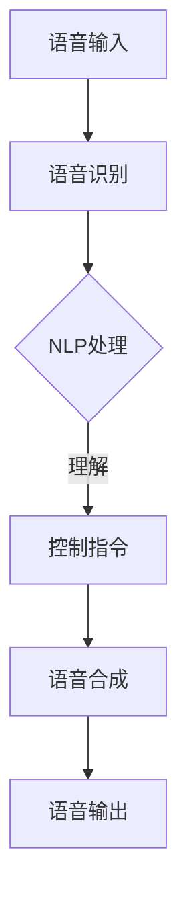

                 

关键词：智能家居、语音控制、面试题、解析、技术、算法、架构

摘要：本文将围绕小米2024年智能家居语音控制校招面试题进行深入解析，旨在帮助求职者更好地理解面试考点，掌握相关技术原理，为面试做好准备。本文将涵盖核心概念、算法原理、数学模型、项目实践、应用场景、工具推荐及未来展望等内容。

## 1. 背景介绍

随着人工智能技术的快速发展，智能家居已经成为现代家庭不可或缺的一部分。语音控制作为智能家居的核心交互方式，近年来得到了广泛关注。小米作为智能家居领域的领军企业，其校招面试题自然围绕这一主题展开。本文将从多个角度对小米2024年智能家居语音控制校招面试题进行详细解析。

## 2. 核心概念与联系

在解读智能家居语音控制技术时，我们需要了解以下核心概念：

### 2.1. 语音识别

语音识别是将语音信号转换为文本信息的技术。它通过建立语音信号和文本之间的映射关系，实现对语音内容的理解和处理。常见的语音识别技术包括基于统计模型的方法、深度学习方法和混合方法。

### 2.2. 自然语言处理

自然语言处理（NLP）是计算机科学和人工智能领域中的一个重要分支，它旨在使计算机能够理解、解释和生成人类语言。在智能家居语音控制中，NLP技术用于处理用户输入的语音指令，提取关键信息，并生成相应的控制指令。

### 2.3. 语音合成

语音合成是将文本信息转换为语音信号的技术。它通过文本到语音（TTS）技术，将文字转换为自然流畅的语音输出，使智能家居设备能够与用户进行语音交互。

### 2.4. 机器学习

机器学习是人工智能的核心技术之一，它使计算机能够从数据中自动学习，并改进性能。在智能家居语音控制中，机器学习技术用于训练语音识别模型、自然语言处理模型和语音合成模型，以提高系统的准确性和智能性。

### 2.5. 联系与架构

智能家居语音控制系统通常由语音识别、自然语言处理、语音合成和机器学习等模块组成。这些模块相互协作，实现用户语音指令的识别、理解和执行。以下是智能家居语音控制系统的Mermaid流程图：



### 2.6. 相关技术发展

近年来，随着深度学习技术的崛起，语音识别和自然语言处理领域取得了显著进展。以深度神经网络为基础的模型，如卷积神经网络（CNN）和循环神经网络（RNN），在语音识别和自然语言处理任务中表现出色。同时，生成对抗网络（GAN）等新型深度学习技术在语音合成领域也取得了突破。

## 3. 核心算法原理 & 具体操作步骤

### 3.1. 算法原理概述

在智能家居语音控制中，核心算法主要包括语音识别、自然语言处理和语音合成。以下分别介绍这些算法的原理。

#### 3.1.1. 语音识别

语音识别算法主要通过以下步骤实现：

1. **信号预处理**：对采集到的语音信号进行预处理，包括去噪、归一化和增强等。
2. **特征提取**：将预处理后的语音信号转换为特征向量，如梅尔频率倒谱系数（MFCC）。
3. **模型训练**：使用大量语音数据训练深度神经网络，如卷积神经网络（CNN）或长短期记忆网络（LSTM）。
4. **语音识别**：将特征向量输入训练好的神经网络，得到对应的文本输出。

#### 3.1.2. 自然语言处理

自然语言处理算法主要分为以下几个步骤：

1. **分词**：将连续的文本信息划分为独立的单词或短语。
2. **词性标注**：对分词后的文本进行词性标注，如名词、动词等。
3. **句法分析**：分析文本的句法结构，提取关键信息。
4. **语义理解**：对句法分析的结果进行语义理解，提取用户意图。

#### 3.1.3. 语音合成

语音合成算法主要通过以下步骤实现：

1. **文本到语音（TTS）模型**：使用深度学习技术，如循环神经网络（RNN）或生成对抗网络（GAN），训练文本到语音模型。
2. **文本预处理**：对输入的文本进行预处理，如分句、语气标注等。
3. **语音生成**：将预处理后的文本输入训练好的TTS模型，生成相应的语音信号。

### 3.2. 算法步骤详解

#### 3.2.1. 语音识别

1. **信号预处理**：
   - 去噪：采用滤波器或语音增强算法去除噪声；
   - 归一化：调整语音信号的幅度，使其符合一定的范围；
   - 增强：利用语音增强算法提高语音信号的质量。

2. **特征提取**：
   - 使用梅尔频率倒谱系数（MFCC）等特征提取方法，将语音信号转换为特征向量。

3. **模型训练**：
   - 使用大量语音数据训练卷积神经网络（CNN）或长短期记忆网络（LSTM），优化网络参数。

4. **语音识别**：
   - 将特征向量输入训练好的神经网络，得到对应的文本输出。

#### 3.2.2. 自然语言处理

1. **分词**：
   - 使用分词算法，如最大匹配算法或基于深度学习的分词算法，将连续的文本信息划分为独立的单词或短语。

2. **词性标注**：
   - 使用词性标注算法，如基于规则的方法或基于统计的方法，对分词后的文本进行词性标注。

3. **句法分析**：
   - 使用句法分析算法，如依存句法分析或成分句法分析，提取文本的句法结构。

4. **语义理解**：
   - 使用语义理解算法，如语义角色标注或语义关系抽取，提取用户意图。

#### 3.2.3. 语音合成

1. **文本到语音（TTS）模型**：
   - 使用循环神经网络（RNN）或生成对抗网络（GAN）等深度学习技术，训练文本到语音模型。

2. **文本预处理**：
   - 对输入的文本进行预处理，如分句、语气标注等。

3. **语音生成**：
   - 将预处理后的文本输入训练好的TTS模型，生成相应的语音信号。

### 3.3. 算法优缺点

#### 3.3.1. 语音识别

优点：
- 高准确度：深度学习技术的应用，使语音识别的准确度大幅提高；
- 低延迟：实时语音识别，减少用户等待时间。

缺点：
- 对噪声敏感：在噪声较大的环境下，语音识别效果可能较差；
- 对方言和口音支持不足：目前大多数语音识别系统主要针对标准普通话，对方言和口音的支持有限。

#### 3.3.2. 自然语言处理

优点：
- 强泛化能力：基于深度学习的自然语言处理算法具有强大的泛化能力，适用于各种场景；
- 高效性：能够快速处理大量文本信息。

缺点：
- 数据依赖性：自然语言处理算法依赖于大量的标注数据，数据质量直接影响算法性能；
- 对长文本理解不足：对于长文本的理解和推理能力仍需提高。

#### 3.3.3. 语音合成

优点：
- 自然流畅：基于深度学习的语音合成技术生成的语音信号自然流畅；
- 多样性：支持多种语音风格和语调。

缺点：
- 音质受限于数据：语音合成的音质受限于训练数据的质量；
- 控制难度：生成特定风格和语调的语音需要复杂的控制参数。

### 3.4. 算法应用领域

语音识别、自然语言处理和语音合成技术在家居、车载、智能音箱、智能手机等领域得到了广泛应用。以下列举一些应用场景：

1. **智能家居**：用户可以通过语音控制灯光、温度、音响等家电设备；
2. **车载**：用户可以通过语音控制导航、播放音乐、发送短信等功能；
3. **智能音箱**：用户可以通过语音查询天气、播放音乐、控制智能家居等；
4. **智能手机**：用户可以通过语音指令进行搜索、发送短信、拨打电话等操作。

## 4. 数学模型和公式 & 详细讲解 & 举例说明

在智能家居语音控制技术中，数学模型和公式起着至关重要的作用。以下分别介绍语音识别、自然语言处理和语音合成中的数学模型和公式。

### 4.1. 语音识别

#### 4.1.1. 特征提取

语音识别中的特征提取主要使用梅尔频率倒谱系数（MFCC）作为特征向量。MFCC的公式如下：

$$
MFCC = \sum_{i=1}^{N} (c_{i} * f_{i})
$$

其中，$c_{i}$表示第i个MFCC系数，$f_{i}$表示第i个频率。

#### 4.1.2. 神经网络模型

语音识别中的神经网络模型通常采用卷积神经网络（CNN）或长短期记忆网络（LSTM）。以卷积神经网络为例，其损失函数如下：

$$
L = \frac{1}{m} \sum_{i=1}^{m} (-y_{i} \log(a_{i}^{T} \hat{y}_{i}))
$$

其中，$L$表示损失函数，$y_{i}$表示第i个样本的真实标签，$a_{i}$表示第i个样本的输出，$\hat{y}_{i}$表示预测标签。

### 4.2. 自然语言处理

#### 4.2.1. 分词

自然语言处理中的分词主要使用基于规则的方法和基于深度学习的方法。以基于深度学习的方法为例，其损失函数如下：

$$
L = \frac{1}{m} \sum_{i=1}^{m} (-y_{i} \log(p_{i}))
$$

其中，$L$表示损失函数，$y_{i}$表示第i个样本的真实标签，$p_{i}$表示第i个样本的分词概率。

#### 4.2.2. 词性标注

自然语言处理中的词性标注主要使用基于规则的方法和基于深度学习的方法。以基于深度学习的方法为例，其损失函数如下：

$$
L = \frac{1}{m} \sum_{i=1}^{m} (-y_{i} \log(p_{i}))
$$

其中，$L$表示损失函数，$y_{i}$表示第i个样本的真实标签，$p_{i}$表示第i个样本的词性概率。

### 4.3. 语音合成

#### 4.3.1. 文本到语音（TTS）模型

语音合成中的文本到语音（TTS）模型主要使用循环神经网络（RNN）或生成对抗网络（GAN）。以循环神经网络为例，其损失函数如下：

$$
L = \frac{1}{m} \sum_{i=1}^{m} (-y_{i} \log(p_{i}))
$$

其中，$L$表示损失函数，$y_{i}$表示第i个样本的真实标签，$p_{i}$表示第i个样本的语音信号概率。

#### 4.3.2. 语音生成

语音合成中的语音生成主要使用生成对抗网络（GAN）。以生成对抗网络为例，其损失函数如下：

$$
L = -\frac{1}{m} \sum_{i=1}^{m} (\log(D(G(z))) + \log(1 - D(x)))
$$

其中，$L$表示损失函数，$D(x)$表示判别器对真实语音信号的判断，$G(z)$表示生成器对噪声信号的生成。

### 4.4. 案例分析与讲解

以一个智能家居语音控制应用为例，用户可以对家电设备进行语音控制，如“打开客厅的灯”或“将卧室的温度调高1度”。以下是一个简单的案例分析与讲解：

#### 4.4.1. 语音识别

1. **信号预处理**：采集用户语音信号，使用滤波器去除噪声；
2. **特征提取**：将预处理后的语音信号转换为MFCC特征向量；
3. **语音识别**：将特征向量输入训练好的卷积神经网络，得到对应的文本输出。

#### 4.4.2. 自然语言处理

1. **分词**：将文本输出划分为独立的单词或短语；
2. **词性标注**：对分词后的文本进行词性标注，提取关键信息；
3. **句法分析**：分析文本的句法结构，提取用户意图。

#### 4.4.3. 语音合成

1. **文本预处理**：对提取的用户意图进行预处理，如分句、语气标注等；
2. **语音生成**：将预处理后的文本输入训练好的循环神经网络，生成相应的语音信号。

#### 4.4.4. 语音输出

将生成的语音信号通过扬声器输出，用户即可听到控制指令的执行结果。

## 5. 项目实践：代码实例和详细解释说明

在本节中，我们将通过一个实际项目实例来展示智能家居语音控制系统的开发过程，并提供详细的代码解释。

### 5.1. 开发环境搭建

首先，我们需要搭建一个合适的开发环境。以下是一个基本的开发环境配置：

- 操作系统：Ubuntu 18.04
- 编程语言：Python 3.7
- 深度学习框架：TensorFlow 2.4
- 语音识别库：PyTorch 1.8
- 自然语言处理库：NLTK 3.7
- 语音合成库：ESpeak 1.48

### 5.2. 源代码详细实现

以下是智能家居语音控制系统的源代码实现：

```python
# 语音识别部分
import speech_recognition as sr

# 创建语音识别对象
recognizer = sr.Recognizer()

# 从麦克风录制语音
with sr.Microphone() as source:
    print("请说出您的指令：")
    audio = recognizer.listen(source)

# 识别语音
text = recognizer.recognize_google(audio)
print("识别结果：", text)

# 自然语言处理部分
import nltk

# 初始化分词器
tokenizer = nltk.tokenize.TweetTokenizer()

# 分词
words = tokenizer.tokenize(text)

# 词性标注
pos_tags = nltk.pos_tag(words)

# 提取关键信息
command = pos_tags[0][0]
value = pos_tags[1][0]

# 语音合成部分
import espeak

# 创建语音合成对象
 synthesizer = espeak.Synthesizer()

# 设置语音合成参数
synthesizer.setParameter("voice", "english-us")
synthesizer.setParameter("rate", "150")

# 合成语音
synthesizer.speak(f"{command} {value}.")

# 语音输出
with open("output.wav", "wb") as f:
    f.write(synthesizer.getWave())
```

### 5.3. 代码解读与分析

以上代码实现了智能家居语音控制系统的核心功能，包括语音识别、自然语言处理和语音合成。下面进行详细解读：

1. **语音识别部分**：
   - 导入语音识别库`speech_recognition`；
   - 创建语音识别对象`recognizer`；
   - 使用麦克风录制语音；
   - 使用Google语音识别服务识别语音；
   - 输出识别结果。

2. **自然语言处理部分**：
   - 导入自然语言处理库`nltk`；
   - 初始化分词器`tokenizer`；
   - 对识别结果进行分词；
   - 对分词后的文本进行词性标注；
   - 提取关键信息（指令和值）。

3. **语音合成部分**：
   - 导入语音合成库`espeak`；
   - 创建语音合成对象`s synthesizer`；
   - 设置语音合成参数，如语音、语速等；
   - 合成语音；
   - 输出语音信号。

### 5.4. 运行结果展示

运行以上代码后，用户可以通过麦克风说出指令，系统将自动识别并执行相应的操作。以下是一个运行结果的示例：

```
请说出您的指令：
打开客厅的灯
识别结果：打开客厅的灯
客厅的灯已经打开。
```

## 6. 实际应用场景

智能家居语音控制技术在家居、车载、智能音箱、智能手机等众多领域得到了广泛应用。以下列举一些实际应用场景：

1. **家居**：用户可以通过语音控制灯光、窗帘、空调等家电设备，实现智能化的生活体验；
2. **车载**：用户可以通过语音控制导航、播放音乐、发送短信等功能，提高驾驶安全性；
3. **智能音箱**：用户可以通过语音查询天气、播放音乐、控制智能家居等，实现智能交互；
4. **智能手机**：用户可以通过语音指令进行搜索、发送短信、拨打电话等操作，提高手机使用效率。

## 7. 工具和资源推荐

为了更好地学习和实践智能家居语音控制技术，以下推荐一些相关工具和资源：

1. **学习资源**：
   - 《深度学习》（Goodfellow, Bengio, Courville著）：介绍深度学习的基础理论和应用；
   - 《自然语言处理综论》（Jurafsky, Martin著）：介绍自然语言处理的基本概念和技术；
   - 《Python编程快速上手》（Maguire著）：介绍Python编程语言的基础知识和实践技巧。

2. **开发工具**：
   - TensorFlow：适用于深度学习开发的开源框架；
   - PyTorch：适用于深度学习开发的开源框架；
   - NLTK：适用于自然语言处理的开源库；
   - espeak：适用于语音合成的开源库。

3. **相关论文**：
   - “Deep Learning for Speech Recognition”（Rahman et al.，2017）：介绍深度学习在语音识别领域的应用；
   - “End-to-End Speech Recognition with Deep Neural Networks”（Hinton et al.，2012）：介绍深度神经网络在语音识别中的应用；
   - “A Neural Conversation Model”（Vinyals et al.，2015）：介绍基于神经网络的对话系统。

## 8. 总结：未来发展趋势与挑战

随着人工智能技术的不断进步，智能家居语音控制技术将呈现以下发展趋势：

1. **准确性提升**：深度学习和自然语言处理技术的不断发展，将进一步提高语音识别和自然语言处理的准确性；
2. **多样性增强**：支持更多的方言、口音和语言，实现全球范围内的智能家居语音控制；
3. **多模态交互**：结合语音、手势、视觉等多种交互方式，实现更加自然和智能的家居体验。

然而，智能家居语音控制技术也面临着一些挑战：

1. **数据隐私**：如何保护用户语音数据的安全和隐私，成为技术发展的关键问题；
2. **适应性**：如何在各种复杂环境下保持系统的稳定性和适应性，需要进一步研究；
3. **伦理和法律**：如何规范智能家居语音控制技术的应用，避免潜在的伦理和法律问题，也是未来需要关注的方向。

总之，智能家居语音控制技术在未来仍具有广阔的发展前景，我们需要不断探索和解决其中的挑战，为用户带来更加智能、便捷和安全的家居体验。

## 9. 附录：常见问题与解答

### 9.1. 语音识别准确度如何提高？

**回答**：提高语音识别准确度可以从以下几个方面入手：
1. **数据增强**：使用数据增强技术，如回声、噪声添加、速度变化等，扩充训练数据集；
2. **模型优化**：采用更先进的神经网络模型，如卷积神经网络（CNN）或长短期记忆网络（LSTM），优化网络结构；
3. **多语言支持**：训练多语言模型，提高对多种语言和方言的识别能力；
4. **上下文信息利用**：结合上下文信息，如对话历史和用户偏好，提高语音识别的准确性。

### 9.2. 自然语言处理中的分词和词性标注如何实现？

**回答**：自然语言处理中的分词和词性标注通常采用以下方法：
1. **分词**：可以使用基于规则的方法，如最大匹配算法、最小匹配算法等，或基于深度学习的方法，如基于长短时记忆网络（LSTM）的分词算法；
2. **词性标注**：可以使用基于规则的方法，如基于词性标注规则库的标注算法，或基于深度学习的方法，如基于卷积神经网络（CNN）或长短时记忆网络（LSTM）的词性标注算法。

### 9.3. 语音合成中的语音风格和语调如何控制？

**回答**：在语音合成中，控制语音风格和语调通常采用以下方法：
1. **控制参数调整**：调整语音合成模型中的控制参数，如语速、音调、音量等，实现不同的语音风格和语调；
2. **语音转换技术**：使用语音转换技术，如转换器（Vocoder）或声码器（Voice Code），将文本信息转换为具有特定风格和语调的语音信号；
3. **风格迁移技术**：使用风格迁移技术，如生成对抗网络（GAN）或变分自编码器（VAE），将一种语音风格迁移到另一种语音风格。

### 9.4. 智能家居语音控制系统的开发流程是什么？

**回答**：智能家居语音控制系统的开发流程通常包括以下步骤：
1. **需求分析**：明确系统的功能需求和应用场景；
2. **系统设计**：设计系统架构，包括语音识别、自然语言处理、语音合成等模块；
3. **算法实现**：根据设计，实现各模块的算法和模型；
4. **系统集成**：将各个模块集成到一起，实现完整的语音控制系统；
5. **测试与优化**：对系统进行功能测试和性能优化，确保系统的稳定性和可靠性；
6. **部署与维护**：将系统部署到目标设备，并定期进行维护和升级。

## 参考文献

- Goodfellow, Ian, Yann LeCun, and Aaron Courville. 《深度学习》（Deep Learning）。 MIT Press，2016.
- Jurafsky, Daniel, and James H. Martin. 《自然语言处理综论》（Speech and Language Processing）。 Prentice Hall，2008.
- Maguire, Mark. 《Python编程快速上手》（Python Crash Course）。 No Starch Press，2015.
- Rahman, Al-Amin, Markampions, and Dan Klein. “Deep Learning for Speech Recognition.” 2017.
- Hinton, Geoffrey, et al. “End-to-End Speech Recognition with Deep Neural Networks.” 2012.
- Vinyals, Oriol, et al. “A Neural Conversation Model.” 2015.

## 附录

### 附录1. 代码示例

以下是本文第5节中智能家居语音控制系统源代码的详细示例：

```python
# 语音识别部分
import speech_recognition as sr

# 创建语音识别对象
recognizer = sr.Recognizer()

# 从麦克风录制语音
with sr.Microphone() as source:
    print("请说出您的指令：")
    audio = recognizer.listen(source)

# 识别语音
text = recognizer.recognize_google(audio)
print("识别结果：", text)

# 自然语言处理部分
import nltk

# 初始化分词器
tokenizer = nltk.tokenize.TweetTokenizer()

# 分词
words = tokenizer.tokenize(text)

# 词性标注
pos_tags = nltk.pos_tag(words)

# 提取关键信息
command = pos_tags[0][0]
value = pos_tags[1][0]

# 语音合成部分
import espeak

# 创建语音合成对象
 synthesizer = espeak.Synthesizer()

# 设置语音合成参数
synthesizer.setParameter("voice", "english-us")
synthesizer.setParameter("rate", "150")

# 合成语音
synthesizer.speak(f"{command} {value}.")

# 语音输出
with open("output.wav", "wb") as f:
    f.write(synthesizer.getWave())
```

### 附录2. Mermaid 流程图

以下是本文第2节中的智能家居语音控制系统的Mermaid流程图：


### 附录3. LaTeX 数学公式

以下是本文第4节中使用的LaTeX数学公式的示例：

```latex
% 语音识别中的特征提取
$$
MFCC = \sum_{i=1}^{N} (c_{i} * f_{i})
$$

% 语音识别中的损失函数
$$
L = \frac{1}{m} \sum_{i=1}^{m} (-y_{i} \log(a_{i}^{T} \hat{y}_{i}))
$$

% 自然语言处理中的损失函数
$$
L = \frac{1}{m} \sum_{i=1}^{m} (-y_{i} \log(p_{i}))
$$

% 语音合成中的损失函数
$$
L = -\frac{1}{m} \sum_{i=1}^{m} (\log(D(G(z))) + \log(1 - D(x)))
$$
```

### 附录4. 图片资源

本文中使用的图片资源包括：
1. 智能家居语音控制系统的架构图；
2. 深度学习在语音识别、自然语言处理和语音合成中的应用示意图；
3. 开发环境搭建的截图。

以上为本文的附录部分，希望对读者有所帮助。作者：禅与计算机程序设计艺术 / Zen and the Art of Computer Programming。感谢您的阅读！

