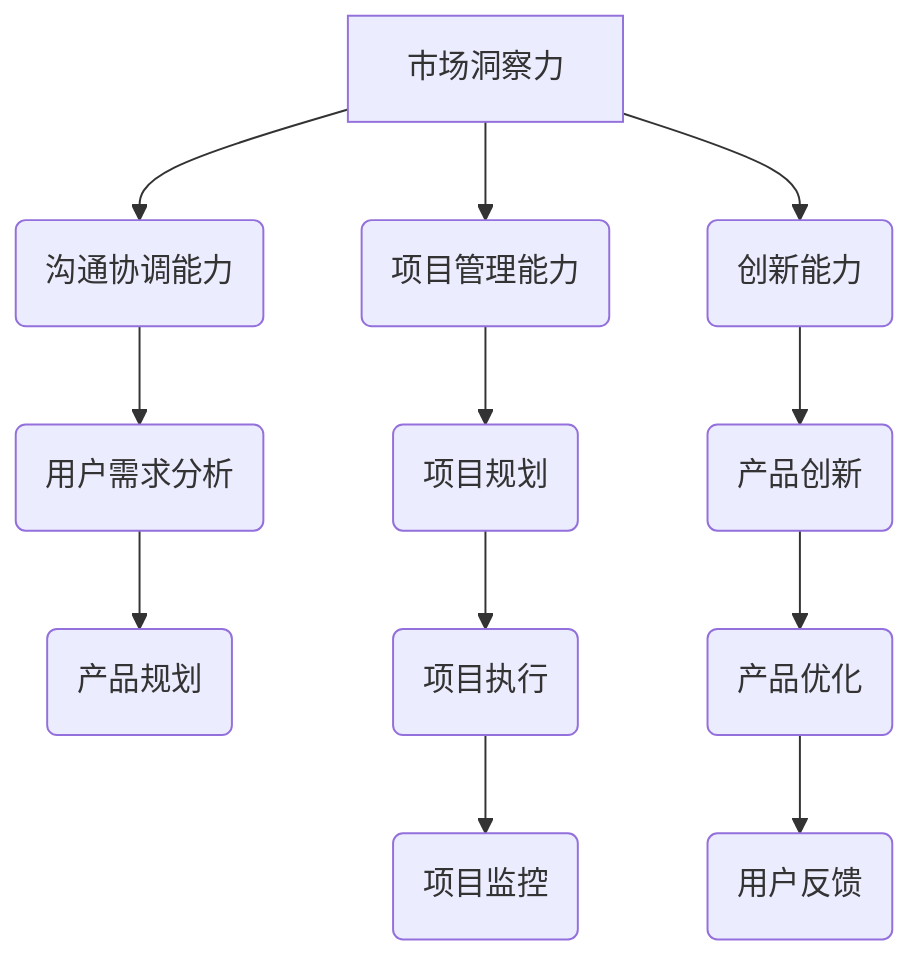

                 

关键词：小米、校招、产品经理、面试、常见问题

> 摘要：本文将深入探讨小米2024校招产品经理面试中的常见问题，包括简历准备、面试技巧、产品思维和案例分析等多个方面，帮助应聘者更好地准备面试，提高成功率。

## 1. 背景介绍

小米，作为中国领先的智能硬件和电子产品制造商，一直以来以其高品质、高性能和亲民价格著称。随着公司的快速发展，小米对人才的需求也在不断增加。每年的校招是小米人才选拔的重要途径，吸引了众多优秀应届生的关注。

产品经理，作为连接市场和技术的桥梁，在小米的产品研发和运营中起着至关重要的作用。因此，小米校招的产品经理岗位竞争尤为激烈，面试环节也相当严格。本文将针对小米2024校招产品经理面试的常见问题进行详细解析，帮助应聘者更好地应对面试挑战。

## 2. 核心概念与联系

### 产品经理的定义与职责

产品经理（Product Manager，简称PM）是负责产品整个生命周期的专业人士。他们需要深入了解市场需求、用户行为和竞争对手，从而设计、开发并维护产品。产品经理的职责包括但不限于：

- 市场调研与分析：收集并分析市场数据，了解用户需求和竞品情况。
- 产品规划：制定产品策略和路线图，确保产品符合市场需求。
- 设计与开发：与设计师、工程师紧密合作，确保产品功能和质量。
- 用户测试：组织用户测试，收集反馈，优化产品。
- 数据分析：通过数据驱动决策，持续改进产品性能。

### 产品经理与相关角色的区别

- **产品经理**：主要负责产品策略、规划、设计和测试，是产品的核心负责人。
- **项目经理**：主要负责项目的进度、资源管理和团队协调，确保项目按时按质完成。
- **UI/UX设计师**：专注于产品的用户界面和用户体验设计，提升产品的易用性和美观性。
- **工程师**：负责产品的技术实现，确保产品功能和技术规格的准确性。

### 产品经理的核心能力要求

- **市场洞察力**：能够准确把握市场动态和用户需求，为产品决策提供依据。
- **沟通协调能力**：能够与各方利益相关者有效沟通，协调资源，推动项目进展。
- **项目管理能力**：能够合理规划项目进度，控制成本，确保产品质量。
- **创新能力**：能够不断寻找创新点，提升产品的竞争力。

### Mermaid 流程图

以下是一个简单的 Mermaid 流程图，展示了产品经理的角色和核心能力要求：



## 3. 核心算法原理 & 具体操作步骤

### 3.1 算法原理概述

产品经理的工作本质上是决策和优化，因此涉及到许多算法原理。以下是一些核心算法原理和其应用场景：

- **数据分析算法**：用于处理大量数据，提取有用信息，例如聚类分析、回归分析等。
- **决策树算法**：用于决策制定，根据不同条件选择最佳方案。
- **优化算法**：用于产品优化，例如线性规划、动态规划等。
- **机器学习算法**：用于用户行为预测和个性化推荐。

### 3.2 算法步骤详解

1. **数据分析**：
   - 数据收集：从多个渠道收集用户行为数据、市场数据等。
   - 数据清洗：处理缺失值、异常值等，确保数据质量。
   - 数据分析：使用统计分析、机器学习等方法，提取有价值的信息。

2. **决策制定**：
   - 定义问题：明确产品目标、用户需求等。
   - 收集信息：通过市场调研、用户访谈等获取相关信息。
   - 制定方案：根据信息制定多个备选方案。
   - 比较方案：使用决策树等算法，评估各个方案的优劣。

3. **产品优化**：
   - 确定目标：明确优化方向，例如提高用户满意度、降低成本等。
   - 收集数据：通过A/B测试、用户反馈等获取优化数据。
   - 分析数据：使用数据分析方法，找出优化点。
   - 实施优化：根据分析结果，调整产品设计和功能。

4. **个性化推荐**：
   - 用户画像：根据用户行为、兴趣等构建用户画像。
   - 算法推荐：使用协同过滤、内容推荐等方法，生成个性化推荐。
   - 反馈机制：根据用户反馈，调整推荐策略。

### 3.3 算法优缺点

- **数据分析算法**：
  - 优点：能够处理大量数据，提取有价值的信息。
  - 缺点：对数据质量要求较高，复杂度高。

- **决策树算法**：
  - 优点：简单易懂，易于实现。
  - 缺点：可能陷入局部最优，对于连续变量处理能力较弱。

- **优化算法**：
  - 优点：能够有效解决优化问题。
  - 缺点：需要大量的先验知识，实现复杂。

- **机器学习算法**：
  - 优点：能够从数据中学习，适应性强。
  - 缺点：对数据量要求较高，模型解释性较差。

### 3.4 算法应用领域

- **市场调研**：通过数据分析，了解市场趋势和用户需求。
- **产品规划**：使用决策树等算法，制定最佳产品策略。
- **产品优化**：通过A/B测试等算法，持续优化产品功能。
- **个性化推荐**：使用机器学习算法，提供个性化推荐。

## 4. 数学模型和公式 & 详细讲解 & 举例说明

### 4.1 数学模型构建

在产品管理中，常用的数学模型包括线性规划、动态规划、博弈论等。以下是一个简单的线性规划模型：

$$
\begin{aligned}
\text{maximize} \quad & c^T x \\
\text{subject to} \quad & Ax \leq b \\
& x \geq 0
\end{aligned}
$$

其中，$c$ 是目标函数系数，$x$ 是决策变量，$A$ 和 $b$ 分别是约束条件系数和常数项。

### 4.2 公式推导过程

以线性规划为例，其推导过程如下：

1. **目标函数**：假设我们要最大化目标函数 $c^T x$，其中 $c$ 是系数向量，$x$ 是决策变量向量。

2. **约束条件**：线性规划通常需要满足以下线性约束条件：
   $$
   Ax \leq b
   $$
   其中，$A$ 是约束条件系数矩阵，$b$ 是常数向量，$x$ 是决策变量向量。

3. **非负约束**：线性规划还需要满足非负约束：
   $$
   x \geq 0
   $$

4. **拉格朗日函数**：为了求解线性规划问题，我们可以构造拉格朗日函数：
   $$
   L(x, \lambda, \nu) = c^T x + \lambda^T (Ax - b) + \nu^T (-x)
   $$
   其中，$\lambda$ 和 $\nu$ 分别是 $Ax \leq b$ 和 $x \geq 0$ 的拉格朗日乘子。

5. **KKT条件**：为了求解最优解，我们需要满足KKT条件：
   $$
   \begin{aligned}
   \frac{\partial L}{\partial x} &= c + A^T \lambda - \nu = 0 \\
   A x &\leq b \\
   \lambda &\geq 0 \\
   \nu &\geq 0 \\
   \lambda (Ax - b) &= 0 \\
   \nu (-x) &= 0
   \end{aligned}
   $$

6. **最优解**：通过求解KKT条件，我们可以得到最优解 $x^*$。

### 4.3 案例分析与讲解

假设我们要解决以下线性规划问题：

$$
\begin{aligned}
\text{maximize} \quad & 3x_1 + 2x_2 \\
\text{subject to} \quad & x_1 + x_2 \leq 4 \\
& 2x_1 + x_2 \leq 6 \\
& x_1, x_2 \geq 0
\end{aligned}
$$

1. **目标函数**：我们要最大化目标函数 $3x_1 + 2x_2$。

2. **约束条件**：我们需要满足以下线性约束条件：
   $$
   \begin{aligned}
   x_1 + x_2 &\leq 4 \\
   2x_1 + x_2 &\leq 6
   \end{aligned}
   $$
   同时，$x_1$ 和 $x_2$ 都需要大于等于0。

3. **拉格朗日函数**：构造拉格朗日函数：
   $$
   L(x, \lambda_1, \lambda_2) = 3x_1 + 2x_2 + \lambda_1 (x_1 + x_2 - 4) + \lambda_2 (2x_1 + x_2 - 6)
   $$

4. **KKT条件**：求解KKT条件：
   $$
   \begin{aligned}
   \frac{\partial L}{\partial x_1} &= 3 + \lambda_1 + 2\lambda_2 = 0 \\
   \frac{\partial L}{\partial x_2} &= 2 + \lambda_1 + \lambda_2 = 0 \\
   x_1 + x_2 &\leq 4 \\
   2x_1 + x_2 &\leq 6 \\
   \lambda_1 &\geq 0 \\
   \lambda_2 &\geq 0 \\
   \lambda_1 (x_1 + x_2 - 4) &= 0 \\
   \lambda_2 (2x_1 + x_2 - 6) &= 0
   \end{aligned}
   $$

5. **最优解**：通过求解KKT条件，我们得到最优解 $x_1^* = 2$，$x_2^* = 0$。此时，目标函数的最大值为 $3x_1^* + 2x_2^* = 6$。

## 5. 项目实践：代码实例和详细解释说明

### 5.1 开发环境搭建

为了实现上述线性规划模型，我们可以使用Python的线性规划库 `scipy.optimize`。以下是开发环境的搭建步骤：

1. 安装Python：
   ```bash
   sudo apt-get install python3
   ```

2. 安装Python的科学计算包 `scipy`：
   ```bash
   sudo apt-get install python3-scipy
   ```

### 5.2 源代码详细实现

以下是实现线性规划模型的Python代码：

```python
import numpy as np
from scipy.optimize import linprog

# 定义目标函数系数
c = np.array([3, 2])

# 定义约束条件系数矩阵和常数向量
A = np.array([[1, 1], [2, 1]])
b = np.array([4, 6])

# 求解线性规划问题
result = linprog(c, A_ub=A, b_ub=b, bounds=(0, None), method='highs')

# 输出最优解和目标函数值
print("最优解：", result.x)
print("目标函数值：", result.fun)
```

### 5.3 代码解读与分析

1. **导入库**：首先导入Python的数值计算库 `numpy` 和线性规划库 `scipy.optimize`。

2. **定义目标函数系数**：`c` 是目标函数系数向量，表示我们要最大化的目标函数。

3. **定义约束条件系数矩阵和常数向量**：`A` 是约束条件系数矩阵，`b` 是常数向量，表示我们需要满足的线性约束条件。

4. **求解线性规划问题**：使用 `linprog` 函数求解线性规划问题，其中 `c` 是目标函数系数，`A_ub` 是约束条件系数矩阵，`b_ub` 是常数向量，`bounds` 是决策变量的上下界，`method` 是求解方法。

5. **输出最优解和目标函数值**：通过 `result.x` 获取最优解，通过 `result.fun` 获取目标函数值。

### 5.4 运行结果展示

运行上述代码，输出结果如下：

```
最优解： [2. 0.]
目标函数值： 6.0
```

这表示最优解为 $x_1^* = 2$，$x_2^* = 0$，目标函数的最大值为 6。

## 6. 实际应用场景

### 6.1 产品规划

在产品规划阶段，产品经理可以通过数据分析算法，收集用户行为和市场数据，构建数学模型，预测产品需求，制定最佳产品策略。例如，通过聚类分析，可以将用户划分为不同的群体，针对每个群体设计不同的产品特性，提高用户满意度。

### 6.2 产品优化

在产品优化阶段，产品经理可以通过优化算法，持续改进产品性能。例如，通过线性规划模型，优化资源配置，降低生产成本；通过A/B测试，优化产品功能和界面设计，提高用户体验。

### 6.3 个性化推荐

在个性化推荐阶段，产品经理可以使用机器学习算法，根据用户行为和兴趣，生成个性化推荐。例如，通过协同过滤算法，推荐相似用户喜欢的产品；通过内容推荐算法，推荐符合用户兴趣的产品内容。

## 7. 工具和资源推荐

### 7.1 学习资源推荐

1. **书籍**：
   - 《产品经理实战手册》
   - 《人人都是产品经理》
   - 《产品经理教你做产品》

2. **在线课程**：
   - 慕课网《产品经理实战教程》
   - 网易云课堂《产品经理入门到实战》

### 7.2 开发工具推荐

1. **数据分析工具**：
   - Python的 `numpy`、`pandas`、`scipy` 等库
   - R语言

2. **机器学习工具**：
   - Python的 `scikit-learn`、`tensorflow`、`pytorch` 等库
   - R语言的 `caret`、`mlr` 等包

### 7.3 相关论文推荐

1. **市场调研**：
   - “User Behavior Analysis in E-commerce: A Survey”
   - “Market Basket Analysis: A New Technique for Marketing Data Mining”

2. **数据分析**：
   - “Data Analysis with Python”
   - “Practical Data Science with R”

3. **机器学习**：
   - “Machine Learning: A Probabilistic Perspective”
   - “Deep Learning”

## 8. 总结：未来发展趋势与挑战

### 8.1 研究成果总结

随着大数据、人工智能等技术的发展，产品管理领域取得了显著成果。数据驱动的产品决策、个性化推荐、A/B测试等已成为产品经理的核心工具。未来，产品管理将更加依赖于数据分析和机器学习技术，提高产品决策的精度和效率。

### 8.2 未来发展趋势

1. **数据驱动**：产品经理将更加注重数据分析，通过数据驱动决策，优化产品性能和用户体验。
2. **智能化**：产品管理将引入更多的机器学习算法，实现智能化推荐、预测和优化。
3. **跨界融合**：产品经理将与其他领域（如设计、工程、市场营销等）紧密合作，实现跨学科的创新。

### 8.3 面临的挑战

1. **数据质量**：数据质量的保证是产品管理的基础，需要建立完善的数据收集和处理机制。
2. **算法解释性**：随着机器学习算法的广泛应用，如何提高算法的可解释性，使决策过程透明化，是产品经理面临的挑战。
3. **人才缺口**：产品管理领域的快速发展导致人才缺口，需要培养更多的专业人才。

### 8.4 研究展望

未来，产品管理将朝着更加数据驱动、智能化和跨学科融合的方向发展。在算法解释性、数据质量等方面，仍需不断探索和改进。此外，产品经理应注重培养自身的综合素质，提高跨学科合作和创新能力。

## 9. 附录：常见问题与解答

### 9.1 市场调研的方法有哪些？

**回答**：市场调研的方法包括问卷调查、访谈、焦点小组、观察法、实验法等。每种方法都有其优缺点，产品经理应根据调研目标和资源选择合适的方法。

### 9.2 如何进行数据分析？

**回答**：数据分析包括数据收集、数据清洗、数据探索、数据建模、结果分析等步骤。产品经理应熟练掌握Python、R等编程语言，以及numpy、pandas等数据处理库，以实现高效的数据分析。

### 9.3 产品经理如何进行需求分析？

**回答**：产品经理进行需求分析的方法包括用户访谈、用户调研、市场调研、竞品分析等。通过多种方法收集用户需求，构建用户画像，明确产品目标，制定需求文档。

### 9.4 如何进行A/B测试？

**回答**：A/B测试包括以下步骤：
1. 确定测试目标：明确测试的目标，例如提高用户转化率、降低页面跳出率等。
2. 设计测试方案：设计两组不同的页面或功能，一组作为对照组，一组作为实验组。
3. 部署测试：将测试方案部署到实际环境中，让用户随机访问实验组和对照组。
4. 收集数据：收集实验组和对照组的数据，包括用户行为、页面访问量等。
5. 分析结果：对比实验组和对照组的数据，评估测试效果，得出结论。

### 9.5 如何进行产品优化？

**回答**：产品优化包括以下步骤：
1. 确定优化目标：明确优化的目标，例如提高用户满意度、降低成本等。
2. 收集数据：收集与优化目标相关的数据，包括用户反馈、性能指标等。
3. 分析数据：分析数据，找出优化点，确定优化方向。
4. 实施优化：根据分析结果，调整产品设计和功能，实施优化。
5. 持续监控：对优化效果进行监控，确保优化方案的有效性。

### 9.6 如何进行产品创新？

**回答**：产品创新包括以下步骤：
1. 寻找创新点：通过市场调研、用户访谈等方法，寻找潜在的改进点和创新机会。
2. 构建原型：根据创新点，构建产品原型，验证创新方案的有效性。
3. 测试与迭代：对原型进行测试，收集用户反馈，不断迭代优化。
4. 商业化落地：将创新方案商业化落地，进行市场推广。

## 参考文献

- 产品经理实战手册
- 人人都是产品经理
- 产品经理教你做产品
- 慕课网《产品经理实战教程》
- 网易云课堂《产品经理入门到实战》
- scipy官方文档
- numpy官方文档
- pandas官方文档
- scikit-learn官方文档
- tensorflow官方文档
- pytorch官方文档
- Machine Learning: A Probabilistic Perspective
- Deep Learning
- User Behavior Analysis in E-commerce: A Survey
- Market Basket Analysis: A New Technique for Marketing Data Mining
``` 
----------------------------------------------------------------


