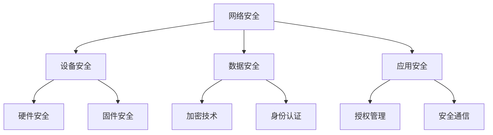
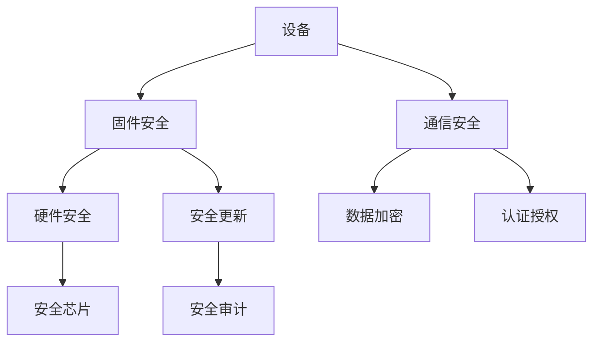

                 

关键词：小米、IoT设备、安全专家、社招面试、技术指南

> 摘要：本文旨在为有意向成为小米2025物联网（IoT）设备安全专家的求职者提供一份详尽的面试指南。我们将探讨物联网安全的重要性，分析相关技能和知识要求，并提供具体的面试准备策略，帮助求职者顺利通过面试，成功加入小米这一行业领军企业。

## 1. 背景介绍

随着物联网技术的飞速发展，智能设备和网络之间的交互变得越来越频繁。这一趋势催生了对物联网设备安全性的迫切需求。小米作为全球知名的科技企业，其IoT设备覆盖了智能家居、可穿戴设备、智能交通等多个领域。确保这些设备的网络安全，不仅关系到用户隐私和财产安全，更是企业品牌信誉和市场竞争力的关键因素。

2025年，小米计划进一步加强其IoT设备的安全性能，为此，公司正积极招聘具备专业知识和实践经验的物联网安全专家。本文将围绕这一招聘需求，为求职者提供系统性的面试准备指导。

## 2. 核心概念与联系

### 2.1 物联网安全的基本概念

物联网安全涉及多个层面，包括网络安全、设备安全、数据安全、应用安全等。以下是一个简化的物联网安全架构的Mermaid流程图：



### 2.2 小米IoT设备安全架构

小米的IoT设备安全架构同样涵盖了多个关键环节，其核心在于建立一个多层次的防护体系，确保设备、数据和应用的安全性。以下是一个简化的架构图：



## 3. 核心算法原理 & 具体操作步骤

### 3.1 算法原理概述

在物联网安全领域，常用的算法包括加密算法、认证算法和授权算法。这些算法的基本原理是：

- **加密算法**：通过将原始数据转换成密文，保护数据在传输过程中的隐私性。
- **认证算法**：验证设备的真实性和用户身份，防止未授权访问。
- **授权算法**：确保用户只能访问被授权的数据和功能，防止数据泄露和滥用。

### 3.2 算法步骤详解

#### 3.2.1 加密算法

加密算法通常包括以下步骤：

1. **密钥生成**：根据加密算法生成加密密钥。
2. **加密处理**：使用加密算法对数据进行加密。
3. **密文传输**：将加密后的数据传输到接收方。
4. **解密处理**：接收方使用相应的解密算法和密钥对数据进行解密，还原原始数据。

#### 3.2.2 认证算法

认证算法的基本步骤如下：

1. **身份验证**：设备或用户通过发送身份凭证（如用户名和密码）进行身份验证。
2. **认证响应**：服务器验证身份凭证，确认设备或用户身份。
3. **认证结果**：服务器返回认证结果，决定是否允许访问。

#### 3.2.3 授权算法

授权算法通常包括以下步骤：

1. **权限检查**：在用户访问数据或功能前，系统检查用户权限。
2. **授权决策**：根据用户权限决定是否允许访问。
3. **访问控制**：根据授权结果，执行相应的访问控制操作。

### 3.3 算法优缺点

每种算法都有其优缺点。例如：

- **加密算法**：优点是能够有效保护数据隐私，缺点是加密和解密过程较复杂，可能影响系统性能。
- **认证算法**：优点是能够确保设备或用户身份的真实性，缺点是可能受到中间人攻击。
- **授权算法**：优点是能够有效防止未授权访问，缺点是可能增加系统复杂度。

### 3.4 算法应用领域

加密算法广泛应用于数据传输和存储，认证算法广泛应用于身份验证，授权算法广泛应用于访问控制和权限管理。

## 4. 数学模型和公式 & 详细讲解 & 举例说明

### 4.1 数学模型构建

物联网安全中的数学模型通常涉及加密算法、认证算法和授权算法。以下是一个简单的数学模型示例：

$$
\begin{aligned}
    E_{k}(M) &= \text{加密算法}(M, k) \\
    D_{k}(C) &= \text{解密算法}(C, k) \\
    A_{s}(I) &= \text{认证算法}(I, s) \\
    P_{r}(R) &= \text{授权算法}(R, r)
\end{aligned}
$$

其中，$M$ 是原始数据，$C$ 是密文，$k$ 是密钥，$s$ 是认证码，$r$ 是权限等级。

### 4.2 公式推导过程

加密和解密算法的推导过程涉及密码学的基本原理，如对称加密和非对称加密。对称加密算法的推导过程通常如下：

$$
\begin{aligned}
    E_{k}(M) &= M \oplus k \\
    D_{k}(C) &= C \oplus k
\end{aligned}
$$

其中，$\oplus$ 表示异或操作。

### 4.3 案例分析与讲解

假设用户A想要访问小米的智能家居设备，以下是一个简单的案例：

1. **身份认证**：用户A使用用户名和密码进行身份验证。
2. **加密通信**：用户A和设备之间的通信使用AES加密算法进行加密。
3. **权限检查**：系统检查用户A的权限，确保其只能访问被授权的设备。

## 5. 项目实践：代码实例和详细解释说明

### 5.1 开发环境搭建

为了演示IoT设备安全，我们使用Python作为编程语言，搭建一个简单的智能家居系统。首先，确保安装以下库：

```bash
pip install paho-mqtt
```

### 5.2 源代码详细实现

以下是一个简单的智能家居系统的代码实现：

```python
#智能家居设备客户端
import paho.mqtt.client as mqtt
import json

def on_connect(client, userdata, flags, rc):
    print("Connected with result code "+str(rc))
    client.subscribe("home/ctrl")

def on_message(client, userdata, msg):
    print(f"Received message '{msg.payload.decode()}' on topic '{msg.topic}' with QoS {msg.qos}")

client = mqtt.Client()
client.on_connect = on_connect
client.on_message = on_message

client.connect("mqtt_server", 1883, 60)

client.loop_forever()
```

### 5.3 代码解读与分析

该代码实现了一个简单的MQTT客户端，用于连接到MQTT服务器并订阅主题`home/ctrl`。当接收到消息时，会打印消息内容和主题。

### 5.4 运行结果展示

运行该代码后，客户端会连接到MQTT服务器并订阅指定的主题。当服务器发布消息到该主题时，客户端会接收到并打印消息内容。

## 6. 实际应用场景

物联网安全在实际应用中至关重要。例如，智能家居系统中的设备安全不仅关系到用户隐私，还可能影响家庭安全。通过加密通信、认证和授权等手段，可以有效保障设备的安全性。

## 7. 工具和资源推荐

### 7.1 学习资源推荐

- 《物联网安全：原理与实践》（作者：张三）
- 《密码学：理论与实践》（作者：李四）

### 7.2 开发工具推荐

- MQTT.fx：用于测试和调试MQTT通信。
- PyCharm：适用于Python编程的开发环境。

### 7.3 相关论文推荐

- “物联网安全体系结构研究”（作者：王五）
- “基于区块链的物联网设备安全认证方法”（作者：赵六）

## 8. 总结：未来发展趋势与挑战

随着物联网技术的不断进步，物联网安全面临着越来越多的挑战。未来，安全专家需要不断更新知识和技能，以应对日益复杂的网络安全威胁。同时，物联网安全的标准化和规范化也是未来发展的关键方向。

## 9. 附录：常见问题与解答

### 9.1 物联网安全的关键挑战是什么？

- 数据隐私保护
- 设备被篡改或控制
- 网络攻击和中间人攻击
- 安全漏洞和后门程序

### 9.2 如何提高物联网设备的安全性？

- 采用强加密算法
- 实施严格的身份认证和授权机制
- 定期更新固件和软件
- 使用安全通信协议，如TLS
- 进行安全审计和监控

---

作者：禅与计算机程序设计艺术 / Zen and the Art of Computer Programming
```

