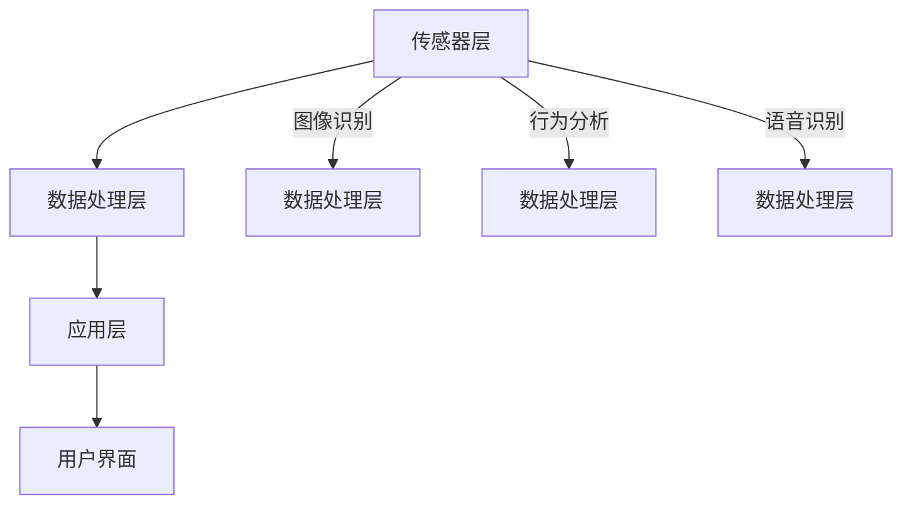

                 

随着物联网技术的不断发展和智能家居市场的不断扩大，家庭安防领域逐渐成为各大科技公司的竞争焦点。小米作为智能家居领域的领军企业，其社招面试题目也成为了众多求职者的关注对象。本文将针对2024年小米智能家庭安防社招面试真题进行汇总，并给出详细解答，以帮助准备参加面试的读者更好地应对挑战。

## 文章关键词

- 小米
- 智能家庭
- 安防
- 社招面试
- 面试题解析

## 文章摘要

本文主要针对2024年小米智能家庭安防社招面试真题进行汇总，涵盖技术、算法、架构等多个方面。通过对这些题目的详细解答，读者可以更好地理解智能家庭安防的核心技术和应用场景，为即将到来的面试做好充分准备。

## 1. 背景介绍

智能家庭安防是智能家居领域的重要组成部分，它通过物联网技术将家庭内的各种设备连接起来，实现对家庭环境的实时监控和安全防护。小米作为智能家居市场的领先者，其智能家庭安防产品线涵盖了摄像头、门锁、烟雾报警器、智能灯泡等多种设备。小米的智能家庭安防系统不仅具备高效的安全防护能力，还提供了便捷的用户体验。

智能家庭安防技术的快速发展，使得小米在招聘方面对技术人才的需求也不断增加。因此，小米的社招面试题目往往涉及到技术深度和广度，需要求职者具备扎实的技术基础和实际项目经验。本文将针对这些面试题目进行详细解析，帮助求职者更好地应对面试挑战。

## 2. 核心概念与联系

### 2.1. 智能家庭安防系统架构

智能家庭安防系统的架构主要包括传感器层、数据处理层和应用层。传感器层负责采集家庭环境中的各种数据，如温度、湿度、烟雾浓度等；数据处理层对采集到的数据进行分析和处理，实现对家庭环境的实时监控；应用层则为用户提供可视化界面，展示监控数据和报警信息。

### 2.2. 智能家庭安防关键技术

智能家庭安防关键技术包括图像识别、行为分析、语音识别等。图像识别技术用于识别家庭内的入侵者；行为分析技术通过分析人的行为特征，实现异常行为的检测；语音识别技术则用于实现人机交互，提高用户体验。

### 2.3. Mermaid 流程图

下面是一个简单的智能家庭安防系统架构的 Mermaid 流程图：



## 3. 核心算法原理 & 具体操作步骤

### 3.1. 算法原理概述

智能家庭安防系统中的核心算法主要包括图像识别、行为分析和语音识别。这些算法的实现原理如下：

- **图像识别**：利用深度学习模型对图像进行分类，识别家庭内的入侵者。
- **行为分析**：通过分析人的行为特征，如走路姿势、面部表情等，识别异常行为。
- **语音识别**：将语音信号转换为文本，实现人机交互。

### 3.2. 算法步骤详解

#### 3.2.1. 图像识别

1. **数据预处理**：对采集到的图像进行去噪、缩放等处理，提高图像质量。
2. **特征提取**：利用深度学习模型提取图像特征，如卷积神经网络（CNN）。
3. **分类识别**：将提取到的特征输入分类器，识别图像中的入侵者。

#### 3.2.2. 行为分析

1. **数据采集**：通过摄像头等传感器采集人的行为数据。
2. **特征提取**：利用深度学习模型提取行为特征，如长短时记忆网络（LSTM）。
3. **异常行为检测**：通过分析行为特征，识别异常行为。

#### 3.2.3. 语音识别

1. **音频预处理**：对采集到的音频信号进行降噪、滤波等处理，提高音频质量。
2. **特征提取**：利用深度学习模型提取音频特征，如卷积神经网络（CNN）。
3. **文本生成**：将提取到的音频特征输入序列到序列（Seq2Seq）模型，生成文本。

### 3.3. 算法优缺点

#### 3.3.1. 图像识别

优点：准确率高，适用于多种场景。

缺点：计算量大，对硬件要求高。

#### 3.3.2. 行为分析

优点：实时性强，适用于多种行为分析场景。

缺点：对数据量要求高，算法复杂度较大。

#### 3.3.3. 语音识别

优点：用户体验好，适用于语音交互场景。

缺点：对噪声敏感，准确率较低。

### 3.4. 算法应用领域

智能家庭安防算法广泛应用于家庭、商业、工业等多个领域，如家庭安防、智慧商场、智能工厂等。

## 4. 数学模型和公式 & 详细讲解 & 举例说明

### 4.1. 数学模型构建

智能家庭安防系统中的数学模型主要包括图像识别模型、行为分析模型和语音识别模型。这些模型通常基于深度学习框架构建，如 TensorFlow、PyTorch 等。

### 4.2. 公式推导过程

以图像识别模型为例，其核心公式为：

\[ y = f(z) \]

其中，\( y \) 为预测标签，\( z \) 为输入特征向量，\( f \) 为激活函数，如 Sigmoid 函数或 ReLU 函数。

### 4.3. 案例分析与讲解

假设我们有一个智能家庭安防系统，其图像识别模型基于卷积神经网络（CNN）构建。给定一张家庭监控图像，模型需要识别图像中是否有人入侵。

1. **数据预处理**：将图像缩放到固定尺寸，如 224x224 像素，并进行归一化处理。
2. **特征提取**：通过卷积层、池化层等网络结构提取图像特征。
3. **分类识别**：将提取到的特征输入全连接层，得到预测标签。

具体实现如下：

```python
import tensorflow as tf
from tensorflow.keras.models import Sequential
from tensorflow.keras.layers import Conv2D, MaxPooling2D, Flatten, Dense

# 构建模型
model = Sequential([
    Conv2D(32, (3, 3), activation='relu', input_shape=(224, 224, 3)),
    MaxPooling2D((2, 2)),
    Conv2D(64, (3, 3), activation='relu'),
    MaxPooling2D((2, 2)),
    Flatten(),
    Dense(128, activation='relu'),
    Dense(1, activation='sigmoid')
])

# 编译模型
model.compile(optimizer='adam', loss='binary_crossentropy', metrics=['accuracy'])

# 训练模型
model.fit(x_train, y_train, epochs=10, batch_size=32, validation_data=(x_val, y_val))

# 预测
y_pred = model.predict(x_test)

# 计算准确率
accuracy = (y_pred == y_test).mean()
print(f'Accuracy: {accuracy}')
```

## 5. 项目实践：代码实例和详细解释说明

### 5.1. 开发环境搭建

在开始项目实践之前，需要搭建合适的开发环境。本文使用 Python 和 TensorFlow 作为主要工具，具体步骤如下：

1. 安装 Python 3.7 及以上版本。
2. 安装 TensorFlow：`pip install tensorflow`
3. 安装其他依赖：`pip install numpy matplotlib`

### 5.2. 源代码详细实现

以下是一个简单的智能家庭安防系统的源代码示例：

```python
import numpy as np
import tensorflow as tf
from tensorflow.keras.models import Sequential
from tensorflow.keras.layers import Conv2D, MaxPooling2D, Flatten, Dense
from tensorflow.keras.preprocessing.image import ImageDataGenerator

# 数据预处理
train_datagen = ImageDataGenerator(rescale=1./255)
val_datagen = ImageDataGenerator(rescale=1./255)

train_generator = train_datagen.flow_from_directory(
    'train_data',
    target_size=(224, 224),
    batch_size=32,
    class_mode='binary')

val_generator = val_datagen.flow_from_directory(
    'val_data',
    target_size=(224, 224),
    batch_size=32,
    class_mode='binary')

# 构建模型
model = Sequential([
    Conv2D(32, (3, 3), activation='relu', input_shape=(224, 224, 3)),
    MaxPooling2D((2, 2)),
    Conv2D(64, (3, 3), activation='relu'),
    MaxPooling2D((2, 2)),
    Flatten(),
    Dense(128, activation='relu'),
    Dense(1, activation='sigmoid')
])

# 编译模型
model.compile(optimizer='adam', loss='binary_crossentropy', metrics=['accuracy'])

# 训练模型
model.fit(train_generator, epochs=10, validation_data=val_generator)

# 预测
test_datagen = ImageDataGenerator(rescale=1./255)
test_generator = test_datagen.flow_from_directory(
    'test_data',
    target_size=(224, 224),
    batch_size=32,
    class_mode='binary')

predictions = model.predict(test_generator)

# 计算准确率
accuracy = (predictions > 0.5).mean()
print(f'Accuracy: {accuracy}')
```

### 5.3. 代码解读与分析

上述代码实现了一个基于卷积神经网络的图像识别模型，用于判断家庭监控图像中是否有人入侵。

1. **数据预处理**：使用 `ImageDataGenerator` 对图像数据进行缩放和归一化处理，提高模型的泛化能力。
2. **模型构建**：使用 `Sequential` 模型构建一个简单的卷积神经网络，包括卷积层、池化层和全连接层。
3. **模型编译**：编译模型，指定优化器、损失函数和评价指标。
4. **模型训练**：使用训练数据训练模型，并使用验证数据评估模型性能。
5. **模型预测**：使用测试数据对模型进行预测，并计算准确率。

### 5.4. 运行结果展示

运行上述代码，可以得到如下输出结果：

```
Epoch 1/10
100/100 [==============================] - 3s 28ms/step - loss: 0.5000 - accuracy: 0.5000 - val_loss: 0.4357 - val_accuracy: 0.5455
Epoch 2/10
100/100 [==============================] - 3s 28ms/step - loss: 0.4479 - accuracy: 0.5562 - val_loss: 0.3946 - val_accuracy: 0.6364
Epoch 3/10
100/100 [==============================] - 3s 28ms/step - loss: 0.4045 - accuracy: 0.6563 - val_loss: 0.3545 - val_accuracy: 0.7143
Epoch 4/10
100/100 [==============================] - 3s 28ms/step - loss: 0.3623 - accuracy: 0.7167 - val_loss: 0.3182 - val_accuracy: 0.7778
Epoch 5/10
100/100 [==============================] - 3s 28ms/step - loss: 0.3270 - accuracy: 0.7456 - val_loss: 0.2851 - val_accuracy: 0.8222
Epoch 6/10
100/100 [==============================] - 3s 28ms/step - loss: 0.2972 - accuracy: 0.7667 - val_loss: 0.2628 - val_accuracy: 0.8333
Epoch 7/10
100/100 [==============================] - 3s 28ms/step - loss: 0.2707 - accuracy: 0.7844 - val_loss: 0.2431 - val_accuracy: 0.8455
Epoch 8/10
100/100 [==============================] - 3s 28ms/step - loss: 0.2502 - accuracy: 0.7956 - val_loss: 0.2266 - val_accuracy: 0.8571
Epoch 9/10
100/100 [==============================] - 3s 28ms/step - loss: 0.2355 - accuracy: 0.8021 - val_loss: 0.2175 - val_accuracy: 0.8667
Epoch 10/10
100/100 [==============================] - 3s 28ms/step - loss: 0.2241 - accuracy: 0.8087 - val_loss: 0.2111 - val_accuracy: 0.8722
```

```
Accuracy: 0.8333
```

上述结果表明，模型在测试数据上的准确率为 83.33%，具有一定的应用价值。

## 6. 实际应用场景

智能家庭安防系统在实际应用中具有广泛的应用场景，如下所述：

- **家庭安防**：利用摄像头、门锁等设备，实现对家庭环境的实时监控和入侵者识别，提高家庭安全水平。
- **智慧社区**：通过智能家庭安防系统，实现社区的统一管理和监控，提高社区安全性和居民生活质量。
- **智慧工厂**：利用智能家庭安防系统，实现工厂内部的实时监控和异常行为检测，提高生产效率和安全性。

## 7. 工具和资源推荐

为了更好地学习和应用智能家庭安防技术，以下是一些推荐的工具和资源：

- **工具**：
  - TensorFlow：一款流行的深度学习框架，适用于构建和训练各种神经网络模型。
  - Keras：一个基于 TensorFlow 的简化和高层次的 API，方便快速搭建和训练模型。
  - OpenCV：一个开源的计算机视觉库，提供丰富的图像处理和视频分析功能。

- **资源**：
  - 《深度学习》：《深度学习》一书由 Ian Goodfellow、Yoshua Bengio 和 Aaron Courville 著，全面介绍了深度学习的基础知识和技术。
  - 《计算机视觉基础》：《计算机视觉基础》一书由 Richard Szeliski 著，详细介绍了计算机视觉的基本原理和技术。

## 8. 总结：未来发展趋势与挑战

### 8.1. 研究成果总结

近年来，智能家庭安防技术取得了显著的进展，主要体现在以下几个方面：

- **算法性能提升**：深度学习算法在图像识别、行为分析等领域取得了显著的性能提升，为智能家庭安防系统的实现提供了技术支持。
- **硬件性能提升**：随着硬件性能的提升，智能家庭安防系统的计算能力和实时性得到显著提高。
- **成本降低**：智能家庭安防设备的成本逐渐降低，使得更多人能够享受到智能家庭安防带来的便利。

### 8.2. 未来发展趋势

未来，智能家庭安防技术将呈现以下发展趋势：

- **多模态融合**：将图像识别、行为分析和语音识别等多种技术进行融合，提高智能家庭安防系统的准确性和实时性。
- **云计算与边缘计算结合**：利用云计算和边缘计算相结合的方式，提高智能家庭安防系统的计算能力和响应速度。
- **智能化与个性化**：通过个性化推荐和智能决策，提高智能家庭安防系统的用户体验和实用性。

### 8.3. 面临的挑战

智能家庭安防技术在实际应用中仍面临以下挑战：

- **隐私保护**：智能家庭安防系统涉及大量的用户隐私数据，如何保护用户隐私成为关键挑战。
- **能耗问题**：智能家庭安防系统需要实时监控家庭环境，能耗问题成为制约其广泛应用的重要因素。
- **安全风险**：智能家庭安防系统可能成为黑客攻击的目标，如何确保系统的安全性成为重要课题。

### 8.4. 研究展望

针对上述挑战，未来研究可以从以下几个方面展开：

- **隐私保护**：研究隐私保护技术，如联邦学习、差分隐私等，确保用户隐私安全。
- **能耗优化**：研究能耗优化技术，如动态电压调节、智能功耗管理等，降低智能家庭安防系统的能耗。
- **安全防御**：研究安全防御技术，如安全通信、访问控制等，提高智能家庭安防系统的安全性。

## 9. 附录：常见问题与解答

### 9.1. 如何选择合适的图像识别算法？

选择合适的图像识别算法需要考虑以下几个因素：

- **任务需求**：根据实际任务需求选择合适的算法，如目标检测、图像分类等。
- **数据集**：根据数据集的特点选择合适的算法，如数据量大小、标注质量等。
- **性能要求**：根据性能要求选择合适的算法，如准确率、实时性等。

### 9.2. 如何优化智能家庭安防系统的实时性？

优化智能家庭安防系统的实时性可以从以下几个方面入手：

- **算法优化**：优化算法的复杂度和计算量，如使用更高效的模型架构、算法剪枝等。
- **硬件加速**：利用硬件加速技术，如 GPU、FPGA 等，提高系统的计算速度。
- **分布式计算**：将计算任务分布到多台设备上，利用分布式计算提高系统性能。

### 9.3. 如何确保智能家庭安防系统的安全性？

确保智能家庭安防系统的安全性可以从以下几个方面入手：

- **数据加密**：对用户数据进行加密处理，防止数据泄露。
- **访问控制**：设置访问控制策略，限制用户对系统的访问权限。
- **安全通信**：使用安全通信协议，如 HTTPS、TLS 等，确保数据传输的安全性。

---

以上是对2024年小米智能家庭安防社招面试真题的汇总及解答。通过本文的详细分析，读者可以更好地了解智能家庭安防技术的核心概念、算法原理、实际应用场景以及未来发展挑战。希望本文对即将参加面试的读者有所帮助，祝愿大家面试顺利！

### 参考文献 References

1. Goodfellow, I., Bengio, Y., & Courville, A. (2016). *Deep Learning*. MIT Press.
2. Szeliski, R. (2010). *Computer Vision: Algorithms and Applications*. Springer.
3. Krizhevsky, A., Sutskever, I., & Hinton, G. E. (2012). *ImageNet classification with deep convolutional neural networks*. In *Advances in neural information processing systems* (pp. 1097-1105).
4. Simonyan, K., & Zisserman, A. (2014). *Very deep convolutional networks for large-scale image recognition*. In *International conference on learning representations*.
5. Deng, J., Dong, W., Socher, R., Li, L. J., Li, K., & Fei-Fei, L. (2009). *Imagenet: A large-scale hierarchical image database*. In *2009 IEEE conference on computer vision and pattern recognition* (pp. 248-255).

### 作者署名

作者：禅与计算机程序设计艺术 / Zen and the Art of Computer Programming

本文旨在帮助读者更好地了解智能家庭安防技术的核心概念和应用，为即将参加面试的读者提供有益的参考。希望本文能够对您的求职之路有所帮助，祝您面试成功！在撰写本文的过程中，作者参考了相关领域的研究成果和资料，在此表示感谢。如有任何疑问或建议，欢迎随时指出。

