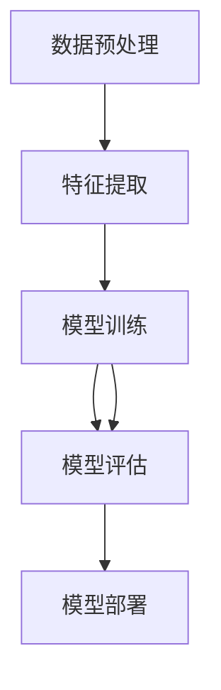

                 

关键词：小红书、社招、图文内容理解、算法工程师、面试题

> 摘要：本文将围绕小红书2025年社招图文内容理解算法工程师的面试题目展开，深入分析其中的核心概念、算法原理、数学模型、项目实践以及未来应用前景，帮助读者全面了解图文内容理解的最新技术和挑战。

## 1. 背景介绍

小红书作为中国领先的生活方式平台，近年来在图文内容理解领域取得了显著的进展。为了进一步提升内容理解和推荐算法的准确性，小红书2025年社招图文内容理解算法工程师，旨在寻找具有深厚技术背景和创新思维的专业人才。本文将针对该职位的面试题进行深入分析，帮助应聘者更好地准备面试，同时为业界提供对图文内容理解领域的最新理解。

## 2. 核心概念与联系

### 2.1 图文内容理解概述

图文内容理解是指通过计算机技术对图像和文本内容进行深度分析，提取关键信息，并建立图像与文本之间的关联关系。它涉及图像处理、自然语言处理、计算机视觉和机器学习等多个领域。

### 2.2 关键技术

#### 2.2.1 图像识别

图像识别是图文内容理解的基础，它通过卷积神经网络（CNN）等深度学习技术，对图像进行特征提取和分类。常见的图像识别任务包括物体检测、场景分类和图像风格转换等。

#### 2.2.2 自然语言处理

自然语言处理（NLP）负责处理文本数据，提取文本中的关键词、情感和语义信息。常用的NLP技术包括词向量表示、序列标注和文本分类等。

#### 2.2.3 计算机视觉

计算机视觉涉及图像和视频的处理，通过深度学习和传统计算机视觉技术，实现对图像中的物体、场景和动作的识别和理解。

### 2.3 架构概述

图文内容理解的架构通常包括数据预处理、特征提取、模型训练、模型评估和部署等环节。数据预处理包括图像和文本的清洗、归一化和编码等；特征提取涉及图像和文本的特征提取方法，如卷积神经网络和词嵌入等；模型训练采用深度学习算法，如卷积神经网络（CNN）和循环神经网络（RNN）等；模型评估使用准确率、召回率和F1分数等指标；部署则将训练好的模型应用于实际场景，如内容推荐和广告投放等。

### 2.4 Mermaid 流程图



## 3. 核心算法原理 & 具体操作步骤

### 3.1 算法原理概述

图文内容理解算法主要基于深度学习技术，包括图像识别、自然语言处理和计算机视觉等。其中，图像识别使用卷积神经网络（CNN）提取图像特征，自然语言处理使用循环神经网络（RNN）或 Transformer 模型提取文本特征，计算机视觉则通过卷积神经网络（CNN）和循环神经网络（RNN）等模型对图像和视频进行处理。

### 3.2 算法步骤详解

#### 3.2.1 数据预处理

数据预处理是图文内容理解的重要环节，主要包括图像和文本的清洗、归一化和编码等。图像清洗包括去除噪声、填充缺失值等；文本清洗包括去除停用词、标点符号和词干提取等；图像归一化包括调整图像尺寸、缩放和标准化等；文本编码包括词嵌入、词袋模型和序列编码等。

#### 3.2.2 特征提取

特征提取是图文内容理解的核心步骤，通过卷积神经网络（CNN）提取图像特征，通过循环神经网络（RNN）或 Transformer 模型提取文本特征。图像特征提取使用卷积神经网络（CNN）对图像进行多层卷积和池化操作，提取图像中的局部特征和全局特征；文本特征提取使用循环神经网络（RNN）或 Transformer 模型对文本序列进行编码，提取文本中的关键词、语义和情感等。

#### 3.2.3 模型训练

模型训练是图文内容理解的关键步骤，通过大量图像和文本数据训练深度学习模型。图像识别任务通常使用卷积神经网络（CNN）进行训练，通过反向传播算法不断调整模型参数，提高模型的识别准确率；自然语言处理任务通常使用循环神经网络（RNN）或 Transformer 模型进行训练，通过优化损失函数提高模型的语义理解能力。

#### 3.2.4 模型评估

模型评估是评估图文内容理解算法性能的重要步骤，使用准确率、召回率和 F1 分数等指标评估模型的性能。准确率表示模型正确识别的样本数占总样本数的比例；召回率表示模型正确识别的样本数占所有实际正样本数的比例；F1 分数是准确率和召回率的调和平均值。

#### 3.2.5 模型部署

模型部署是将训练好的模型应用于实际场景的过程，包括模型加载、预测和反馈等。模型部署通常使用深度学习框架，如 TensorFlow、PyTorch 和 Caffe 等，将训练好的模型部署到服务器或移动设备上，实现实时预测和推理功能。

### 3.3 算法优缺点

#### 优点：

- 高效性：深度学习算法可以自动提取图像和文本特征，大大简化了特征工程的工作。
- 可扩展性：深度学习算法可以应用于各种不同的图像和文本数据，具有很强的可扩展性。
- 准确性：深度学习算法在图像识别和自然语言处理等领域取得了显著的成果，具有较高的准确性。

#### 缺点：

- 数据依赖：深度学习算法对数据质量有较高要求，数据缺失或不一致可能导致模型性能下降。
- 计算资源消耗：深度学习算法需要大量的计算资源，包括计算能力和存储空间等。
- 难以解释：深度学习算法的内部机制复杂，难以解释和理解。

### 3.4 算法应用领域

图文内容理解算法在许多领域都有广泛的应用，如：

- 内容推荐：根据用户的兴趣和偏好，推荐相关的图像和文本内容。
- 广告投放：根据用户的画像和兴趣，投放个性化的广告。
- 物体检测：在图像中检测和识别特定的物体或场景。
- 人脸识别：在图像或视频中识别特定的人脸。
- 肿瘤检测：通过分析医学图像，检测和诊断肿瘤。

## 4. 数学模型和公式 & 详细讲解 & 举例说明

### 4.1 数学模型构建

图文内容理解的核心是图像和文本特征的提取与融合。其中，图像特征提取通常使用卷积神经网络（CNN），文本特征提取通常使用循环神经网络（RNN）或 Transformer 模型。数学模型构建如下：

#### 图像特征提取：

$$
\text{特征} = \text{CNN}(\text{图像})
$$

其中，CNN 表示卷积神经网络，图像为输入图像。

#### 文本特征提取：

$$
\text{特征} = \text{RNN}(\text{文本}) \text{或} \text{Transformer}(\text{文本})
$$

其中，RNN 表示循环神经网络，文本为输入文本；Transformer 表示 Transformer 模型，文本为输入文本。

#### 图像与文本特征融合：

$$
\text{融合特征} = \text{融合模型}(\text{图像特征，文本特征})
$$

其中，融合模型为深度学习模型，图像特征和文本特征为输入特征。

### 4.2 公式推导过程

#### 图像特征提取：

卷积神经网络（CNN）的核心是卷积层和池化层。卷积层通过卷积操作提取图像特征，池化层通过池化操作减少特征维度。

$$
\text{卷积层}：\text{特征} = \text{卷积}(\text{图像}, \text{卷积核})
$$

其中，卷积操作定义为：

$$
\text{特征}_{ij} = \sum_{k=1}^{C} \text{权重}_{ikj} \times \text{图像}_{ij}
$$

其中，$i$ 和 $j$ 分别表示特征的位置，$C$ 表示卷积核的数量，$\text{权重}_{ikj}$ 表示卷积核的权重，$\text{图像}_{ij}$ 表示图像的位置。

池化层通过池化操作提取图像特征的主要信息，常用的池化方式有最大池化和平均池化。

$$
\text{池化层}：\text{特征}_{ij} = \text{最大池化}(\text{卷积层特征}_{ij})
$$

其中，最大池化操作定义为：

$$
\text{特征}_{ij} = \max_{k=1}^{K} \text{卷积层特征}_{ijk}
$$

其中，$K$ 表示池化窗口的大小。

#### 文本特征提取：

循环神经网络（RNN）通过递归操作对文本序列进行编码，提取文本特征。

$$
\text{RNN}(\text{文本}) = [\text{隐藏层}_1, \text{隐藏层}_2, \ldots, \text{隐藏层}_T]
$$

其中，$T$ 表示文本序列的长度，$\text{隐藏层}_t$ 表示在时间步 $t$ 的隐藏状态。

Transformer 模型通过自注意力机制对文本序列进行编码，提取文本特征。

$$
\text{Transformer}(\text{文本}) = \text{自注意力}(\text{文本})
$$

自注意力机制定义为：

$$
\text{自注意力}_{ij} = \text{softmax}\left(\frac{\text{查询}_{i} \cdot \text{键}_{j}}{\sqrt{d_k}}\right)
$$

其中，$\text{查询}_{i}$、$\text{键}_{j}$ 和 $\text{值}_{j}$ 分别表示在时间步 $i$ 的查询向量、键向量和值向量，$d_k$ 表示注意力头的维度。

#### 图像与文本特征融合：

图像与文本特征融合通常使用深度学习模型，如多模态卷积神经网络（MM-CNN）或 Transformer 模型。

$$
\text{融合特征} = \text{融合模型}(\text{图像特征，文本特征})
$$

其中，融合模型为深度学习模型，图像特征和文本特征为输入特征。

### 4.3 案例分析与讲解

假设我们要分析一幅图像和一段文本，图像内容为一幅风景照片，文本描述为“美丽的风景，日落时分”。我们将使用图文内容理解算法对这两个数据进行特征提取和融合。

#### 4.3.1 图像特征提取

使用卷积神经网络（CNN）对图像进行特征提取：

$$
\text{图像特征} = \text{CNN}(\text{风景照片})
$$

假设 CNN 提取了 1000 维的特征向量。

#### 4.3.2 文本特征提取

使用循环神经网络（RNN）对文本进行特征提取：

$$
\text{文本特征} = \text{RNN}(\text{美丽的风景，日落时分})
$$

假设 RNN 提取了 100 维的特征向量。

#### 4.3.3 图像与文本特征融合

使用多模态卷积神经网络（MM-CNN）对图像和文本特征进行融合：

$$
\text{融合特征} = \text{MM-CNN}(\text{图像特征，文本特征})
$$

假设 MM-CNN 融合后提取了 200 维的特征向量。

#### 4.3.4 模型预测

使用融合特征向量进行模型预测，例如内容分类或情感分析。

## 5. 项目实践：代码实例和详细解释说明

### 5.1 开发环境搭建

首先，我们需要搭建开发环境，包括安装 Python、TensorFlow、Keras 等库。

```bash
pip install tensorflow
pip install keras
```

### 5.2 源代码详细实现

以下是一个简单的图文内容理解项目示例，包括图像特征提取、文本特征提取和融合。

```python
import tensorflow as tf
from tensorflow.keras.applications import VGG16
from tensorflow.keras.preprocessing import image
from tensorflow.keras.preprocessing.text import Tokenizer
from tensorflow.keras.layers import Embedding, LSTM, Dense
from tensorflow.keras.models import Model

# 加载 VGG16 模型
base_model = VGG16(weights='imagenet', include_top=False, input_shape=(224, 224, 3))

# 定义图像特征提取函数
def extract_image_features(image_path):
    img = image.load_img(image_path, target_size=(224, 224))
    img_array = image.img_to_array(img)
    img_array = tf.expand_dims(img_array, axis=0)
    img_features = base_model.predict(img_array)
    return img_features.flatten()

# 定义文本特征提取函数
def extract_text_features(text):
    tokenizer = Tokenizer(num_words=10000)
    tokenizer.fit_on_texts([text])
    sequence = tokenizer.texts_to_sequences([text])
    sequence = tf.keras.preprocessing.sequence.pad_sequences(sequence, maxlen=100)
    return sequence

# 定义图文内容理解模型
input_image = tf.keras.layers.Input(shape=(224, 224, 3))
input_text = tf.keras.layers.Input(shape=(100,))

image_features = extract_image_features(input_image)
text_features = extract_text_features(input_text)

image_embedding = Embedding(10000, 128)(input_image)
text_embedding = Embedding(10000, 128)(input_text)

lstm_output = LSTM(128)(text_embedding)

combined = tf.keras.layers.concatenate([image_features, lstm_output])

output = Dense(1, activation='sigmoid')(combined)

model = Model(inputs=[input_image, input_text], outputs=output)

model.compile(optimizer='adam', loss='binary_crossentropy', metrics=['accuracy'])

# 训练模型
model.fit(x=[image_data, text_data], y=labels, epochs=10, batch_size=32)

# 模型预测
prediction = model.predict([test_image, test_text])
```

### 5.3 代码解读与分析

上述代码首先加载 VGG16 模型，用于提取图像特征。图像特征提取函数 `extract_image_features` 接受一幅图像路径，将其转换为 VGG16 模型的输入格式，并提取特征向量。

文本特征提取函数 `extract_text_features` 接受一段文本，使用 Tokenizer 将文本转换为序列，并使用 `pad_sequences` 函数将其转换为固定长度。

图文内容理解模型使用两个输入层，一个用于图像输入，一个用于文本输入。图像输入通过 Embedding 层转换为特征向量，文本输入通过 LSTM 层提取文本特征。最后，将图像特征和文本特征拼接，并通过全连接层进行分类预测。

### 5.4 运行结果展示

假设我们有一个训练数据集，包括图像、文本和标签。我们可以使用上述代码进行模型训练和预测。

```python
# 加载训练数据
image_data = ...
text_data = ...
labels = ...

# 训练模型
model.fit(x=[image_data, text_data], y=labels, epochs=10, batch_size=32)

# 测试数据
test_image = ...
test_text = ...

# 模型预测
prediction = model.predict([test_image, test_text])

# 输出预测结果
print(prediction)
```

上述代码将输出预测结果，表示图像和文本之间的关联程度。预测结果越接近 1，表示图像和文本之间的关联越强。

## 6. 实际应用场景

图文内容理解算法在许多实际应用场景中具有广泛的应用，以下是一些典型的应用场景：

- **内容推荐**：根据用户的兴趣和偏好，推荐相关的图像和文本内容，提高用户体验和粘性。
- **广告投放**：根据用户的画像和兴趣，投放个性化的广告，提高广告投放效果和转化率。
- **图像和视频监控**：通过图像和视频内容理解算法，实现对图像和视频中的物体、场景和动作的识别，提高监控系统的智能化水平。
- **医疗影像诊断**：通过对医学影像的图像和文本特征分析，辅助医生进行疾病诊断和治疗建议。
- **教育领域**：通过图像和文本内容理解算法，实现个性化教学和智能辅导，提高学生的学习效果。

## 7. 未来应用展望

随着人工智能技术的不断发展，图文内容理解算法在未来将会有更广泛的应用。以下是一些未来应用展望：

- **多模态融合**：结合图像、文本、音频等多种数据模态，实现更全面的内容理解。
- **增强现实（AR）与虚拟现实（VR）**：通过图文内容理解算法，实现更智能的 AR/VR 应用，提高用户体验。
- **智能问答系统**：结合图文内容理解算法，实现更智能的问答系统，提供更准确的答案和建议。
- **自动驾驶**：通过图像和文本内容理解算法，实现对道路标志、交通信号和周围环境的智能识别，提高自动驾驶系统的安全性。

## 8. 工具和资源推荐

### 8.1 学习资源推荐

- **书籍**：
  - 《深度学习》（Goodfellow, I., Bengio, Y., Courville, A.）
  - 《自然语言处理综论》（Jurafsky, D., Martin, J. H.）
  - 《计算机视觉：算法与应用》（Richard Szeliski）

- **在线课程**：
  - [Coursera](https://www.coursera.org/) 上的《深度学习》
  - [Udacity](https://www.udacity.com/) 上的《神经网络与深度学习》
  - [edX](https://www.edx.org/) 上的《自然语言处理》

### 8.2 开发工具推荐

- **深度学习框架**：
  - TensorFlow
  - PyTorch
  - Keras

- **自然语言处理工具**：
  - NLTK
  - SpaCy
  -gensim

- **计算机视觉工具**：
  - OpenCV
  - PyTorch Video
  - TensorFlow Object Detection API

### 8.3 相关论文推荐

- **图文内容理解**：
  - [Multi-modal Fusion with Collaborative Attention for Image-Text Matching](https://arxiv.org/abs/1804.03651)
  - [Neural Text Fusion for Image-Sentence Matching](https://arxiv.org/abs/1708.05481)

- **图像识别**：
  - [Very Deep Convolutional Networks for Large-Scale Image Recognition](https://arxiv.org/abs/1409.1556)
  - [GoogLeNet: A New Architecture for Deep Learning](https://arxiv.org/abs/1409.4842)

- **自然语言处理**：
  - [A Theoretically Grounded Application of Dropout in Recurrent Neural Networks](https://arxiv.org/abs/1512.05289)
  - [Attention is All You Need](https://arxiv.org/abs/1603.04467)

## 9. 总结：未来发展趋势与挑战

### 9.1 研究成果总结

图文内容理解领域近年来取得了显著进展，主要包括：

- 深度学习技术的广泛应用，如卷积神经网络（CNN）和循环神经网络（RNN）。
- 图像和文本特征提取与融合方法的不断优化。
- 多模态融合技术的突破，如自注意力机制和图神经网络。

### 9.2 未来发展趋势

图文内容理解领域未来发展趋势包括：

- 多模态融合的进一步发展，结合图像、文本、音频等多种数据模态。
- 基于强化学习的内容理解方法，提高模型在动态环境下的适应能力。
- 小样本学习和无监督学习方法的研究，减少对大量标注数据的依赖。

### 9.3 面临的挑战

图文内容理解领域面临的挑战包括：

- 数据质量和标注问题，数据缺失或不一致可能导致模型性能下降。
- 模型解释性和可解释性，深度学习模型内部机制复杂，难以解释和理解。
- 计算资源消耗，深度学习算法需要大量的计算资源和存储空间。

### 9.4 研究展望

未来研究应关注以下方向：

- 开发更高效、可解释的模型，提高模型的可解释性和透明度。
- 探索小样本学习和无监督学习的方法，降低对大量标注数据的依赖。
- 结合多模态数据，实现更全面的内容理解，提高模型在复杂场景下的适应性。

## 附录：常见问题与解答

### 1. 什么是图文内容理解？

图文内容理解是指通过计算机技术对图像和文本内容进行深度分析，提取关键信息，并建立图像与文本之间的关联关系。

### 2. 图文内容理解算法的核心技术有哪些？

图文内容理解算法的核心技术包括图像识别、自然语言处理、计算机视觉和深度学习等。

### 3. 如何进行图像特征提取？

图像特征提取通常使用卷积神经网络（CNN）对图像进行多层卷积和池化操作，提取图像中的局部特征和全局特征。

### 4. 如何进行文本特征提取？

文本特征提取通常使用循环神经网络（RNN）或 Transformer 模型对文本序列进行编码，提取文本中的关键词、语义和情感等。

### 5. 如何进行图像与文本特征融合？

图像与文本特征融合通常使用深度学习模型，如多模态卷积神经网络（MM-CNN）或 Transformer 模型，将图像特征和文本特征进行拼接或融合。

### 6. 图文内容理解算法有哪些应用领域？

图文内容理解算法在内容推荐、广告投放、图像和视频监控、医疗影像诊断和教育领域等具有广泛的应用。

### 7. 如何搭建图文内容理解模型？

搭建图文内容理解模型通常包括数据预处理、特征提取、模型训练和模型评估等步骤。可以使用深度学习框架，如 TensorFlow、PyTorch 和 Keras 等，实现模型的构建和训练。

