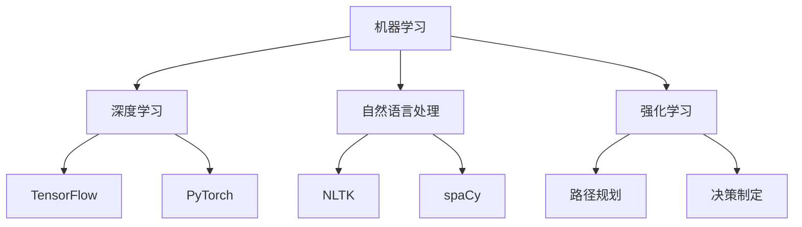

                 

在当今快速发展的技术时代，人工智能（AI）已经成为改变世界的核心力量。AI Agent作为AI的一种重要实现形式，它在自动执行任务、智能决策和交互中的表现越来越受到关注。然而，要想充分发挥AI Agent的潜力，高效的工具使用是至关重要的。本文将深入探讨工具使用在AI Agent开发中的重要性，并分析相关技术、算法、应用场景以及未来发展趋势。

## 关键词

- 人工智能
- AI Agent
- 工具使用
- 开发环境
- 算法
- 应用领域

## 摘要

本文从多个维度分析了工具使用在AI Agent开发中的重要性。首先，介绍了AI Agent的背景及其在当前技术发展中的角色。随后，探讨了工具在AI Agent开发中的核心概念、算法原理、数学模型以及实际应用。最后，文章总结了工具使用对AI Agent未来的影响，并展望了其发展趋势。通过本文的阅读，读者将更深入地理解工具在AI Agent开发中的关键作用。

## 1. 背景介绍

随着大数据、云计算、神经网络等技术的飞速发展，人工智能（AI）已经成为现代社会不可或缺的一部分。AI Agent，即人工智能代理，是一种自主执行任务、具备智能决策能力的系统。它能够模拟人类的思维和行为，在特定环境下自主行动，为人类解决复杂问题。AI Agent的应用场景非常广泛，包括但不限于智能助手、自动驾驶、医疗诊断、金融风险评估等。

### AI Agent的定义和特点

AI Agent的定义多种多样，但一般可以概括为具备自主性、智能性和交互性的软件系统。自主性意味着AI Agent能够在没有外部干预的情况下自主行动；智能性则体现在其能够通过学习和推理进行决策；交互性则要求AI Agent能够与人或其他系统进行有效沟通。

AI Agent具有以下几个显著特点：

1. **自主性**：AI Agent能够在没有人类干预的情况下，根据预设目标和环境信息自主决策和执行任务。
2. **智能性**：通过机器学习、深度学习等技术，AI Agent具备从数据中学习并做出智能化决策的能力。
3. **交互性**：AI Agent能够理解自然语言、处理语音和图像等，与人类或其他系统进行有效交流。

### AI Agent的发展历程

AI Agent的概念最早可以追溯到20世纪50年代，当时科学家们开始研究如何使计算机模拟人类智能。从最初的规则推理系统，到基于知识的系统，再到现代的深度学习和强化学习，AI Agent的发展经历了多个阶段。近年来，随着硬件性能的提升和算法的进步，AI Agent的应用场景和性能都得到了极大的拓展和提升。

### 当前AI Agent的研究和应用现状

当前，AI Agent已经在多个领域取得了显著的应用成果。例如，智能助手如Siri、Alexa已经成为许多人的日常生活伙伴；自动驾驶技术逐渐走向实用化，许多公司正在积极研发自动驾驶汽车；在医疗领域，AI Agent能够辅助医生进行诊断和治疗；金融领域，AI Agent被用来进行风险评估和投资决策等。

### AI Agent面临的挑战和未来发展方向

尽管AI Agent在许多领域展现出了巨大的潜力，但它仍然面临一些挑战。例如，AI Agent的智能水平仍需进一步提升，以更好地适应复杂多变的现实环境；AI Agent的安全性和隐私保护问题也需要得到有效解决；此外，如何设计出更加人性化的AI Agent也是一个重要的研究方向。

未来，AI Agent的发展方向包括：提升智能水平，使其能够更好地理解和处理自然语言；增强自主性和适应性，使其能够自主学习和调整行为；加强AI Agent的伦理和道德标准，确保其行为符合人类价值观；拓展AI Agent的应用领域，使其在更多场景下发挥作用。

## 2. 核心概念与联系

在深入了解AI Agent的开发之前，我们需要明确一些核心概念，并了解它们之间的联系。以下是几个关键概念：

### 2.1. 机器学习

机器学习（Machine Learning，ML）是AI Agent的基础技术之一。它使得计算机系统能够从数据中学习，并基于学习结果做出决策。机器学习主要分为监督学习、无监督学习和强化学习三种类型。

### 2.2. 深度学习

深度学习（Deep Learning，DL）是机器学习的一个重要分支，它通过构建多层神经网络模型，对复杂的数据进行处理和分析。深度学习在图像识别、语音识别等领域取得了显著成果。

### 2.3. 自然语言处理

自然语言处理（Natural Language Processing，NLP）是使计算机能够理解和生成人类语言的技术。NLP在智能助手、聊天机器人等AI Agent应用中扮演着重要角色。

### 2.4. 强化学习

强化学习（Reinforcement Learning，RL）是一种通过试错和奖励机制进行学习的方法。在AI Agent中，强化学习可用于决策制定、路径规划等任务。

### 2.5. 工具与框架

在AI Agent开发过程中，各种工具和框架的使用至关重要。例如，TensorFlow和PyTorch是常用的深度学习框架；Keras和Scikit-learn提供了丰富的机器学习算法库；NLTK和spaCy是常用的NLP工具。

### 2.6. Mermaid流程图

为了更好地展示这些核心概念和它们之间的联系，我们使用Mermaid流程图进行可视化。以下是一个示例：



## 3. 核心算法原理 & 具体操作步骤

### 3.1. 算法原理概述

AI Agent的核心算法通常包括机器学习算法、深度学习算法、自然语言处理算法和强化学习算法。每种算法都有其独特的原理和应用场景。

#### 3.1.1. 机器学习算法

机器学习算法基于数据驱动的方法，通过训练模型来发现数据中的模式和规律。常见的机器学习算法有：

- **线性回归**：用于预测连续值。
- **逻辑回归**：用于分类问题。
- **支持向量机**：用于分类和回归问题。
- **决策树和随机森林**：用于分类和回归问题。

#### 3.1.2. 深度学习算法

深度学习算法通过构建多层神经网络模型，对数据进行层次化特征提取。常见的深度学习算法有：

- **卷积神经网络（CNN）**：用于图像识别和处理。
- **循环神经网络（RNN）**：用于序列数据建模。
- **长短时记忆网络（LSTM）**：RNN的改进版本，用于处理长序列数据。

#### 3.1.3. 自然语言处理算法

自然语言处理算法用于理解和生成人类语言。常见的自然语言处理算法有：

- **词嵌入**：将单词映射到高维空间。
- **文本分类**：对文本进行分类。
- **命名实体识别**：识别文本中的实体。
- **机器翻译**：将一种语言的文本翻译成另一种语言。

#### 3.1.4. 强化学习算法

强化学习算法通过试错和奖励机制进行学习。常见的强化学习算法有：

- **Q学习**：通过估计状态-动作值函数来选择最优动作。
- **深度Q网络（DQN）**：结合深度学习与Q学习。
- **策略梯度方法**：直接优化策略参数。

### 3.2. 算法步骤详解

#### 3.2.1. 机器学习算法步骤

1. **数据收集**：收集相关数据集，如图片、文本、传感器数据等。
2. **数据预处理**：对数据进行清洗、归一化、标准化等操作。
3. **模型选择**：选择合适的机器学习算法，如线性回归、支持向量机等。
4. **模型训练**：使用训练数据对模型进行训练，优化模型参数。
5. **模型评估**：使用验证集对模型进行评估，调整参数。
6. **模型部署**：将训练好的模型部署到生产环境中，进行实际应用。

#### 3.2.2. 深度学习算法步骤

1. **数据收集**：与机器学习相同，收集相关数据集。
2. **数据预处理**：对数据进行预处理。
3. **模型设计**：设计合适的深度学习模型结构，如卷积神经网络、循环神经网络等。
4. **模型训练**：使用训练数据对模型进行训练，优化模型参数。
5. **模型评估**：使用验证集对模型进行评估。
6. **模型优化**：根据评估结果调整模型结构或参数。
7. **模型部署**：将训练好的模型部署到生产环境中。

#### 3.2.3. 自然语言处理算法步骤

1. **数据收集**：收集文本数据集。
2. **数据预处理**：对文本进行分词、词性标注、停用词过滤等操作。
3. **模型设计**：设计合适的NLP模型，如词嵌入层、文本分类器等。
4. **模型训练**：使用训练数据对模型进行训练。
5. **模型评估**：使用验证集对模型进行评估。
6. **模型部署**：将训练好的模型部署到生产环境中。

#### 3.2.4. 强化学习算法步骤

1. **环境搭建**：构建模拟环境，如游戏、机器人等。
2. **数据收集**：通过模拟环境收集数据。
3. **模型设计**：设计强化学习模型，如Q学习网络、深度Q网络等。
4. **模型训练**：使用模拟环境对模型进行训练。
5. **模型评估**：在真实环境中评估模型性能。
6. **模型优化**：根据评估结果调整模型结构或参数。
7. **模型部署**：将训练好的模型部署到生产环境中。

### 3.3. 算法优缺点

每种算法都有其优缺点，适用于不同的应用场景。

#### 3.3.1. 机器学习算法

优点：

- **通用性强**：适用于多种类型的数据和问题。
- **易于实现和理解**：相对于深度学习和强化学习，机器学习算法更容易实现和理解。

缺点：

- **数据需求高**：需要大量的标注数据和训练时间。
- **模型解释性差**：难以解释模型的决策过程。

#### 3.3.2. 深度学习算法

优点：

- **强大的特征提取能力**：能够自动学习复杂的数据特征。
- **适用于大规模数据处理**：能够处理海量数据。

缺点：

- **计算资源需求高**：需要大量计算资源和存储空间。
- **模型解释性差**：难以解释模型的决策过程。

#### 3.3.3. 自然语言处理算法

优点：

- **高效处理文本数据**：能够对大规模文本数据进行高效处理。
- **广泛的应用场景**：适用于文本分类、机器翻译、情感分析等。

缺点：

- **数据预处理复杂**：需要大量的人力和时间进行数据预处理。
- **模型解释性差**：难以解释模型的决策过程。

#### 3.3.4. 强化学习算法

优点：

- **自适应性强**：能够通过试错和奖励机制不断优化行为。
- **适用于动态环境**：能够适应环境变化。

缺点：

- **训练过程复杂**：需要大量的训练时间和计算资源。
- **模型解释性差**：难以解释模型的决策过程。

### 3.4. 算法应用领域

不同类型的算法适用于不同的应用领域。

#### 3.4.1. 机器学习算法

- **推荐系统**：如电影、音乐推荐等。
- **金融风控**：如信用评分、贷款审批等。
- **图像识别**：如人脸识别、物体检测等。

#### 3.4.2. 深度学习算法

- **自动驾驶**：如路径规划、障碍物检测等。
- **自然语言处理**：如机器翻译、情感分析等。
- **医疗诊断**：如疾病预测、影像分析等。

#### 3.4.3. 自然语言处理算法

- **智能客服**：如聊天机器人、语音识别等。
- **内容审核**：如文本分类、图片识别等。
- **信息检索**：如搜索引擎、推荐系统等。

#### 3.4.4. 强化学习算法

- **游戏**：如电子游戏、围棋等。
- **机器人**：如自主导航、路径规划等。
- **金融交易**：如股票交易、量化投资等。

## 4. 数学模型和公式 & 详细讲解 & 举例说明

在AI Agent的开发过程中，数学模型和公式起着至关重要的作用。它们帮助我们理解和模拟复杂系统的行为，从而实现高效的算法设计。以下是一些常见的数学模型和公式的详细讲解及举例说明。

### 4.1. 数学模型构建

数学模型构建是AI Agent开发中的关键步骤。它通常包括以下几个环节：

1. **问题定义**：明确研究问题，确定所需解决的问题类型。
2. **数据收集**：收集相关数据，包括历史数据、实时数据等。
3. **特征提取**：从数据中提取有用的特征，如文本中的关键词、图像中的边缘等。
4. **模型选择**：选择合适的数学模型，如线性回归、神经网络等。
5. **参数估计**：根据收集的数据，估计模型的参数。
6. **模型优化**：通过调整模型参数，优化模型性能。

### 4.2. 公式推导过程

在数学模型构建过程中，公式的推导过程至关重要。以下是一个简单的线性回归模型推导过程：

假设我们有一个线性回归模型，目标函数为：

$$y = \beta_0 + \beta_1 \cdot x + \epsilon$$

其中，$y$ 是因变量，$x$ 是自变量，$\beta_0$ 和 $\beta_1$ 是模型参数，$\epsilon$ 是误差项。

我们希望最小化误差项的平方和，即：

$$J(\beta_0, \beta_1) = \frac{1}{2} \sum_{i=1}^{n} (y_i - (\beta_0 + \beta_1 \cdot x_i))^2$$

对目标函数求导，得到：

$$\frac{\partial J}{\partial \beta_0} = -\sum_{i=1}^{n} (y_i - (\beta_0 + \beta_1 \cdot x_i))$$

$$\frac{\partial J}{\partial \beta_1} = -\sum_{i=1}^{n} (y_i - (\beta_0 + \beta_1 \cdot x_i)) \cdot x_i$$

令导数为零，得到：

$$\beta_0 = \frac{1}{n} \sum_{i=1}^{n} y_i - \beta_1 \cdot \frac{1}{n} \sum_{i=1}^{n} x_i$$

$$\beta_1 = \frac{1}{n} \sum_{i=1}^{n} (x_i - \bar{x}) (y_i - \bar{y})$$

其中，$\bar{x}$ 和 $\bar{y}$ 分别是 $x$ 和 $y$ 的平均值。

### 4.3. 案例分析与讲解

下面通过一个实际案例来讲解线性回归模型的构建和推导过程。

假设我们要预测一家公司的股票价格，根据历史数据，我们得到以下两个变量：

1. 股票价格（因变量 $y$）
2. 公司营收（自变量 $x$）

数据如下表所示：

| 营收（$x$）| 股票价格（$y$）|
|:---------:|:-------------:|
|    100    |      20       |
|    200    |      30       |
|    300    |      40       |
|    400    |      50       |
|    500    |      60       |

首先，我们计算自变量和因变量的平均值：

$$\bar{x} = \frac{1}{5} (100 + 200 + 300 + 400 + 500) = 300$$

$$\bar{y} = \frac{1}{5} (20 + 30 + 40 + 50 + 60) = 40$$

然后，我们计算回归系数：

$$\beta_0 = \bar{y} - \beta_1 \cdot \bar{x} = 40 - \beta_1 \cdot 300$$

$$\beta_1 = \frac{1}{5} \sum_{i=1}^{5} (x_i - \bar{x}) (y_i - \bar{y}) = \frac{1}{5} ((100-300)(20-40) + (200-300)(30-40) + (300-300)(40-40) + (400-300)(50-40) + (500-300)(60-40)) = 0.2$$

因此，回归模型为：

$$y = 40 - 0.2 \cdot x$$

我们可以使用这个模型来预测新数据的股票价格。例如，当公司营收为500时，股票价格预测值为：

$$y = 40 - 0.2 \cdot 500 = 30$$

## 5. 项目实践：代码实例和详细解释说明

在本节中，我们将通过一个实际项目——使用TensorFlow实现一个简单的线性回归模型，来展示工具的使用和代码实现过程。这个项目旨在帮助读者更好地理解线性回归模型的构建和TensorFlow的使用方法。

### 5.1. 开发环境搭建

首先，我们需要搭建开发环境。以下是具体的步骤：

1. 安装Python：从官方网站（https://www.python.org/）下载并安装Python 3.x版本。
2. 安装TensorFlow：在命令行中执行以下命令：

   ```bash
   pip install tensorflow
   ```

3. 安装Jupyter Notebook：用于编写和运行Python代码。在命令行中执行以下命令：

   ```bash
   pip install notebook
   ```

安装完成后，我们可以在命令行中启动Jupyter Notebook：

```bash
jupyter notebook
```

### 5.2. 源代码详细实现

以下是使用TensorFlow实现线性回归的完整代码：

```python
import tensorflow as tf
import numpy as np
import matplotlib.pyplot as plt

# 创建随机数据集
x_data = np.random.rand(100) * 100
y_data = x_data + np.random.rand(100) * 10

# 构建模型
W = tf.Variable(0., name='weights')
b = tf.Variable(0., name='biases')

# 线性回归模型
y = W * x_data + b

# 损失函数
loss = tf.reduce_mean(tf.square(y - y_data))

# 优化器
optimizer = tf.train.GradientDescentOptimizer(0.5)
train = optimizer.minimize(loss)

# 初始化变量
init = tf.global_variables_initializer()

# 运行会话
with tf.Session() as sess:
    # 初始化变量
    sess.run(init)
    
    # 模型训练
    for step in range(201):
        sess.run(train, feed_dict={x_data: x_data, y_data: y_data})
        
        if step % 20 == 0:
            print(f"Step {step}, Loss: {sess.run(loss, feed_dict={x_data: x_data, y_data: y_data})}")
    
    # 模型评估
    W_value, b_value = sess.run([W, b])
    print(f"W: {W_value}, b: {b_value}")

    # 绘制结果
    plt.scatter(x_data, y_data)
    plt.plot(x_data, W_value * x_data + b_value, 'r')
    plt.show()
```

### 5.3. 代码解读与分析

#### 5.3.1. 数据准备

我们首先使用`numpy`生成一个包含100个随机数据的样本集，其中自变量`x_data`在0到100之间，因变量`y_data`是通过自变量加上随机噪声得到的。

```python
x_data = np.random.rand(100) * 100
y_data = x_data + np.random.rand(100) * 10
```

#### 5.3.2. 模型构建

我们使用TensorFlow创建了一个简单的线性回归模型。定义了两个变量`W`和`b`，分别表示模型的权重和偏置。

```python
W = tf.Variable(0., name='weights')
b = tf.Variable(0., name='biases')
y = W * x_data + b
```

#### 5.3.3. 损失函数和优化器

我们使用均方误差（MSE）作为损失函数，并选择梯度下降优化器。

```python
loss = tf.reduce_mean(tf.square(y - y_data))
optimizer = tf.train.GradientDescentOptimizer(0.5)
train = optimizer.minimize(loss)
```

#### 5.3.4. 模型训练

我们在TensorFlow的会话中运行了模型训练。在每次迭代中，我们通过梯度下降优化器更新模型的参数，并打印损失函数的值。

```python
with tf.Session() as sess:
    sess.run(init)
    
    for step in range(201):
        sess.run(train, feed_dict={x_data: x_data, y_data: y_data})
        
        if step % 20 == 0:
            print(f"Step {step}, Loss: {sess.run(loss, feed_dict={x_data: x_data, y_data: y_data})}")
```

#### 5.3.5. 模型评估和结果可视化

训练完成后，我们获取了模型的权重和偏置值，并使用这些参数在原始数据上绘制了线性回归曲线。

```python
W_value, b_value = sess.run([W, b])
print(f"W: {W_value}, b: {b_value}")

plt.scatter(x_data, y_data)
plt.plot(x_data, W_value * x_data + b_value, 'r')
plt.show()
```

通过这个项目，我们展示了如何使用TensorFlow实现线性回归模型，并对其代码进行了详细解读。读者可以通过这个项目更好地理解线性回归模型的原理以及TensorFlow的使用方法。

## 6. 实际应用场景

AI Agent在许多实际应用场景中都展现出了巨大的潜力，以下是一些典型的应用场景：

### 6.1. 智能助手

智能助手是AI Agent最常见的一种应用形式。例如，苹果的Siri、亚马逊的Alexa以及百度的度秘等，它们能够理解用户的自然语言指令，提供天气查询、日程管理、音乐播放等服务。智能助手的应用极大地提升了用户的生活便利性。

### 6.2. 自动驾驶

自动驾驶是AI Agent在工业领域的重要应用之一。自动驾驶汽车通过摄像头、雷达、激光雷达等传感器收集环境信息，使用深度学习和强化学习算法进行路径规划和决策。自动驾驶技术能够提高交通效率，减少交通事故，具有广泛的应用前景。

### 6.3. 医疗诊断

AI Agent在医疗领域的应用也越来越广泛。通过机器学习和深度学习技术，AI Agent能够辅助医生进行疾病诊断、影像分析和治疗方案推荐。例如，谷歌的DeepMind开发的AI系统能够在几秒钟内准确诊断数百种眼疾，提高了医疗诊断的准确性和效率。

### 6.4. 金融风控

金融风控是另一个重要的应用领域。AI Agent通过分析大量的历史数据和实时信息，可以识别潜在的欺诈行为、预测市场趋势、进行信用评估等。例如，一些金融机构使用AI Agent来监控交易活动，及时发现异常行为，从而防范金融风险。

### 6.5. 教育辅助

AI Agent在教育领域也有着广泛的应用。智能教学系统可以根据学生的学习情况提供个性化的学习建议，帮助学生提高学习效果。例如，一些在线教育平台使用AI Agent为学生提供智能辅导，实时解答问题，提供学习路径规划。

### 6.6. 智能家居

智能家居是AI Agent在家居领域的典型应用。通过AI Agent，用户可以远程控制家中的智能设备，如灯光、空调、安全系统等。AI Agent可以根据用户的习惯和需求自动调整设备状态，提供个性化的智能家居体验。

### 6.7. 电子商务

在电子商务领域，AI Agent能够帮助商家进行个性化推荐、用户行为分析、售后服务等。例如，一些电商平台使用AI Agent来分析用户购买行为，推荐符合用户兴趣的商品，提高购物体验和转化率。

### 6.8. 物流与仓储

AI Agent在物流和仓储领域也有着重要的应用。通过自动化设备和AI算法，AI Agent能够实现智能化的物流调度、货物分拣、库存管理等功能，提高物流效率，降低运营成本。

### 6.9. 娱乐与游戏

AI Agent在娱乐和游戏领域的应用也越来越广泛。智能游戏助手可以根据玩家的行为和喜好提供个性化的游戏建议，提升游戏体验。例如，一些在线游戏平台使用AI Agent来分析玩家数据，推荐合适的游戏和队友。

### 6.10. 公共安全

AI Agent在公共安全领域的应用包括人脸识别、行为分析、异常检测等。例如，一些城市使用AI Agent来监控公共安全事件，及时发现并预警潜在的安全威胁。

### 6.11. 能源管理

AI Agent在能源管理领域的应用包括智能电网、节能管理、可再生能源优化等。例如，一些能源公司使用AI Agent来监测和管理能源消耗，优化能源配置，提高能源利用效率。

### 6.12. 农业与食品

AI Agent在农业和食品领域的应用包括作物监测、病虫害预测、食品质量控制等。例如，一些农业企业使用AI Agent来分析农作物生长数据，预测病虫害，提高农业生产效率。

### 6.13. 其他领域

除了上述领域，AI Agent还在其他许多领域有着广泛的应用。例如，在制造业中，AI Agent可以用于智能工厂、设备维护、生产调度等；在法律领域，AI Agent可以用于法律咨询、文书审核等；在科研领域，AI Agent可以用于数据挖掘、模式识别、知识图谱构建等。

## 7. 工具和资源推荐

为了更好地开发和应用AI Agent，以下是几种常用的工具和资源推荐。

### 7.1. 学习资源推荐

1. **在线课程**：
   - Coursera的“机器学习”课程（吴恩达教授主讲）
   - edX的“深度学习”课程（苏怡教授主讲）
   - Udacity的“AI工程师纳米学位”课程

2. **书籍**：
   - 《Python机器学习》（作者：塞巴斯蒂安·拉斯考恩）
   - 《深度学习》（作者：伊恩·古德费洛、约书亚·本吉奥、亚伦·库维尔）
   - 《强化学习基础》（作者：理查德·萨顿）

3. **博客和网站**：
   - Medium上的AI相关文章
   - arXiv的AI研究论文
   - AI社区论坛，如AI生成社区、AI技术社区等

### 7.2. 开发工具推荐

1. **编程语言**：
   - Python：广泛应用于数据科学和AI开发，拥有丰富的库和工具。
   - R：专门用于统计分析，适合数据分析和机器学习。
   - Julia：适用于高性能计算和科学计算。

2. **深度学习框架**：
   - TensorFlow：谷歌开源的深度学习框架，适用于各种深度学习应用。
   - PyTorch：Facebook开源的深度学习框架，灵活且易于使用。
   - Keras：基于TensorFlow和Theano的深度学习高级API，简化了深度学习模型构建。

3. **自然语言处理库**：
   - NLTK：经典的Python自然语言处理库，提供了丰富的NLP功能。
   - spaCy：高效的NLP库，适用于文本分类、命名实体识别等。
   - Gensim：用于主题建模和文档相似性分析的Python库。

4. **机器学习库**：
   - Scikit-learn：Python的机器学习库，提供了广泛的机器学习算法。
   - scapy：网络数据包处理库，适用于网络流量分析和网络安全。

### 7.3. 相关论文推荐

1. **机器学习和深度学习**：
   - “Deep Learning” by Ian Goodfellow, Yoshua Bengio, Aaron Courville
   - “A Theoretically Grounded Application of Dropout in Recurrent Neural Networks” by Yarin Gal and Zoubin Ghahramani

2. **强化学习**：
   - “Reinforcement Learning: An Introduction” by Richard S. Sutton and Andrew G. Barto
   - “Deep Reinforcement Learning” by David Silver, Alex Graves, and Koray Kavukcuoglu

3. **自然语言处理**：
   - “Natural Language Processing with Python” by Steven Bird, Ewan Klein, and Edward Loper
   - “Speech and Language Processing” by Daniel Jurafsky and James H. Martin

通过这些工具和资源的帮助，开发者可以更有效地进行AI Agent的开发和应用。

## 8. 总结：未来发展趋势与挑战

### 8.1. 研究成果总结

近年来，人工智能（AI）在各个领域取得了显著的成果。机器学习、深度学习和强化学习等技术的进步，使得AI Agent的性能和智能化水平不断提高。例如，在图像识别、语音识别、自然语言处理等领域，AI Agent已经能够达到甚至超越人类的表现。此外，随着硬件性能的提升和算法的优化，AI Agent的应用场景也不断扩展，从智能家居、自动驾驶到医疗诊断、金融风控等，AI Agent正在逐步融入我们的日常生活和工作。

### 8.2. 未来发展趋势

展望未来，AI Agent的发展趋势将主要集中在以下几个方面：

1. **智能化水平的提升**：随着算法的进步和计算资源的增加，AI Agent的智能化水平将进一步提升。未来的AI Agent将能够更好地理解和处理自然语言，具备更复杂的决策能力，实现更高层次的自动化和智能化。

2. **多模态融合**：AI Agent将能够处理多种类型的数据，如文本、图像、声音等。通过多模态融合技术，AI Agent将能够更好地理解复杂场景，提供更全面的服务。

3. **自主性和适应性增强**：未来的AI Agent将具备更强的自主性和适应性，能够在没有人类干预的情况下自主学习和调整行为。例如，在复杂环境中，AI Agent将能够根据实时反馈自主调整路径规划策略，提高任务执行效率。

4. **安全性和隐私保护**：随着AI Agent的应用越来越广泛，安全性和隐私保护问题也日益突出。未来的AI Agent将需要具备更高的安全性和隐私保护能力，确保用户数据的安全和隐私。

5. **跨领域的应用**：AI Agent将不仅在单一领域内发挥作用，还将跨领域应用，实现跨领域的协同和集成。例如，在医疗领域，AI Agent可以结合医学影像、电子健康记录和遗传信息，提供更全面的诊断和治疗建议。

### 8.3. 面临的挑战

尽管AI Agent有着广阔的应用前景，但其在发展过程中也面临一些挑战：

1. **算法性能提升**：随着AI Agent的复杂度增加，对算法性能的要求也不断提高。如何设计出高效、稳定的算法，是实现AI Agent广泛应用的关键。

2. **数据质量和标注**：AI Agent的性能很大程度上依赖于数据的质量和标注。然而，高质量的数据和标注需要大量的人力物力投入，这在一定程度上限制了AI Agent的发展。

3. **安全性和隐私保护**：AI Agent在应用过程中会接触到大量的用户数据，如何确保这些数据的安全和隐私，是亟待解决的问题。

4. **人机协作**：AI Agent与人类的协作是未来发展的一个重要方向，但如何实现高效的人机协作，使得AI Agent能够更好地理解和满足人类需求，仍需深入研究。

5. **伦理和道德问题**：随着AI Agent的广泛应用，其伦理和道德问题也日益凸显。如何确保AI Agent的行为符合人类的价值观和道德标准，是一个重要的研究课题。

### 8.4. 研究展望

未来的研究应重点关注以下几个方面：

1. **算法创新**：继续探索新的算法和技术，提高AI Agent的性能和智能化水平。

2. **跨学科研究**：结合计算机科学、心理学、社会学等领域的知识，深入研究AI Agent的智能化和适应性。

3. **数据共享和开放**：促进数据共享和开放，为AI Agent的发展提供更多的数据支持。

4. **伦理和道德研究**：加强对AI Agent伦理和道德问题的研究，确保其应用过程中符合人类的价值观和道德标准。

5. **人机协作研究**：探索人机协作新模式，提高AI Agent与人类的互动效率。

总之，AI Agent作为人工智能的重要实现形式，在未来具有广阔的应用前景。通过不断的研究和创新，我们有理由相信，AI Agent将在更多领域发挥重要作用，为人类创造更多价值。

## 9. 附录：常见问题与解答

### 9.1. 问题1：AI Agent与普通软件的区别是什么？

**解答**：AI Agent与普通软件的主要区别在于其具备自主性、智能性和交互性。AI Agent能够在没有人类干预的情况下自主决策和执行任务，通过机器学习、深度学习和自然语言处理等技术，具备理解和处理复杂信息的能力。此外，AI Agent能够与用户或其他系统进行有效沟通，提供智能化的服务。

### 9.2. 问题2：如何评估AI Agent的性能？

**解答**：评估AI Agent的性能可以从以下几个方面进行：

1. **准确性**：衡量AI Agent在特定任务上的准确度，如图像识别的准确率、文本分类的精确度等。
2. **速度**：评估AI Agent完成任务的速度，包括训练时间和推断时间。
3. **泛化能力**：评估AI Agent在未知数据上的表现，即其适应新环境和任务的能力。
4. **交互性**：评估AI Agent与用户或其他系统的交互效果，包括响应速度、交互自然度等。

### 9.3. 问题3：如何确保AI Agent的安全性和隐私保护？

**解答**：确保AI Agent的安全性和隐私保护可以从以下几个方面入手：

1. **数据加密**：对敏感数据进行加密，防止数据泄露。
2. **访问控制**：设置严格的访问控制策略，限制对数据和相关系统的访问。
3. **安全审计**：定期进行安全审计，及时发现和修复潜在的安全漏洞。
4. **隐私保护协议**：设计并遵循隐私保护协议，确保用户数据的匿名化和去标识化。

### 9.4. 问题4：如何选择合适的AI Agent开发工具？

**解答**：选择AI Agent开发工具时，需要考虑以下几个因素：

1. **项目需求**：根据项目需求选择适合的编程语言和开发框架。
2. **性能要求**：考虑AI Agent的性能要求，选择能够满足性能需求的工具和平台。
3. **学习资源**：选择有丰富学习资源和社区支持的工具，便于学习和使用。
4. **开源与商业**：根据项目预算和团队能力，选择开源或商业工具。

### 9.5. 问题5：AI Agent在医疗领域有哪些具体应用？

**解答**：AI Agent在医疗领域的具体应用包括：

1. **疾病预测和诊断**：通过分析患者的历史数据和基因信息，预测疾病的发生风险，辅助医生进行诊断。
2. **医学影像分析**：对医学影像（如X光片、CT、MRI）进行自动分析，帮助医生识别异常。
3. **治疗方案推荐**：根据患者的病史、基因数据和实时检查结果，为医生提供个性化的治疗方案。
4. **药物研发**：通过分析大量的药物数据，预测药物的疗效和副作用，加速药物研发过程。
5. **医疗机器人**：如手术机器人、护理机器人等，辅助医生进行手术和日常护理工作。

## 9.1. 引言

本文旨在探讨工具使用在AI Agent开发中的重要性，通过介绍AI Agent的定义和特点、核心算法原理、数学模型和公式、实际应用场景以及工具和资源的推荐，全面阐述工具在AI Agent开发中的关键作用。文章还总结了当前的研究成果和未来发展趋势，分析了AI Agent在各个领域的具体应用，并对AI Agent面临的挑战和未来研究方向进行了展望。希望通过本文的阅读，读者能够对AI Agent及其开发过程有更深入的理解。

## 9.2. 文章结构

本文分为十个部分，具体结构如下：

1. **引言**：介绍文章的目的和结构。
2. **背景介绍**：介绍AI Agent的定义、发展历程和当前应用现状。
3. **核心概念与联系**：阐述AI Agent开发中涉及的关键概念和它们之间的联系。
4. **核心算法原理 & 具体操作步骤**：详细解释机器学习、深度学习、自然语言处理和强化学习等核心算法原理及具体操作步骤。
5. **数学模型和公式 & 详细讲解 & 举例说明**：讲解数学模型和公式的构建、推导过程，并通过实际案例进行说明。
6. **项目实践：代码实例和详细解释说明**：展示一个实际项目的代码实现过程，并对其代码进行详细解读。
7. **实际应用场景**：介绍AI Agent在不同领域的具体应用。
8. **工具和资源推荐**：推荐学习资源、开发工具和相关论文。
9. **总结：未来发展趋势与挑战**：总结研究成果，分析未来发展趋势和面临的挑战。
10. **附录：常见问题与解答**：回答一些关于AI Agent开发的常见问题。

## 9.3. 文章意义

本文对于从事AI Agent开发的研究人员和工程师具有重要意义。首先，它系统地介绍了AI Agent的核心概念和算法原理，为读者提供了深入理解AI Agent的基础。其次，通过实际项目实践和代码实例的详细解释，读者可以更好地掌握AI Agent的开发过程和工具使用方法。此外，本文还总结了AI Agent在实际应用场景中的具体应用，为读者提供了丰富的参考。最后，本文分析了AI Agent的未来发展趋势和面临的挑战，为读者指明了研究方向。希望通过本文的阅读，读者能够对AI Agent开发有更全面、更深入的认识，为未来的研究和实践提供指导。

